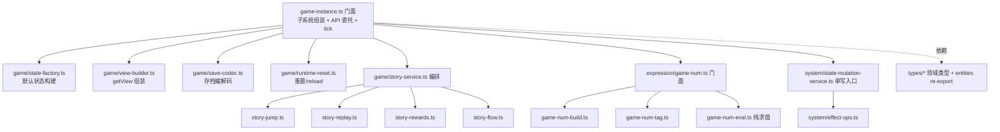

## 产品概述

对 ACProgram 放置游戏引擎进行架构体检与重构：识别超大单体文件（上帝类）与不合理分层，制定并执行拆分方案，同步建立配套的新文档体系，提升可维护性与可扩展性。

## 核心功能

- **架构诊断**：梳理引擎 71 个文件中 11 个超 300 行大文件，点明职责混淆：`game-instance.ts`(915行) 上帝类、`types/entities.ts`(959行) 类型聚合过度、`story-service.ts`(780行) 多职责混合、`game-num.ts`(672行) 构建/求值/tag 混合、`state-mutation-service.ts`(534行) 方法过载、`controller.ts`(967行) UI 集成门面、`tooltip.ts`(787行) 混入揭示诊断逻辑
- **引擎拆分**：按职责拆分 game-instance（状态工厂/视图构建/存档编解码/运行时重置）、entities（领域类型文件 + re-export 兼容）、story-service（流程/跳转/重读/奖励）、game-num 系列（构建/tag 维护）、state-mutation（效果 op 分支）
- **UI 拆分**：controller 按刷新策略/弹窗/面板桥接拆分，tooltip 按渲染/揭示/强化诊断拆分
- **新文档体系**：docs-824 升级为唯一活跃文档集，新增架构诊断与重构规范，归档 docs-818，同步更新 AGENTS.md
- **验证**：每批拆分后 `npm test` 与 `npx tsc --noEmit` 通过，运行时行为零变化

## 技术栈

- 现有 TypeScript strict + Vite + Vitest，不引入新依赖
- 重构依赖：LSP 符号引用分析（拆前确认调用点）、现有 re-export 兼容模式（`extra/index.ts` 先例）
- 遵守 AGENTS.md 纪律：单一写入口、事件驱动、测试先行、不做存档迁移

## 实现思路

采用「先诊断、后拆分、再归档」三段式：先产出架构诊断报告（记录问题基线），按「类型层 → 门面 → 服务层 → 数值/状态层 → UI 层」顺序分批拆分（类型层无行为风险最先做，UI 最后），每批独立验证；全部完成后统一收尾文档体系。拆分本质是**纯移动代码不改行为**：拆出的模块为同包私有实现，对外保持原导入路径不变（`from './types'` 等），规避大规模调用点改动。

### 关键决策

- **game-instance.ts(915)**：保留门面职责（子系统组装 + 公开 API 委托 + tick 编排）；拆出 `createDefaultState`→`game/state-factory.ts`、`getView` 视图组装→`game/view-builder.ts`、存档序列化→`game/save-codec.ts`、resetRuntime/reload 重置→`game/runtime-reset.ts`
- **types/entities.ts(959)**：按领域拆为 `world.ts`（Init/Area/Spot/Reveal）、`content.ts`（Story/Item/DropTable/Enhancement）、`trigger.ts`（Trigger/Affector）、`datapack.ts`（Datapack 聚合）；`entities.ts` 变薄为 re-export 兼容层（沿用 extra/index.ts 模式，`from './types'` 公共面不变）
- **story-service.ts(780)**：拆 `story-flow.ts`（start/advance/clickSend 主流程）、`story-jump.ts`（goto/insert 跳转链与返回栈）、`story-replay.ts`（重读/守卫）、`story-rewards.ts`（完结奖励）；service 保留游标持有与编排
- **game-num.ts(672) + game-num-eval.ts(418)**：拆 `game-num-build.ts`（buildAll 树构建）、`game-num-tag.ts`（tag 效果维护 + Affector 桥接）；game-num.ts 保留索引/缓存/evaluate 门面；game-num-eval.ts 保持纯求值不动
- **state-mutation-service.ts(534)**：拆 `system/effect-ops.ts`（applyEffects 各 op 分支执行）；类本体保留单一写入口方法门面，不破坏 AGENTS.md 纪律
- **init-service.ts(437)**：拆 `init-mount.ts`（mountInitTriggers 专属 Trigger 挂载）
- **controller.ts(967)**：拆 `controller-core.ts`（刷新策略/生命周期）、`controller-modals.ts`（弹层弹窗）、`controller-panels.ts`（面板桥接）；controller.ts 保留事件绑定编排
- **tooltip.ts(787)**：拆 `tooltip-reveal.ts`（揭示阶段计算）、`tooltip-enhancement.ts`（强化诊断）；tooltip.ts 保留渲染组合

### 性能与可靠性

- 拆分是机械搬移，不改变 tick 热路径（game-num 求值递归、事件派发）调用序列，无额外间接层开销
- 拆前用 LSP 引用分析确认每个移动符号的全部调用点；拆后每批跑 `npm test` + `npx tsc --noEmit` + `npm run gen:schema`（若动 types）三件套
- 大测试文件（game-instance.test.ts 1000 行、story-jump.test.ts 904 行）按新模块结构同步拆分为多个测试文件，镜像 src/ 目录

### 文档体系设计

- docs-818 顶部加「已归档」声明，保留为历史参照
- docs-824 扩为唯一活跃体系：新增 `05-architecture-review.md`（诊断基线）、`06-refactoring-guide.md`（拆分规范：何时拆/如何拆/兼容纪律），更新 `01-file-composition.md`（拆分后映射）与 `00-README.md`（导航）
- AGENTS.md 文档指引改指向 docs-824

## 架构设计

拆分后目标架构（引擎侧）：



## 目录结构

```
src/engine/
├── game-instance.ts            [MODIFY] 瘦身为门面：组装 + 委托 + tick
├── game/
│   ├── state-factory.ts        [NEW] createDefaultState 等默认状态纯函数
│   ├── view-builder.ts         [NEW] getView/createUIContext 视图组装
│   ├── save-codec.ts           [NEW] save/load 序列化与反序列化
│   ├── runtime-reset.ts        [NEW] resetRuntime/reload 状态重置逻辑
│   ├── story-flow.ts           [NEW] 剧情启动/推进/发送主流程
│   ├── story-jump.ts           [NEW] goto/insert 跳转链与返回栈
│   ├── story-replay.ts         [NEW] 重阅读/分歧守卫
│   ├── story-rewards.ts        [NEW] 完结奖励结算
│   ├── init-mount.ts           [NEW] 世界线专属 Trigger 挂载
│   ├── story-service.ts        [MODIFY] 保留游标持有与编排
│   └── init-service.ts         [MODIFY] 委托 init-mount，保留生命周期
├── types/
│   ├── world.ts                [NEW] InitDef/AreaDef/SpotDef/RevealTriggerDef
│   ├── content.ts              [NEW] StoryDef/ItemDef/DropTableDef/EnhancementDef
│   ├── trigger.ts              [NEW] TriggerDef/AffectorPackDef
│   ├── datapack.ts             [NEW] Datapack 聚合类型
│   ├── entities.ts             [MODIFY] 变薄为 re-export 兼容层
│   └── index.ts                [MODIFY] 同步导出
├── expression/
│   ├── game-num-build.ts       [NEW] buildAll 与 gain 树构建
│   ├── game-num-tag.ts         [NEW] tag 效果维护 + Affector 桥接
│   ├── game-num.ts             [MODIFY] 保留索引/缓存/evaluate 门面
│   └── game-num-eval.ts        [MODIFY] 仅更新导入，求值逻辑不动
├── system/
│   ├── effect-ops.ts           [NEW] applyEffects 各 op 分支执行
│   └── state-mutation-service.ts [MODIFY] 保留单一写入口方法门面
src/ui/
├── controller.ts               [MODIFY] 保留事件绑定与编排
├── controller-core.ts          [NEW] 刷新策略/生命周期
├── controller-modals.ts        [NEW] 弹层弹窗管理
├── controller-panels.ts        [NEW] 面板桥接
└── components/
    ├── tooltip.ts              [MODIFY] 保留渲染组合
    ├── tooltip-reveal.ts       [NEW] 揭示阶段计算
    └── tooltip-enhancement.ts  [NEW] 强化诊断内容
tests/engine/                   [MODIFY] 大测试文件按新模块拆分镜像
docs-824/
├── 00-README.md                [MODIFY] 更新导航与阅读路径
├── 01-file-composition.md      [MODIFY] 更新拆分后文件映射
├── 05-architecture-review.md   [NEW] 架构诊断基线报告
└── 06-refactoring-guide.md     [NEW] 拆分规范与兼容纪律
docs-818/00-README.md           [MODIFY] 顶部加「已归档」声明
AGENTS.md                       [MODIFY] 文档指引改指 docs-824
```

## 关键代码结构

entities.ts 拆分后的兼容层模式（各拆分模块的核心契约，沿用 extra/index.ts 先例，保证全项目 `from './types'` 与 `from './entities'` 导入不受影响）：

```typescript
// src/engine/types/entities.ts — 变薄为兼容层
export * from './world';
export * from './content';
export * from './trigger';
export * from './datapack';
export type { /* 仅需保留的跨领域别名 */ } from './character';
```

```typescript
// src/engine/game/state-factory.ts — 默认状态构建（从 game-instance 原样搬移）
import type { PlayerState } from '../types';
export function createDefaultState(): PlayerState;
```

> 其余拆分（story-jump / game-num-build / effect-ops / controller-modals 等）均为同类「搬移 + 同包导入」模式，无新接口契约；不确定的符号边界在拆前用 LSP 引用分析确认，不臆造签名。

## Agent 扩展

### SubAgent

- **code-explorer**
- 用途：每批拆分前分析目标文件内部段落与跨文件依赖，确认可移动符号的边界与调用点，产出耦合关系清单
- 预期产出：每个超大文件（game-instance/entities/story-service/game-num/controller/tooltip）的拆分切割点清单，供执行时精确搬移

### Skill

- **lsp-code-analysis**
- 用途：拆前对每个待移动符号做引用分析（find references / call hierarchy），确认拆出后无遗漏调用点；拆后复检导入完整性
- 预期产出：每个移动符号的完整调用点列表与拆后 tsc 零新增错误的验证结论