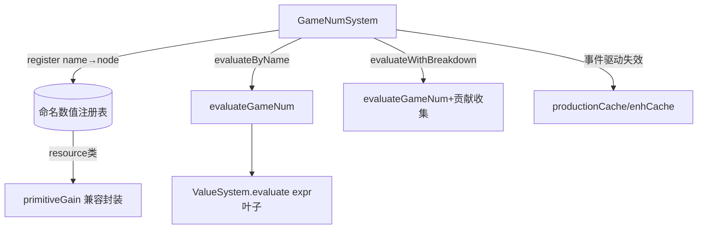

## 用户需求

为 GameNum 数值系统补充更丰富的接口操作，聚焦于两个方向：算子扩展与溯源分解 API；并将系统从"仅资源产出"泛化为通用数值容器。

## 产品概述

当前 GameNum 仅支持 `add`/`mul` 两个组合算子，且只服务资源产出。本需求将其升级为可注册任意命名数值（产出/成本/上限/概率等）的通用计算容器，并新增一组数学/条件算子，同时提供可输出每个子节点贡献明细的溯源分解能力，用于 tooltip 与调试展示。

## 核心特性

- **算子扩展**：在 GameNum 节点层新增 `sub`/`div`/`min`/`max`/`clamp`/`pow`/`floor`/`ceil`/`round`/`cond`（条件选择）等组合/叶子算子，保持无环图结构。
- **ValueExpression 算子扩展**：在表达式层补充 `add`/`div`/`min`/`max`/`clamp` 等，使 `expr` 叶子可表达更复杂的计算。
- **通用数值注册**：按命名（`name`）注册任意数值节点树（不再局限于资源），`evaluateByName(name,state)` 统一求值；保留 `evaluateResourceGain`/`evaluateSpotYield` 作为便捷封装。
- **溯源分解 API**：`evaluateWithBreakdown(name,state)` 返回 `{ value, contributions: [{id, kind, value, label?, children?}] }`，递归展开子节点贡献，供 tooltip 展示"base 5 × 强化 1.5 = 15"。
- **缓存与失效泛化**：算子引入的新依赖源（如 `cond` 读资源、读 Extra）须接入现有事件驱动失效或泛化依赖扫描，避免缓存击穿。
- **文档与测试同步**：更新 `tests/engine/game-num.test.ts` 与 docs-818 相关文档，按 AGENTS.md 纪律同步 Schema（如需改 `src/engine/types/` 则 `npm run gen:schema`）。

## 技术栈

- 语言：TypeScript（项目既有，无新增依赖）
- 引擎：`src/engine/expression/*` 既有 GameNum 求值体系
- 测试：vitest（既有 `tests/engine/game-num.test.ts`）
- 不变更 UI 层消费接口语义（controller/tooltip/production/header 仅调 `evaluateResourceGain`/`evaluateSpotYield`）

## 实现方案

### 整体策略

在保持"无环图节点树 + 懒求值 + 事件驱动缓存失效"既有架构的前提下：

1. 扩展 `GameNum` 联合类型与 `evaluateGameNum` 的 switch，新增数学/条件算子（纯函数式，无副作用）。
2. 扩展 `ValueExpression` 联合类型与 `ValueSystem.evaluate`，补齐表达式层算子。
3. 将 `GameNumSystem` 的"资源 gain 树"泛化为"命名数值注册表"：`gains: Map<string, GameNum>` 的 key 从 resource 扩展为任意 `name`；新增 `register(name, node)` / `evaluateByName(name, state)`，`getResources()` / `evaluateResourceGain()` 退化为基于约定前缀或显式 resource 集合的便捷封装。
4. 新增 `evaluateWithBreakdown`，复用 `evaluateGameNum` 的递归结构但额外收集每层 `id/kind/value`，与缓存兼容（breakdown 不进 `productionCache`，仅最终值走既有缓存路径）。

### 关键技术决策

- **算子落地位置**：组合算子（`sub/div/min/max/clamp/pow/floor/ceil/round`）作为 `GameNum` 新 kind，在 `evaluateGameNum` 中处理；条件选择 `cond` 采用 `{ kind:'cond', if: GameNum, then: GameNum, else: GameNum }` 或复用 `Condition` 求值（避免重复造条件系统）。
- **无环保证**：注册时校验 DAG（仅允许引用已注册/内联子节点，禁止反向引用同树祖先）；由于全部由 `buildXxx`/Datapack 声明构造，天然无环，仅对运行时 `register` 做轻量校验。
- **复用而非新建**：`managerBonus`/`tagMultiplier` 冻结节点保留（恒 0/1）以兼容现有测试断言；新算子不影响既有 primitiveGain 结果（测试值 7/15/10/42 须保持）。
- **缓存失效泛化**：新增 `cond`/`clamp` 若读 `res`/`data`，复用既有 `mayReadResources()` 静态扫描（`exprReadsResource` 扩展到新算子），无需新增事件订阅；不改变现有事件清单。

### 性能与可靠性

- 新增算子为 O(子节点数) 递归，无额外遍历；`evaluateWithBreakdown` 与 `evaluate` 同复杂度，仅在 tooltip 触发时使用，不影响 Tick 热路径（Tick 仍走 `evaluateResourceGain` + `productionCache`）。
- 静态资源依赖扫描扩展后，避免 `resourceChanged` 误清/漏清缓存。

## 实现要点（防回归）

- 保留 `buildSpotProduction` 既有形状与 `id` 约定（`spot:`/`owned:`/`baseLine:`/`enh:` 等），现有测试逐 id/kind 断言必须全部通过。
- `evaluateWithBreakdown` 的 contribution 顺序与子节点顺序一致，便于 tooltip 稳定渲染。
- 若新增 `ValueExpression` 算子，需同步 `value-system.ts` 的 `evaluate` 与 `exprReadsResource` 扫描（后者在 `game-num.ts`）。
- 改 `src/engine/types/expression.ts` 的 `ValueExpression`/`ConditionTarget` 后必须 `npm run gen:schema` 并通过 `engine-schema.sync.test.ts`。

## 架构设计



保持既有分层：System 持有注册表与缓存 → 纯函数求值层（`game-num-eval.ts`）→ 底层 `ValueSystem`。

## 目录结构与文件

```
src/engine/types/expression.ts      # [MODIFY] 扩展 ValueExpression 联合类型(add/div/min/max/clamp 等)
src/engine/expression/value-system.ts # [MODIFY] evaluate 支持新表达式算子；evaluateValue 已覆盖
src/engine/expression/game-num-eval.ts # [MODIFY] GameNum 联合类型新增算子 kind；evaluateGameNum 新增分支；新增 evaluateWithBreakdown
src/engine/expression/game-num.ts   # [MODIFY] gains Map 泛化为命名注册表；新增 register/evaluateByName；扩展 exprReadsResource 扫描；保留 buildAll/evaluateResourceGain 便捷封装
tests/engine/game-num.test.ts      # [MODIFY] 同步新增算子与 breakdown 测试；保留既有树形状断言
docs-818/03-engine-subsystems.md   # [MODIFY] 补充 GameNum 泛化与算子说明
docs-818/07-data-pack-system.md    # [MODIFY] 补充 Datapack 声明数值树约定（如涉及）
docs-818/08-code-map.md            # [MODIFY] 更新文件职责映射
tools/datapack-editor/schema/editor-extras.ts # [MODIFY] 若类型变更则在 overrides 兜底
```

## 关键代码结构（新增算子契约）

```ts
// game-num-eval.ts — 新增节点 kind（节选）
export type GameNum =
  | { id: string; kind: 'const'; value: number }
  | { id: string; kind: 'expr'; expr: ValueExpression }
  | { id: string; kind: 'add' | 'sub' | 'mul' | 'div' | 'min' | 'max' | 'pow'; children: GameNum[] }
  | { id: string; kind: 'clamp'; min: GameNum; value: GameNum; max: GameNum }
  | { id: string; kind: 'floor' | 'ceil' | 'round'; child: GameNum }
  | { id: string; kind: 'cond'; test: GameNum; then: GameNum; else: GameNum }
  | { id: string; kind: 'owned'; spotId: string }
  | { id: string; kind: 'levelLinear'; spotId: string }
  | { id: string; kind: 'managerBonus'; spotId: string }
  | { id: string; kind: 'tagMultiplier'; spotId: string }
  | { id: string; kind: 'enhancementMultiplier'; spotId: string }
  | { id: string; kind: 'affectorFlows'; resource: string };

export interface Contribution {
  id: string;
  kind: string;
  value: number;
  label?: string;
  children?: Contribution[];
}
export interface BreakdownResult { value: number; contributions: Contribution[]; }
```

## Agent Extensions

### SubAgent

- **code-explorer**
- Purpose: 在重构前系统性核查所有 GameNum/ValueExpression 调用点与树形状依赖，确认泛化注册表改动不影响 UI 消费层与 tick-system。
- Expected outcome: 产出受影响文件清单与树形状断言清单，确保 plan 的防回归范围完整。