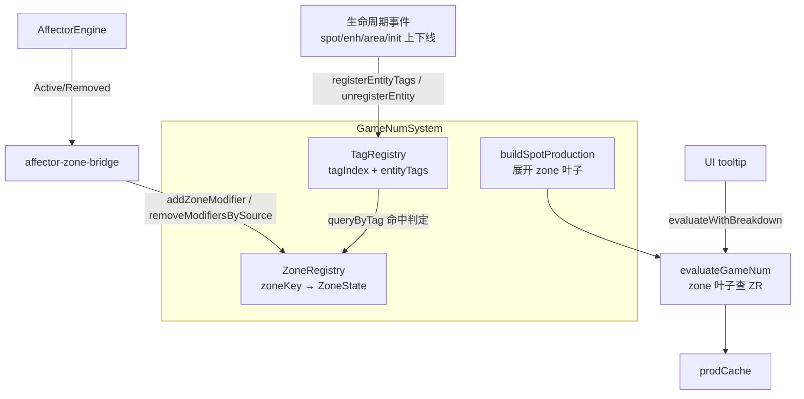

## 用户需求

为 GameNum 数值系统提供「指定区（Zone）的数值构建与操作」服务，作为后续 Affector 按 Tag 重写的支撑底座。GameNum 自身维护乘区数据，并对外暴露快速查询/构造任意区的 API，包装给 Affector 等外部系统调用。

## 产品概述

当前 GameNum 的 Spot 产出树形状写死，`managerBonus`/`tagMultiplier` 两个冻结占位节点恒返回 0/1，加成来源只能靠改引擎代码；Affector 的加成只有 `addResource` 一条合流路径，无法表达按 Tag 的乘区加成。本次将 GameNum 升级为持有「运行时 Tag 注册表 + 乘区（Zone）表」的数值中枢：任意实体上线时把自身 Tag 注册进表，Affector 把按 Tag 的加成写成 Zone 修饰器，产出树在求值时按 Tag 树状聚合命中的修饰器。

## 核心特性

- **运行时 Tag 注册表**：泛化现有 spot↔enhancement 反向索引，形成「Tag → 实体集合」与「实体 → Tag 列表」双向索引；支持 Init / Area / Spot / Enhancement 四类作用域实体在生命周期事件中注册与注销；Tag 保持树状语义（父 Tag 统辖子 Tag）。
- **乘区（Zone）模型**：一个区由「作用域 + 作用域 ID + Tag 过滤 + 资源过滤 + 乘区标识」唯一标定；区内聚合四类修饰效果——直接加成（加和）、通用乘区加成（连乘）、自定义乘区加成（按乘区标识分组连乘）、乘区上下限变动（夹取边界收窄/放宽）。
- **区构建与操作 API**：构造某区的数值节点、注册/移除区修饰器、按名或按区求值、按 Tag 快速查询命中的区与实体，并可输出每层贡献明细用于提示与调试。
- **三层存活**：修饰器支持全局常驻、随当前存档（Init）存活、临时快照三种生命周期，随对应事件自动清理。
- **产出树重构**：移除 `managerBonus`/`tagMultiplier` 冻结占位节点，Spot 产出树改由「直接加成区 + 通用乘区 + 自定义乘区 + 上下限夹取」展开，且在无任何修饰器时数值结果与当前完全一致。
- **Affector 包装层**：Affector 激活时把按 Tag 的加成声明转译为 Zone 修饰器写入 GameNum，失活时撤销；现有 `addResource` 合流路径保持不变。
- **溯源与文档测试同步**：区求值可输出贡献明细；同步更新 GameNum 测试与工程文档。

## 技术栈

- 语言：TypeScript（项目既有，零新增依赖）
- 引擎目录：`src/engine/expression/*`（GameNum 求值体系）、`src/engine/core/tag.ts`（Tag 树语义）、`src/engine/effect/affector-engine.ts`（Affector）
- 测试：vitest（`tests/engine/game-num.test.ts` 等）
- 协议同步：`npm run gen:schema` + `tools/datapack-editor/schema/engine-schema.sync.test.ts`（仅在改动 `src/engine/types/**` 时触发）

## 实现方案

### 整体策略

分层落地，把「Tag 索引」「Zone 表」「节点求值」「Affector 转译」四件事解耦：

1. **新增 Tag 运行时注册表模块**（`src/engine/expression/tag-registry.ts`）：纯数据结构 + 查询，双向索引 `tagIndex: Map<tagKey, Set<entityKey>>` 与 `entityTags: Map<entityKey, TagPath[]>`。`entityKey` 采用 `scope:id` 形式（`spot:credit_printer`、`enh:xxx`、`area:xxx`、`init:xxx`）。查询命中复用 `src/engine/core/tag.ts` 的 `matchesTag(declared, query)` 保持父统辖子语义；为避免每次查询 O(全表) 扫描，索引按 Tag 路径的**每一级前缀**都登记一次（`['field']`、`['field','combat']` 都指向该实体），使 `queryByTag` 退化为 O(1) Map 命中 + 结果集合并。
2. **新增 Zone 表模块**（`src/engine/expression/zone-registry.ts`）：`zoneKey(spec)` 序列化为稳定字符串键；`Map<zoneKeyStr, ZoneState>`，`ZoneState = { flat: Modifier[]; general: Modifier[]; custom: Map<multiplierId, Modifier[]>; bounds: Map<multiplierId|'general', {min,max}> }`。修饰器带 `id` / `source` / `life`（`'global' | 'init' | 'snapshot'`）/ `value: number | ValueExpression`。按 `life` 维护三个 `Set<modifierId>` 便于批量清理（`clearByLife`），按 `source` 维护 `Map<sourceId, modifierId[]>` 便于 Affector 撤销时 O(k) 移除，避免全表扫描。
3. **GameNum 节点扩展**（`game-num-eval.ts`）：新增 `zone` 叶子节点 `{ id, kind: 'zone', zone: ZoneSpec, part: 'flat' | 'general' | 'custom' }`，求值时通过 `deps.zones`（新增依赖项）查表聚合：`flat` 求和、`general`/`custom` 连乘，并按 `bounds` 夹取。同时删除 `managerBonus` / `tagMultiplier` 两个分支与联合成员。`evaluateGameNumBreakdown` 同步新增 `zone` 分支，label 输出区键便于 tooltip 溯源。
4. **GameNumSystem 编排层**（`game-num.ts`）：持有 `TagRegistry` + `ZoneRegistry` 实例，暴露区 API（`buildZoneNode` / `addZoneModifier` / `removeZoneModifier` / `removeModifiersBySource` / `evaluateZone` / `queryZones` / `queryEntitiesByTag` / `registerEntityTags` / `unregisterEntity` / `clearModifiersByLife`）。`buildSpotProduction` 改为展开 `mul(owned, flatLine, generalZone, customZones..., enhancementMultiplier)`，其中 `flatLine = add(base, levelLinear, zone-flat)`。
5. **Affector 转译层**（`src/engine/effect/affector-zone-bridge.ts`）：把 Affector 实例的按 Tag 加成声明（新增 `AffectorEffect.zoneModifiers?: ZoneModifierDecl[]`）在实例转入 Active 时写入 Zone 表（`source = affectorInstanceId`），转出 Active/Removed 时按 source 撤销。Affector 现有 `addResource` 合流路径**完全不动**（零回归）。

### 关键技术决策

- **区数据放在 System 层运行时表，不进 PlayerState**：AGENTS.md 明令「不写存档迁移代码」，且 Zone 修饰器完全可由 Affector 实例状态 + Tag 表在加载后重建（幂等），因此 Zone 表是纯派生运行时缓存，不参与存档，避免版本兼容负担。`life='init'` 的修饰器在 `startNewGame`/`loadGame` 时清空并由 Affector 重放。
- **Tag 前缀展开索引 vs 查询时线性 matchesTag**：前者写入时 O(路径深度)、查询 O(1)；后者写入 O(1)、查询 O(实体数×Tag 数)。产出求值在 Tick 热路径每帧调用，选择前缀展开索引（写少读多），并把 `matchesTag` 保留作为语义单测的对照实现。
- **区节点是叶子而非子树**：区内修饰器数量运行时可变，若展开为静态子树则每次增删都要重建产出树并击穿 `prodCache`。改为叶子 + 查表，树形状恒定，增删修饰器只需 `invalidateProduction()`，与现有事件驱动失效机制天然一致。
- **数值等价保证**：`flat` 区空集返回 0（加法单位元），`general`/`custom` 区空集返回 1（乘法单位元），`bounds` 缺省为 `[-Infinity, +Infinity]`。因此移除冻结节点后，无修饰器场景下 primitiveGain 结果与现状严格一致（现有 7/15/10/42 等断言不变）。
- **复用而非新建缓存**：区求值结果并入现有 `prodCache`（spot 前缀 mul 节点缓存），修饰器增删只调 `invalidateProduction()`；`enhancementMultiplier` 与 `enhCache` 保持原样不动，降低爆炸半径。
- **不引入新条件系统**：区的 Tag/资源过滤在 `ZoneSpec` 内声明式表达，命中判定复用 Tag 前缀索引，不新造条件 DSL（YAGNI）。

### 性能与可靠性

- Tag 查询 O(1) Map 命中；区求值 O(该区修饰器数)，热路径受 `prodCache` 保护，稳态下每 Tick 每 Spot 一次缓存命中。
- 修饰器按 `source` / `life` 建反向索引，撤销与批量清理均 O(k)，不做全表扫描。
- 除零/非法值防护：`bounds` 夹取前校验 `min <= max`，否则回落为不夹取并记一次告警（沿用现有引擎日志约定，不打印大对象、不刷屏）。
- 幂等注册：`registerEntityTags` 重复调用先移除旧记录再写入，避免索引重复膨胀。

## 实现要点（防回归）

- Spot 产出树的既有节点 `id` 前缀约定（`spot:` / `owned:` / `baseLine:` / `enh:`）必须保留，`prodCache` 依赖 `SPOT_NODE_PREFIX` 判定；新增区节点用新前缀（如 `zone:`）。
- 移除 `managerBonus` / `tagMultiplier` 后需全仓搜索引用点（`game-num.ts` 构树、`game-num-eval.ts` 求值与 breakdown、`tests/engine/game-num.test.ts` 形状断言、docs-818 文档表格），逐一同步。
- `managerChanged` 事件订阅在冻结节点移除后若无消费者，保留订阅但改为仅 `invalidateProduction()`，不要顺手删除（后续 Manager 机制会回来）。
- 若 `AffectorEffect` / `EffectOp` 等 `src/engine/types/**` 类型有改动，必须执行 `npm run gen:schema`，并在 `tools/datapack-editor/schema/editor-extras.ts` 兜底新字段，跑通 `engine-schema.sync.test.ts`。
- 生命周期事件接入前先确认事件名实际存在（Init/Area 进出事件需在 `src/engine/core/event-bus.ts` 或 game-instance 中核实），不存在则通过 `StateMutationService` 已有写入口回调接入，不新造事件。
- `tests/engine/passive-pool.test.ts:584` 存在与本任务无关的既有失败，不在本次范围内修复，但不得引入新失败。

## 架构设计

分层不变：System 层持索引/缓存生命周期 → 纯函数求值层（`game-num-eval.ts`）→ 底层 `ValueSystem`。新