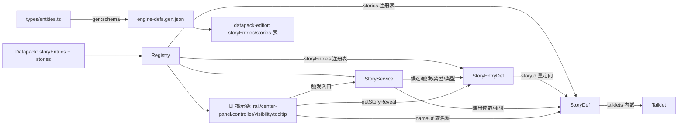

## 产品概述

将当前"剧情"数据结构中耦合的三种职责彻底分离：

- **Entry（ActiveStoryEntry / PassiveStoryEntry）**：故事触发入口，只负责"何时何地可触发"与"入口揭示"（triggerCondition / availableInits / revealTriggers / weight / cooldown / completionReward）
- **Story（演出本体）**：纯演出内容（name / talklets / extra），不含任何触发与揭示逻辑，仅保留自身 Id 记录语义（本期不实现重阅读系统，仅预留概念）
- **Talklet（微小的演示片段）**：内嵌于 Story 的独立命名类型（speaker / text / choices / effects / sendText / clickWork），无 id、不可跨故事复用

## 核心功能

- 引擎类型层：`StoryDef` 精简约简为纯演出；新增 `ActiveStoryEntry` / `PassiveStoryEntry` / `StoryEntryDef` 触发入口联合类型；`StoryPage` 更名为 `Talklet`
- 揭示信息（revealTriggers、名称遮挡）与触发条件归属 Entry；Story 保持纯演出（name/talklets/extra）
- Registry 新增 `storyEntries` 注册表，与 `stories` 并行；加载时校验 `entry.storyId` 引用完整性
- story-service 候选筛选、启动、推进、完结奖励、游标视图全链路改走 Entry，演出数据经 `entry.storyId` 重定向到 Story
- UI 揭示链（rail / center-panel / controller / visibility-engine / tooltip）改遍历 `storyEntries`
- datapack 迁移：顶层表拆为 `storyEntries` + `stories`（talklets 内嵌），`startStoryId` 等外部引用值不变（Entry.id 与 Story.id 当前 1:1 同值，旧档兼容）
- Schema 协议全量同步：editor-extras 表改造、`npm run gen:schema` 再生成 engine-defs.gen.json、更新 docs-818 文档与测试

## 技术栈

沿用现有架构：TypeScript 引擎（`src/engine`）+ 声明式 Datapack（`src/data` / `datapack/`）+ 数据包编辑器（`tools/datapack-editor`），vitest 测试。不引入新依赖。

## 实施策略

按"类型解耦 → 注册表 → 服务层 → UI 揭示链 → 数据迁移 → 协议同步 → 测试收尾"的顺序推进，每步保持可编译、可测试。核心原则：**对外故事 id（三段式）语义不变** —— Entry.id 与 Story.id 当前 1:1 同值，Entry 显式携带 `storyId` 字段引用演出本体，为未来"多 Entry 复用同一 Story / EntryLog 重阅读"预留；因此 `startStoryId`、`hasReadStory`、`triggerStory` effect、`storyTriggered` event、`storyLog`、`storyCooldowns`、`nameOf('story')` 的 id 值全部无需迁移，旧存档天然兼容。

## 关键数据结构（核心契约）

```ts
/** Talklet：微小演示片段，内嵌于 Story，不可复用。 */
export interface Talklet {
  text: string;
  speaker?: string;
  choices?: StoryChoice[];
  effects?: Effect[];
  sendText?: string;
  clickWork?: { base: number; rand?: number };
}

/** Story：纯演出本体，不含任何触发/揭示逻辑。 */
export interface StoryDef {
  id: StoryId;
  name: string;
  talklets: Talklet[];
  extra?: ExtraCompound;
}

/** Entry 基底：触发入口。id 为对外故事 id（startStoryId/hasReadStory/triggerStory/event 均引用）；storyId 引用演出本体（当前 1:1 同值）。 */
export interface StoryEntryBase {
  id: StoryId;
  storyId: StoryId;
  availableInits: InitId[];
  triggerCondition: ConditionGroup;
  revealTriggers?: RevealTrigger[];
  extra?: ExtraCompound;
}

export interface ActiveStoryEntry extends StoryEntryBase { type: 'active'; }
export interface PassiveStoryEntry extends StoryEntryBase {
  type: 'passive';
  repeatable: boolean;
  cooldownFrames: number;
  weight: number;
  completionReward?: { first?: Effect[]; repeat?: Effect[] };
}
export type StoryEntryDef = ActiveStoryEntry | PassiveStoryEntry;
```

`Datapack` 接口新增 `storyEntries: StoryEntryDef[]`；`StoryView.storyId` 返回对外 id（Entry.id），`page` 类型由 `StoryPage` 改为 `Talklet`；`CompletedStory` 保持不变（storyId 记 Story.id，1:1 时与 Entry.id 同值）。

## 架构设计



消费链职责：Entry 管"是否可触发 + 入口揭示"，Story 管"演出什么"，Talklet 管"单条演示"；完成判定（storyLog / hasCompletedStory / completedStoryIdsThisRun）统一按 Story.id 记录。

## 实施要点（Execution Notes）

- **唯一 id 语义**：Entry.id 与 Story.id 1:1 同值（迁移期），但服务层代码必须经 `entry.storyId` 重定向取演出，禁止直接 `registry.stories.get(entry.id)`，防止未来拆分时埋雷
- **registry 引用完整性**：`loadDatapack` 校验每个 entry.storyId 都能在 stories 中解析，缺失即报错（沿用现有 checkDup/checkDefExtras 风格）
- **zip-loader**：`DATAPACK_LIST_FIELDS` 加入 `'storyEntries'`，否则数据包分片无法加载新表
- **UI 遍历改造点**（已核实）：`rail.ts` renderStoryTab、`center-panel.ts` renderChatTab、`controller.ts` computeRevealFingerprint、`visibility-engine.ts` 的 stories keys —— 全部改遍历 `storyEntries`；`display-name.ts` 的 `nameOf('story')` 无需改（查 stories 表，1:1 同 id 命中）
- **编辑器三向一致**：`editor-extras.ts` 中 `storiesTable()` 拆为 `storyEntriesTable()`（含 triggerCondition/revealTriggers/passive 专属字段）+ 精简 `storiesTable()`（id/name/talklets/extra）；条件 combo `hasReadStory/hasReadStoryInRun`、TriggerEventDef `story` variant 的 ref 改指 `storyEntries`；改动后必须 `npm run gen:schema` 再生成 engine-defs.gen.json（禁止手改），`engine-schema.sync.test.ts` 自动三向校验
- **类型替换**：`StoryPage` 直接替换为 `Talklet`（不保留别名，避免新旧并存混乱）；`results.ts` StoryView、`story.ts` 同步更新导入
- **性能**：story 候选抽选保持单次遍历 `storyEntries.values()`（O(n)，n 为故事数），不新增中间层缓存；reveal 指纹计算按 entry 遍历，与现状同量级
- **测试纪律**（AGENTS.md）：机制改动必须带 vitest 测试；全量 `npm test` + `npx tsc --noEmit` 通过才算完成

## 目录结构与文件清单

### 引擎类型与注册表

- `src/engine/types/entities.ts` [MODIFY] 拆出 `StoryEntryBase`/`ActiveStoryEntry`/`PassiveStoryEntry`/`StoryEntryDef`/`StoryDef`（纯演出）/`Talklet`；删除 `BaseStoryDef`/`ActiveStoryDef`/`PassiveStoryDef`/`StoryPage`；`Datapack` 接口新增 `storyEntries`（545-570 行附近）
- `src/engine/types/results.ts` [MODIFY] `StoryView.page` 类型改 `Talklet`；相关注释同步
- `src/engine/types/state.ts` [MODIFY] 无字段变更（`CompletedStory` 语义不变），仅修类型引用
- `src/engine/registry.ts` [MODIFY] 新增 `_storyEntries: Map<string, StoryEntryDef>`、`get storyEntries()`、checkDup/checkDefExtras 覆盖、loadDatapack 注册 + entry.storyId 引用完整性校验；clear() 同步清理
- `src/data/zip-loader.ts` [MODIFY] `DATAPACK_LIST_FIELDS` 加入 `'storyEntries'`

### 服务层与 UI

- `src/engine/game/story-service.ts` [MODIFY] 候选筛选/startStory/类型判断/冷却/完成奖励改走 `storyEntries`；演出读取经 `entry.storyId` 重定向到 `stories`；`currentStoryId` 存对外 Entry.id；`getCurrentStoryView`/`getSendState` 相应适配
- `src/ui/components/rail.ts` [MODIFY] renderStoryTab 遍历 `storyEntries`，取 entry.storyId 对应 story 的名称，`getStoryReveal` 传 entry
- `src/ui/components/center-panel.ts` [MODIFY] renderChatTab 的 active 入口查找改 `storyEntries`
- `src/ui/controller.ts` [MODIFY] computeRevealFingerprint 遍历 `storyEntries`
- `src/engine/visibility-engine.ts` [MODIFY] 可见性评估的 story 实体集合改 `storyEntries`
- `src/ui/components/tooltip.ts` [MODIFY] `getStoryReveal` 签名改收 `StoryEntryDef`（revealTriggers/triggerCondition 取自 entry；完成判定仍按 id 查 storyLog）
- `src/ui/components/story.ts` [MODIFY] 仅类型导入调整（StoryView 字段不变）
- `src/engine/display-name.ts` [MODIFY] 仅当 StoryId 类型引用变化时微调，逻辑不变

### 数据迁移

- `src/data/base/stories.ts` [MODIFY] 拆为 `baseStoryEntries`（15 条入口，携带全部触发/揭示/奖励字段）与 `baseStories`（15 条演出，`pages` → `talklets`），1:1 同 id；`serika_side_2`/`run_chain_2/3` 的 revealTriggers 与 triggerCondition 迁入对应 entry
- `src/data/base/datapack.ts` [MODIFY] 同时导出 `storyEntries: baseStoryEntries` 与 `stories: baseStories`
- `datapack/AronaClickerCore/05-stories.json` [MODIFY] 拆为 `storyEntries` + `stories` 两个顶层数组（talklets 内嵌）
- `datapack/AronaClickerCore/16-stories-millennium.json` [MODIFY] 同上（含 passive 的 weight/cooldownFrames/completionReward）
- `datapack/AronaClickerCore/01-inits.json` [MODIFY] `startStoryId` 值不变（仅确认语义即可）

### Schema 协议与文档

- `tools/datapack-editor/schema/editor-extras.ts` [MODIFY] `storiesTable()` 拆为 `storyEntriesTable()`（含 triggerCondition/revealTriggers/passive 专属字段）+ 精简 `storiesTable()`（id/name/talklets/extra）；条件 combo 与 TriggerEventDef 的 story ref 改指 `storyEntries`
- `tools/datapack-editor/schema/engine-defs.gen.json` [REGEN] 跑 `npm run gen:schema` 再生成（禁止手改）
- `docs-818/02-data-structures.md` [MODIFY] StoryDef/StoryPage 章节重写为 StoryEntryDef/StoryDef/Talklet 三表
- `docs-818/09-schema-protocol.md` [MODIFY] 如有 story 相关协议描述同步更新

### 测试

- `src/engine/entity-reveal.test.ts` [MODIFY] `getStoryReveal` 参数改 entry
- `src/engine/game-instance.test.ts` [MODIFY] `registry.stories` 引用改 `storyEntries`（如断言涉及）
- `src/data/arona-clicker-core.test.ts` [MODIFY] 数据加载断言适配新表结构
- 新增 story 拆分回归用例（见 todolist），覆盖：storyEntries 注册、entry.storyId 引用完整性报错、passive 抽选/奖励经 entry、完成记录仍按 Story.id、旧档 storyLog 兼容

## 关键代码结构

类型契约见上（`Talklet`/`StoryDef`/`StoryEntryBase`/`ActiveStoryEntry`/`PassiveStoryEntry`/`StoryEntryDef` 为全链路核心，其余改动均为机械适配）。Registry 访问器新增 `get storyEntries(): ReadonlyMap<string, StoryEntryDef>`，加载顺序为"先注册 stories、再注册 storyEntries 并做引用完整性校验"。story-service 统一通过私有方法 `entryById` / `storyOf(entry)` 解耦获取，避免在方法体内散落重定向逻辑。

## Agent Extensions

### SubAgent

- **code-explorer**
- Purpose: 执行阶段用于全量扫描 `registry.stories` 残留消费点、`StoryDef`/`StoryPage` 类型引用（含测试文件与 datapack-editor），确保拆分后无遗漏
- Expected outcome: 输出完整消费点清单，供各任务核对，防止编译期 `tsc` 之外遗漏的类型引用与遍历点