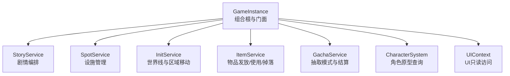
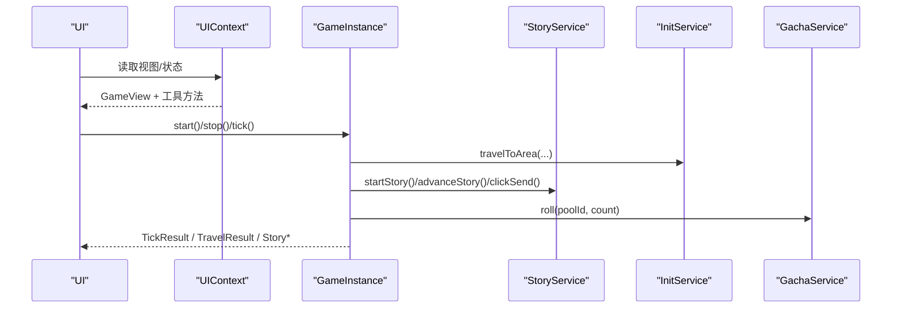
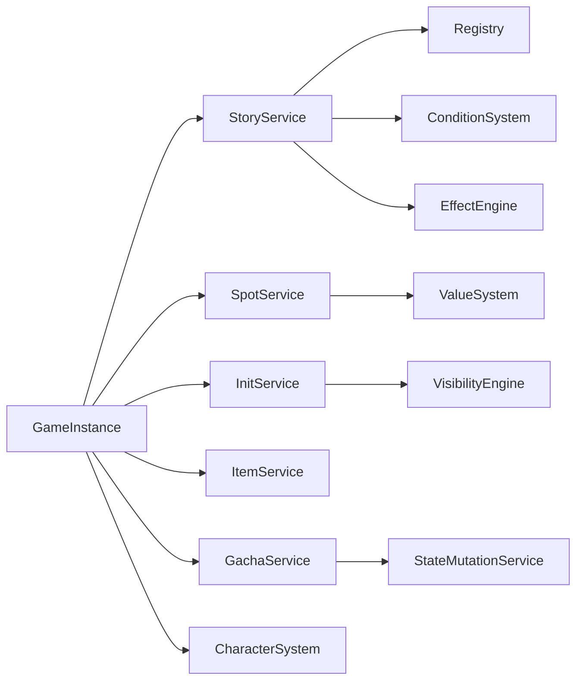

# API参考

<cite>
**本文引用的文件**
- [game-instance.ts](file://src/engine/game-instance.ts)
- [story-service.ts](file://src/engine/game/story-service.ts)
- [character-system.ts](file://src/engine/system/character-system.ts)
- [gacha-service.ts](file://src/engine/system/gacha-service.ts)
- [spot-service.ts](file://src/engine/game/spot-service.ts)
- [init-service.ts](file://src/engine/game/init-service.ts)
- [item-service.ts](file://src/engine/game/item-service.ts)
- [context.ts](file://src/ui/context.ts)
- [state.ts](file://src/engine/types/state.ts)
- [results.ts](file://src/engine/types/results.ts)
- [types/index.ts](file://src/engine/types/index.ts)
</cite>

## 目录
1. [简介](#简介)
2. [项目结构](#项目结构)
3. [核心组件](#核心组件)
4. [架构总览](#架构总览)
5. [详细组件分析](#详细组件分析)
6. [依赖关系分析](#依赖关系分析)
7. [性能注意事项](#性能注意事项)
8. [故障排查指南](#故障排查指南)
9. [结论](#结论)
10. [附录：类型与数据结构](#附录类型与数据结构)

## 简介
本API参考面向ACProgram的运行时引擎与UI层，聚焦以下目标：
- 完整说明GameInstance主类的公共接口（方法、属性、参数、返回值）
- 深入解释服务类API：StoryService、CharacterSystem、GachaService、SpotService、InitService、ItemService等
- 文档化TypeScript类型定义：核心接口、枚举类型与数据结构
- 说明UI层的只读访问接口：UIContext提供的游戏状态访问方法
- 提供使用示例与常见场景，覆盖错误处理、异常与兼容性说明

## 项目结构
ACProgram采用分层与模块化组织：
- 引擎核心：GameInstance作为组合根与门面，装配子系统并暴露统一API
- 业务服务：剧情、设施、世界线、物品、抽卡、角色等系统
- 类型定义：集中导出共享类型、实体、结果、事件等
- UI层：通过UIContext暴露只读视图，避免直接写入状态

图表来源
- [game-instance.ts:74-145](file://src/engine/game-instance.ts#L74-L145)
- [context.ts:30-66](file://src/ui/context.ts#L30-L66)

章节来源
- [game-instance.ts:74-145](file://src/engine/game-instance.ts#L74-L145)
- [context.ts:30-66](file://src/ui/context.ts#L30-L66)

## 核心组件
- GameInstance：组合根与门面，负责初始化、生命周期、Tick推进、存档/读档、Extra读写、可见性刷新、各服务门面访问
- StoryService：剧情游标持有与访问、启动/推进/重读/发送、聊天沙盒隔离
- CharacterSystem：角色原型元数据加载与筛选、已解锁角色判定
- GachaService：抽取模式注册与ba-classic结算、pity计数、资源扣除与获得
- SpotService：设施升级、解锁、产出计算、等级上限、Tag操作
- InitService：进入世界线、区域可达性移动、购买/解锁世界线、三种重启、per-Init快照
- ItemService：物品发放、使用、掉落表执行
- UIContext：为UI提供只读的游戏状态与工具方法

章节来源
- [game-instance.ts:74-145](file://src/engine/game-instance.ts#L74-L145)
- [story-service.ts:52-228](file://src/engine/game/story-service.ts#L52-L228)
- [character-system.ts:18-85](file://src/engine/system/character-system.ts#L18-L85)
- [gacha-service.ts:83-186](file://src/engine/system/gacha-service.ts#L83-L186)
- [spot-service.ts:46-200](file://src/engine/game/spot-service.ts#L46-L200)
- [init-service.ts:64-200](file://src/engine/game/init-service.ts#L64-L200)
- [item-service.ts:24-73](file://src/engine/game/item-service.ts#L24-L73)
- [context.ts:30-88](file://src/ui/context.ts#L30-L88)

## 架构总览
GameInstance在构造期通过wiring装配所有子系统，并在运行时以只读门面暴露能力。UI层通过UIContext获取GameView与只读系统引用，确保写操作由controller经GameInstance完成。

图表来源
- [game-instance.ts:176-262](file://src/engine/game-instance.ts#L176-L262)
- [story-service.ts:180-228](file://src/engine/game/story-service.ts#L180-L228)
- [init-service.ts:187-200](file://src/engine/game/init-service.ts#L187-L200)
- [gacha-service.ts:117-172](file://src/engine/system/gacha-service.ts#L117-L172)
- [context.ts:78-88](file://src/ui/context.ts#L78-L88)

## 详细组件分析

### GameInstance 公共接口
- 属性与访问器
  - state: Readonly<PlayerState>
  - visibility: Readonly<VisibilitySnapshot>
  - running: boolean
  - story: StoryService（只读门面）
  - spot: SpotService（只读门面）
  - inits: InitService（只读门面）
  - items: ItemService（只读门面）
  - enhancements: EnhancementService（只读门面）
  - charaProfiles: CharaProfileService（只读门面）
  - pics: PicService（只读门面）
  - devLog: DevLog（日志）
  - statsService: StatsService（统计）
  - 其他子系统：eventBus、registry、valueSystem、conditionSystem、funcletExecutor、effectEngine、tickSystem、lootSystem、visibilityEngine、characterSystem、rosterSystem、availabilityService、colorSystem、colorEquipmentSystem、gachaService、tagStatService、passivePoolSystem、mutations、affectorEngine、spotFunctionalitySystem、gameNumSystem、triggerSystem、chatFlowService、imageStore
- 生命周期与运行
  - init(datapacks): void — 加载数据包、同步子系统、构建数值、加载角色、重建可见性、进入默认Init
  - reload(datapacks): void — 运行时整体替换数据包（清空注册表与子系统，重置后重新init）
  - tick(): TickResult — 推进一帧，应用效果，复检对话空间阻断态，记录统计与日志
  - start(): void / stop(): void — 开始/停止Tick循环
  - travelToArea(areaId, allowDuringStory?, checkAdjacency?): TravelResult — 移动到Area（可达性层）
- Extra运行时API
  - getExtra(path): ExtraValue | undefined
  - setExtra(path, value): void
  - setPerInitExtra(path, value): void
  - mergeExtras(source): void
- 存档
  - save(): SaveData
  - load(saveData): void
  - reset(): void
- 视图与日志
  - getView(): GameView
  - getStoryView(owner): StoryView | null
  - getDevLogs(): readonly DevLogEntry[]
  - clearDevLogs(): void

章节来源
- [game-instance.ts:74-145](file://src/engine/game-instance.ts#L74-L145)
- [game-instance.ts:176-262](file://src/engine/game-instance.ts#L176-L262)
- [game-instance.ts:302-390](file://src/engine/game-instance.ts#L302-L390)

### StoryService 接口
- 游标与状态
  - getCurrentStoryId(owner?): string | null
  - getCurrentStoryDefId(owner?): string | null
  - isVisitedInChain(storyId): boolean
  - hasCompletedStory(storyId): boolean
  - isBlockingMovement(owner?): boolean
  - clearPassiveIfPlaying(owner?): void
- 存档相关
  - saveCursor(): StoryCursor
  - restoreCursor(cursor): void
  - saveChatCursors(): Record<string, StoryCursor>
  - restoreChatCursors(map): void
  - clearCurrentStory(owner?): void
- 公开API
  - startActiveStory(storyId, owner?): StoryStartResult
  - startCardStory(storyId, owner?): StoryStartResult
  - startStory(storyId, expectedType, owner?, opts?): StoryStartResult
  - triggerPassiveStory(initId?, owner?): StoryStartResult
  - replayStory(storyId, owner?): StoryStartResult
  - advanceStory(choiceIndex?, owner?): StoryAdvanceResult
  - getSendState(owner?): SendState
  - clickSend(owner?): SendResult
  - getCurrentStoryView(owner?): StoryView | null

使用示例（文字描述）
- 启动主线剧情：调用startActiveStory传入故事入口ID；若返回success=false且error=ConditionNotMet，需检查前置条件或分支守卫
- 推进剧情：调用advanceStory传入choiceIndex（可选），根据返回的finished字段判断是否结束
- 点击回复：调用clickSend，根据SendResult.type处理completed/working/choice/idle分支
- 聊天沙盒：传入owner参数可针对特定VariantId进行独立剧情播放

章节来源
- [story-service.ts:52-228](file://src/engine/game/story-service.ts#L52-L228)
- [results.ts:58-182](file://src/engine/types/results.ts#L58-L182)

### CharacterSystem 接口
- 加载与查询
  - load(characters): void
  - get(id): CharacterData | undefined
  - getAll(): CharacterData[]
  - getBySchool(school): CharacterData[]
  - getByRarity(rarity): CharacterData[]
  - exists(id): boolean
- 已解锁角色
  - getUnlocked(state): CharacterData[] — 基于roster单一真相来源，拥有任一差分即视为解锁
- 统计
  - countSchoolMembers(school, state): number

使用示例（文字描述）
- 获取当前已解锁角色列表：传入当前PlayerState，用于渲染通讯录或选择界面
- 按稀有度筛选：用于限定池子或活动展示范围

章节来源
- [character-system.ts:18-85](file://src/engine/system/character-system.ts#L18-L85)

### GachaService 接口
- 配置与查询
  - getPool(poolId): GachaPoolDef | undefined
  - countersOf(poolId): { pity: number; pulls: number }
  - setRng(rng): void — 注入确定性随机数（测试用）
- 抽取
  - roll(poolId, count): RollSummary
    - 逐次扣费、逐次结算pity、逐次获得/转化
    - 中途资源不足则中止并返回已完成部分（stopped='insufficient-currency'）
    - 事件：gachaResolved（包含poolId与count）

使用示例（文字描述）
- 单次抽取：roll(poolId, 1)，根据results[0]判断是否重复并获得碎片或额外资源
- 十连抽取：roll(poolId, 10)，注意可能因资源不足提前停止，需检查summary.stopped

章节来源
- [gacha-service.ts:83-186](file://src/engine/system/gacha-service.ts#L83-L186)
- [results.ts:22-34](file://src/engine/types/results.ts#L22-L34)

### SpotService 接口
- 升级与解锁
  - upgradeSpot(spotId): SpotUpgradeResult
  - unlockSpot(spotId): SpotUnlockResult
- 管理与产出
  - assignManager(spotId, character): boolean
  - getManagerBonus(spotId): number — 冻结恒为1.0
  - getSpotYield(spotId): { base; managerBonus; tagMultiplier; total }
  - getEffectiveMaxLevel(spotId): number | undefined
- Tag操作（见SpotServiceOptions中getState/getVisibility/refreshVisibility）

使用示例（文字描述）
- 升级设施：调用upgradeSpot，若返回error=MaxLevel表示已达上限；若InsufficientResource需补充资源
- 解锁设施：调用unlockSpot，若NotVisible需先满足可见性条件

章节来源
- [spot-service.ts:46-200](file://src/engine/game/spot-service.ts#L46-L200)
- [results.ts:48-54](file://src/engine/types/results.ts#L48-L54)

### InitService 接口
- 世界线管理
  - unlockInit(initId): void
  - enterInit(initId): void — 清理非本世界线Spot、定位默认Area、自动展开起始剧情、挂载世界线Trigger
- 区域移动
  - travelToArea(areaId, allowDuringStory?, checkAdjacency?): TravelResult
- per-Init快照（保存/恢复/清除/播种）由内部InitSavepoint管理

使用示例（文字描述）
- 进入世界线：enterInit后会自动设置currentAreaId与解锁默认Spot，并可触发起始剧情
- 区域移动：travelToArea遵循可达性链（存在→同Init→非演出锁定→相邻→可见）

章节来源
- [init-service.ts:64-200](file://src/engine/game/init-service.ts#L64-L200)
- [results.ts:24-35](file://src/engine/types/results.ts#L24-L35)

### ItemService 接口
- 发放与使用
  - giveItem(itemId, count): boolean
  - useItem(itemId): UseItemResult
- 掉落表
  - rollDropTable(tableId): Map<string, number>

使用示例（文字描述）
- 发放物品：giveItem成功后可触发pickupEffects
- 使用消耗品：useItem会校验类型、库存与条件，成功则移除并触发useEffects

章节来源
- [item-service.ts:24-73](file://src/engine/game/item-service.ts#L24-L73)
- [results.ts:20-23](file://src/engine/types/results.ts#L20-L23)

### UIContext 只读访问接口
- 只读游戏对象
  - game: UIFacingGame — 包含state、registry、valueSystem、conditionSystem、gameNumSystem、affectorEngine、characterSystem、rosterSystem、availabilityService、colorSystem、colorEquipmentSystem、gachaService、spotFunctionalitySystem、statsService、charaProfiles、pics、story、spot、getStoryView、getDevLogs
- 视图与工具
  - view: GameView
  - saveExists: boolean
  - formatNumber(value): string
  - escapeHtml(value): string
  - formatTime(timestamp): string
  - nameOf(type, id): string

使用示例（文字描述）
- 渲染界面：通过view获取不可变快照，结合nameOf将ID转为人类可读名称
- 读取状态：通过game.state与只读系统查询，不直接修改状态

章节来源
- [context.ts:30-88](file://src/ui/context.ts#L30-L88)

## 依赖关系分析
- GameInstance依赖并装配多个子系统与服务，形成松耦合的组合根
- StoryService依赖Registry、ConditionSystem、EffectEngine、StateMutationService、EventBus、PassivePoolSystem
- GachaService依赖Registry、StateMutationService、EventBus，并通过回调获取余额与可抽集合
- SpotService依赖Registry、ValueSystem、ConditionSystem、StateMutationService、EffectEngine、AffectorEngine、EventBus、DevLog
- InitService依赖Registry、ConditionSystem、EffectEngine、StateMutationService、StatsService、EventBus、DevLog、StoryService、TriggerSystem、AffectorEngine、VisibilityEngine

图表来源
- [game-instance.ts:74-145](file://src/engine/game-instance.ts#L74-L145)
- [story-service.ts:8-48](file://src/engine/game/story-service.ts#L8-L48)
- [gacha-service.ts:8-18](file://src/engine/system/gacha-service.ts#L8-L18)
- [spot-service.ts:8-44](file://src/engine/game/spot-service.ts#L8-L44)
- [init-service.ts:9-62](file://src/engine/game/init-service.ts#L9-L62)

章节来源
- [game-instance.ts:74-145](file://src/engine/game-instance.ts#L74-L145)
- [story-service.ts:8-48](file://src/engine/game/story-service.ts#L8-L48)
- [gacha-service.ts:8-18](file://src/engine/system/gacha-service.ts#L8-L18)
- [spot-service.ts:8-44](file://src/engine/game/spot-service.ts#L8-L44)
- [init-service.ts:9-62](file://src/engine/game/init-service.ts#L9-L62)

## 性能注意事项
- Tick推进采用事件驱动精确失效：mutation写路径标记受影响的gain子树，未受影响跨帧保持缓存
- Affector贯穿Area与Init持续生效，每帧应用活跃效果
- 可见性增量更新：不在每帧全量重算，仅在必要时刷新
- Gacha抽取逐次扣费与结算，资源不足时提前中止，减少无效计算
- Spot升级与解锁涉及条件评估与效果应用，建议批量操作前预检条件与资源

## 故障排查指南
- 剧情推进失败
  - 检查StoryStartResult/StoryAdvanceResult的error字段，如ConditionNotMet、AlreadyCompleted、BranchGuardDenied等
  - 使用getSendState确认当前按钮状态（idle/choice/kizuna/advance）
- 区域移动失败
  - 检查TravelResult.error：NotFound、NotInThisInit、NotAdjacent、Locked、StoryBlocked
  - 若演出进行中禁止移动，可通过allowDuringStory=true放行（Story自身要求移动）
- 设施升级失败
  - 检查SpotUpgradeResult.error：MaxLevel、ConditionNotMet、InsufficientResource、NotOwned、NotFound
- 抽取失败
  - 检查RollSummary.stopped是否为insufficient-currency
  - 确认卡池配置完整（rates/members）与可抽成员非空
- 物品使用失败
  - 检查UseItemResult.error：NotFound、NotUsable、NotOwned、ConditionNotMet

章节来源
- [results.ts:20-54](file://src/engine/types/results.ts#L20-L54)
- [story-service.ts:180-228](file://src/engine/game/story-service.ts#L180-L228)
- [init-service.ts:187-200](file://src/engine/game/init-service.ts#L187-L200)
- [spot-service.ts:54-131](file://src/engine/game/spot-service.ts#L54-L131)
- [gacha-service.ts:117-172](file://src/engine/system/gacha-service.ts#L117-L172)
- [item-service.ts:40-65](file://src/engine/game/item-service.ts#L40-L65)

## 结论
GameInstance作为组合根提供了稳定且清晰的API边界，各服务模块职责明确、耦合可控。UI层通过UIContext仅进行只读访问，保证状态变更的纪律性与一致性。类型定义集中导出，便于跨模块复用与扩展。建议在集成时优先使用门面API，避免直接操作内部状态。

## 附录：类型与数据结构
- PlayerState：运行时状态主体，包含资源、设施等级与管理者、强化、世界线、区域、帧数、标签与实体效果、剧情日志、背包、旗帜、解锁世界线、一次性Trigger、per-Init额外数据、快照、全局额外数据、通讯录、碎片、卡池计数、主题色彩组、主题层顺序、已解锁设计、聊天已读、被动闲聊冷却、对话空间阻断态、头像人名覆写、世界Pool、原型聚合统计
- InitSnapshot：Init内快照，包含局部资源、设施、区域、帧数、背包、强化、剧情日志、旗帜、一次性Trigger、当前区域、per-Init额外数据、角色容器、碎片、卡池计数、聊天已读
- StoryView：当前剧情视图，包含storyId、type、storyDefId、pageIndex、totalPages、page、availableChoiceIndexes
- TickResult/Tick生产结果：frame与productions
- TravelResult/TravelError：移动结果与错误码
- SpotUpgradeResult/SpotUnlockResult：设施升级/解锁结果
- EnhancementPurchaseResult/EnhancementPurchaseError：强化购买结果与错误
- StoryStartResult/StoryAdvanceResult/SendState/SendResult：剧情启动/推进/发送状态与结果
- GachaService结果：PullResult/RollSummary

章节来源
- [state.ts:35-140](file://src/engine/types/state.ts#L35-L140)
- [state.ts:142-185](file://src/engine/types/state.ts#L142-L185)
- [results.ts:9-182](file://src/engine/types/results.ts#L9-L182)
- [types/index.ts:8-29](file://src/engine/types/index.ts#L8-L29)