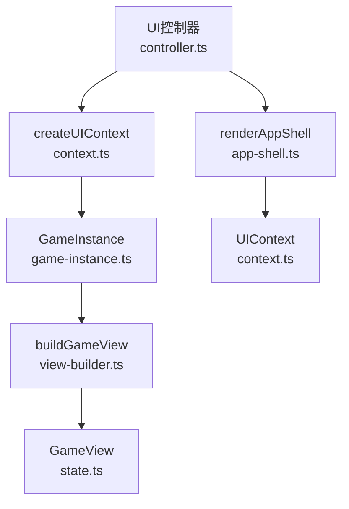
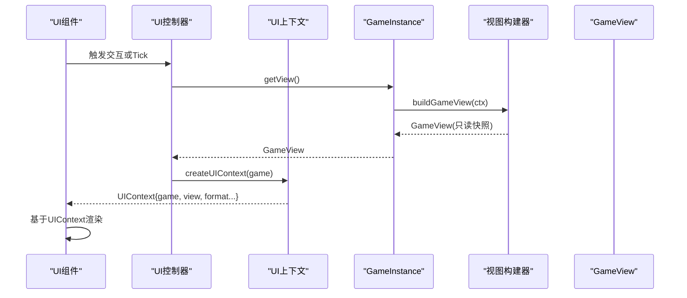
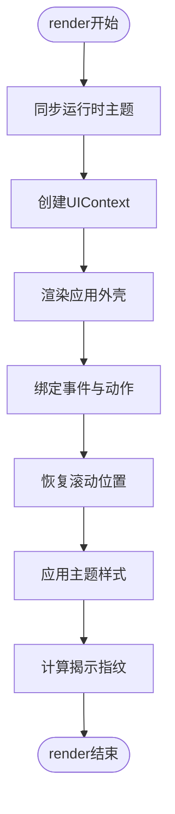
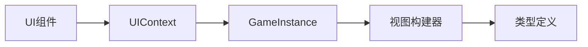

# UI上下文API

<cite>
**本文引用的文件**
- [src/ui/context.ts](file://src/ui/context.ts)
- [src/engine/game/view-builder.ts](file://src/engine/game/view-builder.ts)
- [src/engine/types/state.ts](file://src/engine/types/state.ts)
- [src/engine/game-instance.ts](file://src/engine/game-instance.ts)
- [src/ui/controller.ts](file://src/ui/controller.ts)
- [src/ui/controller-core.ts](file://src/ui/controller-core.ts)
- [src/ui/components/app-shell.ts](file://src/ui/components/app-shell.ts)
- [src/engine/types/results.ts](file://src/engine/types/results.ts)
</cite>

## 目录
1. [简介](#简介)
2. [项目结构](#项目结构)
3. [核心组件](#核心组件)
4. [架构总览](#架构总览)
5. [详细组件分析](#详细组件分析)
6. [依赖关系分析](#依赖关系分析)
7. [性能考量](#性能考量)
8. [故障排查指南](#故障排查指南)
9. [结论](#结论)
10. [附录](#附录)

## 简介
本文件面向ACProgram项目的UI层开发者，系统化说明如何通过UI上下文（UIContext）安全、只读地访问游戏状态与视图数据，并解释UI层与引擎层的解耦设计。文档重点包括：
- UIFacingGame暴露的只读门面与查询能力
- GameView结构及其字段含义与使用方式
- 如何安全获取当前剧情视图与聊天沙盒视图
- UI组件开发最佳实践：状态订阅、性能优化、响应式更新
- 常见UI开发模式与错误处理策略

## 项目结构
UI上下文由UI控制器创建，封装对引擎实例的只读访问，并提供格式化等工具方法；引擎侧通过视图构建器生成不可变的GameView快照供UI渲染。

**图表来源**
- [src/ui/controller.ts:139-225](file://src/ui/controller.ts#L139-L225)
- [src/ui/context.ts:78-88](file://src/ui/context.ts#L78-L88)
- [src/engine/game-instance.ts:155-172](file://src/engine/game-instance.ts#L155-L172)
- [src/engine/game/view-builder.ts:23-57](file://src/engine/game/view-builder.ts#L23-L57)
- [src/ui/components/app-shell.ts:32-50](file://src/ui/components/app-shell.ts#L32-L50)

**章节来源**
- [src/ui/controller.ts:139-225](file://src/ui/controller.ts#L139-L225)
- [src/ui/context.ts:25-66](file://src/ui/context.ts#L25-L66)
- [src/engine/game-instance.ts:155-172](file://src/engine/game-instance.ts#L155-L172)
- [src/engine/game/view-builder.ts:23-57](file://src/engine/game/view-builder.ts#L23-L57)
- [src/ui/components/app-shell.ts:32-50](file://src/ui/components/app-shell.ts#L32-L50)

## 核心组件
- UIContext：UI层唯一入口，提供只读的game门面、当前GameView、存档存在性判断以及常用格式化工具。
- UIFacingGame：对引擎子系统的只读聚合，包含状态、注册表、表达式/条件系统、效果引擎、角色/阵容/颜色/抽卡/设施/统计/图鉴/图片/剧情/设施服务等。
- GameView：从PlayerState与可见性快照、当前剧情视图、活跃效果、统计快照组装而成的只读视图。
- StoryView：当前剧情页视图，用于渲染对话、选项与工作进度。

关键职责边界：
- UI层仅通过UIContext读取数据，不直接修改引擎状态。
- 写操作统一由UI控制器经GameInstance发起，遵循“读写分离”的架构纪律。

**章节来源**
- [src/ui/context.ts:25-66](file://src/ui/context.ts#L25-L66)
- [src/engine/types/state.ts:255-272](file://src/engine/types/state.ts#L255-L272)
- [src/engine/types/results.ts:58-67](file://src/engine/types/results.ts#L58-L67)

## 架构总览
UI与引擎解耦的关键在于：
- 视图不可变：每次渲染前通过GameInstance.getView()生成新的GameView快照，避免UI持有可变引用。
- 只读门面：UIFacingGame屏蔽所有写入接口，UI组件只能消费查询结果。
- 事件驱动刷新：通过揭示指纹与轻量刷新机制，在条件变化时最小化DOM重建。

**图表来源**
- [src/ui/controller.ts:189-225](file://src/ui/controller.ts#L189-L225)
- [src/engine/game-instance.ts:155-172](file://src/engine/game-instance.ts#L155-L172)
- [src/engine/game/view-builder.ts:23-57](file://src/engine/game/view-builder.ts#L23-L57)
- [src/ui/context.ts:78-88](file://src/ui/context.ts#L78-L88)

## 详细组件分析

### UI上下文（UIContext）与只读门面（UIFacingGame）
- UIContext提供：
  - game：UIFacingGame只读门面
  - view：当前GameView快照
  - saveExists：是否存在存档
  - 工具函数：formatNumber、escapeHtml、formatTime、nameOf
- UIFacingGame暴露：
  - state：只读玩家状态
  - registry/valueSystem/conditionSystem/gameNumSystem/affectorEngine等子系统只读访问
  - characterSystem/rosterSystem/availabilityService/colorSystem/colorEquipmentSystem/gachaService/spotFunctionalitySystem/statsService/charaProfiles/pics等
  - story.spot：剧情与设施的只读查询
  - getStoryView(owner)：获取指定聊天沙盒的当前剧情视图
  - getDevLogs()：开发日志

使用要点：
- 组件内通过UIContext.game获取所需数据，禁止直接访问GameInstance内部状态。
- 需要特定沙盒的剧情视图时，调用getStoryView(owner)，owner通常为VariantId。

**章节来源**
- [src/ui/context.ts:25-66](file://src/ui/context.ts#L25-L66)
- [src/engine/game-instance.ts:155-172](file://src/engine/game-instance.ts#L155-L172)

### GameView结构与字段说明
GameView是UI渲染的数据源，包含以下关键字段：
- activeInit：当前世界线ID
- currentAreaId：当前区域ID（可为空）
- visitedAreas：已访问区域列表
- totalFrames：累计帧数
- resources：合并后的资源（全局+当前世界线局部）
- spotLevels/spotManagers：设施等级与经理
- unlockedEnhancements/unlockedInits：已解锁强化与世界线
- inventory：物品库存
- storyLog：已完成故事记录
- flags：标志位
- visibility：各实体可见性快照（inits/areas/spots/enhancements/items/stories）
- currentStory：全局当前剧情视图
- activeAffectors：当前生效的效果实例
- stats：三层统计快照（global/init/session）

注意事项：
- 所有字段均为只读快照，UI不应修改。
- 资源合并逻辑确保跨世界线与当前世界线资源正确叠加。
- 可见性快照用于控制UI元素的显示/隐藏。

**章节来源**
- [src/engine/game/view-builder.ts:23-57](file://src/engine/game/view-builder.ts#L23-L57)
- [src/engine/types/state.ts:255-272](file://src/engine/types/state.ts#L255-L272)

### 剧情视图（StoryView）与发送状态（SendState）
- StoryView描述当前剧情页：storyId、type、storyDefId、pageIndex、totalPages、page、availableChoiceIndexes。
- SendState描述底部回复按钮状态：advance/idle/choice/kizuna等模式，支持点击工作进度与选项确认。

使用场景：
- 渲染对话内容、选项卡片、工作进度条。
- 根据SendState决定按钮文案与行为。

**章节来源**
- [src/engine/types/results.ts:58-67](file://src/engine/types/results.ts#L58-L67)
- [src/engine/types/results.ts:107-144](file://src/engine/types/results.ts#L107-L144)

### UI渲染流程与主题同步
- UI控制器在render中创建UIContext，先同步运行时主题再生成DOM，确保颜色层级正确。
- 面板状态PanelState管理左右中栏标签、聊天条目、对话空间等。
- 聊天流与滚动状态在重建前后捕获与恢复，避免用户视角跳变。

**图表来源**
- [src/ui/controller.ts:189-225](file://src/ui/controller.ts#L189-L225)
- [src/ui/components/app-shell.ts:32-50](file://src/ui/components/app-shell.ts#L32-L50)

**章节来源**
- [src/ui/controller.ts:189-225](file://src/ui/controller.ts#L189-L225)
- [src/ui/components/app-shell.ts:32-50](file://src/ui/components/app-shell.ts#L32-L50)

## 依赖关系分析
UI层依赖引擎层提供的只读接口，形成清晰的单向依赖：
- UIContext依赖GameInstance以获取视图与子系统
- GameInstance通过视图构建器生成GameView
- UI组件消费UIContext，不直接耦合引擎实现

**图表来源**
- [src/ui/context.ts:78-88](file://src/ui/context.ts#L78-L88)
- [src/engine/game-instance.ts:155-172](file://src/engine/game-instance.ts#L155-L172)
- [src/engine/game/view-builder.ts:23-57](file://src/engine/game/view-builder.ts#L23-L57)

**章节来源**
- [src/ui/context.ts:78-88](file://src/ui/context.ts#L78-L88)
- [src/engine/game-instance.ts:155-172](file://src/engine/game-instance.ts#L155-L172)
- [src/engine/game/view-builder.ts:23-57](file://src/engine/game/view-builder.ts#L23-L57)

## 性能考量
- 轻量刷新：每Tick仅更新资源数字节点，避免全量DOM重建，保持聊天流滚动位置稳定。
- 揭示指纹：仅在条件变化时重建UI，减少不必要的渲染开销。
- 节流机制：高频事件下限制揭示评估频率，避免重复计算。
- 视图快照：每次渲染前生成新的GameView，避免共享可变状态导致的竞态问题。

建议：
- UI组件应订阅必要的状态变化，避免轮询。
- 大量数据渲染时使用虚拟滚动或分页。
- 避免在render中进行复杂计算，必要时缓存结果。

**章节来源**
- [src/ui/controller-core.ts:62-96](file://src/ui/controller-core.ts#L62-L96)
- [src/ui/controller-core.ts:23-60](file://src/ui/controller-core.ts#L23-L60)

## 故障排查指南
常见问题与解决思路：
- UI未更新：检查是否调用了render或refreshLight，确认揭示指纹是否变化。
- 聊天流滚动异常：确认滚动状态捕获与恢复逻辑是否正确执行。
- 主题颜色不正确：确保在渲染前同步运行时主题。
- 剧情视图为空：检查getStoryView的owner参数是否正确。

调试技巧：
- 使用getDevLogs查看开发日志。
- 通过控制台输出GameView关键字段定位问题。
- 利用快捷键组合触发诊断功能。

**章节来源**
- [src/ui/controller.ts:159-166](file://src/ui/controller.ts#L159-L166)
- [src/ui/context.ts:54-55](file://src/ui/context.ts#L54-L55)

## 结论
UI上下文API为ACProgram项目提供了清晰、安全的UI与引擎解耦方案。通过只读门面、视图快照和事件驱动的刷新机制，实现了高性能、可维护的UI架构。开发者应遵循最佳实践，合理使用UIContext进行状态订阅与响应式更新，确保用户体验流畅稳定。

## 附录

### UI组件开发最佳实践
- 状态订阅：优先使用事件驱动而非轮询，减少不必要的渲染。
- 性能优化：使用轻量刷新更新频繁变化的数据，避免全量重建。
- 响应式更新：基于揭示指纹变化触发UI更新，确保及时反映游戏状态。
- 错误处理：妥善处理无效输入和异常情况，提供友好的用户反馈。

### 常见UI开发模式
- 面板切换：通过PanelState管理不同面板的显示与隐藏。
- 聊天流：使用ChatEntry统一管理聊天消息，支持多沙盒隔离。
- 弹窗系统：通过ModalManager管理模态对话框的生命周期。
- 悬浮提示：使用PopoverManager实现详情悬浮展示。

**章节来源**
- [src/ui/components/app-shell.ts:8-30](file://src/ui/components/app-shell.ts#L8-L30)
- [src/ui/controller.ts:61-108](file://src/ui/controller.ts#L61-L108)