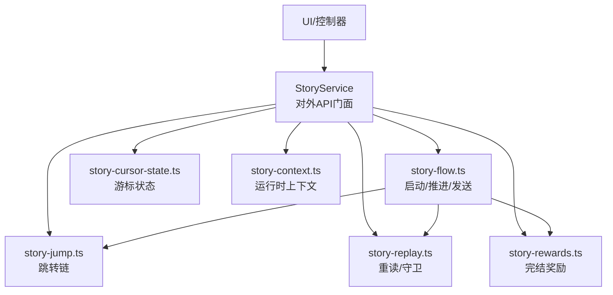
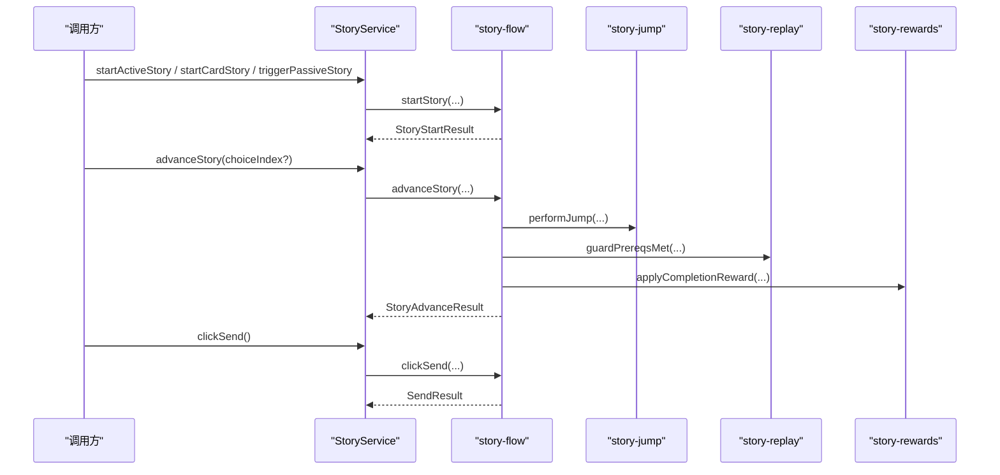
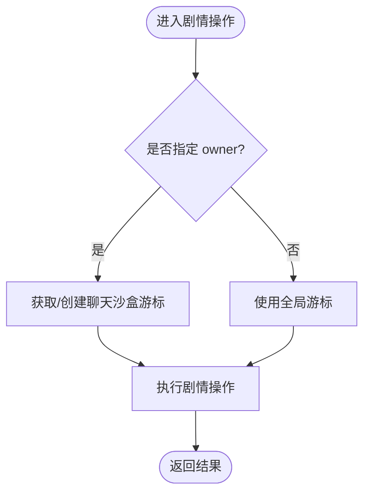
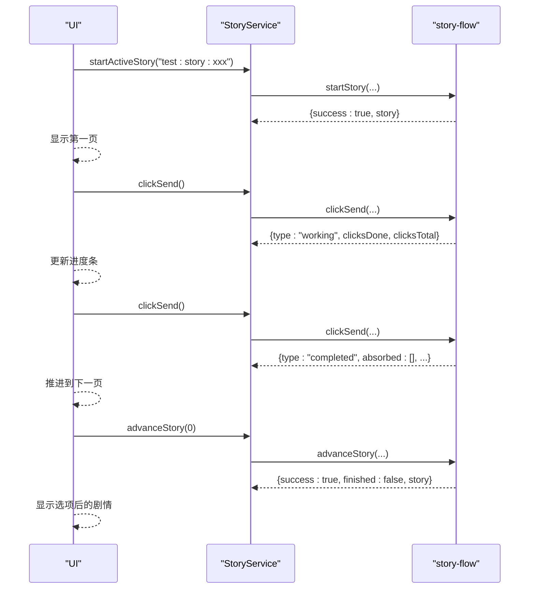
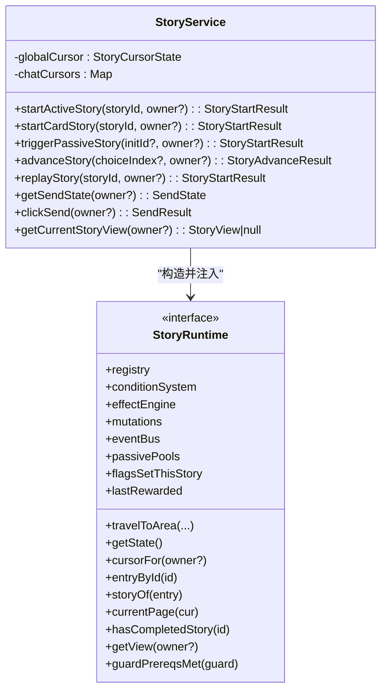

# 剧情服务API

<cite>
**本文引用的文件**
- [story-service.ts](file://src/engine/game/story-service.ts)
- [story-cursor-state.ts](file://src/engine/game/story-cursor-state.ts)
- [story-context.ts](file://src/engine/game/story-context.ts)
- [story-flow.ts](file://src/engine/game/story-flow.ts)
- [results.ts](file://src/engine/types/results.ts)
- [story-flow.test.ts](file://tests/engine/story-flow.test.ts)
</cite>

## 目录
1. [简介](#简介)
2. [项目结构](#项目结构)
3. [核心组件](#核心组件)
4. [架构总览](#架构总览)
5. [详细组件分析](#详细组件分析)
6. [依赖关系分析](#依赖关系分析)
7. [性能考量](#性能考量)
8. [故障排查指南](#故障排查指南)
9. [结论](#结论)
10. [附录：完整调用示例与最佳实践](#附录完整调用示例与最佳实践)

## 简介
本文件为 StoryService 的官方 API 文档，面向需要集成或扩展“剧情系统”的开发者。内容覆盖：
- 所有对外公共方法：startActiveStory、startCardStory、triggerPassiveStory、advanceStory、replayStory、getSendState、clickSend、getCurrentStoryView 等
- 参数类型、返回值结构与使用场景
- 剧情游标管理机制：全局游标 vs 聊天沙盒游标
- 常见操作示例：启动剧情、推进剧情、处理选择分支、完成点击任务
- 错误处理与异常情况的处理方式

## 项目结构
StoryService 位于 engine/game 下，采用“编排层 + 子模块”的拆分方式：
- story-service.ts：对外 API 门面，持有并管理游标（全局/聊天沙盒），委托具体流程到子模块
- story-flow.ts：启动/推进/发送主流程
- story-jump.ts：跳转链（goto/insert）
- story-replay.ts：重读与分歧点准入守卫
- story-rewards.ts：完结奖励结算
- story-cursor-state.ts：单一游标状态（可存档/恢复）
- story-context.ts：跨子模块共享运行时上下文（只读视图）

图表来源
- [story-service.ts:52-84](file://src/engine/game/story-service.ts#L52-L84)
- [story-flow.ts:25-104](file://src/engine/game/story-flow.ts#L25-L104)
- [story-cursor-state.ts:28-95](file://src/engine/game/story-cursor-state.ts#L28-L95)
- [story-context.ts:24-49](file://src/engine/game/story-context.ts#L24-L49)

章节来源
- [story-service.ts:1-271](file://src/engine/game/story-service.ts#L1-L271)
- [story-flow.ts:1-200](file://src/engine/game/story-flow.ts#L1-L200)
- [story-cursor-state.ts:1-96](file://src/engine/game/story-cursor-state.ts#L1-L96)
- [story-context.ts:1-50](file://src/engine/game/story-context.ts#L1-L50)

## 核心组件
- StoryService：对外暴露统一 API；维护全局游标与多个聊天沙盒游标；提供存档/读档、移动阻断判断、当前故事视图查询等能力
- StoryCursorState：单一游标的纯数据模型，支持 save/restore，字段与存档结构一一对应
- StoryRuntime：跨子模块共享的只读上下文，包含 registry、conditionSystem、effectEngine、mutations、eventBus、passivePools、travelToArea、getState、cursorFor、entryById、storyOf、currentPage、hasCompletedStory、getView、guardPrereqsMet、flagsSetThisStory、lastRewarded

章节来源
- [story-service.ts:52-84](file://src/engine/game/story-service.ts#L52-L84)
- [story-cursor-state.ts:28-95](file://src/engine/game/story-cursor-state.ts#L28-L95)
- [story-context.ts:24-49](file://src/engine/game/story-context.ts#L24-L49)

## 架构总览
StoryService 作为门面，将业务逻辑委派给 story-flow、story-jump、story-replay、story-rewards 等子模块。所有子模块通过 StoryRuntime 访问共享资源，避免循环依赖。

图表来源
- [story-service.ts:180-228](file://src/engine/game/story-service.ts#L180-L228)
- [story-flow.ts:54-131](file://src/engine/game/story-flow.ts#L54-L131)
- [story-flow.ts:133-200](file://src/engine/game/story-flow.ts#L133-L200)

## 详细组件分析

### 游标管理机制：全局游标 vs 聊天沙盒游标
- 全局游标：用于 active 主线与一般闲聊（owner 为空时使用）
- 聊天沙盒游标：按 owner（VariantId）分区，每个角色对话空间并行互不打断
- 解析规则：owner 非空 → 该聊天沙盒（惰性创建）；否则 → 全局游标
- 关键行为：
  - isBlockingMovement：若存在进行中的非 passive 剧情，或 passive 且 leaveArea=false，则阻止玩家移动 Area
  - clearPassiveIfPlaying：移动出 Area 时打断正在播放的 PassiveStory（interruptible:false 的闲聊不被打断）
  - save/restore：导出/恢复全局与聊天沙盒游标快照

图表来源
- [story-service.ts:90-104](file://src/engine/game/story-service.ts#L90-L104)
- [story-service.ts:156-172](file://src/engine/game/story-service.ts#L156-L172)
- [story-service.ts:122-150](file://src/engine/game/story-service.ts#L122-L150)

章节来源
- [story-service.ts:90-104](file://src/engine/game/story-service.ts#L90-L104)
- [story-service.ts:156-172](file://src/engine/game/story-service.ts#L156-L172)
- [story-service.ts:122-150](file://src/engine/game/story-service.ts#L122-L150)
- [story-cursor-state.ts:28-95](file://src/engine/game/story-cursor-state.ts#L28-L95)

### 公开 API 详解

#### startActiveStory(storyId, owner?)
- 作用：以 active 模式启动一个剧情入口（Entry）。可打断被动闲聊，不可打断另一个 active 主线
- 参数：
  - storyId：Entry.id
  - owner：可选，指定聊天沙盒；省略/null 表示全局游标
- 返回：StoryStartResult
- 使用场景：从 UI 或系统触发主动剧情（如羁绊卡片、活动剧情）
- 注意：内部委托给 startStory(storyId, 'active', owner)

章节来源
- [story-service.ts:180-182](file://src/engine/game/story-service.ts#L180-L182)
- [story-service.ts:196-198](file://src/engine/game/story-service.ts#L196-L198)
- [story-flow.ts:54-104](file://src/engine/game/story-flow.ts#L54-L104)

#### startCardStory(storyId, owner?)
- 作用：聊天卡片入口启动（kizuna 羁绊卡片/演出浮窗）
- 行为：清空当前游标（丢弃进行中演出的剩余页，goto 语义），跳过 availableInits/triggerCondition，但仍尊重单次完成态（AlreadyCompleted 拒绝）
- 参数/返回：同 startActiveStory
- 使用场景：从聊天卡片触发剧情，卡片出现即视为入口判定

章节来源
- [story-service.ts:184-193](file://src/engine/game/story-service.ts#L184-L193)
- [story-service.ts:196-198](file://src/engine/game/story-service.ts#L196-L198)
- [story-flow.ts:54-104](file://src/engine/game/story-flow.ts#L54-L104)

#### triggerPassiveStory(initId?, owner?)
- 作用：从被动池抽取并启动一个 passive 剧情（闲聊）
- 参数：
  - initId：当前世界线，默认取 activeInit
  - owner：可选，仅抽取归属该 VariantId 的闲聊；省略/null/'' 表示全局闲聊
- 返回：StoryStartResult
- 使用场景：系统自动触发闲聊或条件满足后被动剧情

章节来源
- [story-service.ts:200-203](file://src/engine/game/story-service.ts#L200-L203)
- [story-flow.ts:106-131](file://src/engine/game/story-flow.ts#L106-L131)

#### advanceStory(choiceIndex?, owner?)
- 作用：推进当前剧情一页或选择一个选项
- 参数：
  - choiceIndex：当页面有选项时必须传入；否则为 undefined
  - owner：可选，指定目标沙盒
- 返回：StoryAdvanceResult
- 使用场景：用户点击“继续”或选择分支
- 注意：
  - 若当前页有点击需求（click/clickWork）且未完成确认，会返回 ClickRequired
  - 重阅读模式下，若目标 Story 的分歧点准入守卫不满足，返回 BranchGuardDenied 并附带 denialMessage

章节来源
- [story-service.ts:210-213](file://src/engine/game/story-service.ts#L210-L213)
- [story-flow.ts:133-200](file://src/engine/game/story-flow.ts#L133-L200)
- [results.ts:69-102](file://src/engine/types/results.ts#L69-L102)

#### replayStory(storyId, owner?)
- 作用：重读某个 Entry（受 branchGuards 约束）
- 参数/返回：同 startActiveStory
- 使用场景：允许玩家重新体验某段剧情，但需满足前置阅读要求

章节来源
- [story-service.ts:205-208](file://src/engine/game/story-service.ts#L205-L208)
- [story-service.ts:250-253](file://src/engine/game/story-service.ts#L250-L253)

#### getSendState(owner?)
- 作用：获取底部“回复按钮”的当前状态（advance/idle/choice/kizuna）
- 参数：owner 可选
- 返回：SendState
- 使用场景：UI 根据状态渲染按钮文案、进度条、选项确认提示等

章节来源
- [story-service.ts:215-218](file://src/engine/game/story-service.ts#L215-L218)
- [results.ts:104-144](file://src/engine/types/results.ts#L104-L144)

#### clickSend(owner?)
- 作用：模拟一次“回复按钮”点击，处理 click/clickWork、文本确认、过渡页吸收等
- 参数：owner 可选
- 返回：SendResult（completed/working/choice/idle）
- 使用场景：通用推进入口，UI 侧统一通过此接口驱动剧情推进

章节来源
- [story-service.ts:220-223](file://src/engine/game/story-service.ts#L220-L223)
- [results.ts:146-182](file://src/engine/types/results.ts#L146-L182)

#### getCurrentStoryView(owner?)
- 作用：获取当前剧情视图（当前 Story、页索引、可用选项等）
- 参数：owner 可选
- 返回：StoryView | null

章节来源
- [story-service.ts:225-228](file://src/engine/game/story-service.ts#L225-L228)
- [results.ts:58-67](file://src/engine/types/results.ts#L58-L67)

### 返回值与错误码说明
- StoryStartResult：成功返回 { success: true; story: StoryView }；失败返回 { success: false; error: StoryError }
- StoryAdvanceResult：成功可能返回进行中或已完成；失败包含错误码与可选 denialMessage
- SendResult：区分 completed/working/choice/idle，携带进度、回显、吸收页等信息
- StoryError 常见值：NotFound、AlreadyActive、NoActiveStory、ConditionNotMet、WrongStoryType、AlreadyCompleted、NoAvailableStory、ChoiceRequired、InvalidChoice、ChoiceConditionNotMet、ClickRequired、BranchGuardDenied、JumpLimitExceeded、NotReplayable

章节来源
- [results.ts:58-102](file://src/engine/types/results.ts#L58-L102)
- [results.ts:104-182](file://src/engine/types/results.ts#L104-L182)

### 典型调用序列图

#### 启动并推进一段剧情（含点击任务与选项）

图表来源
- [story-service.ts:180-228](file://src/engine/game/story-service.ts#L180-L228)
- [story-flow.ts:54-131](file://src/engine/game/story-flow.ts#L54-L131)
- [story-flow.ts:133-200](file://src/engine/game/story-flow.ts#L133-L200)

## 依赖关系分析
- StoryService 依赖：
  - Registry：读取 StoryEntryDef/StoryDef
  - ConditionSystem：评估入口条件与选项条件
  - EffectEngine：执行 Talklet/选项效果
  - StateMutationService：记录阅读日志、修改状态
  - EventBus：发出 storyTriggered 等事件
  - PassivePoolSystem：被动闲聊池抽取
  - travelToArea：Story 自身要求的区域移动
- 子模块通过 StoryRuntime 访问上述能力，避免直接耦合

图表来源
- [story-service.ts:52-84](file://src/engine/game/story-service.ts#L52-L84)
- [story-context.ts:24-49](file://src/engine/game/story-context.ts#L24-L49)

章节来源
- [story-service.ts:52-84](file://src/engine/game/story-service.ts#L52-L84)
- [story-context.ts:24-49](file://src/engine/game/story-context.ts#L24-L49)

## 性能考量
- 游标选择 O(1)：基于 Map 的聊天沙盒查找
- 被动池抽取：树状抽取 + reactor gates，复杂度取决于池大小与守卫数量
- 跳转链：goto/insert 深度限制（MAX_JUMP_DEPTH），防止无限跳转
- 点击任务：clickWork 随机化总次数，减少重复体验单调性
- 事件与副作用：仅在必要时 emit 事件与应用效果，避免冗余计算

[本节为通用指导，不直接分析具体文件]

## 故障排查指南
- AlreadyActive：已有进行中的剧情（active 不可被另一个 active 覆盖；passive 在 force 模式下可被打断）
- NoActiveStory：没有进行中的剧情，无法推进
- ChoiceRequired：当前页有选项但未传入 choiceIndex
- InvalidChoice：传入的选项索引无效
- ChoiceConditionNotMet：所选选项的条件未满足
- ClickRequired：当前页存在点击需求（click/clickWork）且未完成确认，不能直接推进或跳转
- BranchGuardDenied：重阅读模式下，目标 Story 的分歧点准入守卫不满足，可检查 denialMessage
- JumpLimitExceeded：跳转深度超过上限，强制终止演出
- NotReplayable：重读入口不可用（entry.replayable = false）
- NotFound/WrongStoryType/AlreadyCompleted/ConditionNotMet/NoAvailableStory：入口不存在、类型不符、已完成、条件不满足、无可用的被动剧情

章节来源
- [results.ts:69-102](file://src/engine/types/results.ts#L69-L102)
- [story-flow.ts:54-131](file://src/engine/game/story-flow.ts#L54-L131)
- [story-flow.ts:133-200](file://src/engine/game/story-flow.ts#L133-L200)

## 结论
StoryService 提供了统一的剧情管理 API，并通过游标机制实现全局与聊天沙盒的并行运行。配合 story-flow/jump/replay/rewards 等子模块，实现了完整的启动、推进、跳转、重读与奖励结算流程。开发者可通过 getSendState/clickSend/advanceStory 组合，灵活构建不同交互形态的剧情体验。

[本节为总结，不直接分析具体文件]

## 附录：完整调用示例与最佳实践

### 示例一：启动 active 剧情并逐页推进
- 步骤：
  1) 调用 startActiveStory(storyId)
  2) 使用 getSendState 判断当前模式
  3) 若为 advance 且有 clickWork，多次调用 clickSend 直到 type=completed
  4) 遇到选项页时，使用 advanceStory(choiceIndex) 进行选择
- 参考测试用例路径：
  - [story-flow.test.ts:28-48](file://tests/engine/story-flow.test.ts#L28-L48)
  - [story-flow.test.ts:50-73](file://tests/engine/story-flow.test.ts#L50-L73)

### 示例二：聊天卡片启动剧情（跳过条件，保留单次完成态）
- 步骤：
  1) 调用 startCardStory(storyId, owner)
  2) 后续推进同上
- 参考：
  - [story-service.ts:184-193](file://src/engine/game/story-service.ts#L184-L193)
  - [story-flow.ts:54-104](file://src/engine/game/story-flow.ts#L54-L104)

### 示例三：被动闲聊自动触发
- 步骤：
  1) 调用 triggerPassiveStory(initId, owner)
  2) 若返回 NoAvailableStory，说明无符合条件的被动剧情
- 参考：
  - [story-service.ts:200-203](file://src/engine/game/story-service.ts#L200-L203)
  - [story-flow.ts:106-131](file://src/engine/game/story-flow.ts#L106-L131)

### 示例四：处理 click 门控与多击任务
- 步骤：
  1) 启动剧情后，若当前页为 click/clickWork，先通过 clickSend 累积进度
  2) 填满后再点击一次确认，才能推进或跳转
- 参考：
  - [story-flow.test.ts:28-73](file://tests/engine/story-flow.test.ts#L28-L73)
  - [story-flow.ts:173-184](file://src/engine/game/story-flow.ts#L173-L184)

### 示例五：重读剧情与分歧点守卫
- 步骤：
  1) 调用 replayStory(storyId, owner)
  2) 若遇到 BranchGuardDenied，检查 denialMessage 并满足前置阅读要求
- 参考：
  - [story-service.ts:205-208](file://src/engine/game/story-service.ts#L205-L208)
  - [story-flow.ts:186-192](file://src/engine/game/story-flow.ts#L186-L192)

### 最佳实践
- 始终通过 getSendState 决定 UI 行为：advance/choice/kizuna/idle
- 对 click/clickWork 页面，优先使用 clickSend 完成点击任务，再尝试 advanceStory
- 对选项页，确保传入有效的 choiceIndex，并处理 ChoiceConditionNotMet
- 对被动剧情，合理设置 owner 以实现角色对话空间的隔离
- 对跳转链，关注 JumpLimitExceeded，避免过深的 insert/goto 嵌套

[本节为实践指导，不直接分析具体文件]