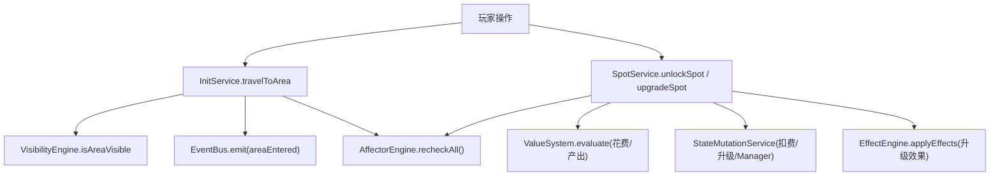
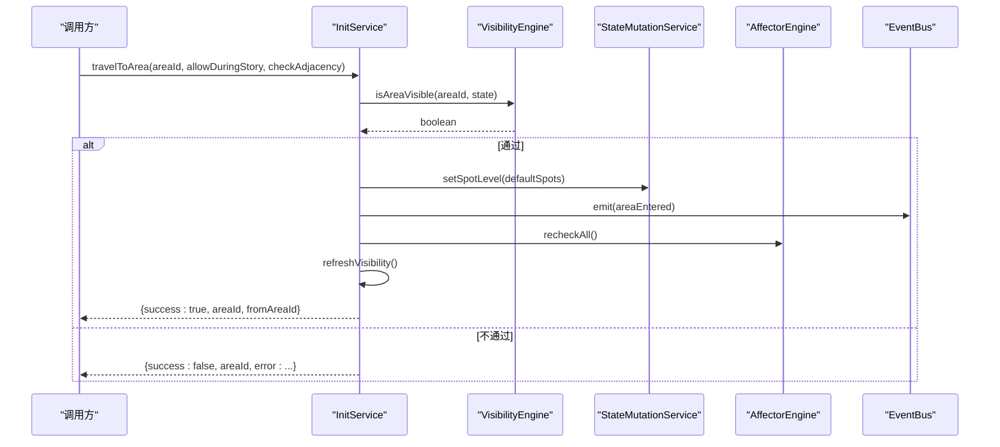
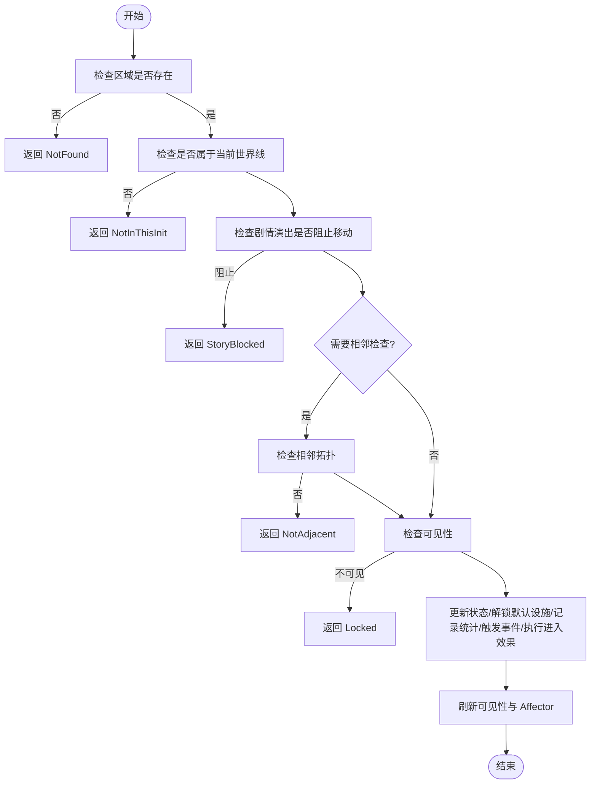
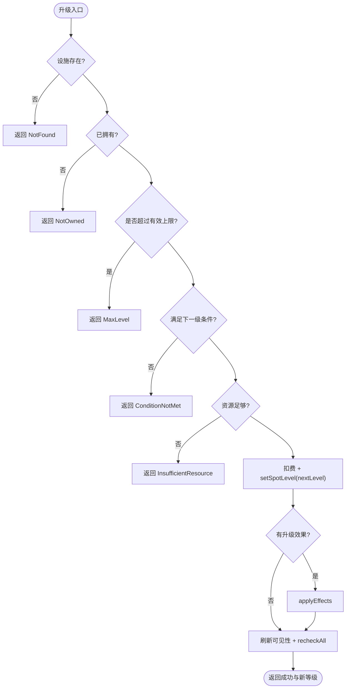
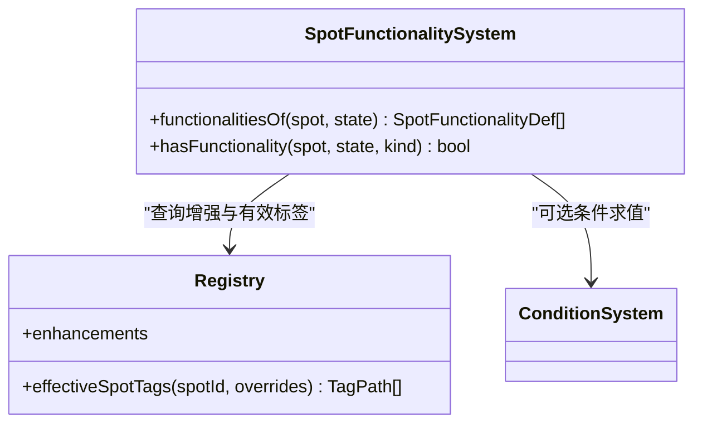
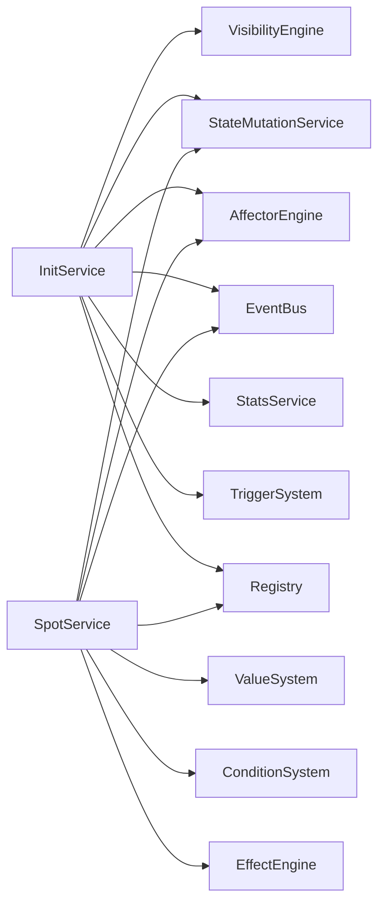

# 区域服务API

<cite>
**本文引用的文件**
- [spot-service.ts](file://src/engine/game/spot-service.ts)
- [init-service.ts](file://src/engine/game/init-service.ts)
- [areas.ts](file://src/data/base/areas.ts)
- [spots.ts](file://src/data/base/spots.ts)
- [visibility-engine.ts](file://src/engine/visibility/visibility-engine.ts)
- [state.ts](file://src/engine/types/state.ts)
- [snapshot.ts](file://src/engine/game/snapshot.ts)
- [spot-functionality.ts](file://src/engine/system/spot-functionality.ts)
</cite>

## 目录
1. [简介](#简介)
2. [项目结构](#项目结构)
3. [核心组件](#核心组件)
4. [架构总览](#架构总览)
5. [详细组件分析](#详细组件分析)
6. [依赖关系分析](#依赖关系分析)
7. [性能考量](#性能考量)
8. [故障排查指南](#故障排查指南)
9. [结论](#结论)
10. [附录：完整探索示例](#附录完整探索示例)

## 简介
本文件为 SpotService 的区域管理 API 文档，聚焦以下能力：
- 区域移动与可达性检查（相邻、可见性、世界线隔离）
- 设施建造与升级（购买解锁、等级上限、条件与花费、效果执行）
- 资源产出计算（基础产出、线性加成、功能系统注入）
- 区域探索流程（从移动到新区域到解锁并建造设施的完整链路）
- 区域状态管理与存档同步（per-Init 快照、全局/局部资源与设施隔离）

## 项目结构
围绕区域管理的代码主要分布在以下模块：
- 区域与设施定义：data/base/areas.ts、data/base/spots.ts
- 区域移动与服务：engine/game/init-service.ts（travelToArea）、engine/game/spot-service.ts（unlockSpot、upgradeSpot）
- 可见性与揭示：engine/visibility/visibility-engine.ts（isAreaVisible、增量重算）
- 运行时状态与快照：engine/types/state.ts（PlayerState、InitSnapshot）、engine/game/snapshot.ts（global/local 设施过滤）
- 设施功能系统：engine/system/spot-functionality.ts（内源/外源功能合并）

图表来源
- [init-service.ts:187-244](file://src/engine/game/init-service.ts#L187-L244)
- [spot-service.ts:54-131](file://src/engine/game/spot-service.ts#L54-L131)
- [spot-service.ts:182-210](file://src/engine/game/spot-service.ts#L182-L210)
- [visibility-engine.ts:105-107](file://src/engine/visibility/visibility-engine.ts#L105-L107)

章节来源
- [areas.ts:9-106](file://src/data/base/areas.ts#L9-L106)
- [spots.ts:9-296](file://src/data/base/spots.ts#L9-L296)
- [init-service.ts:187-244](file://src/engine/game/init-service.ts#L187-L244)
- [spot-service.ts:54-210](file://src/engine/game/spot-service.ts#L54-L210)
- [visibility-engine.ts:39-75](file://src/engine/visibility/visibility-engine.ts#L39-L75)

## 核心组件
- InitService：负责世界线生命周期、区域移动、进入条目效果、触发器挂载与清理。
- SpotService：负责设施购买/升级/标签/产出/等级上限等。
- VisibilityEngine：事件驱动的可见性引擎，维护 inits/areas/spots/enhancements/items/stories 的显隐快照。
- SpotFunctionalitySystem：合并内源与外源设施功能，供 UI 展示交互入口与结算。
- State/Snapshot：PlayerState 与 InitSnapshot 描述运行时状态；snapshot 工具用于区分 global/local 设施在快照中的归属。

章节来源
- [init-service.ts:33-62](file://src/engine/game/init-service.ts#L33-L62)
- [spot-service.ts:28-47](file://src/engine/game/spot-service.ts#L28-L47)
- [visibility-engine.ts:19-34](file://src/engine/visibility/visibility-engine.ts#L19-L34)
- [spot-functionality.ts:21-27](file://src/engine/system/spot-functionality.ts#L21-L27)
- [state.ts:35-140](file://src/engine/types/state.ts#L35-L140)
- [snapshot.ts:8-24](file://src/engine/game/snapshot.ts#L8-L24)

## 架构总览
区域管理由“移动—可见性—状态变更—效果执行—可见性刷新”的闭环构成：
- 移动：InitService.travelToArea 校验同世界线、剧情演出锁定、相邻拓扑、可见性门槛，成功后更新 currentAreaId、visitedAreas、默认设施解锁、记录统计、触发进入效果、刷新可见性与 Affector。
- 解锁/升级：SpotService.unlockSpot/upgradeSpot 校验存在性、拥有状态、可见性、等级上限、条件与资源，扣费后变更状态，执行升级效果，刷新可见性与 Affector。
- 可见性：VisibilityEngine 以事件驱动增量维护，关键路径使用 isAreaVisible/isSpotVisible 实时求值，避免缓存陈旧。
- 状态与快照：PlayerState 保存当前区域、已访问区域、设施等级与管理者；InitSnapshot 保存 per-Init 数据；snapshot 工具按 SpotDef.global 标记分离跨世界线共享设施。

图表来源
- [init-service.ts:187-244](file://src/engine/game/init-service.ts#L187-L244)
- [visibility-engine.ts:105-107](file://src/engine/visibility/visibility-engine.ts#L105-L107)

章节来源
- [init-service.ts:187-244](file://src/engine/game/init-service.ts#L187-L244)
- [visibility-engine.ts:39-75](file://src/engine/visibility/visibility-engine.ts#L39-L75)

## 详细组件分析

### 区域移动 API（travelToArea）
- 输入参数
  - areaId：目标区域 ID
  - allowDuringStory：是否允许在剧情演出中移动（Story 自身触发的移动可放行）
  - checkAdjacency：是否强制相邻检查（Story 移动时可关闭）
- 前置校验
  - 区域存在性
  - 属于当前世界线（activeInit）
  - 非剧情演出锁定（allowDuringStory=false 时）
  - 相邻拓扑（checkAdjacency=true 且 fromAreaId 不为空时）
  - 可见性（VisibilityEngine.isAreaVisible）
- 成功副作用
  - 更新 currentAreaId、首次进入追加 visitedAreas
  - 自动解锁该区域的 defaultSpots（未拥有的设为 Lv.1）
  - 记录区域进入统计、触发 areaEntered 事件
  - 执行区域 enterEffects
  - 刷新可见性、重新评估 Affector
- 返回结果
  - success: true/false
  - areaId
  - fromAreaId（成功时）
  - error（失败原因：NotFound/NotInThisInit/StoryBlocked/AlreadyThere/NotAdjacent/Locked）

图表来源
- [init-service.ts:187-244](file://src/engine/game/init-service.ts#L187-L244)

章节来源
- [init-service.ts:187-244](file://src/engine/game/init-service.ts#L187-L244)

### 设施解锁与升级 API（unlockSpot / upgradeSpot）
- unlockSpot(spotId)
  - 校验：存在性、未拥有、可见性、等级上限（maxLevel<1 视为不可解锁）、资源足够
  - 副作用：扣费、设置 level=1、刷新可见性
  - 返回：{success, spotId, error?}
- upgradeSpot(spotId)
  - 校验：存在性、已拥有、等级上限、下一级条件、资源足够
  - 花费：优先 levelUpgrades.cost，否则通用公式 baseCostResource × growth^(nextLevel-1)
  - 副作用：扣费、setSpotLevel(nextLevel)、执行升级 effects、刷新可见性与 Affector
  - 返回：{success, spotId, newLevel, error?}
- 等级上限优先级
  - 活跃 Affector 解除限制 → 无上限
  - 活跃 Affector 设定上限 → 取最高值
  - SpotDef.maxLevel
  - 无限制

图表来源
- [spot-service.ts:54-131](file://src/engine/game/spot-service.ts#L54-L131)
- [spot-service.ts:164-177](file://src/engine/game/spot-service.ts#L164-L177)

章节来源
- [spot-service.ts:54-131](file://src/engine/game/spot-service.ts#L54-L131)
- [spot-service.ts:182-210](file://src/engine/game/spot-service.ts#L182-L210)
- [spot-service.ts:164-177](file://src/engine/game/spot-service.ts#L164-L177)

### 设施功能系统（SpotFunctionalitySystem）
- 功能来源
  - 内源：SpotDef.functionalities
  - 外源：已获得的 Enhancement 通过 addsFunctionalities 注入，作用范围由 Enhancement 的 zoneModifiers 派生 tag 列表决定（空 = 全局）
- 生效判定
  - 外源功能需匹配 Spot 的有效 tags（声明 + 运行时增撤）
- 用途
  - hasFunctionality(kind) 供 UI 展示交互型功能入口
  - linearYield 类持续型功能按当前设施等级生效

图表来源
- [spot-functionality.ts:21-55](file://src/engine/system/spot-functionality.ts#L21-L55)

章节来源
- [spot-functionality.ts:21-55](file://src/engine/system/spot-functionality.ts#L21-L55)

### 区域与设施定义（数据层）
- Area 定义
  - id、initId、name、description、defaultSpots、adjacentAreaIds、theme、revealTriggers
  - 示例：夏莱主厅邻接资料室/天台；机库名称需累计信用点后才揭示
- Spot 定义
  - id、areaId、name、desc、cost、yield、capacity、managerBonus、tags、linearYield/gacha/restartInit/hardResetInit、genericUpgrade、levelUpTo、revealResource
  - 示例：信用点制造机提供线性额外产出与招募功能；野外调查站有条件线性产出

章节来源
- [areas.ts:9-106](file://src/data/base/areas.ts#L9-L106)
- [spots.ts:9-296](file://src/data/base/spots.ts#L9-L296)

### 可见性与揭示（VisibilityEngine）
- 职责
  - 维护 inits/areas/spots/enhancements/items/stories 的显隐快照
  - 事件驱动增量标脏，按需增量重算
  - 提供 isAreaVisible/isSpotVisible 等实时判定接口
- 关键点
  - clearLocal：世界线切换时空出 spots/areas 快照，下次读取全量重建
  - rebuild：注册表加载/热替换后重建索引并全量重算
  - existence 门槛由 revealTriggers 的 existence 目标控制

章节来源
- [visibility-engine.ts:19-34](file://src/engine/visibility/visibility-engine.ts#L19-L34)
- [visibility-engine.ts:39-75](file://src/engine/visibility/visibility-engine.ts#L39-L75)
- [visibility-engine.ts:85-115](file://src/engine/visibility/visibility-engine.ts#L85-L115)

### 状态与存档同步（PlayerState / InitSnapshot / snapshot 工具）
- PlayerState
  - currentAreaId、visitedAreas、spotLevels、spotManagers、resources/globalResources、unlockedEnhancements、initExtras/extras 等
- InitSnapshot
  - 保存 per-Init 的资源、设施等级与管理者、已访问区域、帧数、库存、增强、故事日志、标志位、触发完成集合、当前区域、额外数据、角色/碎片/卡池/聊天读等
- snapshot 工具
  - globalSpotEntries：提取 SpotDef.global=true 的设施状态（跨世界线共享）
  - localSpotEntries：提取非 global 的设施状态（随世界线隔离）

章节来源
- [state.ts:35-140](file://src/engine/types/state.ts#L35-L140)
- [state.ts:142-170](file://src/engine/types/state.ts#L142-L170)
- [snapshot.ts:8-24](file://src/engine/game/snapshot.ts#L8-L24)

## 依赖关系分析
- InitService 依赖
  - Registry（areas/inits/spots）、VisibilityEngine（可见性判定）、StateMutationService（状态变更）、StatsService（统计）、EventBus（事件）、AffectorEngine（重算）、TriggerSystem（世界线触发器）、StoryService（演出锁定/清除）
- SpotService 依赖
  - Registry（spots/enhancements）、ValueSystem（表达式求值）、ConditionSystem（条件）、StateMutationService（资源/设施/标签变更）、EffectEngine（升级效果）、AffectorEngine（重算）、EventBus、DevLog
- 可见性引擎依赖
  - Registry、ConditionSystem、EventBus、VisibilityIndex、VisibilityEval

图表来源
- [init-service.ts:33-62](file://src/engine/game/init-service.ts#L33-L62)
- [spot-service.ts:28-47](file://src/engine/game/spot-service.ts#L28-L47)
- [visibility-engine.ts:19-34](file://src/engine/visibility/visibility-engine.ts#L19-L34)

章节来源
- [init-service.ts:33-62](file://src/engine/game/init-service.ts#L33-L62)
- [spot-service.ts:28-47](file://src/engine/game/spot-service.ts#L28-L47)
- [visibility-engine.ts:19-34](file://src/engine/visibility/visibility-engine.ts#L19-L34)

## 性能考量
- 可见性增量更新：VisibilityEngine 基于事件驱动与脏标记，仅在必要时增量重算，减少全量重建开销。
- 关键路径实时求值：移动/解锁等正确性关键路径直接调用 isAreaVisible/isSpotVisible，避免缓存陈旧导致的错误。
- 设施产出计算：SpotService.getSpotYield 仅对 baseYield 求值，manager 加成冻结为 1.0，降低复杂度。
- 快照与隔离：snapshot 工具按 global/local 分离设施状态，减少跨世界线不必要的数据拷贝与污染。

[本节为通用指导，无需特定文件引用]

## 故障排查指南
- 移动失败常见原因
  - NotFound：区域不存在
  - NotInThisInit：目标区域不属于当前世界线
  - StoryBlocked：剧情演出进行中且不允许移动
  - AlreadyThere：已在目标区域
  - NotAdjacent：不相邻（checkAdjacency=true 时）
  - Locked：区域未开放（可见性未满足）
- 解锁/升级失败常见原因
  - NotFound：设施不存在
  - NotOwned：未拥有（升级前必须已解锁）
  - MaxLevel：已达有效等级上限（含被 Affector 设置为 0 的情况）
  - ConditionNotMet：下一级条件不满足或无对应定义
  - InsufficientResource：资源不足
- 调试建议
  - 查看 DevLog 输出（source 字段为 area/spot）
  - 检查 VisibilityEngine 快照与 isAreaVisible 返回值
  - 确认 AffectorEngine 是否已 recheckAll
  - 核对 PlayerState 的 spotLevels、spotTagOverrides、resources/globalResources

章节来源
- [init-service.ts:187-244](file://src/engine/game/init-service.ts#L187-L244)
- [spot-service.ts:54-131](file://src/engine/game/spot-service.ts#L54-L131)
- [spot-service.ts:182-210](file://src/engine/game/spot-service.ts#L182-L210)
- [visibility-engine.ts:105-115](file://src/engine/visibility/visibility-engine.ts#L105-L115)

## 结论
区域管理以 InitService 的移动逻辑为核心，结合 VisibilityEngine 的可见性判定与 SpotService 的设施管理，形成完整的“移动—解锁—升级—产出—刷新”闭环。通过 PlayerState/InitSnapshot 的状态设计与 snapshot 工具的 global/local 分离，确保跨世界线的正确性与一致性。设施功能系统进一步将内源与外源能力统一接入，支持灵活的交互与产出扩展。

[本节为总结，无需特定文件引用]

## 附录：完整探索示例
以下示例演示从移动到新区域到建造设施的完整流程（以夏莱主厅→资料室为例）：
- 步骤
  1) 调用 travelToArea('base:area:schale_library')
     - 校验：同世界线、非演出锁定、相邻（主厅邻资料室）、可见性
     - 成功则更新 currentAreaId、首次进入追加 visitedAreas
     - 自动解锁资料室的 defaultSpots（如卷宗整理台），若未拥有则设为 Lv.1
     - 触发 areaEntered 事件，执行区域 enterEffects，刷新可见性与 Affector
  2) 解锁设施（如需）
     - 调用 unlockSpot('base:spot:archive')
     - 校验：存在、未拥有、可见、等级上限、资源足够
     - 扣费、设置 level=1、刷新可见性
  3) 升级设施
     - 调用 upgradeSpot('base:spot:archive')
     - 校验：存在、已拥有、等级上限、下一级条件、资源足够
     - 扣费、setSpotLevel(nextLevel)、执行升级 effects、刷新可见性与 Affector
  4) 查看产出
     - 调用 getSpotYield('base:spot:archive') 获取基础产出
     - 若有线性加成（如其他设施的 linearYield），按当前等级叠加
- 注意事项
  - 若区域被 revealTriggers 的 existence 门槛锁定，需先满足条件再移动
  - 若设施等级上限被 Affector 设置为 0，将无法解锁
  - 若处于剧情演出中且 allowDuringStory=false，移动将被阻止

章节来源
- [init-service.ts:187-244](file://src/engine/game/init-service.ts#L187-L244)
- [spot-service.ts:182-210](file://src/engine/game/spot-service.ts#L182-L210)
- [spot-service.ts:54-131](file://src/engine/game/spot-service.ts#L54-L131)
- [areas.ts:17-23](file://src/data/base/areas.ts#L17-L23)
- [spots.ts:145-155](file://src/data/base/spots.ts#L145-L155)