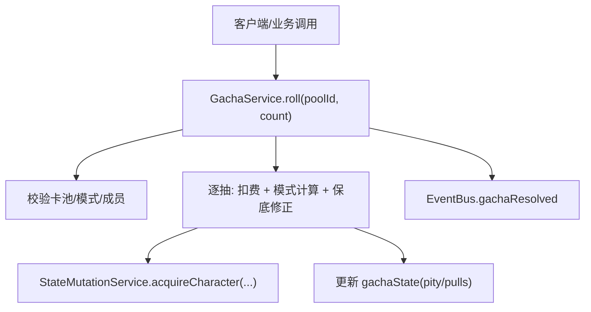
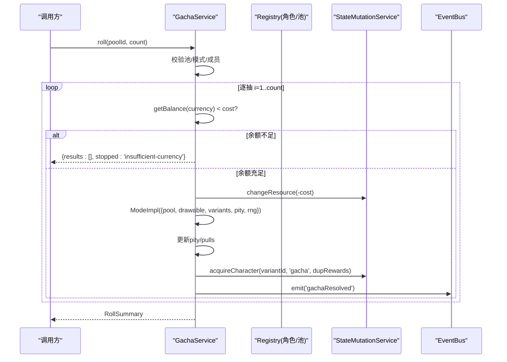
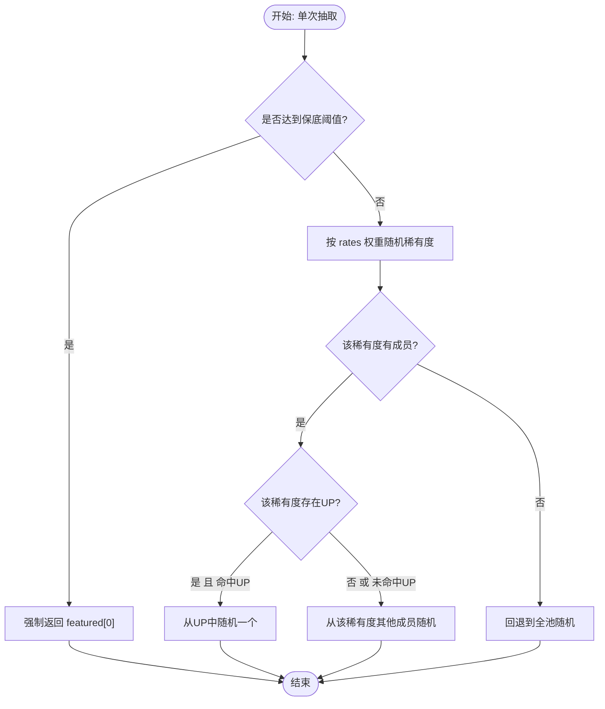

# 抽卡服务API

<cite>
**本文引用的文件**
- [gacha-service.ts](file://src/engine/system/gacha-service.ts)
- [gacha-pool.ts](file://src/engine/def-factory/gacha-pool.ts)
- [character.ts](file://src/engine/types/character.ts)
- [state-mutation-service.ts](file://src/engine/system/state-mutation-service.ts)
- [gacha-service.test.ts](file://tests/engine/gacha-service.test.ts)
- [04c-gacha.md](file://docs-824/04c-gacha.md)
</cite>

## 目录
1. [简介](#简介)
2. [项目结构](#项目结构)
3. [核心组件](#核心组件)
4. [架构总览](#架构总览)
5. [详细组件分析](#详细组件分析)
6. [依赖关系分析](#依赖关系分析)
7. [性能考量](#性能考量)
8. [故障排查指南](#故障排查指南)
9. [结论](#结论)
10. [附录：配置与扩展](#附录：配置与扩展)

## 简介
本文件为 GachaService 的完整 API 文档，覆盖抽卡池管理、概率计算、保底机制、重复获得补偿、单抽与十连抽流程、限定池（关闭条件）等。文档面向开发者与策划，既提供高层流程说明，也给出代码级实现要点与调用示例路径，便于快速集成与扩展。

## 项目结构
抽卡系统由“定义层 + 服务层 + 状态写入层”组成：
- 定义层：GachaPoolDef、GachaMode、GachaRateEntry、DupRewards、GachaPityDef 等类型与 Builder。
- 服务层：GachaService 负责抽取模式注册、轮询结算、保底计数、事件发布。
- 状态写入层：StateMutationService 统一资源扣减、角色获得、碎片发放、统计与事件。



图表来源
- [gacha-service.ts:117-171](file://src/engine/system/gacha-service.ts#L117-L171)
- [state-mutation-service.ts:155-196](file://src/engine/system/state-mutation-service.ts#L155-L196)

章节来源
- [gacha-service.ts:1-187](file://src/engine/system/gacha-service.ts#L1-L187)
- [gacha-pool.ts:1-81](file://src/engine/def-factory/gacha-pool.ts#L1-L81)
- [character.ts:340-438](file://src/engine/types/character.ts#L340-L438)
- [state-mutation-service.ts:110-123](file://src/engine/system/state-mutation-service.ts#L110-L123)

## 核心组件
- GachaService：抽取模式注册表与 ba-classic 结算逻辑；提供 roll(poolId, count)、getPool、countersOf、setRng 等方法。
- GachaPoolBuilder：链式构建 GachaPoolDef，支持 name/desc/mode/currency/costPerPull/rates/featured/pity/dupRewards/members/closeWhen。
- StateMutationService：统一状态写入，包含 changeResource、acquireCharacter、setGachaCounters 等。
- 类型体系：GachaMode、GachaPoolDef、GachaRateEntry、DupRewards、GachaPityDef、CharacterVariantDef、GachaPoolState 等。

章节来源
- [gacha-service.ts:20-98](file://src/engine/system/gacha-service.ts#L20-L98)
- [gacha-pool.ts:16-79](file://src/engine/def-factory/gacha-pool.ts#L16-L79)
- [character.ts:28-31](file://src/engine/types/character.ts#L28-L31)
- [character.ts:342-438](file://src/engine/types/character.ts#L342-L438)
- [state-mutation-service.ts:155-196](file://src/engine/system/state-mutation-service.ts#L155-L196)

## 架构总览
下图展示一次 roll 调用的端到端流程：参数校验 → 逐抽循环 → 货币扣减 → 模式计算 → 保底判定 → 角色获得/重复转换 → 计数器更新 → 事件发布。



图表来源
- [gacha-service.ts:117-171](file://src/engine/system/gacha-service.ts#L117-L171)
- [state-mutation-service.ts:110-123](file://src/engine/system/state-mutation-service.ts#L110-L123)
- [state-mutation-service.ts:155-196](file://src/engine/system/state-mutation-service.ts#L155-L196)

## 详细组件分析

### 抽卡模式与概率算法（ba-classic）
- 稀有度权重：按 rates 中各稀有度的 weight 进行加权随机，得到本次稀有度。
- UP 偏向：在命中稀有度后，若该稀有度存在 featured 列表中的差分，则以固定 FEATURED_WEIGHT 优先从 featured 中随机一个。
- 保底（天井）：当 pity + 1 >= guaranteedAt 时，直接返回 featured[0]（硬保底），并重置 pity。
- 最高稀有度判定：用于非保底情况下，若抽到最高稀有度且 keepOnHit=false，则重置 pity；否则累加 pity。
- 回退策略：若某稀有度无成员，则回退到全池随机，避免空集合错误。



图表来源
- [gacha-service.ts:56-81](file://src/engine/system/gacha-service.ts#L56-L81)

章节来源
- [gacha-service.ts:46-81](file://src/engine/system/gacha-service.ts#L46-L81)
- [character.ts:357-382](file://src/engine/types/character.ts#L357-L382)

### 保底机制与计数
- 计数字段：每个卡池维护 { pity, pulls }。
- 重置规则：
  - 达到 guaranteedAt 必出 UP 后，pity 归零。
  - 非保底情况下，若抽到最高稀有度且 keepOnHit=false，则 pity 归零；否则 pity+1。
- 累计次数：每次成功抽取 pulls+1。

章节来源
- [gacha-service.ts:147-158](file://src/engine/system/gacha-service.ts#L147-L158)
- [character.ts:528-534](file://src/engine/types/character.ts#L528-L534)

### 重复获得与补偿（歪卡补偿）
- 首次获得：创建 RosterEntry，不发放碎片。
- 重复获得：发放该变体碎片 shards 与 bonusResources（来自池配置的 DupRewards）。
- 结果字段：{ variantId, duplicate, shards, bonusResources }。

章节来源
- [state-mutation-service.ts:155-196](file://src/engine/system/state-mutation-service.ts#L155-L196)
- [character.ts:342-355](file://src/engine/types/character.ts#L342-L355)
- [gacha-service.ts:156-165](file://src/engine/system/gacha-service.ts#L156-L165)

### 单抽与十连抽
- 单抽：roll(poolId, 1)。
- 十连抽：roll(poolId, 10)。
- 中途资源不足：返回已完成的抽取结果，并在 summary.stopped 中标记 'insufficient-currency'。

章节来源
- [gacha-service.ts:117-135](file://src/engine/system/gacha-service.ts#L117-L135)
- [gacha-service.test.ts:199-206](file://tests/engine/gacha-service.test.ts#L199-L206)

### 限定池（关闭条件）
- closeWhen：可声明 Condition/ConditionGroup，满足条件后池关闭。
- 运行时：通过 getDrawable 将“池成员 ∪ 世界 Pool”作为候选集；池关闭时为空集合，调用方应拒绝抽取。

章节来源
- [gacha-pool.ts:57-59](file://src/engine/def-factory/gacha-pool.ts#L57-L59)
- [gacha-service.ts:94-96](file://src/engine/system/gacha-service.ts#L94-L96)
- [gacha-service.ts:123-124](file://src/engine/system/gacha-service.ts#L123-L124)

### 事件与可观测性
- 抽取完成事件：gachaResolved（携带 poolId 与 results.length）。
- 角色获得事件：characterAcquired（含 via、duplicate、shards、bonusResources）。
- 资源变更事件：resourceChanged（由 StateMutationService 发出）。

章节来源
- [gacha-service.ts:168-170](file://src/engine/system/gacha-service.ts#L168-L170)
- [state-mutation-service.ts:110-123](file://src/engine/system/state-mutation-service.ts#L110-L123)
- [state-mutation-service.ts:195-196](file://src/engine/system/state-mutation-service.ts#L195-L196)

## 依赖关系分析
- GachaService 依赖：
  - Registry：读取 GachaPoolDef、CharacterVariantDef。
  - StateMutationService：资源扣减、角色获得、计数器写入。
  - EventBus：发布 gachaResolved。
  - RNG：默认 Math.random，测试可注入确定性 RNG。
- 数据流向：
  - 输入：poolId、count。
  - 中间：drawable 集合、rates 权重、pity 计数、dupRewards。
  - 输出：RollSummary.results[]、summary.stopped。

```mermaid
classDiagram
class GachaService {
+roll(poolId, count) RollSummary
+getPool(id) GachaPoolDef?
+countersOf(id) {pity,pulls}
+setRng(rng) void
}
class StateMutationService {
+changeResource(resource, delta) number
+acquireCharacter(variantId, via, rewards) Result
+setGachaCounters(poolId, counters) void
}
class Registry {
+gachaPools
+characterVariants
}
class EventBus {
+emit(event) void
}
GachaService --> Registry : "读取池/差分"
GachaService --> StateMutationService : "扣费/获得/计数"
GachaService --> EventBus : "发布事件"
```

图表来源
- [gacha-service.ts:83-98](file://src/engine/system/gacha-service.ts#L83-L98)
- [state-mutation-service.ts:110-123](file://src/engine/system/state-mutation-service.ts#L110-L123)
- [state-mutation-service.ts:155-196](file://src/engine/system/state-mutation-service.ts#L155-L196)

章节来源
- [gacha-service.ts:83-98](file://src/engine/system/gacha-service.ts#L83-L98)
- [state-mutation-service.ts:110-123](file://src/engine/system/state-mutation-service.ts#L110-L123)

## 性能考量
- 复杂度：roll(poolId, count) 时间复杂度 O(count)，空间复杂度 O(1) 额外（不计结果数组）。
- 权重求和：每次抽取对 rates 进行一次线性扫描以定位稀有度，建议保持 rates 数量较小。
- 事件与统计：StateMutationService 对每次资源变化与角色获得触发事件与统计，批量抽取会多次触发，注意监听器开销。
- RNG：默认 Math.random 不可复现；测试场景可通过 setRng 注入确定性 RNG。

章节来源
- [gacha-service.ts:117-171](file://src/engine/system/gacha-service.ts#L117-L171)
- [gacha-service.test.ts:12-22](file://tests/engine/gacha-service.test.ts#L12-L22)

## 故障排查指南
- 未知卡池：抛出异常提示“未知卡池”。检查 poolId 是否存在于 registry。
- 未注册抽取模式：加载期报错。确认 GachaPoolDef.mode 为已注册模式（当前为 ba-classic）。
- 概率表权重非法：rates 总权重需大于 0。
- 无可抽成员：drawable 为空。检查 members 与 closeWhen 条件，确保至少有一个可用成员。
- 引用未知差分：ModeImpl 返回的 variantId 不存在。核对 featured/members 与 characterVariants。
- 资源不足：roll 中止并返回 stopped='insufficient-currency'。补充货币后重试。

章节来源
- [gacha-service.ts:118-124](file://src/engine/system/gacha-service.ts#L118-L124)
- [gacha-service.ts:144-145](file://src/engine/system/gacha-service.ts#L144-L145)
- [gacha-service.test.ts:96-100](file://tests/engine/gacha-service.test.ts#L96-L100)
- [gacha-service.test.ts:113-120](file://tests/engine/gacha-service.test.ts#L113-L120)

## 结论
GachaService 提供了稳定、可扩展的抽卡能力：通过模式化设计支持 ba-classic 的概率与保底，结合 StateMutationService 保证状态一致性与事件可观测性。配合 GachaPoolBuilder 可灵活配置卡池、UP、保底与重复补偿，满足单抽、十连与限定池等业务需求。

## 附录：配置与扩展

### 创建卡池（Builder 用法）
- 使用 GachaPoolBuilder 设置名称、货币、单价、概率表、UP、保底、重复返还、成员与关闭条件，最后 build() 得到 GachaPoolDef。
- 典型字段：
  - currency/costPerPull：单抽消耗与单价。
  - rates：稀有度权重表。
  - featured：UP 差分列表。
  - pity：guaranteedAt 与可选 keepOnHit。
  - dupRewards：重复获得的碎片与附加资源。
  - members：可抽成员集合。
  - closeWhen：限定池关闭条件。

章节来源
- [gacha-pool.ts:16-79](file://src/engine/def-factory/gacha-pool.ts#L16-L79)
- [character.ts:384-438](file://src/engine/types/character.ts#L384-L438)

### 执行抽卡（单抽/十连）
- 单抽：调用 roll(poolId, 1)。
- 十连：调用 roll(poolId, 10)。
- 结果：RollSummary.results[] 包含每次抽取的 variantId、duplicate、shards、bonusResources；summary.stopped 指示中止原因。

章节来源
- [gacha-service.ts:117-171](file://src/engine/system/gacha-service.ts#L117-L171)
- [gacha-service.test.ts:102-111](file://tests/engine/gacha-service.test.ts#L102-L111)
- [gacha-service.test.ts:199-206](file://tests/engine/gacha-service.test.ts#L199-L206)

### 处理结果与后续
- 新获得：acquireCharacter 创建角色条目，触发 characterAcquired 事件。
- 重复获得：发放碎片与 bonusResources，触发 characterAcquired（duplicate=true）。
- 计数器：pity/pulls 自动更新，可用于 UI 显示与策略判断。

章节来源
- [state-mutation-service.ts:155-196](file://src/engine/system/state-mutation-service.ts#L155-L196)
- [gacha-service.ts:147-158](file://src/engine/system/gacha-service.ts#L147-L158)

### 自定义扩展点
- 新增抽取模式：在 GachaService 构造函数中向 modes Map 注册新的 ModeImpl，实现给定 pool、drawable、variants、pity、rng 返回 VariantId 的逻辑。
- 可抽集合定制：通过构造时传入 getDrawable 钩子，实现“池成员 ∪ 世界 Pool”或其他策略。
- 资源读取：通过 getBalance 钩子接入全局资源桶语义。
- 事件订阅：监听 gachaResolved、characterAcquired、resourceChanged 进行 UI 刷新或统计上报。

章节来源
- [gacha-service.ts:83-98](file://src/engine/system/gacha-service.ts#L83-L98)
- [gacha-service.ts:90-96](file://src/engine/system/gacha-service.ts#L90-L96)

### 完整流程示例（步骤清单）
- 初始化：准备 Datapack，包含 characterVariants 与 gachaPools。
- 创建卡池：使用 GachaPoolBuilder 配置 rates、featured、pity、dupRewards、members、closeWhen。
- 注入服务：GameInstance 初始化时装配 GachaService、StateMutationService、Registry、EventBus。
- 执行抽取：调用 roll(poolId, count)，处理 RollSummary.results 与 stopped。
- 后续处理：根据 duplicate/shards/bonusResources 更新 UI、发放奖励、记录统计。

章节来源
- [gacha-service.test.ts:24-64](file://tests/engine/gacha-service.test.ts#L24-L64)
- [gacha-service.test.ts:89-94](file://tests/engine/gacha-service.test.ts#L89-L94)
- [04c-gacha.md:5-17](file://docs-824/04c-gacha.md#L5-L17)