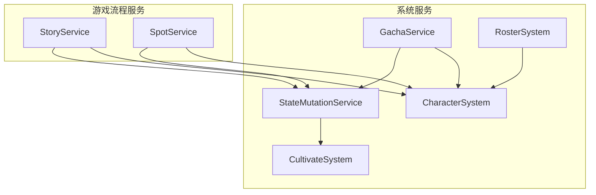
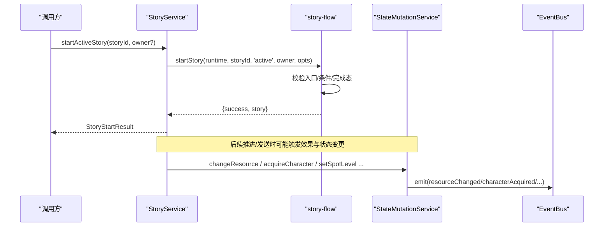
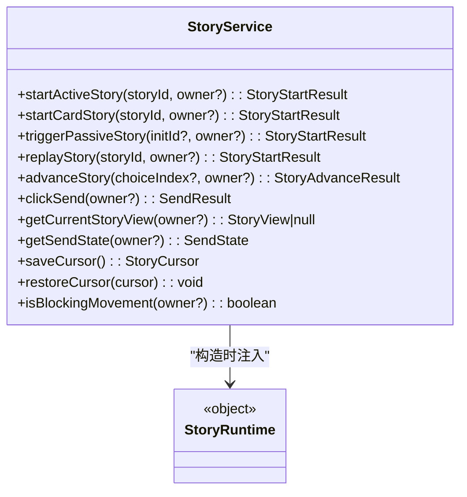
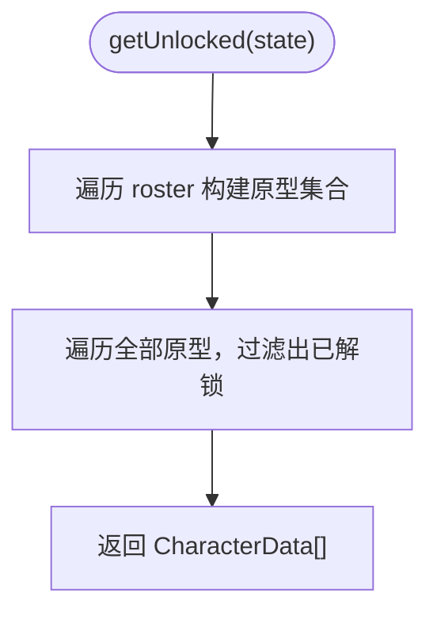
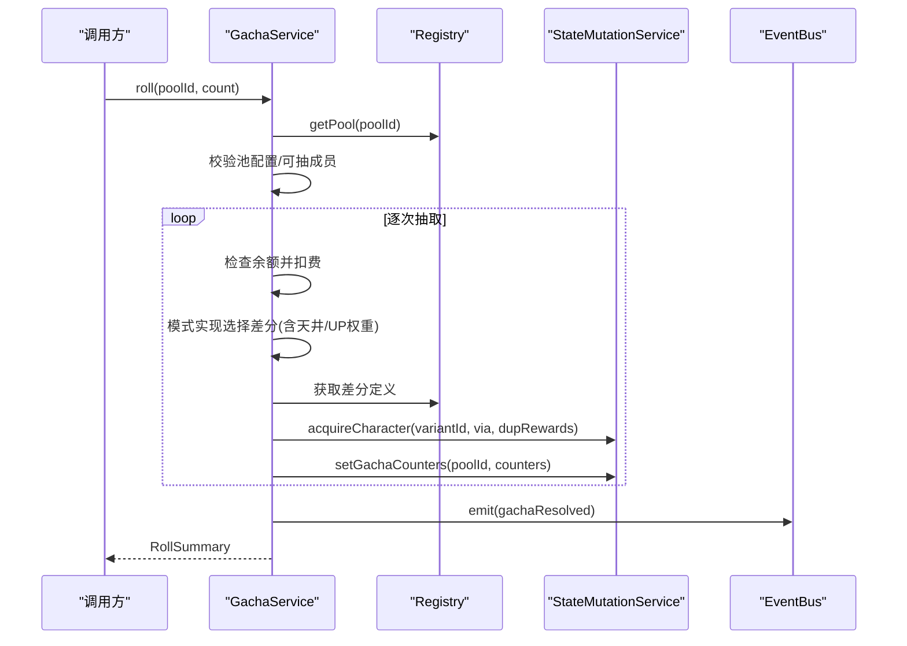
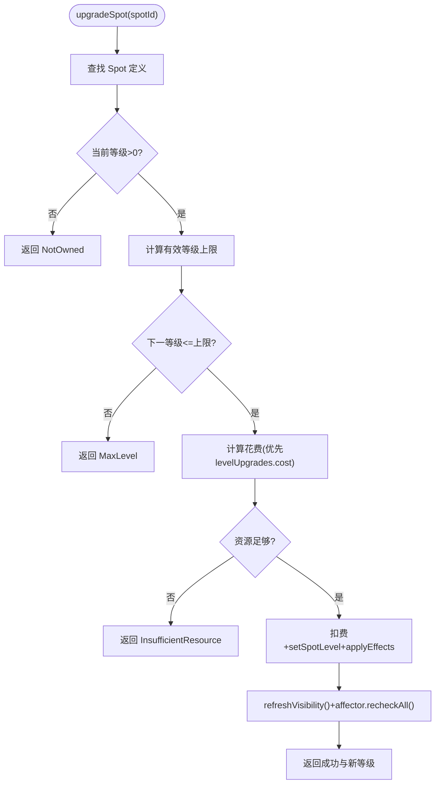
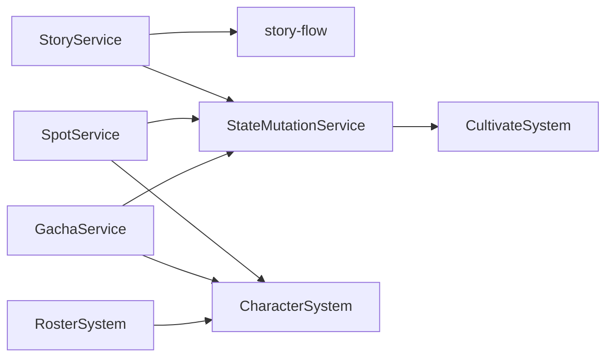

# 服务API

<cite>
**本文引用的文件**
- [story-service.ts](file://src/engine/game/story-service.ts)
- [story-flow.ts](file://src/engine/game/story-flow.ts)
- [character-system.ts](file://src/engine/system/character-system.ts)
- [gacha-service.ts](file://src/engine/system/gacha-service.ts)
- [spot-service.ts](file://src/engine/game/spot-service.ts)
- [state-mutation-service.ts](file://src/engine/system/state-mutation-service.ts)
- [roster-system.ts](file://src/engine/system/roster-system.ts)
- [cultivate-system.ts](file://src/engine/system/cultivate-system.ts)
</cite>

## 目录
1. [简介](#简介)
2. [项目结构](#项目结构)
3. [核心组件](#核心组件)
4. [架构总览](#架构总览)
5. [详细组件分析](#详细组件分析)
6. [依赖关系分析](#依赖关系分析)
7. [性能考量](#性能考量)
8. [故障排查指南](#故障排查指南)
9. [结论](#结论)
10. [附录：常见业务场景示例](#附录：常见业务场景示例)

## 简介
本文件面向ACProgram项目的服务层API，聚焦以下业务服务的公共接口与协作方式：
- StoryService：剧情管理（启动、推进、发送、重读、被动闲聊）
- CharacterSystem：角色原型元数据查询与解锁判定
- GachaService：抽卡功能（模式结算、资源扣除、重复奖励、天井）
- SpotService：区域管理（购买、升级、标签、产出计算）
并说明它们如何协同完成“角色培养”“剧情推进”“资源管理”等常见业务。文档提供方法签名、参数类型、返回值与调用顺序，以及异常处理与错误恢复的最佳实践。

## 项目结构
服务层位于 engine 目录下，按职责分层组织：
- game：面向游戏流程的服务编排（StoryService、SpotService）
- system：系统级能力（CharacterSystem、GachaService、StateMutationService、RosterSystem、CultivateSystem）
- types/results：统一的返回结果类型定义（如 StoryStartResult、RollSummary、SpotUpgradeResult 等）

图表来源
- [story-service.ts:52-84](file://src/engine/game/story-service.ts#L52-L84)
- [spot-service.ts:46-47](file://src/engine/game/spot-service.ts#L46-L47)
- [gacha-service.ts:83-98](file://src/engine/system/gacha-service.ts#L83-L98)
- [character-system.ts:18-25](file://src/engine/system/character-system.ts#L18-L25)
- [state-mutation-service.ts:41-47](file://src/engine/system/state-mutation-service.ts#L41-L47)
- [roster-system.ts:38-44](file://src/engine/system/roster-system.ts#L38-L44)
- [cultivate-system.ts:35-45](file://src/engine/system/cultivate-system.ts#L35-L45)

章节来源
- [story-service.ts:1-271](file://src/engine/game/story-service.ts#L1-L271)
- [spot-service.ts:1-255](file://src/engine/game/spot-service.ts#L1-L255)
- [gacha-service.ts:1-187](file://src/engine/system/gacha-service.ts#L1-L187)
- [character-system.ts:1-87](file://src/engine/system/character-system.ts#L1-L87)
- [state-mutation-service.ts:1-566](file://src/engine/system/state-mutation-service.ts#L1-L566)
- [roster-system.ts:1-105](file://src/engine/system/roster-system.ts#L1-L105)
- [cultivate-system.ts:1-107](file://src/engine/system/cultivate-system.ts#L1-L107)

## 核心组件
- StoryService：持有全局与聊天沙盒的剧情游标，提供对外统一入口（startActiveStory、startCardStory、triggerPassiveStory、replayStory、advanceStory、clickSend、getCurrentStoryView、getSendState），内部委托 story-flow/jump/replay/rewards 实现。
- CharacterSystem：加载与筛选角色原型，基于 roster 判定已解锁角色，提供学校/稀有度过滤与计数。
- GachaService：抽取模式注册表 + ba-classic 结算；逐次扣费、pity 结算、重复奖励、事件广播。
- SpotService：区域购买/升级/标签管理、产出计算、可见性与 Affector 联动。
- StateMutationService：统一状态写入入口，所有变更均记录统计并广播事件。
- RosterSystem：通讯录与图鉴只读视图。
- CultivateSystem：纯计算模块（经验曲线、突破校验）。

章节来源
- [story-service.ts:52-228](file://src/engine/game/story-service.ts#L52-L228)
- [character-system.ts:18-85](file://src/engine/system/character-system.ts#L18-L85)
- [gacha-service.ts:83-185](file://src/engine/system/gacha-service.ts#L83-L185)
- [spot-service.ts:46-255](file://src/engine/game/spot-service.ts#L46-L255)
- [state-mutation-service.ts:41-566](file://src/engine/system/state-mutation-service.ts#L41-L566)
- [roster-system.ts:38-105](file://src/engine/system/roster-system.ts#L38-L105)
- [cultivate-system.ts:15-107](file://src/engine/system/cultivate-system.ts#L15-L107)

## 架构总览
服务间通过依赖注入组合：
- StoryService 依赖 Registry、ConditionSystem、EffectEngine、StateMutationService、PassivePoolSystem、EventBus，并通过 travelToArea 回调与移动规则交互。
- SpotService 依赖 ValueSystem、ConditionSystem、EffectEngine、AffectorEngine、CharacterSystem、EventBus、DevLog。
- GachaService 依赖 Registry、StateMutationService、EventBus，并通过 getBalance/getDrawable 回调接入可用性服务。
- StateMutationService 作为唯一写入口，串联 StatsService 与 EventBus。

图表来源
- [story-service.ts:180-228](file://src/engine/game/story-service.ts#L180-L228)
- [story-flow.ts:54-104](file://src/engine/game/story-flow.ts#L54-L104)
- [state-mutation-service.ts:110-196](file://src/engine/system/state-mutation-service.ts#L110-L196)

章节来源
- [story-service.ts:1-271](file://src/engine/game/story-service.ts#L1-L271)
- [story-flow.ts:1-200](file://src/engine/game/story-flow.ts#L1-L200)
- [state-mutation-service.ts:1-566](file://src/engine/system/state-mutation-service.ts#L1-L566)

## 详细组件分析

### StoryService（剧情管理服务）
- 职责：游标持有与访问（存档/移动规则）、对外 API 委托、聊天沙盒隔离。
- 关键方法
  - startActiveStory(storyId, owner?): StoryStartResult
  - startCardStory(storyId, owner?): StoryStartResult
  - triggerPassiveStory(initId?, owner?): StoryStartResult
  - replayStory(storyId, owner?): StoryStartResult
  - advanceStory(choiceIndex?, owner?): StoryAdvanceResult
  - clickSend(owner?): SendResult
  - getCurrentStoryView(owner?): StoryView | null
  - getSendState(owner?): SendState
  - saveCursor()/restoreCursor()、saveChatCursors()/restoreChatCursors()
  - isBlockingMovement(owner?): boolean
- 行为要点
  - active 可打断 passive；passive 不可覆盖 active。
  - 聊天卡片跳过可用世界线与触发条件，但仍尊重单次完成态。
  - 推进时若存在 clickWork 且将离开当前 Story，需先 clickSend 确认点击。
  - 分支守卫在重读模式下生效。
- 依赖
  - StoryRuntime（registry、conditionSystem、effectEngine、mutations、eventBus、passivePools、travelToArea、getState、cursorFor、entryById、storyOf、currentPage、hasCompletedStory、getView、guardPrereqsMet、flagsSetThisStory、lastRewarded）

图表来源
- [story-service.ts:52-84](file://src/engine/game/story-service.ts#L52-L84)
- [story-service.ts:180-228](file://src/engine/game/story-service.ts#L180-L228)

章节来源
- [story-service.ts:1-271](file://src/engine/game/story-service.ts#L1-L271)
- [story-flow.ts:26-131](file://src/engine/game/story-flow.ts#L26-L131)

### CharacterSystem（角色原型查询）
- 职责：加载角色原型、按学校/稀有度筛选、基于 roster 判定已解锁角色。
- 关键方法
  - load(characters): void
  - get(id): CharacterData | undefined
  - getAll(): CharacterData[]
  - getBySchool(school): CharacterData[]
  - getByRarity(rarity): CharacterData[]
  - getUnlocked(state): CharacterData[]
  - exists(id): boolean
  - clear(): void
  - countSchoolMembers(school, state): number
- 行为要点
  - 解锁判定以 roster 为准：拥有任一差分即视为解锁该原型。
  - 支持设置 variantProto 解析器以从差分 id 反查原型。

图表来源
- [character-system.ts:54-70](file://src/engine/system/character-system.ts#L54-L70)

章节来源
- [character-system.ts:1-87](file://src/engine/system/character-system.ts#L1-L87)

### GachaService（抽卡服务）
- 职责：抽取模式注册与结算（ba-classic）、资源扣除、重复奖励、天井、事件广播。
- 关键方法
  - roll(poolId, count): RollSummary
  - getPool(poolId): GachaPoolDef | undefined
  - countersOf(poolId): { pity, pulls }
  - setRng(rng): void
- 返回类型
  - RollSummary: { results: PullResult[], stopped?: 'insufficient-currency' }
  - PullResult: { variantId, duplicate, shards, bonusResources }
- 行为要点
  - 逐次扣费与结算，中途资源不足则中止并返回已完成部分。
  - 天井命中归零 pity；非天井抽中最高稀有度按 keepOnHit 决定归零或累加。
  - 通过 mutations.acquireCharacter 获得角色或碎片与附加资源。
  - 抽取完成后广播 gachaResolved 事件。

图表来源
- [gacha-service.ts:117-171](file://src/engine/system/gacha-service.ts#L117-L171)
- [state-mutation-service.ts:155-196](file://src/engine/system/state-mutation-service.ts#L155-L196)

章节来源
- [gacha-service.ts:1-187](file://src/engine/system/gacha-service.ts#L1-L187)
- [state-mutation-service.ts:155-213](file://src/engine/system/state-mutation-service.ts#L155-L213)

### SpotService（区域管理服务）
- 职责：区域购买/升级/标签管理、产出计算、可见性与 Affector 联动。
- 关键方法
  - upgradeSpot(spotId): SpotUpgradeResult
  - unlockSpot(spotId): SpotUnlockResult
  - assignManager(spotId, character): boolean
  - getManagerBonus(spotId): number
  - getSpotYield(spotId): { base, managerBonus, tagMultiplier, total }
  - getEffectiveMaxLevel(spotId): number | undefined
  - addSpotTag(spotId, tag): boolean
  - removeSpotTag(spotId, tag): boolean
- 行为要点
  - 升级优先使用 levelUpgrades 的 cost 与 effects；否则走通用公式。
  - 等级上限受 Affector 覆盖与 Spot 自身 maxLevel 影响。
  - 解锁需满足可见性、等级上限与资源充足。
  - Tag 增撤会刷新可见性与重新评估 Affector。

图表来源
- [spot-service.ts:54-131](file://src/engine/game/spot-service.ts#L54-L131)

章节来源
- [spot-service.ts:1-255](file://src/engine/game/spot-service.ts#L1-L255)

### StateMutationService（统一状态写入）
- 职责：集中 PlayerState 变更，统一记录统计与广播事件。
- 关键方法（节选）
  - changeResource(resource, delta): number
  - acquireCharacter(variantId, via, rewards?): { duplicate, shards, bonusResources }
  - setSpotLevel(spotId, level): void
  - addExp(variantId, amount): { ok, newLevel, newExp }
  - breakthroughStar(variantId): { ok, reason?, newStars? }
  - addItem/removeItem、unlockInit、completeStory、applyEffects 等
- 行为要点
  - 每个 mutation 遵循：写状态 → 更新统计 → 广播事件。
  - 资源写入区分全局资源桶与局部资源桶。
  - 角色获得首次创建条目，重复获得返还碎片与附加资源。
  - 培养与突破通过 CultivateSystem 进行纯计算后再落盘。

章节来源
- [state-mutation-service.ts:1-566](file://src/engine/system/state-mutation-service.ts#L1-L566)
- [cultivate-system.ts:15-107](file://src/engine/system/cultivate-system.ts#L15-L107)

### RosterSystem（通讯录查询）
- 职责：只读查询玩家持有的差分实例与碎片余额，提供通讯录与图鉴视图。
- 关键方法（节选）
  - getOwned(state, variantId): RosterEntry | undefined
  - shardsOf(state, variantId): number
  - contactGroups(state): ContactGroup[]
  - codex(state): ContactEntry[]

章节来源
- [roster-system.ts:1-105](file://src/engine/system/roster-system.ts#L1-L105)

## 依赖关系分析
- StoryService 依赖 story-flow/jump/replay/rewards 子模块，并通过 StoryRuntime 共享上下文。
- SpotService 依赖 ValueSystem、ConditionSystem、EffectEngine、AffectorEngine、CharacterSystem 与 DevLog。
- GachaService 依赖 Registry、StateMutationService、EventBus，并通过回调注入余额与可抽集合。
- StateMutationService 依赖 StatsService 与 EventBus，串联各子系统的事件流。
- CharacterSystem 与 RosterSystem 分别负责原型查询与通讯录视图，二者解耦于状态写入。

图表来源
- [story-service.ts:52-84](file://src/engine/game/story-service.ts#L52-L84)
- [spot-service.ts:28-44](file://src/engine/game/spot-service.ts#L28-L44)
- [gacha-service.ts:83-98](file://src/engine/system/gacha-service.ts#L83-L98)
- [state-mutation-service.ts:41-47](file://src/engine/system/state-mutation-service.ts#L41-L47)

章节来源
- [story-service.ts:1-271](file://src/engine/game/story-service.ts#L1-L271)
- [spot-service.ts:1-255](file://src/engine/game/spot-service.ts#L1-L255)
- [gacha-service.ts:1-187](file://src/engine/system/gacha-service.ts#L1-L187)
- [state-mutation-service.ts:1-566](file://src/engine/system/state-mutation-service.ts#L1-L566)

## 性能考量
- 事件惰性统计上下文：StateMutationService 仅在消费方访问 stats 时构建完整快照，避免高频 Tick 下的昂贵拷贝。
- 批量操作：GachaService 逐次扣费与结算，但可在上层合并多次请求以减少事件风暴。
- 可见性与 Affector 重算：SpotService 在升级/标签变更后触发一次刷新，建议批量修改后统一刷新。
- 剧情推进中的 clickWork 防护可减少无效跳转与副作用。

[本节为通用指导，不直接分析具体文件]

## 故障排查指南
- 剧情相关
  - AlreadyActive：已有进行中剧情（active 不可被 passive 覆盖；passive 不可覆盖 active）。
  - ConditionNotMet：入口条件或选项条件未满足。
  - ClickRequired：需要完成点击工作才能推进。
  - BranchGuardDenied：重读模式下分支守卫拒绝进入。
- 抽卡相关
  - 未知卡池/未注册模式/配置不完整：检查 pool 定义与 rates/members。
  - insufficient-currency：余额不足导致中止，返回已完成部分。
- 区域相关
  - NotFound/NotOwned/MaxLevel/InsufficientResource/NotVisible：按返回码定位问题。
  - 升级失败：检查 levelUpgrades 是否存在、cost 表达式是否合法、资源是否足够。
- 状态写入
  - 确保通过 StateMutationService 写入，避免绕过事件与统计。
  - 角色获得/培养/突破均会触发对应事件，可用于追踪问题。

章节来源
- [story-flow.ts:54-131](file://src/engine/game/story-flow.ts#L54-L131)
- [gacha-service.ts:117-171](file://src/engine/system/gacha-service.ts#L117-L171)
- [spot-service.ts:54-210](file://src/engine/game/spot-service.ts#L54-L210)
- [state-mutation-service.ts:110-196](file://src/engine/system/state-mutation-service.ts#L110-L196)

## 结论
本服务层通过清晰的分层与职责划分，将剧情、角色、抽卡、区域管理等核心玩法解耦，并以 StateMutationService 统一状态写入与事件广播，保证一致性与可观测性。StoryService 提供稳定的剧情入口，GachaService 封装复杂结算逻辑，SpotService 提供灵活的区域管理与标签体系。配合 RosterSystem 与 CultivateSystem 的只读与纯计算特性，便于扩展与维护。

[本节为总结，不直接分析具体文件]

## 附录：常见业务场景示例
以下为典型业务流程的调用顺序与注意事项（以路径引用代替代码片段）：

- 角色培养（加经验/星级突破）
  - 步骤
    - 通过 RosterSystem.getOwned 确认拥有该差分。
    - 调用 StateMutationService.addExp(variantId, amount) 增加经验。
    - 如需突破，调用 StateMutationService.breakthroughStar(variantId)。
  - 参考
    - [state-mutation-service.ts:321-366](file://src/engine/system/state-mutation-service.ts#L321-L366)
    - [cultivate-system.ts:64-107](file://src/engine/system/cultivate-system.ts#L64-L107)

- 剧情推进（主线/羁绊/闲聊）
  - 步骤
    - 使用 StoryService.startActiveStory 或 startCardStory 启动剧情。
    - 循环调用 StoryService.advanceStory 推进至选项或结束。
    - 遇到 clickWork 页需先调用 StoryService.clickSend 完成点击。
    - 剧情完结后由 story-rewards 应用奖励并记录日志。
  - 参考
    - [story-service.ts:180-228](file://src/engine/game/story-service.ts#L180-L228)
    - [story-flow.ts:54-200](file://src/engine/game/story-flow.ts#L54-L200)

- 资源管理（区域升级/购买）
  - 步骤
    - 调用 SpotService.unlockSpot 购买区域（若未拥有）。
    - 调用 SpotService.upgradeSpot 升级区域。
    - 必要时通过 SpotService.addSpotTag/removeSpotTag 动态调整标签。
  - 参考
    - [spot-service.ts:182-210](file://src/engine/game/spot-service.ts#L182-L210)
    - [spot-service.ts:54-131](file://src/engine/game/spot-service.ts#L54-L131)
    - [spot-service.ts:212-241](file://src/engine/game/spot-service.ts#L212-L241)

- 抽卡（十连/单抽）
  - 步骤
    - 调用 GachaService.roll(poolId, count) 执行抽取。
    - 根据返回的 RollSummary.results 处理重复奖励与新增角色。
    - 监听 gachaResolved 事件以更新UI或触发后续流程。
  - 参考
    - [gacha-service.ts:117-171](file://src/engine/system/gacha-service.ts#L117-L171)
    - [state-mutation-service.ts:155-196](file://src/engine/system/state-mutation-service.ts#L155-L196)

- 角色解锁与查询
  - 步骤
    - 使用 CharacterSystem.getUnlocked(state) 获取已解锁原型列表。
    - 使用 RosterSystem.contactGroups(state)/codex(state) 生成通讯录/图鉴视图。
  - 参考
    - [character-system.ts:54-70](file://src/engine/system/character-system.ts#L54-L70)
    - [roster-system.ts:74-105](file://src/engine/system/roster-system.ts#L74-L105)