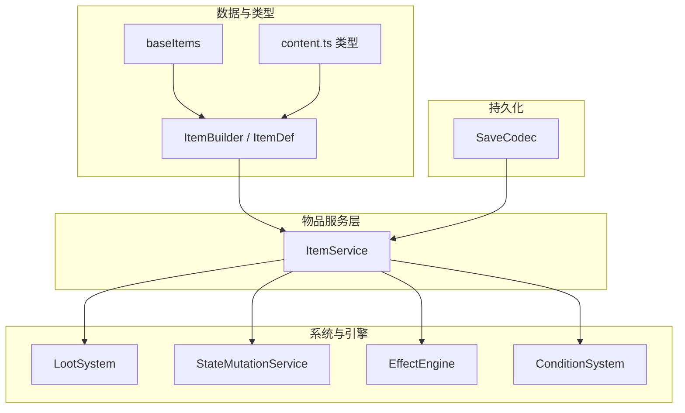
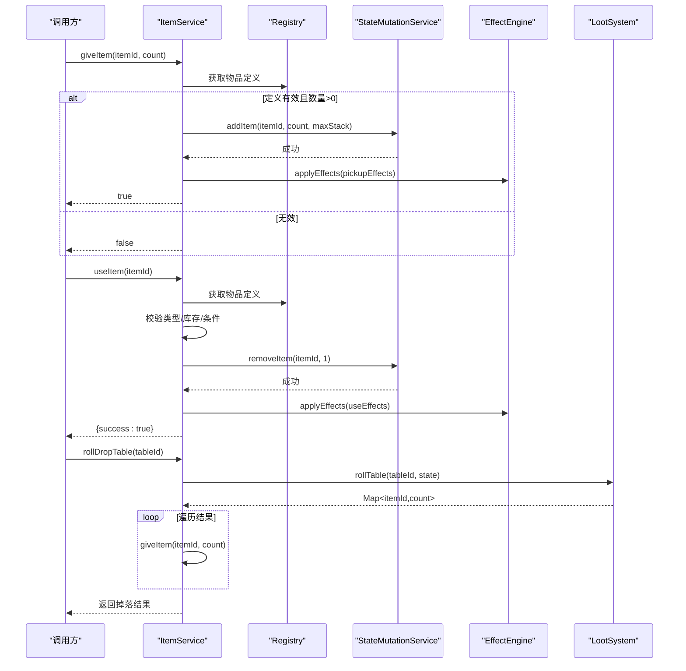
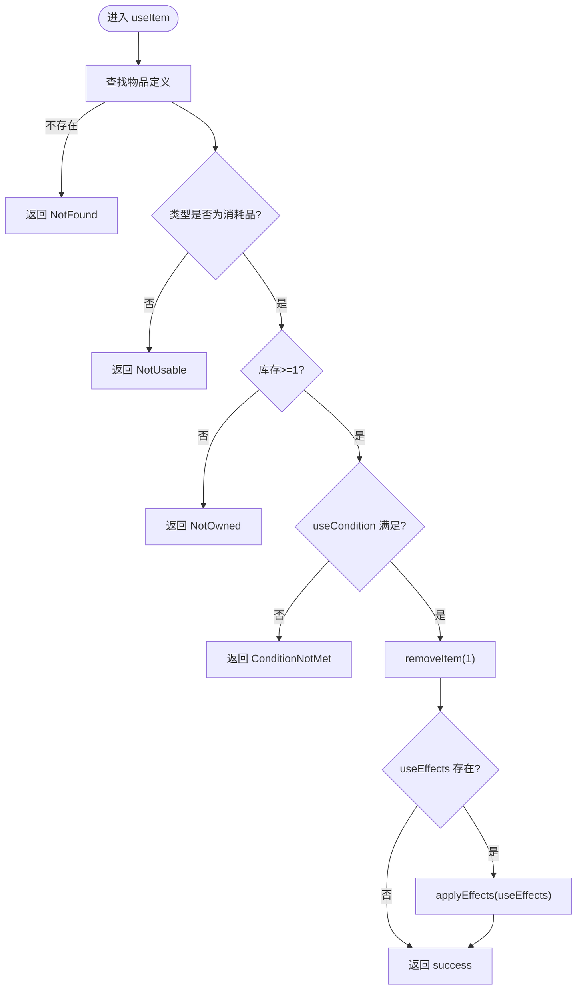
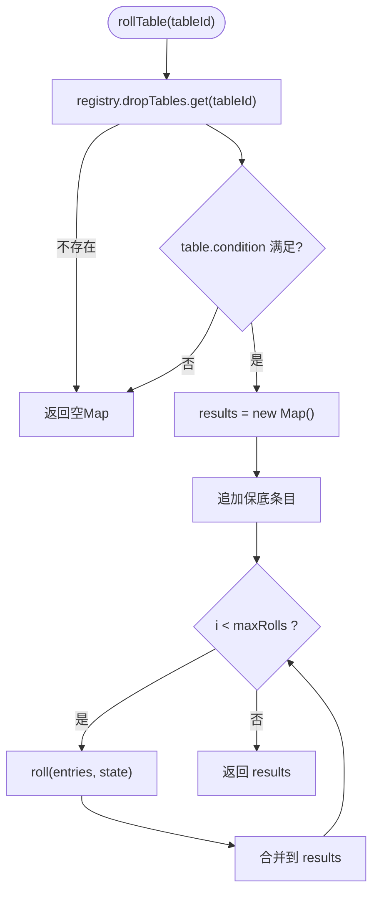
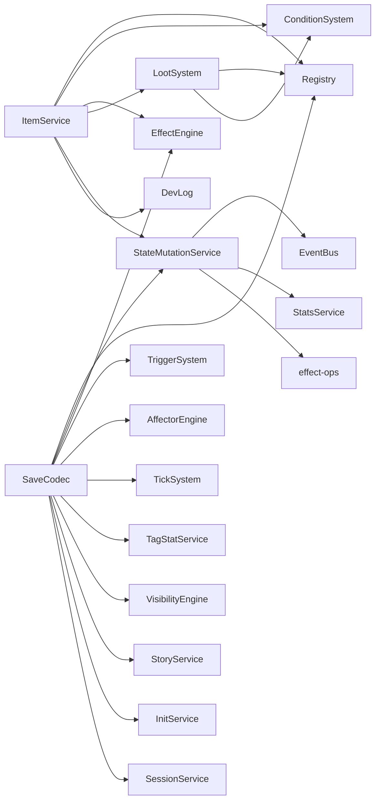

# 物品服务API

<cite>
**本文引用的文件**
- [item-service.ts](file://src/engine/game/item-service.ts)
- [loot-system.ts](file://src/engine/system/loot-system.ts)
- [state-mutation-service.ts](file://src/engine/system/state-mutation-service.ts)
- [item.ts（定义构建器）](file://src/engine/def-factory/item.ts)
- [items.ts（基础物品数据）](file://src/data/base/items.ts)
- [content.ts（内容类型定义）](file://src/engine/types/content.ts)
- [save-codec.ts](file://src/engine/game/save-codec.ts)
</cite>

## 目录
1. [简介](#简介)
2. [项目结构](#项目结构)
3. [核心组件](#核心组件)
4. [架构总览](#架构总览)
5. [详细组件分析](#详细组件分析)
6. [依赖关系分析](#依赖关系分析)
7. [性能考量](#性能考量)
8. [故障排查指南](#故障排查指南)
9. [结论](#结论)
10. [附录：使用示例与最佳实践](#附录使用示例与最佳实践)

## 简介
本文件为 ItemService 的物品管理 API 文档，覆盖物品的获取、使用、销毁（移除）、掉落系统、背包管理与物品效果系统。文档面向开发者与策划，既提供接口说明，也给出常见场景的调用流程与注意事项，并包含存档序列化与版本兼容要点。

## 项目结构
围绕物品系统的核心代码分布在以下模块：
- 物品领域服务：负责发放、使用、掉落表结算与效果执行
- 掉落系统：实现按权重随机抽选、保底与多次抽取
- 状态变更服务：统一写入玩家状态（背包增减、资源变化等），并发出事件
- 物品定义与构建器：声明物品元数据、类型、堆叠上限、稀有度、条件与效果
- 基础物品数据：示例消耗品、材料、关键物品
- 存档编解码：负责玩家状态的序列化、反序列化与旧档兼容

图表来源
- [item-service.ts:24-73](file://src/engine/game/item-service.ts#L24-L73)
- [loot-system.ts:14-79](file://src/engine/system/loot-system.ts#L14-L79)
- [state-mutation-service.ts:387-418](file://src/engine/system/state-mutation-service.ts#L387-L418)
- [item.ts（定义构建器）:14-77](file://src/engine/def-factory/item.ts#L14-L77)
- [items.ts（基础物品数据）:8-64](file://src/data/base/items.ts#L8-L64)
- [save-codec.ts:25-79](file://src/engine/game/save-codec.ts#L25-L79)

章节来源
- [item-service.ts:24-73](file://src/engine/game/item-service.ts#L24-L73)
- [loot-system.ts:14-79](file://src/engine/system/loot-system.ts#L14-L79)
- [state-mutation-service.ts:387-418](file://src/engine/system/state-mutation-service.ts#L387-L418)
- [item.ts（定义构建器）:14-77](file://src/engine/def-factory/item.ts#L14-L77)
- [items.ts（基础物品数据）:8-64](file://src/data/base/items.ts#L8-L64)
- [save-codec.ts:25-79](file://src/engine/game/save-codec.ts#L25-L79)

## 核心组件
- ItemService：对外暴露物品发放、使用、掉落表结算三大能力；内部委托至状态变更、条件判定、效果引擎与掉落系统。
- LootSystem：从掉落表中筛选满足条件的条目，计算权重并随机抽选，支持保底与多次抽取。
- StateMutationService：统一的玩家状态写入入口，处理背包增减、资源变化、统计记录与事件广播。
- ItemBuilder/ItemDef：链式构建物品定义，声明名称、描述、类型、稀有度、堆叠上限、使用条件与获得/使用效果。
- baseItems：示例物品集合，涵盖消耗品、材料与关键物品，展示不同 type 的使用方式。
- SaveCodec：负责玩家状态与可见性快照的序列化，以及旧版存档字段迁移与兼容性处理。

章节来源
- [item-service.ts:24-73](file://src/engine/game/item-service.ts#L24-L73)
- [loot-system.ts:14-79](file://src/engine/system/loot-system.ts#L14-L79)
- [state-mutation-service.ts:387-418](file://src/engine/system/state-mutation-service.ts#L387-L418)
- [item.ts（定义构建器）:14-77](file://src/engine/def-factory/item.ts#L14-L77)
- [items.ts（基础物品数据）:8-64](file://src/data/base/items.ts#L8-L64)
- [save-codec.ts:82-106](file://src/engine/game/save-codec.ts#L82-L106)

## 架构总览
ItemService 作为门面，协调多个子系统完成物品相关操作：
- 发放物品：查询物品定义 → 写入背包 → 触发获得时效果
- 使用物品：校验存在性与类型 → 检查库存与条件 → 扣减数量 → 触发使用效果
- 掉落表结算：根据表ID加载掉落表 → 条件过滤 → 权重随机 → 合并结果 → 发放到背包

图表来源
- [item-service.ts:27-72](file://src/engine/game/item-service.ts#L27-L72)
- [loot-system.ts:59-78](file://src/engine/system/loot-system.ts#L59-L78)
- [state-mutation-service.ts:387-418](file://src/engine/system/state-mutation-service.ts#L387-L418)

## 详细组件分析

### ItemService：物品领域服务
职责
- 发放物品：校验物品定义与数量，写入背包，触发获得时效果
- 使用物品：校验存在性、类型、库存与条件，扣减数量，触发使用效果
- 掉落表结算：委托掉落系统生成结果，再逐一发放到背包

关键行为
- 发放失败：记录错误日志并返回失败
- 使用失败：区分未找到、不可用、未拥有、条件不满足等错误原因
- 掉落表：先保底，再进行多次权重随机，合并相同物品数量后发放

图表来源
- [item-service.ts:39-65](file://src/engine/game/item-service.ts#L39-L65)

章节来源
- [item-service.ts:27-72](file://src/engine/game/item-service.ts#L27-L72)

### LootSystem：掉落表抽选系统
职责
- 从掉落表条目中筛选满足条件的项
- 计算总权重并进行加权随机
- 支持保底条目与多次抽取，合并结果

复杂度
- 单次 roll：O(n) 筛选 + O(n) 累加权重 + O(n) 遍历命中
- rollTable：O(guaranteed) + O(maxRolls * n)

图表来源
- [loot-system.ts:28-78](file://src/engine/system/loot-system.ts#L28-L78)

章节来源
- [loot-system.ts:28-78](file://src/engine/system/loot-system.ts#L28-L78)

### StateMutationService：状态变更服务（背包与资源）
职责
- 统一修改 PlayerState，确保统计与事件同步
- 提供 addItem/removeItem 对背包进行原子写入
- 提供 changeResource/setResource 对资源进行统一写入

关键点
- addItem：考虑最大堆叠，记录实际增加量，发出 itemCollected 事件
- removeItem：负数或不足则拒绝，删除键或更新数量，发出 itemCollected 事件
- 资源写入：全局资源与本地资源分桶，发出 resourceChanged 事件

章节来源
- [state-mutation-service.ts:110-128](file://src/engine/system/state-mutation-service.ts#L110-L128)
- [state-mutation-service.ts:387-418](file://src/engine/system/state-mutation-service.ts#L387-L418)

### 物品定义与类型：ItemBuilder 与 ItemDef
职责
- 通过链式 API 构建物品定义，强制必填字段（名称、描述）
- 支持设置类型（消耗品/材料/钥匙）、稀有度、堆叠上限
- 配置使用条件、使用效果、获得时效果、出售价格、揭示触发、附加包等

类型约束
- type 枚举：consumable、material、key
- rarity 枚举：common、rare、epic、legendary
- 效果与条件来自表达式系统，支持运行时评估

章节来源
- [item.ts（定义构建器）:14-77](file://src/engine/def-factory/item.ts#L14-L77)
- [content.ts（内容类型定义）:1-200](file://src/engine/types/content.ts#L1-L200)

### 基础物品数据：baseItems
示例
- 消耗品：能量饮料、高级能量饮料、战术急救包、喵喵饼干
- 材料：野外调查记录、神秘碎片、损毁的核心零件、千禧年数据芯片、战斗数据报告、佩洛洛玩偶
- 关键物品：夏莱通行证、联邦委托书

用途
- 演示不同类型物品的定义与效果配置
- 用于测试背包使用流程与掉落产出

章节来源
- [items.ts（基础物品数据）:8-64](file://src/data/base/items.ts#L8-L64)

## 依赖关系分析
- ItemService 依赖 Registry（物品与掉落表）、ConditionSystem（条件评估）、EffectEngine（效果执行）、LootSystem（掉落结算）、StateMutationService（状态写入）、DevLog（日志）
- LootSystem 依赖 Registry（掉落表）、ConditionSystem（条件评估）、EventBus（可选遗留）
- StateMutationService 依赖 EventBus、StatsService（统计）、effect-ops（效果应用）
- SaveCodec 依赖 Registry、StateMutationService、EffectEngine、TriggerSystem、AffectorEngine、TickSystem、TagStatService、VisibilityEngine、StoryService、InitService、SessionService

图表来源
- [item-service.ts:24-73](file://src/engine/game/item-service.ts#L24-L73)
- [loot-system.ts:14-79](file://src/engine/system/loot-system.ts#L14-L79)
- [state-mutation-service.ts:41-101](file://src/engine/system/state-mutation-service.ts#L41-L101)
- [save-codec.ts:108-172](file://src/engine/game/save-codec.ts#L108-L172)

章节来源
- [item-service.ts:24-73](file://src/engine/game/item-service.ts#L24-L73)
- [loot-system.ts:14-79](file://src/engine/system/loot-system.ts#L14-L79)
- [state-mutation-service.ts:41-101](file://src/engine/system/state-mutation-service.ts#L41-L101)
- [save-codec.ts:108-172](file://src/engine/game/save-codec.ts#L108-L172)

## 性能考量
- 掉落表 roll：每次抽取线性扫描条目，适合中等规模表；若条目极多可考虑分段索引或前缀和加速
- 背包写入：addItem/removeItem 为常数时间操作，注意堆叠上限避免重复分配
- 事件与统计：每次状态变更都会触发事件与统计记录，高频调用时需关注订阅者开销
- 效果执行：use/pickup 效果批量应用，建议将复杂逻辑下沉到 effect-ops，减少上层分支判断

[本节为通用指导，无需具体文件引用]

## 故障排查指南
常见问题与定位
- 发放失败：检查物品是否存在、数量是否大于0；查看 DevLog 中的 inventory 错误日志
- 使用失败：
  - NotFound：物品未注册
  - NotUsable：物品类型非消耗品
  - NotOwned：库存不足
  - ConditionNotMet：useCondition 未满足
- 掉落为空：检查掉落表是否存在、表级条件是否满足、条目权重是否为0

建议
- 在 UI 层显示失败原因提示
- 对高频掉落路径添加采样日志
- 使用 StatsService 的 item/resource 变更记录回溯问题

章节来源
- [item-service.ts:27-65](file://src/engine/game/item-service.ts#L27-L65)
- [state-mutation-service.ts:387-418](file://src/engine/system/state-mutation-service.ts#L387-L418)

## 结论
ItemService 提供了简洁稳定的物品管理接口，结合 LootSystem 与 StateMutationService 实现了完整的掉落、背包与效果体系。通过 ItemBuilder 与 baseItems 可快速扩展新物品类型与玩法。配合 SaveCodec 的版本兼容机制，保证存档长期稳定。

[本节为总结，无需具体文件引用]

## 附录：使用示例与最佳实践

### 常见场景
- 拾取掉落物
  - 调用 rollDropTable(tableId)，将结果逐一发放到背包
  - 适用于区域探索、任务奖励、随机事件
- 使用消耗品
  - 调用 useItem(itemId)，自动校验类型、库存与条件
  - 适用于饮用恢复、临时增益、资源补给
- 装备道具（概念）
  - 当前物品类型含 key/material/consumable；装备类可通过 Enhancement/Affector 包实现“持有即生效”的持续效果
  - 建议在 Item 上仅声明获得/使用效果，持续加成通过 Enhancement 挂载

### 物品效果系统
- 获得时效果（pickupEffects）：发放物品后立即执行，常用于播放动画、触发事件、附加 Buff
- 使用效果（useEffects）：使用消耗品时执行，如 addResource、数值调整、状态切换
- 使用条件（useCondition）：限制使用时机，如等级、进度、标签等

### 掉落系统
- 保底条目：guaranteed 列表无条件加入结果
- 多次抽取：maxRolls 控制随机次数，适合“十连抽”等体验
- 条件条目：entry.condition 控制条目可用性，适合活动限定、阶段解锁

### 背包管理
- 堆叠上限：maxStack 控制单格堆叠数量，避免过多格子占用
- 资源分桶：全局资源与本地资源分离，避免跨世界线污染
- 事件驱动：itemCollected 事件可用于 UI 刷新、成就检测、统计上报

### 存档序列化与版本兼容
- 版本号：SaveData.version 标识存档格式
- 字段补齐：normalizePlayerState 补齐 extras/initExtras/globalResources 等缺失字段
- 旧档迁移：将早期存放于 resources 的全局资源迁移至 globalResources
- 恢复流程：restoreFromSave 写入状态并重同步各子系统，确保一致性

章节来源
- [save-codec.ts:25-79](file://src/engine/game/save-codec.ts#L25-L79)
- [save-codec.ts:82-106](file://src/engine/game/save-codec.ts#L82-L106)
- [save-codec.ts:126-172](file://src/engine/game/save-codec.ts#L126-L172)