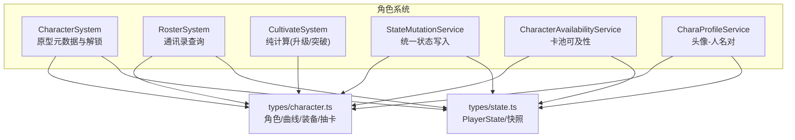
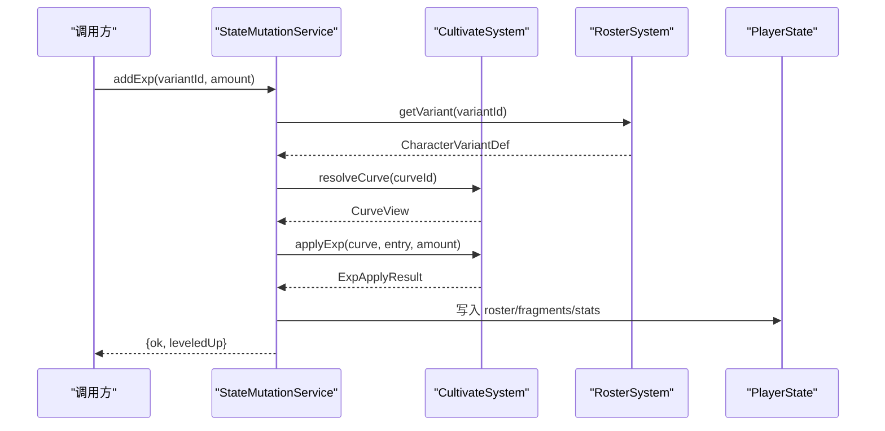
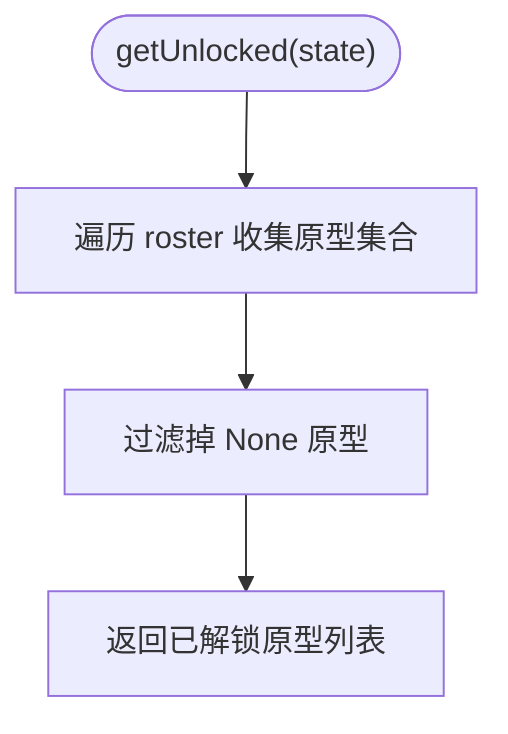
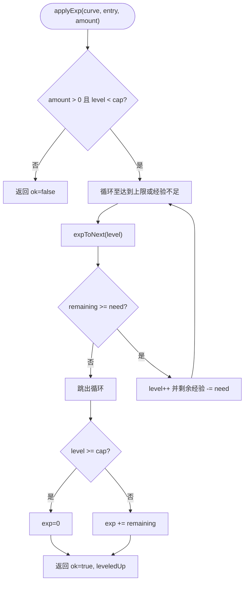
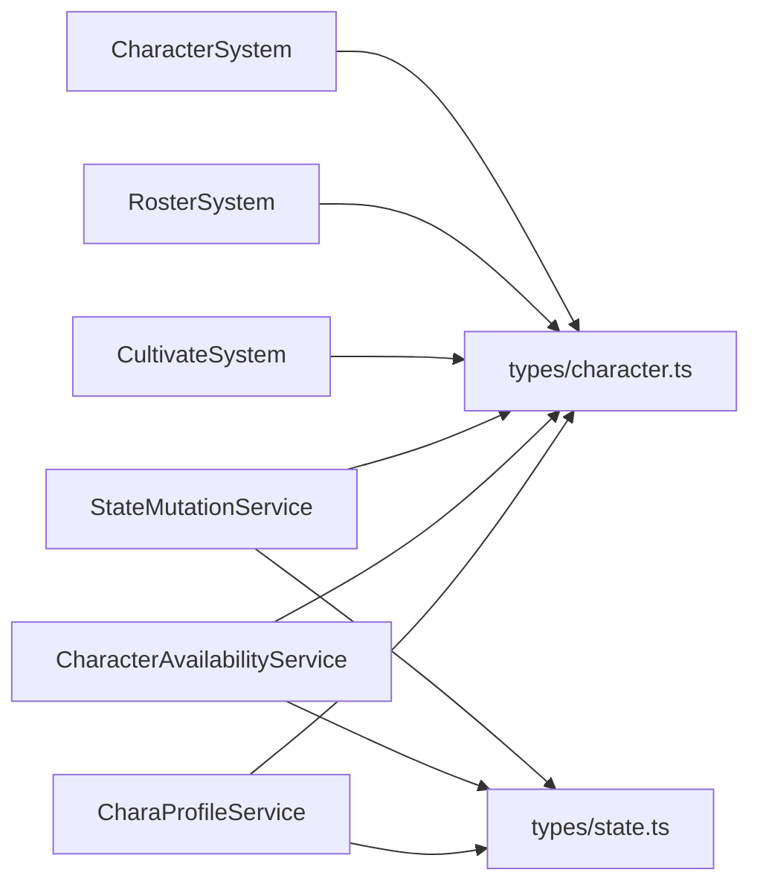
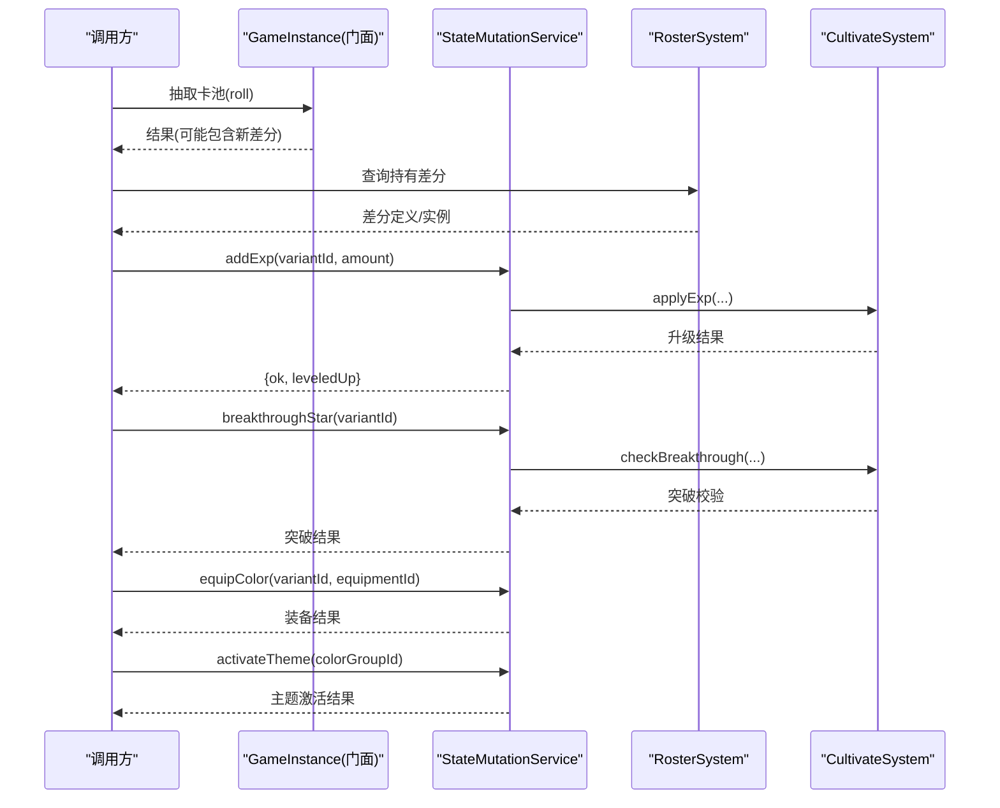

# 角色系统API

<cite>
**本文引用的文件**
- [character-system.ts](file://src/engine/system/character-system.ts)
- [character-availability.ts](file://src/engine/system/character-availability.ts)
- [cultivate-system.ts](file://src/engine/system/cultivate-system.ts)
- [roster-system.ts](file://src/engine/system/roster-system.ts)
- [chara-profile-service.ts](file://src/engine/system/chara-profile-service.ts)
- [state-mutation-service.ts](file://src/engine/system/state-mutation-service.ts)
- [character.ts](file://src/engine/types/character.ts)
- [state.ts](file://src/engine/types/state.ts)
- [character-system.test.ts](file://tests/engine/character-system.test.ts)
- [character-freeze.test.ts](file://tests/engine/character-freeze.test.ts)
</cite>

## 目录
1. [简介](#简介)
2. [项目结构](#项目结构)
3. [核心组件](#核心组件)
4. [架构总览](#架构总览)
5. [详细组件分析](#详细组件分析)
6. [依赖关系分析](#依赖关系分析)
7. [性能考量](#性能考量)
8. [故障排查指南](#故障排查指南)
9. [结论](#结论)
10. [附录：培养流程示例与最佳实践](#附录：培养流程示例与最佳实践)

## 简介
本文件为角色系统的全面API文档，覆盖角色获取、培养、状态管理、属性计算、等级提升、装备系统、可用性检查、冻结机制、数据持久化与恢复等主题。文档以代码级事实为依据，结合测试用例说明行为边界与约束，帮助读者在不深入源码的情况下也能正确使用角色系统。

## 项目结构
角色系统由多个子系统协作完成：
- CharacterSystem：负责角色原型元数据的加载与筛选（如按学校/稀有度），以及基于通讯录的“已解锁”判定。
- RosterSystem：通讯录查询服务，提供差分实例与碎片余额的统一只读视图。
- CultivateSystem：纯计算模块，负责曲线解析、升级推演、突破校验。
- StateMutationService：统一的状态写入入口，封装所有变更操作并触发事件与统计更新。
- CharacterAvailabilityService：卡池可及性管理，处理限定池关闭与世界Pool合并。
- CharaProfileService：头像-人名对服务，支持读取与覆写。
- 类型定义：character.ts 与 state.ts 定义了角色变体、培养曲线、色彩装备、抽卡池、玩家状态等核心数据结构。

图表来源
- [character-system.ts:18-86](file://src/engine/system/character-system.ts#L18-L86)
- [roster-system.ts:38-104](file://src/engine/system/roster-system.ts#L38-L104)
- [cultivate-system.ts:15-107](file://src/engine/system/cultivate-system.ts#L15-L107)
- [state-mutation-service.ts:1-40](file://src/engine/system/state-mutation-service.ts#L1-L40)
- [character-availability.ts:18-77](file://src/engine/system/character-availability.ts#L18-L77)
- [chara-profile-service.ts:18-61](file://src/engine/system/chara-profile-service.ts#L18-L61)
- [character.ts:39-438](file://src/engine/types/character.ts#L39-L438)
- [state.ts:35-140](file://src/engine/types/state.ts#L35-L140)

章节来源
- [character-system.ts:18-86](file://src/engine/system/character-system.ts#L18-L86)
- [roster-system.ts:38-104](file://src/engine/system/roster-system.ts#L38-L104)
- [cultivate-system.ts:15-107](file://src/engine/system/cultivate-system.ts#L15-L107)
- [state-mutation-service.ts:1-40](file://src/engine/system/state-mutation-service.ts#L1-L40)
- [character-availability.ts:18-77](file://src/engine/system/character-availability.ts#L18-L77)
- [chara-profile-service.ts:18-61](file://src/engine/system/chara-profile-service.ts#L18-L61)
- [character.ts:39-438](file://src/engine/types/character.ts#L39-L438)
- [state.ts:35-140](file://src/engine/types/state.ts#L35-L140)

## 核心组件
- CharacterSystem
  - 职责：加载与查询角色原型；基于通讯录判定“已解锁”；按学校/稀有度筛选；统计同校成员数。
  - 关键API：load/get/getAll/getBySchool/getByRarity/getUnlocked/exists/countSchoolMembers/clear/setVariantProtoResolver。
- RosterSystem
  - 职责：通讯录只读视图；查询差分定义、持有实例、碎片余额、累计获得次数、原型聚合统计；生成通讯录分组与图鉴视图。
  - 关键API：getVariant/getAllVariants/getOwned/isOwned/shardsOf/acquiredCountOf/protoStatOf/contactGroups/codex。
- CultivateSystem
  - 职责：纯计算；解析曲线、计算升级所需经验、模拟经验应用、突破校验。
  - 关键API：resolveCurve/effectiveMaxLevel/expToNext/applyExp/checkBreakthrough。
- StateMutationService
  - 职责：统一状态写入；组合调用培养计算；维护统计与事件；提供 acquireCharacter/addExp/breakthroughStar/equipColor/activateTheme 等高层接口。
- CharacterAvailabilityService
  - 职责：判断卡池是否关闭；计算当前可抽集合；刷新世界Pool；汇总全部可用差分ID。
- CharaProfileService
  - 职责：读取/设置/清除某角色的头像-人名对；提供名称与头像表。

章节来源
- [character-system.ts:18-86](file://src/engine/system/character-system.ts#L18-L86)
- [roster-system.ts:38-104](file://src/engine/system/roster-system.ts#L38-L104)
- [cultivate-system.ts:15-107](file://src/engine/system/cultivate-system.ts#L15-L107)
- [state-mutation-service.ts:1-40](file://src/engine/system/state-mutation-service.ts#L1-L40)
- [character-availability.ts:18-77](file://src/engine/system/character-availability.ts#L18-L77)
- [chara-profile-service.ts:18-61](file://src/engine/system/chara-profile-service.ts#L18-L61)

## 架构总览
角色系统采用“只读查询 + 统一写入”的分层设计：
- 查询层：CharacterSystem/RosterSystem/AvailabilityService/CharaProfileService 提供稳定只读视图。
- 计算层：CultivateSystem 提供无副作用的计算函数。
- 写入层：StateMutationService 作为唯一入口，组合计算结果并安全地修改 PlayerState，同时更新统计与广播事件。
- 数据层：types/character.ts 与 types/state.ts 定义契约，保证各层一致。

图表来源
- [state-mutation-service.ts:1-40](file://src/engine/system/state-mutation-service.ts#L1-L40)
- [cultivate-system.ts:35-85](file://src/engine/system/cultivate-system.ts#L35-L85)
- [roster-system.ts:41-67](file://src/engine/system/roster-system.ts#L41-L67)
- [state.ts:35-140](file://src/engine/types/state.ts#L35-L140)

## 详细组件分析

### CharacterSystem（角色原型与解锁）
- 功能要点
  - 加载与查询角色原型数据；支持按学校/稀有度筛选。
  - 解锁判定以通讯录为准：拥有任一差分即视为解锁其原型；None 永不解锁。
  - 统计同校已解锁成员数量。
- 关键API
  - load/get/getAll/getBySchool/getByRarity/getUnlocked/exists/countSchoolMembers/clear/setVariantProtoResolver
- 行为约束
  - 旧 flag/manager 分配协议不再触发解锁（冻结）。
  - 需要注入 variant → proto 解析器以将差分映射到原型。

图表来源
- [character-system.ts:54-70](file://src/engine/system/character-system.ts#L54-L70)

章节来源
- [character-system.ts:18-86](file://src/engine/system/character-system.ts#L18-L86)
- [character-system.test.ts:118-165](file://tests/engine/character-system.test.ts#L118-L165)

### RosterSystem（通讯录查询）
- 功能要点
  - 查询差分定义、持有实例、碎片余额、累计获得次数、原型聚合统计。
  - 生成通讯录分组（按学校，组内稀有度降序）与图鉴视图（含未获得占位）。
- 关键API
  - getVariant/getAllVariants/getOwned/isOwned/shardsOf/acquiredCountOf/protoStatOf/contactGroups/codex

章节来源
- [roster-system.ts:38-104](file://src/engine/system/roster-system.ts#L38-L104)
- [character.ts:503-535](file://src/engine/types/character.ts#L503-L535)

### CultivateSystem（培养纯计算）
- 功能要点
  - 解析曲线定义（缺省使用全局默认曲线）。
  - 计算有效等级上限（maxLevel + stars × levelCapPerStar）。
  - 升级推演：逐级扣减经验，达上限后截断溢出。
  - 突破校验：仅看该变体自身碎片余额，支持星级上限与缺失曲线保护。
- 关键API
  - resolveCurve/effectiveMaxLevel/expToNext/applyExp/checkBreakthrough

图表来源
- [cultivate-system.ts:35-85](file://src/engine/system/cultivate-system.ts#L35-L85)

章节来源
- [cultivate-system.ts:15-107](file://src/engine/system/cultivate-system.ts#L15-L107)
- [character.ts:39-75](file://src/engine/types/character.ts#L39-L75)

### StateMutationService（统一写入入口）
- 功能要点
  - 所有状态变更的唯一入口；组合调用培养计算；更新统计与事件。
  - 提供 acquireCharacter/addExp/breakthroughStar/equipColor/activateTheme 等高层方法。
  - 通过事件总线广播变更上下文，供订阅者消费。
- 关键API（节选）
  - changeResource/addItem/removeItem/acquireCharacter/addExp/breakthroughStar/equipColor/unequipColor/unlockColor/activateTheme/setFlag/markChatRead/setGachaCounters/mergeIntoWorldPool/completeStory/setStudentBlock/clearStudentBlock/applyEffect/applyEffects

章节来源
- [state-mutation-service.ts:1-40](file://src/engine/system/state-mutation-service.ts#L1-L40)

### CharacterAvailabilityService（卡池可及性）
- 功能要点
  - 判断卡池是否关闭（closeWhen条件满足则关闭）。
  - 计算当前可抽集合：开放池成员 ∪ 世界Pool。
  - 刷新世界Pool：将已关闭池的成员并入常驻集合（幂等）。
- 关键API
  - isPoolClosed/worldPool/drawableOf/availableVariantIds/refreshWorldPool

章节来源
- [character-availability.ts:18-77](file://src/engine/system/character-availability.ts#L18-L77)
- [character.ts:384-438](file://src/engine/types/character.ts#L384-L438)
- [state.ts:136-137](file://src/engine/types/state.ts#L136-L137)

### CharaProfileService（头像-人名对）
- 功能要点
  - 读取某角色的当前头像-人名对（解析管线：兜底 → 声明 → 玩家覆写 → 调用点覆盖）。
  - 设置/清除玩家侧覆写（随存档持久化）。
  - 提供名称表与头像表。
- 关键API
  - characterProfile/setCharaProfile/clearCharaProfile/charaNames/charaAvatars

章节来源
- [chara-profile-service.ts:18-61](file://src/engine/system/chara-profile-service.ts#L18-L61)
- [state.ts:132-135](file://src/engine/types/state.ts#L132-L135)

## 依赖关系分析
- CharacterSystem 依赖 types/character.ts 中的原型与枚举；通过注入的 variant→proto 解析器与 PlayerState.roster 联动实现解锁判定。
- RosterSystem 依赖 Registry 与 types/character.ts/state.ts，提供通讯录与图鉴视图。
- CultivateSystem 完全无副作用，仅依赖 types/character.ts 的曲线与条目定义。
- StateMutationService 依赖 CultivateSystem 进行计算，并维护 PlayerState 与统计。
- CharacterAvailabilityService 依赖 Registry 与 PlayerState.worldPool/closeWhen 条件。
- CharaProfileService 依赖 Registry、ImageStore、StateMutationService 与 types/character.ts/state.ts。

图表来源
- [character-system.ts:18-86](file://src/engine/system/character-system.ts#L18-L86)
- [roster-system.ts:38-104](file://src/engine/system/roster-system.ts#L38-L104)
- [cultivate-system.ts:15-107](file://src/engine/system/cultivate-system.ts#L15-L107)
- [state-mutation-service.ts:1-40](file://src/engine/system/state-mutation-service.ts#L1-L40)
- [character-availability.ts:18-77](file://src/engine/system/character-availability.ts#L18-L77)
- [chara-profile-service.ts:18-61](file://src/engine/system/chara-profile-service.ts#L18-L61)
- [character.ts:39-438](file://src/engine/types/character.ts#L39-L438)
- [state.ts:35-140](file://src/engine/types/state.ts#L35-L140)

章节来源
- [character-system.ts:18-86](file://src/engine/system/character-system.ts#L18-L86)
- [roster-system.ts:38-104](file://src/engine/system/roster-system.ts#L38-L104)
- [cultivate-system.ts:15-107](file://src/engine/system/cultivate-system.ts#L15-L107)
- [state-mutation-service.ts:1-40](file://src/engine/system/state-mutation-service.ts#L1-L40)
- [character-availability.ts:18-77](file://src/engine/system/character-availability.ts#L18-L77)
- [chara-profile-service.ts:18-61](file://src/engine/system/chara-profile-service.ts#L18-L61)
- [character.ts:39-438](file://src/engine/types/character.ts#L39-L438)
- [state.ts:35-140](file://src/engine/types/state.ts#L35-L140)

## 性能考量
- 查询优化
  - CharacterSystem.getUnlocked 使用 Set 去重原型，避免重复扫描。
  - RosterSystem.contactGroups 按学校分组并排序，适合UI展示。
- 计算复杂度
  - applyExp 为线性于等级跨度的迭代，但等级跨度有限（默认上限较低），开销可控。
- 状态写入
  - StateMutationService 集中写入，减少分散修改带来的不一致风险；事件驱动便于按需刷新。
- 缓存与视图
  - 建议上层对频繁查询结果做短期缓存（如通讯录分组），在收到相关事件后失效。

[本节为通用指导，不直接分析具体文件]

## 故障排查指南
- 角色未解锁
  - 确认通讯录中是否存在该原型的任一差分；CharacterSystem 仅以 roster 为真相来源。
  - 旧 flag/manager 分配协议已冻结，不会触发解锁。
- 升级无效
  - 检查经验是否超过有效上限；applyExp 会在达上限时截断溢出。
  - 确认曲线存在且 expTable 覆盖目标等级。
- 突破失败
  - checkBreakthrough 会返回原因：no-curve/at-max/insufficient-shards。
  - 碎片按差分隔离，需确保对应 VariantId 的 fragments 足够。
- 卡池不可用
  - 若 closeWhen 条件满足，池关闭；drawableOf 返回空。
  - 世界Pool 可通过 refreshWorldPool 合并已关闭池成员。
- 未知差分
  - grantCharacter 对未知差分会抛错；请确保 target 存在于注册表。

章节来源
- [character-system.test.ts:118-165](file://tests/engine/character-system.test.ts#L118-L165)
- [character-freeze.test.ts:26-46](file://tests/engine/character-freeze.test.ts#L26-L46)
- [cultivate-system.ts:64-106](file://src/engine/system/cultivate-system.ts#L64-L106)
- [character-availability.ts:26-56](file://src/engine/system/character-availability.ts#L26-L56)

## 结论
角色系统通过清晰的职责划分与统一的写入入口，实现了稳定的查询与安全的状态变更。CultivateSystem 的纯计算特性使升级与突破逻辑易于验证与复用；CharacterAvailabilityService 提供了灵活的卡池控制；CharaProfileService 完善了角色外观与个性化能力。遵循本文档的API与最佳实践，可高效构建从获取到培养成型的完整角色流程。

[本节为总结，不直接分析具体文件]

## 附录：培养流程示例与最佳实践

### 端到端流程（概念示意）

[此图为概念流程，不直接映射具体文件，故无图表来源]

### 代码演示路径（引用测试与实现）
- 抽取与获得差分（重复自动转碎片）
  - 参考：[character-freeze.test.ts:26-38](file://tests/engine/character-freeze.test.ts#L26-L38)
- 经验添加与升级
  - 参考：[character-freeze.test.ts:72-80](file://tests/engine/character-freeze.test.ts#L72-L80)
- 主题激活与色彩解锁
  - 参考：[character-freeze.test.ts:81-88](file://tests/engine/character-freeze.test.ts#L81-L88)

### 角色数据持久化与恢复最佳实践
- 归属层
  - roster/fragments/gacha/chatRead 的归属由 characterPersistConfig 声明；global 层跨世界线保留，init 层随世界线重置。
- 快照
  - InitSnapshot 包含 per-Init 局部数据；当 characterPersistConfig 声明为 init 的块才会写入快照。
- 推荐做法
  - 所有状态变更均通过 StateMutationService 进行，确保统计与事件一致性。
  - 对重要资产（roster/fragments/gachaState）明确归属层，避免误重置。
  - 在软重启/恢复时，依据 InitSnapshot 恢复 per-Init 数据；global 数据保持连续。

章节来源
- [state.ts:142-170](file://src/engine/types/state.ts#L142-L170)
- [character.ts:468-499](file://src/engine/types/character.ts#L468-L499)
- [state-mutation-service.ts:1-40](file://src/engine/system/state-mutation-service.ts#L1-L40)