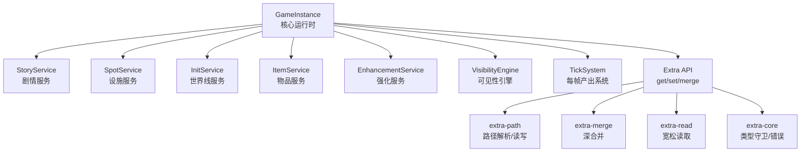
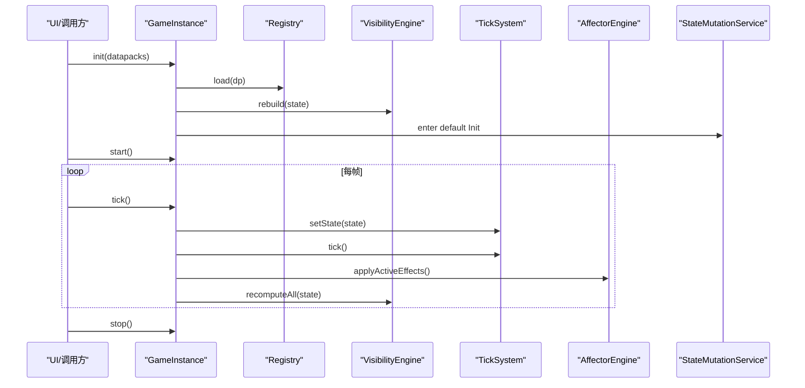
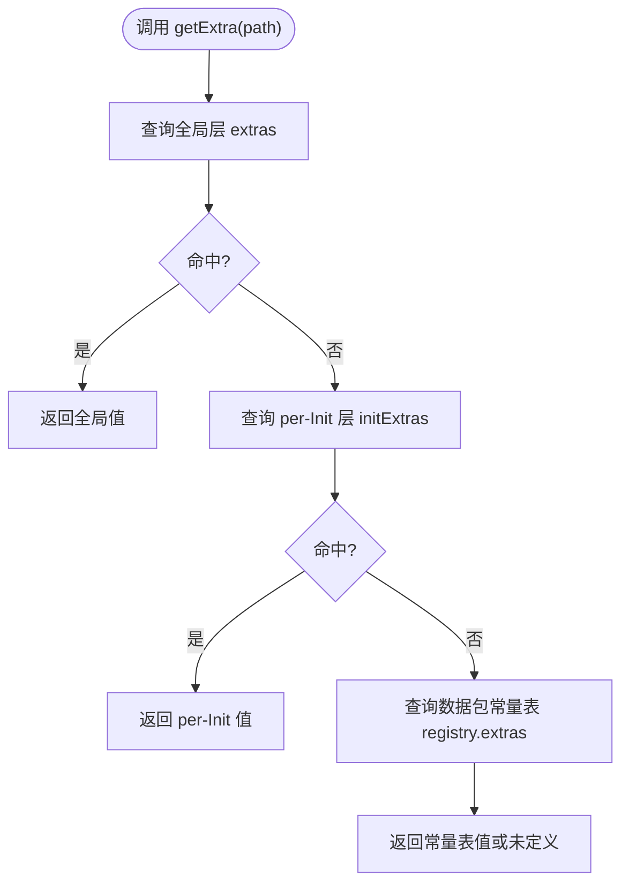
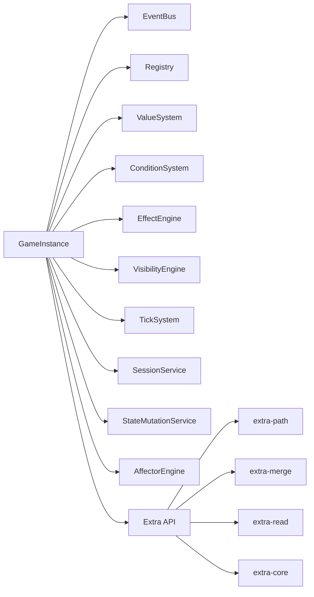

# 核心API

<cite>
**本文引用的文件**
- [game-instance.ts](file://src/engine/game-instance.ts)
- [extra/index.ts](file://src/engine/extra/index.ts)
- [extra-core.ts](file://src/engine/extra/extra-core.ts)
- [extra-path.ts](file://src/engine/extra/extra-path.ts)
- [extra-read.ts](file://src/engine/extra/extra-read.ts)
- [extra-merge.ts](file://src/engine/extra/extra-merge.ts)
- [types/extra.ts](file://src/engine/types/extra.ts)
- [game-instance.test.ts](file://tests/engine/game-instance.test.ts)
- [extra.test.ts](file://tests/engine/extra.test.ts)
</cite>

## 目录
1. [简介](#简介)
2. [项目结构](#项目结构)
3. [核心组件](#核心组件)
4. [架构总览](#架构总览)
5. [详细组件分析](#详细组件分析)
6. [依赖关系分析](#依赖关系分析)
7. [性能考虑](#性能考虑)
8. [故障排查指南](#故障排查指南)
9. [结论](#结论)
10. [附录](#附录)

## 简介
本章节面向ACProgram项目的核心运行时入口与扩展数据（Extra）API，目标是帮助调用方正确理解并安全使用GameInstance主类的公共接口，包括游戏生命周期管理、状态访问语义以及Extra运行时路径操作。文档同时提供错误处理模式、性能注意事项与最佳实践建议。

## 项目结构
- GameInstance位于引擎核心，负责装配子系统、暴露统一门面（story/spot/inits/items/enhancements等），并提供生命周期方法（init/tick/start/stop/reset）、存档与Extra API。
- Extra体系以NBT风格的树形结构表示额外数据，提供路径解析、读写、合并与类型校验工具，并通过GameInstance对外暴露便捷方法。

图表来源
- [game-instance.ts:74-164](file://src/engine/game-instance.ts#L74-L164)
- [extra/index.ts:10-17](file://src/engine/extra/index.ts#L10-L17)
- [extra-path.ts:11-88](file://src/engine/extra/extra-path.ts#L11-L88)
- [extra-merge.ts:11-31](file://src/engine/extra/extra-merge.ts#L11-L31)
- [extra-read.ts:9-43](file://src/engine/extra/extra-read.ts#L9-L43)
- [extra-core.ts:8-37](file://src/engine/extra/extra-core.ts#L8-L37)

章节来源
- [game-instance.ts:74-164](file://src/engine/game-instance.ts#L74-L164)
- [extra/index.ts:10-17](file://src/engine/extra/index.ts#L10-L17)

## 核心组件
- GameInstance：组合根与门面，集中暴露生命周期、状态访问、存档、Extra API与子系统门面。
- Extra运行时：提供路径化读写、深合并、宽松读取与严格类型守卫，保障数据结构一致性与安全性。

章节来源
- [game-instance.ts:74-164](file://src/engine/game-instance.ts#L74-L164)
- [extra/index.ts:10-17](file://src/engine/extra/index.ts#L10-L17)

## 架构总览
GameInstance在构造时通过wiring装配各子系统，并在生命周期中协调事件驱动的状态变更、可见性更新与每帧产出。Extra API作为通用键值树操作层，被GameInstance用于持久化与跨世界线共享的运行时数据。

图表来源
- [game-instance.ts:176-262](file://src/engine/game-instance.ts#L176-L262)

章节来源
- [game-instance.ts:176-262](file://src/engine/game-instance.ts#L176-L262)

## 详细组件分析

### GameInstance 公共接口概览
- 生命周期
  - init(datapacks): 加载数据包、注册实体、构建数值系统、重建可见性、进入默认Init。
  - reload(datapacks): 整体替换数据包，内部会停止、重置并重新初始化。
  - start(): 启动tick循环（每秒一帧）。
  - stop(): 停止tick循环。
  - reset(): 重置为默认状态（清空运行时状态，保留全局资源与解锁等策略由resetRuntime实现）。
  - tick(): 推进一帧，计算产出、应用效果、检查对话空间阻断条件、记录统计与日志。
- 状态访问（只读语义）
  - state: 返回当前玩家状态的只读引用（Readonly<PlayerState>），禁止外部直接修改。
  - visibility: 返回可见性快照（Readonly<VisibilitySnapshot>），基于当前state计算。
  - running: 是否处于运行中的tick循环。
  - getView(): 返回供UI使用的不可变视图快照（GameView），包含资源、区域、当前剧情、活跃效果与统计快照。
  - getStoryView(owner): 返回指定聊天沙盒的当前剧情视图。
- 子系统门面
  - story, spot, inits, items, enhancements, charaProfiles, pics 等只读别名，委托到对应服务。
- 存档
  - save(): 导出存档数据（含state、可见性、剧情游标、聊天游标、可持久化统计）。
  - load(saveData): 从存档恢复状态并重建子系统。
- Extra 运行时API
  - getExtra(path): 按优先级查询（全局 → per-Init → 数据包常量表）。
  - setExtra(path, value): 写入全局层额外数据。
  - setPerInitExtra(path, value): 写入当前Init的per-Init层额外数据。
  - mergeExtras(source): 将源字典深合并到全局层。

章节来源
- [game-instance.ts:126-172](file://src/engine/game-instance.ts#L126-L172)
- [game-instance.ts:176-245](file://src/engine/game-instance.ts#L176-L245)
- [game-instance.ts:247-300](file://src/engine/game-instance.ts#L247-L300)
- [game-instance.ts:302-332](file://src/engine/game-instance.ts#L302-L332)
- [game-instance.ts:336-390](file://src/engine/game-instance.ts#L336-L390)

### 生命周期方法详解与使用场景
- init(datapacks)
  - 作用：加载数据包、注册函数与实体、同步子系统、构建数值系统、重建可见性、进入默认Init。
  - 适用：首次启动或reload后重新初始化。
  - 注意：若数据包携带已废弃字段会被忽略并记录警告。
- reload(datapacks)
  - 作用：整体替换数据包，内部调用stop→reset→init流程。
  - 注意：替换后旧存档语义失效，调用方应自行清除存档。
- start()/stop()
  - 作用：启动/停止tick循环；running属性反映当前是否运行。
  - 适用：UI主循环驱动生产与演出。
- tick()
  - 作用：执行一帧逻辑，包括产出结算、效果应用、对话空间阻断复检、可见性增量更新、统计与日志记录。
  - 注意：直接修改state需走StateMutationService以保证精确失效。
- reset()
  - 作用：重置为默认状态，清理运行时副作用，重建数值系统。
  - 适用：新游戏或完全重置场景。

章节来源
- [game-instance.ts:176-245](file://src/engine/game-instance.ts#L176-L245)
- [game-instance.ts:247-300](file://src/engine/game-instance.ts#L247-L300)
- [game-instance.ts:370-390](file://src/engine/game-instance.ts#L370-L390)
- [game-instance.test.ts:82-91](file://tests/engine/game-instance.test.ts#L82-L91)
- [game-instance.test.ts:332-355](file://tests/engine/game-instance.test.ts#L332-L355)

### 状态访问接口（state、view、visibility）
- state
  - 语义：只读引用，避免外部直接修改导致一致性破坏。
  - 用途：读取资源、区域、剧情游标等运行时信息。
- visibility
  - 语义：基于当前state计算的可见性快照，反映存在性门槛后的可见集合。
  - 用途：判断区域/设施/世界线是否可见。
- view
  - 语义：不可变的GameView快照，隔离UI与内部state的直接耦合。
  - 用途：渲染UI、展示资源、当前剧情、活跃效果与统计。

章节来源
- [game-instance.ts:126-164](file://src/engine/game-instance.ts#L126-L164)
- [game-instance.test.ts:368-388](file://tests/engine/game-instance.test.ts#L368-L388)

### Extra 运行时API详解
- 路径与类型
  - ExtraPath：用“/”分隔的路径字符串，段不允许为空，dict key不得包含“/”，list索引使用数字段。
  - ExtraValue：NBT风格节点，支持int/float/str/bool/list/dict六种变体。
  - ExtraCompound：dict变体的便捷别名。
- 读取
  - getExtra(path)：优先查全局层，其次per-Init层，最后数据包常量表；缺失返回undefined。
  - 宽松读取工具：toNumber/toString/toBool/readNumber/readString/readBool，缺失时返回安全默认值。
- 写入
  - setExtra(path, value)：写入全局层；自动创建中间节点；路径非法或类型不匹配抛错。
  - setPerInitExtra(path, value)：写入当前Init的per-Init层；适合随快照保存/恢复的数据。
- 合并
  - mergeExtras(source)：深合并source到全局层；dict递归合并，list/标量整体替换；超出最大深度抛错。
- 路径解析与定位
  - parseExtraPath：校验路径合法性并拆分段数组。
  - getAtPath/setAtPath/deleteAtPath：对Extra树进行宽松读取、原地写入与删除。

图表来源
- [game-instance.ts:302-314](file://src/engine/game-instance.ts#L302-L314)
- [extra-path.ts:11-40](file://src/engine/extra/extra-path.ts#L11-L40)

章节来源
- [types/extra.ts:6-29](file://src/engine/types/extra.ts#L6-L29)
- [extra-path.ts:11-88](file://src/engine/extra/extra-path.ts#L11-L88)
- [extra-read.ts:9-43](file://src/engine/extra/extra-read.ts#L9-L43)
- [extra-merge.ts:11-31](file://src/engine/extra/extra-merge.ts#L11-L31)
- [extra-core.ts:8-37](file://src/engine/extra/extra-core.ts#L8-L37)
- [extra.test.ts:99-180](file://tests/engine/extra.test.ts#L99-L180)
- [extra.test.ts:203-236](file://tests/engine/extra.test.ts#L203-L236)

### 正确的API调用方式与错误处理模式
- 生命周期
  - 初始化后调用start开启tick，结束时调用stop释放资源。
  - 切换数据包时使用reload，并确保调用前清理旧存档。
  - 需要完全重置时使用reset。
- 状态访问
  - 仅读取state/visibility/view，不要直接修改state；如需变更请使用StateMutationService或对应服务方法。
- Extra
  - 路径必须合法：非空、不以“/”开头或结尾、不含空段、dict key不含“/”。
  - 写入时确保目标容器类型匹配；否则抛出ExtraError。
  - 合并时source必须为dict；超出最大深度会抛错。
  - 宽松读取工具在缺失时返回安全默认值，适合UI显示与条件判断。

章节来源
- [game-instance.test.ts:82-91](file://tests/engine/game-instance.test.ts#L82-L91)
- [game-instance.test.ts:332-355](file://tests/engine/game-instance.test.ts#L332-L355)
- [extra.test.ts:99-180](file://tests/engine/extra.test.ts#L99-L180)
- [extra.test.ts:203-236](file://tests/engine/extra.test.ts#L203-L236)

### 代码示例（路径引用）
- 初始化与运行
  - 参考：[tests/engine/game-instance.test.ts:27-45](file://tests/engine/game-instance.test.ts#L27-L45)
- 启动/停止tick
  - 参考：[tests/engine/game-instance.test.ts:82-91](file://tests/engine/game-instance.test.ts#L82-L91)
- 重置状态
  - 参考：[tests/engine/game-instance.test.ts:349-355](file://tests/engine/game-instance.test.ts#L349-L355)
- Extra路径读取与写入
  - 参考：[tests/engine/extra.test.ts:114-180](file://tests/engine/extra.test.ts#L114-L180)
- Extra深合并
  - 参考：[tests/engine/extra.test.ts:203-236](file://tests/engine/extra.test.ts#L203-L236)

## 依赖关系分析
- GameInstance依赖多个子系统：事件总线、注册表、数值系统、条件系统、效果引擎、可见性引擎、计时与产出系统、状态变更服务等。
- Extra模块内部解耦：core提供类型守卫与错误；path负责路径解析与寻址；read提供宽松读取；merge提供深合并；construct提供克隆与构造。
- 测试覆盖：game-instance.test验证生命周期、可见性、存档与重置；extra.test验证路径解析、读写、合并与边界条件。

图表来源
- [game-instance.ts:74-114](file://src/engine/game-instance.ts#L74-L114)
- [extra/index.ts:10-17](file://src/engine/extra/index.ts#L10-L17)

章节来源
- [game-instance.ts:74-114](file://src/engine/game-instance.ts#L74-L114)
- [extra/index.ts:10-17](file://src/engine/extra/index.ts#L10-L17)

## 性能考虑
- 每帧开销
  - tick内执行产出结算、效果应用与可见性增量更新；避免在tick中进行昂贵的全量重算。
  - 直接修改state会导致缓存失效，应通过StateMutationService保证精确标记与最小化重算。
- Extra操作
  - 路径解析与读写为O(n)（n为路径段数），深合并为O(k)（k为源字典大小）；避免在高频路径上过度嵌套。
  - 最大深度限制防止畸形数据导致栈溢出。
- 可见性
  - 可见性采用事件驱动增量更新；仅在必要时触发全量重算。
- 推荐实践
  - 批量更新：合并多次Extra写入后再提交，减少频繁路径操作。
  - 避免在UI渲染路径中直接读取state，使用getView获取快照。
  - 谨慎使用reload：替换数据包后需清理存档并重新初始化。

章节来源
- [game-instance.ts:247-262](file://src/engine/game-instance.ts#L247-L262)
- [extra-merge.ts:11-31](file://src/engine/extra/extra-merge.ts#L11-L31)
- [extra-core.ts:8-16](file://src/engine/extra/extra-core.ts#L8-L16)

## 故障排查指南
- 常见错误
  - Extra路径非法：空串、首尾“/”、空段、dict key含“/”会抛错。
  - 类型不匹配：在非容器节点下钻或list索引越界会抛错。
  - 合并失败：source不是dict或超过最大深度会抛错。
- 调试建议
  - 使用DevLog查看初始化、tick与错误记录。
  - 通过visibility判断区域/设施/世界线是否可见，定位门槛问题。
  - 使用getStoryView(owner)检查特定聊天沙盒的剧情状态。
- 典型问题定位
  - 移动失败：检查相邻性、演出锁定、存在性门槛与可见性。
  - 产出异常：确认是否通过StateMutationService变更state，避免绕过事件驱动失效。
  - Extra数据不一致：检查路径合法性与写入顺序，必要时使用mergeExtras进行批量更新。

章节来源
- [extra-path.ts:11-88](file://src/engine/extra/extra-path.ts#L11-L88)
- [extra-merge.ts:11-31](file://src/engine/extra/extra-merge.ts#L11-L31)
- [extra-core.ts:8-37](file://src/engine/extra/extra-core.ts#L8-L37)
- [game-instance.ts:247-300](file://src/engine/game-instance.ts#L247-L300)

## 结论
GameInstance提供了统一的运行时门面，封装了生命周期管理、状态访问与子系统编排；Extra体系以严格的类型与路径约束保障数据安全与一致性。遵循只读状态访问、事件驱动变更与批量更新的最佳实践，可获得稳定且高性能的游戏体验。

## 附录
- 关键类型
  - ExtraValue/ExtraCompound/ExtraPath：见类型定义文件。
- 相关服务
  - StoryService/SpotService/InitService/ItemService/EnhancementService：通过GameInstance的门面访问。
- 测试用例
  - game-instance.test.ts与extra.test.ts提供了大量使用示例与边界条件验证。

章节来源
- [types/extra.ts:6-29](file://src/engine/types/extra.ts#L6-L29)
- [game-instance.test.ts:27-45](file://tests/engine/game-instance.test.ts#L27-L45)
- [extra.test.ts:99-180](file://tests/engine/extra.test.ts#L99-L180)