# 类型定义

<cite>
**本文引用的文件**
- [src/engine/types/index.ts](file://src/engine/types/index.ts)
- [src/engine/types/datapack.ts](file://src/engine/types/datapack.ts)
- [src/engine/types/entities.ts](file://src/engine/types/entities.ts)
- [src/engine/types/state.ts](file://src/engine/types/state.ts)
- [src/engine/types/common.ts](file://src/engine/types/common.ts)
- [src/engine/types/ids.ts](file://src/engine/types/ids.ts)
- [src/engine/types/character.ts](file://src/engine/types/character.ts)
- [src/engine/types/world.ts](file://src/engine/types/world.ts)
- [src/engine/types/content.ts](file://src/engine/types/content.ts)
- [src/engine/types/trigger.ts](file://src/engine/types/trigger.ts)
- [src/engine/types/expression.ts](file://src/engine/types/expression.ts)
- [src/engine/types/extra.ts](file://src/engine/types/extra.ts)
- [src/engine/types/pics.ts](file://src/engine/types/pics.ts)
- [src/engine/types/results.ts](file://src/engine/types/results.ts)
- [src/engine/types/events.ts](file://src/engine/types/events.ts)
</cite>

## 目录
1. [简介](#简介)
2. [项目结构](#项目结构)
3. [核心组件](#核心组件)
4. [架构总览](#架构总览)
5. [详细组件分析](#详细组件分析)
6. [依赖关系分析](#依赖关系分析)
7. [性能与类型安全建议](#性能与类型安全建议)
8. [故障排查指南](#故障排查指南)
9. [结论](#结论)
10. [附录：版本兼容与迁移指南](#附录版本兼容与迁移指南)

## 简介
本文件为 ACProgram 项目的 TypeScript 类型定义文档，聚焦引擎侧的类型体系与数据契约。内容覆盖：
- 核心数据结构：PlayerState、Datapack、Entity（世界/内容/角色等）
- 枚举与联合类型的取值范围与使用场景
- 类型之间的关系与继承层次
- 类型使用示例与最佳实践
- 版本兼容性与迁移指引

目标读者包括引擎开发者、数据包策划与 UI 集成人员，帮助在强类型约束下正确消费引擎能力。

## 项目结构
引擎类型集中在 src/engine/types 目录，采用“按领域拆分 + index 汇总导出”的组织方式：
- ids：ID 类型与全局资源标识
- common：跨领域共享定义（资源显示、标签、角色元数据）
- extra：Extra 树形额外数据（类 NBT）
- expression：数值表达式、条件、效果、Funclet
- world：世界地图实体（Init/Area/Spot/Entry）
- content：内容实体（强化/剧情/物品/掉落表）
- character：角色重构（变体/培养/色彩/抽卡/聊天流）
- trigger：触发器与 Affector 事件联动
- datapack：数据包汇总类型
- pics：图片资产与索引格式
- results：操作返回结果与剧情视图
- events：运行时事件与事件目录
- entities：历史兼容 re-export，聚合常见领域类型
- index：统一出口，供全项目 import { ... } from './' 保持兼容

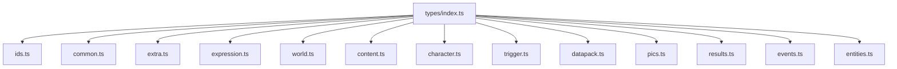

图表来源
- [src/engine/types/index.ts:1-30](file://src/engine/types/index.ts#L1-L30)

章节来源
- [src/engine/types/index.ts:1-30](file://src/engine/types/index.ts#L1-L30)

## 核心组件
本节概述关键类型及其职责：
- PlayerState：运行时玩家状态主对象，承载资源、区域、剧情日志、角色系统、主题、聊天、被动冷却等
- Datapack：数据包汇总，声明所有 Def 集合（世界/内容/角色/触发器等）
- Entity 相关：World（Init/Area/Spot）、Content（Enhancement/Story/Item/DropTable）、Character（Variant/Curve/Color/Gacha/Chat）
- Expression：ValueExpression、ConditionGroup、Effect、FuncletDef
- Trigger/Affector：TriggerDef、AffectorPackDef、AffectorInstance
- Extra：ExtraValue/ExtraCompound/ExtraPath
- Pics：PicId/PicDef 及三段式索引解析
- Results：各操作的返回结果与 StoryView/SendState
- Events：GameEvent 联合与 EVENT_CATALOG

章节来源
- [src/engine/types/state.ts:25-140](file://src/engine/types/state.ts#L25-L140)
- [src/engine/types/datapack.ts:44-134](file://src/engine/types/datapack.ts#L44-L134)
- [src/engine/types/world.ts:23-245](file://src/engine/types/world.ts#L23-L245)
- [src/engine/types/content.ts:25-457](file://src/engine/types/content.ts#L25-L457)
- [src/engine/types/character.ts:17-535](file://src/engine/types/character.ts#L17-L535)
- [src/engine/types/expression.ts:9-263](file://src/engine/types/expression.ts#L9-L263)
- [src/engine/types/trigger.ts:9-103](file://src/engine/types/trigger.ts#L9-L103)
- [src/engine/types/extra.ts:1-29](file://src/engine/types/extra.ts#L1-L29)
- [src/engine/types/pics.ts:1-99](file://src/engine/types/pics.ts#L1-L99)
- [src/engine/types/results.ts:1-182](file://src/engine/types/results.ts#L1-L182)
- [src/engine/types/events.ts:1-167](file://src/engine/types/events.ts#L1-L167)

## 架构总览
下图展示类型之间的主要依赖关系：Datapack 作为入口聚合各类 Def；PlayerState 承载运行时状态；Expression/Trigger/Events 贯穿运行期；Pics/Extra 提供通用数据载体。

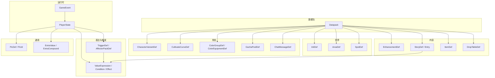

图表来源
- [src/engine/types/datapack.ts:44-134](file://src/engine/types/datapack.ts#L44-L134)
- [src/engine/types/world.ts:23-245](file://src/engine/types/world.ts#L23-L245)
- [src/engine/types/content.ts:25-457](file://src/engine/types/content.ts#L25-L457)
- [src/engine/types/character.ts:17-535](file://src/engine/types/character.ts#L17-L535)
- [src/engine/types/expression.ts:9-263](file://src/engine/types/expression.ts#L9-L263)
- [src/engine/types/trigger.ts:9-103](file://src/engine/types/trigger.ts#L9-L103)
- [src/engine/types/state.ts:25-140](file://src/engine/types/state.ts#L25-L140)
- [src/engine/types/events.ts:1-167](file://src/engine/types/events.ts#L1-L167)
- [src/engine/types/pics.ts:1-99](file://src/engine/types/pics.ts#L1-L99)
- [src/engine/types/extra.ts:1-29](file://src/engine/types/extra.ts#L1-L29)

## 详细组件分析

### PlayerState 运行时状态
- 资源与快照：resources/globalResources、initExtras/extras/initSnapshots
- 世界线推进：activeInit/currentAreaId/visitedAreas/visitedInits
- 设施与强化：spotLevels/spotManagers/unlockedEnhancements/enhancementAttachments
- 剧情与道具：storyLog/storyReadLogs/inventory/flags/triggersCompleted
- 角色系统：roster/fragments/gachaState/groupsOwned/equipmentsOwned/chatRead/protoStats
- 主题与配色：activeGroupId/themeLayerOrder/entityThemeSlots/entityThemeDesignsOwned
- 闲聊与阻断：passiveCooldowns/studentBlocks
- 统计与可见性：tagEffects/entityEffects/stats/visibility

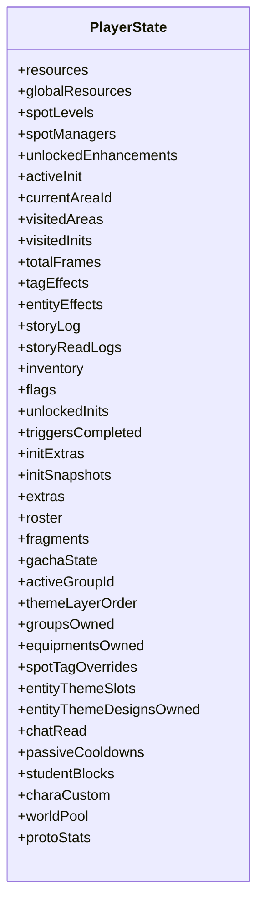

图表来源
- [src/engine/types/state.ts:25-140](file://src/engine/types/state.ts#L25-L140)

章节来源
- [src/engine/types/state.ts:25-140](file://src/engine/types/state.ts#L25-L140)

### Datapack 数据包汇总
- 名称与版本：name/version
- 世界与内容：inits/areas/spots/enhancements/stories/items/dropTables
- 剧情入口：activeStories/passiveStories/passivePools
- 角色系统：characters/characterVariants/cultivateCurves/colorGroups/colorEquipments/themeDesigns/gachaPools/chatMessages
- 资源与标签：resourceDisplays/tags
- 图片与资料：pics/charaProfiles
- 归属配置：characterPersistConfig
- 扩展数据：extras

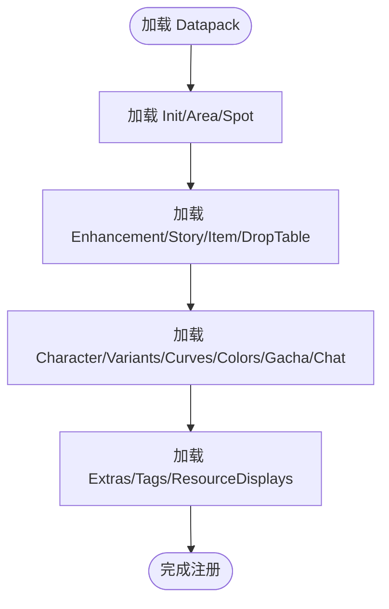

图表来源
- [src/engine/types/datapack.ts:44-134](file://src/engine/types/datapack.ts#L44-L134)

章节来源
- [src/engine/types/datapack.ts:44-134](file://src/engine/types/datapack.ts#L44-L134)

### 世界实体（Init/Area/Spot/Entry）
- EntryEffectDef：首次/条件进入时执行的效果序列
- InitDef：世界线配置、默认区域、起始剧情、购买成本、世界倾斜值、揭示触发器
- AreaDef：所属世界线、默认设施、相邻区域、揭示触发器、场景主题
- SpotDef：基础产出/花费/容量、升级曲线、功能注入、专属卡池、主题与色组
- LevelUpgradeDef：等级级联效果

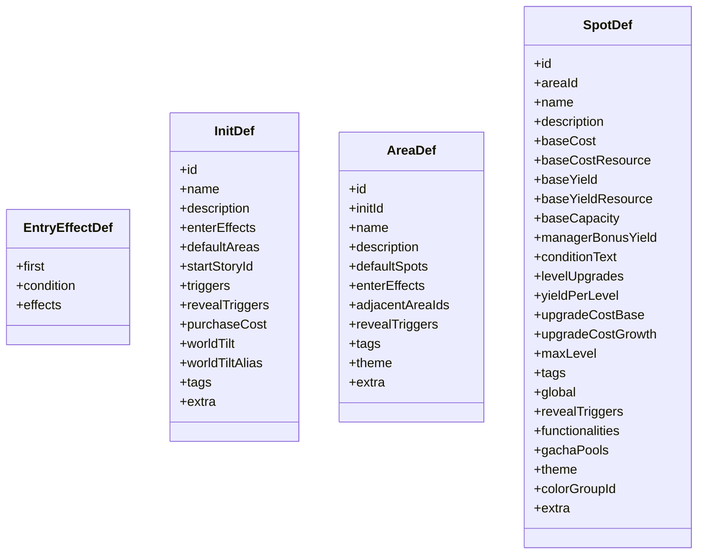

图表来源
- [src/engine/types/world.ts:23-245](file://src/engine/types/world.ts#L23-L245)

章节来源
- [src/engine/types/world.ts:23-245](file://src/engine/types/world.ts#L23-L245)

### 内容实体（Enhancement/Story/Item/DropTable）
- EnhancementDef：效果、自动应用、层数、价格、标签、挂靠元数据、不可撤回、附加功能、Affector 包引用、揭示触发器
- StoryEntryBase/ActiveStoryEntry/PassiveStoryEntry：触发条件、奖励策略、分支守卫、重阅读、冷却、阻断
- StoryDef/Talklet/StoryChoice：演出片段、选项、跳转、羁绊卡片
- ItemDef：稀有度、类型、使用条件、效果、拾取效果、出售价、持有即生效的 Affector 引用
- DropTableDef/DropTableEntry：掷骰规则、保底、条件

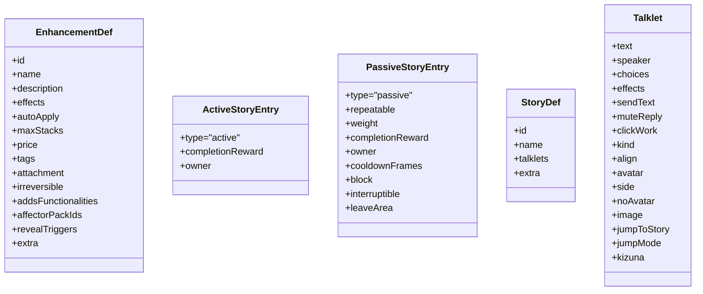

图表来源
- [src/engine/types/content.ts:25-457](file://src/engine/types/content.ts#L25-L457)

章节来源
- [src/engine/types/content.ts:25-457](file://src/engine/types/content.ts#L25-L457)

### 角色系统（Variant/Curve/Color/Gacha/Chat）
- Variant：差分 ID、原型、头像、默认色组、默认差分、培养曲线、对话主题
- CultivateCurveDef：等级上限、经验表、星级上限、突破消耗、每星上限、每级加成
- ColorGroupDef/ColorEquipmentDef：构成方式、色位、主题预设、解锁条件；装备绑定色组与效用
- GachaPoolDef：模式、货币、单价、概率表、UP、保底、重复返还、成员、关闭条件
- ChatMessageDef：所属差分、排序、内容、解锁条件
- PersistConfig：通讯录/卡池/装备/已读归属（global/init）

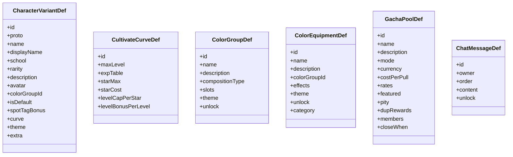

图表来源
- [src/engine/types/character.ts:17-535](file://src/engine/types/character.ts#L17-L535)

章节来源
- [src/engine/types/character.ts:17-535](file://src/engine/types/character.ts#L17-L535)

### 表达式、条件与效果
- ValueSource/Value：常量、资源、设施等级、管理器数量、函数、Extra 读取
- ValueExpression：二元运算、取整、区间夹取
- Condition/ConditionGroup：资源/设施/管理器/Flag/增强/Tag/统计/故事/Extra/原型统计/Area
- Effect：资源/设施/管理器/增强/物品/掉落/解锁/Flag/剧情/移动/区等级限制/Extra/角色获得/主题/聊天流
- FuncletDef/FuncletCall：可复用计算单元

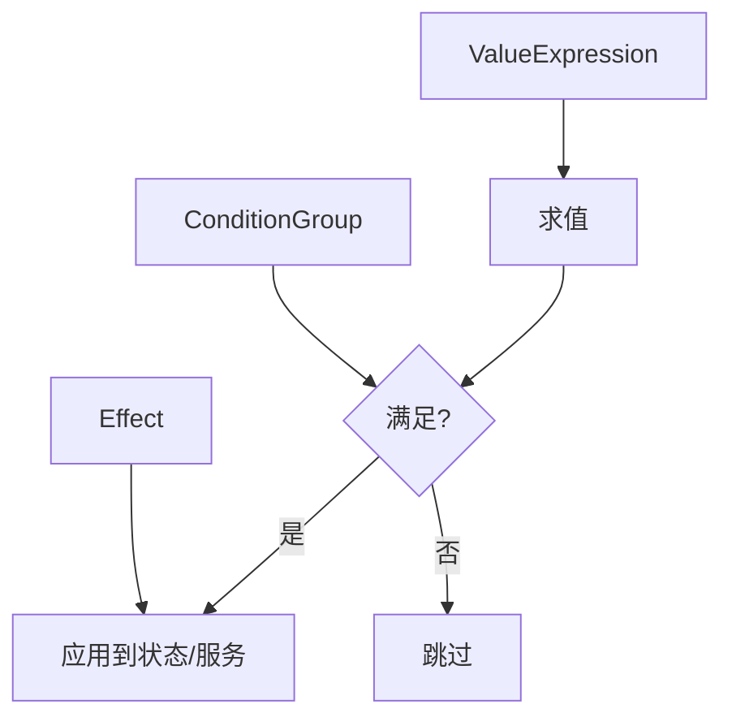

图表来源
- [src/engine/types/expression.ts:9-263](file://src/engine/types/expression.ts#L9-L263)

章节来源
- [src/engine/types/expression.ts:9-263](file://src/engine/types/expression.ts#L9-L263)

### 触发器与 Affector
- TriggerDef：侦测来源（tick/resource/spot/item/story/init/area/character/cultivated）、附加条件、效果、一次性
- AffectorPackDef/Effect：即时效果、每 tick 效果、持续流、区修饰符
- AffectorInstance：实例化后的挂载状态与激活条目集

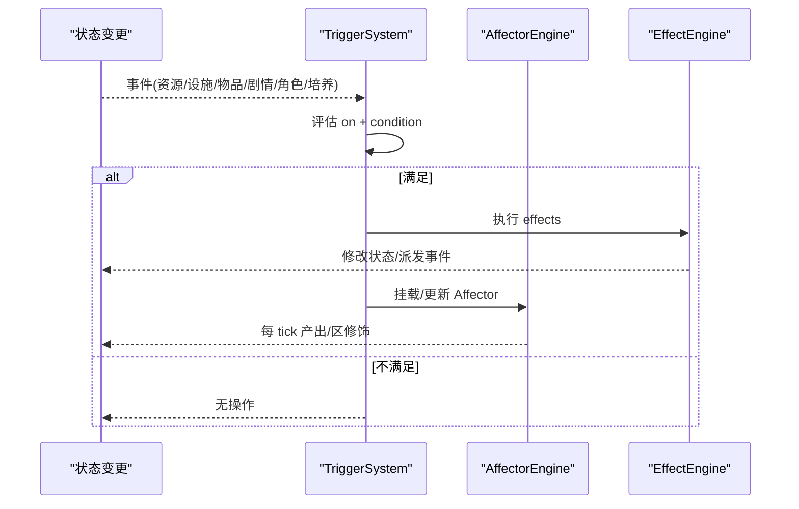

图表来源
- [src/engine/types/trigger.ts:9-103](file://src/engine/types/trigger.ts#L9-L103)
- [src/engine/types/expression.ts:87-152](file://src/engine/types/expression.ts#L87-L152)

章节来源
- [src/engine/types/trigger.ts:9-103](file://src/engine/types/trigger.ts#L9-L103)

### 图片与 Extra
- PicId/PicDef：三段式索引 mod:type(pic):id，支持直链 URL 与 zip 包内路径
- ExtraValue/ExtraCompound/ExtraPath：NBT 风格树形数据，用于跨模块/跨语言的数据交换与扩展

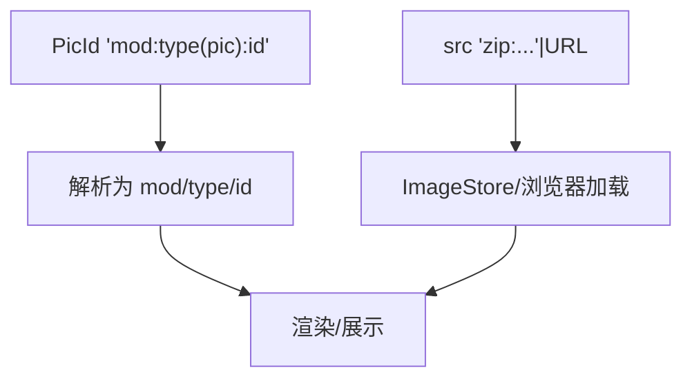

图表来源
- [src/engine/types/pics.ts:1-99](file://src/engine/types/pics.ts#L1-L99)

章节来源
- [src/engine/types/pics.ts:1-99](file://src/engine/types/pics.ts#L1-L99)
- [src/engine/types/extra.ts:1-29](file://src/engine/types/extra.ts#L1-L29)

### 结果与事件
- Results：生产/帧结果、使用物品/旅行/强化购买/设施解锁升级的结果联合
- GameEvent：运行时事件全集，含角色/主题/聊天流/抽卡/被动冷却等
- EVENT_CATALOG：事件发射方/订阅方登记，保证契约穷尽

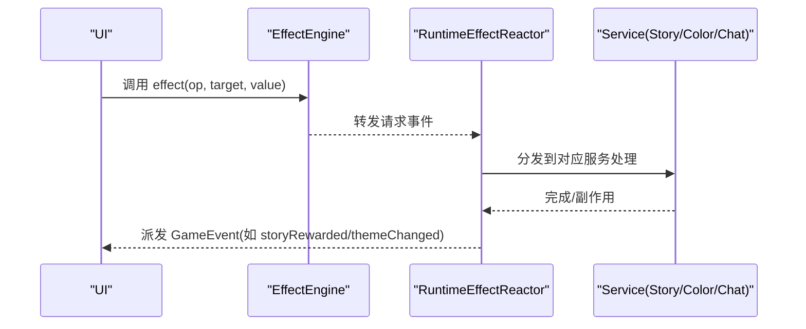

图表来源
- [src/engine/types/results.ts:1-182](file://src/engine/types/results.ts#L1-L182)
- [src/engine/types/events.ts:1-167](file://src/engine/types/events.ts#L1-L167)
- [src/engine/types/expression.ts:87-152](file://src/engine/types/expression.ts#L87-L152)

章节来源
- [src/engine/types/results.ts:1-182](file://src/engine/types/results.ts#L1-L182)
- [src/engine/types/events.ts:1-167](file://src/engine/types/events.ts#L1-L167)

## 依赖关系分析
- 低耦合高内聚：每个领域类型文件仅引入必要依赖，通过 index 汇总导出，降低循环依赖风险
- 关键依赖链：
  - datapack → world/content/character/trigger/expression/extra/pics
  - state → ids/character/results/extra/tag-effect
  - expression → extra/ids/content
  - trigger → expression/tag-effect
  - events → state/entities/expression/extra/content
- 兼容层：entities.ts 对旧导入路径进行 re-export，确保向后兼容

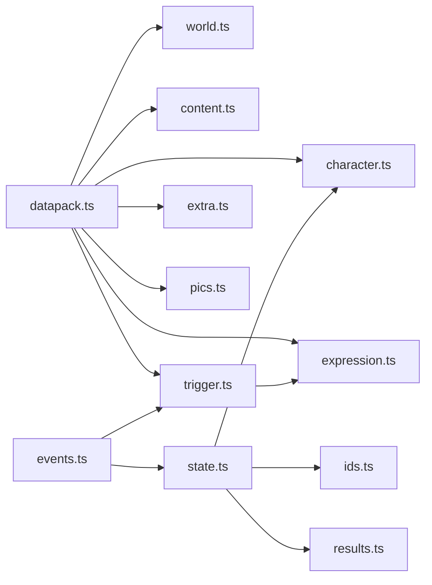

图表来源
- [src/engine/types/datapack.ts:44-134](file://src/engine/types/datapack.ts#L44-L134)
- [src/engine/types/state.ts:25-140](file://src/engine/types/state.ts#L25-L140)
- [src/engine/types/trigger.ts:9-103](file://src/engine/types/trigger.ts#L9-L103)
- [src/engine/types/events.ts:1-167](file://src/engine/types/events.ts#L1-L167)

章节来源
- [src/engine/types/entities.ts:1-14](file://src/engine/types/entities.ts#L1-L14)

## 性能与类型安全建议
- 使用只读视图：优先消费 GameView/StatsSnapshot 等派生视图，避免直接读写 PlayerState 内部字段
- 条件与表达式：尽量将复杂逻辑下沉到 ValueExpression/ConditionGroup，减少运行时分支判断
- 事件驱动：通过 GameEvent 订阅变更，避免轮询状态；利用 EVENT_CATALOG 明确订阅边界
- 图片与资源：统一使用 PicId 三段式索引，避免裸 URL；批量加载 zip 资源以减少网络开销
- Extra 访问：通过 ExtraPath 访问三层合并视图，注意缺失键回退语义（数值→0）
- 枚举与联合：严格匹配枚举取值，避免硬编码字符串导致运行时错误

[本节为通用指导，无需具体文件来源]

## 故障排查指南
- 资源与状态不一致：检查 resourceChanged 事件与条件依赖失效是否及时触发
- 剧情推进异常：核对 StoryError 联合中的错误码，确认 branchGuards 与 replayable 设置
- 设施升级失败：根据 SpotUpgradeResult 的错误码定位原因（资源不足/已达上限/条件不满足）
- 角色系统问题：关注 characterAcquired/cultivated/groupUnlocked/equipmentEquipped 等事件顺序
- 主题切换异常：检查 themeChanged 与 entityThemeChanged 事件，确认主题槽与覆盖优先级
- 聊天流异常：监听 chatFlowCleared/chatTextShown/chatTextClearedAll 等事件，确保 UI 清理与重绘

章节来源
- [src/engine/types/results.ts:20-55](file://src/engine/types/results.ts#L20-L55)
- [src/engine/types/events.ts:49-97](file://src/engine/types/events.ts#L49-L97)

## 结论
ACProgram 的类型体系以强类型契约为核心，围绕 PlayerState 与 Datapack 构建起从数据包到运行时的完整链路。通过表达式/条件/效果/触发器的解耦设计，以及事件驱动的响应式架构，实现了高内聚、可扩展且易于维护的系统。遵循本文的类型使用规范与最佳实践，可在保证类型安全的前提下高效开发游戏逻辑与 UI。

[本节为总结，无需具体文件来源]

## 附录：版本兼容与迁移指南
- 历史兼容层：entities.ts 对旧导入路径进行 re-export，确保从单文件拆分后仍可使用原有 import 路径
- 废弃字段：Datapack.characterBonuses 已标记为 @deprecated，加载期忽略并 devLog 警告，后续版本移除
- 可选字段兼容：PlayerState 中多处可选字段（如 globalResources/storyReadLogs/initExtras 等）用于兼容旧存档，新代码应优先使用非可选字段
- 迁移建议：
  - 逐步替换硬编码字符串为枚举/联合类型
  - 将业务逻辑迁移至 ValueExpression/ConditionGroup/Effect，提升可配置性
  - 使用 PicId 三段式索引替代裸 URL
  - 通过 EVENT_CATALOG 审计事件订阅，避免遗漏或漂移

章节来源
- [src/engine/types/entities.ts:1-14](file://src/engine/types/entities.ts#L1-L14)
- [src/engine/types/datapack.ts:67-72](file://src/engine/types/datapack.ts#L67-L72)
- [src/engine/types/state.ts:35-140](file://src/engine/types/state.ts#L35-L140)
- [src/engine/types/pics.ts:18-45](file://src/engine/types/pics.ts#L18-L45)
- [src/engine/types/events.ts:103-167](file://src/engine/types/events.ts#L103-L167)