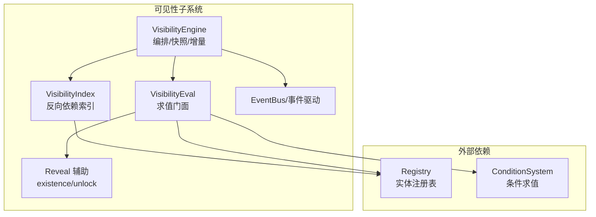
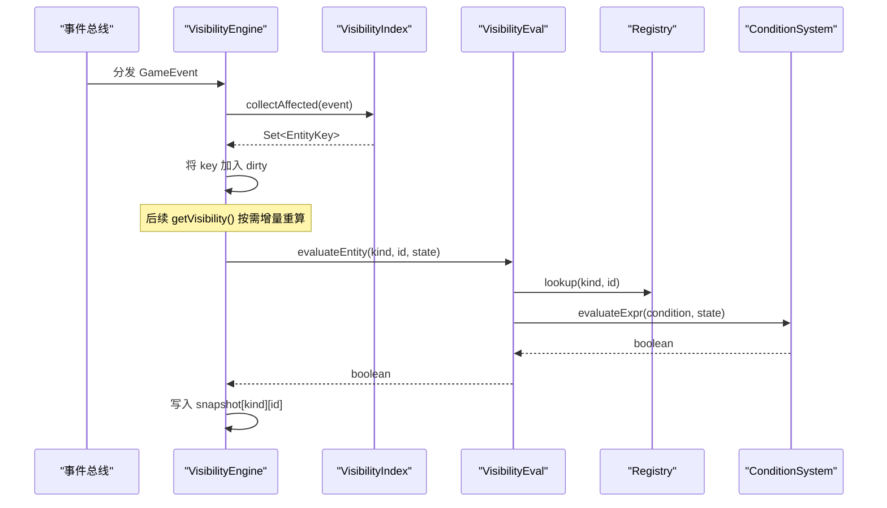
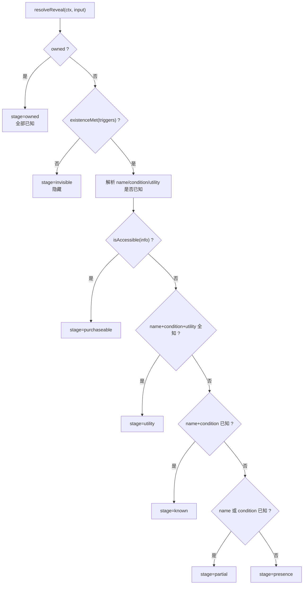
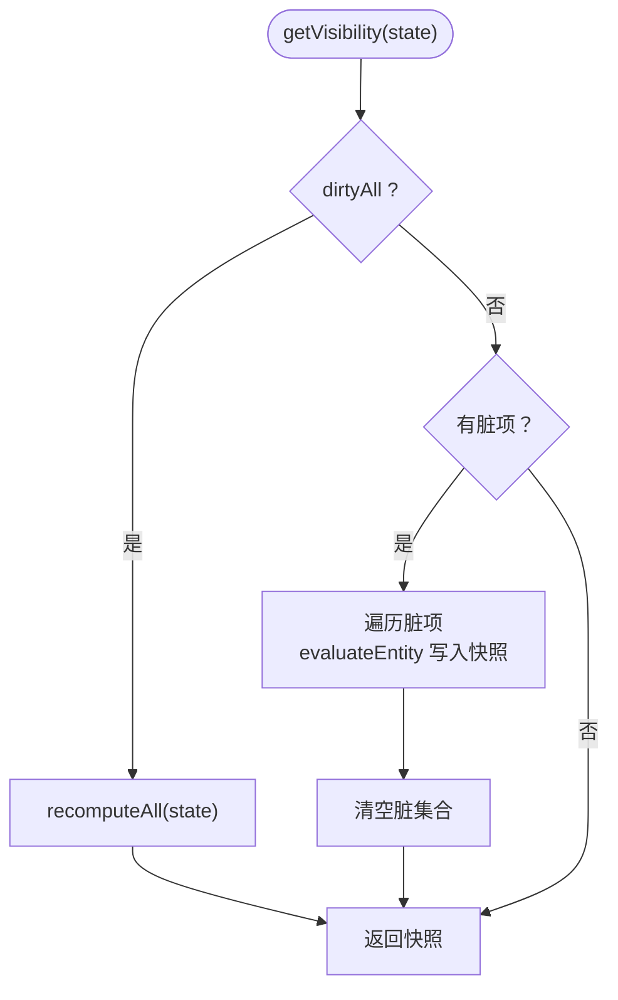
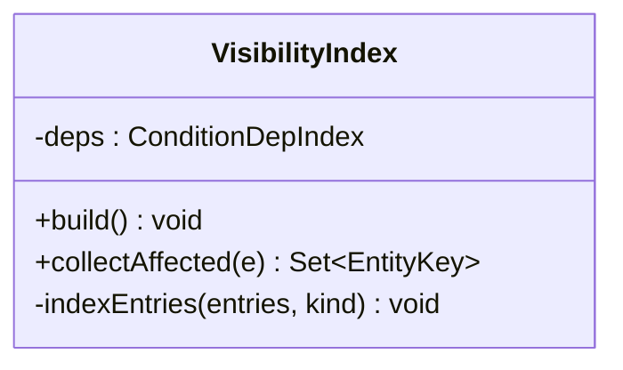
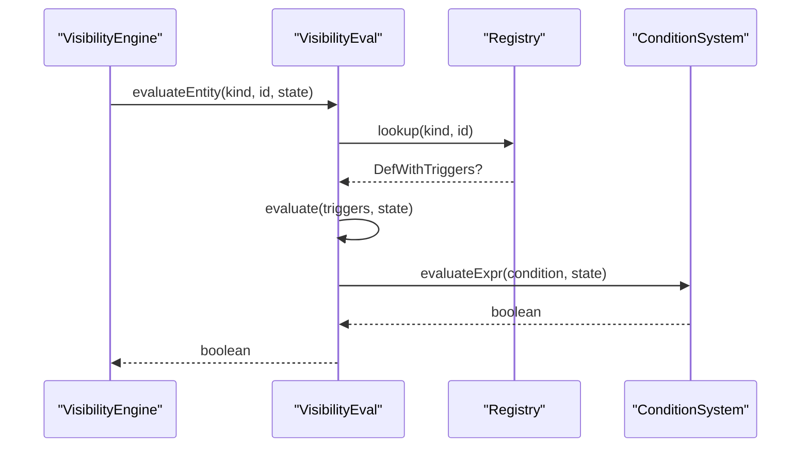
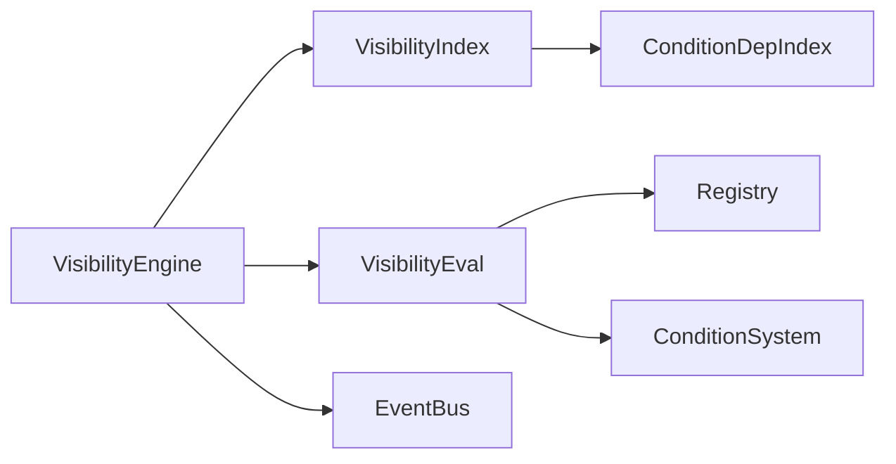

# 可见性系统

<cite>
**本文引用的文件**
- [visibility-engine.ts](file://src/engine/visibility/visibility-engine.ts)
- [visibility-eval.ts](file://src/engine/visibility/visibility-eval.ts)
- [visibility-index.ts](file://src/engine/visibility/visibility-index.ts)
- [reveal.ts](file://src/engine/visibility/reveal.ts)
- [reveal.ts（类型）](file://src/engine/types/reveal.ts)
- [tooltip-reveal.ts](file://src/ui/components/tooltip-reveal.ts)
- [enhancement-service.ts](file://src/engine/game/enhancement-service.ts)
- [reveal.test.ts](file://tests/engine/reveal.test.ts)
- [enhancement-reveal.test.ts](file://tests/engine/enhancement-reveal.test.ts)
- [05-stories.json](file://datapack/AronaClickerCore/05-stories.json)
</cite>

## 更新摘要
**所做更改**
- 新增揭示/访问阶段系统章节，详细说明 RevealStage 和 AccessStage 的完整层级结构
- 更新可见性评估算法，强调 existence/unlock 目标的统一处理机制
- 增强 UI 揭示层说明，包含信息可知系统的详细实现
- 补充测试用例和配置示例，展示揭示阶梯的实际应用

## 目录
1. [简介](#简介)
2. [项目结构](#项目结构)
3. [核心组件](#核心组件)
4. [架构总览](#架构总览)
5. [揭示与访问阶段系统](#揭示与访问阶段系统)
6. [详细组件分析](#详细组件分析)
7. [依赖关系分析](#依赖关系分析)
8. [性能考量](#性能考量)
9. [故障排查指南](#故障排查指南)
10. [结论](#结论)
11. [附录：配置示例与最佳实践](#附录：配置示例与最佳实践)

## 简介
本技术文档围绕 ACProgram 的可见性系统展开，重点解释以下内容：
- VisibilityEngine 内容解锁引擎：事件驱动、反向索引、增量脏标记与快照一致性。
- Reveal 揭示机制：信息阶梯（存在性、名称、条件、效用、解锁）与 UI 状态同步。
- VisibilityEval 可见性评估：条件表达式求值、类别重算与故事入口特殊处理。
- 揭示与访问阶段系统：完整的七级揭示阶梯和五级访问阶段的实现原理。
- 与游戏其他模块的集成：UI 渲染、数据访问、资源加载与可达性判定。
- 可见性条件的配置示例与最佳实践，以及调试工具、性能分析与常见问题解决方案。

## 项目结构
可见性系统位于 engine/visibility 下，由三个职责清晰的子模块组成：
- visibility-index.ts：构建"事件→受影响实体"的反向依赖索引，用于快速定位需要标脏的实体键。
- visibility-eval.ts：纯函数式求值门面，封装对 Registry 与 ConditionSystem 的调用，提供单实体与整类重算能力。
- visibility-engine.ts：编排层，持有快照、脏集合与全量/增量重算策略，订阅事件并维护最终一致性的可见性快照。
- reveal.ts：共享辅助，统一表达 existence/unlock 等揭示门槛，供引擎与 UI 共同消费。
- tooltip-reveal.ts：UI 侧的信息可知系统，计算揭示阶段并与引擎结果协同展示。

**图表来源**
- [visibility-engine.ts:19-34](file://src/engine/visibility/visibility-engine.ts#L19-L34)
- [visibility-index.ts:12-27](file://src/engine/visibility/visibility-index.ts#L12-L27)
- [visibility-eval.ts:33-57](file://src/engine/visibility/visibility-eval.ts#L33-L57)
- [reveal.ts:17-68](file://src/engine/visibility/reveal.ts#L17-L68)

**章节来源**
- [visibility-engine.ts:1-122](file://src/engine/visibility/visibility-engine.ts#L1-L122)
- [visibility-index.ts:1-45](file://src/engine/visibility/visibility-index.ts#L1-L45)
- [visibility-eval.ts:1-93](file://src/engine/visibility/visibility-eval.ts#L1-L93)
- [reveal.ts:1-69](file://src/engine/visibility/reveal.ts#L1-L69)

## 核心组件
- VisibilityEngine：事件驱动的编排器，负责重建索引、全量/增量重算、快照读写与对外查询 API。
- VisibilityIndex：基于 ConditionDepIndex 的反向依赖索引，将 GameEvent 映射到受影响的实体键集合。
- VisibilityEval：对 Registry + ConditionSystem 的可见性求值封装，支持单实体与整类重算。
- Reveal 辅助：提取 existence/unlock 目标与条件，提供统一的"是否满足"判定。
- UI 揭示层（tooltip-reveal.ts）：在 UI 中计算揭示阶段（invisible/partial/known/utility/purchaseable/owned），与引擎可见性协同工作。

**章节来源**
- [visibility-engine.ts:19-122](file://src/engine/visibility/visibility-engine.ts#L19-L122)
- [visibility-index.ts:12-45](file://src/engine/visibility/visibility-index.ts#L12-L45)
- [visibility-eval.ts:22-93](file://src/engine/visibility/visibility-eval.ts#L22-L93)
- [reveal.ts:17-68](file://src/engine/visibility/reveal.ts#L17-L68)
- [tooltip-reveal.ts:19-85](file://src/ui/components/tooltip-reveal.ts#L19-L85)

## 架构总览
可见性系统采用"事件驱动 + 反向索引 + 增量缓存"的架构：
- 事件到达时，通过反向索引收集受影响实体键，加入脏集合。
- 读取快照时，若存在脏项则按需增量重算；否则直接返回已缓存结果。
- 当注册表变更或世界线切换时，触发重建与全量重算，保证一致性。
- 故事入口始终可见，不参与反向索引与增量更新。

**图表来源**
- [visibility-engine.ts:119-121](file://src/engine/visibility/visibility-engine.ts#L119-L121)
- [visibility-index.ts:29-32](file://src/engine/visibility/visibility-index.ts#L29-L32)
- [visibility-eval.ts:45-48](file://src/engine/visibility/visibility-eval.ts#L45-L48)

**章节来源**
- [visibility-engine.ts:38-122](file://src/engine/visibility/visibility-engine.ts#L38-L122)
- [visibility-index.ts:18-32](file://src/engine/visibility/visibility-index.ts#L18-L32)
- [visibility-eval.ts:45-68](file://src/engine/visibility/visibility-eval.ts#L45-L68)

## 揭示与访问阶段系统

### 揭示阶梯（RevealStage）
揭示系统定义了七个层级，从完全不可见到完全拥有：

| 阶段 | 描述 | 含义 |
|------|------|------|
| invisible | L0 不可见 | 未满足存在条件，实体不出现在界面 |
| presence | L1 知晓存在 | 知道这里有一个未解锁内容，但信息被遮挡 |
| partial | L2 部分已知 | 知晓名称或解锁条件之一 |
| known | L3 完全已知 | 知晓名称与解锁条件 |
| utility | L4 效用已知 | 并知晓效用（描述、产出等） |
| purchaseable | L5 可购买 | 解锁条件满足，可购买/进入/触发 |
| owned | L6 已拥有 | 已购买/已完成 |

### 访问阶段（AccessStage）
访问系统定义了五个层级，从隐藏到生效：

| 阶段 | 描述 | 含义 |
|------|------|------|
| hidden | 隐藏 | 实体不出现在界面（existence 门槛不满足） |
| obfuscated | 遮挡 | 可见但数值以 ??? 遮挡（未满足揭示条件） |
| revealed | 揭示 | 可见且数值完整展示（已拥有/已激活） |
| accessible | 可达 | 可进入/解锁/使用（Init 解锁、Area 相邻、Spot 购买等） |
| active | 生效 | 运行时持续生效（Affector Latent/Active、Trigger 命中执行等） |

### 阶段转换流程

**图表来源**
- [tooltip-reveal.ts:71-85](file://src/ui/components/tooltip-reveal.ts#L71-L85)
- [reveal.ts:37-44](file://src/engine/visibility/reveal.ts#L37-L44)

**章节来源**
- [types/reveal.ts:7-59](file://src/engine/types/reveal.ts#L7-L59)
- [tooltip-reveal.ts:19-85](file://src/ui/components/tooltip-reveal.ts#L19-L85)
- [reveal.ts:17-68](file://src/engine/visibility/reveal.ts#L17-L68)

## 详细组件分析

### VisibilityEngine 内容解锁引擎
- 设计要点
  - 以 EventBus 为唯一驱动源，构造期订阅条件依赖事件超集，确保存档恢复等非 rebuild 路径也能持续标脏。
  - 维护 VisibilitySnapshot 与 dirty/dirtyAll 标志，实现惰性增量更新与最终一致性。
  - 对外暴露 rebuild/getVisibility/recomputeAll/reset/clearLocal/setSnapshot 等方法，覆盖加载、迁移、调试等场景。
  - isInitVisible/isAreaVisible/isSpotVisible/isEnhancementVisible 走实时求值，不走缓存，避免注册表直接变更导致陈旧。
- 关键流程
  - 事件到达 → 反向索引收集受影响实体键 → 加入脏集合 → 下次读取快照时按需增量重算。
  - 注册表热替换/加载 → rebuild → 重建索引 + 全量重算。
  - 世界线切换 → clearLocal → 清空本地 spots/areas 并标记全量脏。

**图表来源**
- [visibility-engine.ts:44-60](file://src/engine/visibility/visibility-engine.ts#L44-L60)
- [visibility-engine.ts:62-75](file://src/engine/visibility/visibility-engine.ts#L62-L75)

**章节来源**
- [visibility-engine.ts:19-122](file://src/engine/visibility/visibility-engine.ts#L19-L122)

### VisibilityIndex 反向依赖索引
- 设计要点
  - 仅对 existence 目标的 revealTriggers 建立反向依赖索引，stories 不参与索引（始终可见）。
  - 使用 ConditionDepIndex 登记条件依赖，事件到达时通过 affected(e) 获取受影响实体键集合。
- 复杂度与优化
  - 构建阶段 O(N)，N 为所有实体的 existence 条件数量。
  - 事件处理阶段 O(k)，k 为受影响的实体键数量，通常远小于 N。

**图表来源**
- [visibility-index.ts:12-45](file://src/engine/visibility/visibility-index.ts#L12-L45)

**章节来源**
- [visibility-index.ts:1-45](file://src/engine/visibility/visibility-index.ts#L1-L45)

### VisibilityEval 可见性评估
- 设计要点
  - 封装 Registry 与 ConditionSystem 的访问，提供 evaluate/evaluateEntity/recomputeCategory/allStoryEntryKeys 等能力。
  - recomputeCategory 按类别枚举实体并逐一求值，allTrue 用于 stories 的特殊处理（恒真）。
- 数据流
  - evaluateEntity → lookup(kind,id) → evaluate(triggers,state) → existenceMet → conditionSystem.evaluateExpr。

**图表来源**
- [visibility-eval.ts:45-68](file://src/engine/visibility/visibility-eval.ts#L45-L68)
- [reveal.ts:37-44](file://src/engine/visibility/reveal.ts#L37-L44)

**章节来源**
- [visibility-eval.ts:1-93](file://src/engine/visibility/visibility-eval.ts#L1-L93)
- [reveal.ts:17-68](file://src/engine/visibility/reveal.ts#L17-L68)

### Reveal 揭示机制与 UI 状态同步
- 信息阶梯
  - invisible：未满足 existence 门槛，实体不出现在界面。
  - presence：实体可见但数值遮挡（???）。
  - partial：部分信息已知（名称或条件之一）。
  - known：名称与解锁条件已知。
  - utility：效用信息也已知。
  - purchaseable：可达（可购买/进入/触发）。
  - owned：已拥有/已完成。
- UI 协同
  - tooltip-reveal.ts 根据 owned、triggers、isAccessible 计算 RevealResult，并在 UI 中以占位符遮挡未知信息。
  - 引擎负责"实体是否出现"，UI 负责"信息是否可知"，两者解耦且互补。

**章节来源**
- [tooltip-reveal.ts:19-85](file://src/ui/components/tooltip-reveal.ts#L19-L85)
- [reveal.ts:17-68](file://src/engine/visibility/reveal.ts#L17-L68)
- [types/reveal.ts:7-59](file://src/engine/types/reveal.ts#L7-L59)

## 依赖关系分析
- 组件耦合
  - VisibilityEngine 依赖 VisibilityIndex 与 VisibilityEval，并通过 EventDrivenReactor 订阅事件。
  - VisibilityIndex 依赖 ConditionDepIndex（来自 expression/condition-deps）进行条件依赖登记与命中。
  - VisibilityEval 依赖 Registry 与 ConditionSystem 完成实体查找与条件求值。
  - UI 揭示层依赖引擎提供的条件求值能力与只读状态，不直接修改引擎内部状态。
- 外部依赖
  - Registry：提供 inits/areas/spots/enhancements/items/storyEntries 等实体集合。
  - ConditionSystem：提供 evaluateExpr 对条件表达式求值。
  - EventBus：事件总线，承载 GameEvent 的分发。

**图表来源**
- [visibility-engine.ts:10-17](file://src/engine/visibility/visibility-engine.ts#L10-L17)
- [visibility-index.ts:7-10](file://src/engine/visibility/visibility-index.ts#L7-L10)
- [visibility-eval.ts:7-20](file://src/engine/visibility/visibility-eval.ts#L7-L20)

**章节来源**
- [visibility-engine.ts:10-34](file://src/engine/visibility/visibility-engine.ts#L10-L34)
- [visibility-index.ts:7-16](file://src/engine/visibility/visibility-index.ts#L7-L16)
- [visibility-eval.ts:7-20](file://src/engine/visibility/visibility-eval.ts#L7-L20)

## 性能考量
- 增量更新
  - 通过反向索引与脏集合，事件到达后仅对受影响实体增量重算，避免全量扫描。
  - dirtyAll 标志用于全局失效场景（如世界线切换），确保一致性。
- 缓存策略
  - VisibilitySnapshot 缓存每类实体的可见性布尔值，减少重复求值。
  - 故事入口恒真，不参与索引与缓存更新，降低开销。
- 事件订阅
  - 构造期订阅条件依赖事件超集，保证非 rebuild 路径（如存档恢复）也能正确标脏。
- 复杂度
  - 构建索引 O(N)，事件处理 O(k)，读取快照 O(1)+增量 O(m)。
  - 典型场景下 k,m << N，整体性能良好。

## 故障排查指南
- 常见问题
  - 实体未按预期显示：检查是否存在 existence 门槛且条件未满足。
  - 解锁不可达：确认 unlock 目标的条件是否满足，或是否为免费/已解锁。
  - 世界线切换后区域/设施可见性异常：确认是否调用了 clearLocal 并等待下一次全量重算。
  - 条件变化后未刷新：确认事件是否被正确分发，反向索引是否正确登记了相关条件。
- 诊断工具
  - enhancement-service.ts 中的诊断逻辑会输出每个 Enhancement 的可见性、存在性、名称、条件、效用、解锁状态，便于定位问题。
  - 使用测试用例 reveal.test.ts 验证 existence/unlock 的边界行为。

**章节来源**
- [enhancement-service.ts:101-137](file://src/engine/game/enhancement-service.ts#L101-L137)
- [reveal.test.ts:1-117](file://tests/engine/reveal.test.ts#L1-L117)

## 结论
可见性系统通过事件驱动、反向索引与增量缓存实现了高效的内容解锁与揭示管理。VisibilityEngine 作为编排层，协调索引与求值，提供一致的快照接口；VisibilityEval 专注于纯函数式求值；Reveal 辅助统一表达门槛条件；UI 揭示层负责信息阶梯的展示与遮挡。该设计在保证正确性的同时，兼顾了性能与可维护性。

## 附录：配置示例与最佳实践
- 配置示例
  - 故事入口可见性与触发条件：参考 datapack 中的 activeStories 与 triggerCondition。
  - 揭示门槛：通过 revealTriggers 的 existence/name/condition/utility/unlock 目标定义各层级门槛。
- 最佳实践
  - 明确区分"可见性"（实体是否出现）与"揭示"（信息是否可知），前者由引擎控制，后者由 UI 控制。
  - 合理使用 existence 门槛控制实体出现，unlock 门槛控制可达性，避免混用造成语义不清。
  - 对于频繁变化的条件，优先使用事件驱动的路径，避免手动触发全量重算。
  - 在数据层使用 DSL 构造条件（如 cond/and），保持可读性与可维护性。

**章节来源**
- [05-stories.json:1-37](file://datapack/AronaClickerCore/05-stories.json#L1-L37)
- [reveal.ts:17-68](file://src/engine/visibility/reveal.ts#L17-L68)
- [tooltip-reveal.ts:71-85](file://src/ui/components/tooltip-reveal.ts#L71-L85)