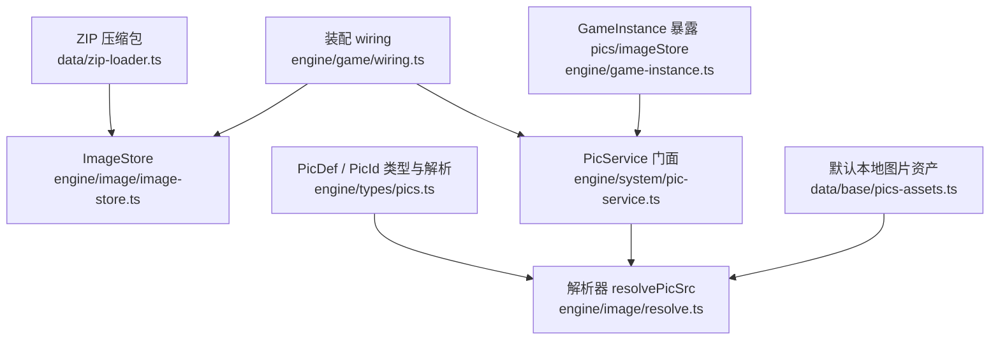
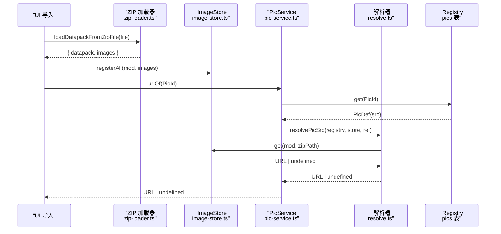
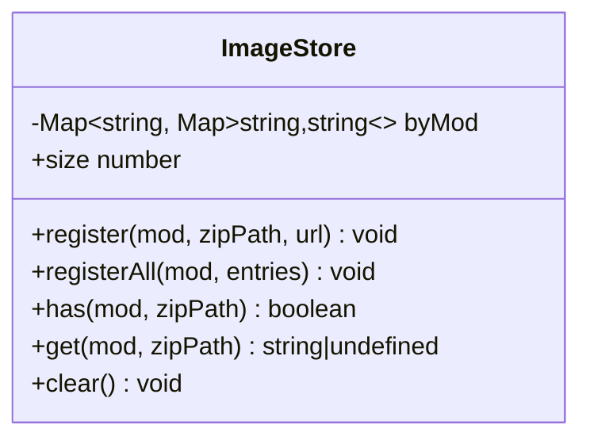
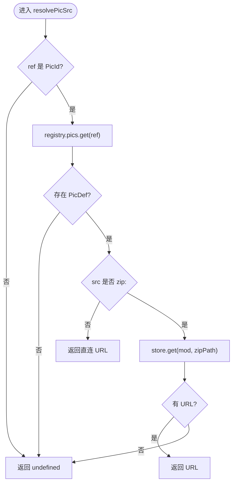
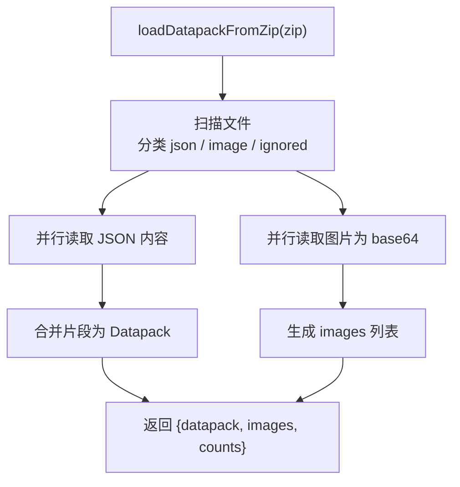
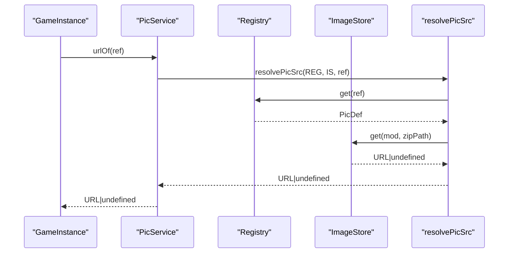
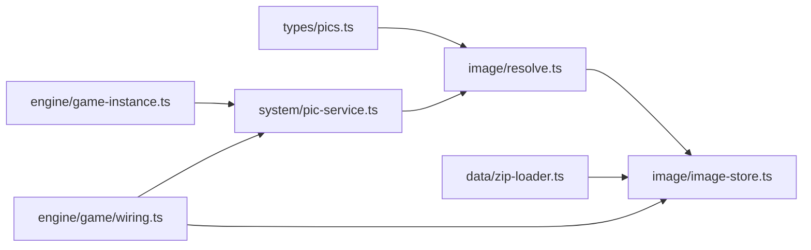

# 图片系统

<cite>
**本文引用的文件**
- [image-store.ts](file://src/engine/image/image-store.ts)
- [resolve.ts](file://src/engine/image/resolve.ts)
- [index.ts](file://src/engine/image/index.ts)
- [pics.ts](file://src/engine/types/pics.ts)
- [pic-service.ts](file://src/engine/system/pic-service.ts)
- [zip-loader.ts](file://src/data/zip-loader.ts)
- [wiring.ts](file://src/engine/game/wiring.ts)
- [game-instance.ts](file://src/engine/game-instance.ts)
- [pics-assets.ts](file://src/data/base/pics-assets.ts)
- [pics.test.ts](file://tests/engine/pics.test.ts)
</cite>

## 目录
1. [简介](#简介)
2. [项目结构](#项目结构)
3. [核心组件](#核心组件)
4. [架构总览](#架构总览)
5. [详细组件分析](#详细组件分析)
6. [依赖关系分析](#依赖关系分析)
7. [性能与内存管理](#性能与内存管理)
8. [UI集成与渲染流程](#ui集成与渲染流程)
9. [配置示例与最佳实践](#配置示例与最佳实践)
10. [故障排除与调试](#故障排除与调试)
11. [结论](#结论)

## 简介
本技术文档围绕 ACProgram 的图片系统展开，重点说明 ImageStore 图片存储的设计、资源加载机制、缓存策略与内存管理；深入解释图片解析与处理（格式支持、尺寸优化建议、懒加载机制）；文档化图片资源的组织与管理方式（路径解析、依赖追踪、版本控制）；并说明图片系统与 UI 渲染的集成（异步加载、进度反馈、错误处理）。最后提供配置示例、优化建议以及性能监控、调试工具与故障排除指南。

## 项目结构
图片系统位于引擎层的数据与子系统之间，承担“从引用到可显示 URL”的解析职责，并与 Mod 压缩包导入流程、注册表、UI 渲染紧密协作。

图表来源
- [zip-loader.ts:209-241](file://src/data/zip-loader.ts#L209-L241)
- [image-store.ts:15-53](file://src/engine/image/image-store.ts#L15-L53)
- [pics.ts:18-99](file://src/engine/types/pics.ts#L18-L99)
- [resolve.ts:17-40](file://src/engine/image/resolve.ts#L17-L40)
- [pic-service.ts:17-36](file://src/engine/system/pic-service.ts#L17-L36)
- [wiring.ts:66-67,267-268:66-67](file://src/engine/game/wiring.ts#L66-L67)
- [wiring.ts:267-268](file://src/engine/game/wiring.ts#L267-L268)
- [game-instance.ts:108-145](file://src/engine/game-instance.ts#L108-L145)
- [pics-assets.ts:7-15](file://src/data/base/pics-assets.ts#L7-L15)

章节来源
- [zip-loader.ts:209-241](file://src/data/zip-loader.ts#L209-L241)
- [image-store.ts:15-53](file://src/engine/image/image-store.ts#L15-L53)
- [pics.ts:18-99](file://src/engine/types/pics.ts#L18-L99)
- [resolve.ts:17-40](file://src/engine/image/resolve.ts#L17-L40)
- [pic-service.ts:17-36](file://src/engine/system/pic-service.ts#L17-L36)
- [wiring.ts:66-67,267-268:66-67](file://src/engine/game/wiring.ts#L66-L67)
- [game-instance.ts:108-145](file://src/engine/game-instance.ts#L108-L145)
- [pics-assets.ts:7-15](file://src/data/base/pics-assets.ts#L7-L15)

## 核心组件
- ImageStore：运行时图片存储，维护 mod + 包内相对路径 → 可显示 URL 的映射，提供登记、查询、清空能力。
- resolve.ts：纯函数解析器，将 PicId 或 PicDef.src 解析为最终 URL；对 zip 来源通过 ImageStore 获取本地 data/blob URL。
- PicService：对外门面，封装 registry.pics 查询与图片 URL 解析，统一入口供 GameInstance 暴露。
- 类型与索引（pics.ts）：定义 PicId、PicKind、PicDef 及解析工具（三段式索引、直连 URL 识别、zip 来源识别）。
- ZIP 加载器（zip-loader.ts）：扫描压缩包中的 .json 与图片文件，提取图片为 data URL，返回给调用方登记到 ImageStore。
- 装配与实例（wiring.ts、game-instance.ts）：在 GameInstance 中创建 ImageStore 与 PicService，并通过 pics 与 imageStore 暴露给上层。
- 默认本地图片（pics-assets.ts）：基础数据包中的本地图片声明，src 直接指向构建期生成的 URL，无需 ImageStore。

章节来源
- [image-store.ts:15-53](file://src/engine/image/image-store.ts#L15-L53)
- [resolve.ts:17-40](file://src/engine/image/resolve.ts#L17-L40)
- [pic-service.ts:17-36](file://src/engine/system/pic-service.ts#L17-L36)
- [pics.ts:18-99](file://src/engine/types/pics.ts#L18-L99)
- [zip-loader.ts:209-241](file://src/data/zip-loader.ts#L209-L241)
- [wiring.ts:66-67,267-268:66-67](file://src/engine/game/wiring.ts#L66-L67)
- [game-instance.ts:108-145](file://src/engine/game-instance.ts#L108-L145)
- [pics-assets.ts:7-15](file://src/data/base/pics-assets.ts#L7-L15)

## 架构总览
图片系统的核心流程如下：
- 资源加载：ZIP 压缩包被解压，JSON 合并为 Datapack，图片文件转为 data URL。
- 资源登记：UI 导入流程将 images 列表登记到 ImageStore（按 mod 名隔离）。
- 资源解析：消费端通过 PicService.urlOf(ref) 解析 PicId，若 src 为 zip 则查 ImageStore，否则直接使用直连 URL。
- 渲染集成：UI 拿到 URL 后用于 img/src 或背景图；未找到时回退占位。

图表来源
- [zip-loader.ts:209-241](file://src/data/zip-loader.ts#L209-L241)
- [image-store.ts:18-40](file://src/engine/image/image-store.ts#L18-L40)
- [pic-service.ts:23-36](file://src/engine/system/pic-service.ts#L23-L36)
- [resolve.ts:17-40](file://src/engine/image/resolve.ts#L17-L40)

## 详细组件分析

### ImageStore 设计与实现
- 数据结构：byMod 为 Map<mod, Map<zipPath, url>>，支持多 mod 隔离与 O(1) 查找。
- 接口：register/registerAll/has/get/clear/size，满足批量登记、存在性检查、统计等需求。
- 设计要点：纯逻辑层，不接触 DOM/文件系统；键空间由 mod+path 唯一确定，避免跨 mod 污染。

图表来源
- [image-store.ts:15-53](file://src/engine/image/image-store.ts#L15-L53)

章节来源
- [image-store.ts:15-53](file://src/engine/image/image-store.ts#L15-L53)

### 图片解析与处理（resolve.ts）
- 输入：registry、store、ref（PicId）。
- 规则：
  - 非 PicId 或非 pics 表项 → undefined。
  - src 为直连 URL → 直接返回。
  - src 为 zip:path → 通过 store.get(mod, path) 取 data/blob URL。
- 输出：可显示 URL 或 undefined（UI 需处理缺失情况）。

图表来源
- [resolve.ts:17-40](file://src/engine/image/resolve.ts#L17-L40)
- [pics.ts:18-99](file://src/engine/types/pics.ts#L18-L99)

章节来源
- [resolve.ts:17-40](file://src/engine/image/resolve.ts#L17-L40)
- [pics.ts:18-99](file://src/engine/types/pics.ts#L18-L99)

### ZIP 加载与图片提取（zip-loader.ts）
- 扫描：遍历压缩包所有文件，区分 .json 与图片扩展名（png/jpg/gif/webp/svg/apng/avif/bmp/ico），其余忽略计数。
- 并行读取：Promise.all 并行读取 JSON 内容与图片 base64，提升加载吞吐。
- 结果：返回 datapack、images（path→data URL）、统计信息（jsonFileCount、ignoredCount）。

图表来源
- [zip-loader.ts:209-241](file://src/data/zip-loader.ts#L209-L241)

章节来源
- [zip-loader.ts:209-241](file://src/data/zip-loader.ts#L209-L241)

### PicService 门面与集成
- 职责：聚合 registry.pics 查询与图片 URL 解析；提供 register 方法将 ZIP 解出的图片登记到 ImageStore。
- 集成点：GameInstance 装配时创建 PicService，并通过 pics 属性暴露；CharaProfileService 也使用 ImageStore 解析头像等。

图表来源
- [pic-service.ts:17-36](file://src/engine/system/pic-service.ts#L17-L36)
- [resolve.ts:17-40](file://src/engine/image/resolve.ts#L17-L40)
- [wiring.ts:267-268](file://src/engine/game/wiring.ts#L267-L268)
- [game-instance.ts:108-145](file://src/engine/game-instance.ts#L108-L145)

章节来源
- [pic-service.ts:17-36](file://src/engine/system/pic-service.ts#L17-L36)
- [wiring.ts:267-268](file://src/engine/game/wiring.ts#L267-L268)
- [game-instance.ts:108-145](file://src/engine/game-instance.ts#L108-L145)

### 类型与索引约定（pics.ts）
- PicId：三段式 mod:type(pic):id，严格匹配 (pic) 标记。
- 工具函数：parsePicId/buildPicId/isPicRef/isDirectUrl/isZipPicSrc/zipPathOf。
- 约束：def 层只持有 PicId，裸 URL 仅存在于 PicDef.src。

章节来源
- [pics.ts:18-99](file://src/engine/types/pics.ts#L18-L99)

## 依赖关系分析
- 模块耦合：
  - resolve.ts 依赖 types/pics.ts 与 image-store.ts。
  - pic-service.ts 依赖 resolve.ts 与 registry。
  - zip-loader.ts 独立于图片系统，但产出 images 供 ImageStore 登记。
  - wiring.ts 装配 ImageStore 与 PicService，game-instance.ts 暴露访问入口。
- 外部依赖：JSZip（压缩包解析）。
- 循环依赖：无显式循环；通过服务门面与纯函数降低耦合。

图表来源
- [pics.ts:18-99](file://src/engine/types/pics.ts#L18-L99)
- [resolve.ts:17-40](file://src/engine/image/resolve.ts#L17-L40)
- [image-store.ts:15-53](file://src/engine/image/image-store.ts#L15-L53)
- [pic-service.ts:17-36](file://src/engine/system/pic-service.ts#L17-L36)
- [zip-loader.ts:209-241](file://src/data/zip-loader.ts#L209-L241)
- [wiring.ts:66-67,267-268:66-67](file://src/engine/game/wiring.ts#L66-L67)
- [game-instance.ts:108-145](file://src/engine/game-instance.ts#L108-L145)

章节来源
- [pics.ts:18-99](file://src/engine/types/pics.ts#L18-L99)
- [resolve.ts:17-40](file://src/engine/image/resolve.ts#L17-L40)
- [image-store.ts:15-53](file://src/engine/image/image-store.ts#L15-L53)
- [pic-service.ts:17-36](file://src/engine/system/pic-service.ts#L17-L36)
- [zip-loader.ts:209-241](file://src/data/zip-loader.ts#L209-L241)
- [wiring.ts:66-67,267-268:66-67](file://src/engine/game/wiring.ts#L66-L67)
- [game-instance.ts:108-145](file://src/engine/game-instance.ts#L108-L145)

## 性能与内存管理
- 加载性能：
  - ZIP 加载采用 Promise.all 并行读取 JSON 与图片，减少 I/O 等待。
  - 图片以 data URL 形式缓存于内存，避免重复解码。
- 内存管理：
  - ImageStore 使用 Map 存储，O(1) 读写；clear 可释放全部条目，适合切换 Mod 或新会话前调用。
  - 大体积图片建议使用现代格式（webp/avif）并控制尺寸，减少 data URL 占用。
- 缓存策略：
  - 当前为进程内内存缓存；如需跨会话持久化，可在 UI 层结合 IndexedDB 缓存 data URL 或改用 blob URL。
- 懒加载建议：
  - 仅在可见区域触发图片解析与渲染（如 IntersectionObserver），避免首屏一次性加载过多图片。
  - 对长列表（聊天流、图鉴）分页加载与回收不可见项的引用。

[本节为通用指导，不直接分析具体文件]

## UI集成与渲染流程
- 入口：UI 选择 ZIP 文件 → 调用 ZIP 加载器 → 获得 datapack 与 images。
- 登记：调用 game.imageStore.registerAll(mod, images) 登记本地图片。
- 解析：UI 通过 game.pics.urlOf(ref) 获取可显示 URL；未声明或未登记时返回 undefined，UI 应展示占位图。
- 渲染：img/src 或 CSS background 使用 URL；对于 SVG/APNG/AVIF 等格式，浏览器兼容性需考虑。
- 进度反馈：ZIP 加载与图片解码可分阶段上报进度（例如每批 N 个文件完成回调），提升用户体验。
- 错误处理：ZIP 加载失败抛出 ZipLoadError；解析失败返回 undefined，UI 需降级处理。

章节来源
- [zip-loader.ts:209-241](file://src/data/zip-loader.ts#L209-L241)
- [pic-service.ts:23-36](file://src/engine/system/pic-service.ts#L23-L36)
- [resolve.ts:17-40](file://src/engine/image/resolve.ts#L17-L40)

## 配置示例与最佳实践
- 数据包 pics 表：
  - 使用三段式 PicId 作为 id，src 可为直连 URL 或 zip:包内相对路径。
  - 推荐按用途分类 typeName（avatar/background/sticker/card/icon/banner）。
- 本地图片：
  - 基础数据包可通过构建期导入生成 URL，src 直接指向该 URL，无需 ImageStore。
- 尺寸优化：
  - 优先使用 webp/avif；对头像/图标等小图使用 PNG/SVG；大图压缩质量控制在 70%-85%。
- 懒加载：
  - 结合滚动可视区域延迟解析与渲染；对频繁切换的场景（聊天流）预取下一帧所需图片。
- 版本控制：
  - Datapack 携带 name/version；切换 Mod 前调用 imageStore.clear() 避免旧引用残留。

章节来源
- [pics.ts:18-99](file://src/engine/types/pics.ts#L18-L99)
- [pics-assets.ts:7-15](file://src/data/base/pics-assets.ts#L7-L15)
- [zip-loader.ts:209-241](file://src/data/zip-loader.ts#L209-L241)

## 故障排除与调试
- 常见问题：
  - 图片未显示：确认 PicId 正确、pics 表已加载、ImageStore 已登记对应 zip 路径。
  - ZIP 加载失败：检查压缩包是否包含至少一个 .json；关注 ignoredCount 提示。
  - 解析返回 undefined：非 PicId 或非 pics 表项会返回 undefined；直连 URL 不会经 resolvePicSrc 解析。
- 调试手段：
  - 使用 DevLog 记录事件与 tick 信息，辅助定位问题。
  - 通过测试用例验证解析逻辑与边界条件（参考 tests/engine/pics.test.ts）。
- 回归测试要点：
  - 三段式索引解析与构建的可逆性。
  - 直连 URL 与 zip 来源的识别与处理。
  - ImageStore 的登记、查询、清空行为。
  - Registry pics 表的加载、查询与校验。

章节来源
- [zip-loader.ts:76-85](file://src/data/zip-loader.ts#L76-L85)
- [pics.test.ts:19-166](file://tests/engine/pics.test.ts#L19-L166)
- [pics.test.ts:168-255](file://tests/engine/pics.test.ts#L168-L255)
- [pics.test.ts:257-288](file://tests/engine/pics.test.ts#L257-L288)

## 结论
ACProgram 的图片系统以 ImageStore 为核心缓存、resolve.ts 为解析中枢、PicService 为统一门面，配合 ZIP 加载器与类型约定，实现了模块化、可扩展且易于集成的图片资源管理。通过严格的 PicId 约定与数据驱动的配置，系统在保持灵活性的同时确保了可维护性与可测试性。建议在大规模资源场景下引入更细粒度的懒加载与持久化缓存策略，并结合性能监控持续优化。