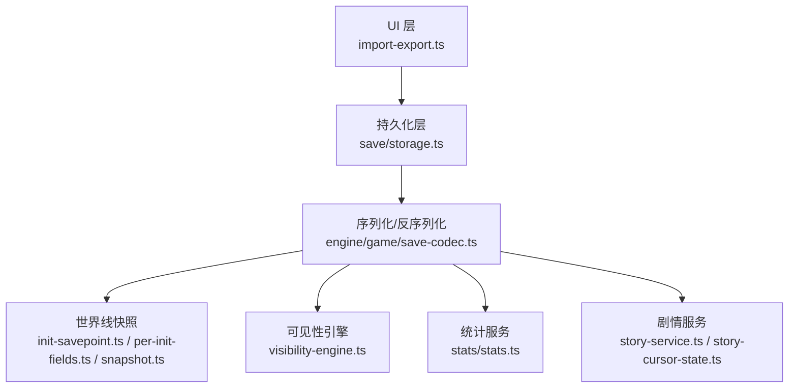
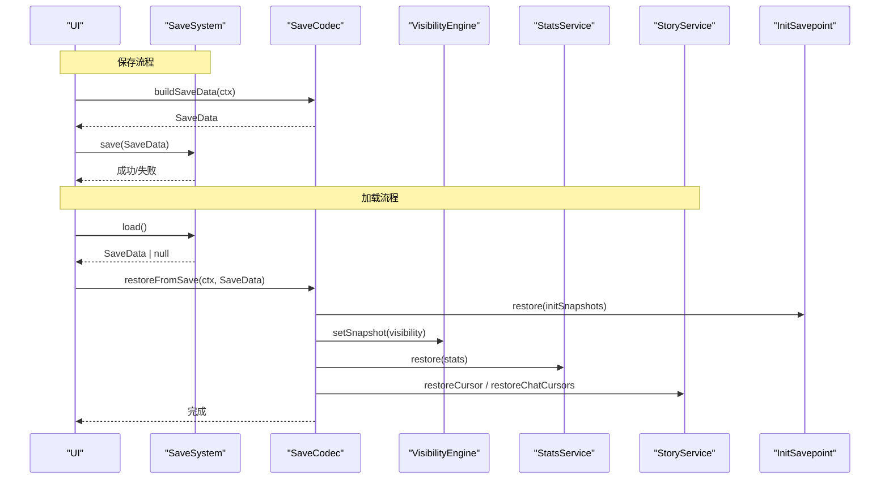
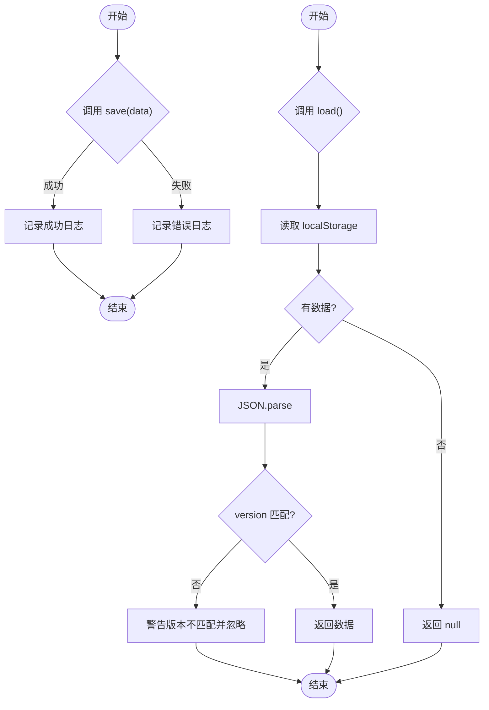
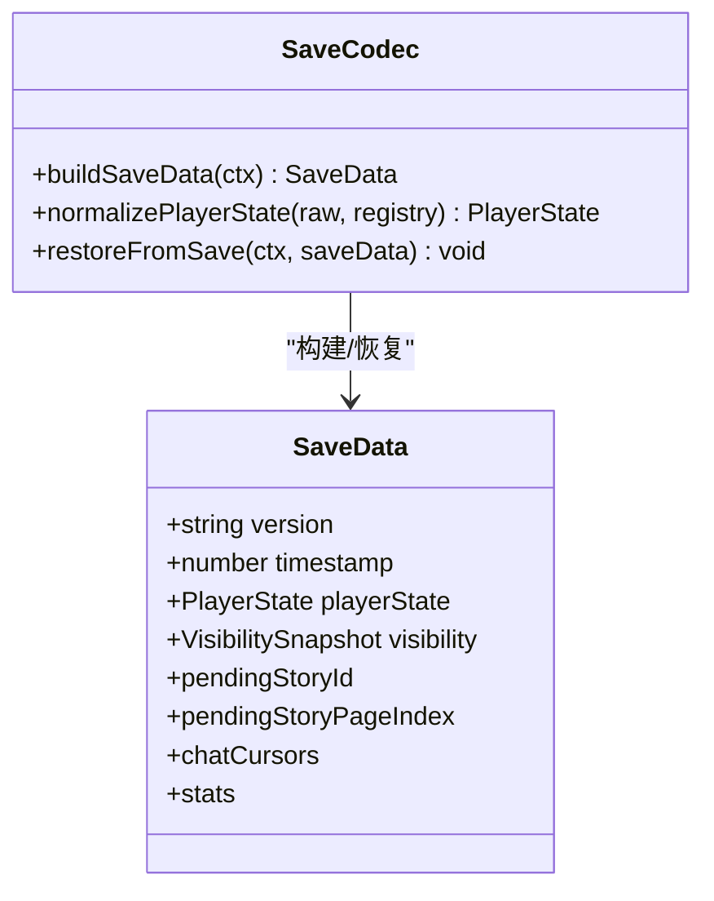
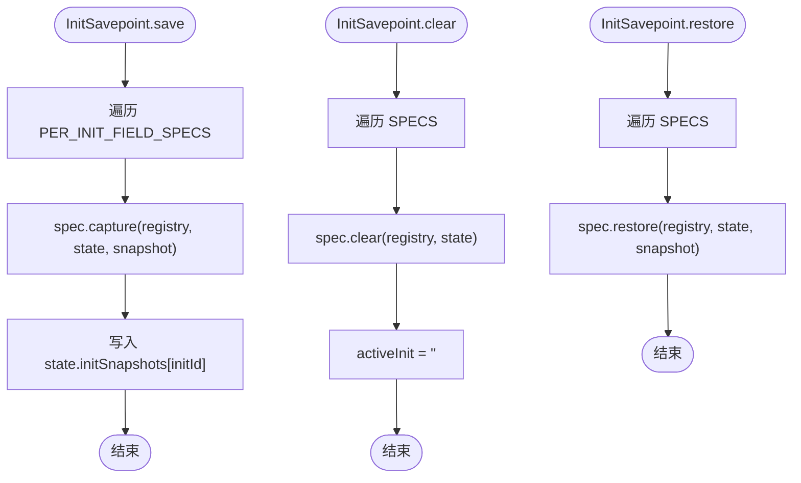
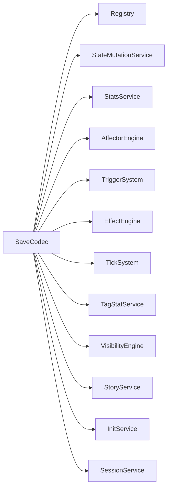

# 存档系统

<cite>
**本文引用的文件**
- [src/save/storage.ts](file://src/save/storage.ts)
- [src/engine/game/save-codec.ts](file://src/engine/game/save-codec.ts)
- [src/engine/game/init-savepoint.ts](file://src/engine/game/init-savepoint.ts)
- [src/engine/game/per-init-fields.ts](file://src/engine/game/per-init-fields.ts)
- [src/engine/game/snapshot.ts](file://src/engine/game/snapshot.ts)
- [src/engine/game/state-factory.ts](file://src/engine/game/state-factory.ts)
- [src/engine/stats/stats.ts](file://src/engine/stats/stats.ts)
- [src/engine/visibility/visibility-engine.ts](file://src/engine/visibility/visibility-engine.ts)
- [src/engine/game/story-service.ts](file://src/engine/game/story-service.ts)
- [src/engine/game/story-cursor-state.ts](file://src/engine/game/story-cursor-state.ts)
- [src/ui/import-export.ts](file://src/ui/import-export.ts)
</cite>

## 目录
1. [简介](#简介)
2. [项目结构](#项目结构)
3. [核心组件](#核心组件)
4. [架构总览](#架构总览)
5. [详细组件分析](#详细组件分析)
6. [依赖关系分析](#依赖关系分析)
7. [性能与优化](#性能与优化)
8. [故障排查指南](#故障排查指南)
9. [结论](#结论)
10. [附录](#附录)

## 简介
本技术文档围绕 ACProgram 的存档系统，系统性阐述 SaveSystem 存档管理、SaveCodec 编解码器设计、Snapshot 快照机制、存档数据结构组织（玩家状态、游戏进度、配置信息），以及导入导出、备份恢复与云同步的实现要点。同时给出数据安全、压缩优化与性能调优的最佳实践建议。

## 项目结构
存档相关代码主要分布在以下模块：
- 持久化层：LocalStorage 存取、版本校验、导入导出
- 序列化/反序列化：构建 SaveData、旧档兼容与字段迁移、子系统恢复编排
- 世界线快照：per-Init 字段的保存/清除/恢复，Spot 全局/局部隔离
- 可见性快照：VisibilitySnapshot 的持久化与恢复
- 统计持久化：三层统计（global/init/session）的持久化与恢复
- 剧情游标：全局与聊天沙盒游标的保存/恢复
- UI 导入导出：Mod 数据包导入与日志导出

图表来源
- [src/ui/import-export.ts:1-96](file://src/ui/import-export.ts#L1-L96)
- [src/save/storage.ts:1-74](file://src/save/storage.ts#L1-L74)
- [src/engine/game/save-codec.ts:1-172](file://src/engine/game/save-codec.ts#L1-L172)
- [src/engine/game/init-savepoint.ts:1-55](file://src/engine/game/init-savepoint.ts#L1-L55)
- [src/engine/game/per-init-fields.ts:1-153](file://src/engine/game/per-init-fields.ts#L1-L153)
- [src/engine/game/snapshot.ts:1-25](file://src/engine/game/snapshot.ts#L1-L25)
- [src/engine/visibility/visibility-engine.ts:1-122](file://src/engine/visibility/visibility-engine.ts#L1-L122)
- [src/engine/stats/stats.ts:1-228](file://src/engine/stats/stats.ts#L1-L228)
- [src/engine/game/story-service.ts:53-156](file://src/engine/game/story-service.ts#L53-L156)
- [src/engine/game/story-cursor-state.ts:1-89](file://src/engine/game/story-cursor-state.ts#L1-L89)

章节来源
- [src/save/storage.ts:1-74](file://src/save/storage.ts#L1-L74)
- [src/engine/game/save-codec.ts:1-172](file://src/engine/game/save-codec.ts#L1-L172)
- [src/engine/game/init-savepoint.ts:1-55](file://src/engine/game/init-savepoint.ts#L1-L55)
- [src/engine/game/per-init-fields.ts:1-153](file://src/engine/game/per-init-fields.ts#L1-L153)
- [src/engine/game/snapshot.ts:1-25](file://src/engine/game/snapshot.ts#L1-L25)
- [src/engine/visibility/visibility-engine.ts:1-122](file://src/engine/visibility/visibility-engine.ts#L1-L122)
- [src/engine/stats/stats.ts:1-228](file://src/engine/stats/stats.ts#L1-L228)
- [src/engine/game/story-service.ts:53-156](file://src/engine/game/story-service.ts#L53-L156)
- [src/engine/game/story-cursor-state.ts:1-89](file://src/engine/game/story-cursor-state.ts#L1-L89)
- [src/ui/import-export.ts:1-96](file://src/ui/import-export.ts#L1-L96)

## 核心组件
- SaveSystem（持久化层）
  - 负责将 SaveData 序列化为 JSON 写入 LocalStorage，读取时进行版本校验，提供删除、存在性检查、字符串导入导出能力。
- SaveCodec（序列化/反序列化）
  - 负责从运行时状态构建 SaveData；加载时执行 normalizePlayerState 进行旧档兼容与字段迁移；restoreFromSave 将数据写回 PlayerState 并重新同步各子系统（效果、触发、Tick、TagStat、可见性、剧情游标、会话时间等）。
- InitSavepoint + Per-Init Fields（世界线快照）
  - 以单一事实源 PER_INIT_FIELD_SPECS 驱动 per-Init 字段的 save/clear/restore；Spot 容器按 global/local 分离，确保跨世界线共享设施不被覆盖。
- VisibilityEngine（可见性快照）
  - 维护 VisibilitySnapshot 增量脏标记；支持直接 setSnapshot 恢复存档可见性。
- StatsService（统计持久化）
  - 维护 global/init/session 三层统计；提供 getPersistable/restore 用于存档读写。
- StoryService + StoryCursorState（剧情游标）
  - 保存/恢复全局与聊天沙盒游标；兼容旧档缺失字段。
- ImportExportService（UI 导入导出）
  - Mod 数据包导入后清理图片存储、reload、删除旧存档并启动新会话；导出开发日志为 JSON。

章节来源
- [src/save/storage.ts:1-74](file://src/save/storage.ts#L1-L74)
- [src/engine/game/save-codec.ts:1-172](file://src/engine/game/save-codec.ts#L1-L172)
- [src/engine/game/init-savepoint.ts:1-55](file://src/engine/game/init-savepoint.ts#L1-L55)
- [src/engine/game/per-init-fields.ts:1-153](file://src/engine/game/per-init-fields.ts#L1-L153)
- [src/engine/game/snapshot.ts:1-25](file://src/engine/game/snapshot.ts#L1-L25)
- [src/engine/visibility/visibility-engine.ts:1-122](file://src/engine/visibility/visibility-engine.ts#L1-L122)
- [src/engine/stats/stats.ts:1-228](file://src/engine/stats/stats.ts#L1-L228)
- [src/engine/game/story-service.ts:53-156](file://src/engine/game/story-service.ts#L53-L156)
- [src/engine/game/story-cursor-state.ts:1-89](file://src/engine/game/story-cursor-state.ts#L1-L89)
- [src/ui/import-export.ts:1-96](file://src/ui/import-export.ts#L1-L96)

## 架构总览
存档流程分为“保存”和“加载”两条主路径：
- 保存：GameInstance 组合各服务产出 PlayerState、VisibilitySnapshot、Stats、Story Cursor，由 SaveCodec 组装为 SaveData，再由 SaveSystem 落盘。
- 加载：SaveSystem 读取并校验版本，SaveCodec 解析并迁移旧档，restoreFromSave 写回 PlayerState，依次同步各子系统，最后恢复可见性、统计、剧情游标与会话时间。

图表来源
- [src/save/storage.ts:1-74](file://src/save/storage.ts#L1-L74)
- [src/engine/game/save-codec.ts:1-172](file://src/engine/game/save-codec.ts#L1-L172)
- [src/engine/game/init-savepoint.ts:1-55](file://src/engine/game/init-savepoint.ts#L1-L55)
- [src/engine/visibility/visibility-engine.ts:1-122](file://src/engine/visibility/visibility-engine.ts#L1-L122)
- [src/engine/stats/stats.ts:1-228](file://src/engine/stats/stats.ts#L1-L228)
- [src/engine/game/story-service.ts:53-156](file://src/engine/game/story-service.ts#L53-L156)

## 详细组件分析

### SaveSystem（持久化层）
- 职责
  - 将 SaveData 序列化为 JSON 存入 LocalStorage；读取时校验 version 与本地期望版本一致；提供 delete/exists/export/import。
- 关键点
  - 版本控制：SAVE_VERSION 与 SaveData.version 双重校验，避免不兼容存档被误读。
  - 错误处理：捕获异常并返回布尔或空值，保证上层调用安全。
  - 导入导出：export 返回原始 JSON 字符串便于备份；import 解析并校验版本后覆盖本地存档。

图表来源
- [src/save/storage.ts:1-74](file://src/save/storage.ts#L1-L74)

章节来源
- [src/save/storage.ts:1-74](file://src/save/storage.ts#L1-L74)

### SaveCodec（序列化/反序列化）
- 职责
  - buildSaveData：从上下文构造 SaveData，包含 playerState、visibility、剧情游标、聊天沙盒游标、统计等。
  - normalizePlayerState：对旧档进行兼容与迁移（extras/initExtras 底座补齐、全局资源迁移、currentAreaId 兜底）。
  - restoreFromSave：写回 PlayerState，挂载当前世界线 Trigger，恢复可见性、统计、剧情游标、会话时间，并重新同步各子系统。
- 关键设计
  - 版本字段：SaveData.version 固定为 '1.0.0'，配合 SaveSystem 的版本校验实现向前兼容。
  - 兼容性：对缺失字段提供默认值与迁移逻辑，降低旧档破坏风险。
  - 子系统重同步：通过 setState/reconcileMounts 等方法确保恢复后的状态一致性。

图表来源
- [src/engine/game/save-codec.ts:1-172](file://src/engine/game/save-codec.ts#L1-L172)

章节来源
- [src/engine/game/save-codec.ts:1-172](file://src/engine/game/save-codec.ts#L1-L172)

### Snapshot 快照系统（per-Init 与 Spot 隔离）
- InitSavepoint
  - 基于 PER_INIT_FIELD_SPECS 遍历执行 capture/clear/restore，保证新增字段只需在规范中声明即可参与存档。
  - seed：以 InitDef.extra 为底座重建 initExtras。
- Per-Init Fields
  - field：普通字段浅拷贝捕获，clear 使用 fresh 工厂重置。
  - spotField：Spot 容器区分 global/local，clear 保留 global，restore 合并 local 到 global 基底。
  - characterContainer：按 roster/gacha/chatRead 归属决定参与范围，global 块跨世界线保留。
  - extrasSpec：处理历史命名差异（initExtras vs extras），深拷贝合并。
  - 编译期守卫：PER_INIT_KEY_GUARD 强制 SPECS 键集合与 InitSnapshot 键集合一致，防止漂移。
- Snapshot 辅助函数
  - globalSpotEntries/localSpotEntries：依据 Registry.spots.global 标志过滤条目。

图表来源
- [src/engine/game/init-savepoint.ts:1-55](file://src/engine/game/init-savepoint.ts#L1-L55)
- [src/engine/game/per-init-fields.ts:1-153](file://src/engine/game/per-init-fields.ts#L1-L153)
- [src/engine/game/snapshot.ts:1-25](file://src/engine/game/snapshot.ts#L1-L25)

章节来源
- [src/engine/game/init-savepoint.ts:1-55](file://src/engine/game/init-savepoint.ts#L1-L55)
- [src/engine/game/per-init-fields.ts:1-153](file://src/engine/game/per-init-fields.ts#L1-L153)
- [src/engine/game/snapshot.ts:1-25](file://src/engine/game/snapshot.ts#L1-L25)

### 存档数据结构与组织
- SaveData
  - version/timestamp：存档元信息。
  - playerState：玩家状态（资源、区域、解锁、库存、故事日志、标记、触发完成列表、世界线信息等）。
  - visibility：可见性快照（实体解锁/可见状态）。
  - 剧情相关：pendingStoryId/pageIndex/choiceIndex、insertStack、visitedStoryIds、isReplay、chatCursors、chatHistories。
  - stats：三层统计（global/init/session）。
- PlayerState 默认构建
  - createDefaultState 提供初始值（资源、全局资源、设施等级/管理器、解锁项、帧计数、标签/实体效果、故事日志、库存、标记、已解锁世界线、访问区域、init 快照、extras/initExtras）。
- 可见性引擎
  - getVisibility 返回增量计算后的快照；setSnapshot 直接恢复存档可见性。
- 统计服务
  - getPersistable/restore 负责 session/global/init 的持久化与恢复；beginSession 开启新游玩。
- 剧情游标
  - StoryCursorState.save/restore 透传所有字段，兼容旧档缺失的新字段。

章节来源
- [src/engine/game/save-codec.ts:1-172](file://src/engine/game/save-codec.ts#L1-L172)
- [src/engine/game/state-factory.ts:1-30](file://src/engine/game/state-factory.ts#L1-L30)
- [src/engine/visibility/visibility-engine.ts:1-122](file://src/engine/visibility/visibility-engine.ts#L1-L122)
- [src/engine/stats/stats.ts:1-228](file://src/engine/stats/stats.ts#L1-L228)
- [src/engine/game/story-cursor-state.ts:1-89](file://src/engine/game/story-cursor-state.ts#L1-L89)

### 导入导出、备份恢复与云同步
- 导入导出（UI 层）
  - 导入 Mod 压缩包：解析 zip 中的 json 构建 Datapack，清空图片存储并注册图片，reload 后删除旧存档以避免 id 失效，启动新会话并渲染 UI。
  - 导出日志：导出 devLog 全量与运行上下文为 JSON 文件下载。
- 备份恢复
  - SaveSystem.export 获取本地存档 JSON 字符串，可用于手动备份；import 可导入外部 JSON 覆盖本地存档（需版本匹配）。
- 云同步建议
  - 将 SaveSystem.export 的结果上传至云端；恢复时先校验版本再 import。
  - 建议在导入前做完整性校验（如 JSON 解析、关键字段存在性检查），并在失败时回滚。

章节来源
- [src/ui/import-export.ts:1-96](file://src/ui/import-export.ts#L1-L96)
- [src/save/storage.ts:1-74](file://src/save/storage.ts#L1-L74)

## 依赖关系分析
- SaveSystem 依赖 SaveData 类型（来自 engine-instance 暴露的类型），仅负责 I/O。
- SaveCodec 依赖多子系统：Registry、DevLog、StateMutationService、StatsService、AffectorEngine、TriggerSystem、EffectEngine、TickSystem、TagStatService、VisibilityEngine、StoryService、InitService、SessionService。
- InitSavepoint 依赖 PER_INIT_FIELD_SPECS 与 Registry，解耦具体字段逻辑。
- VisibilityEngine 依赖 Registry、ConditionSystem、EventBus，维护增量脏标记与快照。
- StatsService 依赖 PlayerState 与计数器工具，提供持久化接口。
- StoryService 维护全局与聊天沙盒游标，提供 save/restore 接口。

图表来源
- [src/engine/game/save-codec.ts:1-172](file://src/engine/game/save-codec.ts#L1-L172)

章节来源
- [src/engine/game/save-codec.ts:1-172](file://src/engine/game/save-codec.ts#L1-L172)

## 性能与优化
- 序列化体积
  - SaveData 包含完整 PlayerState 与 VisibilitySnapshot，体积较大。建议：
    - 仅在必要时序列化（如自动保存间隔、退出时）。
    - 对大对象（如 chatHistories）考虑分片或压缩。
- 增量更新
  - VisibilityEngine 使用增量脏标记减少重算开销；尽量通过事件驱动变更，避免频繁全量重建。
- 统计持久化
  - StatsService 的 session/global/init 分层设计有利于只持久化必要部分；beginSession 重置 session 定位信息。
- 世界线快照
  - per-Init 字段采用浅拷贝与按需捕获，减少不必要深拷贝；Spot 容器按 global/local 分离，避免跨世界线污染。
- 导入导出
  - 导入 Mod 后删除旧存档，避免残留引用导致的不一致；日志导出便于问题定位。

[本节为通用指导，不直接分析具体文件]

## 故障排查指南
- 版本不匹配
  - 现象：load 返回 null，控制台输出版本不匹配警告。
  - 原因：SaveData.version 与 SAVE_VERSION 不一致。
  - 处理：升级 SaveSystem 的 SAVE_VERSION 或在 SaveCodec 中添加迁移逻辑。
- 导入失败
  - 现象：导入 Mod 抛出异常，toast 显示错误信息。
  - 原因：zip 格式错误或 json 内容无效。
  - 处理：检查 Mod 包结构与内容，查看 devLog 记录。
- 存档损坏
  - 现象：import 解析失败或字段缺失。
  - 原因：外部修改或传输损坏。
  - 处理：校验 JSON 合法性，必要时回退到备份存档。
- 世界线不一致
  - 现象：切换世界线后设施状态异常。
  - 原因：Spot 容器未正确区分 global/local。
  - 处理：确认 per-init-fields 的 spotField 行为与 Registry.spots.global 设置一致。

章节来源
- [src/save/storage.ts:1-74](file://src/save/storage.ts#L1-L74)
- [src/ui/import-export.ts:1-96](file://src/ui/import-export.ts#L1-L96)
- [src/engine/game/per-init-fields.ts:1-153](file://src/engine/game/per-init-fields.ts#L1-L153)

## 结论
ACProgram 的存档系统通过清晰的层次划分与严格的版本控制，实现了可靠的持久化与恢复。SaveCodec 承担核心序列化/反序列化职责，结合 per-Init 字段清单与 Spot 隔离策略，确保世界线间状态的正确性。VisibilityEngine 与 StatsService 提供高效的增量计算与统计持久化。UI 层的导入导出功能简化了 Mod 管理与日志收集。整体设计兼顾可扩展性与可维护性，适合后续的云同步与压缩优化扩展。

## 附录
- 最佳实践
  - 数据安全：导入前校验 JSON 与关键字段；版本不匹配时拒绝加载。
  - 压缩优化：对大对象（如聊天历史）进行压缩或分片；定期清理无用数据。
  - 性能调优：利用 VisibilityEngine 增量更新；避免频繁全量重建；合理设置自动保存频率。
  - 云同步：将 SaveSystem.export 结果上传；恢复时先校验版本与完整性；冲突解决策略（如时间戳优先）。

[本节为通用指导，不直接分析具体文件]