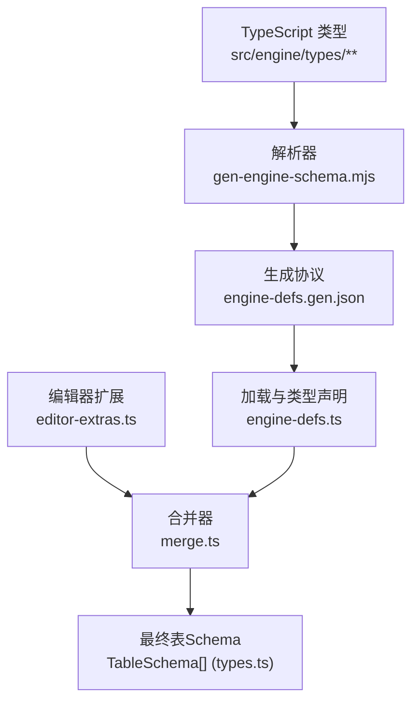
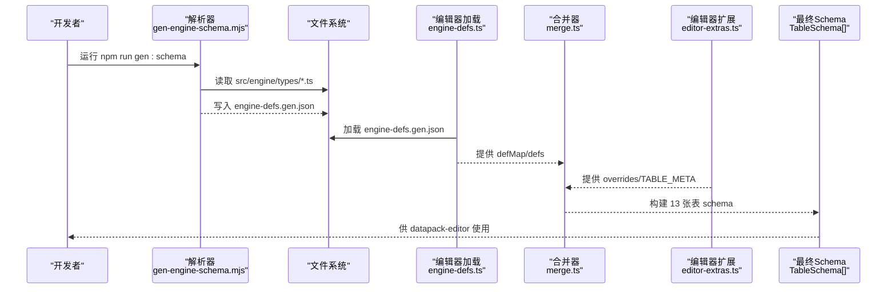
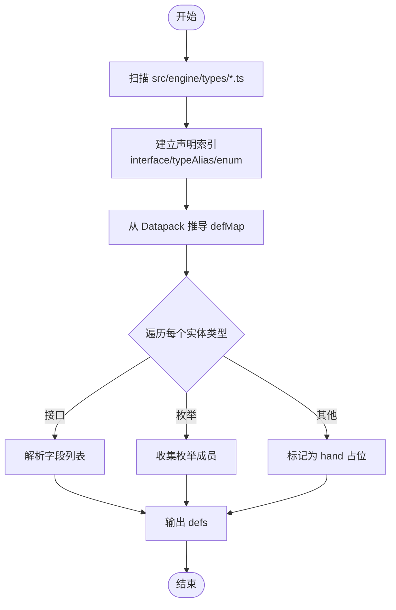
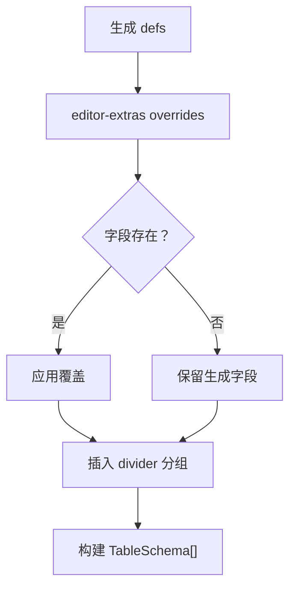
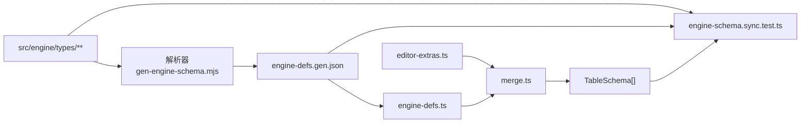

# Schema生成工具

<cite>
**本文引用的文件**
- [scripts/gen-engine-schema.mjs](file://scripts/gen-engine-schema.mjs)
- [scripts/gen-engine-schema.d.mts](file://scripts/gen-engine-schema.d.mts)
- [tools/datapack-editor/schema/engine-defs.gen.json](file://tools/datapack-editor/schema/engine-defs.gen.json)
- [tools/datapack-editor/schema/engine-defs.ts](file://tools/datapack-editor/schema/engine-defs.ts)
- [tools/datapack-editor/schema/merge.ts](file://tools/datapack-editor/schema/merge.ts)
- [tools/datapack-editor/schema/types.ts](file://tools/datapack-editor/schema/types.ts)
- [tools/datapack-editor/schema/editor-extras.ts](file://tools/datapack-editor/schema/editor-extras.ts)
- [tools/datapack-editor/schema/engine-schema.sync.test.ts](file://tools/datapack-editor/schema/engine-schema.sync.test.ts)
- [src/engine/types/datapack.ts](file://src/engine/types/datapack.ts)
- [src/engine/types/world.ts](file://src/engine/types/world.ts)
- [src/engine/types/content.ts](file://src/engine/types/content.ts)
- [package.json](file://package.json)
</cite>

## 目录
1. [简介](#简介)
2. [项目结构](#项目结构)
3. [核心组件](#核心组件)
4. [架构总览](#架构总览)
5. [详细组件分析](#详细组件分析)
6. [依赖关系分析](#依赖关系分析)
7. [性能与可扩展性](#性能与可扩展性)
8. [故障排除指南](#故障排除指南)
9. [结论](#结论)
10. [附录](#附录)

## 简介
本技术文档面向 ACProgram 的 Schema 生成工具，系统性说明其工作原理：从引擎类型定义（src/engine/types/**）解析出数据表结构与字段语义，生成 engine-defs.gen.json；再与编辑器侧的 editor-extras 合并，产出 datapack-editor 可用的 TableSchema。文档同时解释生成的 engine-defs.json 与 engine-defs.ts 的作用、Schema 合并机制（版本兼容与增量更新）、类型映射规则（复杂类型、枚举、引用），以及扩展点（新增数据类型与验证规则）。最后提供常见问题排查方法。

## 项目结构
- 生成器脚本位于 scripts/gen-engine-schema.mjs，负责读取 src/engine/types 下的 TypeScript 源文件，解析接口/类型别名/枚举，并输出 JSON Schema 描述到 tools/datapack-editor/schema/engine-defs.gen.json。
- 编辑器侧通过 tools/datapack-editor/schema/engine-defs.ts 加载该 JSON，并以 types.ts 定义的 DSL 表达最终编辑 schema。
- merge.ts 将“生成 defs”与“editor-extras 覆盖”合并为最终的 13 张表 schema。
- 同步测试 engine-schema.sync.test.ts 保证引擎类型变更与编辑器 schema 的一致性。

图表来源
- [scripts/gen-engine-schema.mjs:208-267](file://scripts/gen-engine-schema.mjs#L208-L267)
- [tools/datapack-editor/schema/engine-defs.ts:67-69](file://tools/datapack-editor/schema/engine-defs.ts#L67-L69)
- [tools/datapack-editor/schema/merge.ts:62-102](file://tools/datapack-editor/schema/merge.ts#L62-L102)
- [tools/datapack-editor/schema/types.ts:33-53](file://tools/datapack-editor/schema/types.ts#L33-L53)

章节来源
- [scripts/gen-engine-schema.mjs:1-285](file://scripts/gen-engine-schema.mjs#L1-L285)
- [tools/datapack-editor/schema/engine-defs.ts:1-70](file://tools/datapack-editor/schema/engine-defs.ts#L1-L70)
- [tools/datapack-editor/schema/merge.ts:1-103](file://tools/datapack-editor/schema/merge.ts#L1-L103)
- [tools/datapack-editor/schema/types.ts:1-131](file://tools/datapack-editor/schema/types.ts#L1-L131)

## 核心组件
- 解析器（parseEngineSchema）：扫描 src/engine/types/*.ts，收集所有 interface/typeAlias/enum，构建 defMap（来自 Datapack 接口的数组/record 字段）与 defs（实体字段定义）。
- 生成协议（engine-defs.gen.json）：包含 generatedAt、sourceDir、defMap、defs、indexedTypes。
- 编辑器类型（engine-defs.ts）：定义 GenField、GenEntity、EngineSchema 等 TS 类型，并提供 loadEngineDefs() 加载 JSON。
- 合并器（merge.ts）：将生成 defs 与 editor-extras 合并，处理 ref/array/object/record/enum/flexible/hand 等字段转换，并注入 divider 分组。
- 编辑器扩展（editor-extras.ts）：提供复杂字段（tagged/union/ref/optionsFrom/collapsible/divider）与整表自定义构建逻辑。
- 同步测试（engine-schema.sync.test.ts）：校验 defMap 覆盖、字段同步、无残留 hand、ref 合法性、枚举选项一致性。

章节来源
- [scripts/gen-engine-schema.mjs:208-267](file://scripts/gen-engine-schema.mjs#L208-L267)
- [tools/datapack-editor/schema/engine-defs.gen.json:1-113](file://tools/datapack-editor/schema/engine-defs.gen.json#L1-L113)
- [tools/datapack-editor/schema/engine-defs.ts:10-69](file://tools/datapack-editor/schema/engine-defs.ts#L10-L69)
- [tools/datapack-editor/schema/merge.ts:15-60](file://tools/datapack-editor/schema/merge.ts#L15-L60)
- [tools/datapack-editor/schema/editor-extras.ts:1-200](file://tools/datapack-editor/schema/editor-extras.ts#L1-L200)
- [tools/datapack-editor/schema/engine-schema.sync.test.ts:1-162](file://tools/datapack-editor/schema/engine-schema.sync.test.ts#L1-L162)

## 架构总览
下图展示从引擎类型到编辑器 schema 的完整流程，包括解析、生成、合并与消费环节。

图表来源
- [scripts/gen-engine-schema.mjs:269-284](file://scripts/gen-engine-schema.mjs#L269-L284)
- [tools/datapack-editor/schema/engine-defs.ts:67-69](file://tools/datapack-editor/schema/engine-defs.ts#L67-L69)
- [tools/datapack-editor/schema/merge.ts:62-102](file://tools/datapack-editor/schema/merge.ts#L62-L102)
- [package.json:6-14](file://package.json#L6-L14)

## 详细组件分析

### 解析器：从引擎类型提取 Schema
- 扫描目录：读取 src/engine/types 下所有 .ts（排除 index.ts）。
- 声明索引：收集 interface/typeAlias/enum 名称与节点，形成 decl 表。
- 推导 defMap：基于 Datapack 接口的数组/record 字段，推断每个表的 type 与 shape（array/record）。
- 生成 defs：对 defMap 中的每个实体类型，解析其 fields（接口成员）或 enum（枚举成员），无法自动推导的复杂类型标记为 hand。
- 深度限制与兜底：describeType 在深度 > 4 时回退为 hand，避免递归爆炸。

图表来源
- [scripts/gen-engine-schema.mjs:208-267](file://scripts/gen-engine-schema.mjs#L208-L267)

章节来源
- [scripts/gen-engine-schema.mjs:54-140](file://scripts/gen-engine-schema.mjs#L54-L140)
- [scripts/gen-engine-schema.mjs:208-267](file://scripts/gen-engine-schema.mjs#L208-L267)
- [src/engine/types/datapack.ts:46-134](file://src/engine/types/datapack.ts#L46-L134)

### 生成协议：engine-defs.gen.json 与 engine-defs.ts
- engine-defs.gen.json：由解析器输出，包含 generatedAt、sourceDir、defMap、defs、indexedTypes。用于编辑器侧解耦运行时代码，仅消费此协议。
- engine-defs.ts：定义 GenKind、GenField、GenEntity、EngineSchema 等类型，并提供 loadEngineDefs() 加载 JSON。确保编辑器侧不直接 import src/**，保持解耦纪律。

章节来源
- [tools/datapack-editor/schema/engine-defs.gen.json:1-113](file://tools/datapack-editor/schema/engine-defs.gen.json#L1-L113)
- [tools/datapack-editor/schema/engine-defs.ts:1-70](file://tools/datapack-editor/schema/engine-defs.ts#L1-L70)

### 合并机制：engine defs ⊕ editor-extras
- 优先级：overrides（editor-extras）> 生成 defs > hand 占位（残留即同步遗漏，测试报错）。
- 字段转换：convertGenerated 将 GenField 转换为 FieldDef，支持 string/int/float/bool/enum/ref/extra/flexible/array/object/record。
- 分组与分隔：支持 divider 插入 UI 分组；worldlineSplit/virtual/idFormat 等元信息透传至最终 TableSchema。
- 虚拟表：如 storyEntries = activeStories ∪ passiveStories 的只读引用视图（不落盘）。

图表来源
- [tools/datapack-editor/schema/merge.ts:15-60](file://tools/datapack-editor/schema/merge.ts#L15-L60)
- [tools/datapack-editor/schema/merge.ts:62-102](file://tools/datapack-editor/schema/merge.ts#L62-L102)
- [tools/datapack-editor/schema/types.ts:33-53](file://tools/datapack-editor/schema/types.ts#L33-L53)

章节来源
- [tools/datapack-editor/schema/merge.ts:1-103](file://tools/datapack-editor/schema/merge.ts#L1-L103)
- [tools/datapack-editor/schema/editor-extras.ts:1-200](file://tools/datapack-editor/schema/editor-extras.ts#L1-L200)
- [tools/datapack-editor/schema/types.ts:11-53](file://tools/datapack-editor/schema/types.ts#L11-L53)

### 类型映射规则
- 简单类型：string、boolean、number（float）、int（通过 @int/@float 标签修正）。
- 数组：X[] → array，item 递归描述。
- Record<string, X> → record，value 递归描述。
- 字符串字面量联合 → enum，options 取自字面量集合。
- 引用类型：
  - ID 引用：基于 ID_REF_TABLE 将 XxxId 映射到对应表 key（如 InitId→inits）。
  - 显式 ref/refList：通过 @ref/@refList 标签指定目标表。
- 复杂类型：Effect、Condition、ValueExpression、FuncletDef 等标记为 hand，需 editor-extras 提供具体 FieldDef。
- Extra 树：ExtraCompound/ExtraValue 标记为 extra，开放可变内容。

章节来源
- [scripts/gen-engine-schema.mjs:23-51](file://scripts/gen-engine-schema.mjs#L23-L51)
- [scripts/gen-engine-schema.mjs:83-140](file://scripts/gen-engine-schema.mjs#L83-L140)
- [tools/datapack-editor/schema/types.ts:81-127](file://tools/datapack-editor/schema/types.ts#L81-L127)

### 扩展点：添加新数据类型与验证规则
- 新增引擎类型：
  - 在 src/engine/types/** 中声明接口/类型别名/枚举，并在 Datapack 中添加对应字段（数组或 record）。
  - 若为复杂类型，需在 editor-extras.ts 中提供 FieldDef 覆盖（tagged/union/ref/optionsFrom 等）。
- 新增验证规则：
  - 在 editor-extras.ts 中使用 root 字段作用于整个对象（如条件组 tagged 联动）。
  - 通过 optionsFrom 动态收集枚举值，或使用 union/tagged 实现多态表单。
- 增量更新流程：
  - 修改引擎类型后，运行 npm run gen:schema 重新生成 engine-defs.gen.json。
  - 运行测试 engine-schema.sync.test.ts 检查字段同步与 hand 残留。
  - 必要时调整 editor-extras.ts 的 overrides，确保最终 TABLES 与生成 defs 一致。

章节来源
- [tools/datapack-editor/schema/editor-extras.ts:1-200](file://tools/datapack-editor/schema/editor-extras.ts#L1-L200)
- [tools/datapack-editor/schema/engine-schema.sync.test.ts:65-127](file://tools/datapack-editor/schema/engine-schema.sync.test.ts#L65-L127)
- [package.json:6-14](file://package.json#L6-L14)

## 依赖关系分析
- 解析器依赖 TypeScript 编译器 API 读取源码并构建 AST。
- 生成协议被编辑器侧以静态 JSON 形式消费，避免运行时耦合。
- 合并器依赖 editor-extras 提供的 TABLE_META 与 overrides，决定最终 schema。
- 同步测试复用解析器，确保三向一致性（引擎类型 ↔ 生成协议 ↔ 编辑器 schema）。

图表来源
- [scripts/gen-engine-schema.mjs:208-267](file://scripts/gen-engine-schema.mjs#L208-L267)
- [tools/datapack-editor/schema/engine-defs.ts:67-69](file://tools/datapack-editor/schema/engine-defs.ts#L67-L69)
- [tools/datapack-editor/schema/merge.ts:62-102](file://tools/datapack-editor/schema/merge.ts#L62-L102)
- [tools/datapack-editor/schema/engine-schema.sync.test.ts:1-162](file://tools/datapack-editor/schema/engine-schema.sync.test.ts#L1-L162)

章节来源
- [scripts/gen-engine-schema.mjs:16-21](file://scripts/gen-engine-schema.mjs#L16-L21)
- [tools/datapack-editor/schema/engine-defs.ts:1-70](file://tools/datapack-editor/schema/engine-defs.ts#L1-L70)
- [tools/datapack-editor/schema/merge.ts:1-103](file://tools/datapack-editor/schema/merge.ts#L1-L103)
- [tools/datapack-editor/schema/engine-schema.sync.test.ts:1-162](file://tools/datapack-editor/schema/engine-schema.sync.test.ts#L1-L162)

## 性能与可扩展性
- 解析性能：AST 遍历复杂度与类型数量线性相关；深度限制防止递归爆炸。
- 生成产物体积：engine-defs.gen.json 包含完整字段定义，适合缓存与增量更新。
- 可扩展性：
  - 新增类型只需在引擎类型中声明，并在 editor-extras 中补充 FieldDef。
  - 通过 optionsFrom 动态枚举、tagged/union 多态表单，灵活适配复杂业务。
  - divider 与 group 提升编辑器体验，不影响数据层。

[本节为通用指导，无需特定文件来源]

## 故障排除指南
- 新增字段未同步：
  - 现象：engine-schema.sync.test.ts 报错“已在 engine 类型中，但 editor schema 未同步”。
  - 解决：运行 npm run gen:schema 重新生成；或在 editor-extras.ts 中添加覆盖。
- 残留 hand 字段：
  - 现象：测试提示“hand 占位（某类型），缺少 editor-extras 运行时构建”。
  - 解决：在 editor-extras.ts 中为该字段提供具体 FieldDef（如 tagged/union/ref）。
- 覆盖字段不存在：
  - 现象：测试提示“覆盖了 engine 类型中不存在的字段”。
  - 解决：移除多余覆盖或先在引擎类型中补全字段。
- 引用表非法：
  - 现象：测试提示“引用了未知表”。
  - 解决：确保 ref 目标属于 TableKey 集合（如 inits/areas/spots 等）。
- 枚举选项缺失：
  - 现象：测试提示“枚举选项在 editor schema 中缺失”。
  - 解决：在 editor-extras 中补齐 options 或使用 optionsFrom 动态收集。

章节来源
- [tools/datapack-editor/schema/engine-schema.sync.test.ts:65-162](file://tools/datapack-editor/schema/engine-schema.sync.test.ts#L65-L162)

## 结论
ACProgram 的 Schema 生成工具通过“引擎类型 → 生成协议 → 编辑器 schema”的分层设计，实现了类型驱动的数据包编辑能力。解析器自动推导基础结构，编辑器扩展处理复杂语义，合并器保证一致性与可维护性。同步测试确保引擎演进与编辑器 schema 的三向一致。遵循本文档的映射规则与扩展点，可安全地新增数据类型与验证规则，支撑游戏内容的持续迭代。

[本节为总结，无需特定文件来源]

## 附录
- 常用命令：npm run gen:schema（生成 engine-defs.gen.json）。
- 关键文件路径：
  - 解析器：scripts/gen-engine-schema.mjs
  - 生成协议：tools/datapack-editor/schema/engine-defs.gen.json
  - 编辑器类型：tools/datapack-editor/schema/engine-defs.ts
  - 合并器：tools/datapack-editor/schema/merge.ts
  - 编辑器扩展：tools/datapack-editor/schema/editor-extras.ts
  - 类型定义：src/engine/types/**
  - 同步测试：tools/datapack-editor/schema/engine-schema.sync.test.ts

章节来源
- [package.json:6-14](file://package.json#L6-L14)
- [scripts/gen-engine-schema.mjs:269-284](file://scripts/gen-engine-schema.mjs#L269-L284)