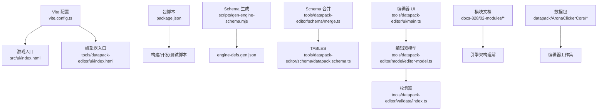
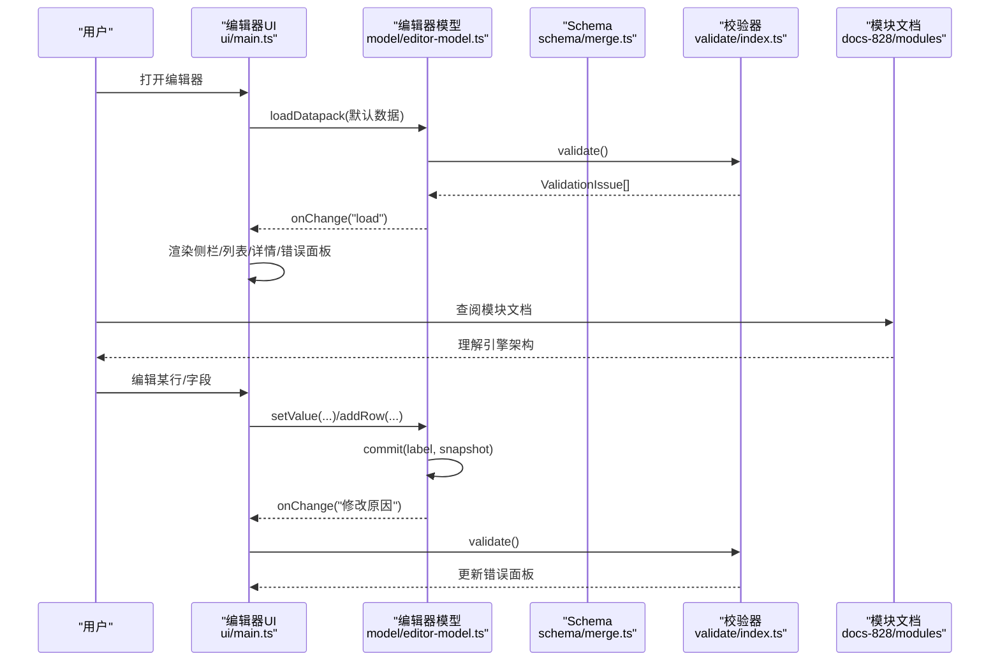
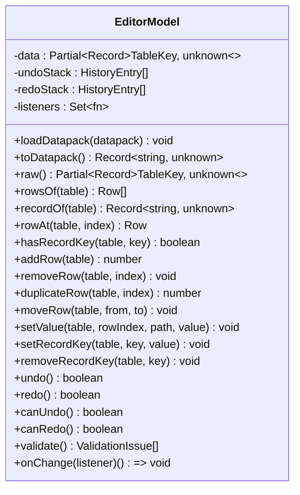
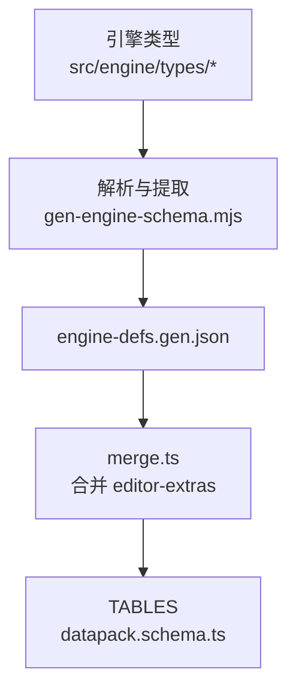
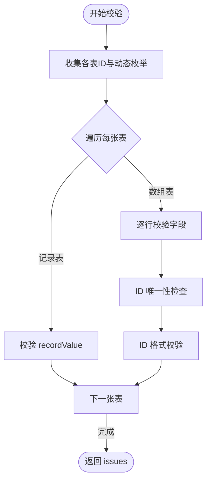
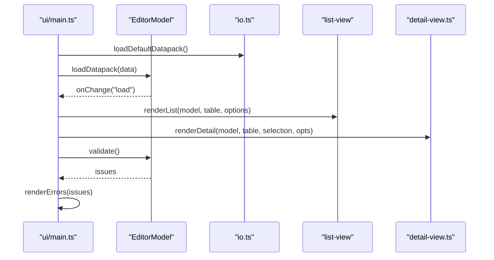
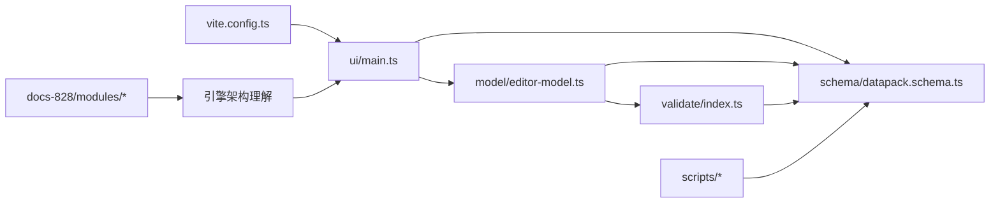

# 开发工具

<cite>
**本文引用的文件**
- [package.json](file://package.json)
- [vite.config.ts](file://vite.config.ts)
- [vitest.config.ts](file://vitest.config.ts)
- [scripts/gen-engine-schema.mjs](file://scripts/gen-engine-schema.mjs)
- [scripts/pack-arona-clicker-core.mjs](file://scripts/pack-arona-clicker-core.mjs)
- [tools/datapack-editor/model/editor-model.ts](file://tools/datapack-editor/model/editor-model.ts)
- [tools/datapack-editor/schema/datapack.schema.ts](file://tools/datapack-editor/schema/datapack.schema.ts)
- [tools/datapack-editor/schema/merge.ts](file://tools/datapack-editor/schema/merge.ts)
- [tools/datapack-editor/schema/editor-extras.ts](file://tools/datapack-editor/schema/editor-extras.ts)
- [tools/datapack-editor/ui/main.ts](file://tools/datapack-editor/ui/main.ts)
- [tools/datapack-editor/ui/io.ts](file://tools/datapack-editor/ui/io.ts)
- [tools/datapack-editor/ui/components/detail-view.ts](file://tools/datapack-editor/ui/components/detail-view.ts)
- [tools/datapack-editor/validate/index.ts](file://tools/datapack-editor/validate/index.ts)
- [tools/datapack-editor/model/editor-model.test.ts](file://tools/datapack-editor/model/editor-model.test.ts)
- [docs-828/02-modules/affector.md](file://docs-828/02-modules/affector.md)
- [docs-828/02-modules/core.md](file://docs-828/02-modules/core.md)
- [docs-828/02-modules/effect-trigger.md](file://docs-828/02-modules/effect-trigger.md)
- [docs-828/02-modules/extra.md](file://docs-828/02-modules/extra.md)
- [docs-828/02-modules/game-num.md](file://docs-828/02-modules/game-num.md)
- [docs-828/02-modules/pics.md](file://docs-828/02-modules/pics.md)
- [docs-828/02-modules/registry.md](file://docs-828/02-modules/registry.md)
- [docs-828/02-modules/stats.md](file://docs-828/02-modules/stats.md)
- [docs-828/02-modules/story.md](file://docs-828/02-modules/story.md)
- [docs-828/02-modules/visibility.md](file://docs-828/02-modules/visibility.md)
- [docs-828/02-modules/world.md](file://docs-828/02-modules/world.md)
</cite>

## 更新摘要
**变更内容**
- 新增 docs-828 模块文档集成：affector、core、effect-trigger、extra、game-num、pics、registry、stats、story、visibility、world 等核心模块的详细说明
- 增强开发工具理解：通过模块化文档展示引擎架构与数据包编辑器的关联关系
- 完善依赖关系分析：补充各模块间的交互关系和依赖方向
- 更新架构图表：反映新的模块化结构和数据流

## 目录
1. [简介](#简介)
2. [项目结构](#项目结构)
3. [核心组件](#核心组件)
4. [架构总览](#架构总览)
5. [详细组件分析](#详细组件分析)
6. [模块文档集成](#模块文档集成)
7. [依赖关系分析](#依赖关系分析)
8. [性能与可维护性](#性能与可维护性)
9. [故障排查指南](#故障排查指南)
10. [结论](#结论)
11. [附录：常用命令与工作流](#附录常用命令与工作流)

## 简介
本文件面向 ACProgram 的数据包编辑器（Datapack Editor）及相关开发工具，提供从使用到扩展的完整说明。内容覆盖：
- 可视化编辑界面、数据验证与实时预览
- 编辑器模型架构：数据绑定、变更跟踪、撤销重做机制
- Schema 生成工具的用法：类型定义生成、验证规则更新、文档同步
- 开发脚本：构建自动化、测试运行、打包部署流程
- **新增**：基于 docs-828 的模块化文档集成，深入理解引擎架构与开发工具的关联
- 最佳实践：代码规范、调试技巧、性能分析
- 配置选项与扩展方法

## 项目结构
本项目采用多入口应用（MPA）组织方式，通过 Vite 同时提供游戏运行时与编辑器两个前端入口；Schema 由引擎类型自动推导并合并本地编辑语义；校验器基于统一 Schema DSL 对数据包进行强约束检查；编辑器模型集中管理数据与历史。

**图表来源**
- [vite.config.ts:12-33](file://vite.config.ts#L12-L33)
- [package.json:6-13](file://package.json#L6-L13)
- [scripts/gen-engine-schema.mjs:18-21](file://scripts/gen-engine-schema.mjs#L18-L21)
- [tools/datapack-editor/schema/merge.ts:62-102](file://tools/datapack-editor/schema/merge.ts#L62-L102)
- [tools/datapack-editor/schema/datapack.schema.ts:12-19](file://tools/datapack-editor/schema/datapack.schema.ts#L12-L19)
- [tools/datapack-editor/ui/main.ts:17-20](file://tools/datapack-editor/ui/main.ts#L17-L20)
- [tools/datapack-editor/model/editor-model.ts:25-57](file://tools/datapack-editor/model/editor-model.ts#L25-L57)
- [tools/datapack-editor/validate/index.ts:334-390](file://tools/datapack-editor/validate/index.ts#L334-L390)

**章节来源**
- [vite.config.ts:12-33](file://vite.config.ts#L12-L33)
- [package.json:6-13](file://package.json#L6-L13)

## 核心组件
- 编辑器模型（EditorModel）：持有工作集数据，提供增删改查、路径写入、撤销重做、变更通知与校验入口。
- Schema 系统：从引擎类型自动生成字段定义，并与 editor-extras 合并为最终表结构 TABLES。
- 校验器（Validator）：基于 Schema 对 datapack 进行类型、必填、引用完整性、ID 格式等校验。
- UI 主程序：三栏布局（侧边导航、列表、详情），支持导入导出、校验结果高亮、撤销重做。
- 开发脚本：Schema 生成、数据包打包、构建与测试。
- **新增**：模块化文档体系，涵盖 affector、core、effect-trigger、extra、game-num、pics、registry、stats、story、visibility、world 等核心模块。

**章节来源**
- [tools/datapack-editor/model/editor-model.ts:25-241](file://tools/datapack-editor/model/editor-model.ts#L25-L241)
- [tools/datapack-editor/schema/datapack.schema.ts:12-19](file://tools/datapack-editor/schema/datapack.schema.ts#L12-L19)
- [tools/datapack-editor/schema/merge.ts:62-102](file://tools/datapack-editor/schema/merge.ts#L62-L102)
- [tools/datapack-editor/validate/index.ts:334-390](file://tools/datapack-editor/validate/index.ts#L334-L390)
- [tools/datapack-editor/ui/main.ts:17-255](file://tools/datapack-editor/ui/main.ts#L17-L255)

## 架构总览
编辑器采用"Schema 驱动 + 模型层 + UI"的分层架构：
- Schema 层：描述每张表的字段、类型、分组、联动与校验规则。
- 模型层：封装数据读写、历史快照、变更事件。
- UI 层：渲染列表与详情表单，调用模型执行操作，订阅变更刷新视图。
- 校验器：在加载、保存、手动触发时扫描全量数据，输出错误定位与跳转。
- **新增**：模块化文档体系提供引擎架构的深入理解，帮助开发者更好地使用编辑器工具。

**图表来源**
- [tools/datapack-editor/ui/main.ts:17-255](file://tools/datapack-editor/ui/main.ts#L17-L255)
- [tools/datapack-editor/model/editor-model.ts:34-57](file://tools/datapack-editor/model/editor-model.ts#L34-L57)
- [tools/datapack-editor/model/editor-model.ts:93-177](file://tools/datapack-editor/model/editor-model.ts#L93-L177)
- [tools/datapack-editor/validate/index.ts:334-390](file://tools/datapack-editor/validate/index.ts#L334-L390)
- [tools/datapack-editor/schema/merge.ts:62-102](file://tools/datapack-editor/schema/merge.ts#L62-L102)

## 详细组件分析

### 编辑器模型（EditorModel）
- 职责
  - 加载/导出 datapack，按表键映射数据
  - 提供 rowsOf/recordOf/rowAt 等只读访问
  - 提供 addRow/removeRow/duplicateRow/moveRow/setValue/setRecordKey/removeRecordKey 等变更方法
  - 所有变更通过 commit 产生历史快照，支持 undo/redo
  - 暴露 onChange 订阅，供 UI 响应式刷新
  - 聚合校验：validate() 委托校验器
- 关键设计
  - 不可变写入：setValue 克隆目标对象后替换，避免共享状态污染
  - 虚拟表 storyEntries：activeStories ∪ passiveStories 的只读视图，不落盘
  - divider 横条不参与数据行与导出
  - 历史限制 HISTORY_LIMIT=50，防止内存膨胀

**图表来源**
- [tools/datapack-editor/model/editor-model.ts:25-241](file://tools/datapack-editor/model/editor-model.ts#L25-L241)

**章节来源**
- [tools/datapack-editor/model/editor-model.ts:25-241](file://tools/datapack-editor/model/editor-model.ts#L25-L241)
- [tools/datapack-editor/model/editor-model.test.ts:25-143](file://tools/datapack-editor/model/editor-model.test.ts#L25-L143)

### Schema 系统与合并
- 生成阶段：从 src/engine/types/** 解析接口/类型/枚举，产出 defMap 与 defs，并写为 engine-defs.gen.json
- 合并阶段：将生成结果与 editor-extras 中的复杂编辑语义（tagged 联动、optionsFrom、divider、整表自定义等）合并为最终 TABLES
- 约定：修改引擎类型后必须运行 gen:schema；engine-schema.sync.test 用于防漂移

**图表来源**
- [scripts/gen-engine-schema.mjs:18-21](file://scripts/gen-engine-schema.mjs#L18-L21)
- [scripts/gen-engine-schema.mjs:208-267](file://scripts/gen-engine-schema.mjs#L208-L267)
- [tools/datapack-editor/schema/merge.ts:62-102](file://tools/datapack-editor/schema/merge.ts#L62-L102)
- [tools/datapack-editor/schema/datapack.schema.ts:12-19](file://tools/datapack-editor/schema/datapack.schema.ts#L12-L19)

**章节来源**
- [scripts/gen-engine-schema.mjs:208-267](file://scripts/gen-engine-schema.mjs#L208-L267)
- [tools/datapack-editor/schema/merge.ts:62-102](file://tools/datapack-editor/schema/merge.ts#L62-L102)
- [tools/datapack-editor/schema/editor-extras.ts:660-800](file://tools/datapack-editor/schema/editor-extras.ts#L660-L800)

### 校验器（Validator）
- 能力
  - 基础类型校验：string/int/float/bool/array/object/record
  - 联合类型校验：union/tagged（含 noTag 兼容）
  - 引用完整性：ref 指向的 ID 必须在目标表中存在
  - 动态枚举：optionsFrom 收集运行时值域
  - 唯一性与格式：同表 ID 唯一、三段式 ID 格式校验
  - 未知字段告警：非 schema 定义的字段以 warning 提示
- 输出：ValidationIssue[]，包含 table、rowIndex/key、path、severity、message

**图表来源**
- [tools/datapack-editor/validate/index.ts:334-390](file://tools/datapack-editor/validate/index.ts#L334-L390)
- [tools/datapack-editor/validate/index.ts:51-231](file://tools/datapack-editor/validate/index.ts#L51-L231)
- [tools/datapack-editor/validate/index.ts:297-327](file://tools/datapack-editor/validate/index.ts#L297-L327)

**章节来源**
- [tools/datapack-editor/validate/index.ts:51-231](file://tools/datapack-editor/validate/index.ts#L51-L231)
- [tools/datapack-editor/validate/index.ts:264-327](file://tools/datapack-editor/validate/index.ts#L264-L327)
- [tools/datapack-editor/validate/index.ts:334-390](file://tools/datapack-editor/validate/index.ts#L334-L390)

### UI 主程序与交互流程
- 三栏布局：侧边导航（TABLES）、列表（过滤/选择/新增）、详情（字段表单/操作）
- 工具栏：撤销/重做、校验、加载默认数据、导入/粘贴、复制当前表/全量、下载
- 错误面板：显示错误数量，点击条目跳转到对应行/记录并高亮
- 数据流：model.onChange → renderAll → 渲染列表/详情/错误面板

**图表来源**
- [tools/datapack-editor/ui/main.ts:17-255](file://tools/datapack-editor/ui/main.ts#L17-L255)
- [tools/datapack-editor/ui/io.ts:8-24](file://tools/datapack-editor/ui/io.ts#L8-L24)
- [tools/datapack-editor/ui/components/detail-view.ts:22-36](file://tools/datapack-editor/ui/components/detail-view.ts#L22-L36)

**章节来源**
- [tools/datapack-editor/ui/main.ts:17-255](file://tools/datapack-editor/ui/main.ts#L17-L255)
- [tools/datapack-editor/ui/io.ts:8-69](file://tools/datapack-editor/ui/io.ts#L8-L69)
- [tools/datapack-editor/ui/components/detail-view.ts:22-240](file://tools/datapack-editor/ui/components/detail-view.ts#L22-L240)

### 数据绑定与变更跟踪
- 数据绑定：UI 通过 model.rowsOf/recordOf 读取数据，通过 setValue/addRow 等方法写入
- 变更跟踪：commit 将变更前快照推入 undoStack，清空 redoStack，随后执行 mutator 并通知监听者
- 撤销重做：undo/redo 恢复 JSON 快照，保持 label 便于日志与调试
- 虚拟表：storyEntries 仅作为引用视图，不参与导出

**章节来源**
- [tools/datapack-editor/model/editor-model.ts:93-177](file://tools/datapack-editor/model/editor-model.ts#L93-L177)
- [tools/datapack-editor/model/editor-model.ts:194-218](file://tools/datapack-editor/model/editor-model.ts#L194-218)
- [tools/datapack-editor/model/editor-model.ts:61-73](file://tools/datapack-editor/model/editor-model.ts#L61-L73)

### 可视化编辑界面与实时预览
- 列表视图：支持过滤、选择、新增行/记录键、错误行高亮
- 详情视图：按 Schema 渲染字段表单，支持整行编辑、Extra 值编辑、复制 JSON、上移/下移/复制/删除
- 实时预览：每次变更触发 onChange，重新渲染列表/详情/错误面板，错误项可点击跳转并滚动高亮

**章节来源**
- [tools/datapack-editor/ui/main.ts:55-97](file://tools/datapack-editor/ui/main.ts#L55-L97)
- [tools/datapack-editor/ui/main.ts:101-148](file://tools/datapack-editor/ui/main.ts#L101-L148)
- [tools/datapack-editor/ui/components/detail-view.ts:38-133](file://tools/datapack-editor/ui/components/detail-view.ts#L38-L133)
- [tools/datapack-editor/ui/components/detail-view.ts:137-217](file://tools/datapack-editor/ui/components/detail-view.ts#L137-L217)

### Schema 生成工具用法
- 用途：从引擎类型生成 Schema 协议（defMap/defs），并输出到 tools/datapack-editor/schema/engine-defs.gen.json
- 用法：node scripts/gen-engine-schema.mjs --write
- 同步：修改引擎类型后需重新生成；editor-extras 负责补充复杂编辑语义；merge.ts 合并为 TABLES
- 文档同步：TSDoc/@label/@group 等注释会被提取为字段标签与分组信息

**章节来源**
- [scripts/gen-engine-schema.mjs:1-12](file://scripts/gen-engine-schema.mjs#L1-L12)
- [scripts/gen-engine-schema.mjs:208-267](file://scripts/gen-engine-schema.mjs#L208-L267)
- [tools/datapack-editor/schema/merge.ts:62-102](file://tools/datapack-editor/schema/merge.ts#L62-L102)

### 开发脚本与自动化
- 构建与开发
  - dev: 启动开发服务器（默认入口）
  - dev:game: 启动游戏入口
  - dev:editor: 启动编辑器入口
  - build: 构建产物至 web-dist
- 测试
  - test: 运行 vitest（包含 tests 与 tools 下的测试）
  - test:watch: 监听模式
- 其他
  - gen:schema: 生成 Schema
  - pack-arona-clicker-core.mjs: 将 datapack/AronaClickerCore/*.json 打包为 zip

**章节来源**
- [package.json:6-13](file://package.json#L6-L13)
- [scripts/pack-arona-clicker-core.mjs:1-53](file://scripts/pack-arona-clicker-core.mjs#L1-L53)
- [vitest.config.ts:1-8](file://vitest.config.ts#L1-L8)

## 模块文档集成

### Affector 持续效果模块
AffectorEngine 管理「挂载即持续生效」的效果实例——四条通道（激活沿 / perTick / flows / zoneModifiers），实例不落存档、靠 reconcileMounts() 对账。

**关键特性**
- 四通道语义：effects（一次性奖励）、perTickEffects（每帧维持）、flows（持续产出）、zoneModifiers（命名乘区）
- 生命周期管理：Latent→Active→Removed 状态转换
- 事件驱动：通过 GameNum 区表桥接信号

**章节来源**
- [docs-828/02-modules/affector.md:1-37](file://docs-828/02-modules/affector.md#L1-L37)

### Core 横切基础模块
src/engine/core/ 提供无领域逻辑的横切基础设施——事件总线、Tag 匹配、运行时主题、ID 工厂、开发日志。

**关键特性**
- 事件总线：全局事件广播通道，mutation 写状态后广播的通道
- Tag 匹配：按 id 前缀的纯语义标记匹配
- 主题运行时：临时演出层恒最高优先级管理
- 开发日志：循环 tick 记录，供调试面板消费

**章节来源**
- [docs-828/02-modules/core.md:1-35](file://docs-828/02-modules/core.md#L1-L35)

### Effect-Trigger 执行模块
src/engine/effect/ 是「事件驱动」的执行层——Effect 按 op 分发、Trigger 订阅事件跑「侦测→条件→效果」、演出类效果经请求事件转发。

**关键特性**
- EffectEngine：状态层落数据经 mutations，演出类效果发请求事件
- TriggerSystem：9 种事件侦测来源，once/maxRuns 语义
- EventDrivenReactor：分桶订阅模式基类

**章节来源**
- [docs-828/02-modules/effect-trigger.md:1-32](file://docs-828/02-modules/effect-trigger.md#L1-L32)

### Extra 附加数据模块
Extra 是类 NBT 的自由结构数据树，三层合并（全局 → per-Init → 数据包常量），供声明式读写。

**关键特性**
- 三层合并视图：全局层、per-Init 层、数据包常量层
- 统一读取入口：setExtraReader 注入 valueSystem/conditionSystem/mutations
- 路径访问：/ 分隔路径解析，严格校验

**章节来源**
- [docs-828/02-modules/extra.md:1-34](file://docs-828/02-modules/extra.md#L1-L34)

### Game-Num 数值系统模块
每资源一棵四级层级产出树，事件驱动增量失效；是生产结算的唯一数值真相。

**关键特性**
- 四级树公式：primitiveGain → initFull → areaFull → spotFull
- 事件驱动失效：resourceChanged 三路定向失效
- 区表真相：state.tagEffects/state.entityEffects 是唯一真相

**章节来源**
- [docs-828/02-modules/game-num.md:1-35](file://docs-828/02-modules/game-num.md#L1-L35)

### Pics 图片资产模块
图片用三段式索引 mod:type(pic):id 寻址；ImageStore 登记 zip 解出的图，resolvePicSrc 是消费端唯一解析入口。

**关键特性**
- 三段式索引：modName : typeName(pic) : idName
- 图片服务：PicService 子门面 urlOf/defOf/register
- CharaProfile：四层优先级解析，严格校验

**章节来源**
- [docs-828/02-modules/pics.md:1-34](file://docs-828/02-modules/pics.md#L1-L34)

### Registry 注册表模块
Registry 是数据包的编译态容器（表 + 关系索引 + 校验，恒只读）；def-factory/ 是各实体的链式构建器。

**关键特性**
- 构建一次、运行只读：只在 init(datapacks) 时构建
- 表驱动扩展：新增一张表 = 私有字段 + getter + tableSteps 一条 step
- 同 id 覆盖语义：后加载优先

**章节来源**
- [docs-828/02-modules/registry.md:1-32](file://docs-828/02-modules/registry.md#L1-L32)

### Stats 统计模块
StatsService 按 global / per-Init / 当前运行三层记账（随写入口同步记录）；TagStatService 维护按 tag 聚合的收集数反向索引。

**关键特性**
- 三层统计：globalStats/initStats/currentRunStats
- Tag 统计：7 种 TagStatKind 的反向索引
- 世界倾斜：worldTilt 定宽字符串标识

**章节来源**
- [docs-828/02-modules/stats.md:1-32](file://docs-828/02-modules/stats.md#L1-L32)

### Story 剧情模块
剧情 = 「触发入口（StoryEntry）→ 演出内容（StoryDef.talklets）」两实体；StoryService 持游标，主流程/跳转/重读/奖励各拆一模块。

**关键特性**
- 两实体分离：StoryEntryDef 与 StoryDef
- Talklet 三类：talk/narration/click
- 阅读记录双轨：storyLog 与 storyReadLogs

**章节来源**
- [docs-828/02-modules/story.md:1-47](file://docs-828/02-modules/story.md#L1-L47)

### Visibility 可见性模块
VisibilityEngine 事件驱动维护实体显隐布尔掩码；Reveal 是「信息可知程度」的 7 级阶梯，与可见性（是否存在）分离。

**关键特性**
- 两套阶梯：RevealStage（7 级）与 AccessStage（5 阶段）
- RevealTarget：existence/name/condition/utility/unlock
- 反向索引：id → 显隐

**章节来源**
- [docs-828/02-modules/visibility.md:1-35](file://docs-828/02-modules/visibility.md#L1-L35)

### World 世界结构模块
src/engine/game/ 门面层编排世界线生命周期、Spot/物品/强化操作、会话循环与存档编解码；装配逻辑在 wiring.ts（T1 外移）。

**关键特性**
- 世界结构三层：InitDef → AreaDef → SpotDef
- 门槛链：业务操作 = 门面只读判定 + mutations 写入
- 重置路径：三条重置路径 + 彻底重置

**章节来源**
- [docs-828/02-modules/world.md:1-65](file://docs-828/02-modules/world.md#L1-L65)

## 依赖关系分析
- UI 依赖模型与 Schema：main.ts 通过 EditorModel 与 TABLES 驱动渲染
- 模型依赖 Schema 与校验器：EditorModel 使用 TABLES 推断默认值与行为，validate 委托校验器
- 校验器依赖 Schema：validate/index.ts 通过 TABLES 遍历与校验
- 构建与脚本：vite.config.ts 提供多入口路由；package.json 编排脚本；vitest.config.ts 指定测试范围
- **新增**：模块文档与引擎架构的深度集成，提供完整的开发工具理解框架

**图表来源**
- [tools/datapack-editor/ui/main.ts:17-20](file://tools/datapack-editor/ui/main.ts#L17-L20)
- [tools/datapack-editor/model/editor-model.ts:8-10](file://tools/datapack-editor/model/editor-model.ts#L8-L10)
- [tools/datapack-editor/validate/index.ts:7-9](file://tools/datapack-editor/validate/index.ts#L7-L9)
- [vite.config.ts:12-33](file://vite.config.ts#L12-L33)
- [scripts/gen-engine-schema.mjs:18-21](file://scripts/gen-engine-schema.mjs#L18-L21)

**章节来源**
- [tools/datapack-editor/ui/main.ts:17-20](file://tools/datapack-editor/ui/main.ts#L17-L20)
- [tools/datapack-editor/model/editor-model.ts:8-10](file://tools/datapack-editor/model/editor-model.ts#L8-L10)
- [tools/datapack-editor/validate/index.ts:7-9](file://tools/datapack-editor/validate/index.ts#L7-L9)
- [vite.config.ts:12-33](file://vite.config.ts#L12-L33)

## 性能与可维护性
- 性能建议
  - 大表分页或虚拟滚动：当单表行数较大时，建议在列表层引入分页或虚拟滚动以减少 DOM 节点
  - 校验缓存：校验结果可按表/行索引缓存，仅在变更时增量计算
  - 历史快照大小控制：HISTORY_LIMIT 已限制为 50，如需更长历史可考虑压缩快照或分片存储
- 可维护性建议
  - Schema 与类型同步：修改引擎类型后务必运行 gen:schema，并通过 sync 测试保障一致性
  - 字段分组与标签：利用 @label/@group 提升可读性，减少硬编码文案
  - 单元测试覆盖：对模型与校验器增加边界用例（空表、非法类型、循环引用等）
  - **新增**：利用模块文档体系理解引擎架构，提高开发效率和问题定位能力

## 故障排查指南
- 常见问题
  - 新增行未持久化：确认表从未加载数据时需先初始化数组再 push（模型已处理）
  - 撤销重做无效：检查是否调用了 loadDatapack（会清空历史）
  - 校验报错无法定位：点击错误条目可自动跳转并高亮对应行/记录
  - 生成 Schema 失败：检查引擎类型是否存在或命名是否符合约定
- 定位步骤
  - 查看错误面板消息与路径，定位到具体表与字段
  - 使用复制 JSON 功能对比差异
  - 运行 npm test 与 npm run build 确保无编译与测试错误
  - **新增**：查阅相关模块文档理解引擎行为，辅助问题诊断

**章节来源**
- [tools/datapack-editor/ui/main.ts:101-148](file://tools/datapack-editor/ui/main.ts#L101-L148)
- [tools/datapack-editor/model/editor-model.ts:112-121](file://tools/datapack-editor/model/editor-model.ts#L112-L121)
- [tools/datapack-editor/model/editor-model.ts:194-218](file://tools/datapack-editor/model/editor-model.ts#L194-L218)

## 结论
ACProgram 的数据包编辑器以 Schema 驱动为核心，结合统一的编辑器模型与强校验器，提供了稳定可靠的可视化编辑体验。通过自动化的 Schema 生成与合并机制，保证了引擎类型与编辑界面的同步。配合完善的开发脚本与测试体系，开发者可以高效地进行内容创作与迭代。

**新增**：docs-828 模块文档体系的建立，为开发者提供了深入的引擎架构理解，进一步增强了开发工具的使用效率和准确性。通过模块化文档，开发者可以更好地理解各个子系统的工作原理，从而更有效地使用数据包编辑器进行内容创作。

## 附录：常用命令与工作流
- 开发
  - npm run dev: 启动开发服务器（默认入口）
  - npm run dev:editor: 启动编辑器
  - npm run dev:game: 启动游戏
- 构建与发布
  - npm run build: 构建产物至 web-dist
  - node scripts/pack-arona-clicker-core.mjs: 打包数据包为 zip
- 类型与 Schema
  - npm run gen:schema: 生成 Schema 并写入 engine-defs.gen.json
- 测试
  - npm test: 运行全部测试
  - npm run test:watch: 监听模式
- **新增**：模块文档查阅
  - 参考 docs-828/02-modules/* 了解各模块详细实现
  - 结合编辑器使用，深入理解引擎架构

**章节来源**
- [package.json:6-13](file://package.json#L6-L13)
- [scripts/pack-arona-clicker-core.mjs:1-53](file://scripts/pack-arona-clicker-core.mjs#L1-L53)
- [vitest.config.ts:1-8](file://vitest.config.ts#L1-L8)