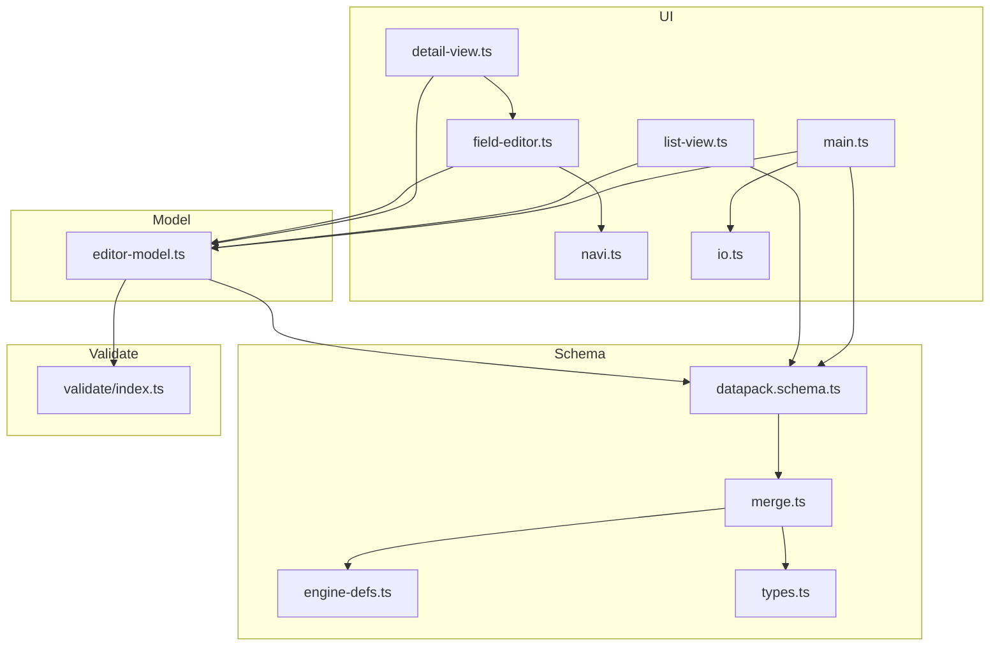
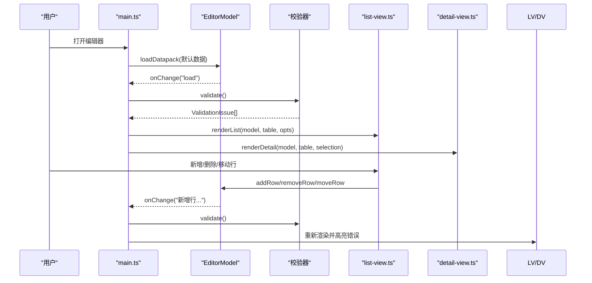
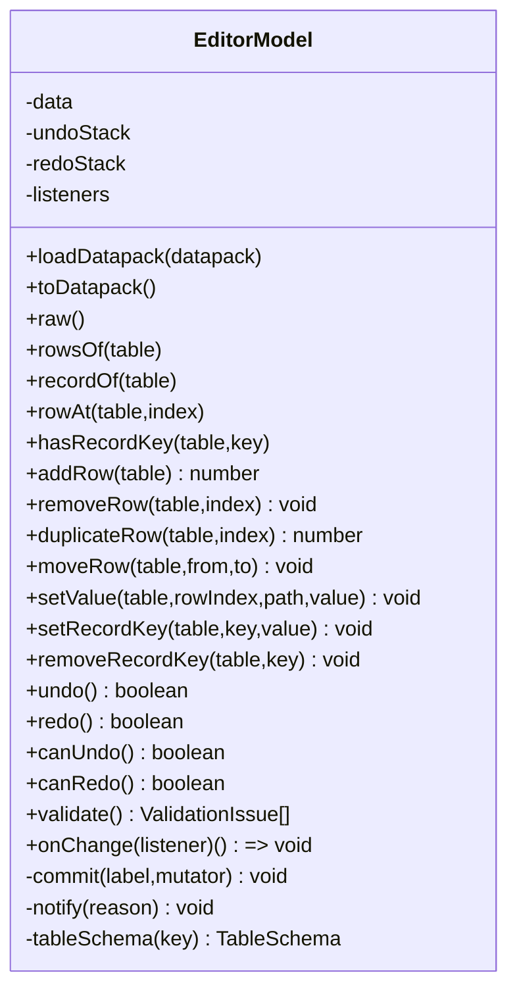
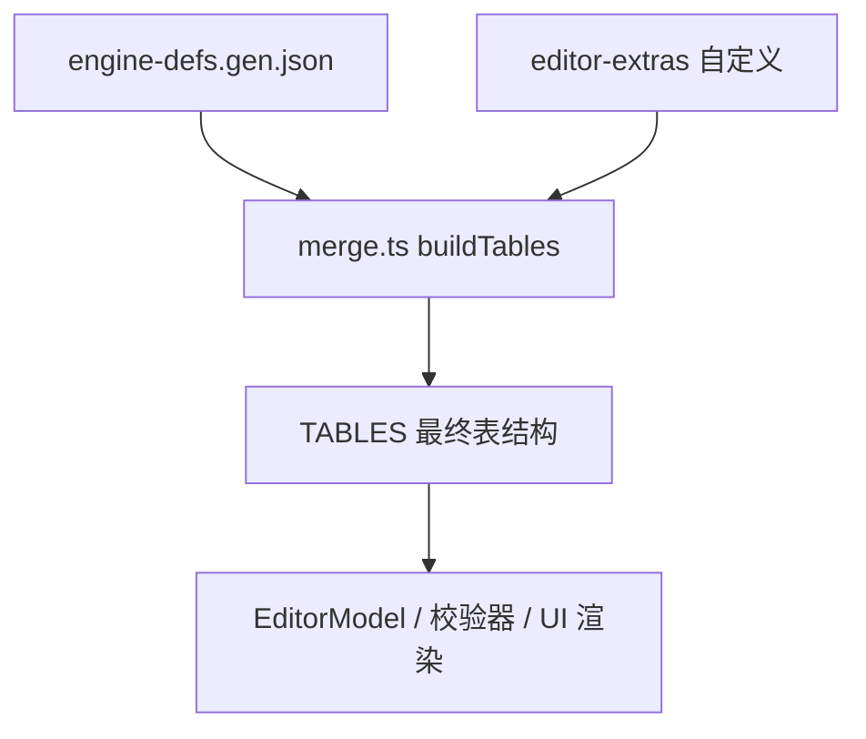
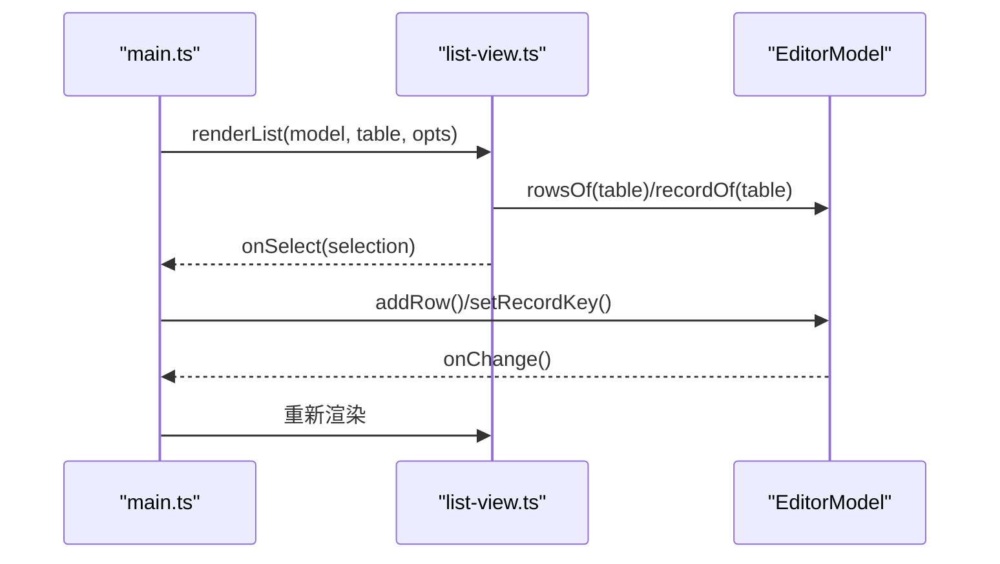
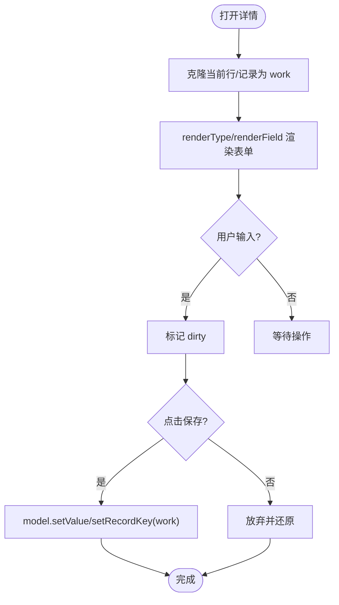
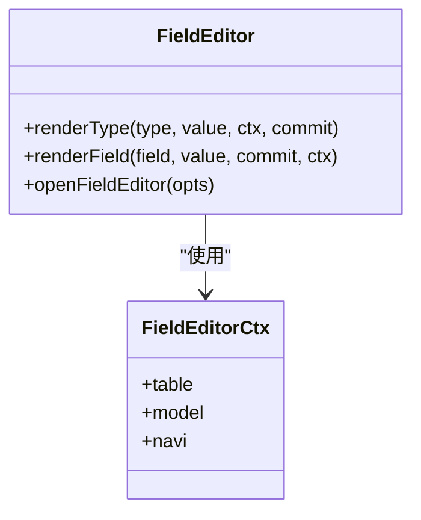
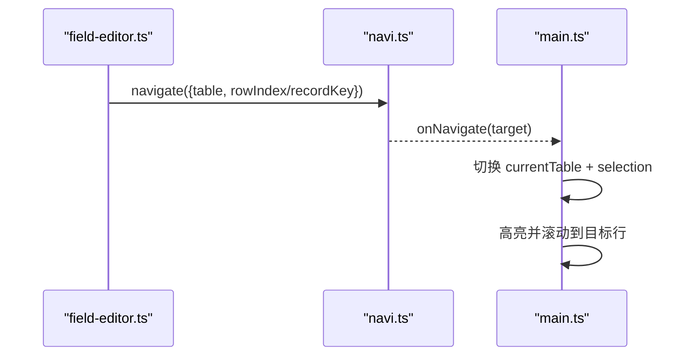
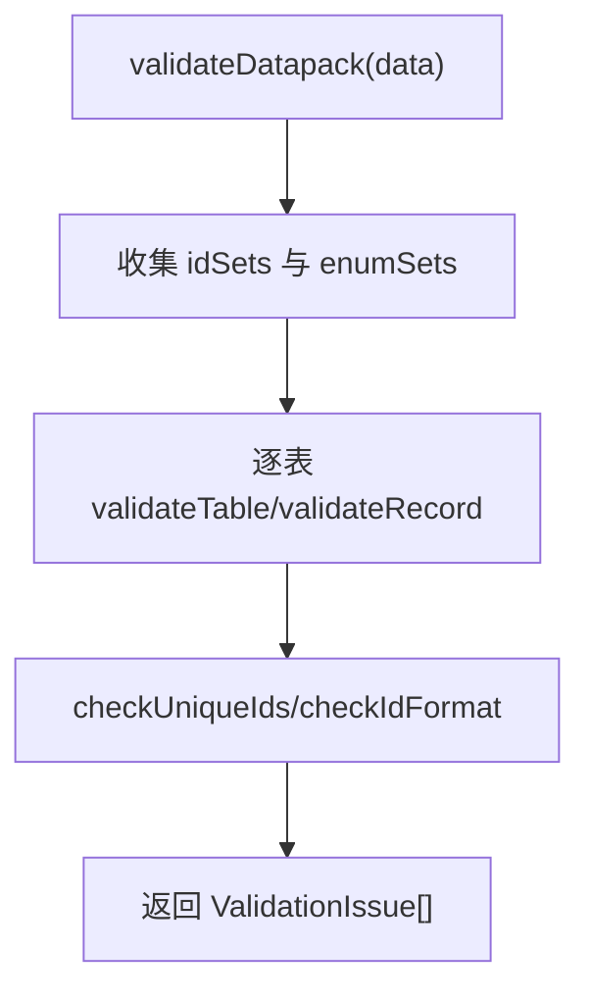
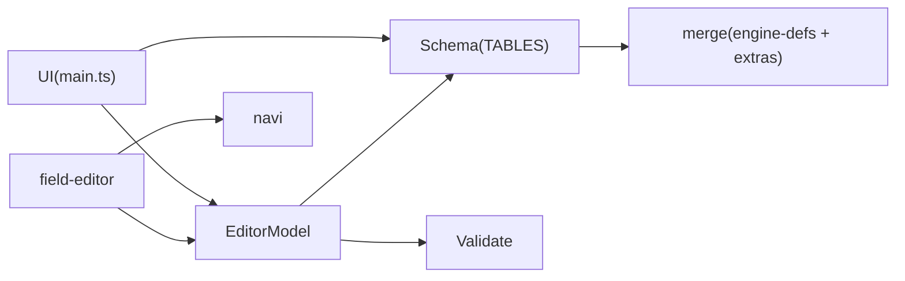

# 数据包编辑器

<cite>
**本文引用的文件**
- [editor-model.ts](file://tools/datapack-editor/model/editor-model.ts)
- [datapack.schema.ts](file://tools/datapack-editor/schema/datapack.schema.ts)
- [types.ts](file://tools/datapack-editor/schema/types.ts)
- [merge.ts](file://tools/datapack-editor/schema/merge.ts)
- [engine-defs.ts](file://tools/datapack-editor/schema/engine-defs.ts)
- [index.ts（校验）](file://tools/datapack-editor/validate/index.ts)
- [main.ts（UI入口）](file://tools/datapack-editor/ui/main.ts)
- [list-view.ts](file://tools/datapack-editor/ui/components/list-view.ts)
- [detail-view.ts](file://tools/datapack-editor/ui/components/detail-view.ts)
- [field-editor.ts](file://tools/datapack-editor/ui/components/field-editor.ts)
- [enum-options.ts](file://tools/datapack-editor/ui/components/enum-options.ts)
- [navi.ts](file://tools/datapack-editor/ui/navi.ts)
- [io.ts](file://tools/datapack-editor/ui/io.ts)
- [styles.css](file://tools/datapack-editor/ui/styles.css)
</cite>

## 目录
1. [简介](#简介)
2. [项目结构](#项目结构)
3. [核心组件](#核心组件)
4. [架构总览](#架构总览)
5. [详细组件分析](#详细组件分析)
6. [依赖关系分析](#依赖关系分析)
7. [性能与可用性](#性能与可用性)
8. [故障排查指南](#故障排查指南)
9. [结论](#结论)
10. [附录：常用工作流与最佳实践](#附录常用工作流与最佳实践)

## 简介
本文件为 ACProgram 的“数据包编辑器”使用与实现文档。该编辑器是一个 Schema 驱动的可视化数据表编辑工具，支持对多张数据表进行增删改查、实时预览与校验、撤销重做、导入导出、以及跨表引用跳转等能力。其核心由 EditorModel 数据模型、Schema 驱动的类型系统、字段级表单渲染器、列表/详情视图、导航系统与校验器组成，界面采用三栏布局（侧栏表选择 → 中间列表 → 右侧详情）。

## 项目结构
编辑器位于 tools/datapack-editor 下，按职责划分为 model、schema、ui、validate 四个层次：
- model：EditorModel 负责数据加载、变更、历史快照、订阅通知。
- schema：定义 13 张表的元数据与字段类型，并合并引擎生成定义与编辑器扩展。
- ui：主入口、列表视图、详情视图、字段编辑器、导航、IO 导入导出、样式。
- validate：基于 Schema 的全量校验器，输出错误与警告。

图表来源
- [main.ts:1-255](file://tools/datapack-editor/ui/main.ts#L1-L255)
- [editor-model.ts:1-278](file://tools/datapack-editor/model/editor-model.ts#L1-L278)
- [datapack.schema.ts:1-20](file://tools/datapack-editor/schema/datapack.schema.ts#L1-L20)
- [merge.ts:1-103](file://tools/datapack-editor/schema/merge.ts#L1-L103)
- [engine-defs.ts:1-70](file://tools/datapack-editor/schema/engine-defs.ts#L1-L70)
- [types.ts:1-131](file://tools/datapack-editor/schema/types.ts#L1-L131)
- [index.ts（校验）:1-393](file://tools/datapack-editor/validate/index.ts#L1-L393)

章节来源
- [main.ts:1-255](file://tools/datapack-editor/ui/main.ts#L1-L255)
- [editor-model.ts:1-278](file://tools/datapack-editor/model/editor-model.ts#L1-L278)
- [datapack.schema.ts:1-20](file://tools/datapack-editor/schema/datapack.schema.ts#L1-L20)
- [merge.ts:1-103](file://tools/datapack-editor/schema/merge.ts#L1-L103)
- [engine-defs.ts:1-70](file://tools/datapack-editor/schema/engine-defs.ts#L1-L70)
- [types.ts:1-131](file://tools/datapack-editor/schema/types.ts#L1-L131)
- [index.ts（校验）:1-393](file://tools/datapack-editor/validate/index.ts#L1-L393)

## 核心组件
- EditorModel：统一的数据访问与变更入口，提供 addRow/removeRow/duplicateRow/moveRow/setValue/setRecordKey/removeRecordKey，所有变更通过 commit 写入历史快照，支持 undo/redo；提供 rowsOf/recordOf 读取接口；onChange 事件驱动 UI 刷新；validate 调用校验器。
- Schema 层：TABLES 暴露 13 张表的结构与字段定义；merge 将引擎生成的类型与编辑器扩展合并；types 定义 FieldDef/FieldType/TableSchema 等 DSL。
- UI 层：main.ts 组装三栏界面；list-view 展示 ID/名称列表与过滤；detail-view 展示完整行或 record 值编辑；field-editor 递归渲染复杂字段（object/array/union/tagged/ref/extra 等）；navi 提供跨表引用跳转；io 提供导入导出。
- Validate：根据 Schema 逐字段校验类型、必填、枚举范围、ref 引用存在性、ID 唯一性与格式，输出 ValidationIssue 供 UI 高亮与定位。

章节来源
- [editor-model.ts:1-278](file://tools/datapack-editor/model/editor-model.ts#L1-L278)
- [datapack.schema.ts:1-20](file://tools/datapack-editor/schema/datapack.schema.ts#L1-L20)
- [types.ts:1-131](file://tools/datapack-editor/schema/types.ts#L1-L131)
- [merge.ts:1-103](file://tools/datapack-editor/schema/merge.ts#L1-L103)
- [main.ts:1-255](file://tools/datapack-editor/ui/main.ts#L1-L255)
- [list-view.ts:1-153](file://tools/datapack-editor/ui/components/list-view.ts#L1-L153)
- [detail-view.ts:1-240](file://tools/datapack-editor/ui/components/detail-view.ts#L1-L240)
- [field-editor.ts:1-893](file://tools/datapack-editor/ui/components/field-editor.ts#L1-L893)
- [navi.ts:1-138](file://tools/datapack-editor/ui/navi.ts#L1-L138)
- [io.ts:1-69](file://tools/datapack-editor/ui/io.ts#L1-L69)
- [index.ts（校验）:1-393](file://tools/datapack-editor/validate/index.ts#L1-L393)

## 架构总览
编辑器以“Schema 驱动 + 事件订阅”的方式组织：
- 数据源：默认 datapack 分片 JSON 在启动时合并加载。
- 数据模型：EditorModel 持有当前数据，所有变更产生历史快照。
- 视图层：main.ts 监听 onChange 触发全量重渲染；列表与详情分别渲染。
- 字段编辑：field-editor 根据 FieldType 动态生成控件，支持弹层子编辑。
- 导航：ref/optionsFrom 字段可跳转到目标行，NaviService 广播事件。
- 校验：validate 遍历所有表，收集错误并在 UI 右下角面板展示，点击可定位。

图表来源
- [main.ts:1-255](file://tools/datapack-editor/ui/main.ts#L1-L255)
- [editor-model.ts:1-278](file://tools/datapack-editor/model/editor-model.ts#L1-L278)
- [index.ts（校验）:1-393](file://tools/datapack-editor/validate/index.ts#L1-L393)
- [list-view.ts:1-153](file://tools/datapack-editor/ui/components/list-view.ts#L1-L153)
- [detail-view.ts:1-240](file://tools/datapack-editor/ui/components/detail-view.ts#L1-L240)

## 详细组件分析

### EditorModel 架构与数据绑定
- 数据持有：data 为 Partial<Record<TableKey, unknown>>，支持 array 表与 record 表两种形态。
- 变更追踪：commit(label, mutator) 在变更前压入快照到 undoStack，清空 redoStack，执行变更后 notify 订阅者。
- 路径写入：setValue 支持整行替换或沿 EditPath 设置嵌套值；record 表通过 setRecordKey/removeRecordKey 管理键值。
- 虚拟表：storyEntries 为 activeStories ∪ passiveStories 的只读视图，不落盘。
- 撤销重做：undo/redo 基于 JSON 快照恢复 data，并记录反向操作。
- 校验集成：validate 调用 validateDatapack 返回全部问题。

图表来源
- [editor-model.ts:1-278](file://tools/datapack-editor/model/editor-model.ts#L1-L278)

章节来源
- [editor-model.ts:1-278](file://tools/datapack-editor/model/editor-model.ts#L1-L278)

### Schema 驱动的数据模型
- 表定义：TABLES 由 merge.buildTables 生成，覆盖 engine 生成定义与 editor-extras 的编辑语义（如 tagged、divider、optionsFrom、recordValue 等）。
- 类型系统：FieldDef/FieldType 描述标量、对象、数组、联合、判别对象联合、引用、额外自由树等。
- 协议解耦：engine-defs.ts 仅消费生成产物，不直接依赖游戏代码。

图表来源
- [merge.ts:1-103](file://tools/datapack-editor/schema/merge.ts#L1-L103)
- [engine-defs.ts:1-70](file://tools/datapack-editor/schema/engine-defs.ts#L1-L70)
- [datapack.schema.ts:1-20](file://tools/datapack-editor/schema/datapack.schema.ts#L1-L20)
- [types.ts:1-131](file://tools/datapack-editor/schema/types.ts#L1-L131)

章节来源
- [datapack.schema.ts:1-20](file://tools/datapack-editor/schema/datapack.schema.ts#L1-L20)
- [merge.ts:1-103](file://tools/datapack-editor/schema/merge.ts#L1-L103)
- [engine-defs.ts:1-70](file://tools/datapack-editor/schema/engine-defs.ts#L1-L70)
- [types.ts:1-131](file://tools/datapack-editor/schema/types.ts#L1-L131)

### 列表视图（中间栏）
- 功能：显示当前表的所有条目（array 表按 idField+摘要；record 表按 key），支持过滤、新增行/键、选中高亮、错误标记。
- 交互：onFilter/onSelect/onAddRow/onAddRecordKey 回调由 main.ts 注入，联动 EditorModel 与详情视图。
- 摘要：rowSummary 优先 name/label/displayName，否则取首个字符串字段。

图表来源
- [list-view.ts:1-153](file://tools/datapack-editor/ui/components/list-view.ts#L1-L153)
- [main.ts:1-255](file://tools/datapack-editor/ui/main.ts#L1-L255)
- [editor-model.ts:1-278](file://tools/datapack-editor/model/editor-model.ts#L1-L278)

章节来源
- [list-view.ts:1-153](file://tools/datapack-editor/ui/components/list-view.ts#L1-L153)
- [main.ts:1-255](file://tools/datapack-editor/ui/main.ts#L1-L255)

### 详情视图（右侧面板）
- 功能：展示选中行的完整字段表单（object 字段递归渲染），支持复制 JSON、上移/下移、复制行、删除行；record 表支持键值编辑与删除。
- 本地工作对象：编辑期间维护 work 副本，保存时一次性提交至 EditorModel.setValue/setRecordKey，避免频繁重渲染导致输入失焦。
- 状态提示：未保存更改时按钮高亮并提示。

图表来源
- [detail-view.ts:1-240](file://tools/datapack-editor/ui/components/detail-view.ts#L1-L240)
- [field-editor.ts:1-893](file://tools/datapack-editor/ui/components/field-editor.ts#L1-L893)
- [editor-model.ts:1-278](file://tools/datapack-editor/model/editor-model.ts#L1-L278)

章节来源
- [detail-view.ts:1-240](file://tools/datapack-editor/ui/components/detail-view.ts#L1-L240)

### 字段编辑器（复杂类型与弹层）
- 支持类型：string/int/float/flexible、bool、enum/multiEnum、ref、object、array、record、union、tagged、extra、divider。
- 弹层子编辑：openFieldEditor 针对复杂字段弹出模态框，内部维护 work 并一次性提交。
- 引用导航：ref 字段提供下拉补全、键盘导航、一键跳转目标行；optionsFrom 支持跳转到来源表匹配行。
- 折叠数组：collapsible 模式支持展开/收起与摘要显示。

图表来源
- [field-editor.ts:1-893](file://tools/datapack-editor/ui/components/field-editor.ts#L1-L893)
- [navi.ts:1-138](file://tools/datapack-editor/ui/navi.ts#L1-L138)

章节来源
- [field-editor.ts:1-893](file://tools/datapack-editor/ui/components/field-editor.ts#L1-L893)
- [navi.ts:1-138](file://tools/datapack-editor/ui/navi.ts#L1-L138)
- [enum-options.ts:1-24](file://tools/datapack-editor/ui/components/enum-options.ts#L1-L24)

### 导航系统（跨表引用跳转）
- NaviService：全局事件总线，navigate 广播目标，onNavigate 订阅执行切表与高亮。
- 解析：resolveRef 将 ref 值解析为目标行；resolveOptionsFrom 将 optionsFrom 值解析为来源行。
- 候选：collectRefOptions 收集目标表可引用项（id + 可读名），用于下拉与显示文本。

图表来源
- [navi.ts:1-138](file://tools/datapack-editor/ui/navi.ts#L1-L138)
- [main.ts:1-255](file://tools/datapack-editor/ui/main.ts#L1-L255)
- [field-editor.ts:1-893](file://tools/datapack-editor/ui/components/field-editor.ts#L1-L893)

章节来源
- [navi.ts:1-138](file://tools/datapack-editor/ui/navi.ts#L1-L138)
- [main.ts:1-255](file://tools/datapack-editor/ui/main.ts#L1-L255)

### 校验与错误处理
- 规则：类型检查、必填检查、枚举范围、ref 引用存在性、ID 唯一性、三段式 ID 格式、未知字段告警。
- 上下文：第一轮收集各表 id 集合与动态枚举选项；第二轮逐表校验。
- UI 集成：错误面板列出前 200 条错误，点击可定位到对应表与行/键。

图表来源
- [index.ts（校验）:1-393](file://tools/datapack-editor/validate/index.ts#L1-L393)
- [main.ts:1-255](file://tools/datapack-editor/ui/main.ts#L1-L255)

章节来源
- [index.ts（校验）:1-393](file://tools/datapack-editor/validate/index.ts#L1-L393)
- [main.ts:1-255](file://tools/datapack-editor/ui/main.ts#L1-L255)

### 导入导出与默认数据
- 默认数据：loadDefaultDatapack 批量加载 datapack/AronaClickerCore/*.json 并合并数组表。
- 下载：downloadDatapack 生成 Blob 并触发下载。
- 复制：copyDatapack/copyTableJson 复制 JSON 到剪贴板。
- 导入：fileInputImport/pasteImport 从文件或剪贴板导入 JSON。

章节来源
- [io.ts:1-69](file://tools/datapack-editor/ui/io.ts#L1-L69)
- [main.ts:1-255](file://tools/datapack-editor/ui/main.ts#L1-L255)

## 依赖关系分析
- UI 层依赖 EditorModel 与 Schema；EditorModel 依赖 Schema 与 Validate；Schema 层依赖引擎生成协议与编辑器扩展；Validate 依赖 Schema 与 Extra 校验。
- 耦合点：
  - EditorModel 与 Schema：通过 TABLES 获取字段定义与表形态。
  - field-editor 与 navi：ref/optionsFrom 需要导航能力。
  - main.ts 与 io：导入导出与默认数据加载。
- 潜在循环：无直接循环依赖，模块边界清晰。

图表来源
- [main.ts:1-255](file://tools/datapack-editor/ui/main.ts#L1-L255)
- [editor-model.ts:1-278](file://tools/datapack-editor/model/editor-model.ts#L1-L278)
- [datapack.schema.ts:1-20](file://tools/datapack-editor/schema/datapack.schema.ts#L1-L20)
- [merge.ts:1-103](file://tools/datapack-editor/schema/merge.ts#L1-L103)
- [field-editor.ts:1-893](file://tools/datapack-editor/ui/components/field-editor.ts#L1-L893)
- [navi.ts:1-138](file://tools/datapack-editor/ui/navi.ts#L1-L138)
- [index.ts（校验）:1-393](file://tools/datapack-editor/validate/index.ts#L1-L393)

章节来源
- [main.ts:1-255](file://tools/datapack-editor/ui/main.ts#L1-L255)
- [editor-model.ts:1-278](file://tools/datapack-editor/model/editor-model.ts#L1-L278)
- [datapack.schema.ts:1-20](file://tools/datapack-editor/schema/datapack.schema.ts#L1-L20)
- [merge.ts:1-103](file://tools/datapack-editor/schema/merge.ts#L1-L103)
- [field-editor.ts:1-893](file://tools/datapack-editor/ui/components/field-editor.ts#L1-L893)
- [navi.ts:1-138](file://tools/datapack-editor/ui/navi.ts#L1-L138)
- [index.ts（校验）:1-393](file://tools/datapack-editor/validate/index.ts#L1-L393)

## 性能与可用性
- 变更批量化：setValue 支持路径写入，减少多次 DOM 更新；详情编辑使用本地 work 对象，保存时一次性提交。
- 历史限制：undoStack 上限 50 条，避免内存增长。
- 列表优化：过滤时尽量复用现有输入框，避免失焦；错误高亮仅影响当前表。
- 大表渲染：ref 下拉初始展示有限候选，输入后过滤；数组支持 collapsible 折叠以减少渲染压力。
- 建议：
  - 对超大表启用分页或虚拟滚动（需扩展 list-view）。
  - 对复杂 object/array 增加懒加载与缓存。
  - 校验结果可增量计算，仅在变更表触发。

[本节为通用指导，无需特定文件来源]

## 故障排查指南
- 无法导入 JSON：检查文件格式与权限；pasteImport 失败会弹窗提示。
- 校验报错：查看右下角错误面板，点击条目可定位到具体行/键；常见错误包括类型不符、必填缺失、枚举越界、引用不存在、ID 重复或格式错误。
- 撤销/重做无效：确认是否触发了新变更（redo 栈会被清空）；历史上限为 50。
- 跳转失败：ref 或 optionsFrom 目标不存在时，导航按钮会变为红色提示；检查目标表是否存在对应 id/key。
- 字段编辑异常：extra 字段为 JSON 文本，语法错误会标红；union/tagged 需确保判别字段正确。

章节来源
- [io.ts:1-69](file://tools/datapack-editor/ui/io.ts#L1-L69)
- [index.ts（校验）:1-393](file://tools/datapack-editor/validate/index.ts#L1-L393)
- [main.ts:1-255](file://tools/datapack-editor/ui/main.ts#L1-L255)
- [field-editor.ts:1-893](file://tools/datapack-editor/ui/components/field-editor.ts#L1-L893)
- [navi.ts:1-138](file://tools/datapack-editor/ui/navi.ts#L1-L138)

## 结论
该编辑器通过 Schema 驱动实现了高度可配置的可视化数据表编辑体验，结合 EditorModel 的变更追踪与撤销重做、字段级表单渲染、跨表引用导航与强校验机制，覆盖了数据包编辑的核心需求。界面简洁直观，适合非技术用户快速上手；同时为扩展开发提供了清晰的模块边界与类型系统。

[本节为总结，无需特定文件来源]

## 附录：常用工作流与最佳实践
- 新建条目：在列表栏点击“+ 新增”，填写必填字段，保存后自动进入详情继续编辑。
- 批量操作：利用列表过滤快速定位，配合复制/删除/移动行提升效率；必要时先复制模板再修改。
- 数据导入导出：使用“导入文件/粘贴导入”加载外部数据；编辑完成后“下载”或“复制全量”备份。
- 错误处理：每次变更后点击“校验”，根据错误面板逐一修复；对 extra 字段注意 JSON 语法。
- 配置与扩展：
  - 表结构与字段：通过 merge.ts 与 editor-extras 调整字段类型、分组、必填、引用与枚举来源。
  - 校验规则：在 validate/index.ts 中扩展规则（如业务约束）。
  - UI 行为：在 main.ts 与 components 中扩展工具栏按钮与交互逻辑。
  - 样式主题：styles.css 提供变量与类名，便于定制外观。

[本节为通用指导，无需特定文件来源]