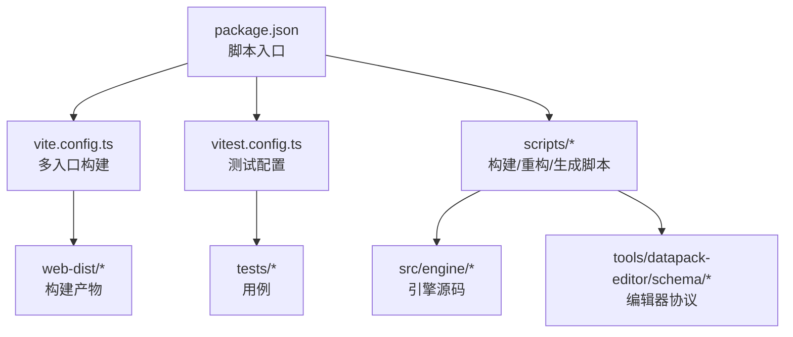
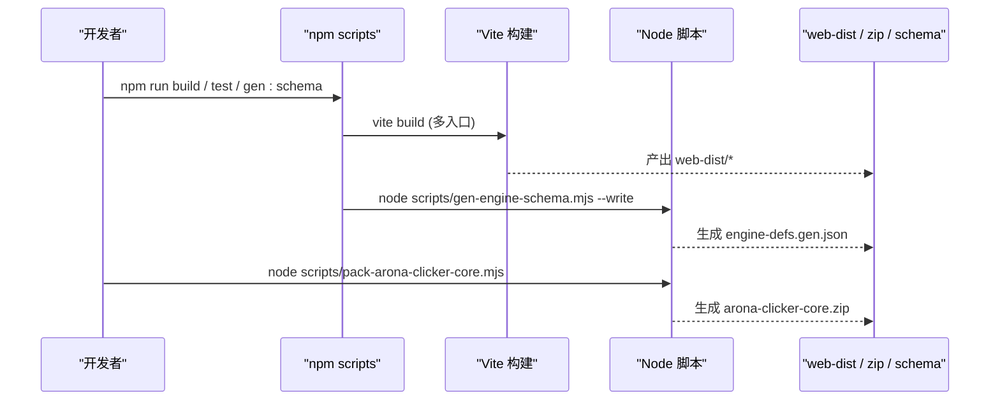
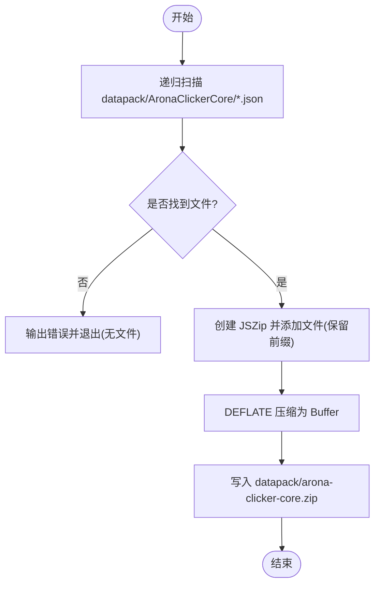
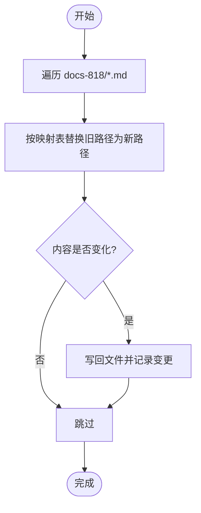
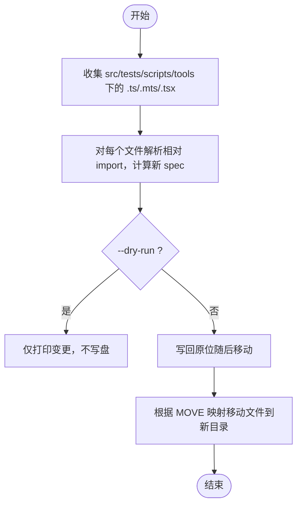
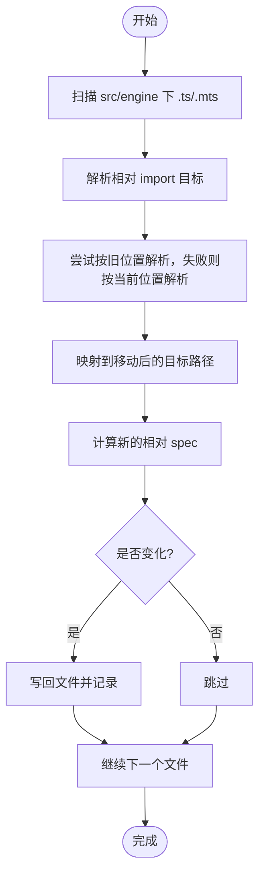
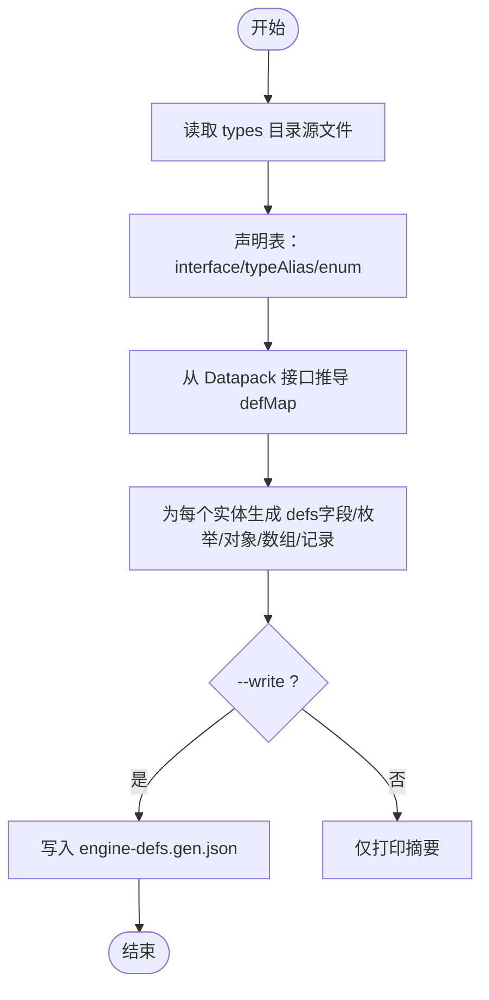
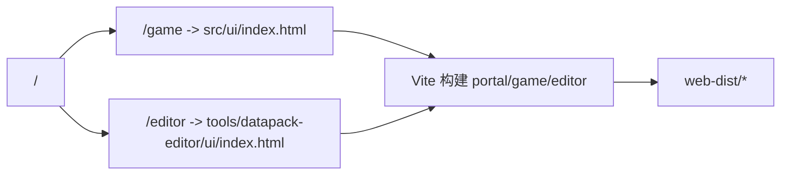
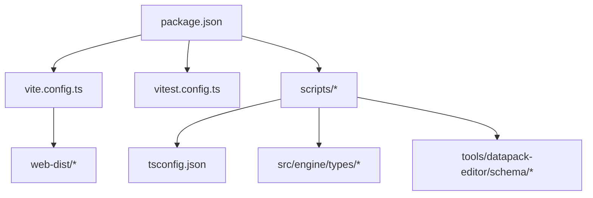

# 构建脚本

<cite>
**本文引用的文件**
- [scripts/pack-arona-clicker-core.mjs](file://scripts/pack-arona-clicker-core.mjs)
- [scripts/_fix-docs-engine-paths.mjs](file://scripts/_fix-docs-engine-paths.mjs)
- [scripts/_fix-engine-imports.mjs](file://scripts/_fix-engine-imports.mjs)
- [scripts/_refactor-move-engine.mjs](file://scripts/_refactor-move-engine.mjs)
- [scripts/gen-engine-schema.mjs](file://scripts/gen-engine-schema.mjs)
- [vite.config.ts](file://vite.config.ts)
- [vitest.config.ts](file://vitest.config.ts)
- [package.json](file://package.json)
- [tsconfig.json](file://tsconfig.json)
</cite>

## 目录
1. [简介](#简介)
2. [项目结构](#项目结构)
3. [核心组件](#核心组件)
4. [架构总览](#架构总览)
5. [详细组件分析](#详细组件分析)
6. [依赖关系分析](#依赖关系分析)
7. [性能与优化建议](#性能与优化建议)
8. [故障排查指南](#故障排查指南)
9. [结论](#结论)
10. [附录：常用命令与工作流](#附录：常用命令与工作流)

## 简介
本文件为 ACProgram 的构建脚本提供系统化使用文档，覆盖以下目标：
- 数据包打包：将游戏内容（JSON 分片）打包为可部署的 zip。
- 文档路径修复：自动更新文档中的引擎路径，保持文档与代码同步。
- 引擎重构脚本：实现代码结构迁移、模块重组与兼容性处理。
- Vite 构建配置：生产环境构建、多入口、资源压缩与产物隔离。
- 开发工作流自动化：热重载、测试运行、Schema 生成与发布流程。
- 脚本参数与扩展：说明各脚本的参数、行为与如何扩展。

## 项目结构
本项目采用“源码 + 工具脚本 + 构建配置”的分层组织：
- src/engine：引擎核心逻辑（已按子系统拆分）。
- scripts：Node.js 构建/重构/生成类脚本。
- vite.config.ts：Vite 多入口构建与预览路由。
- vitest.config.ts：单元测试配置。
- package.json：统一脚本入口（dev/build/test/schema 等）。
- tsconfig.json：TypeScript 编译选项与包含范围。

图表来源
- [package.json:6-14](file://package.json#L6-L14)
- [vite.config.ts:36-58](file://vite.config.ts#L36-L58)
- [vitest.config.ts:3-8](file://vitest.config.ts#L3-L8)

章节来源
- [package.json:6-14](file://package.json#L6-L14)
- [vite.config.ts:36-58](file://vite.config.ts#L36-L58)
- [vitest.config.ts:3-8](file://vitest.config.ts#L3-L8)

## 核心组件
本节概述所有构建相关脚本的职责与交互关系：
- 数据包打包脚本：读取 datapack/AronaClickerCore/*.json，输出 arona-clicker-core.zip。
- 文档路径修复脚本：批量替换 docs 中旧引擎路径为新子目录路径。
- 引擎重构脚本：移动顶层文件到子系统目录，重写 import，支持 dry-run/apply/detail。
- 导入修正脚本：在中间态下修正相对 import 路径，确保重构后仍可编译。
- Schema 生成脚本：从 src/engine/types 解析类型，生成 tools/datapack-editor/schema/engine-defs.gen.json。
- Vite 构建：多入口（portal/game/editor），输出 web-dist，并内置 MPA 路由中间件。
- Vitest 测试：扫描 tests 与 tools 下的测试文件，node 环境运行。

章节来源
- [scripts/pack-arona-clicker-core.mjs:1-53](file://scripts/pack-arona-clicker-core.mjs#L1-L53)
- [scripts/_fix-docs-engine-paths.mjs:1-86](file://scripts/_fix-docs-engine-paths.mjs#L1-L86)
- [scripts/_refactor-move-engine.mjs:1-175](file://scripts/_refactor-move-engine.mjs#L1-L175)
- [scripts/_fix-engine-imports.mjs:1-106](file://scripts/_fix-engine-imports.mjs#L1-L106)
- [scripts/gen-engine-schema.mjs:1-285](file://scripts/gen-engine-schema.mjs#L1-L285)
- [vite.config.ts:12-58](file://vite.config.ts#L12-L58)
- [vitest.config.ts:3-8](file://vitest.config.ts#L3-L8)

## 架构总览
构建系统由“脚本层 + 构建层 + 配置层”组成：
- 脚本层：Node 脚本负责数据打包、文档修复、代码重构、Schema 生成。
- 构建层：Vite 负责多入口构建与预览；Vitest 负责测试。
- 配置层：package.json 暴露统一命令；tsconfig 控制 TS 编译；vite/vitest 配置具体行为。

图表来源
- [package.json:6-14](file://package.json#L6-L14)
- [vite.config.ts:45-56](file://vite.config.ts#L45-L56)
- [scripts/gen-engine-schema.mjs:269-284](file://scripts/gen-engine-schema.mjs#L269-L284)
- [scripts/pack-arona-clicker-core.mjs:38-52](file://scripts/pack-arona-clicker-core.mjs#L38-L52)

## 详细组件分析

### 数据包打包脚本：pack-arona-clicker-core.mjs
功能
- 递归收集 datapack/AronaClickerCore 目录下所有 .json 文件。
- 以 AronaClickerCore/ 前缀写入 zip，保持与示例一致的目录结构。
- 使用 DEFLATE 压缩，输出到 datapack/arona-clicker-core.zip。

关键流程

图表来源
- [scripts/pack-arona-clicker-core.mjs:17-52](file://scripts/pack-arona-clicker-core.mjs#L17-L52)

使用方式
- 直接执行：node scripts/pack-arona-clicker-core.mjs
- 集成到 CI：在发布包之前调用该脚本生成 zip。

注意事项
- 若未找到任何 JSON 文件会报错退出，便于快速发现数据缺失。
- 输出路径固定，如需自定义可通过修改脚本常量或增加参数扩展。

章节来源
- [scripts/pack-arona-clicker-core.mjs:1-53](file://scripts/pack-arona-clicker-core.mjs#L1-L53)

### 文档路径修复脚本：_fix-docs-engine-paths.mjs
功能
- 将 docs 中旧的引擎顶层文件 wiki 链接批量替换为新子目录路径。
- 通过映射表（旧路径→新路径）进行字符串替换，避免手工维护成本。

关键流程

图表来源
- [scripts/_fix-docs-engine-paths.mjs:69-85](file://scripts/_fix-docs-engine-paths.mjs#L69-L85)

使用方式
- 直接执行：node scripts/_fix-docs-engine-paths.mjs
- 建议在引擎文件重排后运行，保证文档链接有效。

扩展方法
- 新增映射项至 MAP 数组，注意长路径优先替换以避免误伤。
- 可改为命令行参数指定文档根目录，增强跨平台与复用性。

章节来源
- [scripts/_fix-docs-engine-paths.mjs:1-86](file://scripts/_fix-docs-engine-paths.mjs#L1-L86)

### 引擎重构脚本：_refactor-move-engine.mjs
功能
- 将 src/engine 顶层文件移动到子系统目录（core/expression/effect/extra/visibility/system/registry/stats）。
- 重写所有受影响的 import 路径，保持引用正确。
- 支持 dry-run（仅预览）、apply（实际执行）、detail（打印差异行）。

关键流程

图表来源
- [scripts/_refactor-move-engine.mjs:60-175](file://scripts/_refactor-move-engine.mjs#L60-L175)

使用方式
- 预览：node scripts/_refactor-move-engine.mjs --dry-run
- 应用：node scripts/_refactor-move-engine.mjs --apply
- 详情：追加 --detail 查看每行变更

兼容性处理
- 特殊处理 extra.ts → extra/index.ts，使 from './extra' 自然解析。
- 对 import/export/import() 三种形式均做正则匹配与替换。

章节来源
- [scripts/_refactor-move-engine.mjs:1-175](file://scripts/_refactor-move-engine.mjs#L1-L175)

### 导入修正脚本：_fix-engine-imports.mjs
功能
- 在中间态（文件已移动但内部相对 import 尚未规范化）时，修正相对 import 路径。
- 基于“移动前位置”解析真实目标，再基于“当前位置”计算新相对路径。

关键流程

图表来源
- [scripts/_fix-engine-imports.mjs:44-106](file://scripts/_fix-engine-imports.mjs#L44-L106)

使用方式
- 直接执行：node scripts/_fix-engine-imports.mjs
- 可选参数：--detail 打印变更详情

适用场景
- 在 _refactor-move-engine.mjs 的 apply 阶段之后，确保所有相对 import 指向正确。

章节来源
- [scripts/_fix-engine-imports.mjs:1-106](file://scripts/_fix-engine-imports.mjs#L1-L106)

### Schema 生成脚本：gen-engine-schema.mjs
功能
- 从 src/engine/types/** 解析接口/类型/枚举，生成 tools/datapack-editor/schema/engine-defs.gen.json。
- 自动识别简单字段（string/int/float/enum/ref/array/object/record），复杂类型标记为 hand。
- 支持 TSDoc 标签（@label/@group/@int/@float/@flexible/@extra/@ref/@refList/@collapsible/@optionsFrom/@enum）。

关键流程

图表来源
- [scripts/gen-engine-schema.mjs:208-284](file://scripts/gen-engine-schema.mjs#L208-L284)

使用方式
- 仅预览：node scripts/gen-engine-schema.mjs
- 写入文件：node scripts/gen-engine-schema.mjs --write
- 通过 npm 脚本：npm run gen:schema

与编辑器的协作
- 生成的 schema 被 datapack-editor 合并 editor-extras 后形成最终 TableSchema。
- 新增/修改实体字段后必须重新生成 schema，防止漂移。

章节来源
- [scripts/gen-engine-schema.mjs:1-285](file://scripts/gen-engine-schema.mjs#L1-L285)

### Vite 构建配置：vite.config.ts
功能
- 多入口构建：portal、game、editor，输出到 web-dist。
- 自定义 MPA 路由中间件：/game 与 /editor 分别重定向到对应 HTML。
- 预览端口与开发端口分离，构建产物与 tsc 产物隔离。

关键配置
- 入口：index.html、src/ui/index.html、tools/datapack-editor/ui/index.html。
- 输出：web-dist（清空目录）。
- 插件：mpaRoutes 中间件用于 dev/preview 路由。

图表来源
- [vite.config.ts:12-58](file://vite.config.ts#L12-L58)

生产构建与优化
- 使用 Rollup 默认优化（代码分割、Tree-shaking、压缩）。
- 可通过 rollupOptions.output 进一步定制 chunk 命名与分包策略。
- 如需更细粒度资源压缩，可在 rollupOptions.plugins 中引入压缩插件。

章节来源
- [vite.config.ts:1-58](file://vite.config.ts#L1-L58)

### 测试配置：vitest.config.ts
功能
- 扫描 tests/**/*.test.ts 与 tools/**/*.test.ts。
- 运行环境：node。

使用方式
- 运行全部测试：npm test
- 监听模式：npm run test:watch

章节来源
- [vitest.config.ts:3-8](file://vitest.config.ts#L3-L8)

### TypeScript 配置：tsconfig.json
要点
- target ES2020，module ESNext，moduleResolution bundler。
- strict 开启，skipLibCheck 关闭检查第三方库。
- include 包含 src、tests、vite/vitest 配置；exclude 排除 dist/web-dist/src/ui/dist/node_modules/tools。

章节来源
- [tsconfig.json:1-19](file://tsconfig.json#L1-L19)

## 依赖关系分析
脚本与配置的耦合关系如下：
- package.json 暴露统一命令，驱动 Vite/Vitest/Node 脚本。
- Vite 构建产物与 tsc 产物隔离，避免污染。
- Schema 生成脚本依赖 TypeScript 编译器 API，输出 JSON 供编辑器使用。
- 重构脚本与导入修正脚本共享 MOVE 映射，确保一致性。

图表来源
- [package.json:6-14](file://package.json#L6-L14)
- [vite.config.ts:45-56](file://vite.config.ts#L45-L56)
- [scripts/gen-engine-schema.mjs:20-21](file://scripts/gen-engine-schema.mjs#L20-L21)

章节来源
- [package.json:6-14](file://package.json#L6-L14)
- [vite.config.ts:45-56](file://vite.config.ts#L45-L56)
- [scripts/gen-engine-schema.mjs:20-21](file://scripts/gen-engine-schema.mjs#L20-L21)

## 性能与优化建议
- 构建产物隔离：Vite 输出到 web-dist，tsc 输出到 dist，互不干扰，便于并行任务。
- 代码分割：Rollup 默认启用，可按需拆分 chunk；必要时在 rollupOptions.output.chunkFileNames 中自定义命名策略。
- 资源压缩：生产构建默认启用压缩；如需更细粒度控制，可引入额外插件。
- 测试并行：Vitest 默认并行执行测试，提升反馈速度。
- 增量构建：Vite 开发服务器具备 HMR，配合 vite.config.ts 的 server.open 与 preview.port 提升体验。

[本节为通用指导，无需特定文件引用]

## 故障排查指南
常见问题与定位方法：
- 打包 zip 为空：确认 datapack/AronaClickerCore 存在且包含 .json 文件；脚本会在无文件时报错退出。
- 文档链接失效：运行 _fix-docs-engine-paths.mjs 更新路径；如仍有问题，检查映射表是否覆盖新路径。
- 重构后 import 错误：先运行 _refactor-move-engine.mjs --apply，再运行 _fix-engine-imports.mjs 修正相对路径。
- Schema 不同步：修改 src/engine/types 后必须运行 npm run gen:schema，并在编辑器侧检查 editor-extras 覆盖。
- 构建失败：检查 vite.config.ts 入口是否存在；确认 web-dist 目录可写；清理后再构建。

章节来源
- [scripts/pack-arona-clicker-core.mjs:38-42](file://scripts/pack-arona-clicker-core.mjs#L38-L42)
- [scripts/_fix-docs-engine-paths.mjs:69-85](file://scripts/_fix-docs-engine-paths.mjs#L69-L85)
- [scripts/_refactor-move-engine.mjs:137-175](file://scripts/_refactor-move-engine.mjs#L137-L175)
- [scripts/_fix-engine-imports.mjs:67-106](file://scripts/_fix-engine-imports.mjs#L67-L106)
- [scripts/gen-engine-schema.mjs:269-284](file://scripts/gen-engine-schema.mjs#L269-L284)

## 结论
本项目的构建脚本体系围绕“数据打包、文档同步、引擎重构、Schema 生成、Vite 构建、测试运行”六大能力展开，通过 Node 脚本与 Vite/Vitest 配置协同，实现了从开发到发布的完整闭环。遵循 AGENTS.md 的纪律（单一写入口、事件驱动、数据包声明式、测试先行、Schema 同步），可确保工程在持续演进中保持稳定与可维护性。

[本节为总结，无需特定文件引用]

## 附录：常用命令与工作流
- 开发服务器
  - 全量开发：npm run dev
  - 游戏 UI 开发：npm run dev:game
  - 编辑器开发：npm run dev:editor
- 构建
  - 生产构建：npm run build（输出 web-dist）
- 测试
  - 运行测试：npm test
  - 监听模式：npm run test:watch
- Schema 生成
  - 生成协议：npm run gen:schema（写入 tools/datapack-editor/schema/engine-defs.gen.json）
- 数据包打包
  - 打包核心数据包：node scripts/pack-arona-clicker-core.mjs
- 引擎重构与修复
  - 预览重构：node scripts/_refactor-move-engine.mjs --dry-run
  - 应用重构：node scripts/_refactor-move-engine.mjs --apply
  - 修正导入：node scripts/_fix-engine-imports.mjs
  - 修复文档路径：node scripts/_fix-docs-engine-paths.mjs

章节来源
- [package.json:6-14](file://package.json#L6-L14)
- [scripts/pack-arona-clicker-core.mjs:1-53](file://scripts/pack-arona-clicker-core.mjs#L1-L53)
- [scripts/_refactor-move-engine.mjs:137-175](file://scripts/_refactor-move-engine.mjs#L137-L175)
- [scripts/_fix-engine-imports.mjs:67-106](file://scripts/_fix-engine-imports.mjs#L67-L106)
- [scripts/_fix-docs-engine-paths.mjs:69-85](file://scripts/_fix-docs-engine-paths.mjs#L69-L85)
- [scripts/gen-engine-schema.mjs:269-284](file://scripts/gen-engine-schema.mjs#L269-L284)