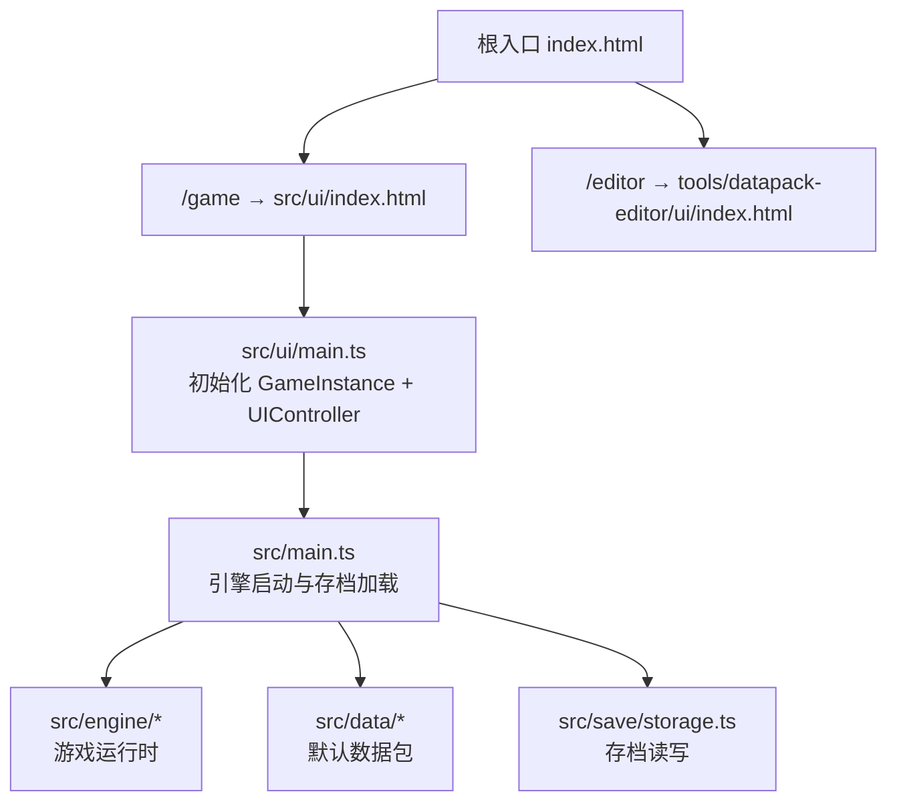
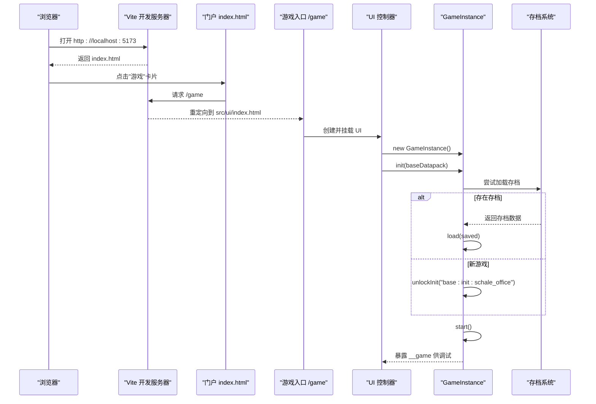
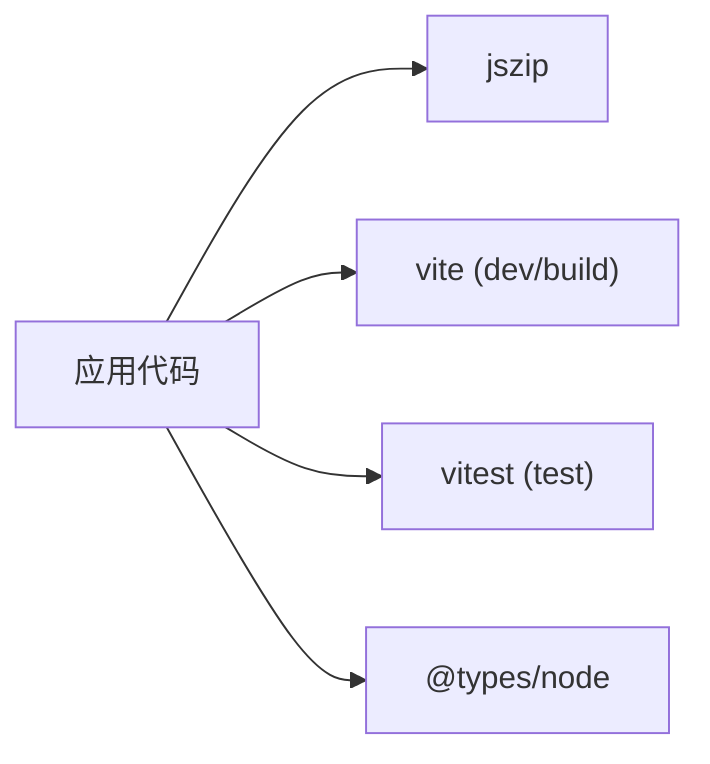

# 快速开始

<cite>
**本文引用的文件**
- [package.json](file://package.json)
- [vite.config.ts](file://vite.config.ts)
- [tsconfig.json](file://tsconfig.json)
- [index.html](file://index.html)
- [src/ui/index.html](file://src/ui/index.html)
- [src/ui/main.ts](file://src/ui/main.ts)
- [src/main.ts](file://src/main.ts)
- [vitest.config.ts](file://vitest.config.ts)
- [AGENTS.md](file://AGENTS.md)
- [docs-828/01-architecture/overview.md](file://docs-828/01-architecture/overview.md)
- [docs-828/01-architecture/data-flow.md](file://docs-828/01-architecture/data-flow.md)
</cite>

## 更新摘要
**变更内容**
- 更新了文档导航与路由说明，强调 docs-828 作为单一事实来源
- 增强了不同开发场景的导航指引
- 更新了命令速查表以反映最新的开发工作流
- 完善了架构概览与数据流说明

## 目录
1. [简介](#简介)
2. [项目结构](#项目结构)
3. [核心组件](#核心组件)
4. [架构总览](#架构总览)
5. [详细组件分析](#详细组件分析)
6. [依赖分析](#依赖分析)
7. [性能注意事项](#性能注意事项)
8. [故障排除指南](#故障排除指南)
9. [结论](#结论)
10. [附录](#附录)

## 简介
本快速开始指南帮助你在本地搭建 ACProgram（AronaClicker）的开发环境，从克隆代码到启动开发服务器，再到常用命令与常见问题排查。你将了解：
- Node.js 版本要求与环境准备
- 依赖安装与构建配置
- 运行游戏与数据编辑器的流程
- 主要开发命令的用途
- 关键目录与入口文件的定位
- 常见问题的解决方案

**重要更新**：本项目现已采用 `docs-828/` 作为单一事实来源，取代已归档的 `docs-824/`。所有机制、结构和算法相关内容请参考新的文档体系。

## 项目结构
ACProgram 采用多页面应用（MPA）组织方式，通过 Vite 提供开发服务器与构建能力。根入口为门户页，可跳转到"游戏"和"编辑器"。

- 根入口门户：index.html
- 游戏 UI 入口：src/ui/index.html（由 /game 路由映射）
- 数据编辑器入口：tools/datapack-editor/ui/index.html（由 /editor 路由映射）
- 引擎与业务逻辑：src/engine、src/data、src/save
- 测试：tests
- 构建与脚本：vite.config.ts、vitest.config.ts、scripts

**图表来源**
- [vite.config.ts:12-34](file://vite.config.ts#L12-L34)
- [index.html:120-135](file://index.html#L120-L135)
- [src/ui/index.html:1-13](file://src/ui/index.html#L1-L13)
- [src/ui/main.ts:1-35](file://src/ui/main.ts#L1-L35)
- [src/main.ts:1-59](file://src/main.ts#L1-L59)

**章节来源**
- [vite.config.ts:1-59](file://vite.config.ts#L1-L59)
- [index.html:1-139](file://index.html#L1-L139)
- [src/ui/index.html:1-13](file://src/ui/index.html#L1-L13)
- [src/ui/main.ts:1-35](file://src/ui/main.ts#L1-L35)
- [src/main.ts:1-59](file://src/main.ts#L1-L59)

## 核心组件
- 开发服务器与多页面路由：Vite 自定义插件将 /game 与 /editor 映射到对应 HTML 入口，便于统一调试。
- 游戏实例：GameInstance 负责加载数据包、初始化、启动引擎、保存/加载存档。
- UI 控制器：UIController 挂载 UI 并绑定交互事件，消费引擎提供的视图状态。
- 数据存储：SaveSystem 负责浏览器端存档的持久化。
- 默认数据包：baseDatapack 提供初始内容（区域、角色、故事等）。

**章节来源**
- [vite.config.ts:12-34](file://vite.config.ts#L12-L34)
- [src/ui/main.ts:1-35](file://src/ui/main.ts#L1-L35)
- [src/main.ts:1-59](file://src/main.ts#L1-L59)

## 架构总览
下图展示了从浏览器访问到引擎运行的整体流程，包括路由映射、UI 初始化、引擎启动与存档加载。

**图表来源**
- [vite.config.ts:12-34](file://vite.config.ts#L12-L34)
- [index.html:120-135](file://index.html#L120-L135)
- [src/ui/index.html:1-13](file://src/ui/index.html#L1-L13)
- [src/ui/main.ts:1-35](file://src/ui/main.ts#L1-L35)
- [src/main.ts:1-59](file://src/main.ts#L1-L59)

## 详细组件分析

### 环境与依赖
- Node.js 版本：建议使用现代 LTS（如 18+），确保兼容 ESNext 模块与 Vite 5。
- 包管理器：npm（或等效工具）。
- 依赖说明：
  - 运行时依赖：jszip（用于读取打包的数据包）。
  - 开发依赖：typescript、vite、vitest、@types/node。
- TypeScript 目标：ES2020，模块解析使用 bundler，严格模式开启。

**章节来源**
- [package.json:1-25](file://package.json#L1-L25)
- [tsconfig.json:1-19](file://tsconfig.json#L1-L19)

### 安装与运行
- 安装依赖：在项目根目录执行 npm install。
- 启动开发服务器：
  - 全局门户与路由：npm run dev（默认端口 5173，自动打开根门户）。
  - 仅游戏 UI：npm run dev:game。
  - 仅编辑器：npm run dev:editor。
- 预览构建产物：npm run build 后，可使用 Vite 预览服务（默认端口 4173）。

**章节来源**
- [package.json:6-14](file://package.json#L6-L14)
- [vite.config.ts:36-58](file://vite.config.ts#L36-L58)

### 构建与发布
- 构建命令：npm run build
- 输出目录：web-dist（与 tsc 的 dist 隔离）
- 多入口构建：portal、game、editor

**章节来源**
- [vite.config.ts:45-56](file://vite.config.ts#L45-L56)

### 测试
- 运行测试：npm test
- 监听模式：npm run test:watch
- 测试范围：tests 与 tools 下的 .test.ts 文件

**章节来源**
- [package.json:6-14](file://package.json#L6-L14)
- [vitest.config.ts:1-9](file://vitest.config.ts#L1-L9)

### 生成 Schema 协议
- 命令：npm run gen:schema
- 作用：根据引擎类型定义生成 datapack 编辑器的 schema，保持编辑器与引擎字段一致。

**章节来源**
- [package.json:6-14](file://package.json#L6-L14)
- [AGENTS.md:13-19](file://AGENTS.md#L13-L19)

### 文档导航与学习路径

**新增** 项目现已建立完整的文档体系，docs-828 作为单一事实来源提供全面的架构说明和学习路径。

#### 文档组织结构
- **01-architecture**：系统架构总览、数据流、运行逻辑
- **02-modules**：各模块详细说明（核心、注册表、统计、故事等）
- **03-data-structures**：数据结构定义（玩家状态、实体、声明式DSL等）
- **04-algorithms**：核心算法实现（状态变更、生产、抽卡、色彩推导等）
- **05-conventions**：开发规范与约定（重构、测试、架构纪律）
- **06-adr**：架构决策记录

#### 快速导航指南
| 场景 | 推荐入口 |
| --- | --- |
| 第一次接触项目 | [[docs-828/01-architecture/overview.md]] |
| 理解数据流动 | [[docs-828/01-architecture/data-flow.md]] |
| 修改引擎机制 | [[docs-828/05-conventions/architecture-discipline]] |
| 处理数据结构 | [[docs-828/03-data-structures/player-state.md]] |
| 实现核心算法 | [[docs-828/04-mechanisms/state-mutation.md]] |

**章节来源**
- [AGENTS.md:6-18](file://AGENTS.md#L6-L18)
- [docs-828/01-architecture/overview.md:1-63](file://docs-828/01-architecture/overview.md#L1-L63)
- [docs-828/01-architecture/data-flow.md:1-48](file://docs-828/01-architecture/data-flow.md#L1-L48)

## 依赖分析
- 运行时依赖：jszip（用于解压与合并数据包 JSON 分片）。
- 开发依赖：
  - vite：开发与构建服务器，支持 MPA 路由与热更新。
  - typescript：类型检查与编译辅助（noEmit 由构建器处理）。
  - vitest：单元测试框架。
  - @types/node：Node 类型声明。

**图表来源**
- [package.json:15-23](file://package.json#L15-L23)

**章节来源**
- [package.json:15-23](file://package.json#L15-L23)

## 性能注意事项
- 开发模式：
  - 启用详细日志：在引擎初始化时可根据环境变量开启 verbose 日志，便于排障。
  - 热更新：Vite 提供快速刷新，建议保留最小改动范围以缩短反馈周期。
- 构建优化：
  - 多入口构建会分别打包 portal、game、editor，避免不必要的资源耦合。
  - 产物输出至 web-dist，与 TypeScript 编译产物分离，减少干扰。
- 内存与渲染：
  - UI 层只消费视图状态，不持有写引用，降低状态同步开销。
  - 大数据包（如 ZIP 中的多个 JSON）建议在必要时进行按需加载或分页展示。

**章节来源**
- [src/main.ts:9-15](file://src/main.ts#L9-L15)
- [vite.config.ts:45-56](file://vite.config.ts#L45-L56)

## 故障排除指南
- 无法启动开发服务器：
  - 确认已执行 npm install 安装依赖。
  - 检查端口 5173 是否被占用；如需修改，可在 vite.config.ts 中调整 server.port。
- 页面空白或报错：
  - 确认浏览器控制台是否有 JS 错误。
  - 检查 /game 与 /editor 路由是否正确映射（vite.config.ts 中的 mpaRoutes 插件）。
- 数据包加载失败：
  - 若使用 ZIP 数据包，确保路径正确且包含有效 JSON 分片。
  - 可通过 tests/data/arona-clicker-core.test.ts 的思路验证数据包结构与数量。
- 类型检查失败：
  - 执行 npx tsc --noEmit 查看类型错误。
  - 确保 tsconfig.json 的 include/exclude 配置符合预期。
- 测试未通过：
  - 使用 npm run test:watch 观察失败用例，逐步定位问题。
  - 关注 vitest.config.ts 的测试范围设置。
- 文档导航问题：
  - 如遇文档链接失效，请确认使用的是 docs-828 而非已归档的 docs-824。
  - 参考 AGENTS.md 中的快速上手表格获取正确的文档路由。

**章节来源**
- [vite.config.ts:12-34](file://vite.config.ts#L12-L34)
- [tests/data/arona-clicker-core.test.ts:1-108](file://tests/data/arona-clicker-core.test.ts#L1-L108)
- [vitest.config.ts:1-9](file://vitest.config.ts#L1-L9)
- [AGENTS.md:6-18](file://AGENTS.md#L6-L18)

## 结论
通过以上步骤，你可以在本地快速搭建 ACProgram 的开发环境，理解多页面入口与引擎启动流程，掌握常用命令与基本排障方法。建议初次上手先运行 npm run dev，访问 /game 体验游戏，再根据需要切换到 /editor 进行数据编辑。

**重要更新**：随着项目的演进，现在推荐使用 docs-828 作为主要的学习和参考资料。该文档体系提供了更清晰的架构说明、模块划分和学习路径，有助于深入理解引擎机制与数据驱动设计。

## 附录
- 常用命令速查：
  - npm run dev：启动开发服务器（含门户与路由）
  - npm run dev:game：仅启动游戏 UI
  - npm run dev:editor：仅启动数据编辑器
  - npm run build：构建产物到 web-dist
  - npm test / npm run test:watch：运行测试/监听模式
  - npm run gen:schema：生成编辑器 Schema
- 关键入口与路由：
  - 根门户：index.html
  - 游戏入口：/game → src/ui/index.html
  - 编辑器入口：/editor → tools/datapack-editor/ui/index.html
- 文档导航：
  - 主入口：docs-828/01-architecture/overview.md
  - 数据流：docs-828/01-architecture/data-flow.md
  - 架构纪律：docs-828/05-conventions/architecture-discipline

**章节来源**
- [package.json:6-14](file://package.json#L6-L14)
- [index.html:120-135](file://index.html#L120-L135)
- [vite.config.ts:12-34](file://vite.config.ts#L12-L34)
- [AGENTS.md:20-28](file://AGENTS.md#L20-L28)
- [docs-828/01-architecture/overview.md:53-63](file://docs-828/01-architecture/overview.md#L53-L63)
