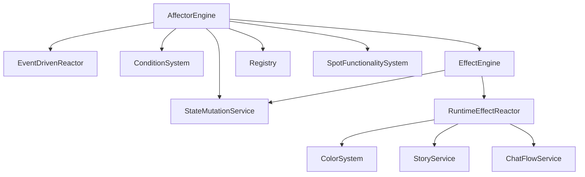
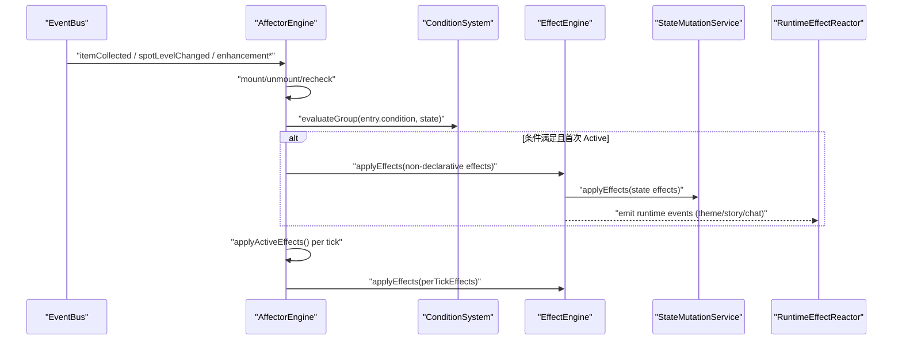
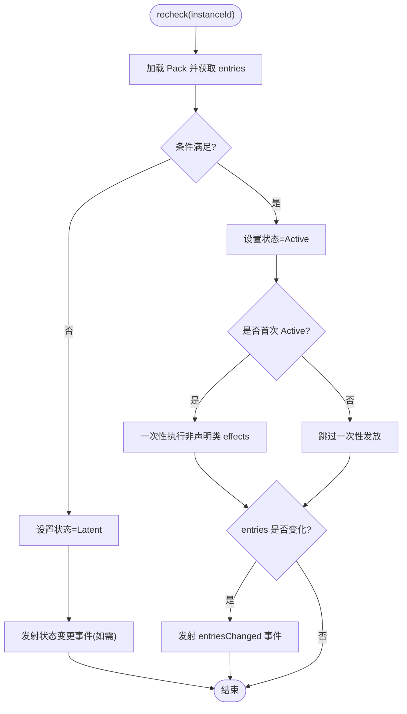
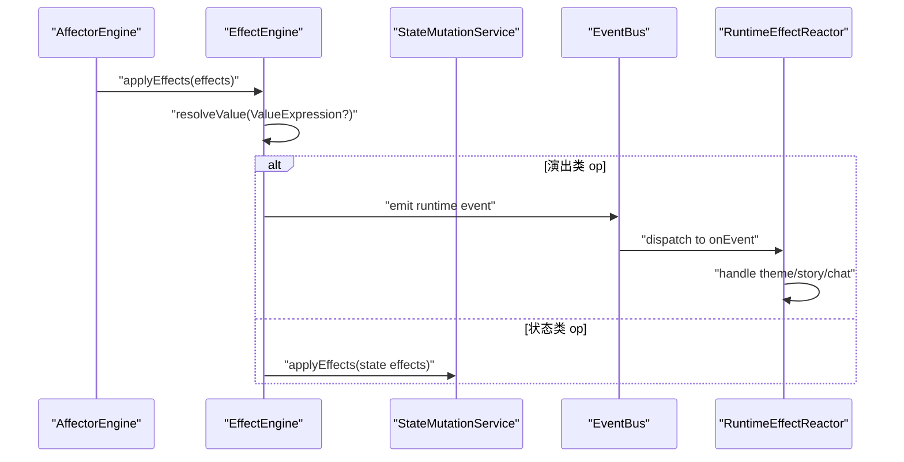
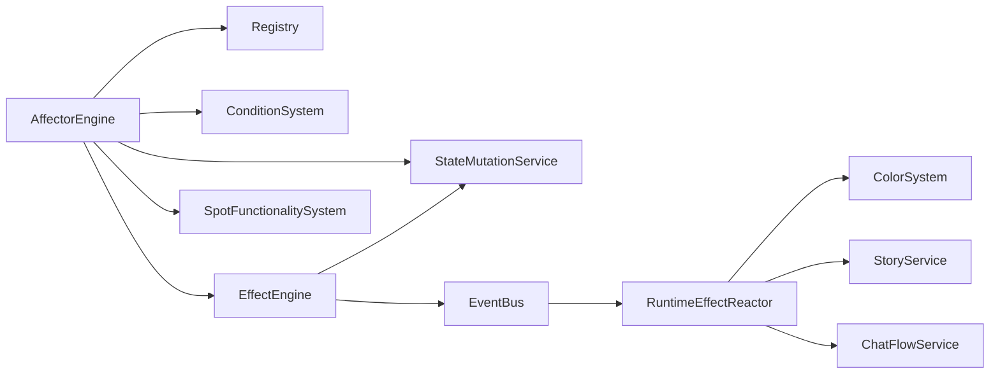

# 增益系统

<cite>
**本文引用的文件**
- [affector-engine.ts](file://src/engine/effect/affector-engine.ts)
- [effect-engine.ts](file://src/engine/effect/effect-engine.ts)
- [event-driven-reactor.ts](file://src/engine/effect/event-driven-reactor.ts)
- [runtime-effect-reactor.ts](file://src/engine/effect/runtime-effect-reactor.ts)
- [affector-text.ts](file://src/engine/effect/affector-text.ts)
- [state-mutation-service.ts](file://src/engine/system/state-mutation-service.ts)
- [condition-system.ts](file://src/engine/expression/condition-system.ts)
- [expression.ts](file://src/engine/types/expression.ts)
- [affector-pack.ts](file://src/engine/def-factory/affector-pack.ts)
- [08-affector-packs.json](file://datapack/AronaClickerCore/08-affector-packs.json)
- [affector-engine.test.ts](file://tests/engine/affector-engine.test.ts)
</cite>

## 目录
1. [简介](#简介)
2. [项目结构](#项目结构)
3. [核心组件](#核心组件)
4. [架构总览](#架构总览)
5. [详细组件分析](#详细组件分析)
6. [依赖关系分析](#依赖关系分析)
7. [性能考量](#性能考量)
8. [故障诊断与调试](#故障诊断与调试)
9. [结论](#结论)
10. [附录：配置示例与使用模式](#附录配置示例与使用模式)

## 简介
本技术文档面向 ACProgram 的增益（Affector）系统，围绕 AffectorEngine 的设计与实现展开，系统性说明持续效果管理、性能优化策略、冲突解决机制，以及增益的添加、更新、移除流程；同时覆盖时间调度、优先级排序、资源管理、文本展示系统、与游戏状态集成（属性修改、状态同步、回滚）、常见配置与使用模式，以及调试与性能分析方法。

## 项目结构
增益系统位于 engine/effect 与 engine/system、engine/expression 等模块之间协作完成：
- 引擎层：AffectorEngine 负责实例生命周期、条件重评估、激活沿一次性效果派发、每 Tick 持续产出执行、Spot 等级上限覆盖计算、事件驱动定向重估。
- 效果分发：EffectEngine 将运行时演出类效果转为事件，其余状态类效果委托 StateMutationService。
- 运行时反应器：RuntimeEffectReactor 消费演出请求事件并调用 ColorSystem/StoryService/ChatFlowService。
- 条件系统：ConditionSystem 提供条件求值与外部依赖注入点。
- 状态写入：StateMutationService 统一变更 PlayerState 并广播事件。
- 文本系统：affector-text.ts 提供纯函数式描述器，用于 tooltip/追踪面板等 UI。
- 定义构建：affector-pack.ts 提供链式 Builder，便于在代码中构造 Pack。
- 数据配置：datapack 中的 affector-packs.json 提供数据包级 Pack 声明。

图表来源
- [affector-engine.ts:33-79](file://src/engine/effect/affector-engine.ts#L33-L79)
- [effect-engine.ts:16-35](file://src/engine/effect/effect-engine.ts#L16-L35)
- [runtime-effect-reactor.ts:21-31](file://src/engine/effect/runtime-effect-reactor.ts#L21-L31)

章节来源
- [affector-engine.ts:33-79](file://src/engine/effect/affector-engine.ts#L33-L79)
- [effect-engine.ts:16-35](file://src/engine/effect/effect-engine.ts#L16-L35)
- [runtime-effect-reactor.ts:21-31](file://src/engine/effect/runtime-effect-reactor.ts#L21-L31)

## 核心组件
- AffectorEngine：增益实例的生命周期管理、条件重评估、激活沿一次性派发、每 Tick 持续产出、Spot 等级上限覆盖、事件驱动定向重估、挂载对账 reconcileMounts。
- EffectEngine：效果 op 分发表驱动，演出类效果转事件，状态类效果委托 StateMutationService，支持 ValueExpression 求值。
- EventDrivenReactor：事件驱动反应器基类，按事件类型分桶订阅，避免全量扫描。
- RuntimeEffectReactor：消费演出请求事件，转发到领域服务。
- ConditionSystem：条件求值，支持多种 target 与比较器，可注入外部依赖。
- StateMutationService：统一状态写入入口，写状态→统计→事件，保证一致性与可观测性。
- affector-text.ts：纯函数式文本描述器，覆盖所有 EffectOp/Value/ExtraValue，供 UI 与测试复用。
- affector-pack.ts：Pack 构建器，便于在代码中声明式构建 Pack。

章节来源
- [affector-engine.ts:33-444](file://src/engine/effect/affector-engine.ts#L33-L444)
- [effect-engine.ts:16-65](file://src/engine/effect/effect-engine.ts#L16-L65)
- [event-driven-reactor.ts:15-35](file://src/engine/effect/event-driven-reactor.ts#L15-L35)
- [runtime-effect-reactor.ts:21-59](file://src/engine/effect/runtime-effect-reactor.ts#L21-L59)
- [condition-system.ts:16-137](file://src/engine/expression/condition-system.ts#L16-L137)
- [state-mutation-service.ts:31-566](file://src/engine/system/state-mutation-service.ts#L31-L566)
- [affector-text.ts:18-159](file://src/engine/effect/affector-text.ts#L18-L159)
- [affector-pack.ts:12-96](file://src/engine/def-factory/affector-pack.ts#L12-L96)

## 架构总览
增益系统的核心是“事件驱动 + 声明式条件 + 两阶段效果派发”：
- 事件驱动：通过 EventBus 订阅 itemCollected、spotLevelChanged、enhancementAdded/Removed、spotTagChanged 等事件，触发 mount/unmount/recheck/sync。
- 声明式条件：每个 entry 可带 condition，由 ConditionSystem 求值决定 Latent/Active。
- 两阶段派发：
  - 激活沿（Latent→Active）：一次性执行 effects（除声明类 op）。
  - 每 Tick：仅执行 perTickEffects（持续产出），flows 由 GameNum 区表驱动。
- 冲突解决：Spot 等级上限 setSpotMaxLevel/removeSpotMaxLevel 通过 getSpotMaxLevelOverrides 计算优先级（remove 最高，多个 set 取最大值）。
- 性能优化：
  - 条件依赖索引：按事件类型分桶订阅，命中即定向 recheck，减少全量轮询。
  - 轮询集合：含 stat/未知 target 的条件进入 pollingInstances，每 Tick 仅对这些实例重估。
  - 缓存：getSpotMaxLevelOverrides 结果缓存，在 recheck/unmount 时失效。
  - 幂等挂载：重复获得同一物品不重建实例，避免重复发放一次性效果。

图表来源
- [affector-engine.ts:56-79](file://src/engine/effect/affector-engine.ts#L56-L79)
- [affector-engine.ts:188-230](file://src/engine/effect/affector-engine.ts#L188-L230)
- [affector-engine.ts:377-394](file://src/engine/effect/affector-engine.ts#L377-L394)
- [effect-engine.ts:42-55](file://src/engine/effect/effect-engine.ts#L42-L55)
- [runtime-effect-reactor.ts:33-57](file://src/engine/effect/runtime-effect-reactor.ts#L33-L57)

## 详细组件分析

### AffectorEngine：持续效果管理与冲突解决
- 实例生命周期：
  - mount(packRef, mountEntityId)：解析 pack 引用（字符串或内联包），生成 instanceId = packId@entityId，幂等处理已存在实例，注册条件依赖，立即 recheck，发射 mounted 事件。
  - unmount(instanceId, reason)：标记 Removed，清空 activeEntryIds，注销条件依赖，发射 stateChanged/unmounted 事件。
  - recheck(instanceId)：过滤满足条件的 entry ids，更新实例状态（Active/Latent），若从 Latent→Active 则一次性执行非声明类 effects；若 entriesChanged 或状态翻转，发射相应事件。
  - applyActiveEffects()：每 Tick 仅对 pollingInstances 重估，并对 Active 实例执行 perTickEffects。
- 事件驱动与定向重估：
  - 继承 EventDrivenReactor，subscribeTo 条件依赖事件类型，onEvent 中按 condDeps.affected(event) 定向 recheck。
  - 对含 stat/未知 target 的实例加入 pollingInstances，保留每 Tick 轮询。
- Spot 等级上限覆盖：
  - getSpotMaxLevelOverrides：遍历 Active 实例的 setSpotMaxLevel/removeSpotMaxLevel，remove 优先（lifted），多个 set 取最大值，缓存结果并在 recheck/unmount 时失效。
- 功能同步：
  - syncSpotFunctionalities：根据 Spot 的 linearYield 功能动态注册/挂载 Pack，packId 命名空间为 fn.id@spotId，避免多 Spot 共享状态串号。
  - syncAllSpotFunctionalities：在 Enhancement/Tag 变化时全量同步。
- 挂载对账：
  - reconcileMounts：基于当前 PlayerState（inventory、unlockedEnhancements、spotLevels）计算期望挂载集合，卸载不再成立的实例，补挂缺失实例，用于 init/restore/reset 等路径。

图表来源
- [affector-engine.ts:188-230](file://src/engine/effect/affector-engine.ts#L188-L230)

章节来源
- [affector-engine.ts:128-186](file://src/engine/effect/affector-engine.ts#L128-L186)
- [affector-engine.ts:188-230](file://src/engine/effect/affector-engine.ts#L188-L230)
- [affector-engine.ts:249-285](file://src/engine/effect/affector-engine.ts#L249-L285)
- [affector-engine.ts:314-363](file://src/engine/effect/affector-engine.ts#L314-L363)
- [affector-engine.ts:377-394](file://src/engine/effect/affector-engine.ts#L377-L394)
- [affector-engine.ts:403-436](file://src/engine/effect/affector-engine.ts#L403-L436)

### EffectEngine：效果分发与运行时请求
- applyEffects(effects)：
  - 先 resolveValue：若 value 为 ValueExpression 且存在 valueSystem，则按当前状态求值。
  - 演出类 op（setTheme/triggerStory/clearAllChatFlow/showChatText/clearIdChatFlow/clearAllChatText）转换为事件并通过 EventBus 发出，不落状态。
  - 状态类效果委托 StateMutationService.applyEffects。
- setState：同步内部 _state 与 mutations 的状态引用。

图表来源
- [effect-engine.ts:42-63](file://src/engine/effect/effect-engine.ts#L42-L63)
- [runtime-effect-reactor.ts:33-57](file://src/engine/effect/runtime-effect-reactor.ts#L33-L57)

章节来源
- [effect-engine.ts:16-65](file://src/engine/effect/effect-engine.ts#L16-L65)
- [runtime-effect-reactor.ts:21-59](file://src/engine/effect/runtime-effect-reactor.ts#L21-L59)

### EventDrivenReactor：事件驱动骨架
- 分桶订阅：subscribeTo(types) 按事件类型去重订阅，避免 onAny 全量扫描。
- 子类实现 onEvent：根据事件类型进行依赖匹配与动作执行（如 AffectorEngine 的定向 recheck）。

章节来源
- [event-driven-reactor.ts:15-35](file://src/engine/effect/event-driven-reactor.ts#L15-L35)

### ConditionSystem：条件求值与外部依赖
- evaluate/evaluateExpr/evaluateGroup：递归求值 AND/OR 条件组。
- TARGET_EVALUATORS：针对 resource/spotLevel/manager/flag/hasEnh/hasTag/countTags/stat/hasReadStory/hasReadStoryInRun/visitedStoryInChain/extra/tagCount/protoStat/area 等 target 的求值器。
- 外部依赖注入：tagIndex、statReader、storyRunChecker、storyChainChecker、extraReader、tagCountReader 等，供复杂条件访问外部数据。

章节来源
- [condition-system.ts:16-137](file://src/engine/expression/condition-system.ts#L16-L137)
- [expression.ts:41-86](file://src/engine/types/expression.ts#L41-L86)

### StateMutationService：统一状态写入与事件广播
- changeResource/setResource/addSpotLevel/setManager/acquireCharacter/addExp/breakthroughStar/addEnhancement/removeItem/unlockInit/setFlag/completeStory/setPassiveCooldowns/setStudentBlock/clearStudentBlock/applySpotTagChange/setCharaCustom/clearCharaCustom/recordStoryRead/setExtra/addExtra/removeExtra 等方法。
- 每个 mutation 遵循管道：写状态→更新 StatsService→emit 事件（惰性构建 StatsContext）。
- applyEffects：委托 effect-ops 实现具体 op 逻辑。

章节来源
- [state-mutation-service.ts:31-566](file://src/engine/system/state-mutation-service.ts#L31-L566)

### 文本系统：affector-text.ts
- describeValueExpression/describeValue/describeExtraValue：覆盖全部 ValueExpression/Value/ExtraValue 变体，输出紧凑展示文本。
- describeEffect：穷尽 switch 所有 EffectOp，新增 op 编译期报错强制补全文案。
- describeAffectorEntry/describeAffectorPack：将 entry/pack 转为人类可读文本，支持可选条件描述器。

章节来源
- [affector-text.ts:18-159](file://src/engine/effect/affector-text.ts#L18-L159)
- [expression.ts:89-152](file://src/engine/types/expression.ts#L89-L152)

## 依赖关系分析
- AffectorEngine 依赖：
  - Registry：读取 items/enhancements/spots 的定义与关联 Pack。
  - ConditionSystem：条件求值。
  - StateMutationService：状态写入与事件广播。
  - EffectEngine：效果分发（可选，若未注入则直接走 mutations）。
  - SpotFunctionalitySystem：Spot 线性产出功能装配。
  - EventBus：事件订阅与发射。
- EffectEngine 依赖：
  - EventBus：发射运行时请求事件。
  - StateMutationService：状态类效果写入。
  - ValueSystem：ValueExpression 求值（可选）。
- RuntimeEffectReactor 依赖：
  - ColorSystem/StoryService/ChatFlowService：领域服务。
  - Registry：故事入口解析。

图表来源
- [affector-engine.ts:33-79](file://src/engine/effect/affector-engine.ts#L33-L79)
- [effect-engine.ts:16-35](file://src/engine/effect/effect-engine.ts#L16-L35)
- [runtime-effect-reactor.ts:21-31](file://src/engine/effect/runtime-effect-reactor.ts#L21-L31)

章节来源
- [affector-engine.ts:33-79](file://src/engine/effect/affector-engine.ts#L33-L79)
- [effect-engine.ts:16-35](file://src/engine/effect/effect-engine.ts#L16-L35)
- [runtime-effect-reactor.ts:21-31](file://src/engine/effect/runtime-effect-reactor.ts#L21-L31)

## 性能考量
- 事件驱动定向重估：通过 ConditionDepIndex 将条件依赖映射到事件类型，命中即定向 recheck，避免全量扫描。
- 轮询集合控制：仅对含 stat/未知 target 的实例保留每 Tick 轮询，降低无谓开销。
- 缓存策略：getSpotMaxLevelOverrides 结果缓存，在 recheck/unmount 时失效，避免重复计算。
- 幂等挂载：重复获得同一物品不重建实例，避免重复发放一次性效果。
- 惰性统计上下文：StateMutationService 的事件 stats 字段惰性构建，消除每 Tick 大量事件的深拷贝开销。
- 声明类效果分离：setSpotMaxLevel/removeSpotMaxLevel 不走执行流，改为声明式读取，减少运行时负担。

[本节为通用性能讨论，无需特定文件引用]

## 故障诊断与调试
- 常见问题定位：
  - 增益未生效：检查条件是否满足（ConditionSystem.evaluateGroup），确认实例状态是否为 Active；查看是否有重复 entry id 导致隐式同时激活。
  - 重复发放：确认是否为 Latent→Active 边缘触发；检查是否误用 flows 而非 perTickEffects。
  - Spot 等级上限异常：检查 setSpotMaxLevel/removeSpotMaxLevel 的优先级与缓存失效时机。
- 调试工具：
  - devLog：AffectorEngine 可注入 DevLog 输出警告（如重复 entry id）。
  - 文本描述器：使用 affector-text.ts 的 describeEffect/describeAffectorEntry/describeAffectorPack 快速生成人类可读文案，辅助 UI 与测试。
  - 单元测试：参考 tests/engine/affector-engine.test.ts 验证行为（条件满足、边缘触发、移除后不复活等）。
- 性能分析：
  - 关注 pollingInstances 大小与 recheck 频率；必要时优化条件以减少未知 target/stat 依赖。
  - 监控事件总线负载，确保事件类型分桶订阅有效。

章节来源
- [affector-engine.ts:108-120](file://src/engine/effect/affector-engine.ts#L108-L120)
- [affector-text.ts:93-159](file://src/engine/effect/affector-text.ts#L93-L159)
- [affector-engine.test.ts:24-127](file://tests/engine/affector-engine.test.ts#L24-L127)

## 结论
ACProgram 的增益系统以 AffectorEngine 为核心，结合事件驱动、声明式条件、两阶段效果派发与冲突解决机制，实现了高效、可扩展、可维护的增益体系。通过精确的事件依赖索引、轮询集合控制、缓存策略与幂等挂载，系统在性能与正确性之间取得平衡。文本系统与状态写入服务的解耦设计，使得 UI 与业务逻辑清晰分离，便于扩展与测试。

[本节为总结性内容，无需特定文件引用]

## 附录：配置示例与使用模式

### 数值增益
- 通过 addResource/setResource 实现资源增减，常用于每 Tick 产出或一次性奖励。
- 示例参考：数据包中的 base:pack:energy_drink 使用 addResource 增加 credit。

章节来源
- [08-affector-packs.json:1-22](file://datapack/AronaClickerCore/08-affector-packs.json#L1-L22)
- [expression.ts:89-152](file://src/engine/types/expression.ts#L89-L152)

### 状态增益
- 通过 setSpotLevel/addSpotLevel 调整设施等级，或通过 unlockInit 解锁世界线。
- 配合 ConditionSystem 的 target（如 spotLevel/resource/flag）实现条件化增益。

章节来源
- [state-mutation-service.ts:130-141](file://src/engine/system/state-mutation-service.ts#L130-L141)
- [state-mutation-service.ts:420-427](file://src/engine/system/state-mutation-service.ts#L420-L427)
- [condition-system.ts:16-45](file://src/engine/expression/condition-system.ts#L16-L45)

### 复合增益
- 组合多个 entry，分别处理不同条件与效果；或使用 flows 实现持续产出。
- 通过 perTickEffects 实现每 Tick 执行的副作用（如额外资源、状态变更）。

章节来源
- [affector-pack.ts:22-27](file://src/engine/def-factory/affector-pack.ts#L22-L27)
- [affector-engine.ts:377-394](file://src/engine/effect/affector-engine.ts#L377-L394)

### 演出增益
- setTheme/triggerStory/clearAllChatFlow/showChatText/clearIdChatFlow/clearAllChatText 等演出类效果通过 EffectEngine 转为事件，由 RuntimeEffectReactor 分发至领域服务。

章节来源
- [effect-engine.ts:27-34](file://src/engine/effect/effect-engine.ts#L27-L34)
- [runtime-effect-reactor.ts:33-57](file://src/engine/effect/runtime-effect-reactor.ts#L33-L57)

### 冲突解决与优先级
- Spot 等级上限：removeSpotMaxLevel 优先级最高，多个 setSpotMaxLevel 取最大值；结果缓存并在相关操作时失效。

章节来源
- [affector-engine.ts:249-285](file://src/engine/effect/affector-engine.ts#L249-L285)