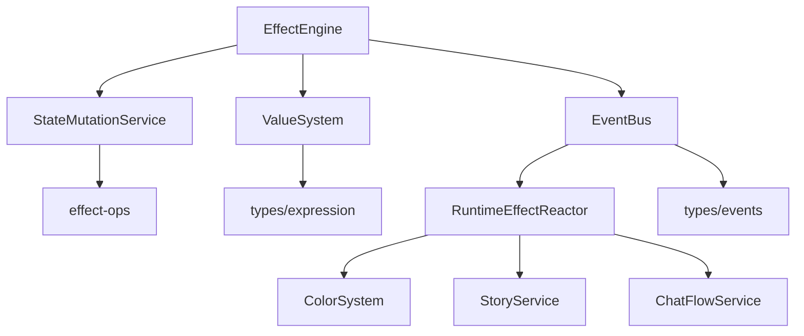
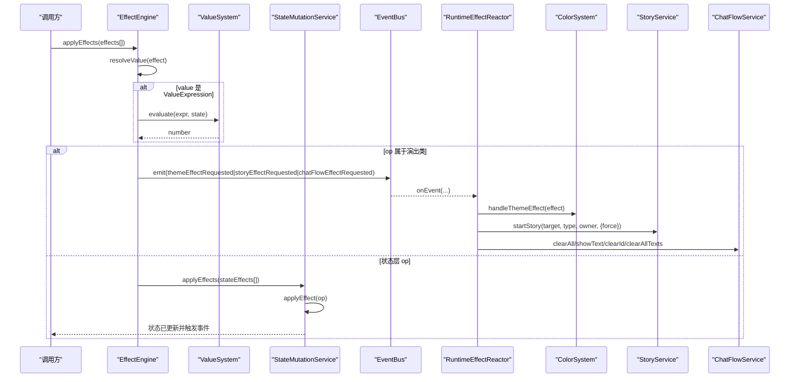
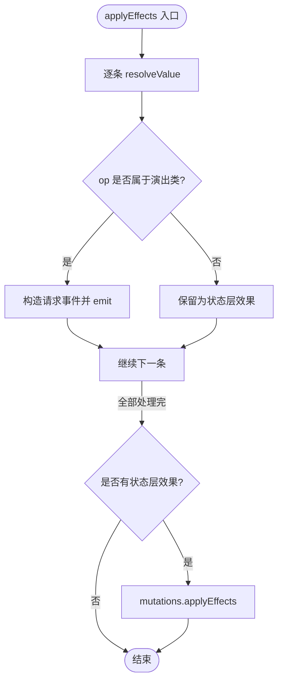
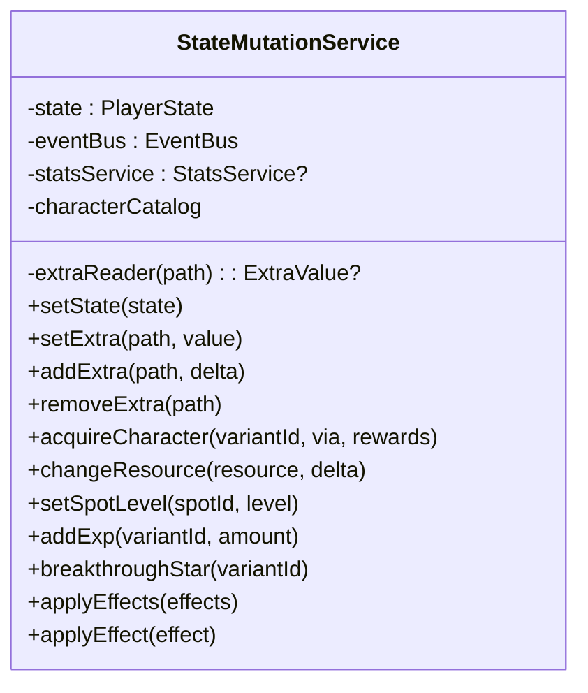
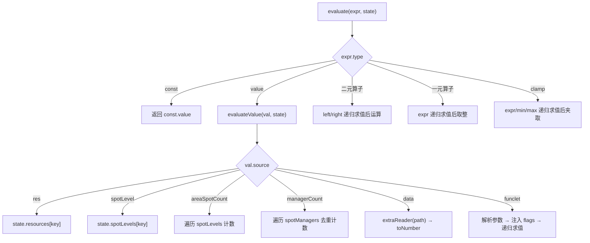
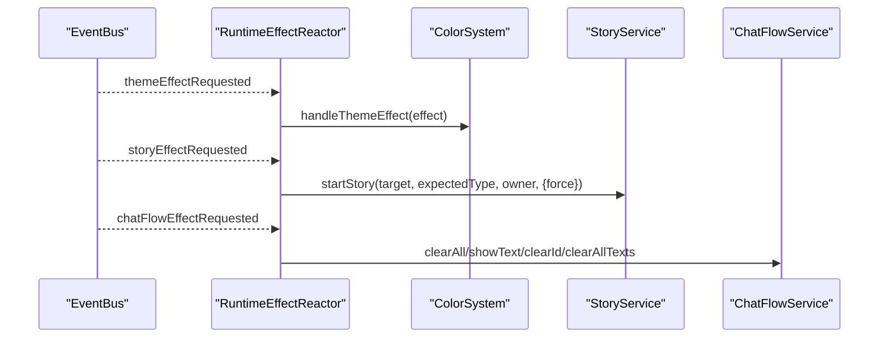
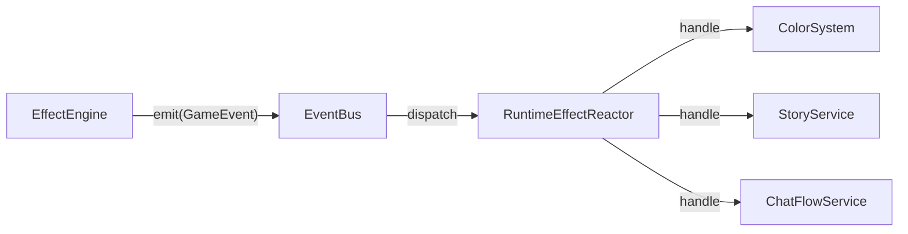
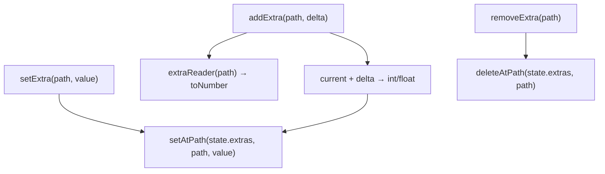
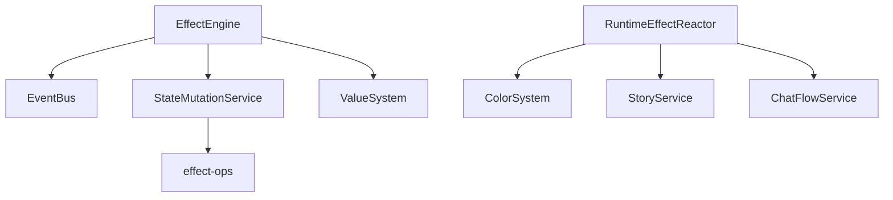

# 效果引擎

<cite>
**本文引用的文件**
- [effect-engine.ts](file://src/engine/effect/effect-engine.ts)
- [state-mutation-service.ts](file://src/engine/system/state-mutation-service.ts)
- [event-bus.ts](file://src/engine/core/event-bus.ts)
- [value-system.ts](file://src/engine/expression/value-system.ts)
- [extra-core.ts](file://src/engine/extra/extra-core.ts)
- [effect-ops.ts](file://src/engine/system/effect-ops.ts)
- [runtime-effect-reactor.ts](file://src/engine/effect/runtime-effect-reactor.ts)
- [expression.ts](file://src/engine/types/expression.ts)
- [events.ts](file://src/engine/types/events.ts)
- [chat-flow-service.ts](file://src/engine/game/chat-flow-service.ts)
- [color-system.ts](file://src/engine/system/color-system.ts)
- [story-service.ts](file://src/engine/game/story-service.ts)
</cite>

## 目录
1. [简介](#简介)
2. [项目结构](#项目结构)
3. [核心组件](#核心组件)
4. [架构总览](#架构总览)
5. [详细组件分析](#详细组件分析)
6. [依赖关系分析](#依赖关系分析)
7. [性能考量](#性能考量)
8. [故障排查指南](#故障排查指南)
9. [结论](#结论)
10. [附录：配置示例与最佳实践](#附录配置示例与最佳实践)

## 简介
本技术文档围绕 ACProgram 的效果引擎，系统性阐述 EffectEngine 的核心架构、op 分发表驱动机制、状态层委托与演出类 op 的运行时事件处理、效果值解析流程（ValueExpression 求值与 ExtraValue 结构化对象）、以及效果与 EventBus 的集成方式。同时提供批量执行、条件判断与错误处理的实践建议，帮助读者快速掌握效果系统的运行原理与扩展方法。

## 项目结构
效果引擎位于 engine 子系统中，围绕“效果声明 → 值解析 → 分发执行 → 事件驱动”的主线组织代码：
- effect 层：EffectEngine 负责效果批处理与运行时请求转发；RuntimeEffectReactor 消费运行时请求事件并委派到领域服务。
- system 层：StateMutationService 统一写入 PlayerState；effect-ops 实现按 op 分支的状态变更逻辑。
- expression 层：ValueSystem 对 ValueExpression 进行递归求值，支持常量、资源、区域等级、管理器数量、Extra 数据与函数片段（funclet）等来源。
- core 层：EventBus 提供事件注册、派发与队列缓冲能力。
- types 层：定义 Effect、EffectOp、ValueExpression、GameEvent 等类型契约，确保编译期穷尽检查。
- game 层：StoryService、ChatFlowService、ColorSystem 作为运行时请求的目标服务。



图表来源
- [effect-engine.ts:16-55](file://src/engine/effect/effect-engine.ts#L16-L55)
- [state-mutation-service.ts:41-565](file://src/engine/system/state-mutation-service.ts#L41-L565)
- [value-system.ts:88-149](file://src/engine/expression/value-system.ts#L88-L149)
- [event-bus.ts:9-83](file://src/engine/core/event-bus.ts#L9-L83)
- [runtime-effect-reactor.ts:21-58](file://src/engine/effect/runtime-effect-reactor.ts#L21-L58)
- [effect-ops.ts:11-82](file://src/engine/system/effect-ops.ts#L11-L82)
- [expression.ts:89-152](file://src/engine/types/expression.ts#L89-L152)
- [events.ts:13-97](file://src/engine/types/events.ts#L13-L97)

章节来源
- [effect-engine.ts:1-65](file://src/engine/effect/effect-engine.ts#L1-L65)
- [state-mutation-service.ts:1-566](file://src/engine/system/state-mutation-service.ts#L1-L566)
- [event-bus.ts:1-84](file://src/engine/core/event-bus.ts#L1-L84)
- [value-system.ts:1-150](file://src/engine/expression/value-system.ts#L1-L150)
- [effect-ops.ts:1-83](file://src/engine/system/effect-ops.ts#L1-L83)
- [runtime-effect-reactor.ts:1-59](file://src/engine/effect/runtime-effect-reactor.ts#L1-L59)
- [expression.ts:1-263](file://src/engine/types/expression.ts#L1-L263)
- [events.ts:1-167](file://src/engine/types/events.ts#L1-L167)

## 核心组件
- EffectEngine：效果批处理入口，负责值解析、op 分发、运行时请求事件发射。
- StateMutationService：统一状态写入入口，封装所有可持久化的状态变更，并在变更后发出领域事件。
- ValueSystem：ValueExpression 求值器，将表达式树计算为数值，读取状态与 Extra 视图。
- RuntimeEffectReactor：运行时请求反应器，消费主题/剧情/聊天流等演出类 op 的请求事件，委派给对应服务。
- EventBus：事件总线，支持定向订阅、通配订阅、批量 flush。
- ChatFlowService / ColorSystem / StoryService：运行时服务，分别处理聊天流演出、临时主题、剧情启动。

章节来源
- [effect-engine.ts:16-63](file://src/engine/effect/effect-engine.ts#L16-L63)
- [state-mutation-service.ts:41-565](file://src/engine/system/state-mutation-service.ts#L41-L565)
- [value-system.ts:88-149](file://src/engine/expression/value-system.ts#L88-L149)
- [runtime-effect-reactor.ts:21-58](file://src/engine/effect/runtime-effect-reactor.ts#L21-L58)
- [event-bus.ts:9-83](file://src/engine/core/event-bus.ts#L9-L83)
- [chat-flow-service.ts:14-37](file://src/engine/game/chat-flow-service.ts#L14-L37)
- [color-system.ts:207-311](file://src/engine/system/color-system.ts#L207-L311)
- [story-service.ts:52-203](file://src/engine/game/story-service.ts#L52-L203)

## 架构总览
效果引擎采用“声明式效果 + 运行时分发”的架构：
- 效果以 Effect 数组形式传入，先对 value 字段进行求值（若为 ValueExpression）。
- 根据 op 分类：
  - 状态层 op：委托 StateMutationService.applyEffects，最终由 effect-ops 分支调用具体写入口。
  - 演出类 op：构造 GameEvent 并通过 EventBus 同步派发，由 RuntimeEffectReactor 消费并委派到 ColorSystem / StoryService / ChatFlowService。
- 所有状态变更通过 StateMutationService 统一写出，保证统计更新与事件发射的一致性。



图表来源
- [effect-engine.ts:42-63](file://src/engine/effect/effect-engine.ts#L42-L63)
- [value-system.ts:112-149](file://src/engine/expression/value-system.ts#L112-L149)
- [state-mutation-service.ts:556-565](file://src/engine/system/state-mutation-service.ts#L556-L565)
- [effect-ops.ts:11-70](file://src/engine/system/effect-ops.ts#L11-L70)
- [runtime-effect-reactor.ts:33-57](file://src/engine/effect/runtime-effect-reactor.ts#L33-L57)
- [color-system.ts:287-306](file://src/engine/system/color-system.ts#L287-L306)
- [story-service.ts:196-198](file://src/engine/game/story-service.ts#L196-L198)
- [chat-flow-service.ts:18-36](file://src/engine/game/chat-flow-service.ts#L18-L36)

## 详细组件分析

### EffectEngine：效果批处理与运行时请求转发
- 职责：
  - 设置当前玩家状态，供值系统求值使用。
  - 批量应用效果：先解析 value（ValueExpression），再按 op 分类处理。
  - 演出类 op：构造运行时请求事件并立即通过 EventBus 派发。
  - 状态层 op：过滤后交由 StateMutationService.applyEffects 执行。
- 关键点：
  - runtimeEmit 映射表在构造期建立，避免运行时分支开销。
  - resolveValue 仅在 value 为对象且包含 type 时走 ValueSystem 求值，否则原样保留（包括 ExtraValue 等结构化对象）。



图表来源
- [effect-engine.ts:42-63](file://src/engine/effect/effect-engine.ts#L42-L63)

章节来源
- [effect-engine.ts:16-63](file://src/engine/effect/effect-engine.ts#L16-L63)

### StateMutationService：统一状态写入与事件发射
- 职责：
  - 提供所有 PlayerState 的可变操作（资源、设施等级、经理、强化、物品、解锁、flag、故事完成、Extra 读写、角色获得、色彩组/装备、培养等）。
  - 每个 mutation 遵循固定管道：写状态 → 更新 StatsService（惰性上下文）→ emit 领域事件。
  - 暴露 applyEffects/applyEffect 委托给 effect-ops，集中分支逻辑。
- 关键点：
  - emit 中的 stats 字段惰性构建，减少每事件完整快照的开销。
  - Extra 写入/增量/删除均基于三层合并视图与路径工具，保持语义一致。



图表来源
- [state-mutation-service.ts:41-101](file://src/engine/system/state-mutation-service.ts#L41-L101)
- [state-mutation-service.ts:155-197](file://src/engine/system/state-mutation-service.ts#L155-L197)
- [state-mutation-service.ts:321-366](file://src/engine/system/state-mutation-service.ts#L321-L366)
- [state-mutation-service.ts:526-554](file://src/engine/system/state-mutation-service.ts#L526-L554)
- [state-mutation-service.ts:556-565](file://src/engine/system/state-mutation-service.ts#L556-L565)

章节来源
- [state-mutation-service.ts:1-566](file://src/engine/system/state-mutation-service.ts#L1-L566)

### effect-ops：op 分发表驱动的状态变更
- 职责：
  - 将 Effect.op 路由到 StateMutationService 的具体写入口。
  - 对 setExtra/addExtra/removeExtra 进行 ExtraValue 归一化与校验。
  - 对某些 op（如 triggerStory、loot、演出类 op）在状态层保持 no-op，交由上层或运行时层处理。
- 关键点：
  - toExtraValue 支持 ExtraValue 透传与字面量自动转换，保障 setExtra 的灵活性。

```mermaid
flowchart TD
A["applyEffect(effect)"] --> Switch{"switch effect.op"}
Switch --> |setResource| SetRes["setResource"]
Switch --> |addResource| AddRes["changeResource"]
Switch --> |setSpotLevel| SetSpot["setSpotLevel"]
Switch --> |addSpotLevel| AddSpot["addSpotLevel"]
Switch --> |setManager| SetMgr["setManager"]
Switch --> |addEnhancement| AddEnh["addEnhancement"]
Switch --> |addItem| AddItem["addItem"]
Switch --> |unlockInit| UnlockInit["unlockInit"]
Switch --> |setFlag| SetFlag["setFlag"]
Switch --> |setExtra| ToExtra["toExtraValue -> setExtra"]
Switch --> |addExtra| AddExtra["addExtra"]
Switch --> |removeExtra| RemoveExtra["removeExtra"]
Switch --> |grantCharacter| GrantChar["acquireCharacter"]
Switch --> |其他(演出/业务)| NoOp["状态层 no-op"]
```

图表来源
- [effect-ops.ts:11-70](file://src/engine/system/effect-ops.ts#L11-L70)
- [effect-ops.ts:73-82](file://src/engine/system/effect-ops.ts#L73-L82)

章节来源
- [effect-ops.ts:1-83](file://src/engine/system/effect-ops.ts#L1-L83)

### ValueSystem：ValueExpression 求值与 Extra 数据读取
- 职责：
  - 递归求值 ValueExpression，支持二元/一元算子与 clamp。
  - 通过 SOURCE_EVALUATORS 从状态与 Extra 视图读取数值，未知 source 回落 0。
  - 支持 funclet 动态参数注入与 flags 覆盖。
- 关键点：
  - data 源通过 extraReader 读取 Extra 三层合并视图，缺失返回 0。
  - div 具备除零保护，clamp 三操作数求值。



图表来源
- [value-system.ts:13-86](file://src/engine/expression/value-system.ts#L13-L86)
- [value-system.ts:112-149](file://src/engine/expression/value-system.ts#L112-L149)

章节来源
- [value-system.ts:1-150](file://src/engine/expression/value-system.ts#L1-L150)

### RuntimeEffectReactor：运行时请求事件消费
- 职责：
  - 订阅 themeEffectRequested / storyEffectRequested / chatFlowEffectRequested。
  - 将主题效果委派给 ColorSystem.handleThemeEffect。
  - 将剧情效果委派给 StoryService.startStory，并依据 entry 类型与 force 选项启动。
  - 将聊天流效果委派给 ChatFlowService 的清理/显示接口。
- 关键点：
  - 依赖方向收敛：EffectEngine → EventBus → RuntimeEffectReactor → 领域服务，避免效果层反向持有服务引用。



图表来源
- [runtime-effect-reactor.ts:21-58](file://src/engine/effect/runtime-effect-reactor.ts#L21-L58)
- [color-system.ts:287-306](file://src/engine/system/color-system.ts#L287-L306)
- [story-service.ts:196-198](file://src/engine/game/story-service.ts#L196-L198)
- [chat-flow-service.ts:18-36](file://src/engine/game/chat-flow-service.ts#L18-L36)

章节来源
- [runtime-effect-reactor.ts:1-59](file://src/engine/effect/runtime-effect-reactor.ts#L1-L59)

### 效果与 Event 系统集成
- EffectEngine 将演出类 op 转换为 GameEvent，通过 EventBus 同步派发。
- RuntimeEffectReactor 订阅这些事件并委派到领域服务。
- 事件目录 EVENT_CATALOG 强制穷尽登记，便于审计与调试。



图表来源
- [events.ts:121-166](file://src/engine/types/events.ts#L121-L166)
- [effect-engine.ts:27-34](file://src/engine/effect/effect-engine.ts#L27-L34)
- [runtime-effect-reactor.ts:33-57](file://src/engine/effect/runtime-effect-reactor.ts#L33-L57)

章节来源
- [events.ts:1-167](file://src/engine/types/events.ts#L1-L167)
- [effect-engine.ts:16-55](file://src/engine/effect/effect-engine.ts#L16-L55)

### Extra 体系与结构化对象处理
- Extra 节点类型由 extra-core 提供守卫与常量（深度上限、类型谓词、键合法性校验）。
- StateMutationService 的 setExtra/addExtra/removeExtra 基于路径工具与合并视图进行写入与增量。
- ValueSystem 的 data 源通过 extraReader 读取 Extra 值并转数值，缺失回退 0。



图表来源
- [extra-core.ts:8-37](file://src/engine/extra/extra-core.ts#L8-L37)
- [state-mutation-service.ts:526-554](file://src/engine/system/state-mutation-service.ts#L526-L554)
- [value-system.ts:62-65](file://src/engine/expression/value-system.ts#L62-L65)

章节来源
- [extra-core.ts:1-37](file://src/engine/extra/extra-core.ts#L1-L37)
- [state-mutation-service.ts:526-554](file://src/engine/system/state-mutation-service.ts#L526-L554)
- [value-system.ts:62-65](file://src/engine/expression/value-system.ts#L62-L65)

## 依赖关系分析
- EffectEngine 依赖：
  - EventBus：用于运行时请求事件派发。
  - StateMutationService：用于状态层 op 的执行。
  - ValueSystem：用于 ValueExpression 求值。
- RuntimeEffectReactor 依赖：
  - Registry：获取 StoryEntryDef 以推断预期类型。
  - ColorSystem / StoryService / ChatFlowService：运行时服务。
- StateMutationService 依赖：
  - EventBus：发射领域事件。
  - StatsService：记录统计（惰性上下文）。
  - effect-ops：集中 op 分支逻辑。



图表来源
- [effect-engine.ts:16-55](file://src/engine/effect/effect-engine.ts#L16-L55)
- [runtime-effect-reactor.ts:21-58](file://src/engine/effect/runtime-effect-reactor.ts#L21-L58)
- [state-mutation-service.ts:41-565](file://src/engine/system/state-mutation-service.ts#L41-L565)
- [effect-ops.ts:11-82](file://src/engine/system/effect-ops.ts#L11-L82)

章节来源
- [effect-engine.ts:16-55](file://src/engine/effect/effect-engine.ts#L16-L55)
- [runtime-effect-reactor.ts:21-58](file://src/engine/effect/runtime-effect-reactor.ts#L21-L58)
- [state-mutation-service.ts:41-565](file://src/engine/system/state-mutation-service.ts#L41-L565)
- [effect-ops.ts:11-82](file://src/engine/system/effect-ops.ts#L11-L82)

## 性能考量
- 惰性统计上下文：StateMutationService.emit 中 stats 字段仅在消费方访问时深拷贝，降低高频事件下的构建成本。
- 运行时请求事件映射表：EffectEngine.runtimeEmit 在构造期建立，避免每次分发时的分支开销。
- 值系统短路：resolveValue 仅对含 type 的对象进入 ValueSystem，普通 ExtraValue 直接透传，减少不必要的求值。
- 事件队列缓冲：EventBus 在 flush 期间排队事件，避免嵌套派发导致的栈增长与重复处理。

[本节为通用性能指导，不直接分析具体文件]

## 故障排查指南
- 常见错误定位：
  - 未知差分：acquireCharacter/breakthroughStar/addExp 等会抛出异常，检查 variantId 是否存在于目录。
  - Extra 键非法：validateDictKey 会抛出 ExtraError，检查 dict key 是否为空或包含斜杠。
  - 演出类 op 未生效：确认 EffectEngine 已将 op 转为运行时请求事件，且 RuntimeEffectReactor 正确订阅。
- 调试建议：
  - 使用 EVENT_CATALOG 核对事件的发射方与订阅方是否匹配。
  - 在 StateMutationService 的 emit 前后添加日志，观察 stats 上下文与事件负载。
  - 在 ValueSystem.evaluate 中打印 expr 与 state，确认求值路径与数据来源。

章节来源
- [state-mutation-service.ts:155-197](file://src/engine/system/state-mutation-service.ts#L155-L197)
- [state-mutation-service.ts:321-366](file://src/engine/system/state-mutation-service.ts#L321-L366)
- [extra-core.ts:29-37](file://src/engine/extra/extra-core.ts#L29-L37)
- [events.ts:121-166](file://src/engine/types/events.ts#L121-L166)

## 结论
ACProgram 的效果引擎通过 EffectEngine 的 op 分发表驱动机制，将状态层变更与演出类运行时请求清晰分离，借助 EventBus 与 RuntimeEffectReactor 实现解耦的事件驱动架构。ValueSystem 提供灵活的数值表达式求值，Extra 体系支撑结构化数据的读写与合并。整体设计保证了可扩展性、可维护性与高性能，适合复杂游戏逻辑与运行时演出的需求。

[本节为总结，不直接分析具体文件]

## 附录：配置示例与最佳实践

- 批量执行效果
  - 使用 EffectEngine.applyEffects 传入 Effect[]，引擎会按顺序依次执行，并对 ValueExpression 求值。
  - 推荐将相关效果组合为一个批次，减少多次调用开销。

- 条件判断
  - 在 AffectorPackBuilder 中为条目附加 ConditionGroup，结合 condition-system 在 tick 周期内评估。
  - 对于运行时条件，可使用 stat DSL 或 tagCount 等目标进行判定。

- 错误处理
  - 捕获 acquireCharacter/breakthroughStar 等抛出的异常，确保未知差分或非法输入不会导致崩溃。
  - 对 Extra 写入前校验键名，避免非法路径引发 ExtraError。

- 演出类效果
  - setTheme：通过 RuntimeEffectReactor 委派到 ColorSystem.handleThemeEffect，支持临时演出层或实体主题槽改写。
  - triggerStory：通过 RuntimeEffectReactor 委派到 StoryService.startStory，使用 force 选项抢占被动闲聊。
  - 聊天流：clearAllChatFlow/showChatText/clearIdChatFlow/clearAllChatText 通过 ChatFlowService 管理 UI 覆盖层。

- 值系统与 Extra
  - 使用 ValueExpression 表达复杂数值逻辑，利用 data 源读取 Extra 三层合并视图。
  - setExtra/addExtra/removeExtra 配合路径工具，安全地修改全局 Extra 树。

章节来源
- [affector-pack.ts:21-93](file://src/engine/def-factory/affector-pack.ts#L21-L93)
- [effect-engine.ts:42-63](file://src/engine/effect/effect-engine.ts#L42-L63)
- [runtime-effect-reactor.ts:33-57](file://src/engine/effect/runtime-effect-reactor.ts#L33-L57)
- [color-system.ts:287-306](file://src/engine/system/color-system.ts#L287-L306)
- [story-service.ts:196-198](file://src/engine/game/story-service.ts#L196-L198)
- [chat-flow-service.ts:18-36](file://src/engine/game/chat-flow-service.ts#L18-L36)
- [value-system.ts:62-65](file://src/engine/expression/value-system.ts#L62-L65)
- [state-mutation-service.ts:526-554](file://src/engine/system/state-mutation-service.ts#L526-L554)