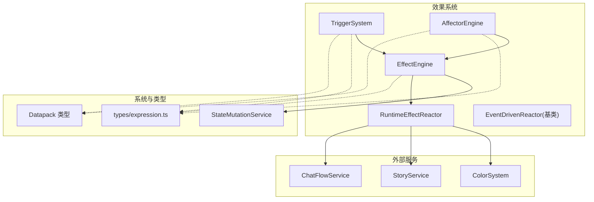
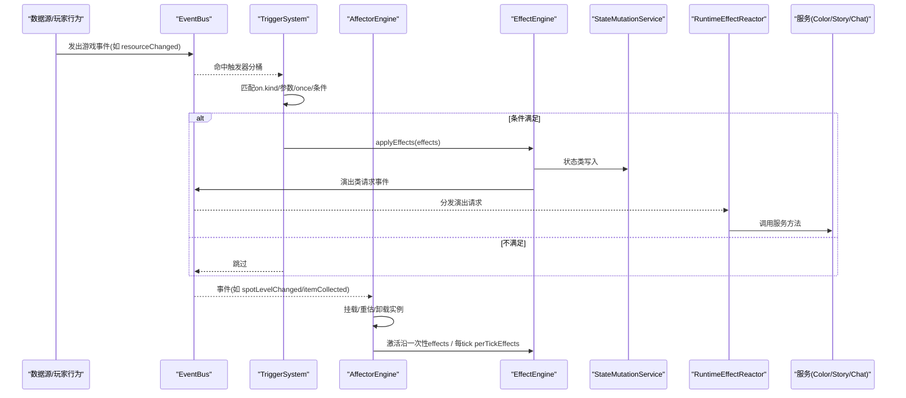
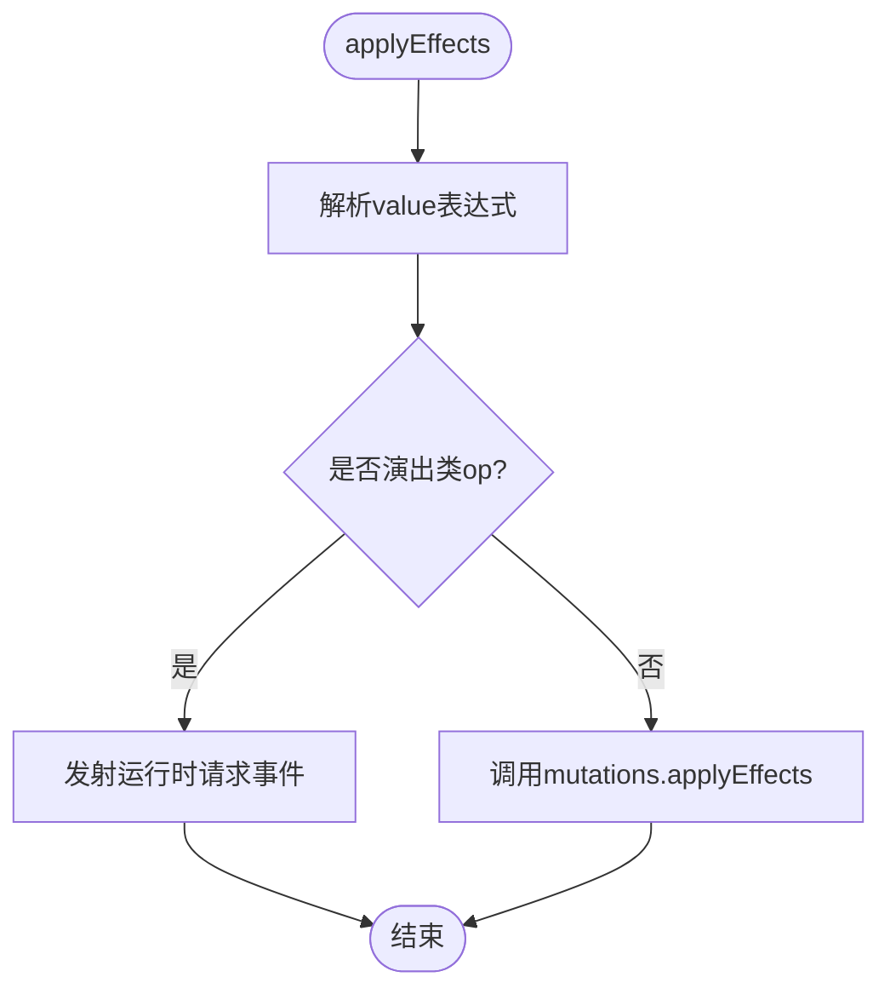
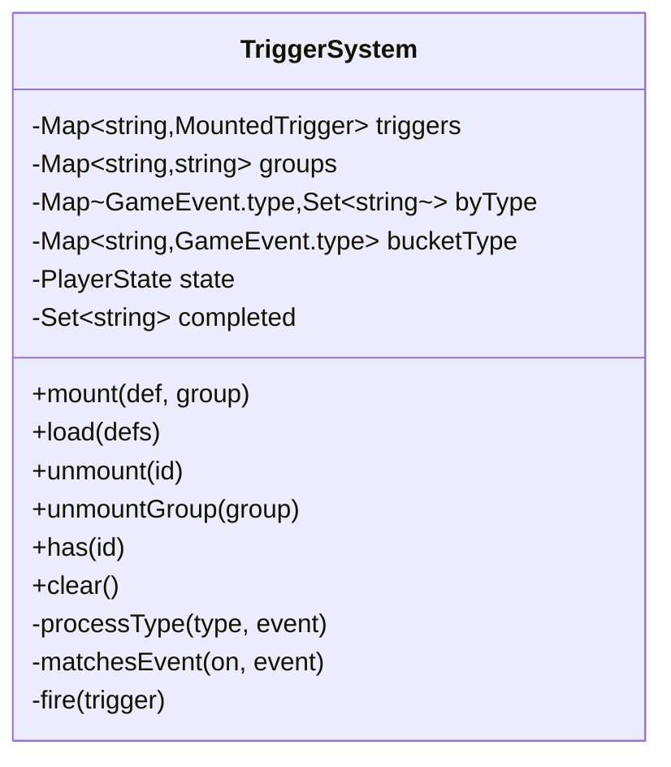
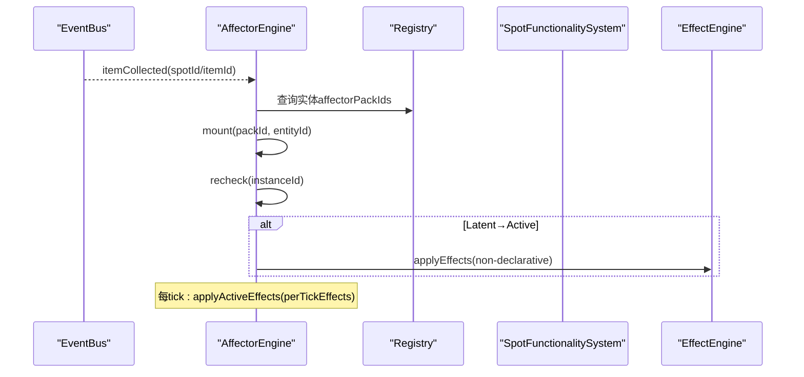
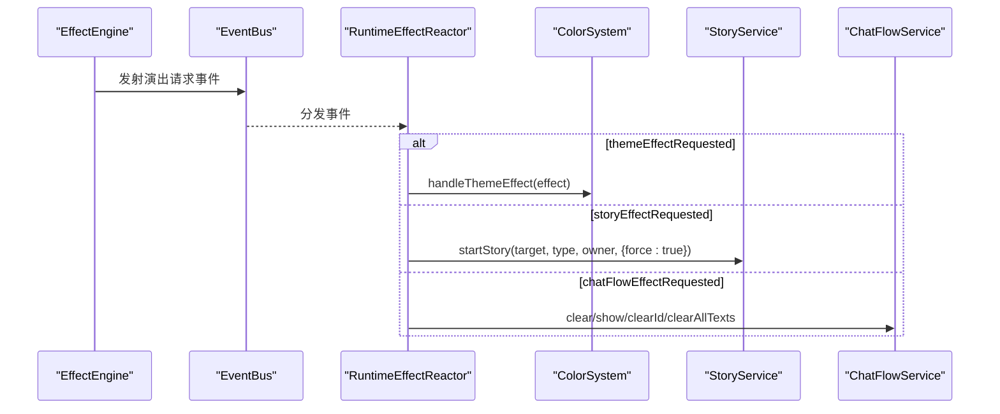
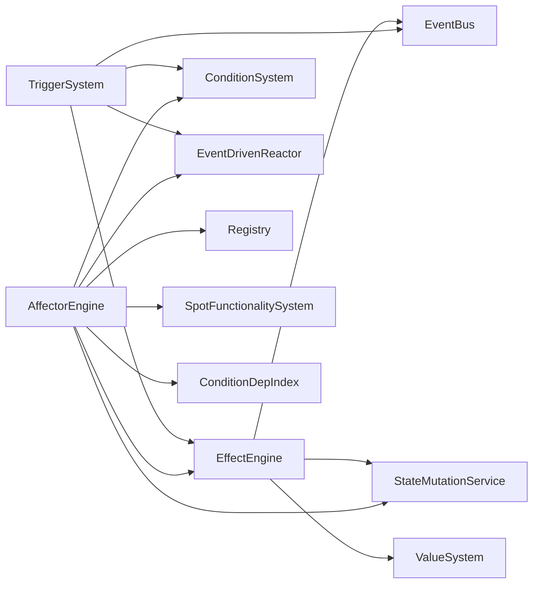

# 效果系统

<cite>
**本文引用的文件**
- [effect-engine.ts](file://src/engine/effect/effect-engine.ts)
- [trigger-system.ts](file://src/engine/effect/trigger-system.ts)
- [affector-engine.ts](file://src/engine/effect/affector-engine.ts)
- [event-driven-reactor.ts](file://src/engine/effect/event-driven-reactor.ts)
- [runtime-effect-reactor.ts](file://src/engine/effect/runtime-effect-reactor.ts)
- [affector-text.ts](file://src/engine/effect/affector-text.ts)
- [expression.ts](file://src/engine/types/expression.ts)
- [state-mutation-service.ts](file://src/engine/system/state-mutation-service.ts)
- [datapack.ts](file://src/engine/types/datapack.ts)
- [08-affector-packs.json](file://datapack/AronaClickerCore/08-affector-packs.json)
- [09-triggers.json](file://datapack/AronaClickerCore/09-triggers.json)
- [trigger-effect.md](file://docs-828/04-algorithms/trigger-effect.md)
- [effect-trigger.md](file://docs-828/02-modules/effect-trigger.md)
</cite>

## 更新摘要
**变更内容**
- 更新了触发器-效果处理算法的权威参考，基于docs-828目录下的最新文档
- 增强了事件驱动架构的描述，包括44种GameEvent类型的完整目录
- 完善了ZoneModifier区效果的详细说明
- 更新了Reveal信息可知阶梯系统的描述
- 强化了EffectOp分发机制的说明

## 目录
1. [简介](#简介)
2. [项目结构](#项目结构)
3. [核心组件](#核心组件)
4. [架构总览](#架构总览)
5. [详细组件分析](#详细组件分析)
6. [依赖关系分析](#依赖关系分析)
7. [性能考量](#性能考量)
8. [故障排除指南](#故障排除指南)
9. [结论](#结论)
10. [附录：配置示例与使用模式](#附录：配置示例与使用模式)

## 简介
本技术文档围绕 ACProgram 的效果系统展开，系统性说明以下子系统的设计与实现：
- EffectEngine 效果引擎：负责解析并执行效果（Effect），将状态类写入委托给 StateMutationService，将演出类请求通过事件总线转发给运行时反应器。
- TriggerSystem 触发器系统：桥接数据包声明的 Trigger DSL，基于事件分桶订阅、条件求值与效果执行，支持 once 语义与分组生命周期管理。
- AffectorEngine 增益系统：管理 AffectorPack 实例的生命周期，按条件在 Latent/Active 间切换，提供每 Tick 持续产出与 Spot 等级上限覆盖等能力。
- 协作机制：事件传播、优先级处理、资源管理与冲突解决（如 Spot 等级上限覆盖）。
- 调试与监控：文本描述工具、条件依赖索引、定向重评估与轮询降级策略。

**更新** 基于docs-828权威文档，完善了事件驱动架构的详细规格，包括完整的GameEvent目录和ZoneModifier区效果机制。

## 项目结构
效果系统位于 src/engine/effect 下，配合 types、system、core 等模块共同构成"事件驱动 + 声明式配置"的运行期管线。关键文件职责如下：
- effect-engine.ts：效果执行入口，统一解析 ValueExpression，分发状态变更或演出请求事件。
- trigger-system.ts：Trigger 挂载/卸载、事件匹配、条件判断、once 完成记录与效果执行。
- affector-engine.ts：Affector 实例化、激活沿一次性发放、每 Tick 持续产出、Spot 等级上限覆盖计算与同步。
- event-driven-reactor.ts：事件驱动反应器基类，强制按类型分桶订阅，避免全量扫描。
- runtime-effect-reactor.ts：消费 EffectEngine 转发的演出类请求事件，路由到 ColorSystem/StoryService/ChatFlowService。
- affector-text.ts：面向 UI/测试的纯函数文本描述工具，穷尽 EffectOp 与 ValueExpression。
- expression.ts：数值表达式、条件、效果操作符的类型定义与声明类效果集合。
- state-mutation-service.ts：统一的状态写入管道，写状态 → 更新统计 → 发事件。
- datapack.ts：数据包汇总类型，包含 affectorPacks 与 triggerDefs。
- 数据包示例：08-affector-packs.json、09-triggers.json。

**图表来源**
- [effect-engine.ts:16-63](file://src/engine/effect/effect-engine.ts#L16-L63)
- [trigger-system.ts:49-201](file://src/engine/effect/trigger-system.ts#L49-L201)
- [affector-engine.ts:33-443](file://src/engine/effect/affector-engine.ts#L33-L443)
- [runtime-effect-reactor.ts:21-58](file://src/engine/effect/runtime-effect-reactor.ts#L21-L58)
- [event-driven-reactor.ts:15-34](file://src/engine/effect/event-driven-reactor.ts#L15-L34)
- [expression.ts:89-152](file://src/engine/types/expression.ts#L89-L152)
- [datapack.ts:46-66](file://src/engine/types/datapack.ts#L46-L66)

**章节来源**
- [effect-engine.ts:16-63](file://src/engine/effect/effect-engine.ts#L16-L63)
- [trigger-system.ts:49-201](file://src/engine/effect/trigger-system.ts#L49-L201)
- [affector-engine.ts:33-443](file://src/engine/effect/affector-engine.ts#L33-L443)
- [runtime-effect-reactor.ts:21-58](file://src/engine/effect/runtime-effect-reactor.ts#L21-L58)
- [event-driven-reactor.ts:15-34](file://src/engine/effect/event-driven-reactor.ts#L15-L34)
- [expression.ts:89-152](file://src/engine/types/expression.ts#L89-L152)
- [datapack.ts:46-66](file://src/engine/types/datapack.ts#L46-L66)

## 核心组件
- EffectEngine：批量应用效果列表，对 value 为 ValueExpression 的项进行求值；演出类 op 转为 GameEvent 由 RuntimeEffectReactor 消费；其余走 StateMutationService 持久化。
- TriggerSystem：维护触发器集合与按事件类型的分桶索引；事件到达时匹配 on.kind、参数过滤、once 完成记录、条件求值，最终调用 EffectEngine.applyEffects。
- AffectorEngine：管理 AffectorPack 注册与实例生命周期；根据 entry.condition 决定 Latent/Active；激活沿一次性发放非声明类 effects；每 Tick 仅执行 perTickEffects；计算 Spot 等级上限覆盖并缓存；监听 item/enhancement/spot 事件以动态挂载/卸载。
- EventDrivenReactor：抽象基类，强制按事件类型分桶订阅，子类只关心自身依赖的事件类型。
- RuntimeEffectReactor：消费 theme/story/chat 相关演出请求事件，路由到对应服务。
- affector-text：提供 Effect/ValueExpression/Condition 的穷尽性文本描述，便于 UI 展示与测试断言。

**更新** 基于docs-828模块文档，明确了EffectEngine的职责边界：管Effect[]执行分发、TriggerDef挂载匹配持久化、事件分桶响应器模式；不管状态落库细节和Affector持续效果。

**章节来源**
- [effect-engine.ts:16-63](file://src/engine/effect/effect-engine.ts#L16-L63)
- [trigger-system.ts:49-201](file://src/engine/effect/trigger-system.ts#L49-L201)
- [affector-engine.ts:33-443](file://src/engine/effect/affector-engine.ts#L33-L443)
- [event-driven-reactor.ts:15-34](file://src/engine/effect/event-driven-reactor.ts#L15-L34)
- [runtime-effect-reactor.ts:21-58](file://src/engine/effect/runtime-effect-reactor.ts#L21-L58)
- [affector-text.ts:18-158](file://src/engine/effect/affector-text.ts#L18-L158)

## 架构总览
效果系统的运行期流程遵循"事件驱动 + 声明式配置 + 分层生效"的原则：
- 数据层：数据包提供 affectorPacks 与 triggerDefs。
- 装载层：TriggerSystem.load 挂载触发器；AffectorEngine.load/registerPack 注册增益包。
- 事件层：各系统通过 EventBus 发布事件（如 resourceChanged、spotLevelChanged、itemCollected、storyCompleted 等）。
- 响应层：TriggerSystem 与 AffectorEngine 分别订阅感兴趣的事件，进行条件判断与效果执行。
- 状态层：StateMutationService 统一写入 PlayerState，并广播事件供下游消费。
- 演出层：RuntimeEffectReactor 消费演出类请求事件，驱动主题、剧情、聊天流等运行时表现。

**更新** 基于docs-828算法文档，完善了事件驱动联动机制，包括Trigger一次性/持续性条件触发、Effect op分发、Affector挂载持续效果、Reveal信息可知阶梯四个核心概念。

**图表来源**
- [trigger-system.ts:125-201](file://src/engine/effect/trigger-system.ts#L125-L201)
- [affector-engine.ts:56-79](file://src/engine/effect/affector-engine.ts#L56-L79)
- [effect-engine.ts:42-63](file://src/engine/effect/effect-engine.ts#L42-L63)
- [runtime-effect-reactor.ts:33-58](file://src/engine/effect/runtime-effect-reactor.ts#L33-L58)
- [state-mutation-service.ts:110-145](file://src/engine/system/state-mutation-service.ts#L110-L145)

## 详细组件分析

### EffectEngine 效果引擎
- 职责：
  - 批量应用效果：先对 value 为 ValueExpression 的项求值，再区分状态类与演出类。
  - 演出类 op 映射：setTheme、triggerStory、chatFlow 相关 op 转换为特定 GameEvent，交由 RuntimeEffectReactor 消费。
  - 状态类写入：委托 StateMutationService.applyEffects，保证统一的写状态管道。
- 关键点：
  - resolveValue：仅在 value 是 ValueExpression 且存在 ValueSystem 时求值，否则原样保留。
  - runtimeEmit：构造期建表，避免运行时分支开销。
  - setState：同时设置内部状态与 mutations 的状态引用。

**更新** 基于docs-828模块文档，明确了EffectEngine作为事件驱动执行层的职责：Effect按op分发、Trigger订阅事件跑"侦测→条件→效果"、演出类效果经请求事件转发。

**图表来源**
- [effect-engine.ts:42-63](file://src/engine/effect/effect-engine.ts#L42-L63)

**章节来源**
- [effect-engine.ts:16-63](file://src/engine/effect/effect-engine.ts#L16-L63)

### TriggerSystem 触发器系统
- 职责：
  - 挂载/卸载 Trigger（支持分组与匿名 id 派生）。
  - 事件分桶：ON_KIND_TO_EVENT 将 kind 映射到具体事件类型，仅订阅所需事件。
  - 事件匹配：按 on.kind 与参数精确匹配，支持 tick.every 节流。
  - 条件求值：调用 ConditionSystem.evaluateExpr。
  - once 语义：先落账 completed 再执行 effects，避免级联重复触发。
- 数据结构：
  - triggers：id → MountedTrigger。
  - byType：事件类型 → 触发器 id 集合。
  - bucketType：id → 所属事件类型，用于精确卸载。
  - completed：已完成触发器的 id 集合。

**更新** 基于docs-828算法文档，完善了Trigger一次性/持续性条件触发的机制：TriggerDef包含id、on、condition、effects、once、extra字段；on的TriggerEventDef.kind（9种）与Condition/Effect全枚举双向锁合；运行时订阅事件→条件满足→执行effects；触发状态持久化在PlayerState的triggerState中。

**图表来源**
- [trigger-system.ts:49-201](file://src/engine/effect/trigger-system.ts#L49-L201)

**章节来源**
- [trigger-system.ts:49-201](file://src/engine/effect/trigger-system.ts#L49-L201)

### AffectorEngine 增益系统
- 职责：
  - 加载/注册 AffectorPack（支持内联包与 id 引用）。
  - 实例生命周期：mount/unmount/recheck，幂等处理重复获得。
  - 条件依赖索引：登记 entry 条件的事件依赖，命中即定向 recheck；含 stat/未知 target 的实例转入每 Tick 轮询。
  - 激活沿一次性发放：Latent→Active 时执行非声明类 effects。
  - 每 Tick 持续产出：applyActiveEffects 仅执行 perTickEffects。
  - Spot 等级上限覆盖：getSpotMaxLevelOverrides 计算 lifted 与 maxLevels 覆盖表，缓存结果。
  - 功能同步：根据 Spot 的 linearYield 功能动态构建并挂载 pack。
- 事件监听：
  - itemCollected：挂载/卸载物品关联的 affector。
  - spotLevelChanged：重评估实例，同步 Spot 功能。
  - enhancementAdded/Removed：挂载/卸载增强关联的 affector，并同步所有 Spot 功能。
  - spotTagChanged：重新同步所有 Spot 功能。
  - 条件依赖事件：定向 recheck。

**更新** 基于docs-828算法文档，完善了Affector挂载持续效果的机制：AffectorPackDef包含entries数组，每个entry有condition、effects[]、perTickEffects?[]、flows[]、zoneModifiers[]；entry的效果分四条通道：激活沿一次性执行、每帧持续产出、唯一持续产出通道、区效果；实例不落存档，reconcileMounts按当前PlayerState对账重挂载。

**图表来源**
- [affector-engine.ts:56-79](file://src/engine/effect/affector-engine.ts#L56-L79)
- [affector-engine.ts:128-230](file://src/engine/effect/affector-engine.ts#L128-L230)
- [affector-engine.ts:377-394](file://src/engine/effect/affector-engine.ts#L377-L394)

**章节来源**
- [affector-engine.ts:33-443](file://src/engine/effect/affector-engine.ts#L33-L443)

### RuntimeEffectReactor 运行时效果反应器
- 职责：消费 EffectEngine 转发的演出类请求事件，路由到 ColorSystem/StoryService/ChatFlowService。
- 事件类型：
  - themeEffectRequested：处理临时主题。
  - storyEffectRequested：启动剧情，支持 force 抢占被动闲聊。
  - chatFlowEffectRequested：清理/显示聊天流文本。

**更新** 基于docs-828算法文档，完善了运行时效果请求的处理：EffectEngine转发演出类op→RuntimeEffectReactor消费，不落状态；themeEffectRequested→ColorSystem临时主题层；storyEffectRequested→StoryService.startStory(force)；chatFlowEffectRequested→ChatFlowService。

**图表来源**
- [effect-engine.ts:27-34](file://src/engine/effect/effect-engine.ts#L27-L34)
- [runtime-effect-reactor.ts:33-58](file://src/engine/effect/runtime-effect-reactor.ts#L33-L58)

**章节来源**
- [runtime-effect-reactor.ts:21-58](file://src/engine/effect/runtime-effect-reactor.ts#L21-L58)

### EventDrivenReactor 事件驱动反应器基类
- 设计原则：禁止 onAny 全量扫描，所有订阅必须显式声明事件类型，按类型分桶派发。
- 接口：subscribeTo(types)，onEvent(type, event) 由子类实现。

**更新** 基于docs-828模块文档，明确了EventDrivenReactor作为事件分桶响应器模式的基类，多个响应器可共用此模式。

**章节来源**
- [event-driven-reactor.ts:15-34](file://src/engine/effect/event-driven-reactor.ts#L15-L34)

### ZoneModifier 区效果系统
**新增** 基于docs-828算法文档，ZoneModifier提供区效果机制：
- category：'flat'|'mul'|'custom'|'bound'四种类型
- target：支持tag或entity引用，'*'表示该类全部实体，'global'为资源树全局层
- value：支持ValueExpression，builder modTag/modEntity同步放宽
- flat：加到flat区，经Extra节点直加总产出，不进乘区
- mul：并入mul区，同区多条记录加法合并：1+Σ(v-1)
- custom：按multiplierId分组连乘（自定义乘区）
- bound：夹取min/max，可收紧不可放宽，折叠入mul区求值

**章节来源**
- [affector-engine.ts:258-285](file://src/engine/effect/affector-engine.ts#L258-285)

### Reveal 信息可知阶梯系统
**新增** 基于docs-828算法文档，Reveal提供信息可知阶梯机制：
- revealTriggers：{reveal:'existence'|'name'|'condition'|'utility', condition}
- 阶梯：invisible → presence → partial → known → utility → purchaseable → owned
- get*Reveal统一求值，UI按stage遮挡显示（???）
- AccessStage是另一套可见性系统

**章节来源**
- [trigger-effect.md:46-50](file://docs-828/04-algorithms/trigger-effect.md#L46-L50)

### 文本描述与调试辅助
- affector-text 提供 describeEffect、describeValueExpression、describeAffectorEntry/Pack 等纯函数，覆盖全部 EffectOp 与 ValueExpression 变体，确保新增 op 编译时报错，强制补全文案。
- 名称解析通过 NameResolver 回调注入，解耦 UI 显示名服务。

**章节来源**
- [affector-text.ts:18-158](file://src/engine/effect/affector-text.ts#L18-L158)

## 依赖关系分析
- EffectEngine 依赖：
  - EventBus：发送演出类请求事件。
  - StateMutationService：状态写入。
  - ValueSystem：表达式求值（可选）。
- TriggerSystem 依赖：
  - EventBus：订阅事件。
  - ConditionSystem：条件求值。
  - EffectEngine：执行效果。
  - EventDrivenReactor：事件分桶订阅。
- AffectorEngine 依赖：
  - Registry：查询 items/enhancements/spots。
  - ConditionSystem：entry 条件求值。
  - StateMutationService：状态写入（当无 EffectEngine 时回退）。
  - EffectEngine：执行 effects（优先）或回退至 mutations。
  - SpotFunctionalitySystem：获取 Spot 的线性产出功能。
  - EventDrivenReactor：事件分桶订阅。
  - ConditionDepIndex：条件依赖索引，定向 recheck。

**更新** 基于docs-828算法文档，完善了GameEvent事件目录，共44个事件类型，EVENT_CATALOG提供purpose/emit/subscribe机器可查，新增/删除事件编译期强制同步。

**图表来源**
- [effect-engine.ts:16-63](file://src/engine/effect/effect-engine.ts#L16-L63)
- [trigger-system.ts:49-201](file://src/engine/effect/trigger-system.ts#L49-L201)
- [affector-engine.ts:33-443](file://src/engine/effect/affector-engine.ts#L33-L443)

**章节来源**
- [effect-engine.ts:16-63](file://src/engine/effect/effect-engine.ts#L16-L63)
- [trigger-system.ts:49-201](file://src/engine/effect/trigger-system.ts#L49-L201)
- [affector-engine.ts:33-443](file://src/engine/effect/affector-engine.ts#L33-L443)

## 性能考量
- 事件分桶订阅：TriggerSystem 与 AffectorEngine 均继承 EventDrivenReactor，仅订阅所需事件类型，避免 O(事件×触发器) 全扫描。
- 条件依赖索引：AffectorEngine 使用 ConditionDepIndex 登记 entry 条件的事件依赖，命中即定向 recheck；无法精确命中的实例转入每 Tick 轮询，减少无效重估。
- 快照迭代：TriggerSystem 在处理事件时对触发器集合进行快照遍历，允许 effects 执行期间动态挂载/移除。
- 激活沿一次性发放：AffectorEngine 在 Latent→Active 时一次性执行非声明类 effects，避免每 Tick 重复发放。
- Spot 等级上限覆盖缓存：getSpotMaxLevelOverrides 结果缓存，在 recheck/unmount 时失效，降低重复计算成本。
- 惰性统计上下文：StateMutationService 在事件中惰性构建 StatsContext，仅在消费方访问 stats 时深拷贝，减少每 Tick 开销。

**更新** 基于docs-828算法文档，完善了性能优化机制：flows与effects并存时的双通道警告、实例生命周期的reconcileMounts机制、区效果的不每tick全量重建策略。

## 故障排除指南
- 重复 entry id 警告：AffectorEngine 在 load/registerPack 时检测重复 entry id 并记录 devLog 警告，提示同 id entry 会被视为同时激活。
- once 触发器重复触发：确认 TriggerSystem 的 completed 集合是否正确落账；检查 effects 执行是否产生级联事件导致重复匹配。
- Spot 等级上限未生效：检查 getSpotMaxLevelOverrides 是否被正确读取；确认 setSpotMaxLevel/removeSpotMaxLevel 是否为声明类效果，并由消费方动态读取。
- 演出效果未生效：确认 EffectEngine 的 runtimeEmit 映射是否包含对应 op；检查 RuntimeEffectReactor 是否订阅了对应事件类型。
- 条件不生效：检查 ConditionSystem 求值逻辑与依赖事件；对于 stat/未知 target 的条件，确认已转入轮询实例集合并每 Tick 重估。

**更新** 基于docs-828算法文档，新增了ZoneModifier和Reveal相关的故障排除指导。

**章节来源**
- [affector-engine.ts:108-120](file://src/engine/effect/affector-engine.ts#L108-L120)
- [trigger-system.ts:194-201](file://src/engine/effect/trigger-system.ts#L194-L201)
- [affector-engine.ts:258-285](file://src/engine/effect/affector-engine.ts#L258-L285)
- [effect-engine.ts:27-34](file://src/engine/effect/effect-engine.ts#L27-L34)
- [runtime-effect-reactor.ts:33-58](file://src/engine/effect/runtime-effect-reactor.ts#L33-L58)

## 结论
ACProgram 的效果系统采用事件驱动与声明式配置相结合的设计，通过 EffectEngine、TriggerSystem、AffectorEngine 三层协作，实现了高效、可扩展、可调试的效果执行框架。其关键优势包括：
- 明确的分层职责：效果执行、触发器桥接、增益生命周期管理各司其职。
- 高性能事件处理：分桶订阅、条件依赖索引、快照迭代与缓存策略。
- 强类型与穷尽性检查：EffectOp、ValueExpression、Condition 的类型定义与文本描述工具确保新增成员时编译报错，提升可维护性。
- 灵活的运行时扩展：通过 RuntimeEffectReactor 将演出类效果与领域服务解耦，便于扩展新的运行时表现。

**更新** 基于docs-828权威文档，完善了事件驱动架构的完整性，包括44种GameEvent类型的完整目录、ZoneModifier区效果机制、Reveal信息可知阶梯系统等核心特性。

## 附录：配置示例与使用模式

### 数据包配置示例
- 增益包（AffectorPack）：
  - 参考路径：[08-affector-packs.json:1-22](file://datapack/AronaClickerCore/08-affector-packs.json#L1-L22)
  - 说明：定义 affectorPacks 数组，每个 pack 包含 entries，entry 中可声明 effects、flows、condition 等。
- 触发器（TriggerDef）：
  - 参考路径：[09-triggers.json:1-25](file://datapack/AronaClickerCore/09-triggers.json#L1-L25)
  - 说明：定义 triggerDefs 数组，每个 trigger 包含 id、on、condition、effects、once 等字段。

**章节来源**
- [08-affector-packs.json:1-22](file://datapack/AronaClickerCore/08-affector-packs.json#L1-L22)
- [09-triggers.json:1-25](file://datapack/AronaClickerCore/09-triggers.json#L1-L25)

### 效果类型与使用模式
- 状态类效果：
  - setResource/addResource：修改资源数量，经 StateMutationService 写入并广播 resourceChanged。
  - setSpotLevel/addSpotLevel：修改 Spot 等级，广播 spotLevelChanged。
  - addItem/addEnhancement/grantCharacter：获得物品/强化/角色差分，触发相应事件。
  - setFlag/setExtra/addExtra/removeExtra：标记或操作 Extra 全局层。
- 声明类效果：
  - setSpotMaxLevel/removeSpotMaxLevel：不进入执行流，由 AffectorEngine.getSpotMaxLevelOverrides 动态读取并计算覆盖。
- 演出类效果：
  - setTheme：临时主题，经 RuntimeEffectReactor 调用 ColorSystem.handleThemeEffect。
  - triggerStory：启动剧情，经 RuntimeEffectReactor 调用 StoryService.startStory。
  - clearAllChatFlow/showChatText/clearIdChatFlow/clearAllChatText：聊天流控制，经 RuntimeEffectReactor 调用 ChatFlowService。

**更新** 基于docs-828算法文档，完善了EffectOp的23种分发机制，包括状态层13种落数据、转发类8种、声明类2种的分类说明。

**章节来源**
- [expression.ts:89-152](file://src/engine/types/expression.ts#L89-L152)
- [state-mutation-service.ts:110-145](file://src/engine/system/state-mutation-service.ts#L110-L145)
- [affector-engine.ts:258-285](file://src/engine/effect/affector-engine.ts#L258-L285)
- [runtime-effect-reactor.ts:33-58](file://src/engine/effect/runtime-effect-reactor.ts#L33-L58)

### 调试与监控建议
- 使用 affector-text 的 describeEffect/describeAffectorEntry 生成人类可读文本，便于 UI 展示与测试断言。
- 关注 AffectorEngine 的 devLog 警告（如重复 entry id），及时修正数据包配置。
- 利用 TriggerSystem 的 once 语义与 completed 集合，避免重复触发导致的性能问题。
- 对于复杂条件，结合 ConditionDepIndex 的定向 recheck 机制，减少无效轮询。

**更新** 基于docs-828算法文档，新增了ZoneModifier和Reveal系统的调试指导，以及GameEvent事件的完整目录参考。

**章节来源**
- [affector-text.ts:93-158](file://src/engine/effect/affector-text.ts#L93-L158)
- [affector-engine.ts:108-120](file://src/engine/effect/affector-engine.ts#L108-L120)
- [trigger-system.ts:194-201](file://src/engine/effect/trigger-system.ts#L194-L201)

### GameEvent 事件目录
**新增** 基于docs-828算法文档，完整的GameEvent事件目录（共44个）：

**资源与生产**
- resourceChanged {resource, delta, newValue} — 生产失效驱动核心
- spotProduced {spotId, resource, amount}
- tick {frame}

**设施 Spot**
- spotLevelChanged {spotId, newLevel}
- managerChanged {spotId, newManager}
- spotTagChanged {spotId, tag, added}

**强化/物品**
- enhancementAdded/enhancementRemoved {enhancementId}
- itemCollected {itemId, count, newTotal}

**世界线/区域**
- initEntered/areaEntered
- initUnlocked {initId}
- storyAreaTraveled {areaId}

**剧情 Story**
- storyTriggered {storyId}
- storyCompleted {storyId}
- storyRewarded {storyId, source, effects, flags}

**条件/状态位**
- flagChanged {flag, value}
- extraChanged {path, value?}
- poolGateChanged {poolId, available}
- tagCollectedChanged {kind}

**Affector 生命周期**
- affectorMounted {instanceId, packId, mountEntityId}
- affectorStateChanged {instanceId, oldState, newState}
- affectorUnmounted {instanceId, reason}
- affectorEntriesChanged {instanceId}

**角色/色彩**
- characterAcquired {variantId, via, duplicate, shards, bonusResources}
- cultivated {variantId, kind: 'exp'|'star', newLevel?, newStars?}
- groupUnlocked/groupUnlocked/equipmentCollected/equipmentEquipped
- themeChanged/entityThemeChanged/entityDesignUnlocked

**抽卡/社交/被动**
- gachaResolved {poolId, count}
- passiveCooldownsChanged/studentBlockChanged/charaCustomChanged/chatReadChanged

**运行时效果请求**
- themeEffectRequested {effect}
- storyEffectRequested {effect}
- chatFlowEffectRequested {effect}

**聊天流演出**
- chatFlowCleared/chatTextClearedAll
- chatTextShown/chatTextCleared

**章节来源**
- [trigger-effect.md:52-113](file://docs-828/04-algorithms/trigger-effect.md#L52-L113)