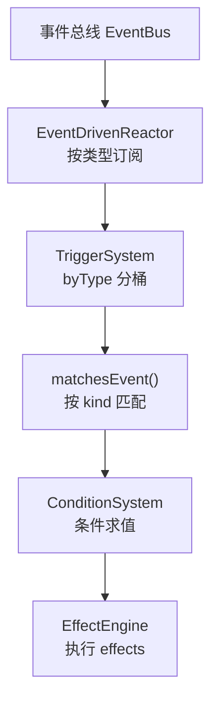
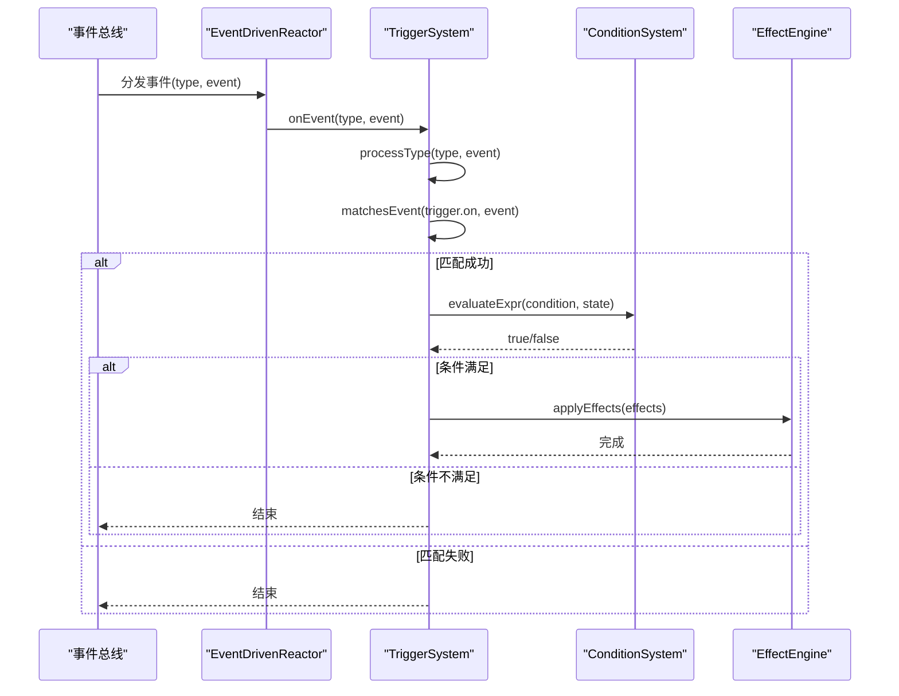
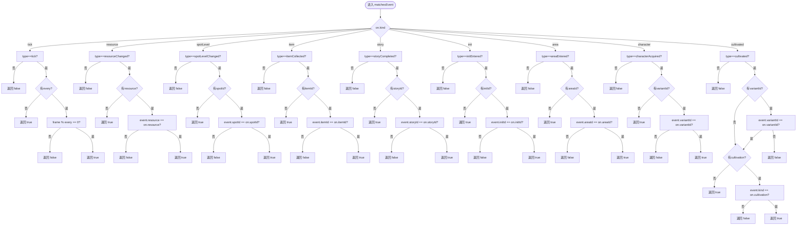
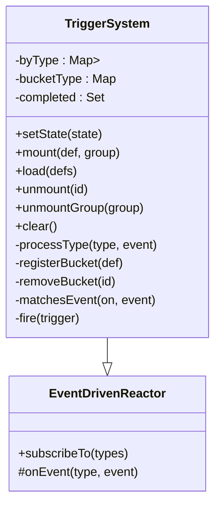
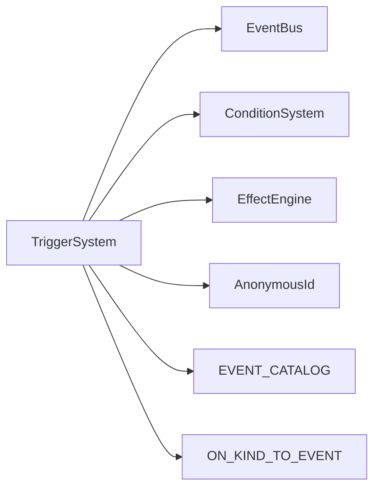

# 事件匹配与过滤

<cite>
**本文引用的文件**
- [trigger-system.ts](file://src/engine/effect/trigger-system.ts)
- [trigger.ts（类型定义）](file://src/engine/types/trigger.ts)
- [trigger.ts（定义构建器）](file://src/engine/def-factory/trigger.ts)
- [events.ts（事件类型与目录）](file://src/engine/types/events.ts)
- [event-driven-reactor.ts](file://src/engine/effect/event-driven-reactor.ts)
- [triggers.ts（基础触发器示例）](file://src/data/base/triggers.ts)
- [trigger-system.test.ts](file://tests/engine/trigger-system.test.ts)
- [trigger-kind.test.ts](file://tests/engine/trigger-kind.test.ts)
</cite>

## 目录
1. [简介](#简介)
2. [项目结构](#项目结构)
3. [核心组件](#核心组件)
4. [架构总览](#架构总览)
5. [详细组件分析](#详细组件分析)
6. [依赖关系分析](#依赖关系分析)
7. [性能考量](#性能考量)
8. [故障排查指南](#故障排查指南)
9. [结论](#结论)
10. [附录](#附录)

## 简介
本文档聚焦 ACProgram 的触发器事件匹配系统，围绕 TriggerSystem 的 matchesEvent() 方法展开，逐项说明各触发器类型的匹配规则与行为：tick、resource、spotLevel、item、story、init、area、character、cultivated。同时解释 byType 分桶索引的性能优化策略，并提供调试技巧与常见问题解决方案，帮助内容作者与引擎开发者准确理解并高效使用触发器系统。

## 项目结构
触发器系统由“声明式 DSL → 事件订阅 → 条件求值 → 效果执行”构成，关键文件如下：
- 类型定义：TriggerDef、TriggerEventDef、TriggerEventKind 等位于 types/trigger.ts
- 运行时实现：TriggerSystem 位于 effect/trigger-system.ts，负责挂载、分桶、匹配、执行
- 事件契约：GameEvent 与 EVENT_CATALOG 位于 types/events.ts
- 事件驱动基类：EventDrivenReactor 提供按类型订阅能力
- 构建器：def-factory/trigger.ts 提供链式 API 构造 TriggerDef
- 示例数据：data/base/triggers.ts 展示常用触发器用法
- 测试用例：tests/engine/trigger-system.test.ts、trigger-kind.test.ts 覆盖行为与边界

图表来源
- [event-driven-reactor.ts:15-33](file://src/engine/effect/event-driven-reactor.ts#L15-L33)
- [trigger-system.ts:20-69](file://src/engine/effect/trigger-system.ts#L20-L69)
- [trigger-system.ts:125-143](file://src/engine/effect/trigger-system.ts#L125-L143)
- [trigger-system.ts:159-192](file://src/engine/effect/trigger-system.ts#L159-L192)

章节来源
- [trigger-system.ts:1-203](file://src/engine/effect/trigger-system.ts#L1-L203)
- [trigger.ts（类型定义）:59-103](file://src/engine/types/trigger.ts#L59-L103)
- [events.ts:121-147](file://src/engine/types/events.ts#L121-L147)
- [event-driven-reactor.ts:15-33](file://src/engine/effect/event-driven-reactor.ts#L15-L33)

## 核心组件
- TriggerSystem：维护触发器集合、分组、byType 分桶、完成记录；在事件到达时进行类型路由、匹配、条件检查与效果执行。
- EventDrivenReactor：为子类提供按事件类型订阅的能力，避免 onAny 全量扫描。
- 类型与构建器：TriggerDef/TriggerEventDef 描述触发器声明；TriggerBuilder 提供链式构造。
- 事件契约：GameEvent 与 EVENT_CATALOG 明确事件类型、发射方与订阅方。

章节来源
- [trigger-system.ts:49-69](file://src/engine/effect/trigger-system.ts#L49-L69)
- [event-driven-reactor.ts:15-33](file://src/engine/effect/event-driven-reactor.ts#L15-L33)
- [trigger.ts（类型定义）:59-103](file://src/engine/types/trigger.ts#L59-L103)
- [trigger.ts（定义构建器）:11-89](file://src/engine/def-factory/trigger.ts#L11-L89)
- [events.ts:121-147](file://src/engine/types/events.ts#L121-L147)

## 架构总览
触发器系统的运行流程：
- 启动时通过 ON_KIND_TO_EVENT 将每种触发器 kind 映射到具体 GameEvent 类型，仅订阅这些事件类型。
- 挂载触发器时，将其 id 加入对应事件的 byType 桶中，实现“事件只派发给关心该类型的触发器”。
- 事件到达时，processType 从桶中取出候选触发器，调用 matchesEvent 做细粒度匹配，再经 ConditionSystem 求值，最后执行 EffectEngine。
- once 语义：首次命中后记录到 completed 并持久化到 state.triggersCompleted，避免重复触发。

图表来源
- [event-driven-reactor.ts:20-33](file://src/engine/effect/event-driven-reactor.ts#L20-L33)
- [trigger-system.ts:125-143](file://src/engine/effect/trigger-system.ts#L125-L143)
- [trigger-system.ts:159-192](file://src/engine/effect/trigger-system.ts#L159-L192)

## 详细组件分析

### matchesEvent() 匹配逻辑详解
matchesEvent() 根据 on.kind 分支判断事件是否匹配，支持可选字段过滤：
- tick：要求事件类型为 tick；若配置 every，则仅在 frame % every === 0 时匹配，用于分频采样。
- resource：要求事件类型为 resourceChanged；若配置 resource，则需资源名称一致。
- spotLevel：要求事件类型为 spotLevelChanged；若配置 spotId，则需设施 ID 一致。
- item：要求事件类型为 itemCollected；若配置 itemId，则需物品 ID 一致。
- story：要求事件类型为 storyCompleted；若配置 storyId，则需剧情 ID 一致。
- init：要求事件类型为 initEntered；若配置 initId，则需世界线 ID 一致。
- area：要求事件类型为 areaEntered；若配置 areaId，则需区域 ID 一致。
- character：要求事件类型为 characterAcquired；若配置 variantId，则需角色差分 ID 一致。
- cultivated：要求事件类型为 cultivated；若配置 variantId，则需角色差分 ID 一致；若配置 cultivation，则需培养方式（exp/star）一致。

图表来源
- [trigger-system.ts:159-192](file://src/engine/effect/trigger-system.ts#L159-L192)

章节来源
- [trigger-system.ts:159-192](file://src/engine/effect/trigger-system.ts#L159-L192)
- [trigger.ts（类型定义）:61-77](file://src/engine/types/trigger.ts#L61-L77)

### 各触发器类型匹配规则与行为
- tick 触发器
  - 每帧事件 type=tick；可设置 every 控制采样频率（如 every=60 表示每秒一次）。
  - 注意：高频 resourceChanged 不会误触发 tick 触发器，因为 byType 分桶确保 tick 只在 tick 事件到来时处理。
- resource 触发器
  - 监听资源变化事件；可通过 resource 字段精确过滤目标资源。
- spotLevel 触发器
  - 监听设施等级变化；可通过 spotId 限定特定设施。
- item 触发器
  - 监听物品收集事件；可通过 itemId 限定特定物品。
- story 触发器
  - 监听剧情完成事件；可通过 storyId 限定特定剧情。
- init 触发器
  - 监听进入世界线事件；可通过 initId 限定特定世界线。
- area 触发器
  - 监听区域切换事件；可通过 areaId 限定特定区域。
- character 触发器
  - 监听角色获得事件；可通过 variantId 限定特定角色差分；缺省则任意角色。
- cultivated 触发器
  - 监听培养变更事件；可通过 variantId 限定角色差分；可通过 cultivation 限定 exp/star 两种培养方式。

章节来源
- [trigger-system.ts:159-192](file://src/engine/effect/trigger-system.ts#L159-L192)
- [events.ts:14-53](file://src/engine/types/events.ts#L14-L53)
- [trigger-kind.test.ts:44-94](file://tests/engine/trigger-kind.test.ts#L44-L94)

### 事件过滤与 byType 分桶索引机制
- 分桶目的：避免 O(事件×触发器) 的全量扫描，将每个事件仅投递给关心该类型的触发器集合。
- 实现要点：
  - ON_KIND_TO_EVENT 将 kind 映射到具体事件类型，构造函数中仅订阅这些事件类型。
  - registerBucket 将触发器 id 加入对应事件的 Set 桶；unmount/unmountGroup 时移除。
  - processType 从桶中迭代候选触发器，快照遍历以允许 effects 期间动态挂载/移除。
- 性能收益：
  - 高频 resourceChanged 不再触发 tick 触发器匹配。
  - 新增触发器只需更新一个桶，查询成本近似 O(1)。
  - 卸载时精确移除，避免悬挂引用。

图表来源
- [trigger-system.ts:49-157](file://src/engine/effect/trigger-system.ts#L49-L157)
- [event-driven-reactor.ts:15-33](file://src/engine/effect/event-driven-reactor.ts#L15-L33)

章节来源
- [trigger-system.ts:53-69](file://src/engine/effect/trigger-system.ts#L53-L69)
- [trigger-system.ts:125-157](file://src/engine/effect/trigger-system.ts#L125-L157)
- [trigger-system.test.ts:191-205](file://tests/engine/trigger-system.test.ts#L191-L205)

### 一次性触发与状态持久化
- once=true（默认）：首次命中后将 trigger.id 写入 state.triggersCompleted，并在 fire 前检查 completed 集合，避免重复触发。
- 读档恢复：setState 时会从 state.triggersCompleted 重建 completed，保证存档间一致性。
- 重新挂载：同 id 的 once 触发器即使被卸载再挂载，也不会重复触发。

章节来源
- [trigger-system.ts:71-75](file://src/engine/effect/trigger-system.ts#L71-L75)
- [trigger-system.ts:194-201](file://src/engine/effect/trigger-system.ts#L194-L201)
- [trigger-system.test.ts:87-102](file://tests/engine/trigger-system.test.ts#L87-L102)
- [trigger-system.test.ts:143-173](file://tests/engine/trigger-system.test.ts#L143-L173)

### 构建器与示例用法
- TriggerBuilder 提供链式 API：onTick/onResource/onSpotLevel/onItem/onStory/onInit/onArea/when/effects/once/extra/build。
- data/base/triggers.ts 展示了常见触发器模式：按统计阈值发放奖励、按设施标签计数解锁 flag、按剧情完成发放物品等。

章节来源
- [trigger.ts（定义构建器）:11-89](file://src/engine/def-factory/trigger.ts#L11-L89)
- [triggers.ts:11-105](file://src/data/base/triggers.ts#L11-L105)

## 依赖关系分析
- TriggerSystem 依赖：
  - EventBus：通过 EventDrivenReactor 订阅事件类型。
  - ConditionSystem：对 condition 表达式求值。
  - EffectEngine：执行 effects。
  - 匿名 ID 派生：用于匿名触发器的确定性身份。
- 事件契约：
  - ON_KIND_TO_EVENT 与 EVENT_CATALOG 双向锁合，新增 kind 或事件类型需在两处同步，否则编译期报错。
- 测试验证：
  - trigger-kind.test.ts 验证 kind 全集覆盖与映射正确性。
  - trigger-system.test.ts 验证 once、repeatable、分桶派发等行为。

图表来源
- [trigger-system.ts:20-26](file://src/engine/effect/trigger-system.ts#L20-L26)
- [events.ts:121-147](file://src/engine/types/events.ts#L121-L147)

章节来源
- [trigger-system.ts:20-26](file://src/engine/effect/trigger-system.ts#L20-L26)
- [trigger-kind.test.ts:15-42](file://tests/engine/trigger-kind.test.ts#L15-L42)
- [trigger-system.test.ts:25-102](file://tests/engine/trigger-system.test.ts#L25-L102)

## 性能考量
- byType 分桶：
  - 每个事件仅投递到关心的触发器集合，消除全量扫描。
  - 注册/卸载均为 O(1)，迭代采用快照避免并发修改问题。
- 事件订阅最小化：
  - 仅订阅 ON_KIND_TO_EVENT 中的事件类型，减少无关事件开销。
- 分频 tick：
  - 通过 every 降低高频 tick 的处理频率，适合周期性任务。
- 条件求值与效果执行：
  - 条件仅在匹配成功后求值，避免无谓计算。
  - 效果执行可能产生级联事件，但 byType 仍保持高效路由。

[本节为通用性能建议，无需特定文件来源]

## 故障排查指南
- 触发器未触发
  - 检查 on.kind 与事件类型是否匹配（参考 ON_KIND_TO_EVENT）。
  - 检查可选过滤字段（如 resource、spotId、itemId、storyId、initId、areaId、variantId、cultivation）是否与事件一致。
  - 确认 once 是否已完成（查看 state.triggersCompleted）。
- tick 触发器未在资源变化时触发
  - 这是预期行为：tick 仅在 tick 事件到达时处理，resourceChanged 不会触发 tick 触发器。
- 重复触发不符合预期
  - 若希望每次事件都触发，设置 once=false。
  - 若希望仅触发一次，保持 once=true（默认），并确保条件与过滤正确。
- 条件不生效
  - 检查 condition 表达式是否正确引用状态/统计/标签。
  - 使用 ConditionSystem 的调试输出或日志定位求值结果。
- 组内触发器管理
  - 使用 unmountGroup 清理特定组的触发器（如离开世界线时）。
  - 使用 has(id) 检查触发器是否仍在系统中。

章节来源
- [trigger-system.ts:125-143](file://src/engine/effect/trigger-system.ts#L125-L143)
- [trigger-system.ts:159-192](file://src/engine/effect/trigger-system.ts#L159-L192)
- [trigger-system.test.ts:59-121](file://tests/engine/trigger-system.test.ts#L59-L121)
- [trigger-kind.test.ts:44-94](file://tests/engine/trigger-kind.test.ts#L44-L94)

## 结论
ACProgram 的触发器事件匹配系统通过明确的类型契约、byType 分桶索引与细粒度匹配规则，实现了高性能、可扩展的事件驱动逻辑。matchesEvent() 为每种触发器类型提供了清晰的匹配条件，配合 ConditionSystem 与 EffectEngine，使内容作者能够以声明式 DSL 表达复杂的游戏逻辑。通过测试覆盖与文档指引，开发者可以可靠地扩展新的触发器类型与事件，同时保持系统的一致性与性能。

[本节为总结性内容，无需特定文件来源]

## 附录
- 事件类型与用途参考：
  - resourceChanged：资源增减
  - spotLevelChanged：设施等级变化
  - itemCollected：物品收集
  - storyCompleted：剧情完成
  - initEntered：进入世界线
  - areaEntered：进入区域
  - characterAcquired：角色获得
  - cultivated：培养变更
  - tick：每帧
- 常用操作：
  - mount/load/unmount/unmountGroup/clear：生命周期管理
  - setState：设置玩家状态并恢复 once 完成记录
  - subscribeTo：按类型订阅事件

章节来源
- [events.ts:121-147](file://src/engine/types/events.ts#L121-L147)
- [trigger-system.ts:71-123](file://src/engine/effect/trigger-system.ts#L71-L123)