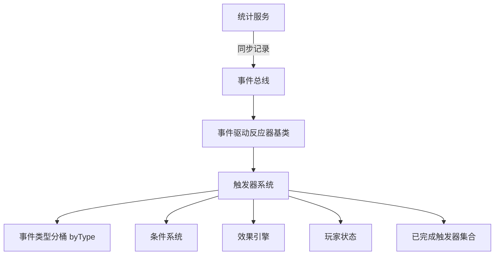
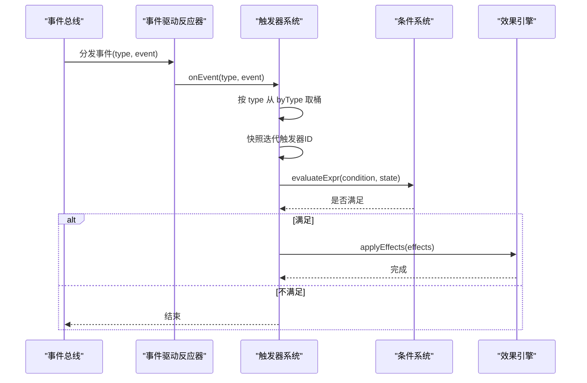
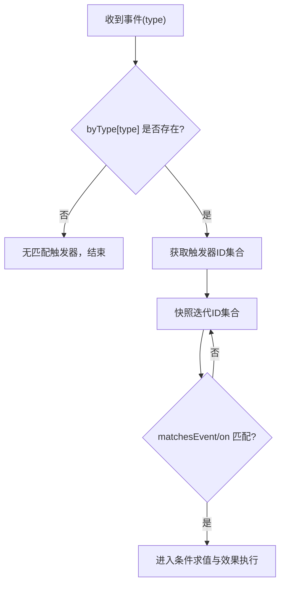
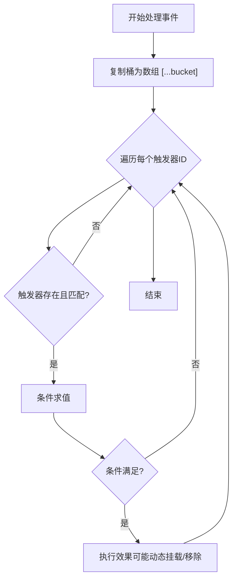
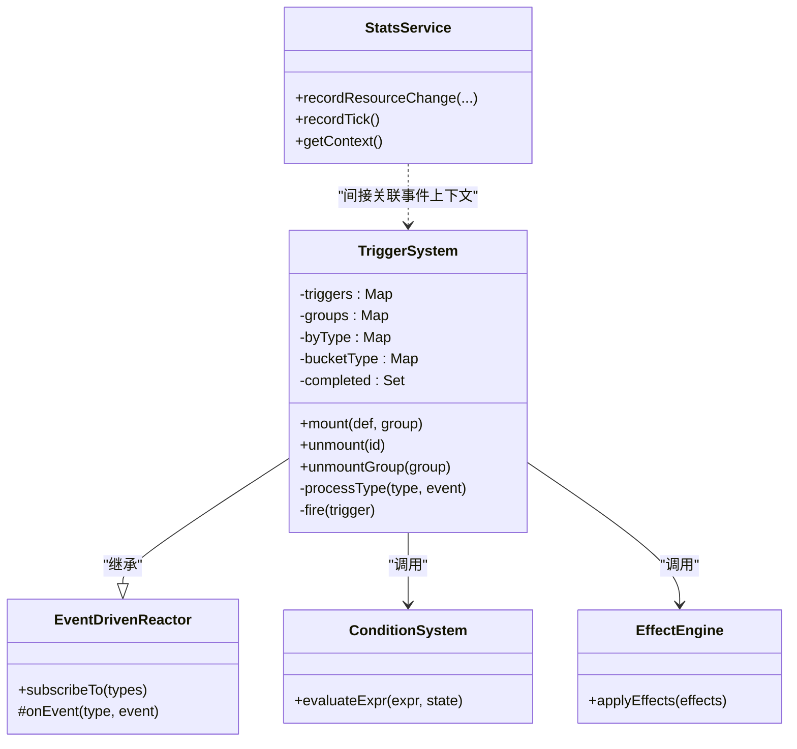

# 性能优化与监控

<cite>
**本文引用的文件**
- [trigger-system.ts](file://src/engine/effect/trigger-system.ts)
- [event-driven-reactor.ts](file://src/engine/effect/event-driven-reactor.ts)
- [stats.ts](file://src/engine/stats/stats.ts)
- [stat-dsl.ts](file://src/engine/expression/stat-dsl.ts)
- [condition-deps.ts](file://src/engine/expression/condition-deps.ts)
- [visibility-index.ts](file://src/engine/visibility/visibility-index.ts)
- [snapshot.ts](file://src/engine/game/snapshot.ts)
- [trigger-system.test.ts](file://tests/engine/trigger-system.test.ts)
</cite>

## 目录
1. [简介](#简介)
2. [项目结构](#项目结构)
3. [核心组件](#核心组件)
4. [架构总览](#架构总览)
5. [详细组件分析](#详细组件分析)
6. [依赖关系分析](#依赖关系分析)
7. [性能考量](#性能考量)
8. [故障排查指南](#故障排查指南)
9. [结论](#结论)
10. [附录](#附录)

## 简介
本文件面向 ACProgram 触发器系统的性能优化与监控，聚焦以下目标：
- 事件分桶索引（byType Map）的设计原理与 O(1) 查找机制
- 快照迭代技术，避免在遍历过程中修改集合导致的并发问题
- 内存管理机制，包括触发器对象生命周期、完成记录与弱引用策略建议
- 性能监控指标：触发器数量统计、事件处理延迟测量、内存占用分析
- 性能调优最佳实践：触发器设计原则、批量操作建议、热点优化技巧
- 性能测试方法与基准测试用例
- 常见瓶颈与解决方案：事件风暴、递归触发优化

## 项目结构
触发器系统位于引擎的效果层，围绕“事件驱动反应器”构建，采用声明式 DSL 描述触发条件与效果。关键路径：
- 事件总线订阅 → 按类型分桶派发 → 命中匹配 → 条件求值 → 执行效果
- 统计数据服务提供三层计数（全局/Init/会话），用于度量与诊断

图表来源
- [event-driven-reactor.ts:15-34](file://src/engine/effect/event-driven-reactor.ts#L15-L34)
- [trigger-system.ts:49-69](file://src/engine/effect/trigger-system.ts#L49-L69)
- [stats.ts:153-234](file://src/engine/stats/stats.ts#L153-L234)

章节来源
- [event-driven-reactor.ts:15-34](file://src/engine/effect/event-driven-reactor.ts#L15-L34)
- [trigger-system.ts:49-69](file://src/engine/effect/trigger-system.ts#L49-L69)
- [stats.ts:153-234](file://src/engine/stats/stats.ts#L153-L234)

## 核心组件
- 触发器系统：负责挂载/卸载触发器、事件分桶、命中匹配、条件求值、效果执行与 once 语义管理
- 事件驱动反应器：提供按事件类型分桶订阅与派发的通用骨架，禁止全量扫描
- 统计服务：记录资源、物品、场景等级、故事完成等变更，并提供上下文快照与 DSL 查询
- 条件依赖索引：将表达式依赖映射到具体事件类型，实现定向失效与重算
- 可见性索引：对 revealTriggers 的 gate 条件建立依赖索引，事件到达时收集受影响实体键
- 快照辅助：隔离 Spot 局部/全局状态，配合 Init 快照使用

章节来源
- [trigger-system.ts:49-203](file://src/engine/effect/trigger-system.ts#L49-L203)
- [event-driven-reactor.ts:15-34](file://src/engine/effect/event-driven-reactor.ts#L15-L34)
- [stats.ts:47-263](file://src/engine/stats/stats.ts#L47-L263)
- [condition-deps.ts:178-219](file://src/engine/expression/condition-deps.ts#L178-L219)
- [visibility-index.ts:26-44](file://src/engine/visibility/visibility-index.ts#L26-L44)
- [snapshot.ts:8-24](file://src/engine/game/snapshot.ts#L8-L24)

## 架构总览
触发器系统通过事件驱动反应器订阅有限的事件类型集合，利用 ON_KIND_TO_EVENT 将触发器 on.kind 映射为具体事件类型，从而仅订阅必要事件。事件到达后，按 byType 分桶直接定位到关心该事件的触发器集合，避免 O(事件×触发器) 的全量扫描。命中后执行条件求值与效果应用，并维护 once 完成记录。

图表来源
- [event-driven-reactor.ts:20-33](file://src/engine/effect/event-driven-reactor.ts#L20-L33)
- [trigger-system.ts:125-143](file://src/engine/effect/trigger-system.ts#L125-L143)

章节来源
- [trigger-system.ts:29-44](file://src/engine/effect/trigger-system.ts#L29-L44)
- [trigger-system.ts:125-143](file://src/engine/effect/trigger-system.ts#L125-L143)

## 详细组件分析

### 事件分桶索引（byType Map）与 O(1) 查找
- 设计要点
  - 以 GameEvent['type'] 为键的 Map 存储 Set<string> 触发器 ID 集合，实现按事件类型的 O(1) 定位
  - 通过 ON_KIND_TO_EVENT 将 TriggerEventKind 映射到具体事件类型，确保编译期类型安全
  - 注册与卸载时同步维护 byType 与 bucketType，保证一致性
- 性能收益
  - 消除 O(事件×触发器) 的全量扫描；高频 resourceChanged 不再误触发 tick 类触发器
  - 减少无效条件求值与效果执行

图表来源
- [trigger-system.ts:53-56](file://src/engine/effect/trigger-system.ts#L53-L56)
- [trigger-system.ts:130-143](file://src/engine/effect/trigger-system.ts#L130-L143)
- [trigger-system.ts:145-157](file://src/engine/effect/trigger-system.ts#L145-L157)

章节来源
- [trigger-system.ts:29-44](file://src/engine/effect/trigger-system.ts#L29-L44)
- [trigger-system.ts:53-56](file://src/engine/effect/trigger-system.ts#L53-L56)
- [trigger-system.ts:130-157](file://src/engine/effect/trigger-system.ts#L130-L157)

### 快照迭代技术（防止遍历时修改集合）
- 实现方式
  - 在 processType 中，对 byType[type] 的 Set 进行快照迭代 [...bucket]，允许 effects 执行期间动态挂载/移除触发器
- 优势
  - 避免 ConcurrentModification 异常与迭代不一致
  - 支持 effects 中的 mount/unmount 行为，提升灵活性

图表来源
- [trigger-system.ts:130-143](file://src/engine/effect/trigger-system.ts#L130-L143)

章节来源
- [trigger-system.ts:130-143](file://src/engine/effect/trigger-system.ts#L130-L143)

### 内存管理与垃圾回收策略
- 当前实现
  - 触发器对象由 Map<string, MountedTrigger> 持有强引用；unmount 时删除条目并从 byType/bucketType 清理
  - once 完成记录保存在 Set<string> completed 与 PlayerState.triggersCompleted，持久化后可跨存档复现
- 建议与注意事项
  - 对于大量临时或一次性触发器，建议在业务层及时 unmount，避免长期驻留
  - 若需避免循环引用导致 GC 无法回收，可在上层数据结构中使用弱引用模式（例如 WeakMap/WeakRef）来保存回调或外部句柄
  - 注意 triggersCompleted 列表增长；可考虑定期归档或限制长度，避免无限增长

章节来源
- [trigger-system.ts:50-58](file://src/engine/effect/trigger-system.ts#L50-L58)
- [trigger-system.ts:95-112](file://src/engine/effect/trigger-system.ts#L95-L112)
- [trigger-system.ts:194-201](file://src/engine/effect/trigger-system.ts#L194-L201)

### 性能监控指标
- 触发器数量统计
  - 可通过 triggers.size、byType 各桶大小、groups.size 等维度统计活跃触发器数量与分布
- 事件处理延迟测量
  - 在 onEvent 入口与 fire 前后打点，计算单次事件处理耗时；结合 StatsService.getContext() 获取上下文
- 内存占用分析
  - 观察 triggers Map、byType Map、completed Set 的大小变化；结合堆快照分析热点对象
- 统计服务集成
  - 资源变更、场景升级、故事完成、帧计数等均可通过 StatsService 记录，便于趋势分析与告警

章节来源
- [stats.ts:78-103](file://src/engine/stats/stats.ts#L78-L103)
- [stats.ts:153-234](file://src/engine/stats/stats.ts#L153-L234)
- [trigger-system.ts:50-58](file://src/engine/effect/trigger-system.ts#L50-L58)

### 条件依赖与定向失效
- 条件依赖索引将表达式中的 target/key 映射到具体事件类型，事件到达时只标记相关依赖，避免整树失效
- 对 tagCount、story 完成、收藏标签等场景建立精确索引，提高重算效率

章节来源
- [condition-deps.ts:178-219](file://src/engine/expression/condition-deps.ts#L178-L219)
- [visibility-index.ts:26-44](file://src/engine/visibility/visibility-index.ts#L26-L44)

### 快照与隔离
- 针对 Spot 的局部/全局状态分离，配合 Init 快照，减少不必要的数据共享与污染
- 在触发器与效果执行中，优先读取快照数据，降低并发风险

章节来源
- [snapshot.ts:8-24](file://src/engine/game/snapshot.ts#L8-L24)

## 依赖关系分析
触发器系统依赖事件驱动反应器、条件系统与效果引擎，并通过统计服务记录运行时指标。可见性索引与条件依赖共同构成定向失效网络。

图表来源
- [event-driven-reactor.ts:15-34](file://src/engine/effect/event-driven-reactor.ts#L15-L34)
- [trigger-system.ts:49-203](file://src/engine/effect/trigger-system.ts#L49-L203)
- [stats.ts:47-263](file://src/engine/stats/stats.ts#L47-L263)

章节来源
- [event-driven-reactor.ts:15-34](file://src/engine/effect/event-driven-reactor.ts#L15-L34)
- [trigger-system.ts:49-203](file://src/engine/effect/trigger-system.ts#L49-L203)
- [stats.ts:47-263](file://src/engine/stats/stats.ts#L47-L263)

## 性能考量
- 事件分桶与类型映射
  - 使用 byType Map 与 ON_KIND_TO_EVENT 将事件路由到最小集合，避免全量扫描
  - 确保新增 kind 必须补充映射，保持编译期安全
- 快照迭代
  - 在 effects 执行期间允许动态挂载/移除，但通过快照迭代避免并发问题
- 条件依赖索引
  - 将复杂条件拆解为事件级依赖，事件到达时仅对受影响部分标脏与重算
- 批量操作
  - 数据包级 load(defs[]) 批量挂载触发器，减少重复注册开销
- 热点优化
  - 对高频事件（如 resourceChanged）尽量细化 on.resource 过滤，避免宽泛匹配
  - 对 tick 触发器使用 every 参数控制频率，避免每帧都执行
- 内存管理
  - 及时 unmount 不再需要的触发器；关注 triggersCompleted 列表增长
  - 如需弱引用，可在上层回调或外部句柄中使用 WeakMap/WeakRef

章节来源
- [trigger-system.ts:29-44](file://src/engine/effect/trigger-system.ts#L29-L44)
- [trigger-system.ts:90-93](file://src/engine/effect/trigger-system.ts#L90-L93)
- [trigger-system.ts:130-143](file://src/engine/effect/trigger-system.ts#L130-L143)
- [condition-deps.ts:178-219](file://src/engine/expression/condition-deps.ts#L178-L219)

## 故障排查指南
- 常见问题
  - 触发器未触发：检查 on.kind 与事件类型映射是否正确；确认 byType 桶中存在对应触发器
  - 重复触发：确认 once 语义与 triggersCompleted 记录；检查重新挂载逻辑
  - 性能退化：排查高频事件下的宽泛匹配；增加 on.resource/item/spotId 等过滤条件
- 调试方法
  - 使用 StatsService.getContext() 获取事件上下文，结合日志定位
  - 打印 byType 桶大小与触发器数量，识别热点事件
  - 使用测试用例验证 mount/unmount、once、init-scoped 行为

章节来源
- [trigger-system.test.ts:25-102](file://tests/engine/trigger-system.test.ts#L25-L102)
- [trigger-system.test.ts:104-189](file://tests/engine/trigger-system.test.ts#L104-L189)
- [trigger-system.test.ts:191-206](file://tests/engine/trigger-system.test.ts#L191-L206)
- [stats.ts:91-103](file://src/engine/stats/stats.ts#L91-L103)

## 结论
ACProgram 触发器系统通过事件分桶索引、快照迭代与条件依赖索引实现了高效的事件路由与精准的条件求值，显著降低了 O(事件×触发器) 的全量扫描成本。配合统计服务的三层计数与上下文快照，可实现全面的性能监控与诊断。遵循触发器设计原则与批量操作建议，可有效避免事件风暴与递归触发带来的性能瓶颈。

## 附录

### 性能测试方法与基准测试用例
- 单元测试覆盖
  - 基础触发：剧情完成后触发奖励发放
  - once 语义：累计产出达到阈值后仅触发一次，并记录完成
  - 条件不满足：不触发
  - 读档持久化：once 完成记录跨存档复现
  - 挂载/卸载：动态控制触发器生效
  - 分组卸载：离开世界线时批量移除触发器
  - 重新挂载：已完成的 once 触发器不再重复触发
  - Init 作用域：进入/离开 Init 时自动挂载/卸载
  - Tick 分桶：resourceChanged 不应触发 tick 触发器
- 基准建议
  - 构造高并发 resourceChanged 事件，测量触发器处理延迟
  - 对比不同 on.filter 粒度下的命中率与处理时间
  - 评估 byType 桶大小与触发器数量的线性/非线性增长

章节来源
- [trigger-system.test.ts:25-206](file://tests/engine/trigger-system.test.ts#L25-L206)

### 常见瓶颈与解决方案
- 事件风暴
  - 现象：高频 resourceChanged 导致大量无效匹配
  - 方案：细化 on.resource 过滤；使用 every 控制 tick 频率；确保 byType 分桶有效
- 递归触发
  - 现象：effects 产生新事件引发连锁反应
  - 方案：使用快照迭代避免并发问题；拆分复杂效果为多阶段；必要时引入去抖/合并策略
- 条件求值昂贵
  - 现象：复杂表达式频繁求值
  - 方案：利用条件依赖索引定向失效；缓存中间结果；减少不必要的 stat/tag 查询

章节来源
- [trigger-system.ts:130-143](file://src/engine/effect/trigger-system.ts#L130-L143)
- [condition-deps.ts:178-219](file://src/engine/expression/condition-deps.ts#L178-L219)