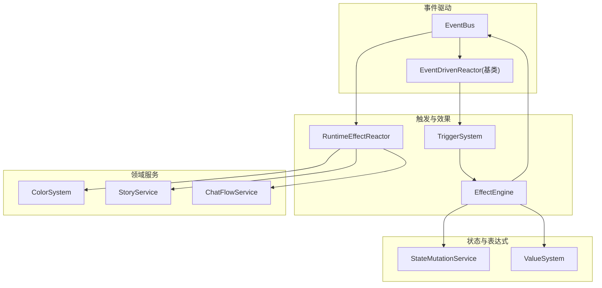
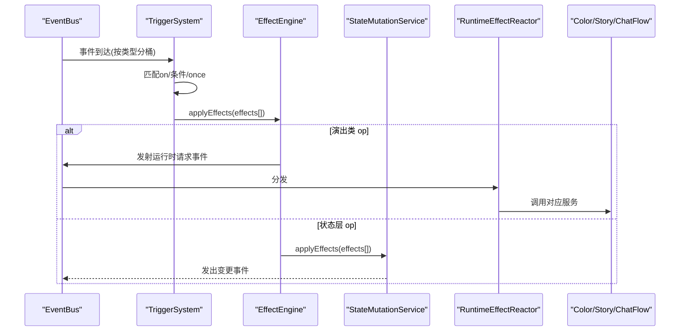
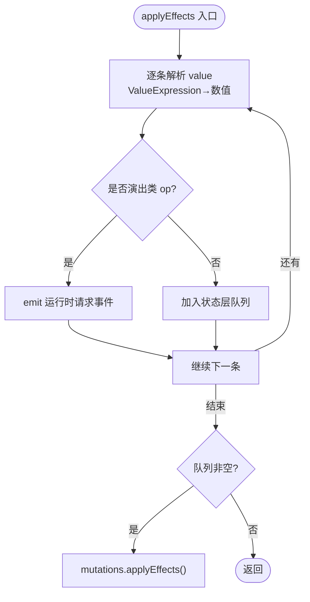
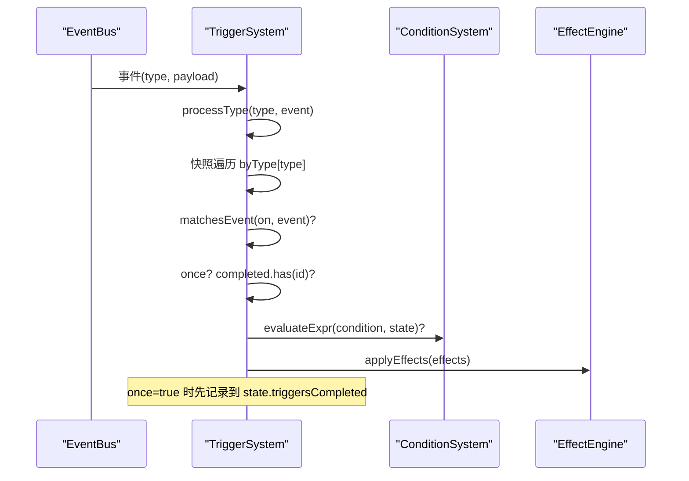
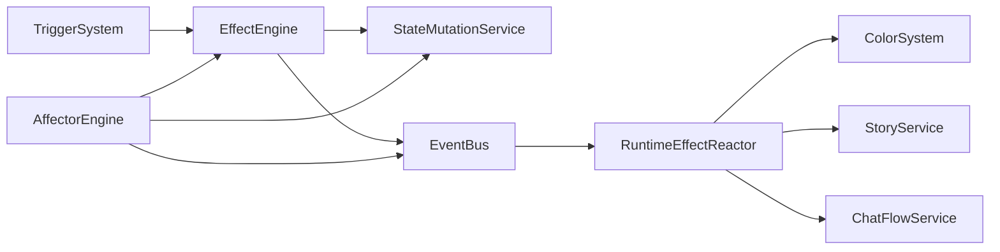

# 效果执行引擎

<cite>
**本文引用的文件**
- [effect-engine.ts](file://src/engine/effect/effect-engine.ts)
- [trigger-system.ts](file://src/engine/effect/trigger-system.ts)
- [event-driven-reactor.ts](file://src/engine/effect/event-driven-reactor.ts)
- [runtime-effect-reactor.ts](file://src/engine/effect/runtime-effect-reactor.ts)
- [affector-engine.ts](file://src/engine/effect/affector-engine.ts)
- [state-mutation-service.ts](file://src/engine/system/state-mutation-service.ts)
- [value-system.ts](file://src/engine/expression/value-system.ts)
- [expression.ts](file://src/engine/types/expression.ts)
- [trigger.ts](file://src/engine/types/trigger.ts)
- [effect-ops.ts](file://src/engine/system/effect-ops.ts)
- [session-service.ts](file://src/engine/game/session-service.ts)
- [effect-engine.test.ts](file://tests/engine/effect-engine.test.ts)
- [trigger-system.test.ts](file://tests/engine/trigger-system.test.ts)
</cite>

## 目录
1. [简介](#简介)
2. [项目结构](#项目结构)
3. [核心组件](#核心组件)
4. [架构总览](#架构总览)
5. [详细组件分析](#详细组件分析)
6. [依赖关系分析](#依赖关系分析)
7. [性能考量](#性能考量)
8. [故障排除指南](#故障排除指南)
9. [结论](#结论)
10. [附录](#附录)

## 简介
本文件面向 ACProgram 的触发器与效果系统，系统化说明 EffectEngine 在触发器系统中的集成方式、执行流程、once 语义、上下文环境、性能优化策略以及开发与调试实践。重点覆盖：
- 触发器到效果的桥接（TriggerSystem → EffectEngine）
- 同步执行模式（状态层写入）与异步执行模式（运行时请求事件）
- 效果队列管理、执行顺序控制与错误处理
- once 语义的完成记录与持久化、重入保护
- PlayerState 访问权限与作用域限制
- 批处理执行与资源复用等优化手段
- 复杂效果链示例与排错方法

## 项目结构
效果执行相关代码集中在 engine/effect 与 engine/system、engine/expression 等模块中，围绕“事件驱动反应器”骨架组织：
- EventDrivenReactor 提供分桶订阅与命中回调
- TriggerSystem 基于事件类型分桶，匹配 on/condition 后调用 EffectEngine.applyEffects
- EffectEngine 将效果分为两类：
  - 状态层效果：委托 StateMutationService.applyEffects 批量写入 PlayerState
  - 演出类效果：通过 EventBus 发射运行时请求事件，由 RuntimeEffectReactor 消费并转发至 ColorSystem / StoryService / ChatFlowService
- AffectorEngine 负责 Affector 生命周期与每 tick 产出，亦通过 EffectEngine 或 StateMutationService 应用效果

图表来源
- [event-driven-reactor.ts:15-33](file://src/engine/effect/event-driven-reactor.ts#L15-L33)
- [trigger-system.ts:49-69](file://src/engine/effect/trigger-system.ts#L49-L69)
- [effect-engine.ts:16-55](file://src/engine/effect/effect-engine.ts#L16-L55)
- [runtime-effect-reactor.ts:21-31](file://src/engine/effect/runtime-effect-reactor.ts#L21-L31)

章节来源
- [event-driven-reactor.ts:15-33](file://src/engine/effect/event-driven-reactor.ts#L15-L33)
- [trigger-system.ts:49-69](file://src/engine/effect/trigger-system.ts#L49-L69)
- [effect-engine.ts:16-55](file://src/engine/effect/effect-engine.ts#L16-L55)
- [runtime-effect-reactor.ts:21-31](file://src/engine/effect/runtime-effect-reactor.ts#L21-L31)

## 核心组件
- EventDrivenReactor：统一的事件订阅与分发骨架，禁止全量扫描，按类型分桶
- TriggerSystem：声明式触发器 DSL 桥接，事件命中 + 条件满足才执行；维护 byType 索引与 completed 集合
- EffectEngine：效果执行中枢，op 分发表驱动，区分状态层与演出类效果；支持 ValueExpression 求值
- RuntimeEffectReactor：消费演出类效果请求事件，转发到 ColorSystem / StoryService / ChatFlowService
- StateMutationService：统一的 PlayerState 写入入口，写状态 → 更新统计 → 发事件
- ValueSystem：ValueExpression 求值器，支持算术、取整、区间夹取与数据源读取
- AffectorEngine：Affector 包挂载/卸载/重估，激活沿一次性 effects，每 tick 执行 perTickEffects

章节来源
- [event-driven-reactor.ts:15-33](file://src/engine/effect/event-driven-reactor.ts#L15-L33)
- [trigger-system.ts:49-69](file://src/engine/effect/trigger-system.ts#L49-L69)
- [effect-engine.ts:16-55](file://src/engine/effect/effect-engine.ts#L16-L55)
- [runtime-effect-reactor.ts:21-31](file://src/engine/effect/runtime-effect-reactor.ts#L21-L31)
- [state-mutation-service.ts:31-40](file://src/engine/system/state-mutation-service.ts#L31-L40)
- [value-system.ts:88-149](file://src/engine/expression/value-system.ts#L88-L149)
- [affector-engine.ts:33-79](file://src/engine/effect/affector-engine.ts#L33-L79)

## 架构总览
触发器系统以事件为驱动，EffectEngine 作为效果执行的中枢，将效果分流到状态层或运行时层。AffectorEngine 在每 tick 对活跃实例进行 recheck，并在激活沿与每 tick 分别执行不同通道。

图表来源
- [trigger-system.ts:125-143](file://src/engine/effect/trigger-system.ts#L125-L143)
- [effect-engine.ts:42-55](file://src/engine/effect/effect-engine.ts#L42-L55)
- [runtime-effect-reactor.ts:33-57](file://src/engine/effect/runtime-effect-reactor.ts#L33-L57)
- [state-mutation-service.ts:87-101](file://src/engine/system/state-mutation-service.ts#L87-L101)

## 详细组件分析

### EffectEngine：效果执行中枢
- 职责
  - 接收 Effect[]，先解析 value 中的 ValueExpression 为数值（若存在 valueSystem）
  - 根据 op 分发表，将演出类效果转为运行时请求事件，其余走状态层写入
  - 维护当前 PlayerState 引用，供 ValueExpression 求值使用
- 执行顺序
  - 同一批次内按数组顺序依次处理；演出类效果立即 emit，状态层效果在过滤后统一 applyEffects
- 错误处理
  - 未提供 valueSystem 时跳过表达式求值；未知 source 在 ValueSystem 中回退为 0
- 上下文
  - setState 注入 PlayerState；仅读状态用于表达式求值，不直接修改状态

图表来源
- [effect-engine.ts:42-63](file://src/engine/effect/effect-engine.ts#L42-L63)
- [value-system.ts:111-149](file://src/engine/expression/value-system.ts#L111-L149)

章节来源
- [effect-engine.ts:16-63](file://src/engine/effect/effect-engine.ts#L16-L63)
- [value-system.ts:88-149](file://src/engine/expression/value-system.ts#L88-L149)

### TriggerSystem：触发器桥接与 once 语义
- 事件分桶
  - ON_KIND_TO_EVENT 映射事件 kind 到具体事件类型，避免全量扫描
  - byType 索引将触发器按事件类型分组，命中时只遍历相关触发器
- 匹配流程
  - 快照迭代 bucket，防止 effects 执行期间动态挂载/移除导致遍历异常
  - 依次检查 on 匹配、once 完成记录、条件表达式
- once 语义
  - 完成记录保存在 state.triggersCompleted，setState 时从存档恢复
  - 先落账再执行 effects，避免级联事件重复触发
  - 匿名 trigger 通过 deriveAnonymousId 生成稳定 id，保证跨存档复现
- 组管理
  - 支持 mount/unmount/unmountGroup/clear，便于世界线切换时挂载/卸载专属触发器

图表来源
- [trigger-system.ts:125-201](file://src/engine/effect/trigger-system.ts#L125-L201)
- [trigger.ts:79-102](file://src/engine/types/trigger.ts#L79-L102)

章节来源
- [trigger-system.ts:49-201](file://src/engine/effect/trigger-system.ts#L49-L201)
- [trigger.ts:59-102](file://src/engine/types/trigger.ts#L59-L102)

### RuntimeEffectReactor：演出类效果消费
- 订阅事件：themeEffectRequested / storyEffectRequested / chatFlowEffectRequested
- 路由逻辑
  - setTheme → ColorSystem.handleThemeEffect
  - triggerStory → StoryService.startStory（force=true 抢占被动闲聊）
  - 聊天流操作 → ChatFlowService.clearAll/showText/clearId/clearAllTexts
- 设计要点
  - 效果层不反向持有领域服务，依赖方向收敛：服务 ← Reactor ← EventBus ← EffectEngine

章节来源
- [runtime-effect-reactor.ts:21-57](file://src/engine/effect/runtime-effect-reactor.ts#L21-L57)

### AffectorEngine：持续效果与每 tick 产出
- 生命周期
  - load/registerPack → mount → recheck → active/latent/removed
  - 激活沿（Latent→Active）一次性执行 entry.effects（过滤声明类 op）
  - 每 tick 执行 entry.perTickEffects（幂等/维持类）
- 事件驱动
  - itemCollected / spotLevelChanged / enhancementAdded/Removed / spotTagChanged 等事件触发定向 recheck 或功能同步
- Spot 等级上限
  - getSpotMaxLevelOverrides 汇总 setSpotMaxLevel/removeSpotMaxLevel，remove 优先级最高
- 对账重挂载
  - reconcileMounts 按当前 PlayerState 计算期望挂载集合，补挂/卸载不一致实例

章节来源
- [affector-engine.ts:33-79](file://src/engine/effect/affector-engine.ts#L33-L79)
- [affector-engine.ts:188-230](file://src/engine/effect/affector-engine.ts#L188-L230)
- [affector-engine.ts:249-285](file://src/engine/effect/affector-engine.ts#L249-L285)
- [affector-engine.ts:377-394](file://src/engine/effect/affector-engine.ts#L377-L394)
- [affector-engine.ts:403-436](file://src/engine/effect/affector-engine.ts#L403-L436)

### StateMutationService：状态写入与事件发布
- 统一入口
  - changeResource/setResource/addSpotLevel/setManager/acquireCharacter/... 等
- 管道
  - 写 PlayerState → 更新 StatsService → emit GameEvent（惰性构建 stats 上下文）
- 效果执行
  - applyEffects/applyEffect 委托 effect-ops，内部对演出类 op 做 no-op 分支

章节来源
- [state-mutation-service.ts:31-40](file://src/engine/system/state-mutation-service.ts#L31-L40)
- [state-mutation-service.ts:87-101](file://src/engine/system/state-mutation-service.ts#L87-L101)
- [state-mutation-service.ts:556-564](file://src/engine/system/state-mutation-service.ts#L556-L564)
- [effect-ops.ts:63-82](file://src/engine/system/effect-ops.ts#L63-L82)

### ValueSystem：表达式求值
- 算子表驱动
  - 二元运算 add/sub/mul/div/min/max/pow，一元 floor/ceil/round，clamp
- 数据源
  - const/res/spotLevel/areaSpotCount/managerCount/data/funclet
- 容错
  - 未知 source 回退 0；div 除零保护

章节来源
- [value-system.ts:13-86](file://src/engine/expression/value-system.ts#L13-L86)
- [value-system.ts:111-149](file://src/engine/expression/value-system.ts#L111-L149)

## 依赖关系分析
- 单向依赖
  - EffectEngine 不反向持有领域服务，通过 EventBus 解耦
  - TriggerSystem 依赖 ConditionSystem 与 EffectEngine，不直接操作状态
  - AffectorEngine 依赖 Registry、ConditionSystem、StateMutationService/EffectEngine
- 事件总线
  - 所有状态变更通过 EventBus 广播，下游按需订阅，避免紧耦合
- 循环依赖规避
  - 通过事件化与反应器模式消除原回调处理器导致的环形依赖

图表来源
- [effect-engine.ts:16-55](file://src/engine/effect/effect-engine.ts#L16-L55)
- [trigger-system.ts:49-69](file://src/engine/effect/trigger-system.ts#L49-L69)
- [runtime-effect-reactor.ts:21-31](file://src/engine/effect/runtime-effect-reactor.ts#L21-L31)
- [affector-engine.ts:33-79](file://src/engine/effect/affector-engine.ts#L33-L79)

章节来源
- [effect-engine.ts:16-55](file://src/engine/effect/effect-engine.ts#L16-L55)
- [trigger-system.ts:49-69](file://src/engine/effect/trigger-system.ts#L49-L69)
- [runtime-effect-reactor.ts:21-31](file://src/engine/effect/runtime-effect-reactor.ts#L21-L31)
- [affector-engine.ts:33-79](file://src/engine/effect/affector-engine.ts#L33-L79)

## 性能考量
- 事件分桶与精确命中
  - TriggerSystem 按事件类型分桶，避免 O(事件×触发器) 全扫描
  - AffectorEngine 通过 ConditionDepIndex 实现条件依赖的定向 recheck
- 批处理执行
  - EffectEngine.applyEffects 批量处理，减少多次状态写入开销
  - AffectorEngine 激活沿一次性 effects，perTickEffects 仅在 Active 且声明时执行
- 惰性统计上下文
  - StateMutationService 延迟构建 StatsContext，仅在消费方访问时深拷贝
- 缓存与失效
  - AffectorEngine 缓存 Spot 等级上限覆盖结果，在 recheck/unmount 时失效
- Tick 编排
  - SessionService 启动 tick 循环，每 tick 刷新 EffectEngine 状态并 flush EventBus，确保事件及时消费

章节来源
- [trigger-system.ts:53-69](file://src/engine/effect/trigger-system.ts#L53-L69)
- [affector-engine.ts:36-79](file://src/engine/effect/affector-engine.ts#L36-L79)
- [effect-engine.ts:42-55](file://src/engine/effect/effect-engine.ts#L42-L55)
- [state-mutation-service.ts:87-101](file://src/engine/system/state-mutation-service.ts#L87-L101)
- [affector-engine.ts:249-285](file://src/engine/effect/affector-engine.ts#L249-L285)
- [session-service.ts:38-54](file://src/engine/game/session-service.ts#L38-L54)

## 故障排除指南
- once 触发重复
  - 检查 state.triggersCompleted 是否已包含该触发器 id
  - 确认触发器 id 是否为匿名且结构未变（派生 id 一致）
  - 参考测试用例验证 save/load 后 once 状态持久化
- 触发器未触发
  - 确认 on.kind 与事件类型映射正确
  - 检查 condition 表达式求值结果
  - 确认 byType 索引中是否存在该触发器
- 演出类效果无效
  - 确认 EffectEngine 已注入 EventBus 且 RuntimeEffectReactor 已订阅对应事件
  - 检查 target/value 是否符合服务预期（如 storyId、chat flow 目标）
- 每 tick 产出异常
  - 确认 perTickEffects 是否声明且幂等
  - 检查 Affector 实例是否处于 Active 状态
- 表达式求值问题
  - 确认 valueSystem 已注入 EffectEngine
  - 检查 ValueExpression 节点与数据源是否存在

章节来源
- [trigger-system.test.ts:38-102](file://tests/engine/trigger-system.test.ts#L38-L102)
- [effect-engine.test.ts:27-172](file://tests/engine/effect-engine.test.ts#L27-L172)
- [trigger-system.ts:194-201](file://src/engine/effect/trigger-system.ts#L194-L201)
- [runtime-effect-reactor.ts:33-57](file://src/engine/effect/runtime-effect-reactor.ts#L33-L57)
- [affector-engine.ts:377-394](file://src/engine/effect/affector-engine.ts#L377-L394)

## 结论
EffectEngine 作为效果执行中枢，结合 TriggerSystem 的事件驱动与 AffectorEngine 的生命周期管理，实现了高效、可维护的效果系统。通过事件分桶、批处理、惰性统计与声明类效果分离，系统在可扩展性与性能之间取得平衡。once 语义通过持久化完成记录与匿名 id 派生，保证了跨存档的一致性与重放稳定性。运行时效果通过事件化解耦，避免了环形依赖，提升了系统的可测试性与可演进性。

## 附录

### 效果开发指导原则
- 优先使用声明式 DSL（TriggerDef/AffectorPackDef），避免直接操作状态
- 一次性效果放入 effects，持续产出放入 perTickEffects，并保持幂等
- 演出类效果使用 setTheme/showChatText 等 op，交由 RuntimeEffectReactor 处理
- 表达式求值使用 ValueExpression，必要时注入 ValueSystem
- 谨慎使用 once，明确是否需要重复触发

### 调试工具与方法
- 利用单元测试验证效果与触发器行为（见 tests 目录）
- 观察 EventBus 事件流，确认事件类型与订阅者
- 检查 state.triggersCompleted 与 Affector 实例状态
- 使用 devLog（可选）输出警告信息（如重复 entry id）

### 复杂效果链执行示例
- 故事完成 → 触发奖励资源 → 解锁新区域 → 进入新区域触发剧情 → 播放聊天文本 → 清理临时文本
- 关键路径
  - storyCompleted 事件 → TriggerSystem 匹配 → EffectEngine.applyEffects → StateMutationService 写入 → RuntimeEffectReactor 消费演出效果

章节来源
- [trigger-system.test.ts:25-36](file://tests/engine/trigger-system.test.ts#L25-L36)
- [runtime-effect-reactor.ts:33-57](file://src/engine/effect/runtime-effect-reactor.ts#L33-L57)
- [state-mutation-service.ts:434-438](file://src/engine/system/state-mutation-service.ts#L434-L438)