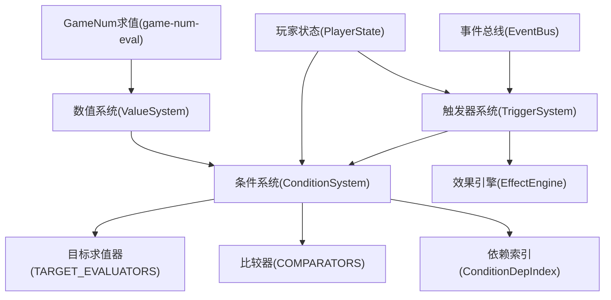
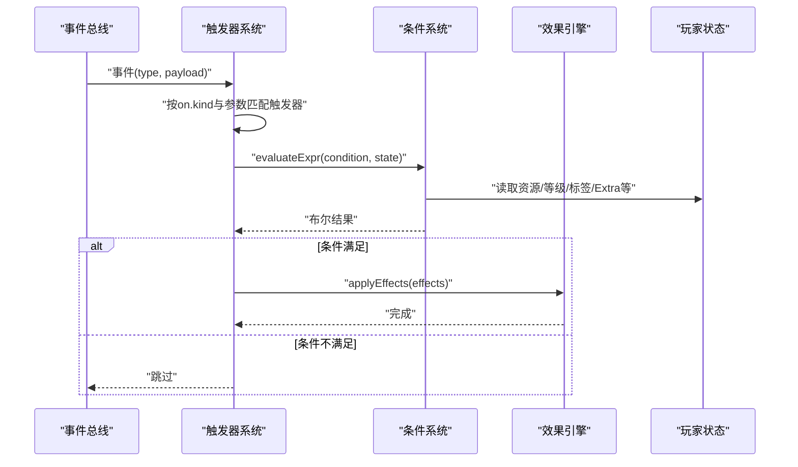
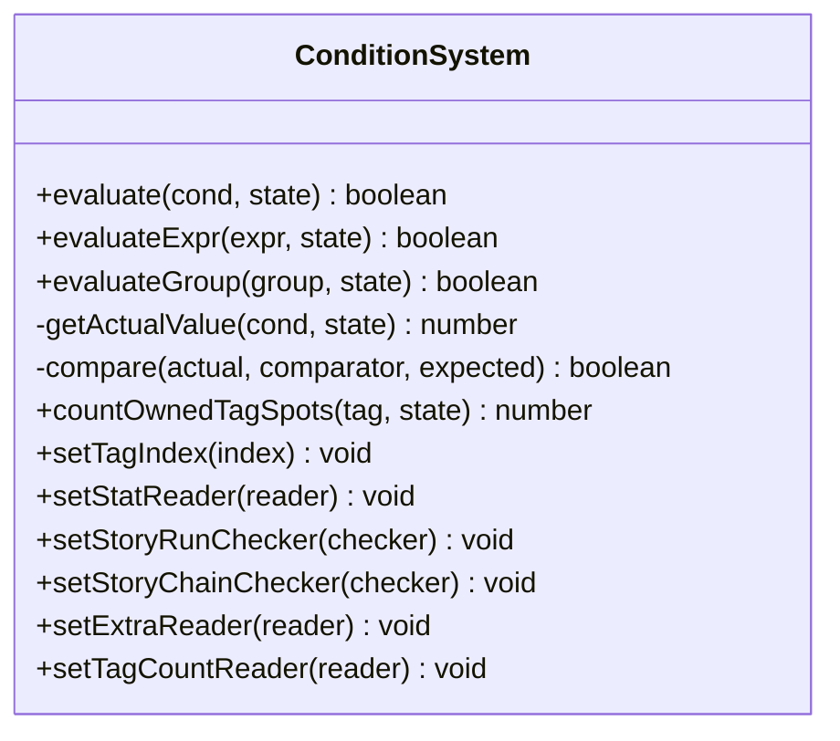
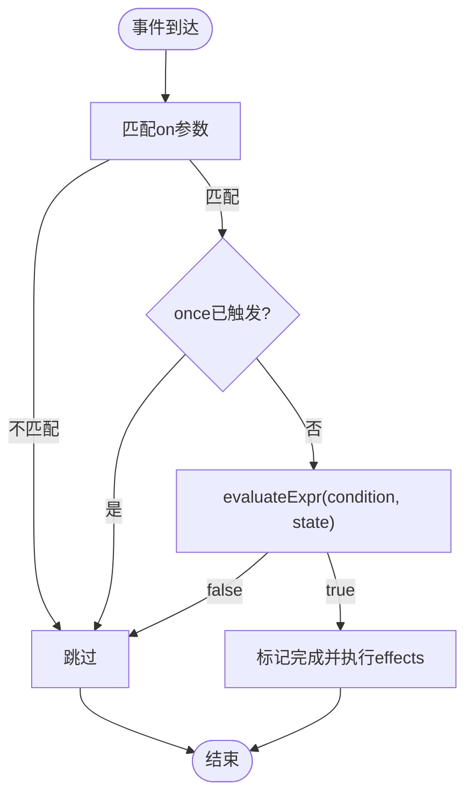
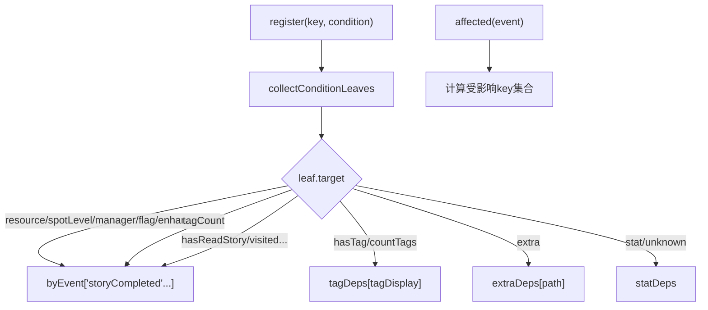
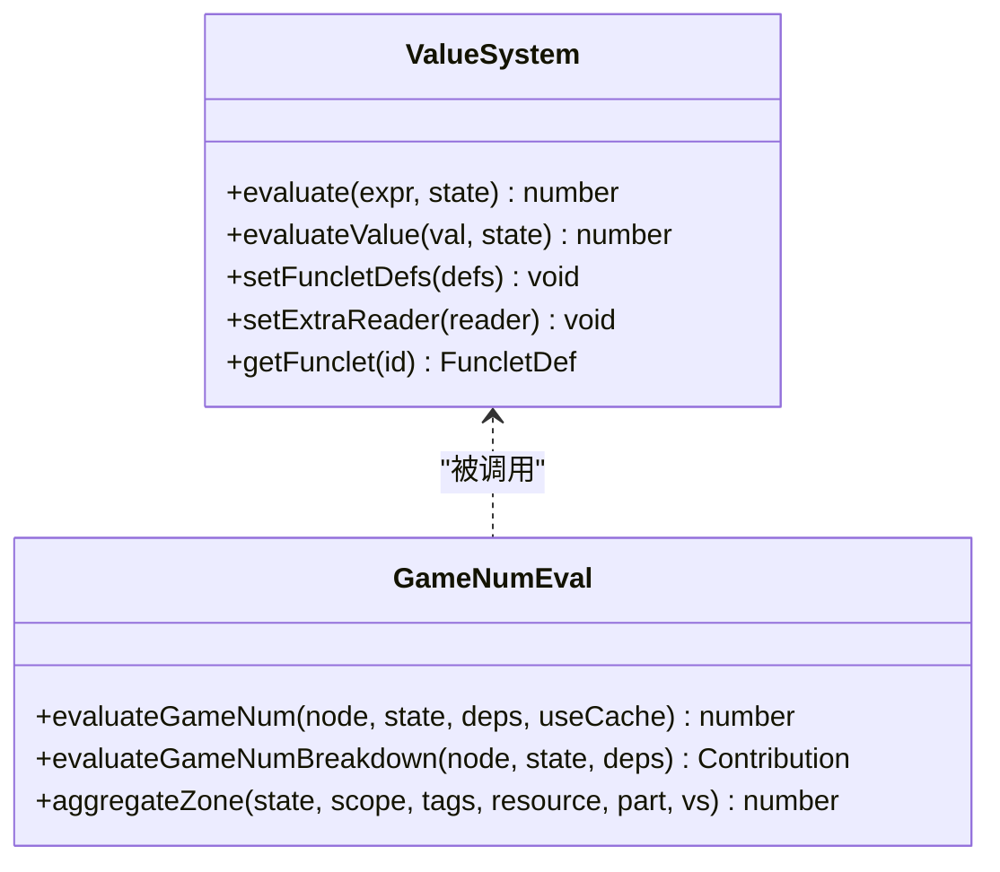
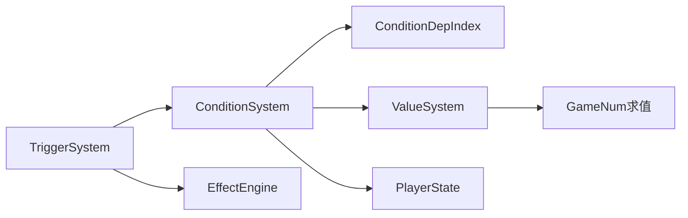

# 条件表达式求值

<cite>
**本文引用的文件**
- [condition-system.ts](file://src/engine/expression/condition-system.ts)
- [condition-deps.ts](file://src/engine/expression/condition-deps.ts)
- [expression.ts](file://src/engine/types/expression.ts)
- [trigger-system.ts](file://src/engine/effect/trigger-system.ts)
- [game-num-eval.ts](file://src/engine/expression/game-num-eval.ts)
- [value-system.ts](file://src/engine/expression/value-system.ts)
- [state.ts](file://src/engine/types/state.ts)
- [condition-system.test.ts](file://tests/engine/condition-system.test.ts)
</cite>

## 目录
1. [简介](#简介)
2. [项目结构](#项目结构)
3. [核心组件](#核心组件)
4. [架构总览](#架构总览)
5. [详细组件分析](#详细组件分析)
6. [依赖关系分析](#依赖关系分析)
7. [性能考量](#性能考量)
8. [故障排查指南](#故障排查指南)
9. [结论](#结论)
10. [附录](#附录)

## 简介
本文件面向 ACProgram 的“触发器条件表达式求值系统”，系统性说明 ConditionSystem 在触发器中的作用、条件表达式的解析与求值流程、缓存与增量失效机制、与游戏状态（PlayerState）的集成方式，以及常用表达式语法与最佳实践。文档同时覆盖数值表达式（ValueExpression/GameNum）与条件表达式（Condition/ConditionGroup）的关系，帮助读者理解从事件到条件判定再到效果执行的完整链路。

## 项目结构
围绕条件表达式求值的代码主要分布在以下模块：
- 类型定义：expression.ts 定义了 Condition、ConditionGroup、Comparator、ValueExpression、Effect 等核心类型。
- 条件求值：condition-system.ts 实现 ConditionSystem，负责单条条件与条件组的求值、比较器调度、目标求值器分发。
- 依赖索引：condition-deps.ts 提供条件叶子到事件的反向依赖索引，用于增量失效与精准重算。
- 触发器桥接：trigger-system.ts 将事件命中、条件满足与效果执行串联起来，并维护 once 语义与分组挂载。
- 数值表达式：value-system.ts 与 game-num-eval.ts 提供 ValueExpression 与 GameNum 的纯函数式求值与缓存。
- 状态模型：state.ts 定义 PlayerState、InitSnapshot、StatsSnapshot 等运行时状态结构，是条件与数值求值的唯一数据源。
- 测试用例：condition-system.test.ts 覆盖常见条件组合与边界行为。

图表来源
- [trigger-system.ts:20-69](file://src/engine/effect/trigger-system.ts#L20-L69)
- [condition-system.ts:10-137](file://src/engine/expression/condition-system.ts#L10-L137)
- [condition-deps.ts:77-220](file://src/engine/expression/condition-deps.ts#L77-L220)
- [value-system.ts:10-150](file://src/engine/expression/value-system.ts#L10-L150)
- [game-num-eval.ts:17-180](file://src/engine/expression/game-num-eval.ts#L17-L180)
- [state.ts:35-140](file://src/engine/types/state.ts#L35-L140)

章节来源
- [expression.ts:41-86](file://src/engine/types/expression.ts#L41-L86)
- [condition-system.ts:10-137](file://src/engine/expression/condition-system.ts#L10-L137)
- [trigger-system.ts:20-69](file://src/engine/effect/trigger-system.ts#L20-L69)
- [state.ts:35-140](file://src/engine/types/state.ts#L35-L140)

## 核心组件
- ConditionSystem：提供 evaluate、evaluateExpr、evaluateGroup 等方法，统一处理原子条件与 AND/OR 条件组；通过 TARGET_EVALUATORS 将 target 映射为具体数值读取逻辑；通过 COMPARATORS 完成数值比较。
- TriggerSystem：订阅事件、按事件类型分桶匹配触发器、调用 ConditionSystem 进行条件求值，并在满足时执行 EffectEngine 的效果；维护 once 完成记录与分组生命周期。
- ConditionDepIndex：构建“条件叶子 → 事件”的反向索引，支持精确事件键匹配、extra 路径前缀双向匹配、tag 宽依赖、stat 宽依赖，从而在事件发生时仅对受影响的条件进行增量重算。
- ValueSystem / GameNum 求值：提供 ValueExpression 与 GameNum 的递归求值与节点级缓存（dirty/cached），支撑复杂数值计算与区段聚合。
- PlayerState：作为唯一真实状态源，包含资源、区域等级、管理器、增强解锁、故事日志、标志位、额外数据等，供条件与数值系统读取。

章节来源
- [condition-system.ts:56-137](file://src/engine/expression/condition-system.ts#L56-L137)
- [trigger-system.ts:49-203](file://src/engine/effect/trigger-system.ts#L49-L203)
- [condition-deps.ts:38-220](file://src/engine/expression/condition-deps.ts#L38-L220)
- [value-system.ts:88-150](file://src/engine/expression/value-system.ts#L88-L150)
- [game-num-eval.ts:172-180](file://src/engine/expression/game-num-eval.ts#L172-L180)
- [state.ts:35-140](file://src/engine/types/state.ts#L35-L140)

## 架构总览
触发器系统的整体流程如下：
- 事件到达：EventBus 派发事件至 TriggerSystem。
- 事件匹配：TriggerSystem 根据 on.kind 与参数过滤候选触发器。
- 条件求值：对每个候选触发器，调用 ConditionSystem.evaluateExpr 评估条件（可为原子条件或条件组）。
- 效果执行：条件满足后，由 EffectEngine 应用 effects；若 once=true，先记录完成再执行，避免级联重复触发。
- 依赖索引：ConditionDepIndex 将条件叶子与事件建立反向索引，事件发生时仅对受影响 key 集合进行增量重算，降低全量扫描成本。

图表来源
- [trigger-system.ts:125-203](file://src/engine/effect/trigger-system.ts#L125-L203)
- [condition-system.ts:96-120](file://src/engine/expression/condition-system.ts#L96-L120)
- [state.ts:35-140](file://src/engine/types/state.ts#L35-L140)

## 详细组件分析

### ConditionSystem：条件求值与目标分发
- 目标求值器：TARGET_EVALUATORS 将 ConditionTarget 映射为实际数值读取逻辑，包括资源、区域等级、管理器、标志位、增强解锁、标签存在/计数、统计 DSL、故事阅读、当前区域、Extra 合并视图、原型统计等。未知 target 回退为 0，保持默认语义。
- 比较器：COMPARATORS 提供 ==、!=、>=、<=、>、< 六种数值比较。
- 条件组：evaluateGroup 支持 AND/OR 短路求值，可嵌套任意层级。
- 注入依赖：ConditionSystem 通过 setTagIndex、setStatReader、setStoryRunChecker、setStoryChainChecker、setExtraReader、setTagCountReader 注入外部能力，使条件能访问 Registry、StatsService、StoryService、Extra 三层视图等。

图表来源
- [condition-system.ts:56-137](file://src/engine/expression/condition-system.ts#L56-L137)

章节来源
- [condition-system.ts:17-45](file://src/engine/expression/condition-system.ts#L17-L45)
- [condition-system.ts:96-137](file://src/engine/expression/condition-system.ts#L96-L137)

### TriggerSystem：事件→条件→效果的桥接
- 事件分桶：ON_KIND_TO_EVENT 将触发器声明的 kind 映射到具体事件类型，避免对所有事件全量扫描。
- 匹配与求值：processType 遍历同类型桶中的触发器，匹配 on 参数后调用 ConditionSystem.evaluateExpr 进行条件判断。
- once 语义：fire 中先标记完成并写入状态，再执行效果，防止级联事件导致重复触发。
- 生命周期：mount/unmount/unmountGroup/clear 管理触发器的注册与移除，支持分组挂载与匿名 id 派生。

图表来源
- [trigger-system.ts:125-203](file://src/engine/effect/trigger-system.ts#L125-L203)

章节来源
- [trigger-system.ts:27-69](file://src/engine/effect/trigger-system.ts#L27-L69)
- [trigger-system.ts:125-203](file://src/engine/effect/trigger-system.ts#L125-L203)

### ConditionDepIndex：增量失效与依赖分析
- 叶子收集：collectConditionLeaves 将条件组展开为原子条件叶子，便于逐叶登记依赖。
- 事件键映射：eventEntityKeyOf 提取事件携带的实体 key（如 resource、spotId、flag、enhancementId、itemId、storyId、initId、areaId、kind），用于精确命中。
- 依赖登记：addLeaf 根据 leaf.target 将条件登记到对应事件桶、extra 路径表、tag 表或 stat 宽依赖集。
- 影响范围：affected(event) 返回受该事件影响的依赖 key 集合，支持 extra 路径前缀双向匹配、tag 宽依赖、stat 宽依赖。

图表来源
- [condition-deps.ts:38-220](file://src/engine/expression/condition-deps.ts#L38-L220)

章节来源
- [condition-deps.ts:38-220](file://src/engine/expression/condition-deps.ts#L38-L220)

### 数值表达式与状态集成：ValueSystem 与 GameNum
- ValueSystem：以算子表驱动的方式求值 ValueExpression，支持 const、res、spotLevel、areaSpotCount、managerCount、data（Extra 合并视图）、funclet 等 source，并提供 div 除零保护与 clamp 区间夹取。
- GameNum 求值：evaluateGameNum 对 GameNum 树进行递归求值，支持 add/sub/mul、owned、levelLinear、zone、affectorFlows 等节点；节点级 dirty/cached 缓存策略减少重复计算；aggregateZone 基于 state.tagEffects/entityEffects 进行区段聚合与上下限夹取。
- 状态访问：所有数值读取均通过传入的 PlayerState 进行懒读取，不缓存状态本身，确保实时性。

图表来源
- [value-system.ts:88-150](file://src/engine/expression/value-system.ts#L88-L150)
- [game-num-eval.ts:172-180](file://src/engine/expression/game-num-eval.ts#L172-L180)
- [game-num-eval.ts:117-163](file://src/engine/expression/game-num-eval.ts#L117-L163)

章节来源
- [value-system.ts:10-150](file://src/engine/expression/value-system.ts#L10-L150)
- [game-num-eval.ts:17-180](file://src/engine/expression/game-num-eval.ts#L17-L180)

### 条件表达式语法与常用类型
- 原子条件：Condition(target, key, comparator, value)，target 支持 resource、spotLevel、manager、flag、hasEnh、hasTag、countTags、tagCount、stat、hasReadStory、hasReadStoryInRun、visitedStoryInChain、extra、protoStat、area。
- 条件组：ConditionGroup(type='AND'|'OR', conditions[])，支持任意嵌套。
- 比较器：==、!=、>=、<=、>、<。
- 集合操作：hasTag 检查是否存在拥有指定 tag 的已拥有 Spot；countTags 统计拥有指定 tag 的已拥有 Spot 数量；tagCount 按 tag 聚合的收集数（key = `<kind>:<tagDisplay>`）。
- 数值表达式：ValueExpression 支持 const、value、add/sub/mul/div/min/max/pow、floor/ceil/round、clamp；GameNum 支持 owned、levelLinear、zone、affectorFlows 等更丰富的数值节点。

章节来源
- [expression.ts:41-86](file://src/engine/types/expression.ts#L41-L86)
- [expression.ts:21-40](file://src/engine/types/expression.ts#L21-L40)
- [condition-system.ts:17-45](file://src/engine/expression/condition-system.ts#L17-L45)

### 与 PlayerState 的集成与快照使用
- 直接读取：ConditionSystem 的目标求值器直接从 PlayerState 读取 resources、spotLevels、spotManagers、unlockedEnhancements、flags、storyLog、currentAreaId、protoStats 等字段。
- 间接读取：stat、extra、tagCount、storyRunChecker、storyChainChecker 通过注入的 reader/checker 访问 StatsService、Extra 三层视图、StoryService 等。
- 快照一致性：TriggerSystem 在 fire 前记录 once 完成并写入 state.triggersCompleted，保证效果执行期间状态一致；InitSnapshot 保存 per-Init 局部数据，跨 Init 全局字段由 PlayerState 顶层管理。

章节来源
- [condition-system.ts:17-45](file://src/engine/expression/condition-system.ts#L17-L45)
- [trigger-system.ts:194-203](file://src/engine/effect/trigger-system.ts#L194-L203)
- [state.ts:35-140](file://src/engine/types/state.ts#L35-L140)
- [state.ts:142-170](file://src/engine/types/state.ts#L142-L170)

## 依赖关系分析
- 松耦合设计：ConditionSystem 通过注入依赖（setXxx）与外部服务解耦，便于测试与替换实现。
- 事件分桶：TriggerSystem 按事件类型分桶，避免 O(事件×触发器) 全扫描，提升高频事件下的性能。
- 增量失效：ConditionDepIndex 将条件叶子与事件建立反向索引，事件发生时仅对受影响 key 集合进行重算，支持 extra 路径前缀双向匹配与 tag 宽依赖。
- 数值缓存：GameNum 节点级 dirty/cached 缓存策略，结合 aggregateZone 的唯一求值路径，减少重复计算。

图表来源
- [trigger-system.ts:49-69](file://src/engine/effect/trigger-system.ts#L49-L69)
- [condition-deps.ts:77-220](file://src/engine/expression/condition-deps.ts#L77-L220)
- [game-num-eval.ts:172-180](file://src/engine/expression/game-num-eval.ts#L172-L180)

章节来源
- [trigger-system.ts:49-69](file://src/engine/effect/trigger-system.ts#L49-L69)
- [condition-deps.ts:77-220](file://src/engine/expression/condition-deps.ts#L77-L220)
- [game-num-eval.ts:172-180](file://src/engine/expression/game-num-eval.ts#L172-L180)

## 性能考量
- 事件分桶与精确匹配：TriggerSystem 仅订阅关心的事件类型，并按 on.kind 与参数精确匹配，避免全量扫描。
- 增量失效：ConditionDepIndex 将条件叶子与事件建立反向索引，事件发生时仅对受影响 key 集合进行重算，显著降低高频率事件下的开销。
- 节点级缓存：GameNum 节点维护 dirty/cached，仅在源变动时重算；aggregateZone 基于 state 表聚合，避免重复计算。
- 短路求值：ConditionGroup 的 AND/OR 支持短路，尽早返回以减少不必要求值。
- 未知目标回退：TARGET_EVALUATORS 查找失败回退为 0，避免异常中断，同时保持默认语义。

[本节为通用性能讨论，无需特定文件引用]

## 故障排查指南
- 条件始终为假：
  - 检查 target/key/comparator/value 是否匹配 PlayerState 的实际字段与类型。
  - 对于 hasTag/countTags，确认 tag 层级与前缀匹配是否正确。
  - 对于 extra，确认 ExtraPath 与三层合并视图的值类型与缺失语义（缺失→0）。
- 触发器未触发：
  - 检查 on.kind 与事件类型映射是否正确。
  - 检查 once 是否已触发且记录在 state.triggersCompleted。
  - 检查分组挂载/卸载是否影响了触发器生命周期。
- 性能问题：
  - 关注高频事件（如 resourceChanged）下的条件复杂度，尽量利用 ConditionDepIndex 的精确命中。
  - 避免在条件中使用过于复杂的 stat DSL 或深层嵌套条件组。
- 调试技巧：
  - 使用 evaluateExpr 单独测试条件表达式与状态片段。
  - 借助 GameNum 的 evaluateGameNumBreakdown 输出贡献明细，定位数值来源。

章节来源
- [condition-system.test.ts:25-165](file://tests/engine/condition-system.test.ts#L25-L165)
- [trigger-system.ts:125-203](file://src/engine/effect/trigger-system.ts#L125-L203)
- [condition-deps.ts:108-148](file://src/engine/expression/condition-deps.ts#L108-L148)

## 结论
ACProgram 的条件表达式求值系统以 ConditionSystem 为核心，结合 TriggerSystem 的事件驱动与 ConditionDepIndex 的增量失效机制，实现了高效、可扩展的触发器条件判定。通过 ValueSystem 与 GameNum 的纯函数式求值与节点级缓存，系统在复杂数值计算场景下仍保持良好性能。与 PlayerState 的深度集成确保了状态一致性与实时性，而丰富的条件语法与表达式类型满足了多样化的业务需求。建议在实际使用中遵循最佳实践，合理设计条件结构与依赖索引，充分利用短路求值与缓存策略，以获得最优性能与可维护性。

[本节为总结性内容，无需特定文件引用]

## 附录
- 编写指南：
  - 优先使用原子条件与简单条件组，复杂逻辑拆分为多个触发器以降低单次求值成本。
  - 合理使用 hasTag/countTags 与 tagCount，利用 tag 层级与前缀匹配提高条件表达能力。
  - 使用 extra 条件时注意路径设计与缺失语义，避免不必要的重算。
- 最佳实践：
  - 将频繁变化的条件与稳定条件分离，减少无效求值。
  - 利用 once 语义避免重复触发，配合状态持久化保证跨存档一致性。
  - 在性能敏感路径中，优先使用精确事件匹配与增量失效。

[本节为通用指导，无需特定文件引用]