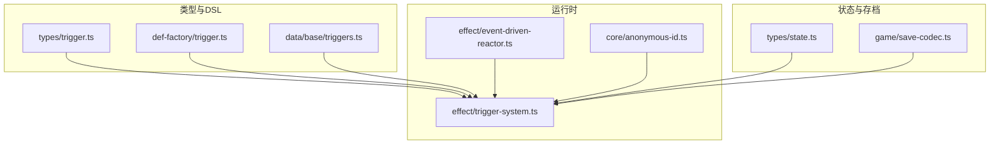
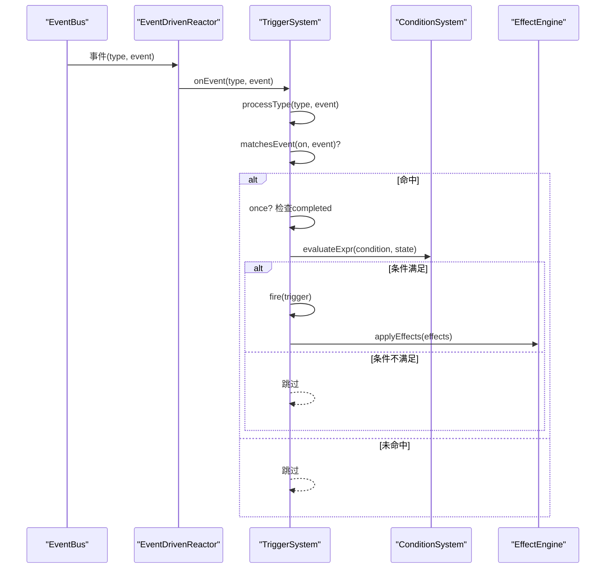
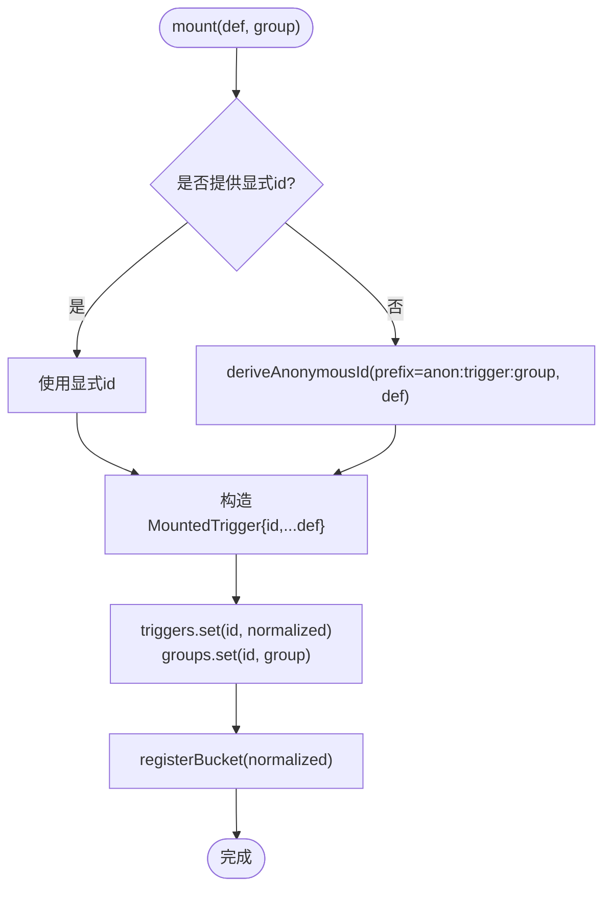
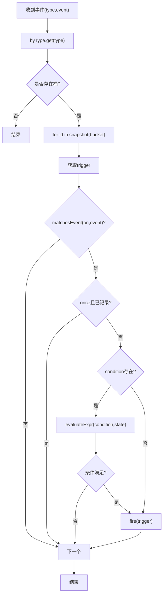
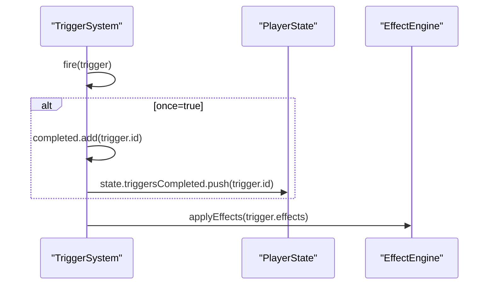
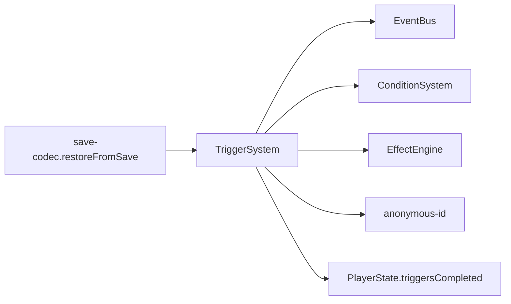
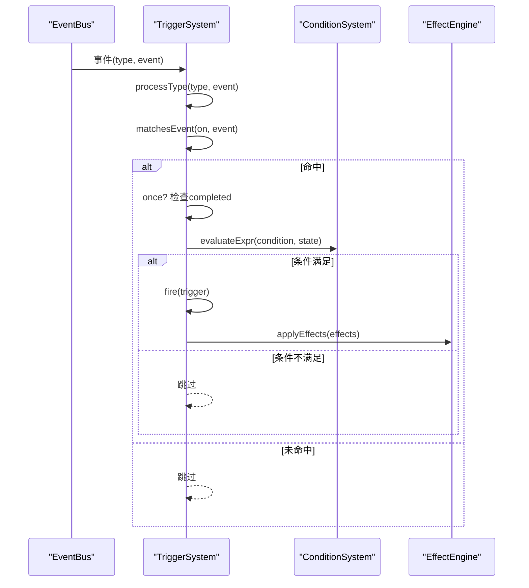

# 触发器生命周期管理

<cite>
**本文引用的文件**
- [trigger-system.ts](file://src/engine/effect/trigger-system.ts)
- [anonymous-id.ts](file://src/engine/core/anonymous-id.ts)
- [trigger.ts（类型）](file://src/engine/types/trigger.ts)
- [trigger.ts（定义工厂）](file://src/engine/def-factory/trigger.ts)
- [triggers.ts（基础示例）](file://src/data/base/triggers.ts)
- [save-codec.ts](file://src/engine/game/save-codec.ts)
- [state.ts](file://src/engine/types/state.ts)
- [event-driven-reactor.ts](file://src/engine/effect/event-driven-reactor.ts)
- [trigger-system.test.ts](file://tests/engine/trigger-system.test.ts)
</cite>

## 目录
1. [简介](#简介)
2. [项目结构](#项目结构)
3. [核心组件](#核心组件)
4. [架构总览](#架构总览)
5. [详细组件分析](#详细组件分析)
6. [依赖关系分析](#依赖关系分析)
7. [性能考量](#性能考量)
8. [故障排查指南](#故障排查指南)
9. [结论](#结论)
10. [附录](#附录)

## 简介
本文件系统化阐述 ACProgram 中 Trigger（触发器）的完整生命周期与运行机制，覆盖挂载（mount）、激活、执行与卸载（unmount）全过程；解释注册机制（显式 ID 与匿名 ID 派生）、分组管理与重复 ID 处理；文档化批量操作（load()）；说明移除机制（单个与整组）；详述状态管理（完成记录 completed set 的持久化与跨存档复现）；并提供最佳实践与性能优化建议。

## 项目结构
围绕触发器的关键代码分布在以下位置：
- 类型与 DSL：types/trigger.ts、def-factory/trigger.ts、data/base/triggers.ts
- 运行时系统：effect/trigger-system.ts、effect/event-driven-reactor.ts
- 匿名 ID 派生：core/anonymous-id.ts
- 状态与存档：types/state.ts、game/save-codec.ts
- 测试用例：tests/engine/trigger-system.test.ts

图表来源
- [trigger-system.ts:1-203](file://src/engine/effect/trigger-system.ts#L1-L203)
- [event-driven-reactor.ts:1-34](file://src/engine/effect/event-driven-reactor.ts#L1-L34)
- [anonymous-id.ts:1-43](file://src/engine/core/anonymous-id.ts#L1-L43)
- [state.ts:35-140](file://src/engine/types/state.ts#L35-L140)
- [save-codec.ts:125-172](file://src/engine/game/save-codec.ts#L125-L172)

章节来源
- [trigger-system.ts:1-203](file://src/engine/effect/trigger-system.ts#L1-L203)
- [event-driven-reactor.ts:1-34](file://src/engine/effect/event-driven-reactor.ts#L1-L34)
- [anonymous-id.ts:1-43](file://src/engine/core/anonymous-id.ts#L1-L43)
- [state.ts:35-140](file://src/engine/types/state.ts#L35-L140)
- [save-codec.ts:125-172](file://src/engine/game/save-codec.ts#L125-L172)

## 核心组件
- TriggerSystem：事件驱动反应器，负责订阅事件、匹配触发条件、执行效果、维护完成记录与分组。
- EventDrivenReactor：提供按事件类型分桶订阅与派发能力，避免全量扫描。
- Anonymous-ID：为匿名触发器生成确定性身份，保证 once 完成记录可跨存档复现。
- TriggerDef/TriggerBuilder：对外 DSL 与构建器，屏蔽底层 EventBus/ConditionSystem/EffectEngine。
- PlayerState.triggersCompleted：一次性的完成记录集合，参与存档序列化与恢复。
- SaveCodec：在读取存档时恢复状态并调用 triggerSystem.setState(state)，使完成记录生效。

章节来源
- [trigger-system.ts:49-123](file://src/engine/effect/trigger-system.ts#L49-L123)
- [event-driven-reactor.ts:15-34](file://src/engine/effect/event-driven-reactor.ts#L15-L34)
- [anonymous-id.ts:14-43](file://src/engine/core/anonymous-id.ts#L14-L43)
- [trigger.ts（类型）:79-103](file://src/engine/types/trigger.ts#L79-L103)
- [trigger.ts（定义工厂）:11-89](file://src/engine/def-factory/trigger.ts#L11-L89)
- [state.ts:74-75](file://src/engine/types/state.ts#L74-L75)
- [save-codec.ts:125-135](file://src/engine/game/save-codec.ts#L125-L135)

## 架构总览
触发器系统的整体流程如下：
- 挂载阶段：将 TriggerDef 归一化为 MountedTrigger（id 必填），加入 triggers Map，记录分组 groups，并按 on.kind 映射到事件类型，注册到 byType 桶。
- 事件到达：EventDrivenReactor 仅订阅所需事件类型；TriggerSystem.onEvent 将事件路由至 processType，按桶取出候选触发器。
- 命中判定：matchesEvent 校验事件模式；once 且已完成则跳过；condition 通过 ConditionSystem 求值。
- 执行阶段：fire 先标记完成（若 once），再调用 EffectEngine 执行 effects；完成记录同步写入 state.triggersCompleted。
- 卸载阶段：支持单条 unmount 与整组 unmountGroup，清理 triggers/groups/byType/bucketType。

图表来源
- [trigger-system.ts:125-201](file://src/engine/effect/trigger-system.ts#L125-L201)
- [event-driven-reactor.ts:20-34](file://src/engine/effect/event-driven-reactor.ts#L20-L34)

章节来源
- [trigger-system.ts:125-201](file://src/engine/effect/trigger-system.ts#L125-L201)
- [event-driven-reactor.ts:20-34](file://src/engine/effect/event-driven-reactor.ts#L20-L34)

## 详细组件分析

### 触发器注册与ID策略
- 显式 ID：用户声明 id，直接作为有效 ID。
- 匿名 ID：未提供 id 时，使用 deriveAnonymousId('anon:trigger:' + group, def) 生成稳定、可复现的 ID。同一结构在不同时间/位置产生相同 ID，确保 once 完成记录跨存档一致。
- 分组管理：mount(def, group?) 默认 global；groups 映射 id→group，用于整组移除。
- 重复 ID：后挂载的同 id 会覆盖前一个定义，便于热更新或数据包合并。

图表来源
- [trigger-system.ts:82-88](file://src/engine/effect/trigger-system.ts#L82-L88)
- [anonymous-id.ts:36-43](file://src/engine/core/anonymous-id.ts#L36-L43)

章节来源
- [trigger-system.ts:77-88](file://src/engine/effect/trigger-system.ts#L77-L88)
- [anonymous-id.ts:14-43](file://src/engine/core/anonymous-id.ts#L14-L43)

### 事件分发与命中逻辑
- ON_KIND_TO_EVENT 将 TriggerEventKind 映射到具体 GameEvent.type，新增 kind 必须在此登记，否则编译期报错，保证类型安全。
- byType 桶：每个事件类型维护一个 Set<trigger.id>，事件到达时只遍历相关触发器，避免 O(事件×触发器) 的全扫描。
- matchesEvent：对 tick/resource/spotLevel/item/story/init/area/character/cultivated 进行精确匹配，支持可选过滤字段（如 resource、spotId、itemId 等）。
- 快照迭代：processType 使用 [...bucket] 快照，允许 effects 执行期间动态挂载/移除而不影响当前批次。

图表来源
- [trigger-system.ts:130-192](file://src/engine/effect/trigger-system.ts#L130-L192)

章节来源
- [trigger-system.ts:130-192](file://src/engine/effect/trigger-system.ts#L130-L192)

### 执行与完成记录持久化
- fire：若 once=true，先将 trigger.id 加入 completed 并追加到 state.triggersCompleted，再执行 effects。这样即使 effects 引发级联事件也不会重复触发该触发器。
- 持久化：PlayerState.triggersCompleted 随存档保存；restoreFromSave 中调用 triggerSystem.setState(state)，从 state 恢复 completed 集合，从而读档后 once 不再重复触发。
- 跨存档复现：匿名触发器因结构稳定哈希，其派生 ID 与显式 ID 一样可被完成记录识别，实现“结构不变即身份不变”。

图表来源
- [trigger-system.ts:194-201](file://src/engine/effect/trigger-system.ts#L194-L201)
- [state.ts:74-75](file://src/engine/types/state.ts#L74-L75)
- [save-codec.ts:125-135](file://src/engine/game/save-codec.ts#L125-L135)

章节来源
- [trigger-system.ts:194-201](file://src/engine/effect/trigger-system.ts#L194-L201)
- [state.ts:74-75](file://src/engine/types/state.ts#L74-L75)
- [save-codec.ts:125-135](file://src/engine/game/save-codec.ts#L125-L135)

### 批量加载与生命周期
- load(defs[])：数据包级批量挂载，内部循环调用 mount。
- mount/unmount：支持运行时动态挂载/卸载；unmount 仅从内存结构中移除，不影响 completed 记录。
- unmountGroup(group)：按组移除所有触发器，常用于世界线切换时清理专属触发器。
- clear()：清空全部注册信息（通常用于测试或极端重置场景）。

章节来源
- [trigger-system.ts:90-123](file://src/engine/effect/trigger-system.ts#L90-L123)

### DSL 与构建器
- TriggerDef：描述触发器的侦测模式（on）、附加条件（condition）、效果（effects）、一次性（once）与扩展元数据（extra）。
- TriggerBuilder：链式 API 设置 onTick/onResource/onSpotLevel/onItem/onStory/onInit/onArea、when/effects/once/extra，最终 build() 产出标准 TriggerDef。
- baseTriggers：示例数据包展示了如何使用 DSL 表达常见里程碑与奖励逻辑。

章节来源
- [trigger.ts（类型）:79-103](file://src/engine/types/trigger.ts#L79-L103)
- [trigger.ts（定义工厂）:11-89](file://src/engine/def-factory/trigger.ts#L11-L89)
- [triggers.ts（基础示例）:11-105](file://src/data/base/triggers.ts#L11-L105)

## 依赖关系分析
- TriggerSystem 依赖：
  - EventBus：通过 EventDrivenReactor 订阅事件类型。
  - ConditionSystem：评估 condition。
  - EffectEngine：执行 effects。
  - anonymous-id：匿名 ID 派生。
- 状态依赖：
  - PlayerState.triggersCompleted：完成记录持久化载体。
  - save-codec：在 restoreFromSave 中调用 setState 恢复完成记录。

图表来源
- [trigger-system.ts:20-25](file://src/engine/effect/trigger-system.ts#L20-L25)
- [save-codec.ts:125-135](file://src/engine/game/save-codec.ts#L125-L135)

章节来源
- [trigger-system.ts:20-25](file://src/engine/effect/trigger-system.ts#L20-L25)
- [save-codec.ts:125-135](file://src/engine/game/save-codec.ts#L125-L135)

## 性能考量
- 事件分桶：byType 将触发器按事件类型组织，事件到达时仅遍历相关触发器，避免 O(事件×触发器) 全扫描。tick 类触发器不会被高频资源变化事件误触发。
- 快照迭代：processType 使用 [...bucket] 快照，允许 effects 执行期间动态挂载/移除，避免并发修改集合导致的异常。
- 条件短路：matchesEvent 快速过滤不匹配的事件；condition 仅在必要时求值。
- 完成记录去重：once=true 的触发器一旦完成，后续事件直接跳过，减少无效计算。
- 批量加载：load() 适合数据包初始化阶段集中挂载，减少多次 mount 的开销。

[本节为通用性能指导，无需特定文件引用]

## 故障排查指南
- 触发器未触发：
  - 检查 on.kind 是否正确映射到实际事件类型（ON_KIND_TO_EVENT）。
  - 确认 matchesEvent 的过滤字段（resource/spotId/itemId 等）是否与事件一致。
  - 验证 condition 是否满足（可通过日志或断点查看 ConditionSystem 求值结果）。
- once 触发器重复触发：
  - 确认 once 是否为 true；检查 state.triggersCompleted 是否包含该触发器 ID。
  - 对于匿名触发器，确认结构未变更导致 ID 变化。
- 动态挂载/卸载问题：
  - 使用 has(id) 确认挂载状态；unmount 后应不再接收事件。
  - 整组移除时使用 unmountGroup(group) 清理世界线专属触发器。
- 存档后行为不一致：
  - 确认 restoreFromSave 调用了 triggerSystem.setState(state) 以恢复 completed 集合。
  - 检查 PlayerState.triggersCompleted 是否被正确序列化与反序列化。

章节来源
- [trigger-system.ts:130-201](file://src/engine/effect/trigger-system.ts#L130-L201)
- [save-codec.ts:125-135](file://src/engine/game/save-codec.ts#L125-L135)
- [trigger-system.test.ts:87-102](file://tests/engine/trigger-system.test.ts#L87-L102)

## 结论
ACProgram 的触发器系统通过事件分桶、快照迭代、匿名 ID 派生与完成记录持久化，实现了高效、可靠且可复现的生命周期管理。DSL 与构建器降低了内容创作门槛，分组与批量操作提升了工程可用性。遵循本文的最佳实践与性能建议，可在复杂场景中稳定运行并易于维护。

[本节为总结性内容，无需特定文件引用]

## 附录

### 生命周期最佳实践
- 优先使用显式 ID 以便调试与追踪；需要跨包复用或结构稳定的场景可使用匿名 ID。
- 合理使用分组：将世界线/区域相关的触发器放入独立组，便于整组挂载/卸载。
- 谨慎使用 once=false：仅在确实需要重复触发时使用，避免性能与语义复杂度。
- 在 effects 中避免产生大量级联事件；如需级联，考虑拆分触发器或使用条件守卫。
- 利用 load() 在初始化阶段批量挂载，减少运行时开销。

[本节为通用指导，无需特定文件引用]

### 关键流程图：触发器执行序列

图表来源
- [trigger-system.ts:125-201](file://src/engine/effect/trigger-system.ts#L125-L201)