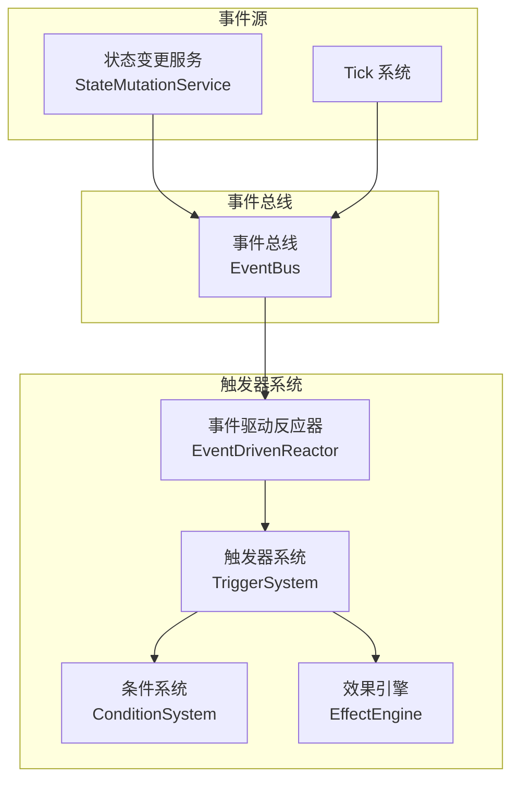
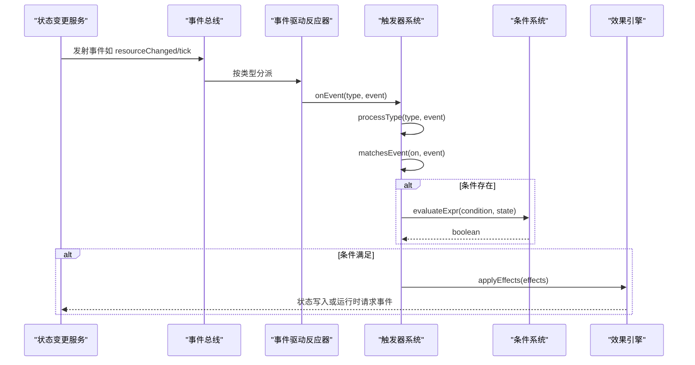
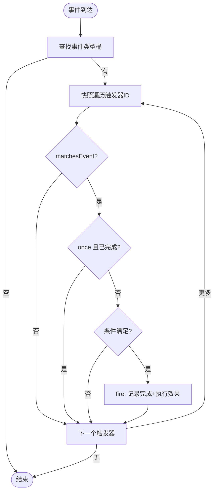
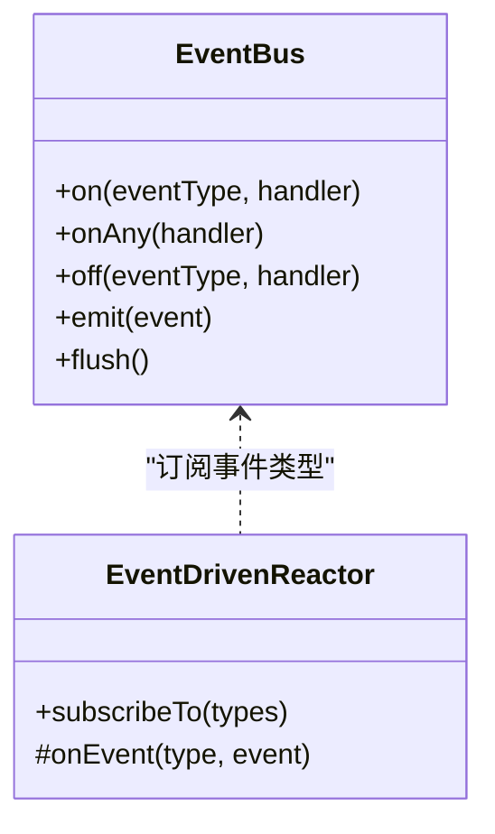
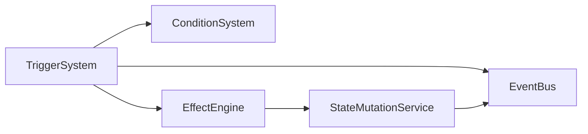

# 触发器系统

<cite>
**本文引用的文件**
- [src/engine/effect/trigger-system.ts](file://src/engine/effect/trigger-system.ts)
- [src/engine/types/trigger.ts](file://src/engine/types/trigger.ts)
- [src/engine/def-factory/trigger.ts](file://src/engine/def-factory/trigger.ts)
- [src/data/base/triggers.ts](file://src/data/base/triggers.ts)
- [src/engine/core/event-bus.ts](file://src/engine/core/event-bus.ts)
- [src/engine/effect/event-driven-reactor.ts](file://src/engine/effect/event-driven-reactor.ts)
- [src/engine/expression/condition-system.ts](file://src/engine/expression/condition-system.ts)
- [src/engine/effect/effect-engine.ts](file://src/engine/effect/effect-engine.ts)
- [src/engine/types/events.ts](file://src/engine/types/events.ts)
- [src/engine/system/state-mutation-service.ts](file://src/engine/system/state-mutation-service.ts)
- [tests/engine/trigger-system.test.ts](file://tests/engine/trigger-system.test.ts)
- [tests/engine/trigger-kind.test.ts](file://tests/engine/trigger-kind.test.ts)
</cite>

## 目录
1. [简介](#简介)
2. [项目结构](#项目结构)
3. [核心组件](#核心组件)
4. [架构总览](#架构总览)
5. [详细组件分析](#详细组件分析)
6. [依赖关系分析](#依赖关系分析)
7. [性能考量](#性能考量)
8. [故障排除指南](#故障排除指南)
9. [结论](#结论)
10. [附录](#附录)

## 简介
本文件为 ACProgram 的触发器系统技术文档，聚焦 TriggerSystem 的实现与使用。内容涵盖事件侦测机制、条件判断逻辑、响应处理流程；触发器的注册、激活与消亡生命周期管理；多种触发器类型（时间、状态变化、用户交互等）的实现方式；与事件总线的集成（订阅、优先级、并发控制）；配置示例与调试技巧；以及扩展点与自定义触发器的开发方法。

## 项目结构
触发器系统围绕“声明式 DSL → 事件总线 → 条件求值 → 效果执行”的链路组织：
- 数据层：TriggerDef 定义触发器 DSL（事件模式、条件、效果、一次性标记）。
- 引擎层：TriggerSystem 负责挂载/卸载触发器、按事件类型分桶派发、匹配事件、求值条件并执行效果。
- 基础设施：EventBus 提供事件分发；EventDrivenReactor 提供分桶订阅骨架；ConditionSystem 提供条件求值；EffectEngine 统一执行效果。
- 数据源：StateMutationService 在状态变更时发射事件，驱动触发器。

图表来源
- [src/engine/system/state-mutation-service.ts:110-135](file://src/engine/system/state-mutation-service.ts#L110-L135)
- [src/engine/core/event-bus.ts:46-75](file://src/engine/core/event-bus.ts#L46-L75)
- [src/engine/effect/event-driven-reactor.ts:20-33](file://src/engine/effect/event-driven-reactor.ts#L20-L33)
- [src/engine/effect/trigger-system.ts:60-69](file://src/engine/effect/trigger-system.ts#L60-L69)
- [src/engine/expression/condition-system.ts:96-120](file://src/engine/expression/condition-system.ts#L96-L120)
- [src/engine/effect/effect-engine.ts:42-55](file://src/engine/effect/effect-engine.ts#L42-L55)

章节来源
- [src/engine/effect/trigger-system.ts:1-203](file://src/engine/effect/trigger-system.ts#L1-L203)
- [src/engine/types/trigger.ts:59-103](file://src/engine/types/trigger.ts#L59-L103)
- [src/engine/core/event-bus.ts:1-84](file://src/engine/core/event-bus.ts#L1-L84)
- [src/engine/effect/event-driven-reactor.ts:1-35](file://src/engine/effect/event-driven-reactor.ts#L1-L35)
- [src/engine/expression/condition-system.ts:1-137](file://src/engine/expression/condition-system.ts#L1-L137)
- [src/engine/effect/effect-engine.ts:1-65](file://src/engine/effect/effect-engine.ts#L1-L65)
- [src/engine/system/state-mutation-service.ts:110-135](file://src/engine/system/state-mutation-service.ts#L110-L135)

## 核心组件
- 触发器系统（TriggerSystem）
  - 职责：挂载/卸载触发器、按事件类型分桶派发、事件匹配、条件求值、效果执行、once 完成记录。
  - 关键能力：ON_KIND_TO_EVENT 映射将触发器 kind 绑定到具体事件类型；byType 索引实现 O(1) 事件路由；processType 快照迭代避免并发修改集合。
- 事件总线（EventBus）
  - 职责：事件注册、通配订阅、批量 flush、派发。
  - 并发特性：emit 期间入队，flush 时统一派发，保证一致性。
- 事件驱动反应器（EventDrivenReactor）
  - 职责：按类型分桶订阅，禁止 onAny 全量扫描；子类仅对声明依赖的事件类型付费。
- 条件系统（ConditionSystem）
  - 职责：原子条件与条件组求值；目标求值器表（资源、设施等级、标签计数、统计 DSL、Extra 等）；比较器表。
- 效果引擎（EffectEngine）
  - 职责：解析 ValueExpression；区分状态写入与运行时请求事件（主题、剧情、聊天流）；委托 StateMutationService 写状态。

章节来源
- [src/engine/effect/trigger-system.ts:29-69](file://src/engine/effect/trigger-system.ts#L29-L69)
- [src/engine/core/event-bus.ts:15-75](file://src/engine/core/event-bus.ts#L15-L75)
- [src/engine/effect/event-driven-reactor.ts:15-33](file://src/engine/effect/event-driven-reactor.ts#L15-L33)
- [src/engine/expression/condition-system.ts:17-120](file://src/engine/expression/condition-system.ts#L17-L120)
- [src/engine/effect/effect-engine.ts:21-55](file://src/engine/effect/effect-engine.ts#L21-L55)

## 架构总览
触发器系统的整体调用链如下：

图表来源
- [src/engine/system/state-mutation-service.ts:110-135](file://src/engine/system/state-mutation-service.ts#L110-L135)
- [src/engine/core/event-bus.ts:46-75](file://src/engine/core/event-bus.ts#L46-L75)
- [src/engine/effect/event-driven-reactor.ts:20-33](file://src/engine/effect/event-driven-reactor.ts#L20-L33)
- [src/engine/effect/trigger-system.ts:125-143](file://src/engine/effect/trigger-system.ts#L125-L143)
- [src/engine/expression/condition-system.ts:96-120](file://src/engine/expression/condition-system.ts#L96-L120)
- [src/engine/effect/effect-engine.ts:42-55](file://src/engine/effect/effect-engine.ts#L42-L55)

## 详细组件分析

### 触发器系统（TriggerSystem）
- 事件侦测机制
  - ON_KIND_TO_EVENT 将触发器 kind 映射到具体事件类型，确保 tick/resource/spotLevel/item/story/init/area/character/cultivated 精准路由。
  - byType 索引将触发器按事件类型分桶，事件到达时只遍历对应桶，消除 O(事件×触发器) 的全扫描。
- 条件判断逻辑
  - 通过 ConditionSystem.evaluateExpr 支持原子条件与 AND/OR 组合；目标求值器覆盖资源、设施等级、标签计数、统计 DSL、Extra、区域等。
- 响应处理流程
  - matchesEvent 精确匹配事件参数（如资源名、故事 ID、区域 ID、角色差分、培养方式）。
  - fire 先落账 once 完成记录（含存档持久化字段），再执行 effects，避免级联事件重复触发。
- 生命周期管理
  - mount/unmount 支持单个移除；unmountGroup 支持整组移除（如进入/离开世界线时）。
  - clear 清空所有索引与分组。
  - setState 同步 completed 集合，读档后 once 语义保持。
- 内存优化策略
  - 仅订阅所需事件类型；按类型分桶减少遍历；匿名触发器基于「分组 + 结构」派生稳定 id，利于跨存档复用 once 记录。

图表来源
- [src/engine/effect/trigger-system.ts:125-143](file://src/engine/effect/trigger-system.ts#L125-L143)
- [src/engine/effect/trigger-system.ts:159-192](file://src/engine/effect/trigger-system.ts#L159-L192)
- [src/engine/effect/trigger-system.ts:194-201](file://src/engine/effect/trigger-system.ts#L194-L201)

章节来源
- [src/engine/effect/trigger-system.ts:29-69](file://src/engine/effect/trigger-system.ts#L29-L69)
- [src/engine/effect/trigger-system.ts:77-123](file://src/engine/effect/trigger-system.ts#L77-L123)
- [src/engine/effect/trigger-system.ts:125-201](file://src/engine/effect/trigger-system.ts#L125-L201)

### 事件总线（EventBus）与并发控制
- 事件注册与通配订阅：on/onAny/off 支持细粒度与全局监听。
- 队列与批处理：emit 期间若正在 flush，则入队；flush 时批量派发，避免嵌套派发导致的顺序问题。
- 触发器集成：TriggerSystem 通过 EventDrivenReactor.subscribeTo 仅订阅所需事件类型，降低开销。

图表来源
- [src/engine/core/event-bus.ts:15-75](file://src/engine/core/event-bus.ts#L15-L75)
- [src/engine/effect/event-driven-reactor.ts:20-33](file://src/engine/effect/event-driven-reactor.ts#L20-L33)

章节来源
- [src/engine/core/event-bus.ts:1-84](file://src/engine/core/event-bus.ts#L1-L84)
- [src/engine/effect/event-driven-reactor.ts:1-35](file://src/engine/effect/event-driven-reactor.ts#L1-L35)

### 条件系统（ConditionSystem）
- 目标求值器：resource、spotLevel、manager、flag、hasEnh、hasTag、countTags、stat、hasReadStory、visitedStoryInChain、extra、tagCount、protoStat、area。
- 比较器：==、!=、>=、<=、>、<。
- 组合条件：AND/OR 递归求值，支持复杂业务规则。

章节来源
- [src/engine/expression/condition-system.ts:17-120](file://src/engine/expression/condition-system.ts#L17-L120)

### 效果引擎（EffectEngine）
- 效果分类：
  - 状态写入：委托 StateMutationService 修改 PlayerState。
  - 运行时请求：主题切换、剧情启动、聊天流操作等，通过 EventBus 发出请求事件，由上层消费。
- 表达式求值：ValueExpression 在应用前按当前状态求值，确保数值正确。

章节来源
- [src/engine/effect/effect-engine.ts:21-55](file://src/engine/effect/effect-engine.ts#L21-L55)
- [src/engine/system/state-mutation-service.ts:110-135](file://src/engine/system/state-mutation-service.ts#L110-L135)

### 触发器类型与事件映射
- 时间触发：tick（支持 every 分频）。
- 状态变化触发：resourceChanged、spotLevelChanged、itemCollected、storyCompleted、initEntered、areaEntered。
- 用户交互/系统事件：characterAcquired、cultivated（exp/star）。
- 映射表 ON_KIND_TO_EVENT 与 EVENT_CATALOG 双向锁合，新增 kind 需同步更新，编译期保障一致性。

章节来源
- [src/engine/effect/trigger-system.ts:34-44](file://src/engine/effect/trigger-system.ts#L34-L44)
- [src/engine/types/events.ts:121-166](file://src/engine/types/events.ts#L121-L166)
- [tests/engine/trigger-kind.test.ts:15-42](file://tests/engine/trigger-kind.test.ts#L15-L42)

### 触发器构建器与基础示例
- TriggerBuilder：链式 API 构造 TriggerDef，默认 once=true，必须设置 on。
- 基础触发器示例：baseTriggers 展示里程碑奖励、设施标签条件、剧情完成奖励等典型用法。

章节来源
- [src/engine/def-factory/trigger.ts:11-87](file://src/engine/def-factory/trigger.ts#L11-L87)
- [src/data/base/triggers.ts:11-105](file://src/data/base/triggers.ts#L11-L105)

## 依赖关系分析
- 低耦合设计：TriggerSystem 不直接持有领域服务，仅依赖 EventBus、ConditionSystem、EffectEngine。
- 单向依赖：EffectEngine 通过 StateMutationService 写状态，或通过 EventBus 发运行时请求，不反向引用 UI/业务层。
- 事件契约：EVENT_CATALOG 明确每个事件的发射方与订阅方，便于审计与扩展。

图表来源
- [src/engine/effect/trigger-system.ts:60-69](file://src/engine/effect/trigger-system.ts#L60-L69)
- [src/engine/effect/effect-engine.ts:21-55](file://src/engine/effect/effect-engine.ts#L21-L55)
- [src/engine/system/state-mutation-service.ts:110-135](file://src/engine/system/state-mutation-service.ts#L110-L135)

章节来源
- [src/engine/types/events.ts:121-166](file://src/engine/types/events.ts#L121-L166)

## 性能考量
- 事件分桶：按类型分桶派发，避免全量扫描，显著降低高频事件（如 resourceChanged）下的 CPU 开销。
- 快照迭代：processType 使用快照遍历触发器集合，允许 effects 执行期间动态挂载/移除而不影响遍历。
- 懒统计上下文：StateMutationService 在 emit 中惰性注入 stats 上下文，仅在消费方访问时深拷贝，减少每事件开销。
- once 去重：completed 集合与存档字段 triggersCompleted 结合，避免重复触发与重复计算。

章节来源
- [src/engine/effect/trigger-system.ts:125-143](file://src/engine/effect/trigger-system.ts#L125-L143)
- [src/engine/system/state-mutation-service.ts:87-101](file://src/engine/system/state-mutation-service.ts#L87-L101)
- [src/engine/effect/trigger-system.ts:194-201](file://src/engine/effect/trigger-system.ts#L194-L201)

## 故障排除指南
- 触发器未触发
  - 检查 on.kind 与事件类型是否匹配（参考 ON_KIND_TO_EVENT）。
  - 确认 condition 是否正确引用状态/统计/Extra。
  - 验证 once 是否已记录完成（triggersCompleted）。
- 重复触发
  - 确认 once=false 是否为预期行为；否则应保留默认 once=true。
- 事件风暴
  - 避免在 effects 中产生大量级联事件；必要时拆分逻辑或使用运行时请求事件。
- 调试技巧
  - 使用测试用例作为参考：trigger-system.test.ts 覆盖里程碑、once 持久化、挂载/卸载、世界线作用域等场景。
  - 使用 trigger-kind.test.ts 验证 character/cultivated 等新 kind 的行为。

章节来源
- [tests/engine/trigger-system.test.ts:25-205](file://tests/engine/trigger-system.test.ts#L25-L205)
- [tests/engine/trigger-kind.test.ts:44-94](file://tests/engine/trigger-kind.test.ts#L44-L94)

## 结论
TriggerSystem 以声明式 DSL 为核心，通过事件总线与分桶订阅实现高效的事件驱动架构；借助 ConditionSystem 与 EffectEngine 完成条件求值与效果执行；配合 once 完成记录与分组生命周期管理，兼顾功能性与性能。EVENT_CATALOG 与 ON_KIND_TO_EVENT 的双向锁合确保了可扩展性与可维护性。

## 附录

### 触发器配置示例（路径）
- 基础触发器示例：[src/data/base/triggers.ts:11-105](file://src/data/base/triggers.ts#L11-L105)
- 构建器用法：[src/engine/def-factory/trigger.ts:11-87](file://src/engine/def-factory/trigger.ts#L11-L87)

### 扩展点与自定义触发器开发
- 新增触发器类型
  - 在 TriggerEventDef 中添加新 kind。
  - 在 ON_KIND_TO_EVENT 中映射到具体事件类型。
  - 在 matchesEvent 中实现匹配逻辑。
  - 在 EVENT_CATALOG 登记事件订阅方。
- 自定义条件
  - 在 ConditionSystem 的目标求值器表中添加新的 target 求值器。
- 自定义效果
  - 在 EffectEngine 的状态写入或运行时请求事件中扩展 op 分支。

章节来源
- [src/engine/types/trigger.ts:59-103](file://src/engine/types/trigger.ts#L59-L103)
- [src/engine/effect/trigger-system.ts:34-44](file://src/engine/effect/trigger-system.ts#L34-L44)
- [src/engine/expression/condition-system.ts:17-45](file://src/engine/expression/condition-system.ts#L17-L45)
- [src/engine/effect/effect-engine.ts:21-35](file://src/engine/effect/effect-engine.ts#L21-L35)
- [src/engine/types/events.ts:121-166](file://src/engine/types/events.ts#L121-L166)