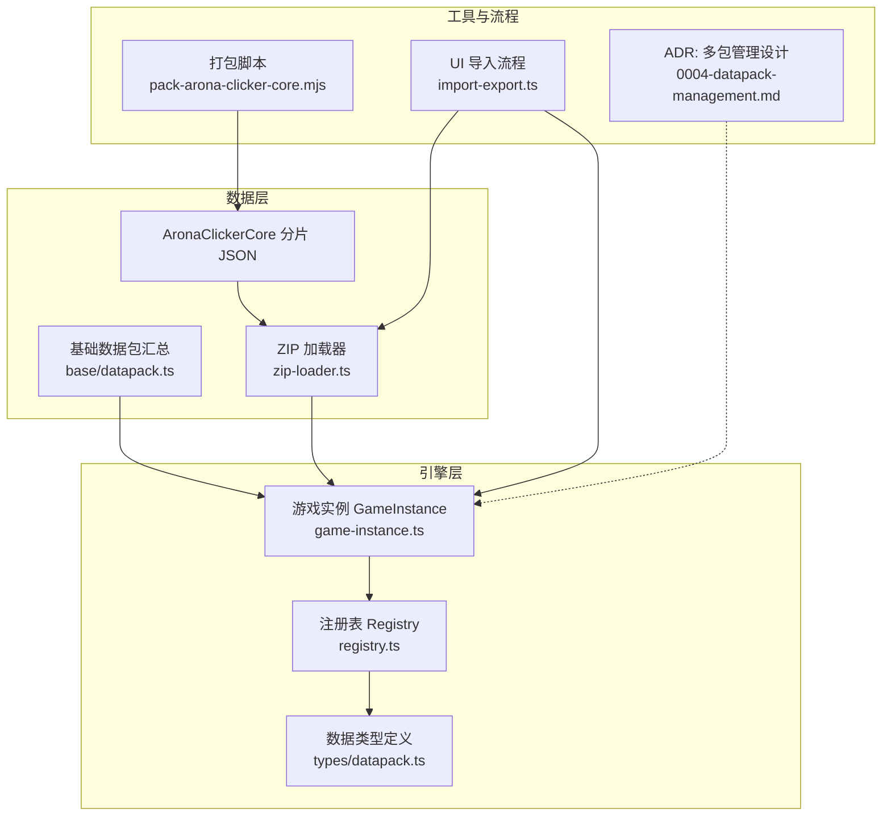
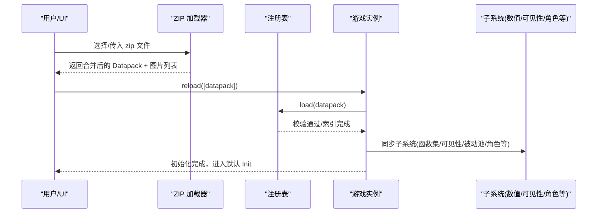
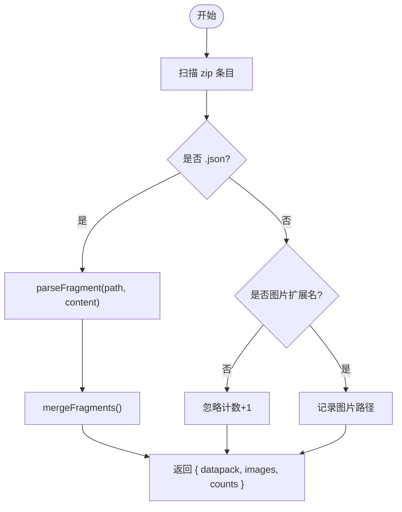
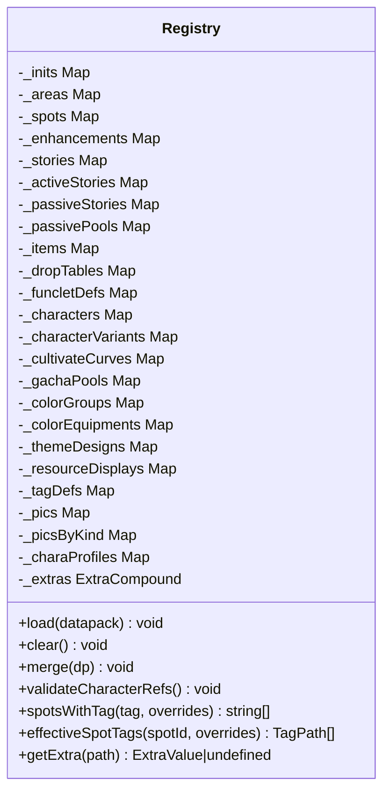
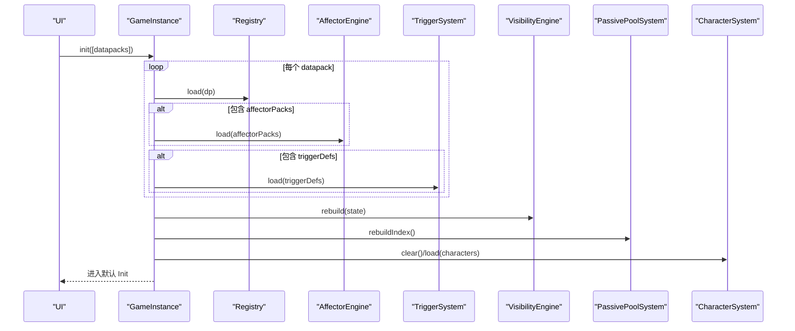
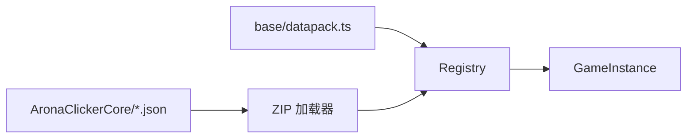
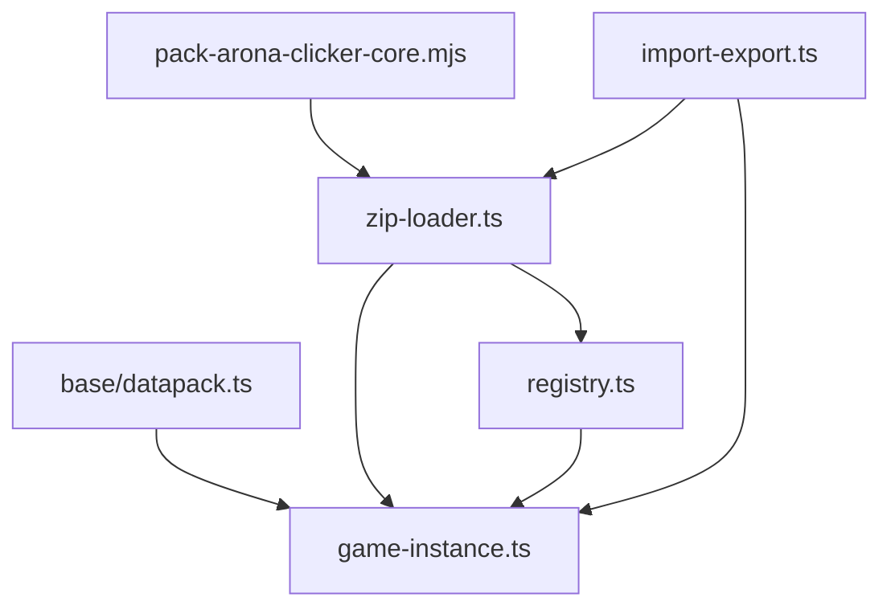

# 数据包管理系统

<cite>
**本文引用的文件**
- [src/data/zip-loader.ts](file://src/data/zip-loader.ts)
- [src/engine/types/datapack.ts](file://src/engine/types/datapack.ts)
- [src/engine/registry/registry.ts](file://src/engine/registry/registry.ts)
- [src/engine/game-instance.ts](file://src/engine/game-instance.ts)
- [src/data/base/datapack.ts](file://src/data/base/datapack.ts)
- [datapack/AronaClickerCore/01-inits.json](file://datapack/AronaClickerCore/01-inits.json)
- [datapack/AronaClickerCore/00-pics.json](file://datapack/AronaClickerCore/00-pics.json)
- [scripts/pack-arona-clicker-core.mjs](file://scripts/pack-arona-clicker-core.mjs)
- [src/ui/import-export.ts](file://src/ui/import-export.ts)
- [docs-828/06-adr/0004-datapack-management.md](file://docs-828/06-adr/0004-datapack-management.md)
- [tests/data/zip-loader.test.ts](file://tests/data/zip-loader.test.ts)
</cite>

## 目录
1. [简介](#简介)
2. [项目结构](#项目结构)
3. [核心组件](#核心组件)
4. [架构总览](#架构总览)
5. [详细组件分析](#详细组件分析)
6. [依赖关系分析](#依赖关系分析)
7. [性能考虑](#性能考虑)
8. [故障排查指南](#故障排查指南)
9. [结论](#结论)
10. [附录](#附录)

## 简介
本仓库实现了一个“数据包管理系统”，用于将游戏内容以数据包（Datapack）的形式进行声明、加载、合并与运行。系统支持：
- 从 ZIP 压缩包或内置数据源读取多分片 JSON，并合并为单一 Datapack
- 通过注册表对各类实体进行校验、索引与查询
- 在游戏运行时初始化各子系统，驱动数值、可见性、剧情、角色等系统
- 提供打包脚本与导入流程，便于开发期与运行期的数据管理
- 规划了多包管理与三段式命名空间、惰性存档等能力（见 ADR）

## 项目结构
- datapack/AronaClickerCore：基础数据包的分片 JSON（图片、开局、区域、设施、故事、物品、掉落表、强化、触发器、角色等）
- src/data：数据加载与基础数据包汇总（zip-loader、base datapack）
- src/engine：引擎核心（类型定义、注册表、游戏实例、表达式、效果、系统、可见性等）
- scripts：构建与打包脚本（生成 schema、打包 core 数据包）
- tools/datapack-editor：编辑器工具（schema、模型、UI）
- tests：覆盖加载、合并、注册表、子系统行为等测试



**图表来源**
- [src/data/zip-loader.ts:1-256](file://src/data/zip-loader.ts#L1-L256)
- [src/engine/registry/registry.ts:1-560](file://src/engine/registry/registry.ts#L1-L560)
- [src/engine/game-instance.ts:176-229](file://src/engine/game-instance.ts#L176-L229)
- [src/data/base/datapack.ts:1-160](file://src/data/base/datapack.ts#L1-L160)
- [scripts/pack-arona-clicker-core.mjs:1-53](file://scripts/pack-arona-clicker-core.mjs#L1-L53)
- [src/ui/import-export.ts:32-57](file://src/ui/import-export.ts#L32-L57)
- [docs-828/06-adr/0004-datapack-management.md:20-98](file://docs-828/06-adr/0004-datapack-management.md#L20-L98)

**章节来源**
- [src/data/zip-loader.ts:1-256](file://src/data/zip-loader.ts#L1-L256)
- [src/engine/types/datapack.ts:44-135](file://src/engine/types/datapack.ts#L44-L135)
- [src/engine/registry/registry.ts:59-334](file://src/engine/registry/registry.ts#L59-L334)
- [src/engine/game-instance.ts:176-229](file://src/engine/game-instance.ts#L176-L229)
- [scripts/pack-arona-clicker-core.mjs:1-53](file://scripts/pack-arona-clicker-core.mjs#L1-L53)
- [src/ui/import-export.ts:32-57](file://src/ui/import-export.ts#L32-L57)
- [docs-828/06-adr/0004-datapack-management.md:20-98](file://docs-828/06-adr/0004-datapack-management.md#L20-L98)

## 核心组件
- 数据包类型定义：统一描述 Datapack 的字段集合（inits、areas、spots、stories、items、affectorPacks、characters、pics、extras 等）
- ZIP 加载器：遍历 zip 内所有 .json 分片，解析并合并为单个 Datapack；同时提取图片资产为 data URL
- 注册表：负责数据包的校验、合并、索引（按表步骤清单），并提供查询接口（如 spotsWithTag、storyEntries）
- 游戏实例：组合根，装配子系统，执行 init/reload，驱动数值、可见性、被动池、角色系统等
- 基础数据包：集中声明 base 包的内容（资源显示、后勤包、全局 extras 等）
- 打包脚本：将 datapack/AronaClickerCore 下所有 json 打包为 arona-clicker-core.zip
- UI 导入流程：选择 zip → 加载 → 登记图片 → reload 引擎 → 清理旧存档 → 启动

**章节来源**
- [src/engine/types/datapack.ts:44-135](file://src/engine/types/datapack.ts#L44-L135)
- [src/data/zip-loader.ts:32-203](file://src/data/zip-loader.ts#L32-L203)
- [src/engine/registry/registry.ts:114-334](file://src/engine/registry/registry.ts#L114-L334)
- [src/engine/game-instance.ts:176-229](file://src/engine/game-instance.ts#L176-L229)
- [src/data/base/datapack.ts:31-159](file://src/data/base/datapack.ts#L31-L159)
- [scripts/pack-arona-clicker-core.mjs:17-53](file://scripts/pack-arona-clicker-core.mjs#L17-L53)
- [src/ui/import-export.ts:32-57](file://src/ui/import-export.ts#L32-L57)

## 架构总览
数据包从 ZIP 或源码进入，经加载器合并后交由注册表校验与索引，再由游戏实例装配子系统并初始化运行。基础数据包作为默认内容常驻，扩展数据包可替换或叠加。



**图表来源**
- [src/data/zip-loader.ts:209-242](file://src/data/zip-loader.ts#L209-L242)
- [src/engine/registry/registry.ts:543-558](file://src/engine/registry/registry.ts#L543-L558)
- [src/engine/game-instance.ts:176-229](file://src/engine/game-instance.ts#L176-L229)
- [src/ui/import-export.ts:32-57](file://src/ui/import-export.ts#L32-L57)

## 详细组件分析

### ZIP 加载器（分片解析与合并）
- 识别 DATAPACK_LIST_FIELDS 列表字段，将每个 .json 视为一个“分片”
- 解析 name/version/extras 与列表字段，未知字段忽略
- 合并多个分片为一个 Datapack，并提取图片为 data URL
- 错误处理：非法 JSON、顶层数组、无 json 文件、非数组列表字段等抛出 ZipLoadError



**图表来源**
- [src/data/zip-loader.ts:109-203](file://src/data/zip-loader.ts#L109-L203)
- [src/data/zip-loader.ts:209-242](file://src/data/zip-loader.ts#L209-L242)

**章节来源**
- [src/data/zip-loader.ts:32-203](file://src/data/zip-loader.ts#L32-L203)
- [src/data/zip-loader.ts:209-242](file://src/data/zip-loader.ts#L209-L242)
- [tests/data/zip-loader.test.ts:52-170](file://tests/data/zip-loader.test.ts#L52-L170)

### 注册表（校验、合并与索引）
- 表步骤清单：新增一张表只需添加 step，merge/clear 自动同步
- 主要表：inits、areas、spots、enhancements、stories、activeStories、passiveStories、passivePools、items、dropTables、funcletDefs、characters、characterVariants、cultivateCurves、gachaPools、colorGroups、colorEquipments、themeDesigns、resourceDisplays、tags、pics、charaProfiles、extras
- 索引：areasByInit、spotsByArea、spotsByTag（层级标签前缀命中）、picsByKind
- 校验：validateCharacterRefs、affectionConfig/gachaPools 合法性检查、extras 深合并



**图表来源**
- [src/engine/registry/registry.ts:59-334](file://src/engine/registry/registry.ts#L59-L334)
- [src/engine/registry/registry.ts:337-558](file://src/engine/registry/registry.ts#L337-L558)

**章节来源**
- [src/engine/registry/registry.ts:114-334](file://src/engine/registry/registry.ts#L114-L334)
- [src/engine/registry/registry.ts:337-558](file://src/engine/registry/registry.ts#L337-L558)

### 游戏实例（初始化与装配）
- init(datapacks[])：依次加载注册表、效果包、触发器，同步子系统，构建数值树，重建被动池索引，加载角色系统，计算可见性，进入默认 Init
- reload：清空注册表与各子系统，重置运行时状态后重新 init
- 门面：story/spot/inits/items/enhancements/charaProfiles/pics 等只读访问



**图表来源**
- [src/engine/game-instance.ts:176-229](file://src/engine/game-instance.ts#L176-L229)

**章节来源**
- [src/engine/game-instance.ts:176-229](file://src/engine/game-instance.ts#L176-L229)

### 基础数据包与分片 JSON
- base/datapack.ts：汇总 base 包的所有内容（资源显示、后勤包、全局 extras、角色相关表等）
- AronaClickerCore/*.json：分片数据（如 01-inits.json 声明初始世界线，00-pics.json 声明图片资产）



**图表来源**
- [src/data/base/datapack.ts:131-159](file://src/data/base/datapack.ts#L131-L159)
- [datapack/AronaClickerCore/01-inits.json:1-21](file://datapack/AronaClickerCore/01-inits.json#L1-L21)
- [datapack/AronaClickerCore/00-pics.json:1-9](file://datapack/AronaClickerCore/00-pics.json#L1-L9)
- [src/data/zip-loader.ts:209-242](file://src/data/zip-loader.ts#L209-L242)
- [src/engine/game-instance.ts:176-229](file://src/engine/game-instance.ts#L176-L229)

**章节来源**
- [src/data/base/datapack.ts:131-159](file://src/data/base/datapack.ts#L131-L159)
- [datapack/AronaClickerCore/01-inits.json:1-21](file://datapack/AronaClickerCore/01-inits.json#L1-L21)
- [datapack/AronaClickerCore/00-pics.json:1-9](file://datapack/AronaClickerCore/00-pics.json#L1-L9)

### 打包脚本与导入流程
- pack-arona-clicker-core.mjs：递归收集 datapack/AronaClickerCore 下的所有 .json，打包为 arona-clicker-core.zip
- import-export.ts：选择 zip → 调用加载器 → 清空 imageStore → 登记图片 → reload → 删除旧存档 → 启动

```mermaid
sequenceDiagram
participant Dev as "开发者"
participant Script as "打包脚本"
participant UI as "UI 导入"
participant ZIP as "ZIP 加载器"
participant GI as "GameInstance"
Dev->>Script : node pack-arona-clicker-core.mjs
Script-->>Dev : 生成 arona-clicker-core.zip
UI->>ZIP : loadDatapackFromZipFile(file)
ZIP-->>UI : { datapack, images }
UI->>GI : imageStore.clear(); pics.register(...); reload([datapack])
UI->>GI : start()
```

**图表来源**
- [scripts/pack-arona-clicker-core.mjs:17-53](file://scripts/pack-arona-clicker-core.mjs#L17-L53)
- [src/ui/import-export.ts:32-57](file://src/ui/import-export.ts#L32-L57)
- [src/data/zip-loader.ts:244-255](file://src/data/zip-loader.ts#L244-L255)

**章节来源**
- [scripts/pack-arona-clicker-core.mjs:17-53](file://scripts/pack-arona-clicker-core.mjs#L17-L53)
- [src/ui/import-export.ts:32-57](file://src/ui/import-export.ts#L32-L57)

### 多包管理设计（ADR）
- 分层架构：Source → Pack → PackManager → Engine
- 三段式 id：modName:typeName:idName，命名空间隔离，跨包引用自由 + 事后校验
- 包库与启用集：IndexedDB 存储，玩家启停排序，all-or-nothing 应用
- 惰性存档：未启用 mod 的数据惰性保留，不报错、不索引，可手动清除残留
- 连带机制：affectionConfig 表化、标签子叶命名空间化、图片 key 按 mod 前缀隔离

**章节来源**
- [docs-828/06-adr/0004-datapack-management.md:20-135](file://docs-828/06-adr/0004-datapack-management.md#L20-L135)

## 依赖关系分析
- 加载器依赖 JSZip，输出 Datapack 与图片列表
- 注册表依赖类型定义与验证模块，维护多张表的映射与索引
- 游戏实例依赖注册表与各子系统，协调初始化流程
- 基础数据包与分片 JSON 共同构成运行时可用内容
- 打包脚本与 UI 导入流程连接开发与运行阶段



**图表来源**
- [src/data/zip-loader.ts:1-256](file://src/data/zip-loader.ts#L1-L256)
- [src/engine/registry/registry.ts:1-560](file://src/engine/registry/registry.ts#L1-L560)
- [src/engine/game-instance.ts:176-229](file://src/engine/game-instance.ts#L176-L229)
- [src/data/base/datapack.ts:1-160](file://src/data/base/datapack.ts#L1-L160)
- [scripts/pack-arona-clicker-core.mjs:1-53](file://scripts/pack-arona-clicker-core.mjs#L1-L53)
- [src/ui/import-export.ts:32-57](file://src/ui/import-export.ts#L32-L57)

**章节来源**
- [src/data/zip-loader.ts:1-256](file://src/data/zip-loader.ts#L1-L256)
- [src/engine/registry/registry.ts:1-560](file://src/engine/registry/registry.ts#L1-L560)
- [src/engine/game-instance.ts:176-229](file://src/engine/game-instance.ts#L176-L229)
- [src/data/base/datapack.ts:1-160](file://src/data/base/datapack.ts#L1-L160)
- [scripts/pack-arona-clicker-core.mjs:1-53](file://scripts/pack-arona-clicker-core.mjs#L1-L53)
- [src/ui/import-export.ts:32-57](file://src/ui/import-export.ts#L32-L57)

## 性能考虑
- 分片合并：ZIP 加载器并行读取 JSON 与图片，减少 I/O 等待
- 注册表索引：spotsByTag 使用前缀展开，提高标签查询效率
- 懒求值：数值系统构建 primitiveGain 树采用懒求值，避免不必要的计算
- 可见性重建：仅在必要时触发全量重算，降低频繁更新开销
- 图片资源：data URL 直接登记，避免重复解码

[本节为通用指导，无需特定文件来源]

## 故障排查指南
- ZIP 加载失败：检查压缩包是否包含至少一个 .json；确认 JSON 格式正确；顶层不能是数组；列表字段必须为数组
- 注册表校验失败：检查 entity id 是否符合三段式规范；typeName 是否已注册；modName 归属是否正确；字符引用是否完整
- 导入后无法继续：确认图片已登记；reload 后是否清除了旧存档；确保进入默认 Init
- 多包冲突：启用集内不允许同 modName 的包同时启用；悬空引用会导致启用集拒绝应用

**章节来源**
- [src/data/zip-loader.ts:76-159](file://src/data/zip-loader.ts#L76-L159)
- [src/engine/registry/registry.ts:397-423](file://src/engine/registry/registry.ts#L397-L423)
- [src/ui/import-export.ts:32-57](file://src/ui/import-export.ts#L32-L57)
- [docs-828/06-adr/0004-datapack-management.md:90-135](file://docs-828/06-adr/0004-datapack-management.md#L90-L135)

## 结论
该数据包管理系统通过“分片 JSON + 注册表 + 游戏实例”的清晰分层，实现了内容声明、加载、校验与运行的闭环。ZIP 加载器与打包脚本打通了开发与运行链路，基础数据包提供了稳定的基底内容。未来在多包管理、三段式命名空间与惰性存档方面已有明确设计，可在生态成熟后逐步落地。

[本节为总结性内容，无需特定文件来源]

## 附录
- 关键数据结构：Datapack 字段集合（参见类型定义）
- 常用流程：导入 zip → 加载 → 登记图片 → reload → 启动
- 测试要点：分片合并、extras 合并、图片提取、错误路径覆盖

**章节来源**
- [src/engine/types/datapack.ts:44-135](file://src/engine/types/datapack.ts#L44-L135)
- [tests/data/zip-loader.test.ts:52-170](file://tests/data/zip-loader.test.ts#L52-L170)