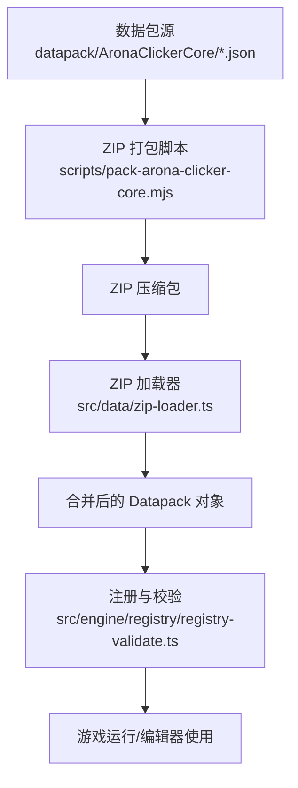
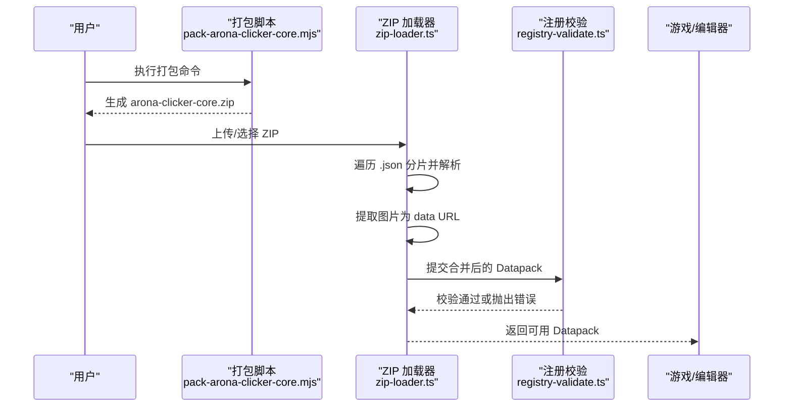
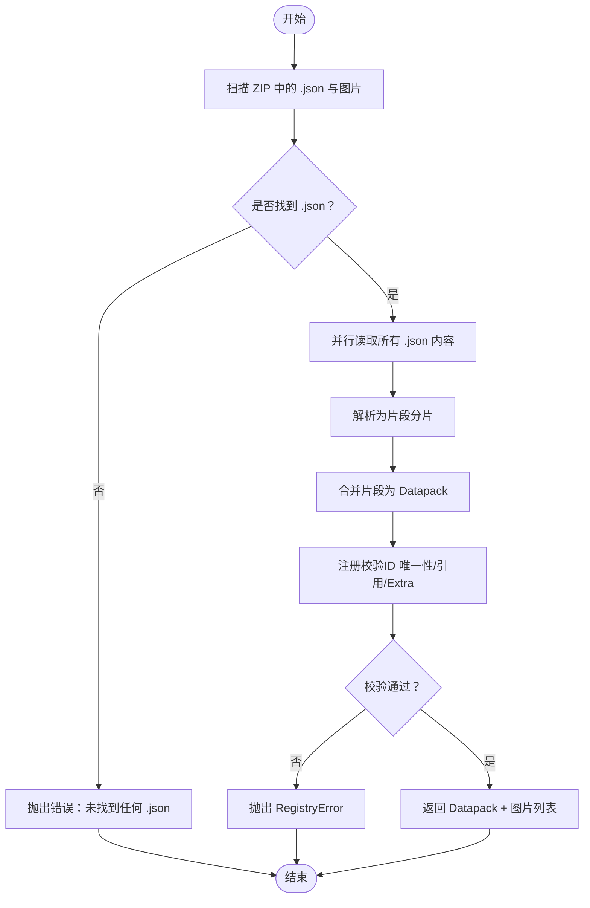
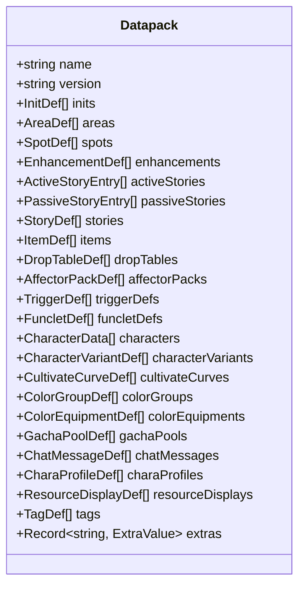
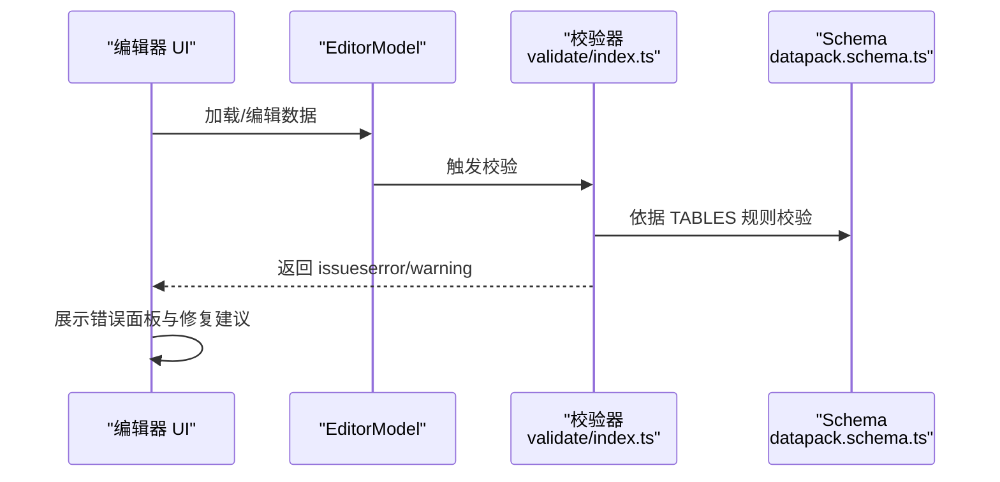
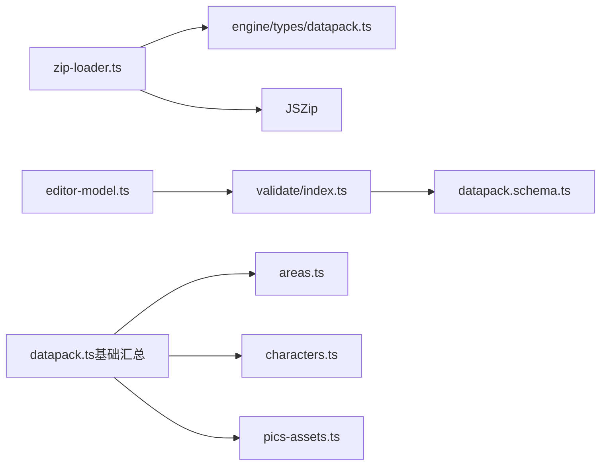

# 数据包系统

<cite>
**本文引用的文件**
- [datapack.ts](file://src/engine/types/datapack.ts)
- [zip-loader.ts](file://src/data/zip-loader.ts)
- [pack-arona-clicker-core.mjs](file://scripts/pack-arona-clicker-core.mjs)
- [00-pics.json](file://datapack/AronaClickerCore/00-pics.json)
- [01-inits.json](file://datapack/AronaClickerCore/01-inits.json)
- [02-areas.json](file://datapack/AronaClickerCore/02-areas.json)
- [datapack.ts（基础汇总）](file://src/data/base/datapack.ts)
- [pics-assets.ts](file://src/data/base/pics-assets.ts)
- [areas.ts](file://src/data/base/areas.ts)
- [characters.ts](file://src/data/base/characters.ts)
- [registry-validate.ts](file://src/engine/registry/registry-validate.ts)
- [validate/index.ts](file://tools/datapack-editor/validate/index.ts)
- [datapack.schema.ts](file://tools/datapack-editor/schema/datapack.schema.ts)
- [editor-model.ts](file://tools/datapack-editor/model/editor-model.ts)
- [ui/main.ts](file://tools/datapack-editor/ui/main.ts)
- [import-export.ts](file://src/ui/import-export.ts)
</cite>

## 目录
1. [简介](#简介)
2. [项目结构](#项目结构)
3. [核心组件](#核心组件)
4. [架构总览](#架构总览)
5. [详细组件分析](#详细组件分析)
6. [依赖关系分析](#依赖关系分析)
7. [性能考量](#性能考量)
8. [故障排查指南](#故障排查指南)
9. [结论](#结论)
10. [附录](#附录)

## 简介
本技术文档面向 ACProgram 的“数据包系统”，系统性说明 Datapack 数据包的架构设计、文件组织与命名约定、加载流程（ZIP 解压、JSON 分片解析、数据结构验证）、基础数据包 baseDatapack 的组成模块及其相互关系、版本管理与兼容性策略，以及编辑与调试工具的使用指南和打包分发最佳实践。目标是让具备不同技术背景的读者都能理解并高效使用该系统。

## 项目结构
- 数据包内容以 JSON 分片形式存放在 datapack/AronaClickerCore 目录下，每个文件承载一个或多个列表字段（如 inits、areas、spots 等），也可包含 name/version/extras 等元信息。
- 运行时通过 ZIP 压缩包加载：遍历所有 .json 分片进行解析与合并，同时提取图片资源为 data URL，供图片资产表引用。
- 引擎侧提供统一的数据包类型定义（Datapack）与注册校验逻辑，确保 ID 唯一性、引用完整性与 Extra 合法性。
- 编辑器工具链基于 Schema 驱动，提供可视化编辑、校验、导入导出能力。

**图表来源**
- [pack-arona-clicker-core.mjs:1-53](file://scripts/pack-arona-clicker-core.mjs#L1-L53)
- [zip-loader.ts:1-256](file://src/data/zip-loader.ts#L1-L256)
- [registry-validate.ts:1-184](file://src/engine/registry/registry-validate.ts#L1-L184)

**章节来源**
- [pack-arona-clicker-core.mjs:1-53](file://scripts/pack-arona-clicker-core.mjs#L1-L53)
- [zip-loader.ts:1-256](file://src/data/zip-loader.ts#L1-L256)

## 核心组件
- 数据包类型定义：集中描述 Datapack 的所有字段与可选扩展，包括初始化、区域、场景、剧情、物品、掉落表、影响包、触发器、角色、培养曲线、色彩组、卡池、聊天消息、图片、角色资料、资源显示、标签、全局 Extra 等。
- ZIP 加载器：将 ZIP 中的多个 JSON 分片解析为“片段”后合并为单一 Datapack；同时提取图片资源为 data URL，支持 zip: 引用。
- 基础数据包汇总：将多模块（图片、初始化、区域、场景、角色、故事、物品、掉落表、影响包、触发器、角色资料等）聚合为一个完整的 baseDatapack。
- 注册与校验：在加载后对 ID 唯一性、跨表引用完整性、Extra 结构进行严格校验，失败时抛出明确错误。
- 编辑器工具链：Schema 驱动的表格化编辑模型、UI 与校验器，支持导入/导出、撤销重做、实时校验与问题定位。

**章节来源**
- [datapack.ts:1-135](file://src/engine/types/datapack.ts#L1-L135)
- [zip-loader.ts:1-256](file://src/data/zip-loader.ts#L1-L256)
- [datapack.ts（基础汇总）:1-160](file://src/data/base/datapack.ts#L1-L160)
- [registry-validate.ts:1-184](file://src/engine/registry/registry-validate.ts#L1-L184)
- [validate/index.ts:1-393](file://tools/datapack-editor/validate/index.ts#L1-L393)

## 架构总览
数据包系统由“内容层（JSON 分片）— 加载层（ZIP 解析与合并）— 类型与校验层（Datapack 类型 + 注册校验）— 运行/编辑器使用层”构成。编辑器通过同一 Schema 与校验器对数据进行可视化编辑与验证，保证内容与引擎的一致性。

**图表来源**
- [pack-arona-clicker-core.mjs:1-53](file://scripts/pack-arona-clicker-core.mjs#L1-L53)
- [zip-loader.ts:1-256](file://src/data/zip-loader.ts#L1-L256)
- [registry-validate.ts:1-184](file://src/engine/registry/registry-validate.ts#L1-L184)

## 详细组件分析

### 数据包结构与文件组织规范
- 分片文件命名建议：按数字前缀排序（如 00-pics.json、01-inits.json、02-areas.json…），便于阅读与顺序加载。
- 每个 JSON 分片可包含：
  - 列表字段：inits、areas、spots、enhancements、activeStories、passiveStories、stories、items、dropTables、affectorPacks、triggerDefs、funcletDefs、characters、characterBonuses、resourceDisplays、pics、charaProfiles 等。
  - 元信息：name、version、extras（扁平键到节点值的映射）。
- 图片资源：
  - 运行时 ZIP 中图片会被提取为 data URL，PicDef.src 可使用 zip: 前缀引用。
  - 基础数据包 pics-assets.ts 提供本地资源 URL 的直接引用。

示例文件参考：
- [00-pics.json:1-9](file://datapack/AronaClickerCore/00-pics.json#L1-L9)
- [01-inits.json:1-21](file://datapack/AronaClickerCore/01-inits.json#L1-L21)
- [02-areas.json:1-19](file://datapack/AronaClickerCore/02-areas.json#L1-L19)

**章节来源**
- [zip-loader.ts:32-51](file://src/data/zip-loader.ts#L32-L51)
- [zip-loader.ts:209-241](file://src/data/zip-loader.ts#L209-L241)
- [pics-assets.ts:1-15](file://src/data/base/pics-assets.ts#L1-L15)

### 数据包加载流程（ZIP → JSON 解析 → 合并 → 校验）
- ZIP 扫描：识别 .json 与图片文件，忽略其他文件并计数。
- JSON 解析：每个分片解析为“片段”，要求顶层为对象且至少包含一个已知字段（列表字段或 name/version/extras）。
- 合并：将所有片段列表字段拼接，extras 合并覆盖，name/version 取首个非空值。
- 校验：调用注册校验器检查 ID 唯一性、引用完整性、Extra 合法性。

**图表来源**
- [zip-loader.ts:76-85](file://src/data/zip-loader.ts#L76-L85)
- [zip-loader.ts:109-160](file://src/data/zip-loader.ts#L109-L160)
- [zip-loader.ts:162-203](file://src/data/zip-loader.ts#L162-L203)
- [zip-loader.ts:209-241](file://src/data/zip-loader.ts#L209-L241)
- [registry-validate.ts:18-184](file://src/engine/registry/registry-validate.ts#L18-L184)

**章节来源**
- [zip-loader.ts:109-203](file://src/data/zip-loader.ts#L109-L203)
- [zip-loader.ts:209-241](file://src/data/zip-loader.ts#L209-L241)
- [registry-validate.ts:18-184](file://src/engine/registry/registry-validate.ts#L18-L184)

### 基础数据包 baseDatapack 的组成与关系
baseDatapack 将多模块聚合为完整数据包，涵盖：
- 图片资源：basePics（本地资源 URL）与运行时 zip: 资源。
- 初始化配置：inits（默认区域、起始剧情等）。
- 区域与场景：areas、spots（相邻关系、主题、揭示条件）。
- 角色与资料：characters、charaProfiles（名称、头像、当前使用项）。
- 剧情系统：activeStories、passiveStories、stories（主线/支线/闲聊）。
- 物品与掉落：items、dropTables。
- 影响包与触发器：affectorPacks、triggerDefs（资源流、标签倍率、事件驱动）。
- 培养与色彩：cultivateCurves、colorGroups、colorEquipments。
- 卡池与聊天：gachaPools、chatMessages。
- 资源显示与标签：resourceDisplays、tags。
- 全局 Extra：meta/author、balance/start-credit 等。

**图表来源**
- [datapack.ts:46-135](file://src/engine/types/datapack.ts#L46-L135)

**章节来源**
- [datapack.ts（基础汇总）:30-159](file://src/data/base/datapack.ts#L30-L159)
- [areas.ts:8-106](file://src/data/base/areas.ts#L8-L106)
- [characters.ts:11-88](file://src/data/base/characters.ts#L11-L88)
- [pics-assets.ts:12-15](file://src/data/base/pics-assets.ts#L12-L15)

### 版本管理与向后兼容
- 版本号：
  - 数据包级 version：来自分片合并（首个非空值），用于标识 Mod 版本。
  - 基础数据包 version：固定于 baseDatapack 定义。
- 向后兼容策略：
  - 未知字段：加载器会忽略未知字段，允许分片携带附加说明或未来扩展字段。
  - 可选字段：许多字段为可选（如 dropTables、affectorPacks、triggerDefs、resourceDisplays、pics、charaProfiles），缺失时回退默认行为。
  - 旧字段处理：例如 characterBonuses 标记为废弃，加载期忽略并记录警告，后续版本移除。
- 迁移建议：
  - 新增字段优先采用可选字段，避免破坏现有分片。
  - 对弃用字段保留兼容路径，逐步引导迁移。
  - 使用 extras 管理元数据与平衡参数，便于热更新与调优。

**章节来源**
- [zip-loader.ts:131-151](file://src/data/zip-loader.ts#L131-L151)
- [zip-loader.ts:162-203](file://src/data/zip-loader.ts#L162-L203)
- [datapack.ts:68-72](file://src/engine/types/datapack.ts#L68-L72)

### 编辑器与调试工具使用指南
- Schema 驱动校验：
  - 通过 tools/datapack-editor/schema 生成的 TABLES 与 validate/index.ts 实现类型、必填、枚举、引用、格式等多维度校验。
  - 支持三段式 ID 格式检查（pack:kind:name）与动态枚举选项收集。
- 编辑器模型：
  - EditorModel 持有工作集数据，提供增删改查、移动复制、撤销重做，变更产生快照历史。
  - UI 三栏布局：类型选择 → ID-名称列表 → 详情面板，支持导入/导出、校验结果展示。
- 调试与诊断：
  - 导入 ZIP 时，UI 会显示成功/失败提示与日志记录。
  - 校验错误包含表名、行号、路径、严重级别与消息，便于快速定位。

**图表来源**
- [editor-model.ts:1-40](file://tools/datapack-editor/model/editor-model.ts#L1-L40)
- [validate/index.ts:333-393](file://tools/datapack-editor/validate/index.ts#L333-L393)
- [datapack.schema.ts:1-20](file://tools/datapack-editor/schema/datapack.schema.ts#L1-L20)
- [ui/main.ts:1-33](file://tools/datapack-editor/ui/main.ts#L1-L33)

**章节来源**
- [validate/index.ts:1-393](file://tools/datapack-editor/validate/index.ts#L1-L393)
- [editor-model.ts:1-40](file://tools/datapack-editor/model/editor-model.ts#L1-L40)
- [ui/main.ts:1-33](file://tools/datapack-editor/ui/main.ts#L1-L33)

### 打包、分发与部署最佳实践
- 打包：
  - 使用 scripts/pack-arona-clicker-core.mjs 将 datapack/AronaClickerCore 下所有 .json 分片打包为 ZIP，保留 AronaClickerCore/ 前缀目录。
  - 确保仅包含 .json 与图片资源，其他文件将被忽略。
- 分发：
  - 发布 arona-clicker-core.zip 供玩家导入。
  - 建议在 README 中说明文件名、版本、兼容性与安装步骤。
- 部署：
  - 在游戏内通过导入功能选择 ZIP，加载器自动解析并合并。
  - 若校验失败，根据错误信息修正分片后再重新打包。

**章节来源**
- [pack-arona-clicker-core.mjs:17-53](file://scripts/pack-arona-clicker-core.mjs#L17-L53)
- [import-export.ts:55-95](file://src/ui/import-export.ts#L55-L95)

## 依赖关系分析
- 加载器依赖 JSZip 进行压缩与解压，依赖引擎类型定义确保字段一致性。
- 编辑器依赖 Schema 与校验器，不耦合游戏代码，便于独立开发与测试。
- 基础数据包依赖各模块定义（areas、characters、pics 等），并通过 baseDatapack 聚合。

**图表来源**
- [zip-loader.ts:1-31](file://src/data/zip-loader.ts#L1-L31)
- [editor-model.ts:1-40](file://tools/datapack-editor/model/editor-model.ts#L1-L40)
- [validate/index.ts:1-393](file://tools/datapack-editor/validate/index.ts#L1-L393)
- [datapack.ts（基础汇总）:1-160](file://src/data/base/datapack.ts#L1-L160)

**章节来源**
- [zip-loader.ts:1-31](file://src/data/zip-loader.ts#L1-L31)
- [editor-model.ts:1-40](file://tools/datapack-editor/model/editor-model.ts#L1-L40)
- [validate/index.ts:1-393](file://tools/datapack-editor/validate/index.ts#L1-L393)
- [datapack.ts（基础汇总）:1-160](file://src/data/base/datapack.ts#L1-L160)

## 性能考量
- 并行读取：ZIP 加载器并行读取所有 .json 与图片，减少 I/O 等待时间。
- 增量合并：分片合并仅追加数组与覆盖 extras，避免重复构建。
- 校验优化：注册校验在加载后一次性完成，提前发现错误，避免运行时异常。
- 编辑器缓存：EditorModel 维护快照历史，撤销/重做操作高效。

[本节为通用指导，无需特定文件来源]

## 故障排查指南
- ZIP 加载错误：
  - 未找到 .json：检查压缩包内容，确保至少有一个有效分片。
  - JSON 解析失败：检查分片语法与结构，确保顶层为对象且包含已知字段。
  - 忽略文件计数：确认非 json/图片文件不影响加载。
- 注册校验错误：
  - 重复 ID：检查各表 id 唯一性。
  - 引用不存在：检查 area.initId、spot.areaId、story.storyId 等引用是否正确。
  - Extra 非法：检查 extra 结构与类型是否符合规则。
- 编辑器校验问题：
  - 查看错误面板，定位表名、行号与路径。
  - 根据 schema 规则修正字段类型、必填项与枚举值。

**章节来源**
- [zip-loader.ts:76-85](file://src/data/zip-loader.ts#L76-L85)
- [zip-loader.ts:109-160](file://src/data/zip-loader.ts#L109-L160)
- [registry-validate.ts:18-184](file://src/engine/registry/registry-validate.ts#L18-L184)
- [validate/index.ts:333-393](file://tools/datapack-editor/validate/index.ts#L333-L393)

## 结论
ACProgram 的数据包系统通过“分片 JSON + ZIP 加载 + 类型与校验 + 编辑器工具链”的组合，实现了高内聚、低耦合的内容管理与扩展机制。baseDatapack 提供了完整的基础内容集合，配合严格的加载与校验流程，确保数据一致性与稳定性。版本管理与向后兼容策略保障了长期演进的可维护性。编辑器工具链提升了内容创作效率与质量。遵循本文档的组织规范与实践建议，可高效创建、验证与部署高质量数据包。

[本节为总结，无需特定文件来源]

## 附录
- 常用命令：
  - 打包：node scripts/pack-arona-clicker-core.mjs
  - 编辑器：打开 tools/datapack-editor/ui/index.html 进行可视化编辑与校验。
- 参考文件：
  - 数据包类型定义：src/engine/types/datapack.ts
  - ZIP 加载器：src/data/zip-loader.ts
  - 基础数据包汇总：src/data/base/datapack.ts
  - 编辑器校验器：tools/datapack-editor/validate/index.ts

[本节为补充信息，无需特定文件来源]