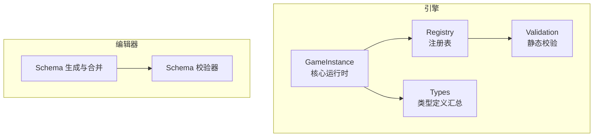
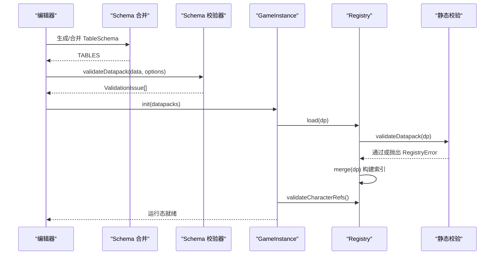
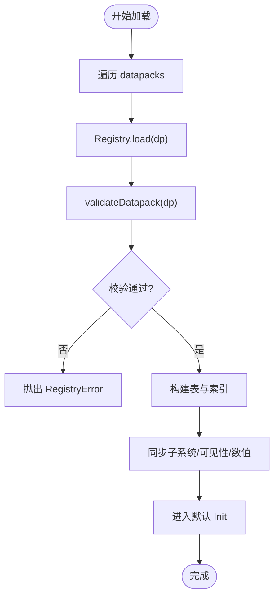
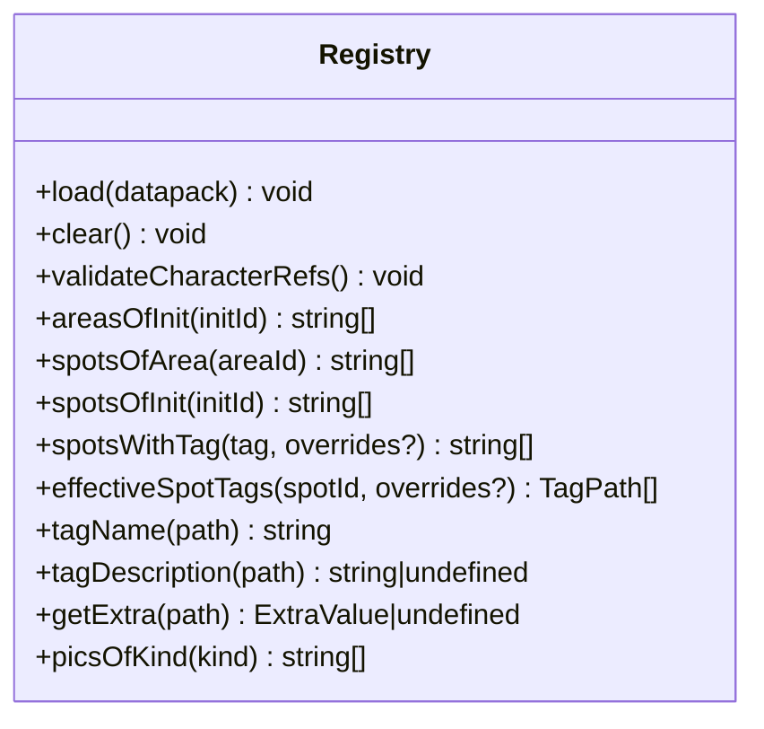
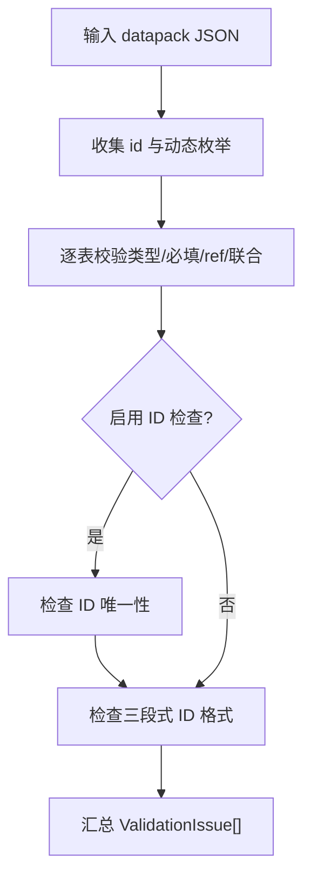
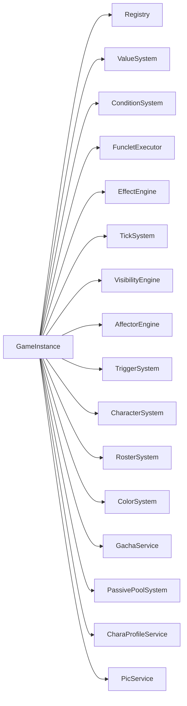

# 数据系统

<cite>
**本文引用的文件**
- [src/engine/registry/registry.ts](file://src/engine/registry/registry.ts)
- [src/engine/registry/registry-validate.ts](file://src/engine/registry/registry-validate.ts)
- [src/engine/types/datapack.ts](file://src/engine/types/datapack.ts)
- [src/engine/game-instance.ts](file://src/engine/game-instance.ts)
- [tools/datapack-editor/schema/datapack.schema.ts](file://tools/datapack-editor/schema/datapack.schema.ts)
- [tools/datapack-editor/schema/merge.ts](file://tools/datapack-editor/schema/merge.ts)
- [tools/datapack-editor/schema/editor-extras.ts](file://tools/datapack-editor/schema/editor-extras.ts)
- [tools/datapack-editor/validate/index.ts](file://tools/datapack-editor/validate/index.ts)
- [src/data/base/characters.ts](file://src/data/base/characters.ts)
- [src/engine/types/common.ts](file://src/engine/types/common.ts)
- [src/engine/types/index.ts](file://src/engine/types/index.ts)
</cite>

## 目录
1. [简介](#简介)
2. [项目结构](#项目结构)
3. [核心组件](#核心组件)
4. [架构总览](#架构总览)
5. [详细组件分析](#详细组件分析)
6. [依赖关系分析](#依赖关系分析)
7. [性能考量](#性能考量)
8. [故障排查指南](#故障排查指南)
9. [结论](#结论)
10. [附录](#附录)

## 简介
本技术文档面向 ACProgram 的数据系统，聚焦以下目标：
- 解释 Datapack 数据包系统的设计：数据结构定义、加载流程与验证机制。
- 说明 Registry 注册表系统的实现：数据注册、引用完整性检查与索引构建。
- 文档化 TypeScript 类型系统：类型组织方式、导出策略与类型安全保证。
- 描述数据模型的关系映射：实体关系、字段定义与数据约束。
- 提供数据包编辑与验证工具使用指南：schema 校验与错误诊断。
- 总结数据迁移、版本兼容性与性能优化的最佳实践。

## 项目结构
ACProgram 的数据系统由“引擎运行时”和“编辑器工具链”两部分组成：
- 引擎侧负责数据加载、注册、校验与运行时访问（Registry、GameInstance、Types）。
- 编辑器侧基于 Schema 驱动的数据包编辑与校验（Schema 生成、合并、校验器）。

图表来源
- [src/engine/game-instance.ts:176-229](file://src/engine/game-instance.ts#L176-L229)
- [src/engine/registry/registry.ts:528-543](file://src/engine/registry/registry.ts#L528-L543)
- [tools/datapack-editor/schema/merge.ts:62-102](file://tools/datapack-editor/schema/merge.ts#L62-L102)
- [tools/datapack-editor/validate/index.ts:333-390](file://tools/datapack-editor/validate/index.ts#L333-L390)

章节来源
- [src/engine/game-instance.ts:176-229](file://src/engine/game-instance.ts#L176-L229)
- [src/engine/registry/registry.ts:528-543](file://src/engine/registry/registry.ts#L528-L543)
- [tools/datapack-editor/schema/merge.ts:62-102](file://tools/datapack-editor/schema/merge.ts#L62-L102)
- [tools/datapack-editor/validate/index.ts:333-390](file://tools/datapack-editor/validate/index.ts#L333-L390)

## 核心组件
- 数据包类型定义：集中描述所有表结构与可选字段，作为引擎与编辑器共享的契约。
- 注册表：维护各表数据、关系索引与查询接口，并提供跨表引用完整性校验。
- 运行时入口：装配子系统、加载数据包、初始化服务并暴露统一 API。
- 编辑器 Schema：从引擎类型生成基础字段，再叠加编辑器专用语义，形成最终校验与 UI 渲染依据。
- 校验器：基于 Schema 对数据包进行结构、ID 唯一性、格式与引用完整性校验。

章节来源
- [src/engine/types/datapack.ts:46-134](file://src/engine/types/datapack.ts#L46-L134)
- [src/engine/registry/registry.ts:59-319](file://src/engine/registry/registry.ts#L59-L319)
- [src/engine/game-instance.ts:74-124](file://src/engine/game-instance.ts#L74-L124)
- [tools/datapack-editor/schema/datapack.schema.ts:1-20](file://tools/datapack-editor/schema/datapack.schema.ts#L1-L20)
- [tools/datapack-editor/validate/index.ts:11-27](file://tools/datapack-editor/validate/index.ts#L11-L27)

## 架构总览
下图展示数据包从编辑器到运行时的完整链路：编辑器通过 Schema 生成与合并得到表结构；校验器在编辑期进行强校验；运行时 GameInstance 加载数据包，Registry 完成注册与索引构建，并在加载完成后执行引用完整性校验。

图表来源
- [tools/datapack-editor/schema/merge.ts:62-102](file://tools/datapack-editor/schema/merge.ts#L62-L102)
- [tools/datapack-editor/validate/index.ts:333-390](file://tools/datapack-editor/validate/index.ts#L333-L390)
- [src/engine/game-instance.ts:176-229](file://src/engine/game-instance.ts#L176-L229)
- [src/engine/registry/registry.ts:528-543](file://src/engine/registry/registry.ts#L528-L543)
- [src/engine/registry/registry-validate.ts:18-184](file://src/engine/registry/registry-validate.ts#L18-L184)

## 详细组件分析

### Datapack 数据包系统
- 数据结构定义：
  - Datapack 接口聚合了世界线、区域、设施、强化、剧情、物品、掉落表、角色、卡池、色彩、聊天消息、图片、角色资料、资源显示、标签、Extra 等表。
  - 部分表为可选（如 passivePools、dropTables、gachaPools 等），以支持模块化扩展。
- 加载流程：
  - GameInstance.init 遍历数据包，调用 Registry.load 进行静态校验与合并。
  - 同时加载 AffectorPack 与 TriggerDef，随后同步数值系统与可见性。
  - 最后进入默认 Init，记录加载统计信息。
- 验证机制：
  - registry-validate 对 ID 唯一性、引用完整性（init/area/spot/story）、PicId 格式、CharaProfile 结构、Extra 合法性等进行严格校验。
  - 编辑器侧 validate/index.ts 提供 schema 驱动的校验，包括类型、枚举、ref 引用、union/tagged、record 型 extras 等。

图表来源
- [src/engine/game-instance.ts:176-229](file://src/engine/game-instance.ts#L176-L229)
- [src/engine/registry/registry.ts:528-543](file://src/engine/registry/registry.ts#L528-L543)
- [src/engine/registry/registry-validate.ts:18-184](file://src/engine/registry/registry-validate.ts#L18-L184)
- [tools/datapack-editor/validate/index.ts:333-390](file://tools/datapack-editor/validate/index.ts#L333-L390)

章节来源
- [src/engine/types/datapack.ts:46-134](file://src/engine/types/datapack.ts#L46-L134)
- [src/engine/game-instance.ts:176-229](file://src/engine/game-instance.ts#L176-L229)
- [src/engine/registry/registry-validate.ts:18-184](file://src/engine/registry/registry-validate.ts#L18-L184)
- [tools/datapack-editor/validate/index.ts:333-390](file://tools/datapack-editor/validate/index.ts#L333-L390)

### Registry 注册表系统
- 数据注册：
  - Registry 维护多张 Map/Set 存储各类 Def，并通过 tableSteps 清单统一 merge/clear，新增表只需追加步骤。
  - 特殊处理：GachaMode 白名单校验、characterPersistConfig 范围校验、pics 按 kind 索引、extras 深合并。
- 引用完整性检查：
  - validateCharacterRefs 校验卡池成员/UP 差分与培养曲线引用、色彩装备与颜色组引用、主题设计引用。
- 索引构建：
  - areasByInit、spotsByArea、spotsByTag（层级前缀展开）用于高效查询。
  - effectiveSpotTags 结合运行时 tag 覆盖计算有效标签集合。
  - tagName/tagDescription 解析 Tag 展示名与简介，优先精确匹配，否则沿路径向上查找最长前缀。

图表来源
- [src/engine/registry/registry.ts:59-543](file://src/engine/registry/registry.ts#L59-L543)

章节来源
- [src/engine/registry/registry.ts:59-543](file://src/engine/registry/registry.ts#L59-L543)

### TypeScript 类型系统
- 类型组织方式：
  - engine/types/index.ts 汇总导出，涵盖 ID、表达式、Def、状态、结果、事件、图片等。
  - datapack.ts 作为汇总类型，将各子模块类型聚合为 Datapack 接口。
  - common.ts 提供跨领域共享定义（ResourceDisplayDef、TagDef、CharacterData 等）。
- 类型导出策略：
  - 通过 index 统一出口，保持向后兼容与简洁导入。
  - 编辑器侧通过 merge.ts 将引擎类型 TSDoc 转换为 FieldDef，再叠加 editor-extras 的复杂编辑语义。
- 类型安全保证：
  - 引擎侧通过严格的接口与枚举约束（如 GachaMode 白名单、PicId 三段式）。
  - 编辑器侧通过 Schema 校验器确保 JSON 结构与值域符合预期，避免运行时错误。

章节来源
- [src/engine/types/index.ts:1-30](file://src/engine/types/index.ts#L1-L30)
- [src/engine/types/datapack.ts:46-134](file://src/engine/types/datapack.ts#L46-L134)
- [src/engine/types/common.ts:18-116](file://src/engine/types/common.ts#L18-L116)
- [tools/datapack-editor/schema/merge.ts:15-60](file://tools/datapack-editor/schema/merge.ts#L15-L60)
- [tools/datapack-editor/schema/editor-extras.ts:1-10](file://tools/datapack-editor/schema/editor-extras.ts#L1-L10)

### 数据模型关系映射
- 实体关系：
  - Init → Area → Spot 层级关系，支持按 Init 隔离查询。
  - StoryEntry → Story 重定向，active/passive 入口统一视图 storyEntries。
  - CharacterVariant ↔ CultivateCurve，GachaPool 引用 Variant。
  - ColorEquipment ↔ ColorGroup，ThemeDesign 引用 ColorGroup。
  - Pic 资产通过三段式 id 索引并按 kind 分类。
- 字段定义与约束：
  - ResourceDisplayDef 控制资源条显示策略与排序。
  - TagDef 提供层级标签的名称与简介。
  - CharacterData 包含学校、稀有度、产出加成、被动描述与标签。
- 数据约束：
  - ID 唯一性、三段式 ID 格式、ref 引用存在性、枚举取值范围、extra 结构合法性。

章节来源
- [src/engine/registry/registry.ts:107-112](file://src/engine/registry/registry.ts#L107-L112)
- [src/engine/registry/registry.ts:378-408](file://src/engine/registry/registry.ts#L378-L408)
- [src/engine/types/common.ts:18-116](file://src/engine/types/common.ts#L18-L116)
- [tools/datapack-editor/validate/index.ts:313-327](file://tools/datapack-editor/validate/index.ts#L313-L327)

### 编辑器与校验工具使用指南
- Schema 生成与合并：
  - 从引擎类型生成基础字段（string/int/float/bool/enum/ref/array/object/record/extra/flexible/hand）。
  - editor-extras 覆盖复杂编辑语义（tagged 联动、optionsFrom 动态枚举、divider 分组、整表自定义）。
  - buildTables 输出 13 张表的最终 Schema。
- 校验流程：
  - validateDatapack 两阶段：收集 id 与动态枚举，逐表校验类型、必填、ref、union/tagged、record extras。
  - 支持 ID 唯一性检查与三段式格式检查。
- 错误诊断：
  - 返回 ValidationIssue 列表，包含表名、行号、路径、严重级别与消息，便于定位问题。

图表来源
- [tools/datapack-editor/schema/merge.ts:62-102](file://tools/datapack-editor/schema/merge.ts#L62-L102)
- [tools/datapack-editor/schema/editor-extras.ts:95-198](file://tools/datapack-editor/schema/editor-extras.ts#L95-L198)
- [tools/datapack-editor/validate/index.ts:333-390](file://tools/datapack-editor/validate/index.ts#L333-L390)

章节来源
- [tools/datapack-editor/schema/datapack.schema.ts:1-20](file://tools/datapack-editor/schema/datapack.schema.ts#L1-L20)
- [tools/datapack-editor/schema/merge.ts:62-102](file://tools/datapack-editor/schema/merge.ts#L62-L102)
- [tools/datapack-editor/schema/editor-extras.ts:95-198](file://tools/datapack-editor/schema/editor-extras.ts#L95-L198)
- [tools/datapack-editor/validate/index.ts:333-390](file://tools/datapack-editor/validate/index.ts#L333-L390)

## 依赖关系分析
- 组件耦合：
  - GameInstance 组合多个子系统（StoryService、SpotService、InitService、ItemService、EnhancementService、SessionService、ChatFlowService、VisibilityEngine、EffectEngine、TickSystem、AffectorEngine、TriggerSystem、CharacterSystem、RosterSystem、ColorSystem、GachaService、PassivePoolSystem、CharaProfileService、PicService）。
  - Registry 依赖 types 与 extra 工具，以及 registry-validate 进行静态校验。
- 外部依赖与集成点：
  - 编辑器 Schema 与校验器独立于游戏代码，仅依赖 schema DSL 与数据本身。
  - 运行时通过 EventBus、DevLog、StatsService 等基础设施进行事件与日志记录。

图表来源
- [src/engine/game-instance.ts:74-114](file://src/engine/game-instance.ts#L74-L114)

章节来源
- [src/engine/game-instance.ts:74-114](file://src/engine/game-instance.ts#L74-L114)

## 性能考量
- 索引优化：
  - spotsByTag 使用前缀展开建立层级标签索引，加速按标签查询。
  - effectiveSpotTags 结合运行时覆盖，避免全量扫描。
- 懒求值与缓存：
  - gameNumSystem.buildAll 构建资源 gain 树，采用懒求值与失效标记减少重复计算。
- 增量更新：
  - visibilityEngine 事件驱动增量更新可见性快照，不在每帧全量重算。
- 批量操作：
  - Registry.merge 通过 tableSteps 统一处理，减少重复逻辑与维护成本。

[本节为通用指导，不直接分析具体文件]

## 故障排查指南
- 常见错误：
  - ID 重复：校验器报告重复 ID，需检查数据包中同名条目。
  - 引用不存在：ref 引用未定义的实体，需确认被引用表已加载且 ID 正确。
  - 三段式 ID 格式错误：PicId 或其他 ID 不符合 pack:kind:name 格式。
  - Extra 结构非法：assertValidExtra 抛出异常，需修正键路径与值类型。
- 诊断方法：
  - 查看 ValidationIssue 列表，定位表、行号与路径。
  - 检查 RegistryError 消息，定位具体校验失败点。
  - 使用 devLog 记录加载过程与警告信息。

章节来源
- [tools/datapack-editor/validate/index.ts:39-48](file://tools/datapack-editor/validate/index.ts#L39-L48)
- [src/engine/registry/registry-validate.ts:11-16](file://src/engine/registry/registry-validate.ts#L11-L16)
- [src/engine/game-instance.ts:201-228](file://src/engine/game-instance.ts#L201-L228)

## 结论
ACProgram 的数据系统通过清晰的职责划分与严格的校验机制，实现了高内聚、低耦合的数据管理与运行时访问。Datapack 定义了统一的契约，Registry 提供了高效的注册与查询能力，TypeScript 类型系统与编辑器 Schema 共同保障了数据的一致性与可维护性。遵循本文的最佳实践，可有效提升数据包开发效率与系统稳定性。

[本节为总结，不直接分析具体文件]

## 附录
- 示例数据：
  - characters.ts 提供精简测试数据，覆盖各学部与稀有度，便于快速验证功能。
- 参考路径：
  - 数据包类型定义：[src/engine/types/datapack.ts](file://src/engine/types/datapack.ts)
  - 注册表实现：[src/engine/registry/registry.ts](file://src/engine/registry/registry.ts)
  - 静态校验：[src/engine/registry/registry-validate.ts](file://src/engine/registry/registry-validate.ts)
  - 编辑器 Schema：[tools/datapack-editor/schema/merge.ts](file://tools/datapack-editor/schema/merge.ts)、[tools/datapack-editor/schema/editor-extras.ts](file://tools/datapack-editor/schema/editor-extras.ts)
  - 编辑器校验器：[tools/datapack-editor/validate/index.ts](file://tools/datapack-editor/validate/index.ts)

章节来源
- [src/data/base/characters.ts:11-88](file://src/data/base/characters.ts#L11-L88)