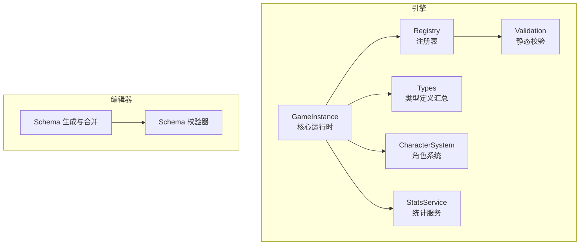
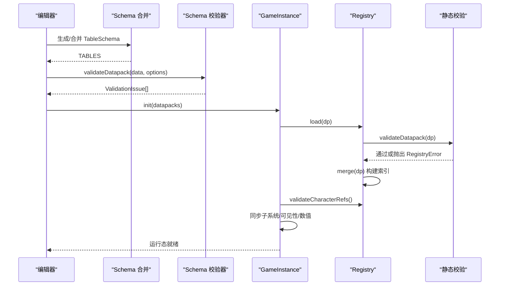
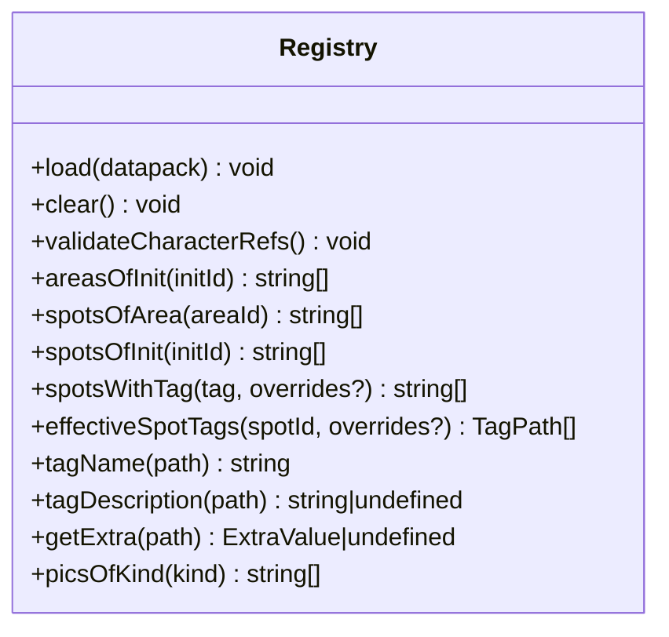
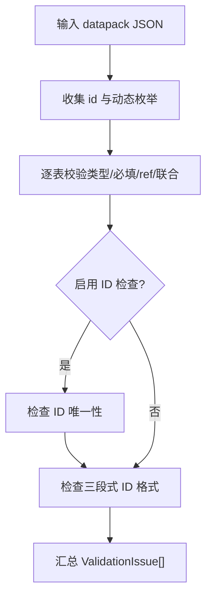
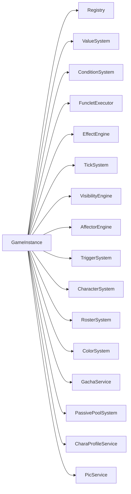

# 数据系统

<cite>
**本文引用的文件**
- [src/engine/registry/registry.ts](file://src/engine/registry/registry.ts)
- [src/engine/registry/registry-validate.ts](file://src/engine/registry/registry-validate.ts)
- [src/engine/types/datapack.ts](file://src/engine/types/datapack.ts)
- [src/engine/game-instance.ts](file://src/engine/game-instance.ts)
- [tools/datapack-editor/schema/datapack.schema.ts](file://tools/datapack-editor/schema/datapack.schema.ts)
- [tools/datapack-editor/schema/merge.ts](file://tools/datapack-editor/schema/merge.ts)
- [tools/datapack-editor/schema/editor-extras.ts](file://tools/datapack-editor/schema/editor-extras.ts)
- [tools/datapack-editor/validate/index.ts](file://tools/datapack-editor/validate/index.ts)
- [src/data/base/characters.ts](file://src/data/base/characters.ts)
- [src/engine/types/common.ts](file://src/engine/types/common.ts)
- [src/engine/types/index.ts](file://src/engine/types/index.ts)
- [src/engine/types/character.ts](file://src/engine/types/character.ts)
- [src/engine/types/state.ts](file://src/engine/types/state.ts)
- [docs-828/03-data-structures/character-entities.md](file://docs-828/03-data-structures/character-entities.md)
- [docs-828/03-data-structures/player-state.md](file://docs-828/03-data-structures/player-state.md)
- [docs-828/03-data-structures/registry.md](file://docs-828/03-data-structures/registry.md)
- [docs-828/03-data-structures/stats-views.md](file://docs-828/03-data-structures/stats-views.md)
- [docs-828/03-data-structures/declarative-dsl.md](file://docs-828/03-data-structures/declarative-dsl.md)
- [docs-828/03-data-structures/id-reference-semantics.md](file://docs-828/03-data-structures/id-reference-semantics.md)
</cite>

## 更新摘要
**变更内容**
- 新增角色实体体系文档：原型/差分/曲线/色彩三层结构说明
- 扩展玩家状态分层架构：Global/per-Init快照/当前运行三层状态管理
- 完善注册表数据结构：完整表清单、关系索引与运行时不可变约束
- 增强统计视图系统：三层统计、DSL函数映射与UI只读视图
- 补充声明式DSL枚举目录：数值表达式、条件、效果、触发器等完整枚举
- 深化ID引用语义分析：真引用与意义引用区分及设计评审意见

## 目录
1. [简介](#简介)
2. [项目结构](#项目结构)
3. [核心组件](#核心组件)
4. [架构总览](#架构总览)
5. [详细组件分析](#详细组件分析)
6. [依赖关系分析](#依赖关系分析)
7. [性能考量](#性能考量)
8. [故障排查指南](#故障排查指南)
9. [结论](#结论)
10. [附录](#附录)

## 简介
本技术文档面向 ACProgram 的数据系统，聚焦以下目标：
- 解释 Datapack 数据包系统的设计：数据结构定义、加载流程与验证机制。
- 说明 Registry 注册表系统的实现：数据注册、引用完整性检查与索引构建。
- 文档化 TypeScript 类型系统：类型组织方式、导出策略与类型安全保证。
- 描述数据模型的关系映射：实体关系、字段定义与数据约束。
- 提供数据包编辑与验证工具使用指南：schema 校验与错误诊断。
- 总结数据迁移、版本兼容性与性能优化的最佳实践。

**更新** 本次更新重点补充了角色实体体系、玩家状态分层、注册表结构、统计视图和声明式DSL的详细文档，完善了数据系统的全景视图。

## 项目结构
ACProgram 的数据系统由"引擎运行时"和"编辑器工具链"两部分组成：
- 引擎侧负责数据加载、注册、校验与运行时访问（Registry、GameInstance、Types）。
- 编辑器侧基于 Schema 驱动的数据包编辑与校验（Schema 生成、合并、校验器）。

**图表来源**
- [src/engine/game-instance.ts:74-114](file://src/engine/game-instance.ts#L74-L114)
- [src/engine/registry/registry.ts:59-543](file://src/engine/registry/registry.ts#L59-L543)
- [tools/datapack-editor/schema/merge.ts:62-102](file://tools/datapack-editor/schema/merge.ts#L62-L102)

**章节来源**
- [src/engine/game-instance.ts:74-114](file://src/engine/game-instance.ts#L74-L114)
- [src/engine/registry/registry.ts:59-543](file://src/engine/registry/registry.ts#L59-L543)
- [tools/datapack-editor/schema/merge.ts:62-102](file://tools/datapack-editor/schema/merge.ts#L62-L102)

## 核心组件
- 数据包类型定义：集中描述所有表结构与可选字段，作为引擎与编辑器共享的契约。
- 注册表：维护各表数据、关系索引与查询接口，并提供跨表引用完整性校验。
- 运行时入口：装配子系统、加载数据包、初始化服务并暴露统一 API。
- 编辑器 Schema：从引擎类型生成基础字段，再叠加编辑器专用语义，形成最终校验与 UI 渲染依据。
- 校验器：基于 Schema 对数据包进行结构、ID 唯一性、格式与引用完整性校验。
- **新增** 角色实体体系：原型/差分/曲线/色彩三层结构，支持抽卡、培养、通讯录功能。
- **新增** 玩家状态分层：Global/per-Init快照/当前运行三层状态管理，支持跨世界线持久化。
- **新增** 统计视图系统：三层统计、DSL函数映射与UI只读视图，支持条件判定与图鉴展示。

**章节来源**
- [src/engine/types/datapack.ts:46-134](file://src/engine/types/datapack.ts#L46-L134)
- [src/engine/registry/registry.ts:59-319](file://src/engine/registry/registry.ts#L59-L319)
- [src/engine/game-instance.ts:74-124](file://src/engine/game-instance.ts#L74-L124)
- [docs-828/03-data-structures/character-entities.md:5-18](file://docs-828/03-data-structures/character-entities.md#L5-L18)
- [docs-828/03-data-structures/player-state.md:5-14](file://docs-828/03-data-structures/player-state.md#L5-L14)
- [docs-828/03-data-structures/stats-views.md:5-15](file://docs-828/03-data-structures/stats-views.md#L5-L15)

## 架构总览
下图展示数据包从编辑器到运行时的完整链路：编辑器通过 Schema 生成与合并得到表结构；校验器在编辑期进行强校验；运行时 GameInstance 加载数据包，Registry 完成注册与索引构建，并在加载完成后执行引用完整性校验。

**图表来源**
- [tools/datapack-editor/schema/merge.ts:62-102](file://tools/datapack-editor/schema/merge.ts#L62-L102)
- [tools/datapack-editor/validate/index.ts:333-390](file://tools/datapack-editor/validate/index.ts#L333-L390)
- [src/engine/game-instance.ts:176-229](file://src/engine/game-instance.ts#L176-L229)
- [src/engine/registry/registry.ts:528-543](file://src/engine/registry/registry.ts#L528-L543)

## 详细组件分析

### Datapack 数据包系统
- 数据结构定义：
  - Datapack 接口聚合了世界线、区域、设施、强化、剧情、物品、掉落表、角色、卡池、色彩、聊天消息、图片、角色资料、资源显示、标签、Extra 等表。
  - 部分表为可选（如 passivePools、dropTables、gachaPools 等），以支持模块化扩展。
- 加载流程：
  - GameInstance.init 遍历数据包，调用 Registry.load 进行静态校验与合并。
  - 同时加载 AffectorPack 与 TriggerDef，随后同步数值系统与可见性。
  - 最后进入默认 Init，记录加载统计信息。
- 验证机制：
  - registry-validate 对 ID 唯一性、引用完整性（init/area/spot/story）、PicId 格式、CharaProfile 结构、Extra 合法性等进行严格校验。
  - 编辑器侧 validate/index.ts 提供 schema 驱动的校验，包括类型、枚举、ref 引用、union/tagged、record 型 extras 等。

**图表来源**
- [src/engine/game-instance.ts:176-229](file://src/engine/game-instance.ts#L176-L229)
- [src/engine/registry/registry.ts:528-543](file://src/engine/registry/registry.ts#L528-L543)
- [src/engine/registry/registry-validate.ts:18-184](file://src/engine/registry/registry-validate.ts#L18-L184)

**章节来源**
- [src/engine/types/datapack.ts:46-134](file://src/engine/types/datapack.ts#L46-L134)
- [src/engine/game-instance.ts:176-229](file://src/engine/game-instance.ts#L176-L229)
- [src/engine/registry/registry-validate.ts:18-184](file://src/engine/registry/registry-validate.ts#L18-L184)

### Registry 注册表系统
- 数据注册：
  - Registry 维护多张 Map/Set 存储各类 Def，并通过 tableSteps 清单统一 merge/clear，新增表只需追加步骤。
  - 特殊处理：GachaMode 白名单校验、characterPersistConfig 范围校验、pics 按 kind 索引、extras 深合并。
- 引用完整性检查：
  - validateCharacterRefs 校验卡池成员/UP 差分与培养曲线引用、色彩装备与颜色组引用、主题设计引用。
- 索引构建：
  - areasByInit、spotsByArea、spotsByTag（层级前缀展开）用于高效查询。
  - effectiveSpotTags 结合运行时 tag 覆盖计算有效标签集合。
  - tagName/tagDescription 解析 Tag 展示名与简介，优先精确匹配，否则沿路径向上查找最长前缀。

**图表来源**
- [src/engine/registry/registry.ts:59-543](file://src/engine/registry/registry.ts#L59-L543)

**章节来源**
- [src/engine/registry/registry.ts:59-543](file://src/engine/registry/registry.ts#L59-L543)

### 角色实体体系
- 实体结构：
  - Character（原型 id）→ 角色基础原型（name/rarity/school，Registry `characters` 表）
  - CharacterVariantDef → 差分：不同时装的独立实体（id/displayName/theme/curves）
  - VariantSource → 产出方式（gacha / story / event）
  - unlockCondition → 差分解锁条件
  - curve → CultivateCurveDef 真引用（培养见培养算法）
  - colorGroupId → 默认头像色彩组 ColorGroupDef
- 原型与差分关系：
  - 原型是角色的「全集」概念：`protoStats` 按原型记账（获得总量等）
  - 差分是具体可持有实体：`state.roster`（Record<VariantId, RosterEntry>）按 variantId 存进度副本
  - 碎片在 `state.fragments`——典型「意义引用」
- 图鉴与通讯录（RosterSystem）：
  - `contactGroups(state)` → 按学校（CharacterSchool）分组的已持有差分，组内按稀有度降序
  - `codex(state)` → 全差分图鉴列表（含未持有，按稀有度降序）
  - `getVariant(variantId)` / `getOwned(state, variantId)` / `shardsOf` → 单个差分详情/持有/碎片
  - 可抽取列表 `drawableOf(pool, state)` 在 `CharacterAvailabilityService`，供卡池用

**章节来源**
- [docs-828/03-data-structures/character-entities.md:5-24](file://docs-828/03-data-structures/character-entities.md#L5-L24)
- [src/engine/types/character.ts:79-137](file://src/engine/types/character.ts#L79-L137)

### 玩家状态分层架构
- 三层分层（跨世界线 / 世界线内 / 当前运行）：
  - **Global**：`globalResources`、`unlockedInits`、`visitedInits`、`groupsOwned`/`equipmentsOwned`、色彩/装备收集、`spotTagOverrides`、`roster`/`fragments`（归属层由 `characterPersistConfig` 逐块声明）
  - **per-Init 快照**：`InitSnapshot`：`{ resources, spotLevels, spotManagers, visitedAreas, totalFrames, inventory, unlockedEnhancements, storyLog, storyReadLogs, flags, triggersCompleted, currentAreaId, extras, roster?, fragments?, gachaState?, chatRead? }`
  - **per-Init 当前**：`resources`、`flags`、`initExtras`、`inventory`、`spotLevels`、`currentAreaId`、`storyLog`、`visitedAreas`
- 关键约定：读状态时「当前层有值用当前层，无值回退快照层」——由 `extraFromLayer` / `resourceBucket` 等访问器统一实现
- 主要字段：
  - `activeInit`、`resources`/`globalResources`、`flags`/`initExtras`/`extras`、`inventory`、`spotLevels`/`spotManagers`
  - `currentAreaId`/`visitedAreas`/`visitedInits`、`spotTagOverrides`、`unlockedEnhancements`/`enhancementAttachments`
  - `storyLog`、`triggersCompleted`、`roster`/`fragments`、`gachaState`、`studentBlocks`
  - `chatRead`/`passiveCooldowns`、`charaCustom`、`worldPool`、`protoStats`
  - `tagEffects`/`entityEffects`、`groupsOwned`/`activeGroupId`/`equipmentsOwned`
  - `entityThemeSlots`/`entityThemeDesignsOwned`、`themeLayerOrder`、`initSnapshots`
  - `globalStats`/`initStats`/会话统计

**章节来源**
- [docs-828/03-data-structures/player-state.md:5-42](file://docs-828/03-data-structures/player-state.md#L5-L42)
- [src/engine/types/state.ts:35-140](file://src/engine/types/state.ts#L35-L140)

### 统计视图系统
- 三层统计（StatsService）：
  - **Global**：`globalStats` - 跨世界线永久，全部运行累计
  - **per-Init**：`initStats` - 世界线生命周期，该世界线全部运行累计
  - **当前运行**：`currentRunStats` - 本次游玩，当前 runId 累计
- 统计 DSL（`$GlobalProducedAmount base:resource:credit` 等）：
  - `parseStatCall(dsl)` → `{ fn, key, initId }`
  - 统计函数（30+ 个）统一映射到三层桶的特定指标
  - 条件系统经 `stat` 条件 target 求值
- 标签统计（TagStatService）：
  - 按实体类型聚合收集数：`TagStatKind` 7 种（spots/areas/characters/…）
  - 键格式 `<kind>:<tagDisplay>`，供条件 `tagCount` 引用与图鉴展示
  - 世界倾向 `worldTilt` 为定宽串「首位(0|1).尾15位」
- UI 只读视图（GameView / UIContext）：
  - `getView()` → `GameView`：资源快照 + spotLevels + unlockedInits + storyLog + visibility 等
  - `createUIContext(game)` → `UIContext`：GameView + nameOf/formatNumber/escapeHtml 等 UI 辅助
  - 组件层只持 `UIFacingGame`（18 个只读成员），每帧 `refreshLight` 更新数字

**章节来源**
- [docs-828/03-data-structures/stats-views.md:5-32](file://docs-828/03-data-structures/stats-views.md#L5-L32)
- [src/engine/types/state.ts:197-232](file://src/engine/types/state.ts#L197-L232)

### 声明式 DSL 枚举目录
- 数值与表达式（ValueSystem）：
  - `ValueSource`：const、res、spotLevel、areaSpotCount、managerCount、funclet、data
  - `ValueExpression`：const、value、add/sub/mul/div/min/max/pow、floor/ceil/round、clamp
- Funclet（可复用数值片段）：
  - `FuncletDef`：`{ id, description, params, calc, extra }`
  - `FuncletCall`：`{ funcletId, args }`
- 条件（ConditionSystem）：
  - `Comparator`：== != >= <= > <
  - `ConditionTarget`：15 种目标（resource、spotLevel、manager、flag、hasEnh、hasTag、countTags、tagCount、stat、hasReadStory、hasReadStoryInRun、visitedStoryInChain、extra、protoStat、area）
- 效果（EffectOp）：
  - 23 种操作：setResource、addResource、setSpotLevel、addSpotLevel、setManager、addEnhancement、addItem、unlockInit、setFlag、setExtra/addExtra/removeExtra、grantCharacter、loot、triggerStory、travelToArea、setTheme、setSpotMaxLevel/removeSpotMaxLevel、clearAllChatFlow、showChatText、clearIdChatFlow、clearAllChatText
- 触发与持续效果：
  - `TriggerEventDef.kind`：9 种（tick、resource、spotLevel、item、story、init、area、character、cultivated）
  - `AffectorState`：Latent → Active → Removed
- Extra 数据树（类 NBT）：
  - `ExtraValue.t`：int/float/str/bool/list/dict
  - `ExtraCompound` = dict 别名
  - `ExtraPath` = `/` 分隔字符串
- 世界实体功能：
  - `SpotFunctionalityDef.kind`：linearYield、restartInit、hardResetInit、gacha
- 揭示与可达性阶梯：
  - `RevealStage`：7 级（invisible → presence → partial → known → utility → purchaseable → owned）
  - `AccessStage`：5 阶段（hidden → obfuscated → revealed → accessible → active）

**章节来源**
- [docs-828/03-data-structures/declarative-dsl.md:6-195](file://docs-828/03-data-structures/declarative-dsl.md#L6-L195)

### ID 引用语义分析
- 判定标准：
  - **真引用**：引用方把 id 解析成注册表里的 Def 后，使用该 Def 的内容字段决定行为
  - **意义引用**：引用方只用 id 做身份匹配/归属/分组/路由/状态键，行为由引用方自身携带的内容决定
  - **内部身份**：id 仅用于该实体自身生命周期，不存在跨 Def 引用
  - **未接线**：字段声明即存，当前无运行时消费方
- 世界结构引用：
  - AreaDef.initId、SpotDef.areaId、InitDef.defaultAreas、AreaDef.defaultSpots、AreaDef.adjacentAreaIds、InitDef.startStoryId
- 剧情引用：
  - StoryEntryBase.storyId、Talklet.jumpToStory、BranchGuard.storyId、PassivePoolChild.id、ActiveStoryEntry.availableInits
- 角色/培养/抽卡/色彩引用：
  - CharacterVariantDef.proto、curve、colorGroupId、GachaPoolDef.featured、SpotDef.gachaPools、RosterEntry.equippedEquipment
- 物品/掉落/强化引用：
  - DropTableDef.entries[].itemId、Effect addItem、EnhancementDef.affectorPackIds、SpotFunctionalityDef.id
- 数值/表达式/事件层引用：
  - FuncletCall.funcletId、TriggerDef.id、AffectorEffect.id、各 Def 的 tags、资源 id、avatar/image 的 PicId
- 潜在设计问题：
  - StoryEntry.id 与 StoryDef.id 共用主键且无校验
  - 真/意义引用没有统一校验规则
  - 混合/双通道引用与隐式覆盖
  - 写而不读/未接线
  - 字符串 ID 泛滥

**章节来源**
- [docs-828/03-data-structures/id-reference-semantics.md:6-131](file://docs-828/03-data-structures/id-reference-semantics.md#L6-L131)

### TypeScript 类型系统
- 类型组织方式：
  - engine/types/index.ts 汇总导出，涵盖 ID、表达式、Def、状态、结果、事件、图片等。
  - datapack.ts 作为汇总类型，将各子模块类型聚合为 Datapack 接口。
  - common.ts 提供跨领域共享定义（ResourceDisplayDef、TagDef、CharacterData 等）。
- 类型导出策略：
  - 通过 index 统一出口，保持向后兼容与简洁导入。
  - 编辑器侧通过 merge.ts 将引擎类型 TSDoc 转换为 FieldDef，再叠加 editor-extras 的复杂编辑语义。
- 类型安全保证：
  - 引擎侧通过严格的接口与枚举约束（如 GachaMode 白名单、PicId 三段式）。
  - 编辑器侧通过 Schema 校验器确保 JSON 结构与值域符合预期，避免运行时错误。

**章节来源**
- [src/engine/types/index.ts:1-30](file://src/engine/types/index.ts#L1-L30)
- [src/engine/types/datapack.ts:46-134](file://src/engine/types/datapack.ts#L46-L134)
- [src/engine/types/common.ts:18-116](file://src/engine/types/common.ts#L18-L116)
- [tools/datapack-editor/schema/merge.ts:15-60](file://tools/datapack-editor/schema/merge.ts#L15-L60)

### 数据模型关系映射
- 实体关系：
  - Init → Area → Spot 层级关系，支持按 Init 隔离查询。
  - StoryEntry → Story 重定向，active/passive 入口统一视图 storyEntries。
  - CharacterVariant ↔ CultivateCurve，GachaPool 引用 Variant。
  - ColorEquipment ↔ ColorGroup，ThemeDesign 引用 ColorGroup。
  - Pic 资产通过三段式 id 索引并按 kind 分类。
- 字段定义与约束：
  - ResourceDisplayDef 控制资源条显示策略与排序。
  - TagDef 提供层级标签的名称与简介。
  - CharacterData 包含学校、稀有度、产出加成、被动描述与标签。
- 数据约束：
  - ID 唯一性、三段式 ID 格式、ref 引用存在性、枚举取值范围、extra 结构合法性。

**章节来源**
- [src/engine/registry/registry.ts:107-112](file://src/engine/registry/registry.ts#L107-L112)
- [src/engine/registry/registry.ts:378-408](file://src/engine/registry/registry.ts#L378-L408)
- [src/engine/types/common.ts:18-116](file://src/engine/types/common.ts#L18-L116)

### 编辑器与校验工具使用指南
- Schema 生成与合并：
  - 从引擎类型生成基础字段（string/int/float/bool/enum/ref/array/object/record/extra/flexible/hand）。
  - editor-extras 覆盖复杂编辑语义（tagged 联动、optionsFrom 动态枚举、divider 分组、整表自定义）。
  - buildTables 输出 13 张表的最终 Schema。
- 校验流程：
  - validateDatapack 两阶段：收集 id 与动态枚举，逐表校验类型、必填、ref、union/tagged、record extras。
  - 支持 ID 唯一性检查与三段式格式检查。
- 错误诊断：
  - 返回 ValidationIssue 列表，包含表名、行号、路径、严重级别与消息，便于定位问题。

**图表来源**
- [tools/datapack-editor/schema/merge.ts:62-102](file://tools/datapack-editor/schema/merge.ts#L62-L102)
- [tools/datapack-editor/schema/editor-extras.ts:95-198](file://tools/datapack-editor/schema/editor-extras.ts#L95-L198)
- [tools/datapack-editor/validate/index.ts:333-390](file://tools/datapack-editor/validate/index.ts#L333-L390)

**章节来源**
- [tools/datapack-editor/schema/datapack.schema.ts:1-20](file://tools/datapack-editor/schema/datapack.schema.ts#L1-L20)
- [tools/datapack-editor/schema/merge.ts:62-102](file://tools/datapack-editor/schema/merge.ts#L62-L102)
- [tools/datapack-editor/schema/editor-extras.ts:95-198](file://tools/datapack-editor/schema/editor-extras.ts#L95-L198)
- [tools/datapack-editor/validate/index.ts:333-390](file://tools/datapack-editor/validate/index.ts#L333-L390)

## 依赖关系分析
- 组件耦合：
  - GameInstance 组合多个子系统（StoryService、SpotService、InitService、ItemService、EnhancementService、SessionService、ChatFlowService、VisibilityEngine、EffectEngine、TickSystem、AffectorEngine、TriggerSystem、CharacterSystem、RosterSystem、ColorSystem、GachaService、PassivePoolSystem、CharaProfileService、PicService）。
  - Registry 依赖 types 与 extra 工具，以及 registry-validate 进行静态校验。
- 外部依赖与集成点：
  - 编辑器 Schema 与校验器独立于游戏代码，仅依赖 schema DSL 与数据本身。
  - 运行时通过 EventBus、DevLog、StatsService 等基础设施进行事件与日志记录。

**图表来源**
- [src/engine/game-instance.ts:74-114](file://src/engine/game-instance.ts#L74-L114)

**章节来源**
- [src/engine/game-instance.ts:74-114](file://src/engine/game-instance.ts#L74-L114)

## 性能考量
- 索引优化：
  - spotsByTag 使用前缀展开建立层级标签索引，加速按标签查询。
  - effectiveSpotTags 结合运行时覆盖，避免全量扫描。
- 懒求值与缓存：
  - gameNumSystem.buildAll 构建资源 gain 树，采用懒求值与失效标记减少重复计算。
- 增量更新：
  - visibilityEngine 事件驱动增量更新可见性快照，不在每帧全量重算。
- 批量操作：
  - Registry.merge 通过 tableSteps 统一处理，减少重复逻辑与维护成本。
- **新增** 角色系统优化：
  - 原型与差分分离，减少重复数据存储
  - 通讯录分组运行时派生，避免持久化开销
  - 统计服务三层累加，支持高效查询

## 故障排查指南
- 常见错误：
  - ID 重复：校验器报告重复 ID，需检查数据包中同名条目。
  - 引用不存在：ref 引用未定义的实体，需确认被引用表已加载且 ID 正确。
  - 三段式 ID 格式错误：PicId 或其他 ID 不符合 pack:kind:name 格式。
  - Extra 结构非法：assertValidExtra 抛出异常，需修正键路径与值类型。
- 诊断方法：
  - 查看 ValidationIssue 列表，定位表、行号与路径。
  - 检查 RegistryError 消息，定位具体校验失败点。
  - 使用 devLog 记录加载过程与警告信息。
- **新增** 角色系统故障：
  - 差分引用错误：检查 CharacterVariantDef 的 proto、curve、colorGroupId 引用
  - 卡池配置错误：验证 GachaPoolDef 的 members、featured、rates 配置
  - 培养曲线缺失：确认 CultivateCurveDef 定义完整

**章节来源**
- [tools/datapack-editor/validate/index.ts:39-48](file://tools/datapack-editor/validate/index.ts#L39-L48)
- [src/engine/registry/registry-validate.ts:11-16](file://src/engine/registry/registry-validate.ts#L11-L16)
- [src/engine/game-instance.ts:201-228](file://src/engine/game-instance.ts#L201-L228)

## 结论
ACProgram 的数据系统通过清晰的职责划分与严格的校验机制，实现了高内聚、低耦合的数据管理与运行时访问。Datapack 定义了统一的契约，Registry 提供了高效的注册与查询能力，TypeScript 类型系统与编辑器 Schema 共同保障了数据的一致性与可维护性。

**更新** 本次更新进一步完善了角色实体体系、玩家状态分层、注册表结构、统计视图和声明式DSL的详细文档，为数据系统提供了更完整的技术参考。遵循本文的最佳实践，可有效提升数据包开发效率与系统稳定性。

## 附录
- 示例数据：
  - characters.ts 提供精简测试数据，覆盖各学部与稀有度，便于快速验证功能。
- 参考路径：
  - 数据包类型定义：[src/engine/types/datapack.ts](file://src/engine/types/datapack.ts)
  - 注册表实现：[src/engine/registry/registry.ts](file://src/engine/registry/registry.ts)
  - 静态校验：[src/engine/registry/registry-validate.ts](file://src/engine/registry/registry-validate.ts)
  - 编辑器 Schema：[tools/datapack-editor/schema/merge.ts](file://tools/datapack-editor/schema/merge.ts)、[tools/datapack-editor/schema/editor-extras.ts](file://tools/datapack-editor/schema/editor-extras.ts)
  - 编辑器校验器：[tools/datapack-editor/validate/index.ts](file://tools/datapack-editor/validate/index.ts)
- **新增** 相关文档：
  - 角色实体：[docs-828/03-data-structures/character-entities.md](file://docs-828/03-data-structures/character-entities.md)
  - 玩家状态：[docs-828/03-data-structures/player-state.md](file://docs-828/03-data-structures/player-state.md)
  - 注册表结构：[docs-828/03-data-structures/registry.md](file://docs-828/03-data-structures/registry.md)
  - 统计视图：[docs-828/03-data-structures/stats-views.md](file://docs-828/03-data-structures/stats-views.md)
  - 声明式DSL：[docs-828/03-data-structures/declarative-dsl.md](file://docs-828/03-data-structures/declarative-dsl.md)
  - ID引用语义：[docs-828/03-data-structures/id-reference-semantics.md](file://docs-828/03-data-structures/id-reference-semantics.md)

**章节来源**
- [src/data/base/characters.ts:11-88](file://src/data/base/characters.ts#L11-L88)