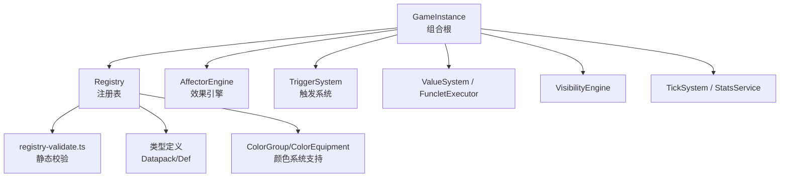
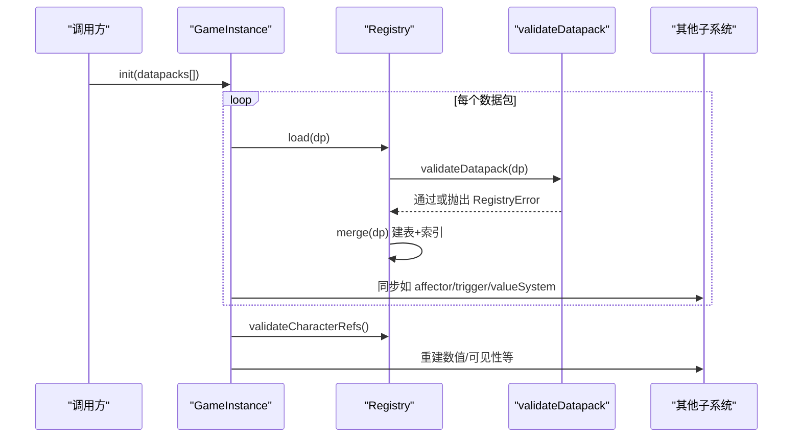
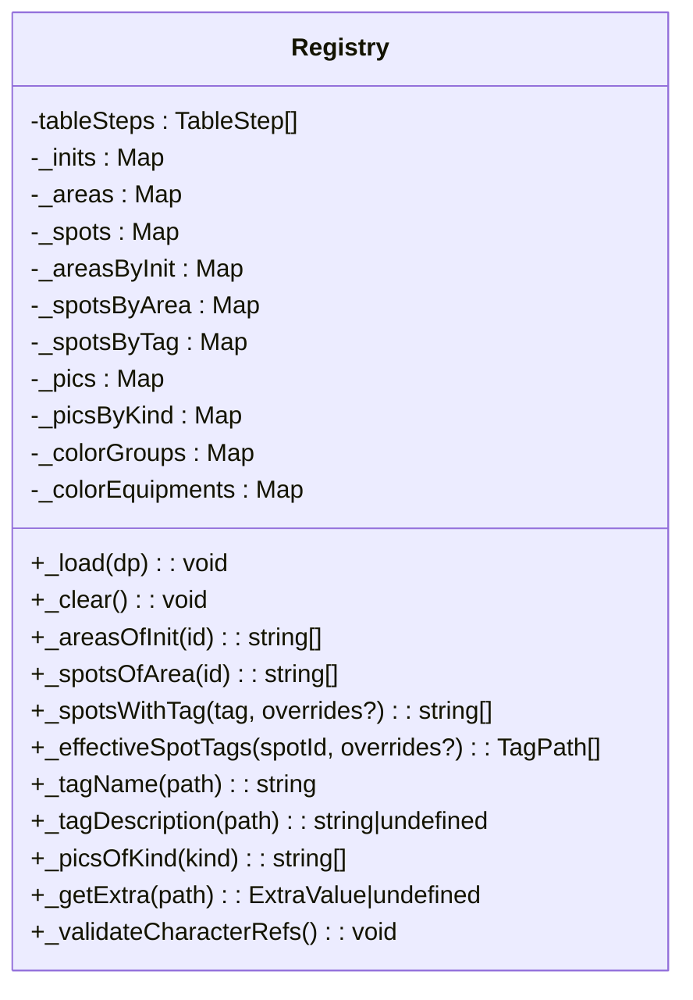
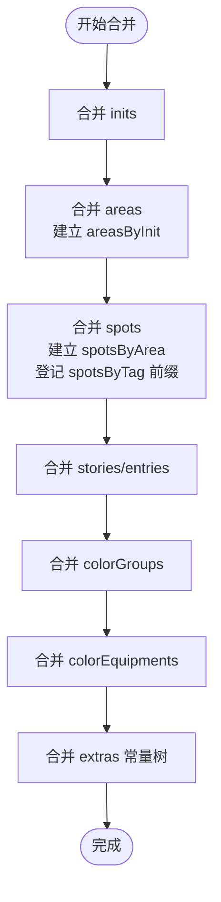
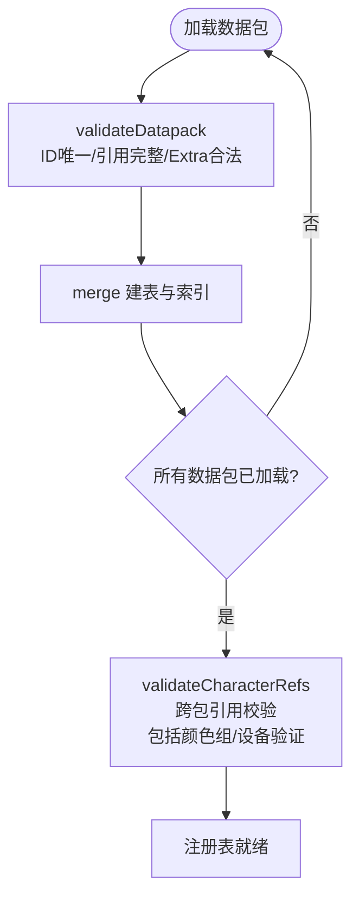
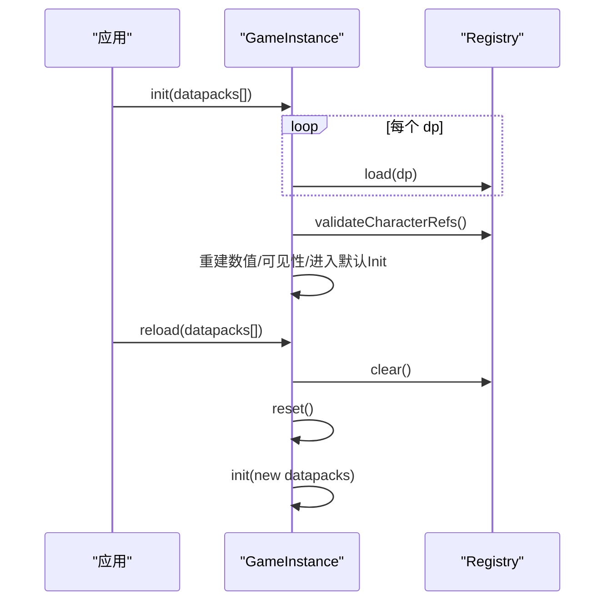
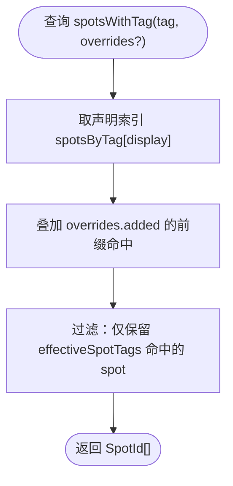
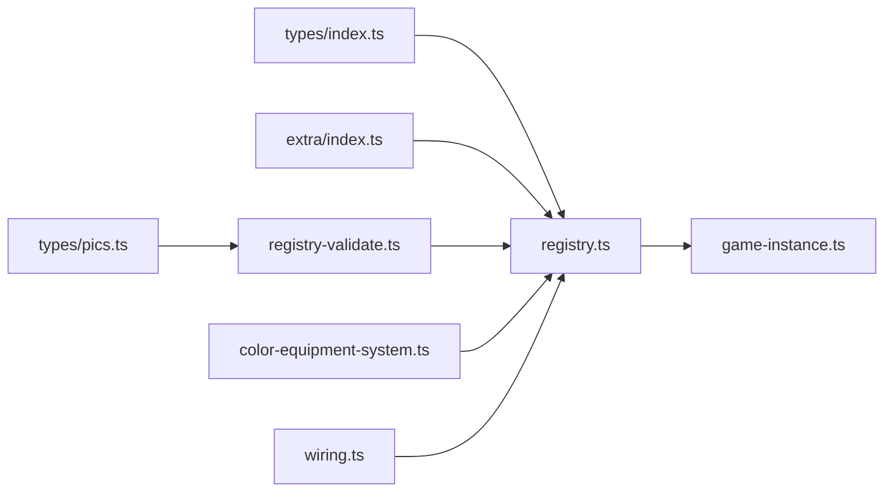

# 注册表系统

<cite>
**本文引用的文件**
- [registry.ts](file://src/engine/registry/registry.ts)
- [registry-validate.ts](file://src/engine/registry/registry-validate.ts)
- [game-instance.ts](file://src/engine/game-instance.ts)
- [wiring.ts](file://src/engine/game/wiring.ts)
- [state-mutation-service.ts](file://src/engine/system/state-mutation-service.ts)
- [color-equipment-system.ts](file://src/engine/system/color-equipment-system.ts)
- [03b-registry.md](file://docs-824/03b-registry.md)
- [registry.test.ts](file://tests/engine/registry.test.ts)
</cite>

## 更新摘要
**所做更改**
- 更新了颜色组（ColorGroup）和颜色设备（ColorEquipment）的注册表支持
- 增强了引用完整性检查机制，包括颜色组到颜色、设备到颜色组/主题颜色的验证
- 添加了新的访问器方法 getColorGroup 和 getColorEquipment
- 扩展了状态突变服务的颜色相关功能
- 更新了索引构建过程以支持新的数据类型

## 目录
1. [简介](#简介)
2. [项目结构](#项目结构)
3. [核心组件](#核心组件)
4. [架构总览](#架构总览)
5. [详细组件分析](#详细组件分析)
6. [依赖关系分析](#依赖关系分析)
7. [性能考虑](#性能考虑)
8. [故障排查指南](#故障排查指南)
9. [结论](#结论)
10. [附录：扩展与自定义指南](#附录：扩展与自定义指南)

## 简介
本文件为 ACProgram 的注册表（Registry）系统提供完整技术文档。注册表是编译期数据容器，负责数据对象的注册、查找、引用管理与索引构建；同时承担数据包加载期的静态校验、跨包引用完整性检查以及运行时只读视图暴露。其设计目标是：
- 将"声明式数据"在加载阶段集中合并、校验并建立高效索引；
- 保证运行时对注册表的访问不可变且稳定；
- 通过关系索引与标签前缀匹配实现高性能查询；
- 提供可扩展的数据表与索引机制，便于新增数据类型与查询接口。

**更新** 现已支持颜色组（ColorGroup）和颜色设备（ColorEquipment）的完整生命周期管理，包括数据注册、引用验证和访问器方法。

## 项目结构
注册表相关代码位于 engine/registry 目录，包含主实现与校验模块；GameInstance 作为组合根在 init/reload/reset 生命周期中协调注册表与其他子系统；docs-824 提供概念性说明；tests 覆盖关键行为。

图表来源
- [game-instance.ts:176-229](file://src/engine/game-instance.ts#L176-L229)
- [registry.ts:59-544](file://src/engine/registry/registry.ts#L59-L544)
- [registry-validate.ts:1-184](file://src/engine/registry/registry-validate.ts#L1-L184)

章节来源
- [game-instance.ts:176-229](file://src/engine/game-instance.ts#L176-L229)
- [registry.ts:59-544](file://src/engine/registry/registry.ts#L59-L544)
- [registry-validate.ts:1-184](file://src/engine/registry/registry-validate.ts#L1-L184)
- [03b-registry.md:1-47](file://docs-824/03b-registry.md#L1-L47)

## 核心组件
- Registry：注册表主体，维护多张数据表与关系索引，提供只读访问器、查询方法与生命周期方法（load/clear）。
- RegistryError：统一错误类型，用于加载期失败快速失败（fail-fast）。
- validateDatapack：纯函数校验器，负责 ID 唯一性、引用完整性与 Extra 合法性。
- GameInstance：组合根，负责初始化、重载、重置时协调注册表与各子系统同步。

**更新** 新增了颜色组（ColorGroup）和颜色设备（ColorEquipment）的完整支持，包括数据表存储、索引构建和引用验证。

章节来源
- [registry.ts:59-544](file://src/engine/registry/registry.ts#L59-L544)
- [registry-validate.ts:11-16](file://src/engine/registry/registry-validate.ts#L11-L16)
- [registry-validate.ts:19-184](file://src/engine/registry/registry-validate.ts#L19-L184)
- [game-instance.ts:176-229](file://src/engine/game-instance.ts#L176-L229)

## 架构总览
注册表采用"表 + 索引 + 校验"的分层设计：
- 表：以 Map/Set 存储各类型实体（Init/Area/Spot/Story/Item/Character/GachaPool/ColorGroup/Tag/Pic/Extra 等）。
- 索引：建立 Init→Area、Area→Spot、Spot→Tag（层级前缀）、PicKind→Id 等反向索引，支持 O(1)/O(k) 查询。
- 校验：加载期先进行静态校验，再合并到注册表；跨包引用在全部数据包加载完成后统一校验。

**更新** 现在包含颜色组和设备相关的索引构建和引用验证流程。

图表来源
- [game-instance.ts:176-229](file://src/engine/game-instance.ts#L176-L229)
- [registry.ts:528-543](file://src/engine/registry/registry.ts#L528-L543)
- [registry-validate.ts:19-184](file://src/engine/registry/registry-validate.ts#L19-L184)

## 详细组件分析

### Registry 类：数据对象注册、查找与引用管理
- 数据表：inits、areas、spots、enhancements、stories、activeStories、passiveStories、passivePools、items、dropTables、funcletDefs、characters、characterVariants、cultivateCurves、gachaPools、colorGroups、colorEquipments、themeDesigns、chatMessages、resourceDisplays、tags、pics、charaProfiles、extras。
- 关系索引：
  - areasByInit：Init → Area[]
  - spotsByArea：Area → Spot[]
  - spotsByTag：TagPath（展开所有前缀）→ SpotId Set
  - picsByKind：PicKind → PicId Set
- 只读访问器：对外暴露 ReadonlyMap，防止外部修改内部状态。
- 查询接口：
  - areasOfInit/spotsOfArea/spotsOfInit：基于关系索引的高效查询。
  - spotsWithTag：支持运行时 tag 增撤覆盖（overrides），结合声明索引与有效 tags 复核。
  - effectiveSpotTags：计算 Spot 的有效标签集合（声明 + 新增 − 移除）。
  - tagName/tagDescription：解析 Tag 展示名与描述，支持路径继承。
  - picsOfKind：按图片用途类别返回完整索引列表。
  - getExtra/get extras：读取全局常量树（数据包 extras 深合并结果）。

**更新** 新增了 colorGroups 和 colorEquipments 的完整支持，包括数据表存储、getter 访问器和生命周期管理。

图表来源
- [registry.ts:59-544](file://src/engine/registry/registry.ts#L59-L544)

章节来源
- [registry.ts:59-544](file://src/engine/registry/registry.ts#L59-L544)

### 索引构建过程：ID 映射、类型索引与关联关系
- ID 映射：每张表以 id 为键建立 Map，确保 O(1) 查找。
- 类型索引：
  - picsByKind：从 PicId 三段式中段推导 typeName，建立用途类别索引。
  - spotsByTag：对 Spot.tags 中的每个路径，登记其所有前缀（父含子），实现层级匹配。
- 关联关系：
  - areasByInit：记录每个 Init 下的默认 Area。
  - spotsByArea：记录每个 Area 下的 Spot。
  - storyEntries：合并 active/passive 故事入口，供统一遍历。

**更新** 新增了颜色组和设备的数据表处理，包括 colorGroups 和 colorEquipments 的合并逻辑。

图表来源
- [registry.ts:113-319](file://src/engine/registry/registry.ts#L113-L319)

章节来源
- [registry.ts:113-319](file://src/engine/registry/registry.ts#L113-L319)

### 引用完整性检查：循环引用检测、缺失引用验证与一致性保证
- 静态校验（加载期）：
  - ID 唯一性：同一表内禁止重复 id。
  - 引用完整性：area.initId、spot.areaId、init.defaultAreas、area.defaultSpots、storyEntry.storyId 必须存在。
  - Extra 合法性：Def.extra 与 datapack.extras 必须符合 Extra 树规则。
  - 颜色组和设备：colorGroups 和 colorEquipments 的 ID 唯一性检查。
- 动态校验（全部数据包加载后）：
  - validateCharacterRefs：校验 gachaPools 成员/featured 指向的 characterVariants 是否存在；characterVariants.curve 指向的 cultivateCurves 是否存在；colorEquipments/themeDesigns 的 colorGroupId 是否有效。
  - **新增** 颜色组和设备引用验证：检查 colorEquipments 的 colorGroupId 和 theme.colorGroupId 是否指向有效的 colorGroups。
- 循环引用检测：当前实现未显式检测循环引用；由于表以 id 为键且无自引用字段，循环引用风险较低。若未来引入自引用字段，可在 merge 阶段加入环检测。

**更新** 增强了 validateCharacterRefs 方法，现在包含颜色组和设备之间的引用完整性验证。

图表来源
- [registry-validate.ts:19-184](file://src/engine/registry/registry-validate.ts#L19-L184)
- [registry.ts:378-408](file://src/engine/registry/registry.ts#L378-L408)

章节来源
- [registry-validate.ts:19-184](file://src/engine/registry/registry-validate.ts#L19-L184)
- [registry.ts:378-408](file://src/engine/registry/registry.ts#L378-L408)

### 生命周期管理：初始化、更新与清理
- 初始化（init）：
  - 逐个数据包调用 registry.load，依次执行静态校验与合并。
  - 同步其他子系统（affector/trigger/valueSystem/funcletExecutor）。
  - 调用 validateCharacterRefs 完成跨包引用校验。
  - 重建数值系统与可见性索引，进入默认 Init。
- 更新（reload）：
  - 停止运行、清空注册表与子系统、重置运行时状态，再重新 init。
- 清理（clear/reset）：
  - registry.clear 清空所有表与索引；reset 重置 PlayerState 与子系统。

**更新** 生命周期管理现在包含颜色组和设备数据的完整处理流程。

图表来源
- [game-instance.ts:176-245](file://src/engine/game-instance.ts#L176-L245)
- [registry.ts:528-543](file://src/engine/registry/registry.ts#L528-L543)

章节来源
- [game-instance.ts:176-245](file://src/engine/game-instance.ts#L176-L245)
- [registry.ts:528-543](file://src/engine/registry/registry.ts#L528-L543)

### 查询接口与运行时标签覆盖
- spotsWithTag：支持传入运行时 tag 增撤覆盖（PlayerState.spotTagOverrides），先命中声明索引，再用有效 tags 复核，确保一致性。
- effectiveSpotTags：计算 Spot 的有效标签集合（声明 + 新增 − 移除），供上层逻辑使用。
- tagName/tagDescription：优先精确匹配 TagDef，否则沿路径向上继承最长前缀定义，未定义则回退为路径串显示。

**更新** 新增了颜色组和设备的查询接口支持。

图表来源
- [registry.ts:471-517](file://src/engine/registry/registry.ts#L471-L517)

章节来源
- [registry.ts:471-517](file://src/engine/registry/registry.ts#L471-L517)

### 颜色组和设备系统集成
**新增** 颜色组（ColorGroup）和颜色设备（ColorEquipment）的完整集成：

- **数据表支持**：
  - `_colorGroups`：存储 ColorGroupDef 对象，提供颜色组的统一管理
  - `_colorEquipments`：存储 ColorEquipmentDef 对象，提供颜色设备的统一管理
- **访问器方法**：
  - `colorGroups`：获取颜色组表的只读视图
  - `colorEquipments`：获取颜色设备表的只读视图
- **引用验证**：
  - 验证 colorEquipments 的 colorGroupId 指向有效的 colorGroups
  - 验证 colorEquipments 的 theme.colorGroupId 指向有效的 colorGroups  
  - 验证 themeDesigns 的 theme.colorGroupId 指向有效的 colorGroups
- **系统集成**：
  - wiring.ts 中注入 getColorGroup 和 getColorEquipment 访问器
  - state-mutation-service.ts 中扩展字符目录读取器支持颜色相关查询
  - color-equipment-system.ts 提供完整的颜色设备管理系统

章节来源
- [registry.ts:88-90](file://src/engine/registry/registry.ts#L88-L90)
- [registry.ts:236-248](file://src/engine/registry/registry.ts#L236-L248)
- [registry.ts:351-356](file://src/engine/registry/registry.ts#L351-L356)
- [registry.ts:395-407](file://src/engine/registry/registry.ts#L395-L407)
- [wiring.ts:134-135](file://src/engine/game/wiring.ts#L134-L135)
- [state-mutation-service.ts:64-72](file://src/engine/system/state-mutation-service.ts#L64-L72)

## 依赖关系分析
- Registry 依赖 types 定义（Datapack/各种 Def）与 extra 工具（expandFlatKeys/mergeExtra/getAtPath）。
- 校验模块依赖 pics 解析与 extra 校验工具。
- GameInstance 组合 Registry 与多个子系统，并在 init/reload/reset 中协调同步。

**更新** 现在包含颜色系统和设备系统的依赖关系。

图表来源
- [registry.ts:5-45](file://src/engine/registry/registry.ts#L5-L45)
- [registry-validate.ts:7-9](file://src/engine/registry/registry-validate.ts#L7-L9)
- [game-instance.ts:176-229](file://src/engine/game-instance.ts#L176-L229)

章节来源
- [registry.ts:5-45](file://src/engine/registry/registry.ts#L5-L45)
- [registry-validate.ts:7-9](file://src/engine/registry/registry-validate.ts#L7-L9)
- [game-instance.ts:176-229](file://src/engine/game-instance.ts#L176-L229)

## 性能考虑
- 索引化查询：
  - areasByInit/spotsByArea：O(1) 获取关联列表。
  - spotsByTag：通过前缀展开实现层级匹配，查询复杂度与标签深度线性相关。
  - picsByKind：按用途类别快速枚举图片索引。
- 批量操作：
  - tableSteps 模式使 merge/clear 可批量遍历，新增表只需添加一步，降低维护成本。
- 内存管理：
  - 使用 Map/Set 存储，clear 时整体清空，避免碎片化。
  - extras 深合并仅在加载期进行，运行时只读。
- 缓存机制：
  - 索引即缓存；运行时标签覆盖不改变声明索引，而是通过 overrides 增量计算，减少重建开销。
- 建议优化：
  - 对于热点查询（如高频 spotsWithTag），可考虑缓存最近查询结果并按事件失效。
  - 大数据包场景下，可将索引构建拆分为分片任务，避免主线程阻塞。

**更新** 颜色组和设备数据的查询也受益于现有的索引化设计，提供高效的 O(1) 访问性能。

## 故障排查指南
- 常见错误：
  - 重复 ID：校验阶段抛出 RegistryError，提示具体表与 id。
  - 未知引用：area/init/spot/story 等引用不存在时报错，需检查数据包顺序或补全定义。
  - Extra 非法：Def.extra 或 datapack.extras 不符合规则时报错，需修正结构。
  - 卡池/差分/曲线/颜色组引用无效：validateCharacterRefs 在全部数据包加载后统一校验。
  - **新增** 颜色组和设备引用错误：colorEquipments 或 themeDesigns 引用的 colorGroupId 不存在时会报错。
- 调试步骤：
  - 查看日志输出（GameInstance 记录加载数据包数量与统计信息）。
  - 逐步注释数据包定位冲突源。
  - 使用 tests 中的用例对照行为，确认期望结果。

**更新** 新增了颜色组和设备相关的错误排查指导。

章节来源
- [registry-validate.ts:19-184](file://src/engine/registry/registry-validate.ts#L19-L184)
- [registry.ts:378-408](file://src/engine/registry/registry.ts#L378-L408)
- [game-instance.ts:224-228](file://src/engine/game-instance.ts#L224-L228)
- [registry.test.ts:41-268](file://tests/engine/registry.test.ts#L41-L268)

## 结论
注册表系统通过"表 + 索引 + 校验"的设计，实现了高效、安全、可扩展的数据管理。其在加载期完成静态校验与索引构建，在运行时提供只读视图与高性能查询；通过 tableSteps 模式与统一的错误处理，降低了扩展与维护成本。配合 GameInstance 的生命周期管理，确保了系统的一致性与稳定性。

**更新** 最新增强包括对颜色组（ColorGroup）和颜色设备（ColorEquipment）的完整支持，提供了更丰富的视觉定制能力和更严格的引用完整性保障。

## 附录：扩展与自定义指南
- 新增数据表：
  - 在 Registry 中添加私有字段与 getter。
  - 在 constructor 的 tableSteps 中添加对应 step（merge/clear）。
  - 如需关系索引，补充相应 Map/Set 并在 merge 中维护。
- 新增查询接口：
  - 基于现有索引实现 O(1)/O(k) 查询；必要时引入缓存策略。
  - 若涉及运行时覆盖，参考 spotsWithTag/effectiveSpotTags 的模式，使用 overrides 参数。
- 扩展校验规则：
  - 在 validateDatapack 中添加 ID 唯一性或引用完整性检查。
  - 对 Extra 字段进行结构化校验，确保类型安全。
- 集成到生命周期：
  - 在 GameInstance.init 中调用 registry.load，并在全部数据包加载后调用 validateCharacterRefs。
  - 在 reload/reset 中确保 clear/reset 正确执行，避免状态残留。

**更新** 颜色组和设备扩展示例：
- 参考 registry.ts 中的 colorGroups 和 colorEquipments 实现
- 在 validateCharacterRefs 中添加相应的引用验证逻辑
- 在 wiring.ts 中注入相应的访问器方法
- 在 state-mutation-service.ts 中扩展相关的查询能力

章节来源
- [registry.ts:59-319](file://src/engine/registry/registry.ts#L59-L319)
- [registry-validate.ts:19-184](file://src/engine/registry/registry-validate.ts#L19-L184)
- [game-instance.ts:176-245](file://src/engine/game-instance.ts#L176-L245)
- [registry.test.ts:80-186](file://tests/engine/registry.test.ts#L80-L186)
- [registry.ts:236-248](file://src/engine/registry/registry.ts#L236-L248)
- [registry.ts:395-407](file://src/engine/registry/registry.ts#L395-L407)
- [wiring.ts:134-135](file://src/engine/game/wiring.ts#L134-L135)
- [state-mutation-service.ts:64-72](file://src/engine/system/state-mutation-service.ts#L64-L72)