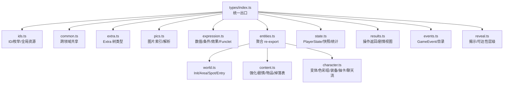
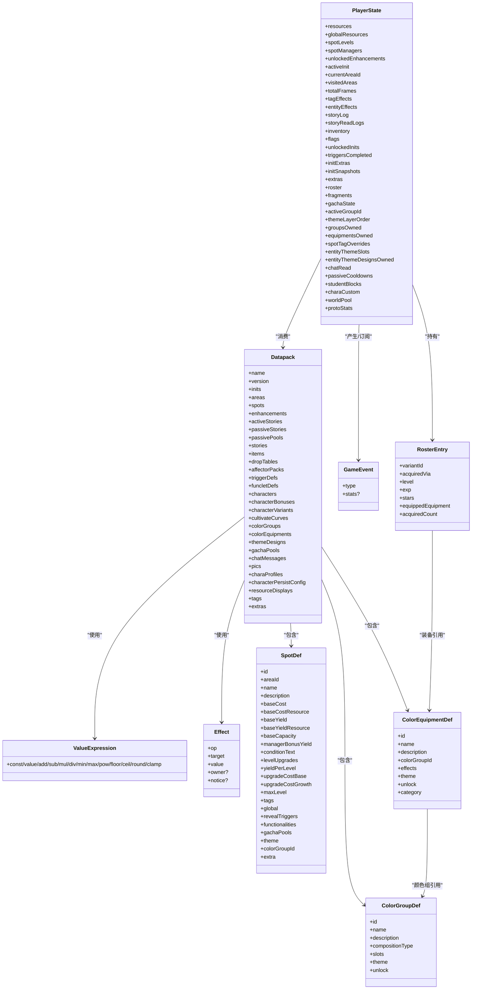
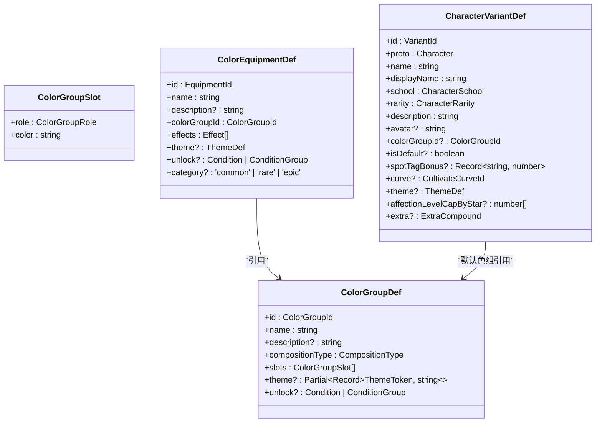
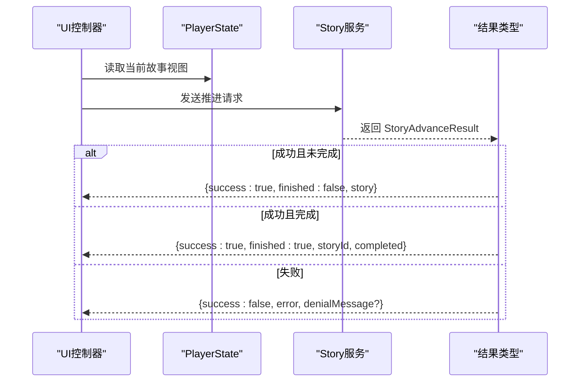
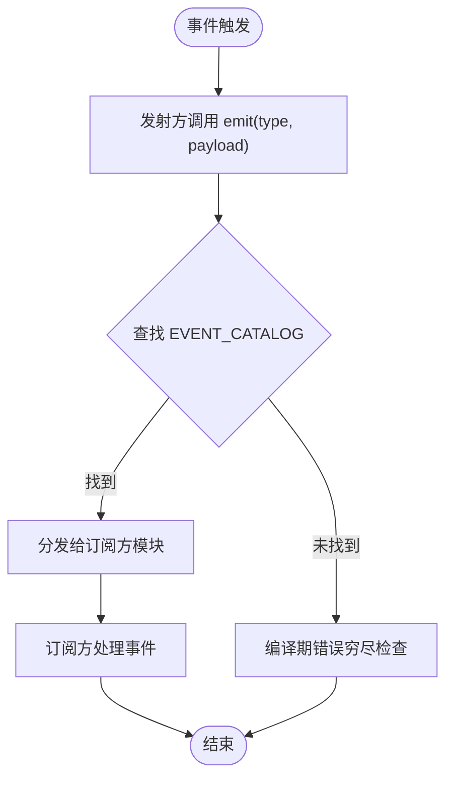
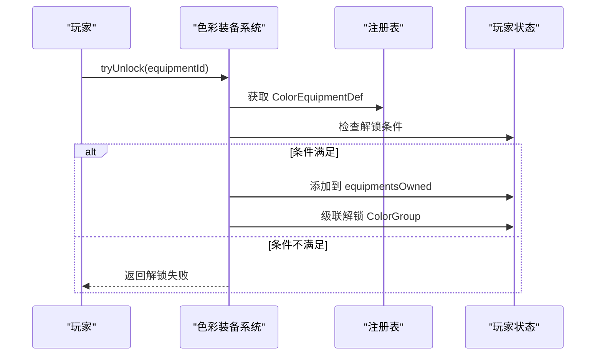
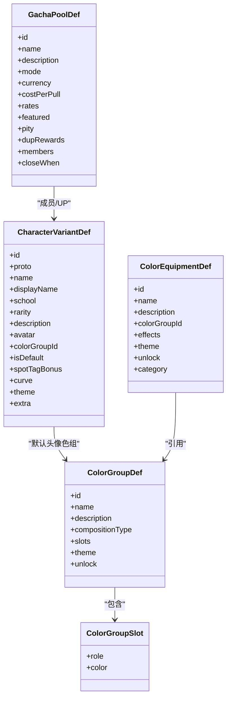
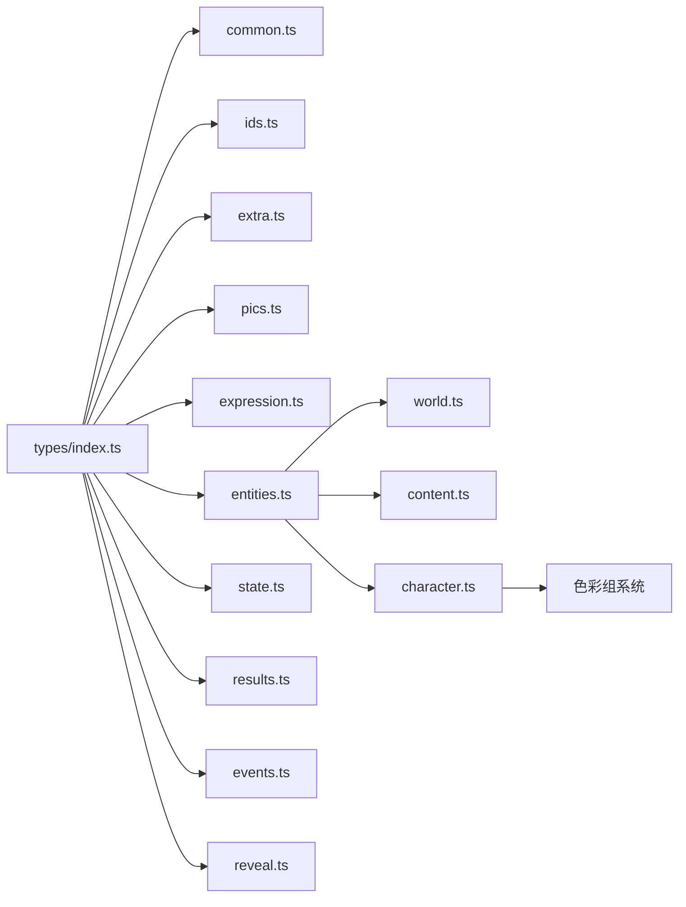

# 类型系统

<cite>
**本文引用的文件**
- [src/engine/types/index.ts](file://src/engine/types/index.ts)
- [src/engine/types/common.ts](file://src/engine/types/common.ts)
- [src/engine/types/entities.ts](file://src/engine/types/entities.ts)
- [src/engine/types/ids.ts](file://src/engine/types/ids.ts)
- [src/engine/types/expression.ts](file://src/engine/types/expression.ts)
- [src/engine/types/character.ts](file://src/engine/types/character.ts)
- [src/engine/types/world.ts](file://src/engine/types/world.ts)
- [src/engine/types/content.ts](file://src/engine/types/content.ts)
- [src/engine/types/state.ts](file://src/engine/types/state.ts)
- [src/engine/types/results.ts](file://src/engine/types/results.ts)
- [src/engine/types/events.ts](file://src/engine/types/events.ts)
- [src/engine/types/reveal.ts](file://src/engine/types/reveal.ts)
- [src/engine/types/pics.ts](file://src/engine/types/pics.ts)
- [src/engine/types/extra.ts](file://src/engine/types/extra.ts)
- [src/engine/types/datapack.ts](file://src/engine/types/datapack.ts)
</cite>

## 更新摘要
**所做更改**
- 更新了角色系统类型定义，新增 ColorGroupId、EquipmentId、CompositionType、ColorGroupRole、ColorGroupSlot 等核心类型
- 移除了旧的 ColorDef effects 字段和 CharacterVariantDef colorSlots 字段
- 引入了完整的 ColorGroup 和 ColorEquipment 类型定义体系
- 更新了色彩系统和装备系统的类型架构说明
- 增强了角色变体与色彩组的关联关系描述

## 目录
1. [简介](#简介)
2. [项目结构](#项目结构)
3. [核心组件](#核心组件)
4. [架构总览](#架构总览)
5. [详细组件分析](#详细组件分析)
6. [依赖关系分析](#依赖关系分析)
7. [性能与编译优化](#性能与编译优化)
8. [故障排查指南](#故障排查指南)
9. [结论](#结论)
10. [附录：扩展指南](#附录：扩展指南)

## 简介
本技术文档围绕 ACProgram 的类型系统展开，聚焦 TypeScript 类型定义的组织方式、导出策略、类型安全保证机制、复杂数据模型表达以及扩展方法。目标是帮助开发者在不深入实现细节的前提下，理解并正确使用引擎的公共类型契约，同时为后续扩展（自定义类型、第三方集成、推导优化）提供可操作的指导。

**最新更新**：角色系统经历了重大重构，新增了完整的色彩组（ColorGroup）和色彩装备（ColorEquipment）类型体系，实现了头像视觉与主题预设的统一管理。

## 项目结构
类型系统集中在 src/engine/types 目录，采用"按领域拆分 + 统一出口"的组织方式：
- 统一出口：index.ts 汇总各子模块类型，对外暴露稳定 API。
- 领域分类：
  - 基础与通用：ids、common、extra、pics
  - 表达式与效果：expression
  - 实体与内容：entities（聚合 common/reveal/world/content/trigger/datapack）、content、world
  - 角色系统：character（包含新的色彩组与装备系统）
  - 运行时状态与结果：state、results
  - 事件契约：events
  - 揭示与可达性：reveal

**图表来源**
- [src/engine/types/index.ts:1-30](file://src/engine/types/index.ts#L1-L30)
- [src/engine/types/entities.ts:1-14](file://src/engine/types/entities.ts#L1-L14)

**章节来源**
- [src/engine/types/index.ts:1-30](file://src/engine/types/index.ts#L1-L30)
- [src/engine/types/entities.ts:1-14](file://src/engine/types/entities.ts#L1-L14)

## 核心组件
- 统一出口与模块化导入导出
  - index.ts 通过 export * 将 ids、common、extra、expression、entities、character、state、results、events、pics 等子模块类型集中暴露，保持向后兼容的导入路径。
  - entities.ts 作为历史兼容层，聚合 common/reveal/world/content/trigger/datapack 的 re-export，使上层无需感知内部拆分。
- 基础 ID 与枚举
  - ids.ts 定义了 InitId/AreaId/SpotId/StoryId/ItemId 等字符串基元类型，以及 Resource、Character、CharacterRarity、CharacterSchool 等枚举；并提供 isGlobalResource 判断与 GLOBAL_RESOURCE_IDS 常量集合，用于区分跨世界线保留的全局资源。
- 通用共享类型
  - common.ts 提供 ResourceDisplayDef、TagDef、CharacterData、CharacterBonusTable、ResourceAmount 等跨领域共享接口，解耦 UI 显示配置与业务逻辑。
- Extra 树类型
  - extra.ts 定义 ExtraValue（NBT 风格树：int/float/str/bool/list/dict）与 ExtraCompound（dict 便捷别名），配合 ExtraPath 约定（/ 分隔、段非空、key 不含 /）。
- 图片资产类型
  - pics.ts 定义 PicId（三段式 mod:type(pic):id）、PicKind、PicDef，并提供 parsePicId/isPicRef/buildPicId/isDirectUrl/isZipPicSrc/zipPathOf 等工具函数，确保图片引用格式一致性与安全性。
- 表达式与效果系统
  - expression.ts 定义 ValueSource/Value、ValueExpression（含 const/value/算术/取整/区间夹取）、Condition/ConditionGroup、EffectOp/Effect、ThemeEffectValue/ChatTextEffectValue、FuncletDef/FuncletCall 等，构成数值计算、条件判定与效果声明的核心类型。
- 实体与内容
  - world.ts：Init/Area/Spot/Entry 定义，包含进入条目 EntryEffectDef、购买成本、世界倾斜、标签、主题、功能等。
  - content.ts：Enhancement/Story/Item/DropTable 等，覆盖强化、剧情入口、闲聊池、Talklet、选择项、掉落表等。
  - **character.ts**：CharacterVariantDef、**ColorGroupDef**、**ColorEquipmentDef**、GachaPoolDef、ChatMessageDef、CharacterPersistConfig、RosterEntry/GachaPoolState 等，支撑角色差分、**色彩组系统**、抽卡与聊天流。
- 运行时状态与结果
  - state.ts：PlayerState、InitSnapshot、CompletedStory、StoryReadLog、StatsSnapshot、VisibilitySnapshot、GameView 等，描述运行时状态、快照、统计与只读视图。
  - results.ts：生产/推进/旅行/购买等操作的结果类型，以及 StoryView/SendState/SendResult 等剧情交互视图。
- 事件契约
  - events.ts：GameEvent 联合类型与 EVENT_CATALOG 目录，强制穷尽匹配，约束发射方/订阅方模块名，保障事件系统的可审计性与类型安全。
- 揭示与可达性
  - reveal.ts：RevealStage（信息阶梯）、AccessStage（可见→揭示→可达→生效）与 RevealTrigger，统一揭示语义。

**章节来源**
- [src/engine/types/index.ts:1-30](file://src/engine/types/index.ts#L1-L30)
- [src/engine/types/entities.ts:1-14](file://src/engine/types/entities.ts#L1-L14)
- [src/engine/types/ids.ts:1-104](file://src/engine/types/ids.ts#L1-L104)
- [src/engine/types/common.ts:1-116](file://src/engine/types/common.ts#L1-L116)
- [src/engine/types/extra.ts:1-29](file://src/engine/types/extra.ts#L1-L29)
- [src/engine/types/pics.ts:1-99](file://src/engine/types/pics.ts#L1-L99)
- [src/engine/types/expression.ts:1-263](file://src/engine/types/expression.ts#L1-L263)
- [src/engine/types/world.ts:1-245](file://src/engine/types/world.ts#L1-L245)
- [src/engine/types/content.ts:1-457](file://src/engine/types/content.ts#L1-L457)
- [src/engine/types/character.ts:1-610](file://src/engine/types/character.ts#L1-L610)
- [src/engine/types/state.ts:1-273](file://src/engine/types/state.ts#L1-L273)
- [src/engine/types/results.ts:1-182](file://src/engine/types/results.ts#L1-L182)
- [src/engine/types/events.ts:1-167](file://src/engine/types/events.ts#L1-L167)
- [src/engine/types/reveal.ts:1-60](file://src/engine/types/reveal.ts#L1-L60)

## 架构总览
类型系统以"领域拆分 + 统一出口"为核心，形成稳定的公共契约。下图展示关键类型之间的关系与依赖方向。

**图表来源**
- [src/engine/types/state.ts:1-273](file://src/engine/types/state.ts#L1-L273)
- [src/engine/types/datapack.ts:1-135](file://src/engine/types/datapack.ts#L1-L135)
- [src/engine/types/events.ts:1-167](file://src/engine/types/events.ts#L1-L167)
- [src/engine/types/expression.ts:1-263](file://src/engine/types/expression.ts#L1-L263)
- [src/engine/types/character.ts:1-610](file://src/engine/types/character.ts#L1-L610)
- [src/engine/types/world.ts:1-245](file://src/engine/types/world.ts#L1-L245)

## 详细组件分析

### 类型导出策略与模块化组织
- 统一出口：index.ts 通过 export * 将多领域类型集中暴露，便于全项目以 './' 或相对路径导入，保持向后兼容。
- 聚合 re-export：entities.ts 聚合 common/reveal/world/content/trigger/datapack，屏蔽内部拆分，降低耦合。
- 内部类型隐藏：仅通过 index.ts 暴露必要类型；未导出的类型视为内部契约，避免外部误用。
- 模块化导入导出：各子模块职责清晰，如 expression.ts 专注表达式与效果，character.ts 专注角色系统，state.ts 专注运行时状态。

**章节来源**
- [src/engine/types/index.ts:1-30](file://src/engine/types/index.ts#L1-L30)
- [src/engine/types/entities.ts:1-14](file://src/engine/types/entities.ts#L1-L14)

### 类型安全保证机制
- 泛型约束与联合类型
  - 使用联合类型表达有限状态机（如 RevealStage、AccessStage、GachaMode、**CompositionType**），结合 discriminated union（如 GameEvent.type）进行穷尽检查。
  - 通过 Record<string, number> 等键值映射表达动态键空间，同时以具体 ID 类型（InitId/AreaId/SpotId/**ColorGroupId**/**EquipmentId** 等）约束键域。
- 类型守卫与运行时检查
  - isGlobalResource(resourceId) 在 ids.ts 中提供运行时判断，配合常量集合保证全局资源一致性。
  - pics.ts 提供 parsePicId/isPicRef/isDirectUrl/isZipPicSrc/zipPathOf 等工具，确保图片引用格式正确与安全解析。
- 条件与效果类型
  - expression.ts 中的 Condition/ConditionGroup/Effect/ValueExpression 构成强类型化的条件与效果声明，限制 op/target/value 的取值范围，减少非法配置。
- 事件目录契约
  - events.ts 的 EVENT_CATALOG 强制枚举所有 GameEvent['type']，新增/删除事件类型时编译期报错，确保发射方/订阅方同步更新。

**章节来源**
- [src/engine/types/ids.ts:1-104](file://src/engine/types/ids.ts#L1-L104)
- [src/engine/types/pics.ts:1-99](file://src/engine/types/pics.ts#L1-L99)
- [src/engine/types/expression.ts:1-263](file://src/engine/types/expression.ts#L1-L263)
- [src/engine/types/events.ts:1-167](file://src/engine/types/events.ts#L1-L167)

### 复杂数据模型的类型定义
- 嵌套对象与数组
  - PlayerState 包含多层嵌套（如 initSnapshots、extras、roster、gachaState、spotTagOverrides、entityThemeSlots 等），并使用 Record 与具体 ID 类型组合，确保键域与值域一致。
  - SpotDef.functionalities 与 LevelUpgradeDef.effects 使用 Effect[] 表达持续/一次性效果链。
- 可选属性
  - 多处使用可选字段（如 currentAreaId、visitedAreas、triggersCompleted、extras、gachaPools、theme 等）以兼容旧档与渐进构建。
- 条件类型与判别字段
  - GameEvent 使用 type 字段进行判别，EVENT_CATALOG 要求穷尽匹配；StoryChoice/Talklet 使用 kind/side/jumpMode 等限定行为。
- 三层合并视图（Extra）
  - extra.ts 定义 ExtraValue/ExtraCompound/ExtraPath，配合 expression.ts 的 'data' 源读取三层合并视图（全局 → per-Init → 数据包常量表），并在 effect 中支持 setExtra/addExtra/removeExtra。

**章节来源**
- [src/engine/types/state.ts:1-273](file://src/engine/types/state.ts#L1-L273)
- [src/engine/types/world.ts:1-245](file://src/engine/types/world.ts#L1-L245)
- [src/engine/types/content.ts:1-457](file://src/engine/types/content.ts#L1-L457)
- [src/engine/types/extra.ts:1-29](file://src/engine/types/extra.ts#L1-L29)
- [src/engine/types/expression.ts:1-263](file://src/engine/types/expression.ts#L1-L263)

### 角色系统与色彩组架构（重大更新）

#### 新增核心类型定义
**更新** 角色系统经历了重大重构，引入了完整的色彩组（ColorGroup）和色彩装备（ColorEquipment）类型体系：

- **ColorGroupId**：色彩组的唯一标识符类型
- **EquipmentId**：色彩装备的唯一标识符类型  
- **CompositionType**：色彩组构成方式的联合类型，包括 'solid'（单色）、'gradient'（渐变）、'duotone'（双色阶调）、'pie'（饼图）、'radial'（径向）
- **ColorGroupRole**：色位角色的联合类型，包括 'primary'（主色）、'secondary'（副色）、'accent'（强调）、'highlight'（高光）、'shadow'（阴影）、'edge'（边缘）
- **ColorGroupSlot**：单个色位的接口定义，包含 role 和 color 字段

#### 色彩组系统架构

**图表来源**
- [src/engine/types/character.ts:268-346](file://src/engine/types/character.ts#L268-L346)
- [src/engine/types/character.ts:80-145](file://src/engine/types/character.ts#L80-L145)

#### 类型变更说明
**重要变更**：
- **ColorDef 已移除 effects 字段**：色彩定义不再直接包含数值效果，效果现在由 ColorEquipmentDef 统一管理
- **CharacterVariantDef 移除了 colorSlots 字段**：角色变体不再直接管理色位，改为通过 colorGroupId 引用 ColorGroupDef
- **新增 ColorGroupDef**：作为唯一的色彩实体，包含头像渲染方案（compositionType）和色位定义（slots）
- **新增 ColorEquipmentDef**：作为收集品，捆绑 ColorGroupDef 和数值效果（effects）

#### 运行时状态更新
- **RosterEntry.equippedEquipment**：从原来的颜色槽位改为单一装备槽位，类型为 `EquipmentId | null`
- **PlayerState.equipmentsOwned**：新增装备拥有状态，类型为 `EquipmentId[]`
- **PlayerState.groupsOwned**：新增色彩组拥有状态，类型为 `ColorGroupId[]`

**章节来源**
- [src/engine/types/character.ts:20-25](file://src/engine/types/character.ts#L20-L25)
- [src/engine/types/character.ts:231-346](file://src/engine/types/character.ts#L231-L346)
- [src/engine/types/character.ts:571-594](file://src/engine/types/character.ts#L571-L594)

### 关键流程的类型化序列图

#### 剧情推进流程（Send → Advance）

**图表来源**
- [src/engine/types/results.ts:1-182](file://src/engine/types/results.ts#L1-L182)
- [src/engine/types/state.ts:1-273](file://src/engine/types/state.ts#L1-L273)

#### 事件分发与订阅（GameEvent）

**图表来源**
- [src/engine/types/events.ts:1-167](file://src/engine/types/events.ts#L1-L167)

#### 色彩装备系统流程

**图表来源**
- [src/engine/system/color-equipment-system.ts:1-72](file://src/engine/system/color-equipment-system.ts#L1-L72)

### 面向对象组件的类型关系（角色系统）

**图表来源**
- [src/engine/types/character.ts:80-145](file://src/engine/types/character.ts#L80-L145)
- [src/engine/types/character.ts:268-346](file://src/engine/types/character.ts#L268-L346)
- [src/engine/types/character.ts:392-446](file://src/engine/types/character.ts#L392-L446)

## 依赖关系分析
- 模块内聚与耦合
  - index.ts 作为唯一出口，降低外部耦合；entities.ts 聚合常见领域，减少重复导入。
  - expression.ts 被多个领域（world/content/character/datapack）复用，体现高内聚低耦合。
- 直接/间接依赖
  - state.ts 依赖 ids、character、expression、results、extra 等；events.ts 依赖 state、entities、expression、extra、content。
  - pics.ts 独立于业务领域，提供通用工具函数，被 content/world/character 引用。
- 循环依赖风险
  - 类型文件之间通过 import type 引入，避免运行时循环依赖；如需双向引用，建议通过中间层（如 entities.ts）解耦。
- 外部依赖与集成点
  - core/tag 的 TagPath 在 common/world 中被引用，表示标签体系的外部契约。
  - 图片解析依赖 ImageStore（运行时），类型层通过 pics.ts 约束引用格式。

**图表来源**
- [src/engine/types/index.ts:1-30](file://src/engine/types/index.ts#L1-L30)
- [src/engine/types/entities.ts:1-14](file://src/engine/types/entities.ts#L1-L14)

**章节来源**
- [src/engine/types/index.ts:1-30](file://src/engine/types/index.ts#L1-L30)
- [src/engine/types/entities.ts:1-14](file://src/engine/types/entities.ts#L1-L14)

## 性能与编译优化
- 编译期穷尽检查
  - 使用 discriminated union（如 GameEvent.type、RevealStage、AccessStage、**CompositionType**）配合 switch/if-else 穷尽分支，减少运行时分支遗漏。
- 类型守卫与工具函数
  - 利用 pics.ts 的工具函数进行快速格式校验，避免无效图片引用导致的运行时错误。
  - isGlobalResource 提供 O(1) 判断，提升资源类型判定效率。
- 数据结构设计
  - 使用 Record<ID, T> 替代任意字符串键，提高类型安全与 IDE 提示质量。
  - 可选字段用于兼容旧档，避免迁移成本；但需在上层逻辑中处理缺失情况。
- 事件目录契约
  - EVENT_CATALOG 强制同步事件类型与订阅方，减少调试成本与维护负担。

## 故障排查指南
- 事件类型缺失或未注册
  - 现象：新增 GameEvent 类型后，EVENT_CATALOG 编译报错。
  - 解决：在 events.ts 中添加对应 EventCatalogEntry，确保 emit/subscribe 模块名准确。
- 图片引用格式错误
  - 现象：parsePicId 返回 undefined，导致图片无法加载。
  - 解决：使用 buildPicId 构造标准三段式索引；确认 type 段以 (pic) 结尾，id 不含冒号。
- 条件/效果配置非法
  - 现象：Effect.op 或 Condition.target 不在允许集合中。
  - 解决：对照 expression.ts 的 EffectOp/ConditionTarget 联合类型修正配置。
- 全局资源误用
  - 现象：非全局资源写入 globalResources 导致跨世界线不一致。
  - 解决：使用 isGlobalResource 判断后再写入；遵循 GLOBAL_RESOURCE_IDS 白名单。
- **色彩组配置错误**（新增）
  - 现象：ColorGroupDef 的 slots 数量与 compositionType 不匹配。
  - 解决：确保 solid 类型只有 1 个 slot，gradient/duotone 有 2 个，pie 有 3-6 个，radial 有 2 个。
- **装备引用错误**（新增）
  - 现象：ColorEquipmentDef 引用的 colorGroupId 不存在。
  - 解决：确保引用的 ColorGroupDef 已在 datapack.colorGroups 中定义。

**章节来源**
- [src/engine/types/events.ts:1-167](file://src/engine/types/events.ts#L1-L167)
- [src/engine/types/pics.ts:1-99](file://src/engine/types/pics.ts#L1-L99)
- [src/engine/types/expression.ts:1-263](file://src/engine/types/expression.ts#L1-L263)
- [src/engine/types/ids.ts:1-104](file://src/engine/types/ids.ts#L1-L104)
- [src/engine/types/character.ts:231-346](file://src/engine/types/character.ts#L231-L346)

## 结论
ACProgram 的类型系统通过领域拆分与统一出口，构建了清晰、稳定、可扩展的公共契约。借助联合类型、判别字段、类型守卫与事件目录，实现了强大的类型安全保证。复杂数据模型通过嵌套对象、可选属性与条件类型得到精确表达。

**最新进展**：角色系统经历了重大重构，引入了完整的色彩组（ColorGroup）和色彩装备（ColorEquipment）类型体系，实现了头像视觉与主题预设的统一管理。新的类型架构提供了更灵活的配色方案和更强的类型安全保障。

未来扩展应遵循现有模式：新增类型需在合适模块定义，并通过 index.ts 暴露；事件系统需同步更新 EVENT_CATALOG；图片与资源引用需遵循既定格式与工具函数；**色彩相关的新增类型需遵循 CompositionType 和 ColorGroupRole 的约束**。

## 附录：扩展指南
- 自定义类型定义
  - 在对应领域模块（如 content/world/character）新增接口或联合类型，遵循命名规范与注释约定。
  - 若为新领域，考虑在 index.ts 中增加 export *，并在 entities.ts 中聚合（如适用）。
- 第三方库集成
  - 使用 import type 引入第三方类型，避免运行时依赖；必要时封装适配器类型，隔离变更影响。
- 类型推导优化
  - 优先使用字面量联合类型与 discriminated union，提升 IDE 提示与编译期检查能力。
  - 对动态键空间使用 Record<ID, T> 而非 Record<string, any>，增强类型安全。
- 最佳实践
  - 新增事件类型必须同步 EVENT_CATALOG。
  - 新增图片引用必须使用 pics.ts 工具函数构造与校验。
  - 新增资源类型需评估是否属于全局资源，并更新 GLOBAL_RESOURCE_IDS（如适用）。
  - 对可选字段进行防御性编程，处理缺失情况。
  - **新增色彩组时必须确保 slots 数量与 compositionType 匹配**。
  - **新增色彩装备时必须引用有效的 ColorGroupId**。