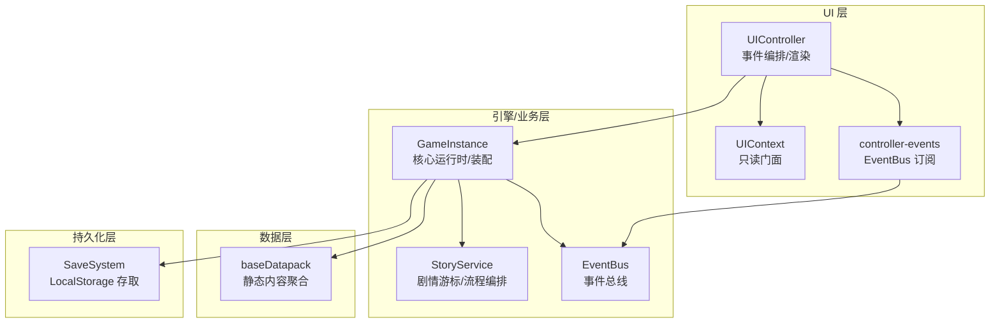
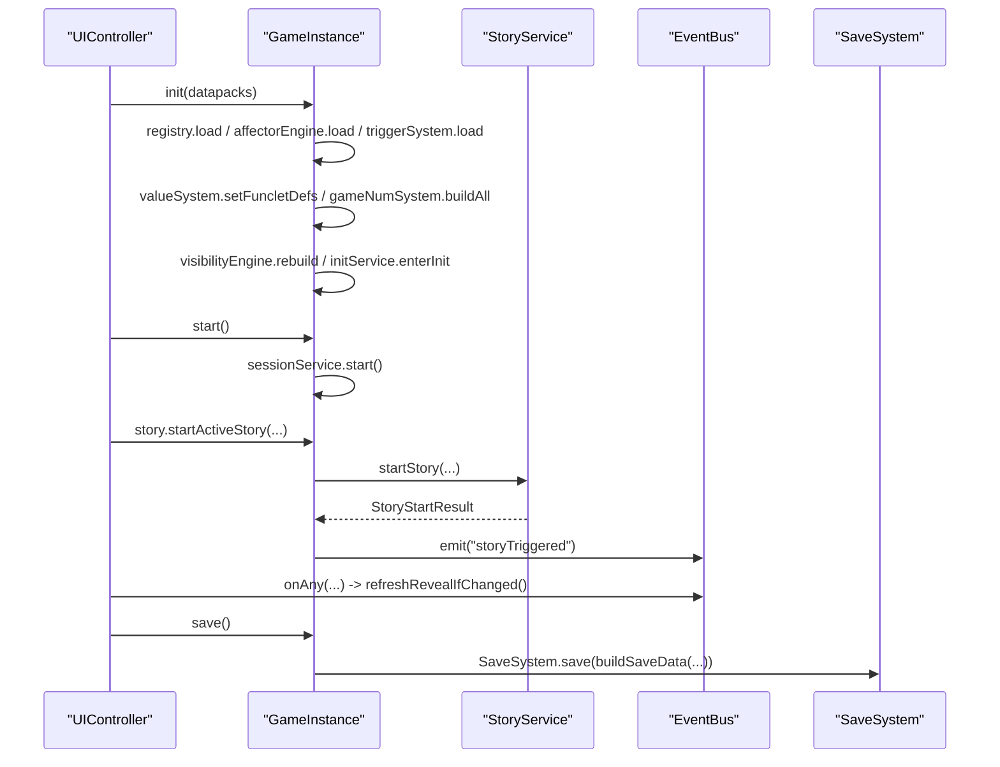
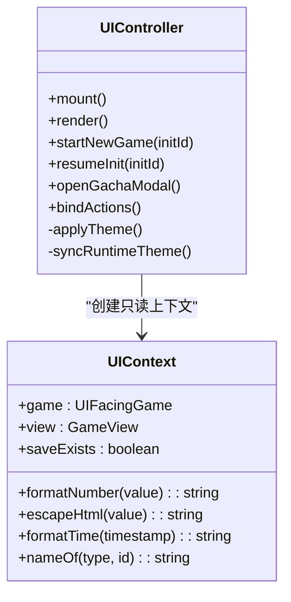
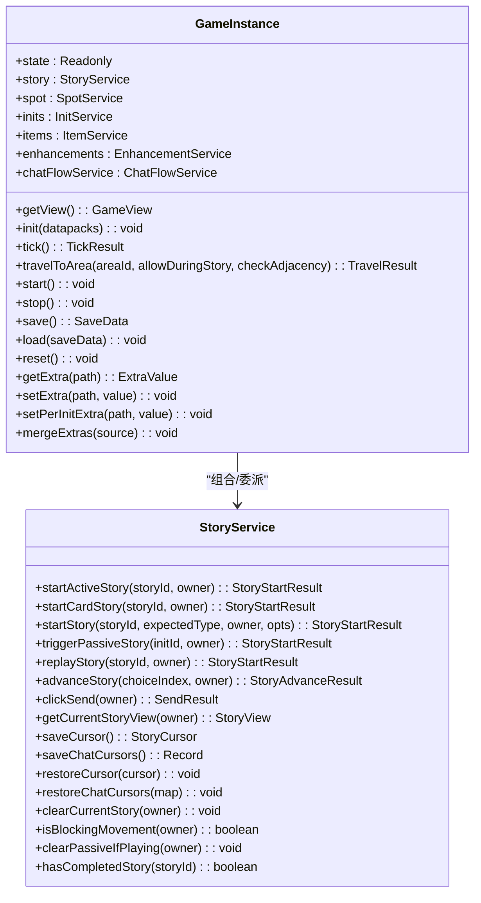
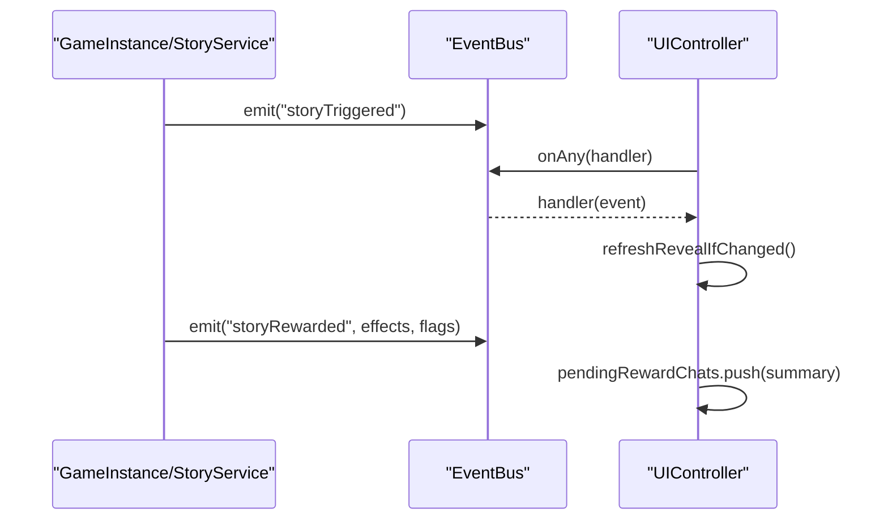
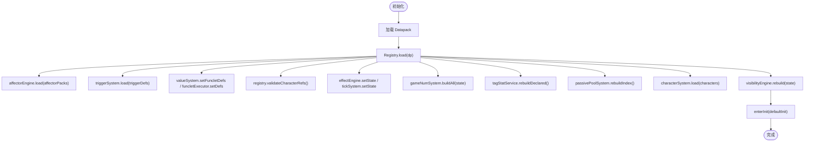
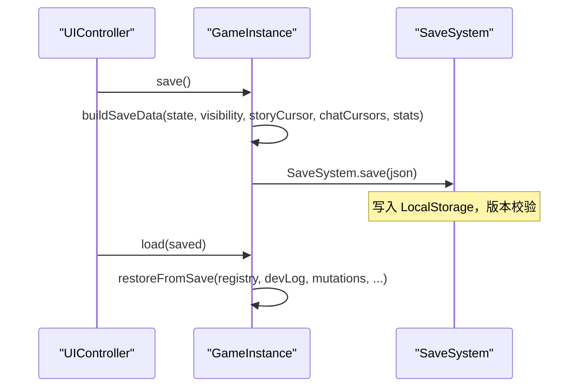
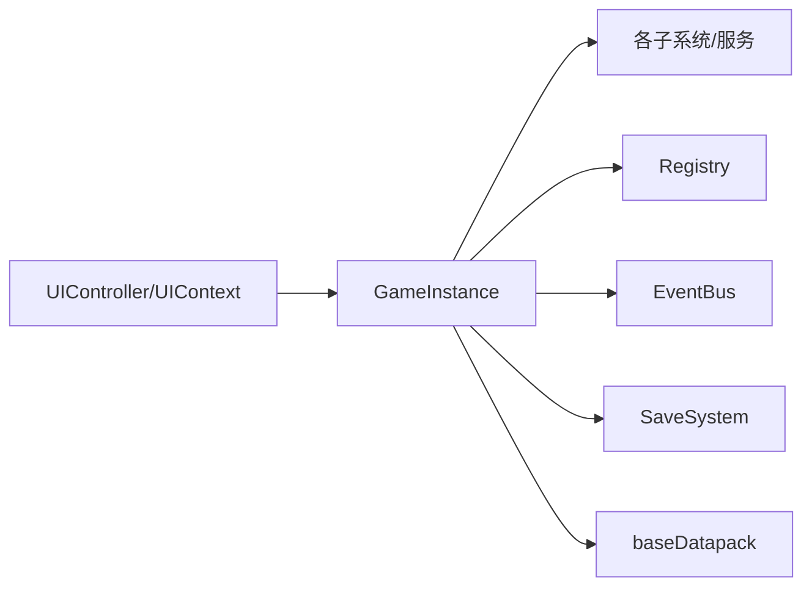

# 分层架构设计

<cite>
**本文引用的文件**
- [src/main.ts](file://src/main.ts)
- [src/engine/game-instance.ts](file://src/engine/game-instance.ts)
- [src/engine/game/story-service.ts](file://src/engine/game/story-service.ts)
- [src/ui/controller.ts](file://src/ui/controller.ts)
- [src/ui/context.ts](file://src/ui/context.ts)
- [src/ui/controller-events.ts](file://src/ui/controller-events.ts)
- [src/engine/core/event-bus.ts](file://src/engine/core/event-bus.ts)
- [src/save/storage.ts](file://src/save/storage.ts)
- [src/data/base/datapack.ts](file://src/data/base/datapack.ts)
</cite>

## 目录
1. [简介](#简介)
2. [项目结构](#项目结构)
3. [核心组件](#核心组件)
4. [架构总览](#架构总览)
5. [详细组件分析](#详细组件分析)
6. [依赖关系分析](#依赖关系分析)
7. [性能考量](#性能考量)
8. [故障排查指南](#故障排查指南)
9. [结论](#结论)
10. [附录](#附录)

## 简介
本文件面向 ACProgram 游戏引擎的分层架构，聚焦 UI 层、业务逻辑层与数据层的职责边界与协作方式。文档重点说明：
- Controller 控制器如何协调 UI 事件与业务逻辑调用，并体现命令模式与中介者模式的实践。
- StoryService 等业务服务层的接口设计与实现原则。
- Data 数据层的数据加载、验证与持久化机制。
- 层间通信协议与接口设计规范，确保松耦合和高内聚。
- 提供分层架构图与依赖关系图，展示调用关系与数据流向。
- 跨层调用的最佳实践与常见陷阱避免方法。

## 项目结构
ACProgram 采用清晰的分层组织：
- UI 层（src/ui）：负责渲染、用户交互、事件绑定与面板状态管理。通过 UIController 作为门面，将事件委托到各子模块（聊天流、滚动、选择页、导入导出等）。
- 引擎/业务层（src/engine）：以 GameInstance 为核心运行时，组合各子系统与服务（StoryService、SpotService、InitService、ItemService、EnhancementService、ChatFlowService 等），对外暴露只读视图与写操作入口。
- 数据层（src/data）：定义基础数据包（Datapack），聚合区域、设施、剧情、角色、掉落表、强化、触发器等静态内容。
- 持久化层（src/save）：基于 LocalStorage 的存档读写与版本校验。

**图表来源**
- [src/ui/controller.ts:1-120](file://src/ui/controller.ts#L1-L120)
- [src/engine/game-instance.ts:70-114](file://src/engine/game-instance.ts#L70-L114)
- [src/engine/core/event-bus.ts:9-84](file://src/engine/core/event-bus.ts#L9-L84)
- [src/data/base/datapack.ts:130-160](file://src/data/base/datapack.ts#L130-L160)
- [src/save/storage.ts:10-74](file://src/save/storage.ts#L10-L74)

**章节来源**
- [src/main.ts:1-59](file://src/main.ts#L1-L59)
- [src/ui/controller.ts:1-120](file://src/ui/controller.ts#L1-L120)
- [src/engine/game-instance.ts:70-114](file://src/engine/game-instance.ts#L70-L114)
- [src/data/base/datapack.ts:130-160](file://src/data/base/datapack.ts#L130-L160)
- [src/save/storage.ts:10-74](file://src/save/storage.ts#L10-L74)

## 核心组件
- GameInstance：核心运行时与装配根，组合所有子系统与服务，暴露统一 API（init/tick/travelToArea/save/load/reset 等），并提供只读视图 getView()。
- StoryService：剧情服务编排层，持有全局与聊天沙盒游标，封装启动/推进/发送/重放/完成奖励等流程，并通过 StoryRuntime 共享上下文。
- UIController：UI 控制器门面，集中处理渲染、事件绑定、主题、选择页、聊天流、导入导出等；将具体行为委托给 controller-* 模块。
- EventBus：事件总线，支持类型化事件注册/派发、通配处理器、批量 flush，用于解耦 UI 与引擎响应。
- SaveSystem：存档持久化，基于 LocalStorage，包含版本校验与导入导出。
- baseDatapack：基础数据包，聚合区域、设施、剧情、角色、掉落表、强化、触发器、资源显示等静态内容。

**章节来源**
- [src/engine/game-instance.ts:70-114](file://src/engine/game-instance.ts#L70-L114)
- [src/engine/game/story-service.ts:52-84](file://src/engine/game/story-service.ts#L52-L84)
- [src/ui/controller.ts:61-137](file://src/ui/controller.ts#L61-L137)
- [src/engine/core/event-bus.ts:9-84](file://src/engine/core/event-bus.ts#L9-L84)
- [src/save/storage.ts:10-74](file://src/save/storage.ts#L10-L74)
- [src/data/base/datapack.ts:130-160](file://src/data/base/datapack.ts#L130-L160)

## 架构总览
分层职责与边界：
- UI 层：仅消费只读视图（UIContext.game + view），不直接修改 PlayerState；写操作一律经 GameInstance 发起。
- 业务逻辑层：GameInstance 组合各服务与系统，提供领域级 API（story/spot/inits/items/enhancements/chatFlowService 等）；内部通过 EventBus 进行事件驱动更新。
- 数据层：Datapack 提供静态配置与常量，加载后由 Registry 与子系统消费；不参与运行时状态变更。
- 持久化层：SaveSystem 负责序列化/反序列化与版本兼容；GameInstance.save/load 负责组装/恢复各子系统状态。

**图表来源**
- [src/ui/controller.ts:139-167](file://src/ui/controller.ts#L139-L167)
- [src/engine/game-instance.ts:176-229](file://src/engine/game-instance.ts#L176-L229)
- [src/engine/game/story-service.ts:180-228](file://src/engine/game/story-service.ts#L180-L228)
- [src/engine/core/event-bus.ts:46-75](file://src/engine/core/event-bus.ts#L46-L75)
- [src/save/storage.ts:12-40](file://src/save/storage.ts#L12-L40)

## 详细组件分析

### UI 层：UIController 与 UIContext
- UIController 作为门面，集中管理渲染、事件绑定、主题、选择页、聊天流、导入导出等；将具体行为委托给 controller-* 模块，保持高内聚与低耦合。
- UIContext 提供只读门面（UIFacingGame），仅暴露渲染所需的状态读取与查询系统，不含写入口；写操作一律由 controller 层经 GameInstance 发起，遵循架构纪律。

**图表来源**
- [src/ui/controller.ts:61-137](file://src/ui/controller.ts#L61-L137)
- [src/ui/context.ts:25-89](file://src/ui/context.ts#L25-L89)

**章节来源**
- [src/ui/controller.ts:139-225](file://src/ui/controller.ts#L139-L225)
- [src/ui/context.ts:25-89](file://src/ui/context.ts#L25-L89)

### 业务逻辑层：GameInstance 与 StoryService
- GameInstance 是核心运行时与装配根，组合 EventBus、Registry、ValueSystem、ConditionSystem、EffectEngine、TickSystem、VisibilityEngine、CharacterSystem、RosterSystem、GachaService、TagStatService、PassivePoolSystem、StateMutationService、AffectorEngine、DevLog、StatsService、SpotFunctionalitySystem、GameNumSystem、TriggerSystem 等子系统与服务。
- StoryService 负责剧情游标持有与访问（存档/移动规则）、对外 API 委托（startStory/advanceStory/clickSend/replayStory/getCurrentStoryView），并通过 StoryRuntime 共享上下文给 story-flow/jump/replay/rewards 等子模块。

**图表来源**
- [src/engine/game-instance.ts:70-114](file://src/engine/game-instance.ts#L70-L114)
- [src/engine/game/story-service.ts:52-84](file://src/engine/game/story-service.ts#L52-L84)

**章节来源**
- [src/engine/game-instance.ts:176-229](file://src/engine/game-instance.ts#L176-L229)
- [src/engine/game/story-service.ts:180-228](file://src/engine/game/story-service.ts#L180-L228)

### 事件驱动与中介者模式：EventBus
- EventBus 提供类型化事件注册/派发、通配处理器、批量 flush，用于解耦 UI 与引擎响应。UI 在 mount 时订阅事件，引擎在各处 emit 事件，实现松耦合的事件驱动架构。
- 典型事件包括 tick、spotProduced、storyRewarded、poolGateChanged、storyAreaTraveled、chatFlowCleared、chatTextClearedAll、storyTriggered、storyCompleted、chatTextShown、chatTextCleared 等。

**图表来源**
- [src/engine/core/event-bus.ts:46-75](file://src/engine/core/event-bus.ts#L46-L75)
- [src/ui/controller-events.ts:12-88](file://src/ui/controller-events.ts#L12-L88)

**章节来源**
- [src/engine/core/event-bus.ts:9-84](file://src/engine/core/event-bus.ts#L9-L84)
- [src/ui/controller-events.ts:12-88](file://src/ui/controller-events.ts#L12-L88)

### 数据层：Datapack 加载与验证
- baseDatapack 聚合基础内容（inits、areas、spots、stories、characters、items、dropTables、affectorPacks、triggerDefs、funcletDefs、resourceDisplays、pics、charaProfiles、extras 等）。
- GameInstance.init 中加载数据包至 Registry，并同步各子系统（valueSystem、funcletExecutor、effectEngine、tickSystem、gameNumSystem、tagStatService、passivePoolSystem、characterSystem、visibilityEngine），最后进入默认 Init。

**图表来源**
- [src/data/base/datapack.ts:130-160](file://src/data/base/datapack.ts#L130-L160)
- [src/engine/game-instance.ts:176-229](file://src/engine/game-instance.ts#L176-L229)

**章节来源**
- [src/data/base/datapack.ts:130-160](file://src/data/base/datapack.ts#L130-L160)
- [src/engine/game-instance.ts:176-229](file://src/engine/game-instance.ts#L176-L229)

### 持久化层：SaveSystem
- SaveSystem 基于 LocalStorage 实现保存、加载、删除、存在性检查、导入导出；包含版本校验（SAVE_VERSION），防止旧版本数据导致不一致。
- GameInstance.save/load 负责组装/恢复各子系统状态（state、visibility、storyCursor、chatCursors、persistable stats 等）。

**图表来源**
- [src/save/storage.ts:12-40](file://src/save/storage.ts#L12-L40)
- [src/engine/game-instance.ts:336-368](file://src/engine/game-instance.ts#L336-L368)

**章节来源**
- [src/save/storage.ts:10-74](file://src/save/storage.ts#L10-L74)
- [src/engine/game-instance.ts:336-368](file://src/engine/game-instance.ts#L336-L368)

## 依赖关系分析
- UI 层依赖引擎层提供的只读视图（UIContext.game + view），并通过 EventBus 订阅引擎事件，实现解耦。
- 引擎层组合多个子系统与服务，依赖 Registry、ValueSystem、ConditionSystem、EffectEngine、TickSystem、VisibilityEngine 等；通过 StateMutationService 统一状态变更路径。
- 数据层为静态配置，被引擎层加载后消费；不参与运行时状态变更。
- 持久化层独立于业务逻辑，仅负责序列化/反序列化与版本兼容。

**图表来源**
- [src/ui/context.ts:25-89](file://src/ui/context.ts#L25-L89)
- [src/engine/game-instance.ts:70-114](file://src/engine/game-instance.ts#L70-L114)
- [src/engine/core/event-bus.ts:9-84](file://src/engine/core/event-bus.ts#L9-L84)
- [src/save/storage.ts:10-74](file://src/save/storage.ts#L10-L74)
- [src/data/base/datapack.ts:130-160](file://src/data/base/datapack.ts#L130-L160)

**章节来源**
- [src/ui/context.ts:25-89](file://src/ui/context.ts#L25-L89)
- [src/engine/game-instance.ts:70-114](file://src/engine/game-instance.ts#L70-L114)
- [src/engine/core/event-bus.ts:9-84](file://src/engine/core/event-bus.ts#L9-L84)
- [src/save/storage.ts:10-74](file://src/save/storage.ts#L10-L74)
- [src/data/base/datapack.ts:130-160](file://src/data/base/datapack.ts#L130-L160)

## 性能考量
- 轻量刷新：每 Tick 仅更新资源数字节点，不重建 #app DOM，减少重排重绘开销。
- 揭示评估节流：通过 revealFingerprint 与 lastRevealCheck 避免高频事件反复重算。
- 事件驱动精确失效：产出求值走事件驱动精确失效（Phase 5），未受影响的 gain 子树跨帧保持缓存。
- 聊天历史截断：trimHistory 限制聊天条目数量，避免内存增长。
- 图片异步加载：滚动观察聊天流尺寸变化，自动再滚到底，提升用户体验。

[本节为通用性能讨论，无需特定文件引用]

## 故障排查指南
- 事件未触发：检查 EventBus 是否正确订阅与派发；确认事件类型匹配与处理器注册时机。
- 存档版本不兼容：SaveSystem 会忽略版本不匹配的存档；需升级或迁移存档格式。
- 剧情阻塞移动：StoryService.isBlockingMovement 返回 true 时禁止玩家移动；需等待演出结束或满足解除条件。
- 聊天流异常：检查 chatFlowCleared、chatTextClearedAll、storyTriggered、storyCompleted 等事件是否按预期触发。
- 揭示状态未更新：确认 EventBus 事件是否触发 refreshRevealIfChanged；检查 revealFingerprint 计算逻辑。

**章节来源**
- [src/engine/core/event-bus.ts:46-75](file://src/engine/core/event-bus.ts#L46-L75)
- [src/save/storage.ts:24-40](file://src/save/storage.ts#L24-L40)
- [src/engine/game/story-service.ts:156-172](file://src/engine/game/story-service.ts#L156-L172)
- [src/ui/controller-events.ts:12-88](file://src/ui/controller-events.ts#L12-L88)

## 结论
ACProgram 引擎采用清晰的分层架构，UI 层通过只读门面消费引擎状态，业务逻辑层以 GameInstance 为核心组合各子系统与服务，数据层提供静态配置，持久化层独立负责存档。通过 EventBus 实现事件驱动解耦，StoryService 等服务的接口设计遵循高内聚低耦合原则。遵循跨层调用最佳实践（如仅通过 GameInstance 发起写操作、使用只读视图渲染、利用事件驱动更新）可避免常见陷阱（如直接修改状态、频繁全量重建 DOM、忽略版本兼容）。

[本节为总结性内容，无需特定文件引用]

## 附录
- 跨层调用最佳实践：
  - UI 层仅消费只读视图（UIContext.game + view），写操作经 GameInstance 发起。
  - 使用 EventBus 进行事件驱动更新，避免紧耦合调用。
  - 数据层仅加载静态配置，不参与运行时状态变更。
  - 持久化层独立于业务逻辑，仅负责序列化/反序列化与版本兼容。
- 常见陷阱避免：
  - 避免在 UI 层直接修改 PlayerState。
  - 避免在高频事件中执行昂贵计算（如全量重建 DOM）。
  - 注意存档版本兼容性，避免旧数据导致不一致。
  - 合理使用聊天历史截断与揭示评估节流，控制内存与性能。

[本节为通用指导，无需特定文件引用]