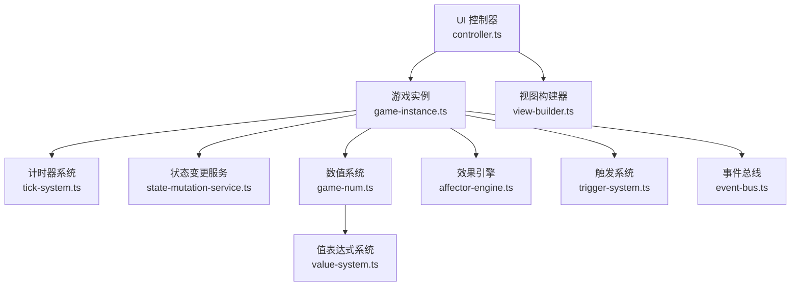
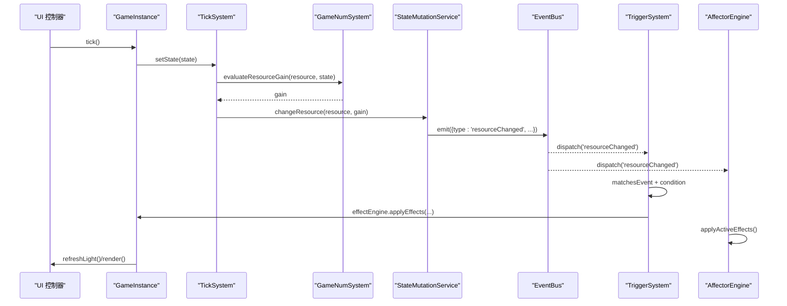
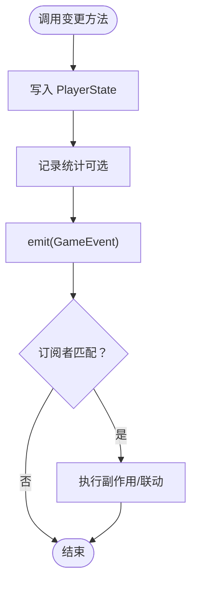
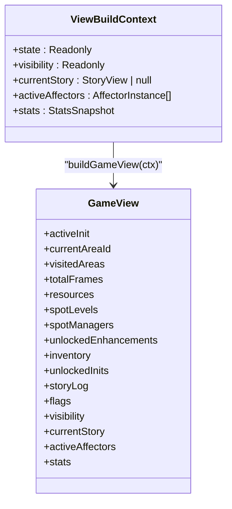
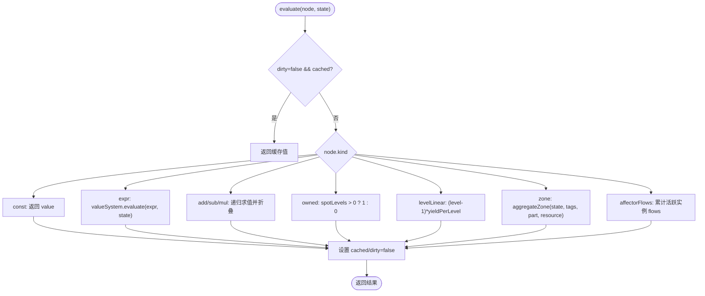
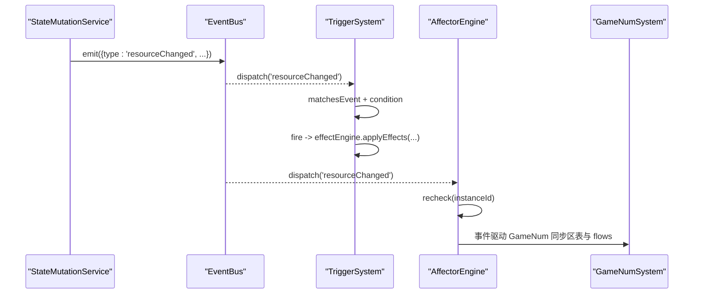
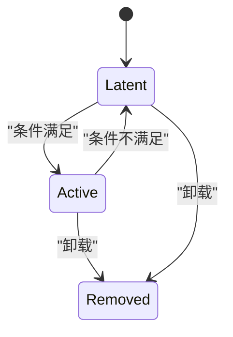
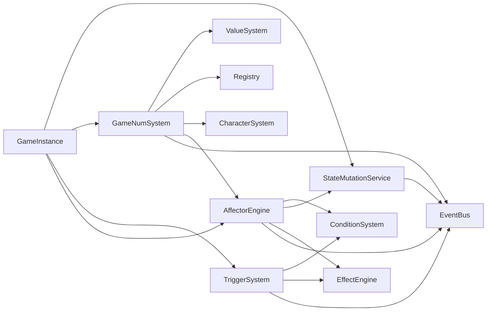

# 数据流设计

<cite>
**本文引用的文件**
- [game-instance.ts](file://src/engine/game-instance.ts)
- [view-builder.ts](file://src/engine/game/view-builder.ts)
- [state-mutation-service.ts](file://src/engine/system/state-mutation-service.ts)
- [event-bus.ts](file://src/engine/core/event-bus.ts)
- [event-driven-reactor.ts](file://src/engine/effect/event-driven-reactor.ts)
- [trigger-system.ts](file://src/engine/effect/trigger-system.ts)
- [affector-engine.ts](file://src/engine/effect/affector-engine.ts)
- [tick-system.ts](file://src/engine/system/tick-system.ts)
- [game-num.ts](file://src/engine/expression/game-num.ts)
- [game-num-eval.ts](file://src/engine/expression/game-num-eval.ts)
- [value-system.ts](file://src/engine/expression/value-system.ts)
- [controller.ts](file://src/ui/controller.ts)
</cite>

## 目录
1. [引言](#引言)
2. [项目结构](#项目结构)
3. [核心组件](#核心组件)
4. [架构总览](#架构总览)
5. [详细组件分析](#详细组件分析)
6. [依赖关系分析](#依赖关系分析)
7. [性能考量](#性能考量)
8. [故障排查指南](#故障排查指南)
9. [结论](#结论)
10. [附录](#附录)

## 引言
本文件面向 ACProgram 游戏引擎的数据流设计，聚焦单向数据流架构在 UI → 业务逻辑 → 数据层之间的完整流转。文档重点说明：
- StateMutationService 的状态变更管理与副作用处理
- ViewBuilder 生成不可变视图供 UI 渲染
- 表达式系统的求值流程、依赖追踪与缓存策略
- 事件驱动的状态同步机制，确保 UI 与游戏状态实时一致
- 关键业务流程的数据流图与状态转换图
- 调试与监控数据流的工具与方法

## 项目结构
ACProgram 采用分层与职责清晰的模块化组织：
- UI 层：控制器与组件负责用户交互与渲染
- 引擎核心：GameInstance 组合各子系统，提供统一门面
- 系统层：TickSystem、StateMutationService、TriggerSystem、AffectorEngine 等
- 表达式层：ValueSystem、GameNumSystem 负责数值计算与产出管线
- 数据层：PlayerState 为唯一真实来源，通过 EventBus 广播变更

**图表来源**
- [controller.ts:139-225](file://src/ui/controller.ts#L139-L225)
- [game-instance.ts:118-164](file://src/engine/game-instance.ts#L118-L164)
- [tick-system.ts:19-63](file://src/engine/system/tick-system.ts#L19-L63)
- [state-mutation-service.ts:41-101](file://src/engine/system/state-mutation-service.ts#L41-L101)
- [game-num.ts:52-140](file://src/engine/expression/game-num.ts#L52-L140)
- [affector-engine.ts:33-79](file://src/engine/effect/affector-engine.ts#L33-L79)
- [trigger-system.ts:49-69](file://src/engine/effect/trigger-system.ts#L49-L69)
- [event-bus.ts:9-84](file://src/engine/core/event-bus.ts#L9-L84)
- [view-builder.ts:23-57](file://src/engine/game/view-builder.ts#L23-L57)

**章节来源**
- [controller.ts:139-225](file://src/ui/controller.ts#L139-L225)
- [game-instance.ts:118-164](file://src/engine/game-instance.ts#L118-L164)

## 核心组件
- GameInstance：组合根与门面，装配并协调所有子系统，暴露 getView、tick、init/load/save 等 API
- StateMutationService：统一状态写入入口，封装资源、角色、物品、主题、Extra 等变更，并广播事件
- GameNumSystem：维护资源产出树（GameNum），支持懒求值、脏位失效、区表聚合与 flows 注入
- ValueSystem：表达式求值器，解析 const/value/add/sub/mul/div/floor/ceil/round/clamp 等算子
- TriggerSystem：声明式触发器桥接，事件命中 + 条件满足后执行 effects
- AffectorEngine：挂载/卸载效果体，按条件激活 entry，持续应用 perTickEffects
- EventBus：类型安全的事件总线，支持分桶订阅与批量 flush
- ViewBuilder：从 PlayerState、Visibility、Story、Affectors、Stats 组装只读 GameView

**章节来源**
- [game-instance.ts:74-164](file://src/engine/game-instance.ts#L74-L164)
- [state-mutation-service.ts:41-101](file://src/engine/system/state-mutation-service.ts#L41-L101)
- [game-num.ts:52-140](file://src/engine/expression/game-num.ts#L52-L140)
- [value-system.ts:88-150](file://src/engine/expression/value-system.ts#L88-L150)
- [trigger-system.ts:49-69](file://src/engine/effect/trigger-system.ts#L49-L69)
- [affector-engine.ts:33-79](file://src/engine/effect/affector-engine.ts#L33-L79)
- [event-bus.ts:9-84](file://src/engine/core/event-bus.ts#L9-L84)
- [view-builder.ts:23-57](file://src/engine/game/view-builder.ts#L23-L57)

## 架构总览
单向数据流的核心路径：
- UI 操作 → GameInstance 门面方法 → 子系统处理 → StateMutationService 写状态 → EventBus 广播事件 → 订阅者（Trigger/Affector/GameNum）响应 → 更新视图或继续联动
- Tick 每帧推进：TickSystem 遍历资源产出 → GameNumSystem 求值 → StateMutationService 变更资源 → 事件驱动其他子系统 → UI 轻量刷新或全量重建

**图表来源**
- [game-instance.ts:247-262](file://src/engine/game-instance.ts#L247-L262)
- [tick-system.ts:44-63](file://src/engine/system/tick-system.ts#L44-L63)
- [game-num.ts:227-259](file://src/engine/expression/game-num.ts#L227-L259)
- [state-mutation-service.ts:110-123](file://src/engine/system/state-mutation-service.ts#L110-L123)
- [trigger-system.ts:125-143](file://src/engine/effect/trigger-system.ts#L125-L143)
- [affector-engine.ts:377-394](file://src/engine/effect/affector-engine.ts#L377-L394)
- [controller.ts:184-225](file://src/ui/controller.ts#L184-L225)

## 详细组件分析

### StateMutationService 状态变更管理
- 职责：集中所有对 PlayerState 的写操作，保证变更可观测、可审计、可回滚（通过事件）
- 管道：写状态 → 记录统计（StatsService）→ 发射事件（携带惰性 StatsContext）→ 订阅者消费
- 关键能力：
  - 资源变更：changeResource/setResource，区分全局资源与局部资源桶
  - Spot 管理：setSpotLevel/addSpotLevel/setManager
  - 角色获得：acquireCharacter（首次创建条目，重复返还碎片与资源）
  - 培养：addExp/breakthroughStar（曲线与上限校验）
  - 主题与装备：unlockGroup/collectEquipment/equipEquipment/activateTheme
  - 物品：addItem/removeItem（堆叠上限、负数移除）
  - Extra：setExtra/addExtra/removeExtra（三层合并视图生效值）
  - 故事与日志：completeStory/recordStoryRead
  - 学生对话阻断：setStudentBlock/clearStudentBlock
  - Spot Tag 覆盖：applySpotTagChange（运行时增删 tag）
  - 效果应用：applyEffects/applyEffect（委托 effect-ops）

**图表来源**
- [state-mutation-service.ts:87-101](file://src/engine/system/state-mutation-service.ts#L87-L101)
- [state-mutation-service.ts:110-123](file://src/engine/system/state-mutation-service.ts#L110-L123)
- [state-mutation-service.ts:155-197](file://src/engine/system/state-mutation-service.ts#L155-L197)
- [state-mutation-service.ts:321-366](file://src/engine/system/state-mutation-service.ts#L321-L366)
- [state-mutation-service.ts:387-418](file://src/engine/system/state-mutation-service.ts#L387-L418)
- [state-mutation-service.ts:526-554](file://src/engine/system/state-mutation-service.ts#L526-L554)

**章节来源**
- [state-mutation-service.ts:41-101](file://src/engine/system/state-mutation-service.ts#L41-L101)
- [state-mutation-service.ts:110-123](file://src/engine/system/state-mutation-service.ts#L110-L123)
- [state-mutation-service.ts:155-197](file://src/engine/system/state-mutation-service.ts#L155-L197)
- [state-mutation-service.ts:321-366](file://src/engine/system/state-mutation-service.ts#L321-L366)
- [state-mutation-service.ts:387-418](file://src/engine/system/state-mutation-service.ts#L387-L418)
- [state-mutation-service.ts:526-554](file://src/engine/system/state-mutation-service.ts#L526-L554)

### ViewBuilder 不可变视图生成
- 输入：只读的 PlayerState、VisibilitySnapshot、当前 StoryView、活跃 Affectors、StatsSnapshot
- 输出：GameView（浅拷贝字段，避免暴露内部可变引用）
- 特点：
  - 资源视图合并：globalResources + resources
  - 可见性快照：inits/areas/spots/enhancements/items/stories
  - 活跃 Affectors 深拷贝 activeEntryIds
  - stats 快照用于 UI 展示

**图表来源**
- [view-builder.ts:15-57](file://src/engine/game/view-builder.ts#L15-L57)

**章节来源**
- [view-builder.ts:23-57](file://src/engine/game/view-builder.ts#L23-L57)

### 表达式系统求值流程
- ValueSystem：解析 ValueExpression，支持算术、取整、clamp、data(funclet/extra) 等
- GameNumSystem：维护资源产出树（gains）、spot 子树、zoneIndex、flows 节点；监听事件进行定向失效
- 求值语义：const/expr/add/sub/mul/owned/levelLinear/zone/affectorFlows；zone 走 aggregateZone 聚合 tag/entity 修饰
- 依赖追踪与缓存：
  - 节点级 dirty/cached 标记，lazy 求值
  - resourceChanged 定向失效：仅重算受该资源影响的子树
  - affector 实例变化时同步 zone 表与 flows 节点失效

**图表来源**
- [game-num-eval.ts:171-211](file://src/engine/expression/game-num-eval.ts#L171-L211)
- [game-num-eval.ts:218-256](file://src/engine/expression/game-num-eval.ts#L218-L256)
- [game-num-eval.ts:270-291](file://src/engine/expression/game-num-eval.ts#L270-L291)
- [game-num.ts:142-161](file://src/engine/expression/game-num.ts#L142-L161)
- [value-system.ts:111-150](file://src/engine/expression/value-system.ts#L111-L150)

**章节来源**
- [game-num.ts:52-140](file://src/engine/expression/game-num.ts#L52-L140)
- [game-num-eval.ts:171-211](file://src/engine/expression/game-num-eval.ts#L171-L211)
- [game-num-eval.ts:218-256](file://src/engine/expression/game-num-eval.ts#L218-L256)
- [game-num-eval.ts:270-291](file://src/engine/expression/game-num-eval.ts#L270-L291)
- [value-system.ts:111-150](file://src/engine/expression/value-system.ts#L111-L150)

### 事件驱动的状态同步机制
- EventBus：类型安全的事件分发，支持 on/off/onAny/flush
- EventDrivenReactor：抽象基类，强制分桶订阅，子类实现 onEvent 匹配与动作
- TriggerSystem：将 TriggerDef 映射到具体事件类型，命中后执行 effects
- AffectorEngine：基于事件精确 recheck，维持 Latent/Active 状态，应用 perTickEffects

**图表来源**
- [state-mutation-service.ts:87-101](file://src/engine/system/state-mutation-service.ts#L87-L101)
- [event-bus.ts:46-75](file://src/engine/core/event-bus.ts#L46-L75)
- [trigger-system.ts:125-143](file://src/engine/effect/trigger-system.ts#L125-L143)
- [affector-engine.ts:81-84](file://src/engine/effect/affector-engine.ts#L81-L84)
- [game-num.ts:112-140](file://src/engine/expression/game-num.ts#L112-L140)

**章节来源**
- [event-bus.ts:9-84](file://src/engine/core/event-bus.ts#L9-L84)
- [event-driven-reactor.ts:15-34](file://src/engine/effect/event-driven-reactor.ts#L15-L34)
- [trigger-system.ts:49-69](file://src/engine/effect/trigger-system.ts#L49-L69)
- [affector-engine.ts:33-79](file://src/engine/effect/affector-engine.ts#L33-L79)

### 数据流图与状态转换图
- 数据流图：UI 操作 → GameInstance → 子系统 → StateMutationService → EventBus → 订阅者 → 视图更新
- 状态转换图：Affector 实例状态在 Latent ↔ Active 之间切换，由条件依赖事件驱动

**图表来源**
- [affector-engine.ts:188-230](file://src/engine/effect/affector-engine.ts#L188-L230)

**章节来源**
- [affector-engine.ts:188-230](file://src/engine/effect/affector-engine.ts#L188-L230)

## 依赖关系分析
- GameInstance 依赖所有子系统，作为组合根提供统一 API
- StateMutationService 依赖 EventBus 与 StatsService，解耦状态写入与副作用
- GameNumSystem 依赖 ValueSystem、Registry、CharacterSystem、AffectorEngine，并通过 EventBus 订阅变更
- TriggerSystem 依赖 ConditionSystem 与 EffectEngine，通过 EventBus 接收事件
- AffectorEngine 依赖 ConditionSystem、StateMutationService、EffectEngine，通过 EventBus 精确 recheck

**图表来源**
- [game-instance.ts:74-164](file://src/engine/game-instance.ts#L74-L164)
- [state-mutation-service.ts:41-101](file://src/engine/system/state-mutation-service.ts#L41-L101)
- [game-num.ts:52-140](file://src/engine/expression/game-num.ts#L52-L140)
- [trigger-system.ts:49-69](file://src/engine/effect/trigger-system.ts#L49-L69)
- [affector-engine.ts:33-79](file://src/engine/effect/affector-engine.ts#L33-L79)

**章节来源**
- [game-instance.ts:74-164](file://src/engine/game-instance.ts#L74-L164)
- [game-num.ts:52-140](file://src/engine/expression/game-num.ts#L52-L140)
- [trigger-system.ts:49-69](file://src/engine/effect/trigger-system.ts#L49-L69)
- [affector-engine.ts:33-79](file://src/engine/effect/affector-engine.ts#L33-L79)

## 性能考量
- 懒求值与缓存：GameNum 节点使用 dirty/cached 标记，仅在依赖变化时重算
- 定向失效：resourceChanged 仅影响相关 gains/zone/flows，避免全量重建
- 事件分桶：TriggerSystem 与 AffectorEngine 按事件类型分桶，减少 O(事件×触发器) 扫描
- 惰性统计上下文：StateMutationService 在 emit 中延迟构造 StatsContext，降低高频事件开销
- 轻量刷新：UI 每 Tick 仅更新资源数字节点，避免全量 DOM 重建

[本节为通用性能指导，无需特定文件来源]

## 故障排查指南
- 开发日志：GameInstance.devLog 记录初始化、Tick、错误等，可通过快捷键 Ctrl+Shift+D 触发强化条件诊断
- 事件追踪：通过 EventBus.onAny 订阅所有事件，观察事件流向与订阅者响应
- 数值溯源：使用 evaluateGameNumBreakdown 获取贡献明细，定位数值异常来源
- 状态一致性：检查 StateMutationService 是否被绕过直接写状态，确保事件通道畅通
- 可见性更新：确认 VisibilityEngine 在 init/load/reset 时正确重建索引

**章节来源**
- [game-instance.ts:147-153](file://src/engine/game-instance.ts#L147-L153)
- [controller.ts:159-166](file://src/ui/controller.ts#L159-L166)
- [game-num-eval.ts:218-256](file://src/engine/expression/game-num-eval.ts#L218-L256)
- [event-bus.ts:28-35](file://src/engine/core/event-bus.ts#L28-L35)

## 结论
ACProgram 引擎通过单向数据流与事件驱动架构，实现了 UI 与游戏状态的强一致性与高性能。StateMutationService 统一状态变更，ViewBuilder 提供不可变视图，GameNumSystem 实现高效数值计算与依赖追踪，TriggerSystem 与 AffectorEngine 确保声明式行为的可观测与可扩展。该设计便于调试、扩展与维护，适合复杂游戏逻辑与动态内容。

[本节为总结性内容，无需特定文件来源]

## 附录
- 关键 API 路径参考：
  - 视图构建：[view-builder.ts:23-57](file://src/engine/game/view-builder.ts#L23-L57)
  - 状态变更：[state-mutation-service.ts:110-123](file://src/engine/system/state-mutation-service.ts#L110-L123)
  - 数值求值：[game-num-eval.ts:171-211](file://src/engine/expression/game-num-eval.ts#L171-L211)
  - 事件总线：[event-bus.ts:46-75](file://src/engine/core/event-bus.ts#L46-L75)
  - 触发系统：[trigger-system.ts:125-143](file://src/engine/effect/trigger-system.ts#L125-L143)
  - 效果引擎：[affector-engine.ts:377-394](file://src/engine/effect/affector-engine.ts#L377-L394)
  - UI 控制器：[controller.ts:184-225](file://src/ui/controller.ts#L184-L225)

[本节为附录信息，无需特定文件来源]