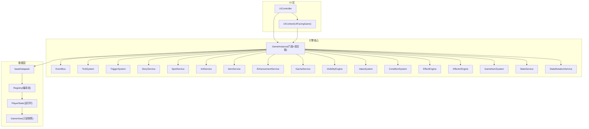
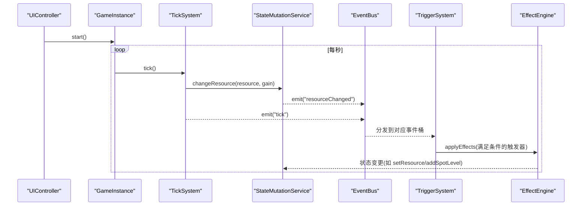
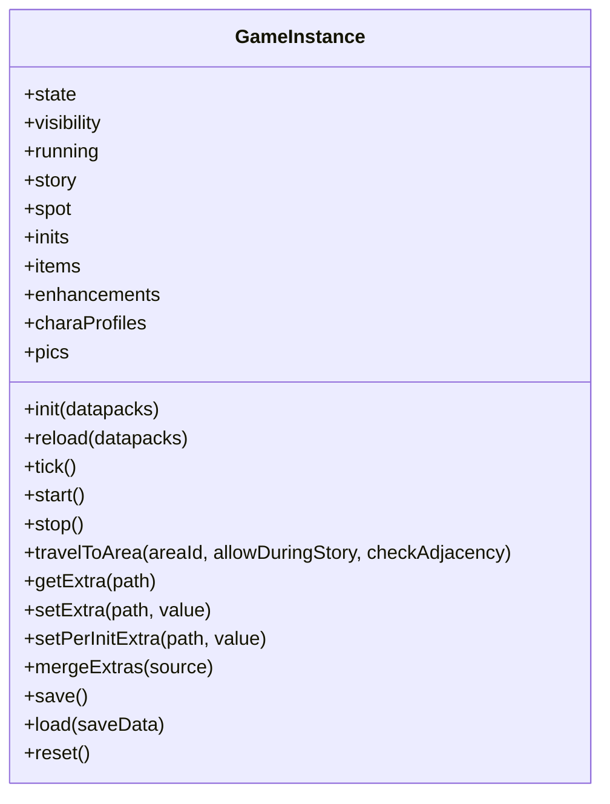
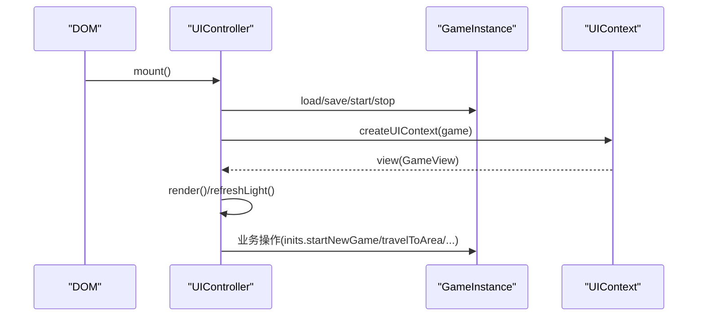
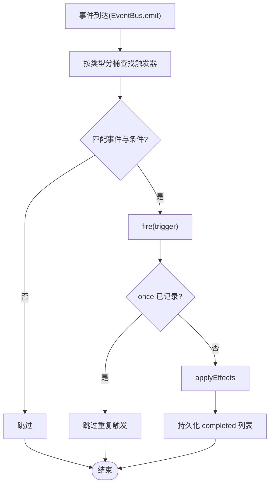
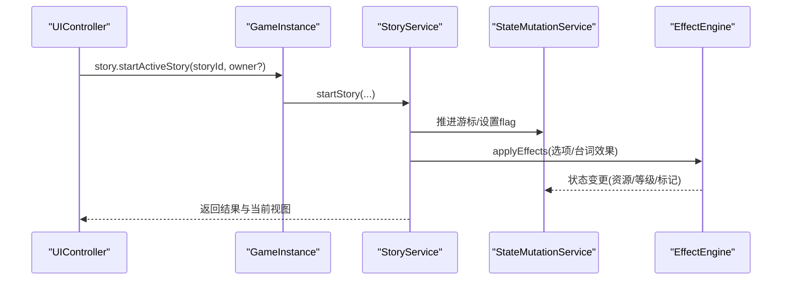
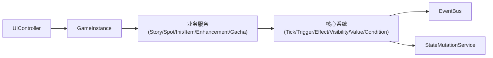

# 架构设计

<cite>
**本文引用的文件**
- [src/engine/game-instance.ts](file://src/engine/game-instance.ts)
- [src/engine/game/wiring.ts](file://src/engine/game/wiring.ts)
- [src/main.ts](file://src/main.ts)
- [src/ui/controller.ts](file://src/ui/controller.ts)
- [src/ui/context.ts](file://src/ui/context.ts)
- [src/data/index.ts](file://src/data/index.ts)
- [src/engine/core/event-bus.ts](file://src/engine/core/event-bus.ts)
- [src/engine/system/tick-system.ts](file://src/engine/system/tick-system.ts)
- [src/engine/effect/trigger-system.ts](file://src/engine/effect/trigger-system.ts)
- [src/engine/game/story-service.ts](file://src/engine/game/story-service.ts)
- [docs-828/01-architecture/overview.md](file://docs-828/01-architecture/overview.md)
- [docs-828/01-architecture/data-flow.md](file://docs-828/01-architecture/data-flow.md)
- [docs-828/01-architecture/run-logic.md](file://docs-828/01-architecture/run-logic.md)
- [docs-828/02-modules/core.md](file://docs-828/02-modules/core.md)
- [docs-828/02-modules/effect-trigger.md](file://docs-828/02-modules/effect-trigger.md)
- [docs-828/02-modules/stats.md](file://docs-828/02-modules/stats.md)
- [docs-828/02-modules/world.md](file://docs-828/02-modules/world.md)
- [docs-828/03-data-structures/player-state.md](file://docs-828/03-data-structures/player-state.md)
- [docs-828/04-mechanisms/state-mutation.md](file://docs-828/04-mechanisms/state-mutation.md)
</cite>

## 更新摘要
**变更内容**
- 整合 docs-828 架构文档，补充数据四层流动、运行逻辑与时序、状态写入管道等核心概念
- 强化事件驱动架构与声明式数据包的设计说明
- 更新组件关系图以反映最新的装配顺序和依赖关系
- 新增三层状态管理（Global/per-Init 快照/per-Init 当前）的详细说明
- 完善性能优化策略和故障排查指南

## 目录
1. [简介](#简介)
2. [项目结构](#项目结构)
3. [核心组件](#核心组件)
4. [架构总览](#架构总览)
5. [详细组件分析](#详细组件分析)
6. [依赖关系分析](#依赖关系分析)
7. [性能考量](#性能考量)
8. [故障排查指南](#故障排查指南)
9. [结论](#结论)
10. [附录：扩展点与自定义机制](#附录：扩展点与自定义机制)

## 简介
本架构设计文档面向 ACProgram 游戏引擎，系统性阐述整体架构模式（门面模式、事件驱动架构、服务层模式）、核心组件职责与交互、数据流向与状态管理策略，以及关键设计决策与技术权衡。重点解释 GameInstance 作为统一入口点的设计，UI 层、业务逻辑层、数据层的协作方式，并提供架构图表帮助开发者快速理解系统全貌。

ACProgram 是一个**事件驱动 + 声明式数据包**的放置类角色扮演游戏引擎，采用以下核心思想：
- **数据包声明式**：游戏逻辑尽量写成 Datapack（JSON/TS 定义），由引擎子系统解释执行
- **单一写入口**：所有状态变更经 StateMutationService，禁止绕过直改 PlayerState
- **事件驱动**：写状态后广播事件，联动逻辑做成 Trigger/Affector 订阅响应
- **只读 UI**：UI 只消费 getView()/createUIContext() 的不可变快照
- **三层状态**：跨世界线（global）/ per-Init 快照 / per-Init 当前

## 项目结构
ACProgram 采用分层与模块化组织：
- 引擎核心（engine）：提供运行时、子系统装配、表达式求值、效果与触发器、可见性、统计等能力
- 业务服务（engine/game, engine/system）：剧情、设施、世界线、物品、强化、角色、招募等高层服务
- UI 层（ui）：控制器、组件、主题、聊天流、弹窗等前端交互
- 数据层（data）：数据包加载与基础资源
- 存档（save）：持久化存储



**图表来源**
- [src/engine/game-instance.ts:74-145](file://src/engine/game-instance.ts#L74-L145)
- [src/engine/game/wiring.ts:61-287](file://src/engine/game/wiring.ts#L61-L287)
- [src/ui/controller.ts:61-137](file://src/ui/controller.ts#L61-L137)
- [src/ui/context.ts:25-89](file://src/ui/context.ts#L25-L89)
- [src/data/index.ts:1-6](file://src/data/index.ts#L1-L6)

**章节来源**
- [src/main.ts:21-51](file://src/main.ts#L21-L51)
- [src/engine/game-instance.ts:74-145](file://src/engine/game-instance.ts#L74-L145)
- [src/engine/game/wiring.ts:61-287](file://src/engine/game/wiring.ts#L61-L287)
- [src/ui/controller.ts:61-137](file://src/ui/controller.ts#L61-L137)
- [src/ui/context.ts:25-89](file://src/ui/context.ts#L25-L89)
- [src/data/index.ts:1-6](file://src/data/index.ts#L1-L6)

## 核心组件
- **GameInstance**：组合根与门面，集中装配子系统并暴露统一 API；持有 PlayerState，提供 init/tick/save/load/reset 等生命周期方法；通过只读别名暴露 story/spot/inits/items/enhancements/charaProfiles/pics 等服务
- **UIController**：UI 集成层门面，负责渲染循环、事件绑定、面板与聊天流管理，调用 GameInstance 进行状态变更与查询
- **EventBus**：类型安全的事件总线，支持按类型订阅、通配订阅、批量 flush，用于子系统解耦与跨层通知
- **TickSystem**：统一产出 tick，每秒对每个 Resource 计算 primitiveGain 并通过 StateMutationService 写入，发出 spotProduced/tick 事件
- **TriggerSystem**：声明式触发器桥接，将事件命中 + 条件满足映射为效果执行，按事件类型分桶优化匹配复杂度
- **StoryService**：剧情游标管理与流程编排，支持主动/被动剧情、聊天沙盒隔离、跳转链与完成奖励结算
- **其他服务**：SpotService、InitService、ItemService、EnhancementService、GachaService 等，封装领域操作并通过 StateMutationService 与 EffectEngine 修改状态与触发效果

**章节来源**
- [src/engine/game-instance.ts:74-145](file://src/engine/game-instance.ts#L74-L145)
- [src/ui/controller.ts:61-137](file://src/ui/controller.ts#L61-L137)
- [src/engine/core/event-bus.ts:9-84](file://src/engine/core/event-bus.ts#L9-L84)
- [src/engine/system/tick-system.ts:19-63](file://src/engine/system/tick-system.ts#L19-L63)
- [src/engine/effect/trigger-system.ts:49-203](file://src/engine/effect/trigger-system.ts#L49-L203)
- [src/engine/game/story-service.ts:52-84](file://src/engine/game/story-service.ts#L52-L84)

## 架构总览
ACProgram 采用"门面 + 服务层 + 事件驱动"的混合架构：
- **门面模式**：GameInstance 作为唯一入口，对外暴露精简 API；UI 仅通过 UIController 与 GameInstance 交互，避免直接耦合子系统
- **服务层模式**：story/spot/init/item/enhancement/gacha 等以 Service 形式组织业务逻辑，内部委托 EffectEngine、StateMutationService、VisibilityEngine 等底层能力
- **事件驱动架构**：EventBus 贯穿各子系统，TickSystem、TriggerSystem、EffectEngine、VisibilityEngine、ColorUnlockReactor 等通过事件通信，降低耦合度，实现精确失效与增量更新



**图表来源**
- [src/engine/game-instance.ts:247-262](file://src/engine/game-instance.ts#L247-L262)
- [src/engine/system/tick-system.ts:44-63](file://src/engine/system/tick-system.ts#L44-L63)
- [src/engine/core/event-bus.ts:46-75](file://src/engine/core/event-bus.ts#L46-75)
- [src/engine/effect/trigger-system.ts:125-203](file://src/engine/effect/trigger-system.ts#L125-L203)

**章节来源**
- [src/engine/game-instance.ts:247-262](file://src/engine/game-instance.ts#L247-L262)
- [src/engine/system/tick-system.ts:44-63](file://src/engine/system/tick-system.ts#L44-L63)
- [src/engine/core/event-bus.ts:46-75](file://src/engine/core/event-bus.ts#L46-75)
- [src/engine/effect/trigger-system.ts:125-203](file://src/engine/effect/trigger-system.ts#L125-L203)

## 详细组件分析

### GameInstance 门面与组合根
- **职责**：组装所有子系统（wiring），暴露只读别名（story/spot/inits/items/enhancements/charaProfiles/pics），管理生命周期（init/tick/start/stop/save/load/reset），维护 PlayerState 与可见性快照
- **设计要点**：
  - 构造器仅调用 wireGameInstance，装配细节外移，保持门面简洁
  - 通过 hooks 注入 getState/setState/refreshVisibility，避免循环依赖
  - getView 返回不可变视图，UI 消费只读数据，写操作必须经服务层或 StateMutationService
  - Extra 三层读取（全局 → per-Init → 数据包常量）提供运行时动态配置能力



**图表来源**
- [src/engine/game-instance.ts:74-145](file://src/engine/game-instance.ts#L74-L145)
- [src/engine/game-instance.ts:176-399](file://src/engine/game-instance.ts#L176-L399)

**章节来源**
- [src/engine/game-instance.ts:74-145](file://src/engine/game-instance.ts#L74-L145)
- [src/engine/game-instance.ts:176-399](file://src/engine/game-instance.ts#L176-L399)

### 装配模块 wiring.ts
- **职责**：创建并连接所有子系统，设置回调闭包（getState/getVisibility/refreshVisibility），注册 Reactor（ColorUnlockReactor、RuntimeEffectReactor），初始化默认状态
- **设计要点**：
  - 顺序严格遵循原构造器，确保依赖就绪后再赋值
  - 通过接口 WiringHooks 解耦宿主私有成员访问
  - 将特性逻辑（如色彩解锁）从组合根移出至独立 Reactor，提升可测试性与内聚性


**图表来源**
- [src/engine/game/wiring.ts:61-287](file://src/engine/game/wiring.ts#L61-L287)

**章节来源**
- [src/engine/game/wiring.ts:61-287](file://src/engine/game/wiring.ts#L61-L287)

### UI 控制器与上下文
- **UIController**：负责挂载 UI、事件绑定、渲染循环（每 1s 轻量刷新）、面板与聊天流管理、弹窗与浮层控制；调用 GameInstance 进行状态变更与查询
- **UIContext/UIFacingGame**：为 UI 组件提供只读门面，禁止直接写状态，保证架构纪律（写操作经 controller 层）



**图表来源**
- [src/ui/controller.ts:139-225](file://src/ui/controller.ts#L139-L225)
- [src/ui/context.ts:78-89](file://src/ui/context.ts#L78-L89)

**章节来源**
- [src/ui/controller.ts:139-225](file://src/ui/controller.ts#L139-L225)
- [src/ui/context.ts:25-89](file://src/ui/context.ts#L25-L89)

### 事件驱动与触发器系统
- **EventBus**：类型安全的事件总线，支持 on/off/onAny/emit/flush，队列化批量派发，避免嵌套 emit 导致的递归问题
- **TriggerSystem**：基于声明式 DSL 的触发器系统，按事件类型分桶匹配，支持 once 语义与分组挂载/卸载；命中后通过 EffectEngine 执行效果



**图表来源**
- [src/engine/core/event-bus.ts:46-75](file://src/engine/core/event-bus.ts#L46-75)
- [src/engine/effect/trigger-system.ts:125-203](file://src/engine/effect/trigger-system.ts#L125-L203)

**章节来源**
- [src/engine/core/event-bus.ts:46-75](file://src/engine/core/event-bus.ts#L46-75)
- [src/engine/effect/trigger-system.ts:125-203](file://src/engine/effect/trigger-system.ts#L125-L203)

### 剧情服务与聊天沙盒
- **StoryService**：管理全局与聊天沙盒游标，支持主动/被动剧情、跳转链、守卫前置条件、完成奖励结算；与 Travel 限制联动（演出中禁止移动，除非 Story 自身要求）
- **聊天沙盒**：按 owner（VariantId）隔离，互不干扰；支持多角色并行对话空间



**图表来源**
- [src/engine/game/story-service.ts:180-200](file://src/engine/game/story-service.ts#L180-L200)
- [src/engine/game-instance.ts:296-300](file://src/engine/game-instance.ts#L296-L300)

**章节来源**
- [src/engine/game/story-service.ts:180-200](file://src/engine/game/story-service.ts#L180-L200)
- [src/engine/game-instance.ts:296-300](file://src/engine/game-instance.ts#L296-L300)

### 数据四层流动
ACProgram 的数据流动遵循四层架构：

```text
Datapack 声明（src/data/base/*.ts 或 JSON 导入）
    ↓ Registry 编译态（25+ 表 + 关系索引 + 引用校验，恒只读）
        ↓ PlayerState 运行时（三层：Global + per-Init 快照 + per-Init 当前）
            ↓ GameView 只读快照（UI 消费）
                                    ↑ StatsService 三层统计并行
```

**层 1：Datapack 声明**
- 默认加载的是 `src/data/base/`（TypeScript）；`datapack/` 根目录是可选 JSON 导入
- `datapack.ts` 组合所有定义块导出默认数据包，注入 `GameInstance.init()`
- 实体类型权威定义在 `src/engine/types/`；构建器在 `src/engine/def-factory/`

**层 2：Registry 编译态**
- `Registry.build/merge`：表驱动（`tableSteps` 单一清单，T6）——新增一张表 = 私有字段 + getter + 1 条 step
- 加载期引用校验（`registry-validate.ts` + `validateCharacterRefs`）：失败即抛错，保证运行时「拿到的引用必有效」
- **Registry 恒只读**：运行时变化全部落 `PlayerState`

**层 3：PlayerState 运行时**
- 三层结构：Global（跨世界线永久）/ per-Init 快照（离开时保存、回时恢复）/ per-Init 当前（当前世界线运行时）
- 唯一写入口 `StateMutationService`
- 派生数据（产出树缓存 / 可见性快照 / tag 反向索引）不落 PlayerState，由各引擎持有并经事件定向失效

**层 4：GameView / UIContext**
- `getView()` → `GameView`（资源快照 + spotLevels + unlockedInits + storyLog + visibility 等）
- `createUIContext()` → `UIContext`（GameView + `UIFacingGame` 只读查询面 + nameOf/formatNumber 辅助）
- UI 刷新：每帧 `refreshLight`（轻量数字）；揭示指纹变化 → `refreshRevealIfChanged` → 重建 DOM

**章节来源**
- [docs-828/01-architecture/data-flow.md:1-48](file://docs-828/01-architecture/data-flow.md#L1-L48)
- [docs-828/03-data-structures/player-state.md:1-48](file://docs-828/03-data-structures/player-state.md#L1-L48)

### 运行逻辑与时序
程序从启动到运行的主干时序：

```text
main.ts（UI 启动）
  └─ new GameInstance()            wiring 装配全部子系统（依赖顺序 + 事件接线）
       └─ init(datapacks)          加载数据包 → 校验 → 建索引 → 建产出树 → 进入默认 Init
            └─ start()             启动会话循环（1 tick/秒）
                 └─ tick()         每帧：生产结算 → Affector → 剧情 → 阻断复检 → 统计
                      │
                      ├─ getView()            UI 只读拉取快照
                      ├─ save() / load()      存档导出 / 恢复
                      ├─ travelToArea()       区域移动（可达性门槛链）
                      └─ ...                  各业务门面（升级/招募/培养/剧情…）
```

**一、构造装配（依赖顺序）**
构造器只剩 `new` + `wireGameInstance(g, hooks, options)` 调用；装配顺序即依赖顺序（先建被依赖的底层，再建上层门面）：

| 顺序 | 子系统 | 为什么先建 |
| --- | --- | --- |
| 1 | `EventBus` / `Registry` / `ValueSystem` / `ConditionSystem` / `FuncletExecutor` | 事件、注册表、表达式求值是最底层被依赖项 |
| 2 | `StatsService` + `StateMutationService` | 所有下层系统共用同一带统计的写入口；先给 conditionSystem 接 stat 读取器 |
| 3 | `SpotFunctionalitySystem` + `EffectEngine` | EffectEngine 依赖 mutations/valueSystem |
| 4 | Character 域：`CharacterSystem` / `RosterSystem` / `AvailabilityService` / `ColorSystem` / `ColorEquipmentSystem` | 用 registry 解析原型、曲线、色彩 |
| 5 | `GachaService` | 依赖 availability 与 initService（资源） |
| 6 | `mutations.setCharacterCatalog` | 给写入口接原型/曲线/色彩解析器 |
| 7 | `AffectorEngine` | 持续效果宿主，依赖 conditionSystem/mutations/effectEngine/spotFunctionality |
| 8 | `GameNumSystem` | 统一数值；**构造期自订阅 affector 事件**做区表重同步（T7 后单向依赖） |
| 9 | `TickSystem` / `TriggerSystem` / `LootSystem` / `VisibilityEngine` / `TagStatService` | 各自注册到 conditionSystem 的读取器 |
| 10 | `PassivePoolSystem` + 门面服务：`Story` / `Spot` / `Init` / `Session` / `Item` / `Enhancement` / `CharaProfile` / `Pic` | 依赖上面全部核心系统 |
| 11 | 收尾：`createDefaultState()` + `setState` 同步各子系统 | 让所有系统拿到初始状态引用 |

**二、初始化：init(datapacks) / reload**
```text
init(datapacks)
 1. 组装 Registry：全部 Datapack → 表 + 关系索引 + 名称解析（表驱动 merge），完成触发 `registry:built`
 2. 建产出树：gameNumSystem.buildAll()（四级层级树，见 [[docs-828/04-mechanisms/production]]）
 3. 进入默认世界线：解锁 + 建 per-init 状态 + 挂载专属 Trigger（mountInitTriggers）+ 发 `init:mounted`
 4. affectorEngine.reconcileMounts()：按初始状态对账挂载物品/强化/功能的 Affector 实例
```

**三、运行循环：start / tick**
```text
start() → running = true → runId = randomUUID() → startSession() → setInterval(tick, 1000) → game:started
```

```text
tick()
 ├─ 1. tickSystem.run()            生产结算：逐 Resource 走 GameNum primitiveGain 树（唯一路径）
 ├─ 2. affectorEngine.applyActiveEffects()
 │       ├─ 先重估轮询实例（stat 宽依赖）
 │       └─ 执行 Active 实例的 perTickEffects（effects 仅激活沿执行一次，不在每帧路径）
 ├─ 3. storyService.tick()         剧情被动推进
 ├─ 4. recheckStudentBlocks()      阻断复检（纯只读判定 + 发事件，不改状态）
 ├─ 5. statsService.tick()         帧统计累计
 └─ 6. `tick` 事件                 通知 UI（refreshLight）
```

**四、业务门面操作与 UI 只读消费**

| 操作 | 入口 | 前置门槛 | 写状态 |
| --- | --- | --- | --- |
| 升级 Spot | `upgradeSpot` | `canUpgradeSpot`（花费 + 等级上限 + 条件） | setSpotLevel + 扣费 |
| 购买 Spot | `purchaseSpot` | reveal 到 `purchaseable` | 解锁 + 扣费 |
| 招募 | `gachaService.roll` | 卡池 drawable + 货币足够 | 变体/碎片/货币 |
| 培养 | `cultivateSystem.applyExp` | 曲线 + 突破判定 | exp/star |
| 剧情 | `storyService.*` | reveal 门槛 + triggerCondition | storyLog + 奖励 |

**五、存档 / 读档 / 重置**
```text
save() → 深拷贝 state → SaveData（version + PlayerState + stats + chatHistories）
         聊天历史由 UI 层 withHistories 注入（不污染引擎状态）
load() → 校验 version → 替换 state → syncSubsystems → rebuildRuntime → UI restoreHistories
```

**章节来源**
- [docs-828/01-architecture/run-logic.md:1-115](file://docs-828/01-architecture/run-logic.md#L1-L115)
- [src/main.ts:21-51](file://src/main.ts#L21-L51)

### 状态写入管道
所有状态变更的必经之路（架构纪律 1）：

```text
1. 业务门面（service / GameInstance 子门面）做只读校验（canXxx）
2. StateMutationService 写方法：
     ① 改 PlayerState 字段
     ② 同步统计（statsService.record）
     ③ 发对应事件（eventBus.emit）
3. 事件监听器响应（Trigger / Affector / GameNum / UI 订阅）
4. 可选：重建派生数据（visibility / tag 索引 / GameNum 失效）
```

**单一写入口 StateMutationService**

| 方法 | 效果 | 发事件 |
| --- | --- | --- |
| `setResource` / `changeResource` | 设置/增减资源（Global 资源走 globalResources） | `resourceChanged` |
| `setSpotLevel` / `addSpotLevel` | 设施等级 | `spotLevelChanged` |
| `setManager` | 指派 Manager | `managerChanged` |
| `unlockInit` / `addItem` / `addEnhancement` | 解锁世界线/物品/强化 | `initUnlocked` / `itemCollected` / `enhancementAdded` |
| `setFlag` / `setExtra` / `addExtra` / `removeExtra` | 标记/扩展数据 | `flagChanged` / `extraChanged` |
| `acquireCharacter` | 获得差分（重复转碎片） | 角色获得事件（Trigger kind `character` 侦测） |
| `applyExp` / `breakthroughStar` | 培养推进 | `cultivated`（`kind: 'exp'` / `'star'`） |

**Effect 执行（effect-ops）**
- `applyEffects(effects)` 逐条 `applyEffect(effect)`：按 `op` 分发到对应写方法
- 状态层落数据的 13 种：`setResource/addResource/setSpotLevel/addSpotLevel/setManager/addEnhancement/addItem/unlockInit/setFlag/setExtra/addExtra/removeExtra/grantCharacter`
- 转发类（`loot`/`triggerStory`/`travelToArea`/`setTheme`/聊天流族）在状态层不落数据——演出类经**请求事件**转发
- 声明类（`setSpotMaxLevel`/`removeSpotMaxLevel`）不经执行，由 `getSpotMaxLevelOverrides` 动态读取

**为什么不可绕过**
- 校验只发生在门面层，但**写状态必须经管道**，保证：统计不错记、事件不漏发、GameNum 失效不遗漏、UI 只读一致性
- 直接改 `state` 的调用方会导致 GameNum 陈旧读（失效由事件驱动）

**章节来源**
- [docs-828/04-mechanisms/state-mutation.md:1-47](file://docs-828/04-mechanisms/state-mutation.md#L1-L47)

## 依赖关系分析
- **单向依赖**：UI → GameInstance → Services → Core Systems（EventBus/ValueSystem/ConditionSystem/EffectEngine/VisibilityEngine）
- **事件通道**：TickSystem、TriggerSystem、EffectEngine、VisibilityEngine、ColorUnlockReactor 通过 EventBus 通信，避免直接耦合
- **状态写入**：统一经 StateMutationService，保证统计、可见性、数值树一致性
- **可见性**：VisibilityEngine 在 init/tick/事件后增量更新，减少全量重算开销



**图表来源**
- [src/engine/game/wiring.ts:61-287](file://src/engine/game/wiring.ts#L61-L287)
- [src/engine/system/tick-system.ts:44-63](file://src/engine/system/tick-system.ts#L44-L63)
- [src/engine/effect/trigger-system.ts:125-203](file://src/engine/effect/trigger-system.ts#L125-L203)

**章节来源**
- [src/engine/game/wiring.ts:61-287](file://src/engine/game/wiring.ts#L61-L287)
- [src/engine/system/tick-system.ts:44-63](file://src/engine/system/tick-system.ts#L44-L63)
- [src/engine/effect/trigger-system.ts:125-203](file://src/engine/effect/trigger-system.ts#L125-L203)

## 性能考量
- **事件驱动精确失效**：TickSystem 每帧对 Resource 求值，通过 StateMutationService 写入并触发 resourceChanged，TriggerSystem 按类型分桶匹配，避免 O(事件×触发器) 全扫描
- **可见性增量更新**：VisibilityEngine 在事件后增量重算，不在每帧全量计算
- **轻量刷新**：UIController 每 1s 执行 refreshLight，仅更新数字节点，避免重建 #app DOM
- **数值缓存**：GameNumSystem 懒求值，未受影响的 gain 子树跨帧保持缓存
- **聊天历史上限**：UIController 维护 MAX_CHAT_HISTORY，防止内存膨胀
- **三层状态优化**：Global/per-Init 快照/per-Init 当前的分层设计，减少不必要的状态复制和计算

**章节来源**
- [docs-828/01-architecture/data-flow.md:39-48](file://docs-828/01-architecture/data-flow.md#L39-L48)
- [docs-828/03-data-structures/player-state.md:5-13](file://docs-828/03-data-structures/player-state.md#L5-L13)

## 故障排查指南
- **事件调试**：EventBus.onAny 可打印事件类型与参数，配合 DevLog 记录事件与帧号，定位级联触发问题
- **触发器命中**：检查 ON_KIND_TO_EVENT 映射与 trigger.on 定义，确认事件类型与过滤条件（如 resource/spotId/itemId/storyId/initId/areaId/variantId/cultivation）
- **状态一致性**：所有状态变更应经 StateMutationService，避免绕过导致可见性/数值树不一致
- **剧情阻塞移动**：StoryService.isBlockingMovement 与 travelToArea 规则需配合使用，确保演出期间移动限制生效
- **状态写入验证**：确认所有状态变更都经过 StateMutationService 的四步管道，避免直接修改 PlayerState

**章节来源**
- [src/engine/core/event-bus.ts:28-35](file://src/engine/core/event-bus.ts#L28-L35)
- [src/engine/effect/trigger-system.ts:34-44](file://src/engine/effect/trigger-system.ts#L34-L44)
- [src/engine/game/story-service.ts:156-172](file://src/engine/game/story-service.ts#L156-L172)
- [docs-828/04-mechanisms/state-mutation.md:39-43](file://docs-828/04-mechanisms/state-mutation.md#L39-L43)

## 结论
ACProgram 引擎通过门面模式（GameInstance）、服务层模式（Story/Spot/Init/Item/Enhancement/Gacha 等）与事件驱动架构（EventBus/TriggerSystem/EffectEngine/VisibilityEngine）实现了高内聚、低耦合的系统设计。GameInstance 作为统一入口点，简化了 UI 与引擎的交互；事件驱动确保了子系统间的解耦与精确失效；服务层封装了复杂业务逻辑，提升了可维护性与可扩展性。结合可见性增量更新、数值缓存与轻量刷新等优化策略，系统在性能与体验上取得平衡。

通过 docs-828 架构文档的整合，我们进一步完善了对数据四层流动、运行逻辑时序、状态写入管道的理解，为开发者提供了更全面的架构视角和技术指导。

## 附录：扩展点与自定义机制
- **数据包扩展**：通过 baseDatapack 与 datapack 加载机制，新增区域、故事、物品、强化、触发器等定义，由 Registry 统一管理
- **触发器 DSL**：在数据包中声明 TriggerDef，指定 on.kind、condition、effects、once，由 TriggerSystem 自动挂载与匹配
- **额外数据（Extra）**：支持全局、per-Init、数据包常量三层读取与写入，提供运行时动态配置能力
- **效果系统**：通过 EffectEngine 应用 effects，可修改资源、等级、管理器、标记等，触发后续事件链
- **可见性开关**：通过 VisibilityEngine 与 hasExistenceGate 控制实体揭示，支持条件化解锁
- **颜色与装备**：ColorSystem/ColorEquipmentSystem 与 ColorUnlockReactor 联动，角色获取/flag 变化时自动重算解锁
- **三层状态扩展**：新增字段时需明确归属层（Global/per-Init 快照/per-Init 当前），per-Init 字段必须登记 `PER_INIT_FIELD_SPECS`

**章节来源**
- [src/data/index.ts:1-6](file://src/data/index.ts#L1-L6)
- [src/engine/effect/trigger-system.ts:77-93](file://src/engine/effect/trigger-system.ts#L77-L93)
- [src/engine/game-instance.ts:302-332](file://src/engine/game-instance.ts#L302-L332)
- [src/engine/game/wiring.ts:269-287](file://src/engine/game/wiring.ts#L269-L287)
- [docs-828/03-data-structures/player-state.md:43-48](file://docs-828/03-data-structures/player-state.md#L43-L48)
