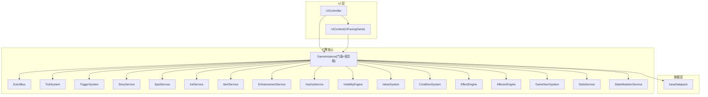
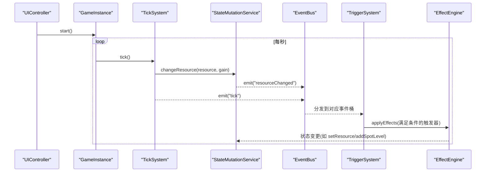
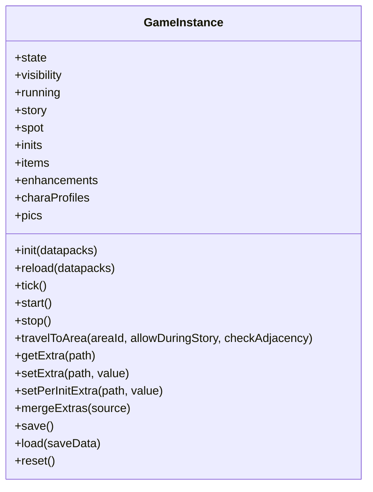
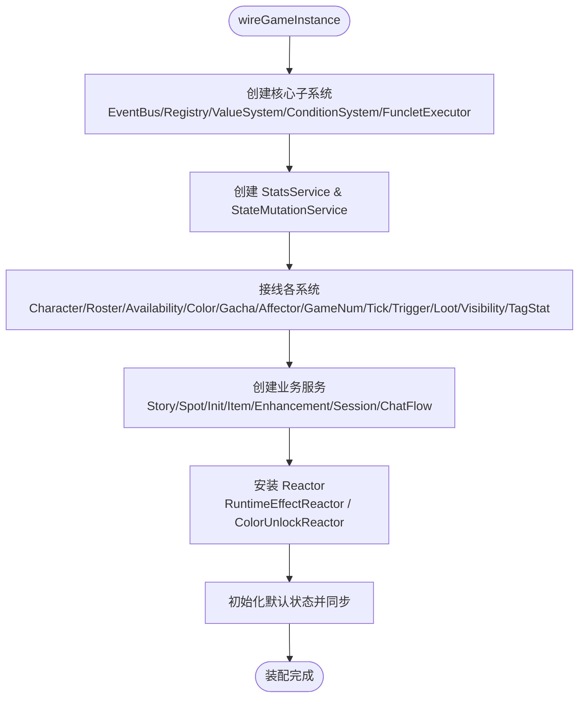
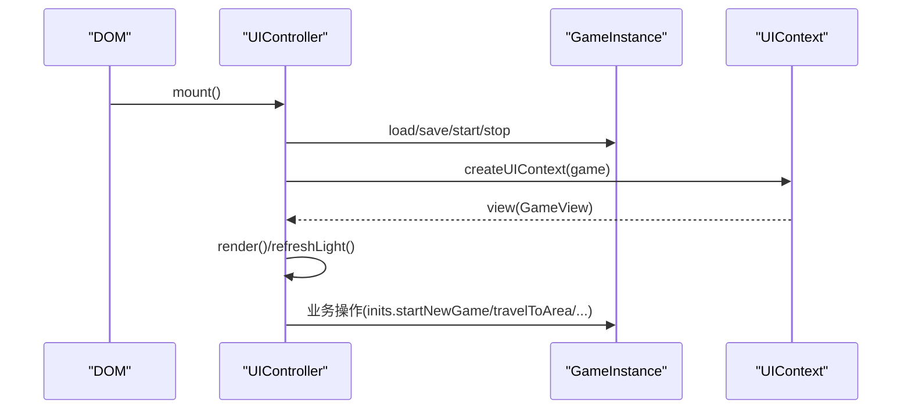
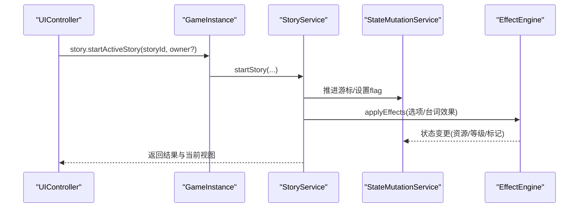
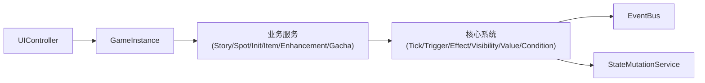

# 架构设计

<cite>
**本文引用的文件**
- [src/engine/game-instance.ts](file://src/engine/game-instance.ts)
- [src/engine/game/wiring.ts](file://src/engine/game/wiring.ts)
- [src/main.ts](file://src/main.ts)
- [src/ui/controller.ts](file://src/ui/controller.ts)
- [src/ui/context.ts](file://src/ui/context.ts)
- [src/data/index.ts](file://src/data/index.ts)
- [src/engine/core/event-bus.ts](file://src/engine/core/event-bus.ts)
- [src/engine/system/tick-system.ts](file://src/engine/system/tick-system.ts)
- [src/engine/effect/trigger-system.ts](file://src/engine/effect/trigger-system.ts)
- [src/engine/game/story-service.ts](file://src/engine/game/story-service.ts)
</cite>

## 目录
1. [简介](#简介)
2. [项目结构](#项目结构)
3. [核心组件](#核心组件)
4. [架构总览](#架构总览)
5. [详细组件分析](#详细组件分析)
6. [依赖关系分析](#依赖关系分析)
7. [性能考量](#性能考量)
8. [故障排查指南](#故障排查指南)
9. [结论](#结论)
10. [附录：扩展点与自定义机制](#附录：扩展点与自定义机制)

## 简介
本架构设计文档面向 ACProgram 游戏引擎，系统性阐述整体架构模式（门面模式、事件驱动架构、服务层模式）、核心组件职责与交互、数据流向与状态管理策略，以及关键设计决策与技术权衡。重点解释 GameInstance 作为统一入口点的设计，UI 层、业务逻辑层、数据层的协作方式，并提供架构图表帮助开发者快速理解系统全貌。文末给出扩展点与自定义机制说明，便于二次开发与 Mod 集成。

## 项目结构
ACProgram 采用分层与模块化组织：
- 引擎核心（engine）：提供运行时、子系统装配、表达式求值、效果与触发器、可见性、统计等能力。
- 业务服务（engine/game, engine/system）：剧情、设施、世界线、物品、强化、角色、招募等高层服务。
- UI 层（ui）：控制器、组件、主题、聊天流、弹窗等前端交互。
- 数据层（data）：数据包加载与基础资源。
- 存档（save）：持久化存储。

图表来源
- [src/engine/game-instance.ts:74-145](file://src/engine/game-instance.ts#L74-L145)
- [src/engine/game/wiring.ts:61-287](file://src/engine/game/wiring.ts#L61-L287)
- [src/ui/controller.ts:61-137](file://src/ui/controller.ts#L61-L137)
- [src/ui/context.ts:25-89](file://src/ui/context.ts#L25-L89)
- [src/data/index.ts:1-6](file://src/data/index.ts#L1-L6)

章节来源
- [src/main.ts:21-51](file://src/main.ts#L21-L51)
- [src/engine/game-instance.ts:74-145](file://src/engine/game-instance.ts#L74-L145)
- [src/engine/game/wiring.ts:61-287](file://src/engine/game/wiring.ts#L61-L287)
- [src/ui/controller.ts:61-137](file://src/ui/controller.ts#L61-L137)
- [src/ui/context.ts:25-89](file://src/ui/context.ts#L25-L89)
- [src/data/index.ts:1-6](file://src/data/index.ts#L1-L6)

## 核心组件
- GameInstance：组合根与门面，集中装配子系统并暴露统一 API；持有 PlayerState，提供 init/tick/save/load/reset 等生命周期方法；通过只读别名暴露 story/spot/inits/items/enhancements/charaProfiles/pics 等服务。
- UIController：UI 集成层门面，负责渲染循环、事件绑定、面板与聊天流管理，调用 GameInstance 进行状态变更与查询。
- EventBus：类型安全的事件总线，支持按类型订阅、通配订阅、批量 flush，用于子系统解耦与跨层通知。
- TickSystem：统一产出 tick，每秒对每个 Resource 计算 primitiveGain 并通过 StateMutationService 写入，发出 spotProduced/tick 事件。
- TriggerSystem：声明式触发器桥接，将事件命中 + 条件满足映射为效果执行，按事件类型分桶优化匹配复杂度。
- StoryService：剧情游标管理与流程编排，支持主动/被动剧情、聊天沙盒隔离、跳转链与完成奖励结算。
- 其他服务：SpotService、InitService、ItemService、EnhancementService、GachaService 等，封装领域操作并通过 StateMutationService 与 EffectEngine 修改状态与触发效果。

章节来源
- [src/engine/game-instance.ts:74-145](file://src/engine/game-instance.ts#L74-L145)
- [src/ui/controller.ts:61-137](file://src/ui/controller.ts#L61-L137)
- [src/engine/core/event-bus.ts:9-84](file://src/engine/core/event-bus.ts#L9-L84)
- [src/engine/system/tick-system.ts:19-63](file://src/engine/system/tick-system.ts#L19-L63)
- [src/engine/effect/trigger-system.ts:49-203](file://src/engine/effect/trigger-system.ts#L49-L203)
- [src/engine/game/story-service.ts:52-84](file://src/engine/game/story-service.ts#L52-L84)

## 架构总览
ACProgram 采用“门面 + 服务层 + 事件驱动”的混合架构：
- 门面模式：GameInstance 作为唯一入口，对外暴露精简 API；UI 仅通过 UIController 与 GameInstance 交互，避免直接耦合子系统。
- 服务层模式：story/spot/init/item/enhancement/gacha 等以 Service 形式组织业务逻辑，内部委托 EffectEngine、StateMutationService、VisibilityEngine 等底层能力。
- 事件驱动架构：EventBus 贯穿各子系统，TickSystem、TriggerSystem、EffectEngine、VisibilityEngine、ColorUnlockReactor 等通过事件通信，降低耦合度，实现精确失效与增量更新。

图表来源
- [src/engine/game-instance.ts:247-262](file://src/engine/game-instance.ts#L247-L262)
- [src/engine/system/tick-system.ts:44-63](file://src/engine/system/tick-system.ts#L44-L63)
- [src/engine/core/event-bus.ts:46-75](file://src/engine/core/event-bus.ts#L46-L75)
- [src/engine/effect/trigger-system.ts:125-203](file://src/engine/effect/trigger-system.ts#L125-L203)

章节来源
- [src/engine/game-instance.ts:247-262](file://src/engine/game-instance.ts#L247-L262)
- [src/engine/system/tick-system.ts:44-63](file://src/engine/system/tick-system.ts#L44-L63)
- [src/engine/core/event-bus.ts:46-75](file://src/engine/core/event-bus.ts#L46-L75)
- [src/engine/effect/trigger-system.ts:125-203](file://src/engine/effect/trigger-system.ts#L125-L203)

## 详细组件分析

### GameInstance 门面与组合根
- 职责：组装所有子系统（wiring），暴露只读别名（story/spot/inits/items/enhancements/charaProfiles/pics），管理生命周期（init/tick/start/stop/save/load/reset），维护 PlayerState 与可见性快照。
- 设计要点：
  - 构造器仅调用 wireGameInstance，装配细节外移，保持门面简洁。
  - 通过 hooks 注入 getState/setState/refreshVisibility，避免循环依赖。
  - getView 返回不可变视图，UI 消费只读数据，写操作必须经服务层或 StateMutationService。
  - Extra 三层读取（全局 → per-Init → 数据包常量）提供运行时动态配置能力。

图表来源
- [src/engine/game-instance.ts:74-145](file://src/engine/game-instance.ts#L74-L145)
- [src/engine/game-instance.ts:176-399](file://src/engine/game-instance.ts#L176-L399)

章节来源
- [src/engine/game-instance.ts:74-145](file://src/engine/game-instance.ts#L74-L145)
- [src/engine/game-instance.ts:176-399](file://src/engine/game-instance.ts#L176-L399)

### 装配模块 wiring.ts
- 职责：创建并连接所有子系统，设置回调闭包（getState/getVisibility/refreshVisibility），注册 Reactor（ColorUnlockReactor、RuntimeEffectReactor），初始化默认状态。
- 设计要点：
  - 顺序严格遵循原构造器，确保依赖就绪后再赋值。
  - 通过接口 WiringHooks 解耦宿主私有成员访问。
  - 将特性逻辑（如色彩解锁）从组合根移出至独立 Reactor，提升可测试性与内聚性。

图表来源
- [src/engine/game/wiring.ts:61-287](file://src/engine/game/wiring.ts#L61-L287)

章节来源
- [src/engine/game/wiring.ts:61-287](file://src/engine/game/wiring.ts#L61-L287)

### UI 控制器与上下文
- UIController：负责挂载 UI、事件绑定、渲染循环（每 1s 轻量刷新）、面板与聊天流管理、弹窗与浮层控制；调用 GameInstance 进行状态变更与查询。
- UIContext/UIFacingGame：为 UI 组件提供只读门面，禁止直接写状态，保证架构纪律（写操作经 controller 层）。

图表来源
- [src/ui/controller.ts:139-225](file://src/ui/controller.ts#L139-L225)
- [src/ui/context.ts:78-89](file://src/ui/context.ts#L78-L89)

章节来源
- [src/ui/controller.ts:139-225](file://src/ui/controller.ts#L139-L225)
- [src/ui/context.ts:25-89](file://src/ui/context.ts#L25-L89)

### 事件驱动与触发器系统
- EventBus：类型安全的事件总线，支持 on/off/onAny/emit/flush，队列化批量派发，避免嵌套 emit 导致的递归问题。
- TriggerSystem：基于声明式 DSL 的触发器系统，按事件类型分桶匹配，支持 once 语义与分组挂载/卸载；命中后通过 EffectEngine 执行效果。

图表来源
- [src/engine/core/event-bus.ts:46-75](file://src/engine/core/event-bus.ts#L46-L75)
- [src/engine/effect/trigger-system.ts:125-203](file://src/engine/effect/trigger-system.ts#L125-L203)

章节来源
- [src/engine/core/event-bus.ts:46-75](file://src/engine/core/event-bus.ts#L46-L75)
- [src/engine/effect/trigger-system.ts:125-203](file://src/engine/effect/trigger-system.ts#L125-L203)

### 剧情服务与聊天沙盒
- StoryService：管理全局与聊天沙盒游标，支持主动/被动剧情、跳转链、守卫前置条件、完成奖励结算；与 Travel 限制联动（演出中禁止移动，除非 Story 自身要求）。
- 聊天沙盒：按 owner（VariantId）隔离，互不干扰；支持多角色并行对话空间。

图表来源
- [src/engine/game/story-service.ts:180-200](file://src/engine/game/story-service.ts#L180-L200)
- [src/engine/game-instance.ts:296-300](file://src/engine/game-instance.ts#L296-L300)

章节来源
- [src/engine/game/story-service.ts:180-200](file://src/engine/game/story-service.ts#L180-L200)
- [src/engine/game-instance.ts:296-300](file://src/engine/game-instance.ts#L296-L300)

## 依赖关系分析
- 单向依赖：UI → GameInstance → Services → Core Systems（EventBus/ValueSystem/ConditionSystem/EffectEngine/VisibilityEngine）。
- 事件通道：TickSystem、TriggerSystem、EffectEngine、VisibilityEngine、ColorUnlockReactor 通过 EventBus 通信，避免直接耦合。
- 状态写入：统一经 StateMutationService，保证统计、可见性、数值树一致性。
- 可见性：VisibilityEngine 在 init/tick/事件后增量更新，减少全量重算开销。

图表来源
- [src/engine/game/wiring.ts:61-287](file://src/engine/game/wiring.ts#L61-L287)
- [src/engine/system/tick-system.ts:44-63](file://src/engine/system/tick-system.ts#L44-L63)
- [src/engine/effect/trigger-system.ts:125-203](file://src/engine/effect/trigger-system.ts#L125-L203)

章节来源
- [src/engine/game/wiring.ts:61-287](file://src/engine/game/wiring.ts#L61-L287)
- [src/engine/system/tick-system.ts:44-63](file://src/engine/system/tick-system.ts#L44-L63)
- [src/engine/effect/trigger-system.ts:125-203](file://src/engine/effect/trigger-system.ts#L125-L203)

## 性能考量
- 事件驱动精确失效：TickSystem 每帧对 Resource 求值，通过 StateMutationService 写入并触发 resourceChanged，TriggerSystem 按类型分桶匹配，避免 O(事件×触发器) 全扫描。
- 可见性增量更新：VisibilityEngine 在事件后增量重算，不在每帧全量计算。
- 轻量刷新：UIController 每 1s 执行 refreshLight，仅更新数字节点，避免重建 #app DOM。
- 数值缓存：GameNumSystem 懒求值，未受影响的 gain 子树跨帧保持缓存。
- 聊天历史上限：UIController 维护 MAX_CHAT_HISTORY，防止内存膨胀。

[本节为通用性能讨论，不直接分析具体文件]

## 故障排查指南
- 事件调试：EventBus.onAny 可打印事件类型与参数，配合 DevLog 记录事件与帧号，定位级联触发问题。
- 触发器命中：检查 ON_KIND_TO_EVENT 映射与 trigger.on 定义，确认事件类型与过滤条件（如 resource/spotId/itemId/storyId/initId/areaId/variantId/cultivation）。
- 状态一致性：所有状态变更应经 StateMutationService，避免绕过导致可见性/数值树不一致。
- 剧情阻塞移动：StoryService.isBlockingMovement 与 travelToArea 规则需配合使用，确保演出期间移动限制生效。

章节来源
- [src/engine/core/event-bus.ts:28-35](file://src/engine/core/event-bus.ts#L28-L35)
- [src/engine/effect/trigger-system.ts:34-44](file://src/engine/effect/trigger-system.ts#L34-L44)
- [src/engine/game/story-service.ts:156-172](file://src/engine/game/story-service.ts#L156-L172)

## 结论
ACProgram 引擎通过门面模式（GameInstance）、服务层模式（Story/Spot/Init/Item/Enhancement/Gacha 等）与事件驱动架构（EventBus/TriggerSystem/EffectEngine/VisibilityEngine）实现了高内聚、低耦合的系统设计。GameInstance 作为统一入口点，简化了 UI 与引擎的交互；事件驱动确保了子系统间的解耦与精确失效；服务层封装了复杂业务逻辑，提升了可维护性与可扩展性。结合可见性增量更新、数值缓存与轻量刷新等优化策略，系统在性能与体验上取得平衡。

[本节为总结性内容，不直接分析具体文件]

## 附录：扩展点与自定义机制
- 数据包扩展：通过 baseDatapack 与 datapack 加载机制，新增区域、故事、物品、强化、触发器等定义，由 Registry 统一管理。
- 触发器 DSL：在数据包中声明 TriggerDef，指定 on.kind、condition、effects、once，由 TriggerSystem 自动挂载与匹配。
- 额外数据（Extra）：支持全局、per-Init、数据包常量三层读取与写入，提供运行时动态配置能力。
- 效果系统：通过 EffectEngine 应用 effects，可修改资源、等级、管理器、标记等，触发后续事件链。
- 可见性开关：通过 VisibilityEngine 与 hasExistenceGate 控制实体揭示，支持条件化解锁。
- 颜色与装备：ColorSystem/ColorEquipmentSystem 与 ColorUnlockReactor 联动，角色获取/flag 变化时自动重算解锁。

章节来源
- [src/data/index.ts:1-6](file://src/data/index.ts#L1-L6)
- [src/engine/effect/trigger-system.ts:77-93](file://src/engine/effect/trigger-system.ts#L77-L93)
- [src/engine/game-instance.ts:302-332](file://src/engine/game-instance.ts#L302-L332)
- [src/engine/game/wiring.ts:269-287](file://src/engine/game/wiring.ts#L269-L287)