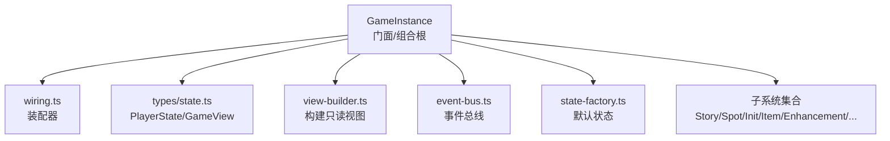
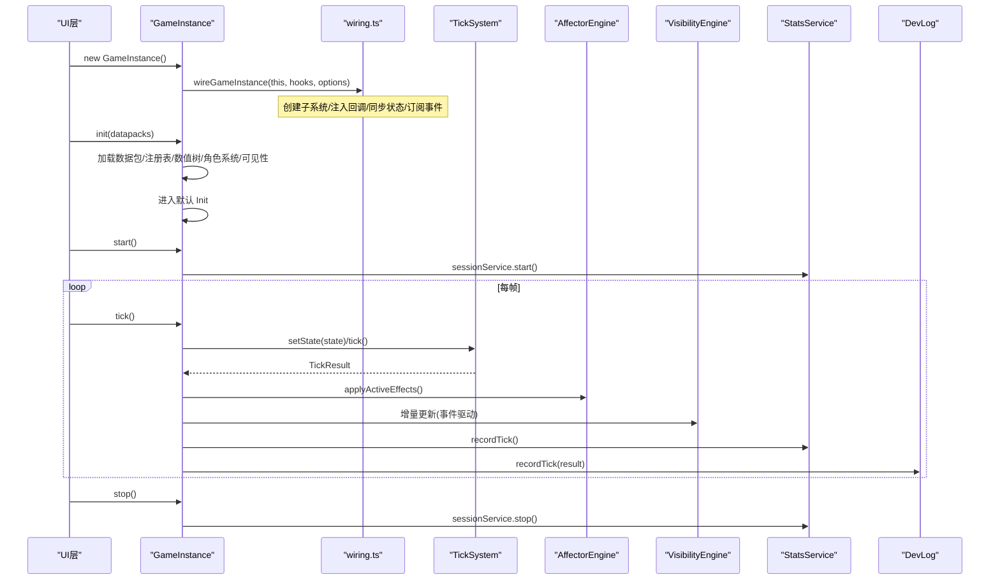
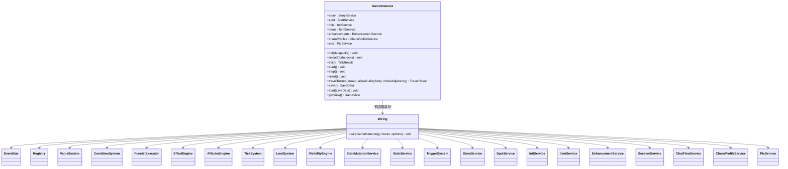
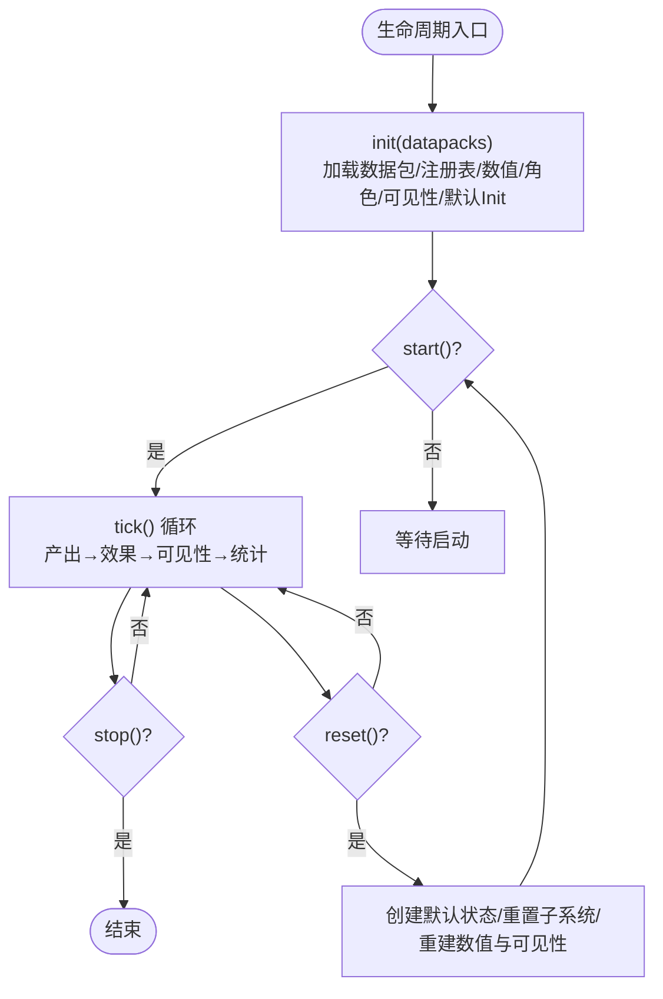
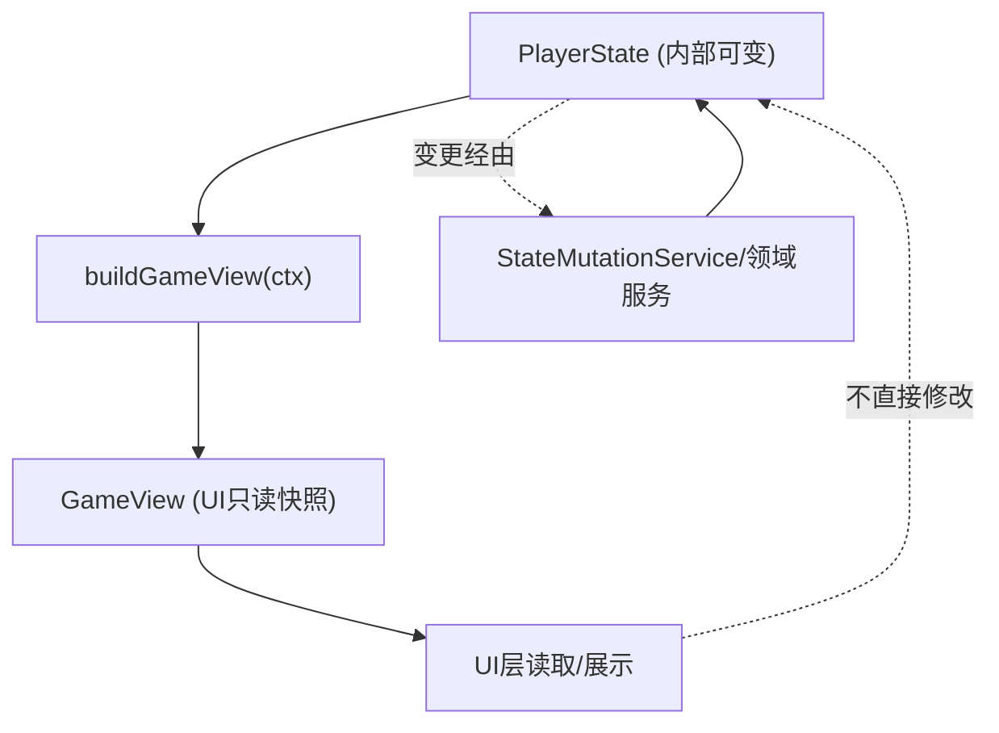
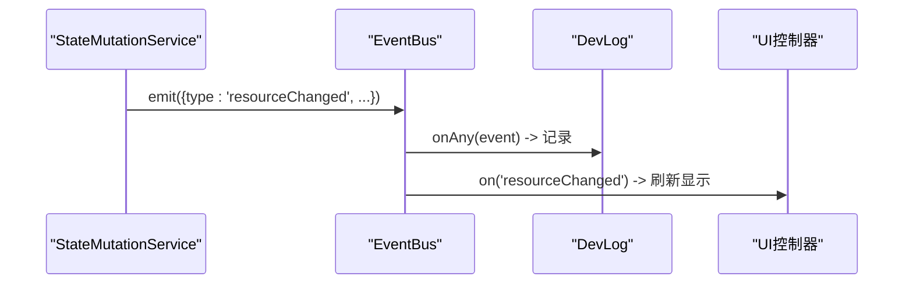
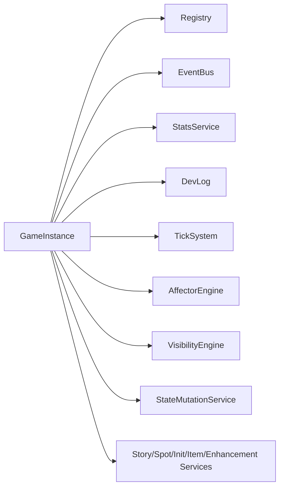

# GameInstance门面模式

<cite>
**本文引用的文件**
- [game-instance.ts](file://src/engine/game-instance.ts)
- [wiring.ts](file://src/engine/game/wiring.ts)
- [state.ts](file://src/engine/types/state.ts)
- [view-builder.ts](file://src/engine/game/view-builder.ts)
- [state-factory.ts](file://src/engine/game/state-factory.ts)
- [event-bus.ts](file://src/engine/core/event-bus.ts)
- [events.ts](file://src/engine/types/events.ts)
- [game-instance.test.ts](file://tests/engine/game-instance.test.ts)
</cite>

## 目录
1. [简介](#简介)
2. [项目结构](#项目结构)
3. [核心组件](#核心组件)
4. [架构总览](#架构总览)
5. [详细组件分析](#详细组件分析)
6. [依赖关系分析](#依赖关系分析)
7. [性能考量](#性能考量)
8. [故障排查指南](#故障排查指南)
9. [结论](#结论)
10. [附录：使用示例与扩展点](#附录使用示例与扩展点)

## 简介
本文件围绕 ACProgram 游戏引擎的 GameInstance 门面模式进行系统化文档化。GameInstance 作为组合根与统一门面，负责装配全部子系统、暴露稳定 API 给 UI 层，并管理游戏生命周期（init/start/stop/reset）、数据访问（不可变视图）以及运行时事件流。通过 wiring.ts 将依赖注入集中管理，确保子系统以受控顺序初始化；通过 state.ts 中的 PlayerState 与 view-builder.ts 构建只读视图，保障状态一致性与可观测性。

## 项目结构
- 门面入口：GameInstance 类位于 engine/game-instance.ts，对外提供统一的子系统访问与生命周期控制。
- 装配器：engine/game/wiring.ts 集中创建与连接所有子系统，GameInstance 构造器仅调用 wireGameInstance。
- 状态与视图：engine/types/state.ts 定义 PlayerState、GameView 等类型；engine/game/view-builder.ts 构建 UI 只读快照。
- 默认状态：engine/game/state-factory.ts 提供 createDefaultState 纯函数。
- 事件系统：engine/core/event-bus.ts 提供 EventBus；engine/types/events.ts 维护事件目录与类型。
- 测试用例：tests/engine/game-instance.test.ts 覆盖初始化、运行、存档、剧情、移动等集成场景。

图表来源
- [game-instance.ts:74-164](file://src/engine/game-instance.ts#L74-L164)
- [wiring.ts:60-287](file://src/engine/game/wiring.ts#L60-L287)
- [state.ts:255-272](file://src/engine/types/state.ts#L255-L272)
- [view-builder.ts:23-57](file://src/engine/game/view-builder.ts#L23-L57)
- [event-bus.ts:9-83](file://src/engine/core/event-bus.ts#L9-L83)
- [state-factory.ts:9-30](file://src/engine/game/state-factory.ts#L9-L30)

章节来源
- [game-instance.ts:74-164](file://src/engine/game-instance.ts#L74-L164)
- [wiring.ts:60-287](file://src/engine/game/wiring.ts#L60-L287)
- [state.ts:255-272](file://src/engine/types/state.ts#L255-L272)
- [view-builder.ts:23-57](file://src/engine/game/view-builder.ts#L23-L57)
- [event-bus.ts:9-83](file://src/engine/core/event-bus.ts#L9-L83)
- [state-factory.ts:9-30](file://src/engine/game/state-factory.ts#L9-L30)

## 核心组件
- GameInstance：组合根与门面，持有所有子系统引用，暴露 init/tick/start/stop/reset/travelToArea/save/load/getView 等 API。
- wiring.ts：装配器，按固定顺序创建子系统、注入回调、同步初始状态、订阅事件。
- PlayerState：运行时状态模型，包含资源、区域、设施等级、库存、故事日志、额外数据等。
- GameView：UI 只读视图，由 buildGameView 从 PlayerState 与可见性、当前剧情、活跃效果、统计快照组装而成。
- EventBus：事件总线，支持 on/off/onAny/emit/flush，用于子系统间解耦通信。
- StateMutationService：统一的状态写入入口，保证统计与失效通知一致性。

章节来源
- [game-instance.ts:74-164](file://src/engine/game-instance.ts#L74-L164)
- [wiring.ts:60-287](file://src/engine/game/wiring.ts#L60-L287)
- [state.ts:35-140](file://src/engine/types/state.ts#L35-L140)
- [state.ts:255-272](file://src/engine/types/state.ts#L255-L272)
- [view-builder.ts:23-57](file://src/engine/game/view-builder.ts#L23-L57)
- [event-bus.ts:9-83](file://src/engine/core/event-bus.ts#L9-L83)

## 架构总览
GameInstance 作为门面，屏蔽了内部子系统的复杂性，向 UI 层提供稳定的接口。wiring.ts 在构造期完成“组合根”职责：创建子系统、建立回调钩子、设置初始状态、注册事件监听。运行时通过 tickSystem 驱动产出与效果应用，通过 affectorEngine 持续生效，通过 visibilityEngine 增量更新可见性，通过 statsService 记录统计，通过 devLog 记录调试信息。

图表来源
- [game-instance.ts:118-124](file://src/engine/game-instance.ts#L118-L124)
- [game-instance.ts:177-229](file://src/engine/game-instance.ts#L177-L229)
- [game-instance.ts:247-262](file://src/engine/game-instance.ts#L247-L262)
- [wiring.ts:60-287](file://src/engine/game/wiring.ts#L60-L287)

章节来源
- [game-instance.ts:118-262](file://src/engine/game-instance.ts#L118-L262)
- [wiring.ts:60-287](file://src/engine/game/wiring.ts#L60-L287)

## 详细组件分析

### GameInstance 门面与子系统装配
- 门面职责：
  - 暴露 story/spot/inits/items/enhancements/charaProfiles/pics 等只读别名，统一访问对应服务。
  - 提供 getView() 返回不可变的 GameView，避免 UI 直接修改 PlayerState。
  - 提供 init/reload/tick/start/stop/reset/travelToArea/save/load 等生命周期与编排方法。
- 装配细节（wiring.ts）：
  - 先创建基础能力：EventBus、Registry、ValueSystem、ConditionSystem、FuncletExecutor。
  - 优先创建 StatsService 与 StateMutationService，使所有写操作经统一入口，保证统计与失效通知一致。
  - 依次创建各业务子系统（Character/Roster/Color/Gacha/PassivePool/SpotFunctionality/Affector/Tick/Trigger/Loot/Visibility/TagStat），并通过回调注入彼此依赖（如 conditionSystem.setStatReader、mutations.setCharacterCatalog）。
  - 创建 Story/Spot/Init/Item/Enhancement/Session/ChatFlow/Pic/CharaProfile 等服务，互相注入依赖与回调（如 travelToArea、getResourceAmount、getVisibility、refreshVisibility）。
  - 最后创建 SessionService，绑定 doTick=GameInstance.tick，形成循环依赖的安全桥接。
  - 设置初始 PlayerState，并同步到 mutations/stats/affector/trigger 等子系统。
  - 订阅 eventBus.onAny，统一记录事件到 DevLog。
  - 启动 ColorUnlockReactor 响应角色差分/flag 变化，自动重算色彩与装备解锁。

图表来源
- [game-instance.ts:74-164](file://src/engine/game-instance.ts#L74-L164)
- [wiring.ts:60-287](file://src/engine/game/wiring.ts#L60-L287)

章节来源
- [game-instance.ts:74-164](file://src/engine/game-instance.ts#L74-L164)
- [wiring.ts:60-287](file://src/engine/game/wiring.ts#L60-L287)

### 生命周期管理：init、start、stop、reset
- init(datapacks)：
  - 加载数据包至 Registry，并加载 affectorPacks 与 triggerDefs。
  - 同步 valueSystem/funcletExecutor/effectEngine/tickSystem 的 state 引用。
  - 构建全局数值树（gameNumSystem.buildAll），重建 tag 统计与被动池索引。
  - 加载角色系统，校验 Character 引用完整性。
  - 重建可见性索引并全量计算，进入无门槛的默认 Init。
- reload(datapacks)：
  - 停止运行、清空注册表与各子系统、重置运行时状态后重新 init，适用于多文件 Mod 替换。
- tick()：
  - 设置 tickSystem 的 state，执行一帧结算（产出、消耗、触发器等）。
  - 应用 Affector 的活跃效果，更新 effectEngine 的 state。
  - 检查对话空间阻断态是否满足解除条件。
  - 增量更新可见性，记录 tick 统计与调试日志。
- start()/stop()：
  - 通过 SessionService 启动/停止 tick 循环（默认 1 tick/秒）。
- reset()：
  - 停止运行、创建默认 PlayerState、重置各子系统状态、重建数值树与可见性。

图表来源
- [game-instance.ts:177-229](file://src/engine/game-instance.ts#L177-L229)
- [game-instance.ts:236-245](file://src/engine/game-instance.ts#L236-L245)
- [game-instance.ts:247-262](file://src/engine/game-instance.ts#L247-L262)
- [game-instance.ts:280-288](file://src/engine/game-instance.ts#L280-L288)
- [game-instance.ts:370-390](file://src/engine/game-instance.ts#L370-L390)

章节来源
- [game-instance.ts:177-262](file://src/engine/game-instance.ts#L177-L262)
- [game-instance.ts:280-390](file://src/engine/game-instance.ts#L280-L390)

### 状态管理与不可变视图
- PlayerState：
  - 包含世界线局部资源、全局资源、设施等级与经理、已解锁强化、当前 Init/Area、库存、标志位、故事日志、额外数据、角色碎片与卡池状态、主题与配色、聊天与冷却、学生对话阻断态等。
  - 字段设计考虑跨世界线保留与兼容旧存档的可选字段。
- 访问控制：
  - GameInstance.state 暴露为 Readonly<PlayerState>，禁止外部直接修改。
  - 所有状态变更必须通过 StateMutationService 或领域服务（如 spot.upgradeSpot、item.useItem），以保证统计、失效通知与可见性正确更新。
- 不可变视图：
  - getView() 调用 buildGameView，从 state、visibility、currentStory、activeAffectors、stats 构建 GameView。
  - 视图对数组与对象进行浅拷贝合并，确保 UI 可安全读取而不影响内部状态。

图表来源
- [state.ts:35-140](file://src/engine/types/state.ts#L35-L140)
- [state.ts:255-272](file://src/engine/types/state.ts#L255-L272)
- [view-builder.ts:23-57](file://src/engine/game/view-builder.ts#L23-L57)
- [game-instance.ts:126-164](file://src/engine/game-instance.ts#L126-L164)

章节来源
- [state.ts:35-140](file://src/engine/types/state.ts#L35-L140)
- [state.ts:255-272](file://src/engine/types/state.ts#L255-L272)
- [view-builder.ts:23-57](file://src/engine/game/view-builder.ts#L23-L57)
- [game-instance.ts:126-164](file://src/engine/game-instance.ts#L126-L164)

### 事件系统与扩展点
- 事件总线：
  - EventBus 支持 on/off/onAny/emit/flush，允许子系统与 UI 解耦通信。
  - wiring.ts 中通过 onAny 将所有事件记录到 DevLog，便于调试与追踪。
- 事件目录：
  - events.ts 维护 EVENT_CATALOG，强制登记每个事件类型的发射方与订阅方模块，新增/删除事件时编译期穷尽检查，避免散落订阅。
- 扩展点：
  - 通过 StateMutationService 与 EffectEngine 的事件机制，可在不侵入核心逻辑的情况下扩展行为（如自定义资源增减、触发器、效果）。
  - 通过 RuntimeEffectReactor 将演出类 op 请求分派到领域服务（color/story/chatFlow），实现可扩展的演出管线。

图表来源
- [event-bus.ts:9-83](file://src/engine/core/event-bus.ts#L9-L83)
- [events.ts:95-122](file://src/engine/types/events.ts#L95-L122)
- [wiring.ts:279-287](file://src/engine/game/wiring.ts#L279-L287)

章节来源
- [event-bus.ts:9-83](file://src/engine/core/event-bus.ts#L9-L83)
- [events.ts:95-122](file://src/engine/types/events.ts#L95-L122)
- [wiring.ts:279-287](file://src/engine/game/wiring.ts#L279-L287)

## 依赖关系分析
- 耦合与内聚：
  - GameInstance 高内聚地聚合子系统，低耦合地向 UI 暴露稳定 API。
  - wiring.ts 集中处理依赖注入，降低构造期复杂度，提高可维护性。
- 直接/间接依赖：
  - GameInstance 直接依赖所有子系统；子系统之间通过回调与事件解耦（如 conditionSystem.setStatReader、mutations.setCharacterCatalog）。
- 外部依赖与集成点：
  - Registry 提供数据定义与查询；EventBus 提供事件通信；StatsService 提供统计；DevLog 提供调试。
- 接口契约：
  - PlayerState/GameView 为稳定契约；wiring.ts 的 WiringHooks 为装配期契约（getState/setState/refreshVisibility）。

图表来源
- [game-instance.ts:74-164](file://src/engine/game-instance.ts#L74-L164)
- [wiring.ts:60-287](file://src/engine/game/wiring.ts#L60-L287)

章节来源
- [game-instance.ts:74-164](file://src/engine/game-instance.ts#L74-L164)
- [wiring.ts:60-287](file://src/engine/game/wiring.ts#L60-L287)

## 性能考量
- 事件驱动的精确失效：
  - tickSystem 的产出求值走事件驱动精确失效（Phase 5），未受影响的 gain 子树跨帧保持缓存，减少重复计算。
- 增量可见性更新：
  - visibilityEngine 不在每帧全量重算，而是通过事件增量更新，提升渲染效率。
- 单写入口：
  - StateMutationService 统一状态写入，保证统计与失效通知一致性，避免分散写导致的性能与一致性风险。
- 数值系统优化：
  - gameNumSystem.buildAll 构建 Resource 的 primitiveGain 树，懒求值减少不必要计算。

[本节为通用性能讨论，不直接分析具体文件]

## 故障排查指南
- 常见问题定位：
  - 使用 getDevLogs/clearDevLogs 查看调试日志，结合 wiring.ts 的 onAny 事件记录快速定位问题。
  - 若资源未增长或增长异常，检查是否通过 StateMutationService 写入，而非直接修改 state。
  - 若可见性不正确，确认是否在必要时机调用 refreshVisibility 或依赖事件驱动更新。
- 事件调试：
  - 通过 EventBus.onAny 订阅所有事件，观察 resourceChanged/tick 等关键事件序列。
  - 利用 EVENT_CATALOG 确认事件的发射方与订阅方是否正确登记。

章节来源
- [game-instance.ts:147-148](file://src/engine/game-instance.ts#L147-L148)
- [wiring.ts:279-287](file://src/engine/game/wiring.ts#L279-L287)
- [events.ts:95-122](file://src/engine/types/events.ts#L95-L122)

## 结论
GameInstance 通过门面模式与组合根设计，将复杂的子系统装配与运行时管理收敛为简洁稳定的 API。wiring.ts 将依赖注入与初始化顺序集中管理，确保子系统以可控方式协作。PlayerState 的访问控制与 GameView 的不可变视图保障了状态一致性与 UI 安全。事件系统与扩展点提供了灵活的定制能力，便于功能扩展与调试。整体架构清晰、可维护性强，适合大规模游戏内容开发与迭代。

[本节为总结性内容，不直接分析具体文件]

## 附录：使用示例与扩展点

### 使用示例（基于测试用例）
- 初始化与默认世界线进入：
  - 参考测试：初始化后 activeInit 指向默认世界线。
  - 路径参考：[game-instance.test.ts:35-45](file://tests/engine/game-instance.test.ts#L35-L45)
- 升级设施与资源消费：
  - 参考测试：升级 spot 并验证资源消耗与等级变化。
  - 路径参考：[game-instance.test.ts:53-64](file://tests/engine/game-instance.test.ts#L53-L64)
- 启动与停止 tick 循环：
  - 参考测试：start/stop 控制 running 状态。
  - 路径参考：[game-instance.test.ts:82-91](file://tests/engine/game-instance.test.ts#L82-L91)
- 生产资源与冻结特性：
  - 参考测试：manager bonus 冻结，输出与无 manager 一致。
  - 路径参考：[game-instance.test.ts:105-129](file://tests/engine/game-instance.test.ts#L105-L129)
- 主动剧情推进与选项：
  - 参考测试：欢迎剧情推进、选项页选择、完成记录与奖励。
  - 路径参考：[game-instance.test.ts:131-177](file://tests/engine/game-instance.test.ts#L131-L177)
- 被动闲聊与奖励：
  - 参考测试：首次完成 +15 青辉石，重复完成 +5。
  - 路径参考：[game-instance.test.ts:212-231](file://tests/engine/game-instance.test.ts#L212-L231)
- 跨世界线资源保留与购买：
  - 参考测试：globalResources 跨 init 保留，购买 init 消耗 global 货币。
  - 路径参考：[game-instance.test.ts:259-294](file://tests/engine/game-instance.test.ts#L259-L294)
- 区域移动与可达性：
  - 参考测试：相邻区域移动、锁定区域拒绝、跨世界线拒绝。
  - 路径参考：[game-instance.test.ts:520-552](file://tests/engine/game-instance.test.ts#L520-L552)
- 存档与加载：
  - 参考测试：save/load 恢复资源与设施等级。
  - 路径参考：[game-instance.test.ts:332-347](file://tests/engine/game-instance.test.ts#L332-L347)
- 重置状态：
  - 参考测试：reset 清除资源与可见性。
  - 路径参考：[game-instance.test.ts:349-355](file://tests/engine/game-instance.test.ts#L349-L355)

### 扩展点与自定义机制
- 通过 StateMutationService 扩展状态变更：
  - 所有状态变更应经 mutations 写入，确保统计与失效通知一致。
  - 路径参考：[wiring.ts:72-77](file://src/engine/game/wiring.ts#L72-L77)
- 通过 EffectEngine 与 TriggerSystem 扩展行为：
  - 在数据包中声明触发器与效果，运行时由 Engine 自动应用。
  - 路径参考：[game-instance.ts:181-184](file://src/engine/game-instance.ts#L181-L184)
- 通过 EventBus 扩展事件处理：
  - 使用 on/onAny 订阅事件，实现 UI 刷新或自定义逻辑。
  - 路径参考：[event-bus.ts:15-35](file://src/engine/core/event-bus.ts#L15-L35)
- 通过 RuntimeEffectReactor 扩展演出管线：
  - 将演出类 op 请求分派到 color/story/chatFlow 等服务。
  - 路径参考：[wiring.ts:269-271](file://src/engine/game/wiring.ts#L269-L271)

章节来源
- [game-instance.test.ts:35-552](file://tests/engine/game-instance.test.ts#L35-L552)
- [wiring.ts:72-77](file://src/engine/game/wiring.ts#L72-L77)
- [game-instance.ts:181-184](file://src/engine/game-instance.ts#L181-L184)
- [event-bus.ts:15-35](file://src/engine/core/event-bus.ts#L15-L35)
- [wiring.ts:269-271](file://src/engine/game/wiring.ts#L269-L271)