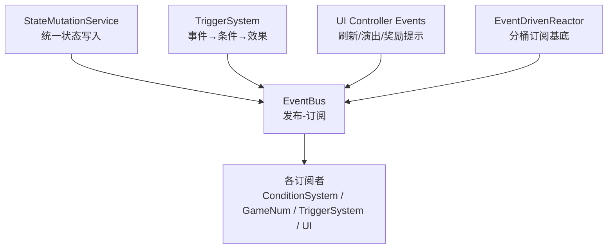
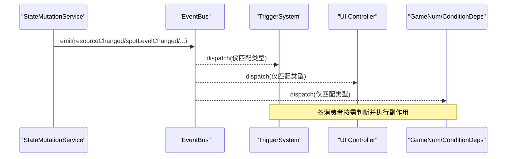
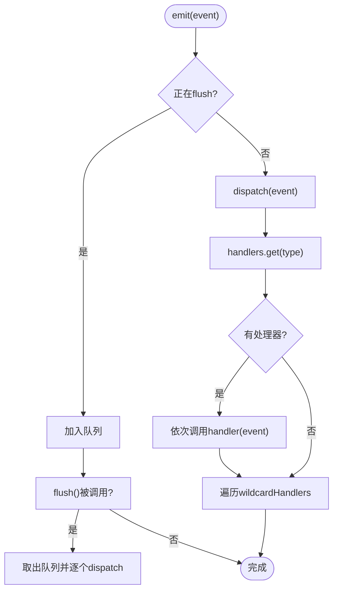
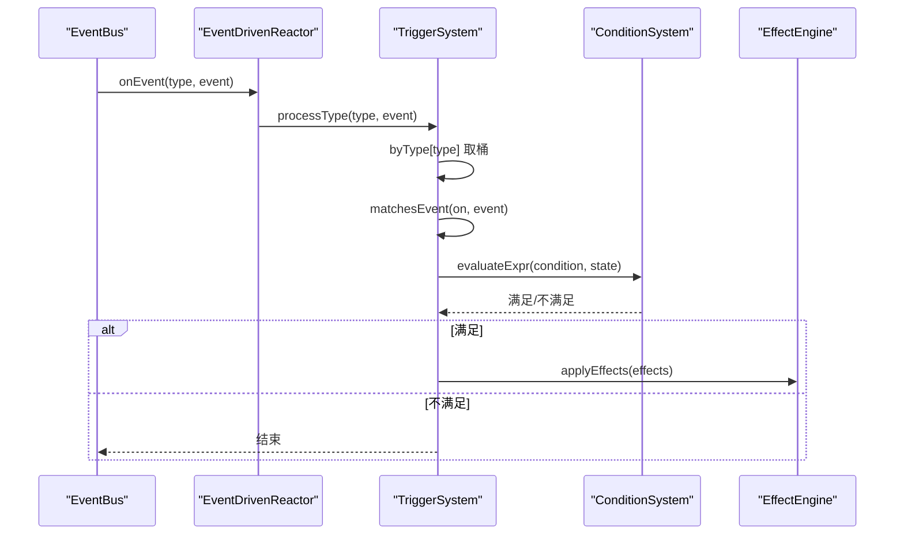
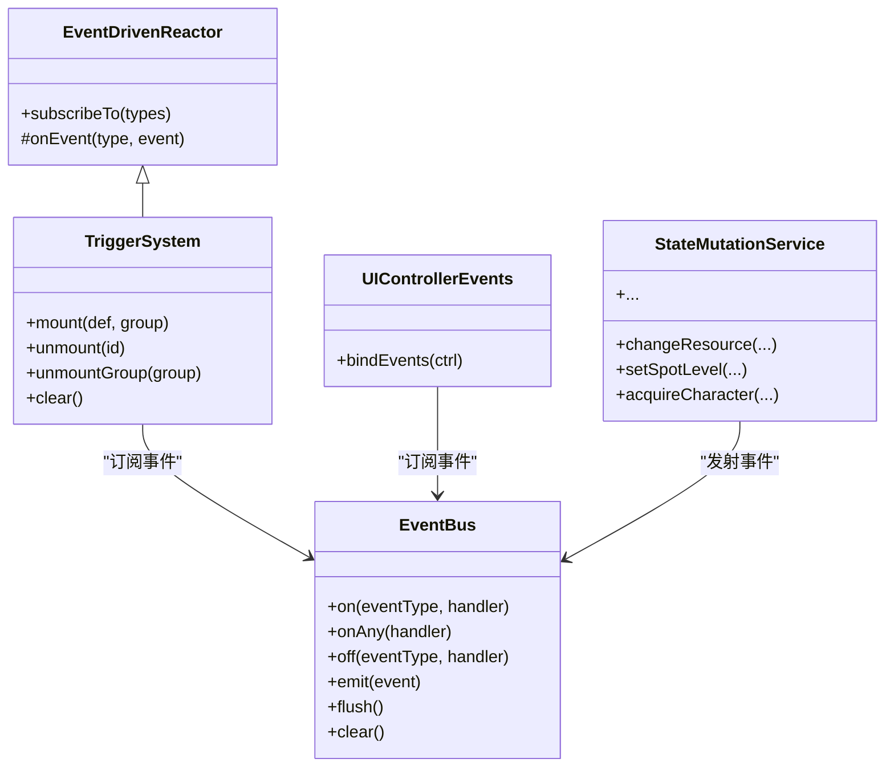

# 事件驱动架构

<cite>
**本文引用的文件**
- [event-bus.ts](file://src/engine/core/event-bus.ts)
- [events.ts](file://src/engine/types/events.ts)
- [event-driven-reactor.ts](file://src/engine/effect/event-driven-reactor.ts)
- [trigger-system.ts](file://src/engine/effect/trigger-system.ts)
- [state-mutation-service.ts](file://src/engine/system/state-mutation-service.ts)
- [controller-events.ts](file://src/ui/controller-events.ts)
- [event-bus.test.ts](file://tests/engine/event-bus.test.ts)
</cite>

## 目录
1. [简介](#简介)
2. [项目结构](#项目结构)
3. [核心组件](#核心组件)
4. [架构总览](#架构总览)
5. [详细组件分析](#详细组件分析)
6. [依赖关系分析](#依赖关系分析)
7. [性能考量](#性能考量)
8. [故障排查指南](#故障排查指南)
9. [结论](#结论)
10. [附录：使用示例与最佳实践](#附录使用示例与最佳实践)

## 简介
本文件面向ACProgram游戏引擎的事件驱动架构，系统性阐述事件总线（EventBus）的发布-订阅机制、事件类型定义系统、监听器注册/触发/移除流程（含同步与批处理）、以及事件在子系统间通信中的作用。文档同时给出自定义事件的扩展方式、典型调用序列图与流程图，并提供性能优化策略与最佳实践，帮助开发者安全高效地使用事件驱动模式。

## 项目结构
围绕事件驱动的核心代码分布在以下位置：
- 事件总线实现：src/engine/core/event-bus.ts
- 运行时事件类型与目录：src/engine/types/events.ts
- 反应器基类（分桶订阅）：src/engine/effect/event-driven-reactor.ts
- 触发器系统（事件→条件→效果）：src/engine/effect/trigger-system.ts
- 统一状态变更入口（发射大量业务事件）：src/engine/system/state-mutation-service.ts
- UI控制器事件绑定（订阅并响应事件）：src/ui/controller-events.ts
- 单元测试（验证总线行为）：tests/engine/event-bus.test.ts

图表来源
- [state-mutation-service.ts:87-101](file://src/engine/system/state-mutation-service.ts#L87-L101)
- [event-bus.ts:9-83](file://src/engine/core/event-bus.ts#L9-L83)
- [trigger-system.ts:49-69](file://src/engine/effect/trigger-system.ts#L49-L69)
- [controller-events.ts:12-88](file://src/ui/controller-events.ts#L12-L88)
- [event-driven-reactor.ts:15-34](file://src/engine/effect/event-driven-reactor.ts#L15-L34)

章节来源
- [event-bus.ts:1-84](file://src/engine/core/event-bus.ts#L1-L84)
- [events.ts:1-167](file://src/engine/types/events.ts#L1-L167)
- [event-driven-reactor.ts:1-35](file://src/engine/effect/event-driven-reactor.ts#L1-L35)
- [trigger-system.ts:1-203](file://src/engine/effect/trigger-system.ts#L1-L203)
- [state-mutation-service.ts:1-566](file://src/engine/system/state-mutation-service.ts#L1-L566)
- [controller-events.ts:1-89](file://src/ui/controller-events.ts#L1-L89)
- [event-bus.test.ts:1-91](file://tests/engine/event-bus.test.ts#L1-L91)

## 核心组件
- EventBus：提供 on/onAny/off/emit/flush/clear 等能力，支持按事件类型分发与通配符订阅，内置队列与 flush 批处理，避免递归派发导致的栈溢出或重复执行。
- GameEvent 类型与目录：集中定义所有运行时事件的结构，并通过 EVENT_CATALOG 强制登记每个事件的发射方与订阅方，保证契约可审计与编译期穷尽检查。
- EventDrivenReactor：为需要事件驱动的子系统提供“声明式依赖 + 分桶订阅”的骨架，禁止 onAny 全量扫描，降低匹配成本。
- TriggerSystem：桥接事件到条件求值与效果执行；通过 ON_KIND_TO_EVENT 将触发器 kind 映射到具体事件类型，并按事件类型分桶精确派发给相关触发器。
- StateMutationService：统一的状态变更入口，所有写操作后 emit 对应事件，并在事件中惰性注入 StatsContext，减少高频事件下的统计快照开销。
- UI Controller Events：订阅引擎事件以驱动界面刷新、演出文本显示、奖励提示等。

章节来源
- [event-bus.ts:9-83](file://src/engine/core/event-bus.ts#L9-L83)
- [events.ts:13-166](file://src/engine/types/events.ts#L13-L166)
- [event-driven-reactor.ts:15-34](file://src/engine/effect/event-driven-reactor.ts#L15-L34)
- [trigger-system.ts:29-69](file://src/engine/effect/trigger-system.ts#L29-L69)
- [state-mutation-service.ts:87-101](file://src/engine/system/state-mutation-service.ts#L87-L101)
- [controller-events.ts:12-88](file://src/ui/controller-events.ts#L12-L88)

## 架构总览
事件驱动架构在引擎中的角色如下：
- 生产者：StateMutationService、TickSystem、SpotService、AffectorEngine、StoryFlow、ChatFlowService 等负责在状态变化或逻辑推进时 emit 事件。
- 总线：EventBus 负责接收事件并分发给订阅者，支持批量 flush 与通配订阅。
- 消费者：TriggerSystem（条件+效果）、GameNum/ConditionDeps（数值/条件失效重算）、ColorUnlockReactor（主题解锁重算）、UI Controller（界面刷新/演出）。

图表来源
- [state-mutation-service.ts:110-135](file://src/engine/system/state-mutation-service.ts#L110-L135)
- [event-bus.ts:47-75](file://src/engine/core/event-bus.ts#L47-L75)
- [trigger-system.ts:125-143](file://src/engine/effect/trigger-system.ts#L125-L143)
- [controller-events.ts:14-88](file://src/ui/controller-events.ts#L14-L88)

## 详细组件分析

### EventBus：发布-订阅与批处理
- 注册：on(eventType, handler) 返回取消函数；onAny(handler) 支持通配订阅。
- 触发：emit(event) 若当前处于 flush 中则入队，否则立即 dispatch。
- 派发：dispatch 先查找该类型的处理器列表，再遍历通配处理器。
- 批处理：flush 将队列内事件全部派发，防止嵌套 emit 导致的问题。
- 清理：clear 清空所有处理器与队列。

图表来源
- [event-bus.ts:47-75](file://src/engine/core/event-bus.ts#L47-L75)
- [event-bus.ts:55-66](file://src/engine/core/event-bus.ts#L55-L66)

章节来源
- [event-bus.ts:9-83](file://src/engine/core/event-bus.ts#L9-L83)
- [event-bus.test.ts:8-90](file://tests/engine/event-bus.test.ts#L8-L90)

### 事件类型定义系统：GameEvent 与 EVENT_CATALOG
- GameEvent 联合类型覆盖资源、设施、剧情、角色、色彩、聊天流等运行时事件，确保类型安全。
- EVENT_CATALOG 强制登记每个事件的用途、发射方模块与订阅方模块，新增/删除事件类型时必须同步更新，否则编译失败。
- 全局兜底：devLog 与 UI 的 onAny 会记录/刷新揭示，但生产高频事件（如 tick、spotProduced）会被跳过以避免无谓刷新。

章节来源
- [events.ts:13-97](file://src/engine/types/events.ts#L13-L97)
- [events.ts:101-166](file://src/engine/types/events.ts#L101-L166)
- [controller-events.ts:14-18](file://src/ui/controller-events.ts#L14-L18)

### 事件监听器的注册、触发与移除
- 注册：
  - 精确订阅：on('eventType', handler)
  - 通配订阅：onAny(handler)，用于日志与揭示刷新等通用逻辑
- 触发：
  - 同步触发：emit 直接 dispatch
  - 批处理触发：flush 将队列中事件统一派发，避免嵌套 emit 问题
- 移除：
  - off(eventType, handler) 移除指定处理器
  - on/onAny 返回取消函数，便于生命周期管理

章节来源
- [event-bus.ts:15-44](file://src/engine/core/event-bus.ts#L15-L44)
- [event-bus.ts:47-66](file://src/engine/core/event-bus.ts#L47-L66)
- [event-bus.test.ts:39-69](file://tests/engine/event-bus.test.ts#L39-L69)

### 事件驱动反应器：EventDrivenReactor
- 设计目标：每个反应器只订阅自己声明依赖的事件类型，禁止 onAny 全量扫描，降低匹配成本。
- 用法：子类通过 subscribeTo(types) 声明依赖，事件到达时由 onEvent(type, event) 处理命中动作。
- 实例：TriggerSystem、VisibilityEngine、AffectorEngine 条件索引等。

章节来源
- [event-driven-reactor.ts:15-34](file://src/engine/effect/event-driven-reactor.ts#L15-L34)

### 触发器系统：事件→条件→效果
- 事件映射：ON_KIND_TO_EVENT 将触发器 kind 映射到具体事件类型，避免全量扫描。
- 分桶：byType 将触发器按事件类型分组，事件到达时仅遍历相关桶。
- 匹配：matchesEvent 根据 on.kind 与参数进行精确匹配（如 resource/resourceId、area/areaId 等）。
- 执行：fire 先标记 once 完成（持久化到状态），再执行 effects。

图表来源
- [trigger-system.ts:49-69](file://src/engine/effect/trigger-system.ts#L49-L69)
- [trigger-system.ts:125-143](file://src/engine/effect/trigger-system.ts#L125-L143)
- [trigger-system.ts:159-201](file://src/engine/effect/trigger-system.ts#L159-L201)

章节来源
- [trigger-system.ts:29-69](file://src/engine/effect/trigger-system.ts#L29-L69)
- [trigger-system.ts:125-201](file://src/engine/effect/trigger-system.ts#L125-L201)

### 状态变更服务：统一事件发射点
- 所有状态修改方法（资源、设施等级、经理、强化、物品、剧情、标签、培养、主题、Extra等）均通过内部 emit 发送事件。
- 事件携带 stats 上下文采用惰性加载，仅在消费方访问时才深拷贝三层统计，显著降低高频事件（tick、resourceChanged）的构建成本。
- 幂等性：多处写入具备幂等保护（如已拥有不重复发事件、同值不改写等）。

章节来源
- [state-mutation-service.ts:87-101](file://src/engine/system/state-mutation-service.ts#L87-L101)
- [state-mutation-service.ts:110-135](file://src/engine/system/state-mutation-service.ts#L110-L135)
- [state-mutation-service.ts:155-196](file://src/engine/system/state-mutation-service.ts#L155-L196)
- [state-mutation-service.ts:231-318](file://src/engine/system/state-mutation-service.ts#L231-L318)
- [state-mutation-service.ts:321-366](file://src/engine/system/state-mutation-service.ts#L321-L366)
- [state-mutation-service.ts:368-418](file://src/engine/system/state-mutation-service.ts#L368-L418)
- [state-mutation-service.ts:420-447](file://src/engine/system/state-mutation-service.ts#L420-L447)
- [state-mutation-service.ts:468-504](file://src/engine/system/state-mutation-service.ts#L468-L504)
- [state-mutation-service.ts:526-554](file://src/engine/system/state-mutation-service.ts#L526-L554)

### UI 控制器：事件驱动界面与演出
- 揭示刷新：onAny 订阅所有事件（跳过 tick/spotProduced），当状态变化时触发揭示条件重评估并反射到UI。
- 奖励排队：storyRewarded/poolGateChanged/storyAreaTraveled 等事件进入 pendingRewardChats，等待渲染时机统一输出。
- 演出文本：chatFlowCleared/chatTextClearedAll/chatTextShown/chatTextCleared 控制聊天流与演出文本显示/清除。
- 剧情节点：storyTriggered/storyCompleted 默认清理演出文本，避免残留。

章节来源
- [controller-events.ts:12-88](file://src/ui/controller-events.ts#L12-L88)

## 依赖关系分析
- EventBus 被多个子系统依赖：TriggerSystem、UI Controller、以及其他反应器。
- TriggerSystem 依赖 ConditionSystem 与 EffectEngine，形成“事件→条件→效果”的链路。
- StateMutationService 作为状态写入门面，向 EventBus 发射事件，下游订阅者据此进行副作用处理。
- EVENT_CATALOG 强制约束事件契约，确保新增/删除事件类型时编译期校验。

图表来源
- [event-bus.ts:9-83](file://src/engine/core/event-bus.ts#L9-L83)
- [event-driven-reactor.ts:15-34](file://src/engine/effect/event-driven-reactor.ts#L15-L34)
- [trigger-system.ts:49-69](file://src/engine/effect/trigger-system.ts#L49-L69)
- [state-mutation-service.ts:87-101](file://src/engine/system/state-mutation-service.ts#L87-L101)
- [controller-events.ts:12-88](file://src/ui/controller-events.ts#L12-L88)

章节来源
- [event-bus.ts:9-83](file://src/engine/core/event-bus.ts#L9-L83)
- [event-driven-reactor.ts:15-34](file://src/engine/effect/event-driven-reactor.ts#L15-L34)
- [trigger-system.ts:49-69](file://src/engine/effect/trigger-system.ts#L49-L69)
- [state-mutation-service.ts:87-101](file://src/engine/system/state-mutation-service.ts#L87-L101)
- [controller-events.ts:12-88](file://src/ui/controller-events.ts#L12-L88)

## 性能考量
- 分桶订阅：EventDrivenReactor 与 TriggerSystem 通过 subscribeTo 与 byType 将事件仅派发给关心的订阅者，避免 O(事件×订阅者) 的全量扫描。
- 批处理 flush：EventBus 在 flush 期间将事件入队，统一派发，避免嵌套 emit 导致的重复执行与栈风险。
- 惰性统计上下文：StateMutationService 对事件 stats 字段采用惰性获取，仅在消费方访问时构造完整 StatsContext，显著降低高频事件（tick、resourceChanged）的开销。
- 幂等事件：多处写入具备幂等保护（如已拥有不重复发事件、同值不改写），减少不必要的事件风暴。
- UI 过滤：UI 控制器在 onAny 中跳过 tick/spotProduced，避免高频生产事件引发频繁揭示刷新。

章节来源
- [event-driven-reactor.ts:15-34](file://src/engine/effect/event-driven-reactor.ts#L15-L34)
- [trigger-system.ts:49-69](file://src/engine/effect/trigger-system.ts#L49-L69)
- [event-bus.ts:47-66](file://src/engine/core/event-bus.ts#L47-L66)
- [state-mutation-service.ts:87-101](file://src/engine/system/state-mutation-service.ts#L87-L101)
- [controller-events.ts:14-18](file://src/ui/controller-events.ts#L14-L18)

## 故障排查指南
- 事件未触发：
  - 确认事件类型是否在 EVENT_CATALOG 中登记，且发射方/订阅方正确。
  - 检查是否使用了正确的 on 或 onAny 订阅，避免误用通配导致性能问题。
- 重复触发：
  - 检查是否有多个订阅者重复处理同一事件，必要时在订阅者内部做幂等判断。
  - 注意 once 语义：TriggerSystem 会在 fire 前标记完成，避免级联事件重复触发。
- 性能瓶颈：
  - 避免在 onAny 中做昂贵计算；UI 已通过跳过 tick/spotProduced 缓解。
  - 关注高频事件（resourceChanged、spotProduced）的订阅者数量与处理逻辑复杂度。
- 批处理问题：
  - 若在事件处理中再次 emit，应确保在 flush 上下文中，避免重复执行；必要时显式调用 flush。

章节来源
- [events.ts:101-166](file://src/engine/types/events.ts#L101-L166)
- [trigger-system.ts:194-201](file://src/engine/effect/trigger-system.ts#L194-L201)
- [controller-events.ts:14-18](file://src/ui/controller-events.ts#L14-L18)
- [event-bus.ts:47-66](file://src/engine/core/event-bus.ts#L47-L66)

## 结论
ACProgram 的事件驱动架构以 EventBus 为核心，结合 EventDrivenReactor 的分桶订阅与 TriggerSystem 的条件-效果链路，实现了高内聚、低耦合的子系统通信机制。通过 EVENT_CATALOG 的契约约束与惰性统计上下文优化，系统在可扩展性与性能之间取得平衡。遵循本文的最佳实践与排障建议，开发者可以安全地扩展事件类型、编写高效的订阅者与反应器，并利用批处理与幂等设计提升整体稳定性。

## 附录：使用示例与最佳实践

### 如何定义自定义事件
- 在 GameEvent 联合类型中添加新的事件分支，包含必要的字段。
- 在 EVENT_CATALOG 中登记该事件的目的、发射方模块与订阅方模块，确保编译期穷尽检查。
- 在合适的状态变更入口（如 StateMutationService）中 emit 该事件。

章节来源
- [events.ts:13-97](file://src/engine/types/events.ts#L13-L97)
- [events.ts:101-166](file://src/engine/types/events.ts#L101-L166)
- [state-mutation-service.ts:87-101](file://src/engine/system/state-mutation-service.ts#L87-L101)

### 如何注册监听器
- 精确订阅：使用 on('eventType', handler) 订阅特定事件。
- 通配订阅：使用 onAny(handler) 用于日志或通用刷新，但需避免昂贵计算。
- 生命周期管理：保存 on/onAny 返回的取消函数，在合适时机调用以移除监听器。

章节来源
- [event-bus.ts:15-35](file://src/engine/core/event-bus.ts#L15-L35)
- [controller-events.ts:12-88](file://src/ui/controller-events.ts#L12-L88)

### 如何触发自定义事件
- 在状态变更或服务逻辑完成后，调用 EventBus.emit(event)。
- 如需批处理，可在关键阶段调用 flush 统一派发队列中的事件。

章节来源
- [event-bus.ts:47-66](file://src/engine/core/event-bus.ts#L47-L66)
- [state-mutation-service.ts:110-135](file://src/engine/system/state-mutation-service.ts#L110-L135)

### 最佳实践
- 优先使用精确订阅而非 onAny，除非确实需要全局观察。
- 在反应器中使用 subscribeTo 声明依赖，避免全量扫描。
- 对高频事件（tick、resourceChanged）的订阅者保持轻量，必要时延迟或合并处理。
- 利用幂等与 once 语义避免重复触发与冗余副作用。
- 通过 EVENT_CATALOG 维护事件契约，新增/删除事件时同步更新。

章节来源
- [event-driven-reactor.ts:15-34](file://src/engine/effect/event-driven-reactor.ts#L15-L34)
- [trigger-system.ts:29-69](file://src/engine/effect/trigger-system.ts#L29-L69)
- [events.ts:101-166](file://src/engine/types/events.ts#L101-L166)
- [controller-events.ts:14-18](file://src/ui/controller-events.ts#L14-L18)