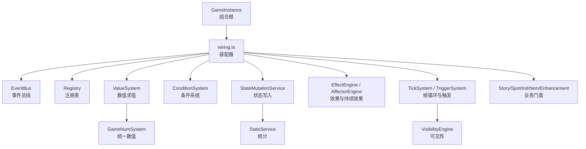
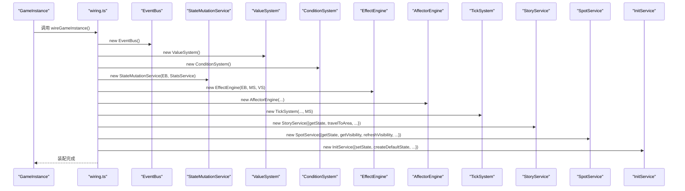
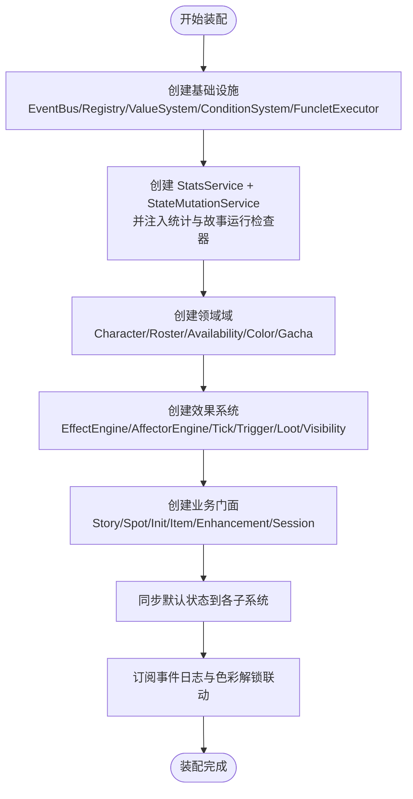
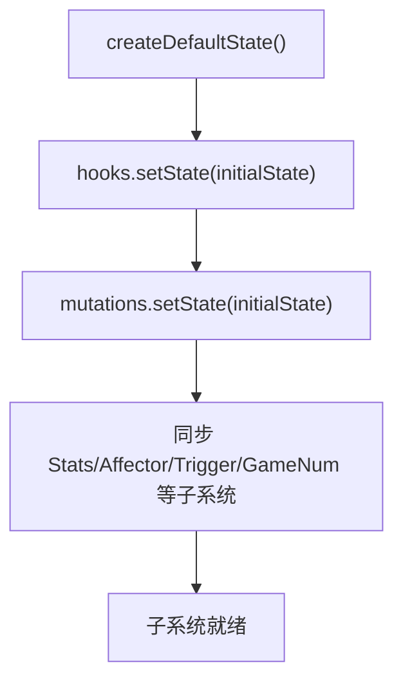

# 子系统装配

<cite>
**本文引用的文件**
- [wiring.ts](file://src/engine/game/wiring.ts)
- [state-factory.ts](file://src/engine/game/state-factory.ts)
- [game-instance.ts](file://src/engine/game-instance.ts)
- [event-bus.ts](file://src/engine/core/event-bus.ts)
- [state-mutation-service.ts](file://src/engine/system/state-mutation-service.ts)
- [value-system.ts](file://src/engine/expression/value-system.ts)
- [dev-log.ts](file://src/engine/core/dev-log.ts)
- [02a-assembly.md](file://docs-824/02a-assembly.md)
</cite>

## 目录
1. [简介](#简介)
2. [项目结构](#项目结构)
3. [核心组件](#核心组件)
4. [架构总览](#架构总览)
5. [详细组件分析](#详细组件分析)
6. [依赖关系与初始化顺序](#依赖关系与初始化顺序)
7. [状态工厂模式](#状态工厂模式)
8. [配置传递与参数注入](#配置传递与参数注入)
9. [循环依赖处理策略](#循环依赖处理策略)
10. [如何添加新子系统](#如何添加新子系统)
11. [性能考量](#性能考量)
12. [故障排除指南](#故障排除指南)
13. [接口标准化与向后兼容](#接口标准化与向后兼容)
14. [结论](#结论)

## 简介
本文件面向 ACProgram 游戏引擎的“子系统装配机制”，聚焦 wiring.ts 中的依赖注入容器实现、子系统间的依赖关系与初始化顺序、状态工厂模式的默认状态创建与重置、装配过程中的配置传递与参数注入、循环依赖的处理策略，以及如何在现有装配流程中安全地添加新子系统。文档同时提供调试与排障建议，并说明子系统接口的标准化设计与向后兼容性保证。

## 项目结构
- 组合根：GameInstance 负责对外暴露统一 API，内部通过 wiring.ts 完成子系统装配与回调接线。
- 装配器：wiring.ts 集中创建子系统、建立依赖引用、注入回调钩子、同步初始状态、订阅事件。
- 基础设施：EventBus、Registry、ValueSystem、ConditionSystem、FuncletExecutor 等基础能力在早期阶段构建。
- 领域服务：StoryService、SpotService、InitService、ItemService、EnhancementService、SessionService 等高层门面依赖底层系统。
- 运行时状态：StateMutationService 作为唯一写入口，配合 StatsService 记录统计并通过 EventBus 广播变更。
- 表达式与数值：ValueSystem、GameNumSystem、ConditionSystem 提供条件与数值求值能力。
- 效果与触发：EffectEngine、AffectorEngine、TriggerSystem、VisibilityEngine、TickSystem 协同驱动运行时行为。

图表来源
- [wiring.ts:61-287](file://src/engine/game/wiring.ts#L61-L287)
- [game-instance.ts:74-124](file://src/engine/game-instance.ts#L74-L124)

章节来源
- [wiring.ts:61-287](file://src/engine/game/wiring.ts#L61-L287)
- [game-instance.ts:74-124](file://src/engine/game-instance.ts#L74-L124)

## 核心组件
- 事件总线（EventBus）：类型化事件注册/派发，支持通配处理器与批量 flush，避免嵌套派发导致的栈溢出。
- 状态写入（StateMutationService）：所有 PlayerState 修改的统一入口，写后记录统计、发射事件；提供 Extra 读取器与角色差分目录读取器的注入点。
- 数值与条件（ValueSystem / ConditionSystem / GameNumSystem）：表达式求值、条件判断、统一数值树构建与失效重算。
- 效果与触发（EffectEngine / AffectorEngine / TriggerSystem）：运行时效果执行、持续效果挂载与应用、触发器加载与响应。
- 业务门面（Story/Spot/Init/Item/Enhancement/Session）：封装领域操作，依赖底层系统并提供高层 API。
- 可见性与统计（VisibilityEngine / StatsService / TagStatService）：可见性快照计算与增量更新、全局/世界线/会话三层统计。

章节来源
- [event-bus.ts:9-83](file://src/engine/core/event-bus.ts#L9-L83)
- [state-mutation-service.ts:41-101](file://src/engine/system/state-mutation-service.ts#L41-L101)
- [value-system.ts:88-149](file://src/engine/expression/value-system.ts#L88-L149)
- [wiring.ts:61-287](file://src/engine/game/wiring.ts#L61-L287)

## 架构总览
wiring.ts 是装配中心，按依赖顺序创建子系统，并通过回调钩子将宿主（GameInstance）的状态访问与刷新能力注入到各子系统。关键路径包括：
- 先建基础设施（EventBus、Registry、ValueSystem、ConditionSystem、FuncletExecutor）。
- 再建写入口与统计（StatsService、StateMutationService），并给 ConditionSystem 接入统计与故事运行检查器。
- 构建领域域（Character/Roster/Availability/Color/Gacha）与效果系统（Effect/Affector/Tick/Trigger/Loot/Visibility）。
- 组装业务门面（Story/Spot/Init/Item/Enhancement/Session），并将它们互相依赖的能力以回调形式注入。
- 最后同步默认状态到各子系统，并开启事件日志与色彩解锁联动。

图表来源
- [wiring.ts:61-287](file://src/engine/game/wiring.ts#L61-L287)
- [game-instance.ts:118-124](file://src/engine/game-instance.ts#L118-L124)

## 详细组件分析

### 依赖注入容器（wiring.ts）
- 职责：集中创建子系统、建立依赖引用、注入回调钩子、同步初始状态、订阅事件。
- 设计要点：
  - 使用可变视图 GameInstanceMutable 在装配期对宿主字段赋值，运行期保持只读约束。
  - 通过 WiringHooks 注入 getState/setState/refreshVisibility，避免直接耦合私有成员。
  - 通过 setXxxReader/Checker 等方式向 ConditionSystem/ValueSystem/Mutations 注入外部能力，解耦具体实现。
  - 将事件日志与 DevLog 接入 AffectorEngine，便于追踪装配后的运行时行为。

图表来源
- [wiring.ts:61-287](file://src/engine/game/wiring.ts#L61-L287)
- [02a-assembly.md:5-23](file://docs-824/02a-assembly.md#L5-L23)

章节来源
- [wiring.ts:61-287](file://src/engine/game/wiring.ts#L61-L287)
- [02a-assembly.md:5-23](file://docs-824/02a-assembly.md#L5-L23)

### 事件总线（EventBus）
- 特性：类型化 on/off、onAny 通配监听、emit 队列化与 flush，防止递归派发导致的问题。
- 在装配中的作用：作为子系统间松耦合通信的基础设施，wiring 中多处通过 eventBus 连接子系统。

章节来源
- [event-bus.ts:9-83](file://src/engine/core/event-bus.ts#L9-L83)

### 状态写入（StateMutationService）
- 统一写入口：所有状态变更必须经过此服务，确保统计记录与事件广播的一致性。
- 注入点：setExtraReader、setCharacterCatalog，使写层能读取 Extra 与角色差分定义。
- 事件模型：每个 mutation 写状态 → 记录统计 → 发射事件，事件携带惰性计算的统计上下文。

章节来源
- [state-mutation-service.ts:41-101](file://src/engine/system/state-mutation-service.ts#L41-L101)
- [state-mutation-service.ts:110-197](file://src/engine/system/state-mutation-service.ts#L110-L197)
- [state-mutation-service.ts:231-366](file://src/engine/system/state-mutation-service.ts#L231-L366)
- [state-mutation-service.ts:368-566](file://src/engine/system/state-mutation-service.ts#L368-L566)

### 数值与条件（ValueSystem / ConditionSystem / GameNumSystem）
- ValueSystem：表达式求值，支持常量、资源、区域/设施计数、函数片段（funclet）、数据源（extra）等。
- ConditionSystem：条件求值，接入 tagIndex、tagCountReader、storyRunChecker、storyChainChecker 等读取器。
- GameNumSystem：统一数值树构建与失效重算，依赖 valueSystem、registry、characterSystem、affectorEngine、eventBus。

章节来源
- [value-system.ts:88-149](file://src/engine/expression/value-system.ts#L88-L149)
- [wiring.ts:145-176](file://src/engine/game/wiring.ts#L145-L176)

### 效果与触发（EffectEngine / AffectorEngine / TriggerSystem / TickSystem）
- EffectEngine：运行时效果执行，依赖 eventBus、mutations、valueSystem。
- AffectorEngine：持续效果挂载与应用，依赖 registry、conditionSystem、mutations、eventBus、effectEngine、spotFunctionalitySystem。
- TriggerSystem：触发器加载与响应，依赖 eventBus、conditionSystem、effectEngine。
- TickSystem：帧循环驱动，依赖 registry、valueSystem、eventBus、gameNumSystem、mutations。

章节来源
- [wiring.ts:96-164](file://src/engine/game/wiring.ts#L96-L164)

### 业务门面（Story/Spot/Init/Item/Enhancement/Session）
- StoryService：剧情推进、跳转链检查、被动闲聊池集成，依赖 conditionSystem、effectEngine、mutations、eventBus、passivePools、getState、travelToArea。
- SpotService：设施管理、产出、tag 增撤、可见性刷新，依赖 registry、valueSystem、conditionSystem、mutations、effectEngine、characterSystem、affectorEngine、eventBus、devLog、getState、getVisibility、refreshVisibility、getResourceAmount。
- InitService：世界线进入/切换、默认状态创建、可见性重置、tick 时间戳触达，依赖 registry、conditionSystem、effectEngine、mutations、statsService、eventBus、devLog、storyService、triggerSystem、affectorEngine、visibilityEngine、getState、getVisibility、setState、resetVisibility、clearLocalVisibility、refreshVisibility、stop、createDefaultState、touchTickTimestamp。
- ItemService：物品发放/使用/掉落表，依赖 registry、mutations、conditionSystem、effectEngine、lootSystem、devLog、getState。
- EnhancementService：强化购买/移除/诊断，依赖 registry、mutations、conditionSystem、effectEngine、affectorEngine、devLog、getState、getVisibility、refreshVisibility、recheckAllAffectors、getResourceAmount。
- SessionService：会话生命周期、tick 调度、事件与效果引擎集成，依赖 doTick、devLog、eventBus、effectEngine、getState。

章节来源
- [wiring.ts:181-268](file://src/engine/game/wiring.ts#L181-L268)

## 依赖关系与初始化顺序
- 顺序原则：先建最底层被依赖项（事件、注册表、表达式、条件、函数片段执行器），再建写入口与统计，随后构建领域域与效果系统，最后组装业务门面。
- 关键依赖：
  - ConditionSystem 需要 statsService 的统计读取与故事运行检查器。
  - AffectorEngine 依赖 spotFunctionalitySystem 与 effectEngine。
  - GameNumSystem 依赖 affectorEngine 与 characterSystem。
  - StoryService 需要 passivePools 与 travelToArea 回调。
  - InitService 需要 setState 回调并在状态替换时重建数值树。
- 装配完成后同步默认状态到各子系统，确保所有系统持有同一份状态引用。

章节来源
- [02a-assembly.md:5-23](file://docs-824/02a-assembly.md#L5-L23)
- [wiring.ts:61-287](file://src/engine/game/wiring.ts#L61-L287)

## 状态工厂模式
- 默认状态创建：state-factory.ts 提供纯函数 createDefaultState，生成空的资源、等级、库存、标志、故事日志、额外数据等初始结构。
- 使用位置：wiring.ts 在装配末尾创建默认状态并通过 hooks.setState 与 mutations.setState 同步到宿主与写入口；init-service 也通过 createDefaultState 提供新建世界线的默认状态。
- 状态重置：GameInstance.reset 使用 resetRuntime 工具，结合 createDefaultState 与 setState 回调，重建数值树并重置各子系统状态。

图表来源
- [state-factory.ts:9-30](file://src/engine/game/state-factory.ts#L9-L30)
- [wiring.ts:272-278](file://src/engine/game/wiring.ts#L272-L278)
- [game-instance.ts:370-390](file://src/engine/game-instance.ts#L370-L390)

章节来源
- [state-factory.ts:9-30](file://src/engine/game/state-factory.ts#L9-L30)
- [wiring.ts:272-278](file://src/engine/game/wiring.ts#L272-L278)
- [game-instance.ts:370-390](file://src/engine/game-instance.ts#L370-L390)

## 配置传递与参数注入
- 回调钩子：WiringHooks 提供 getState/setState/refreshVisibility，供各子系统在运行时访问宿主状态与刷新可见性。
- 读取器注入：
  - ValueSystem.setExtraReader：统一读取 Extra 三层合并视图。
  - ConditionSystem.setTagIndex / setTagCountReader / setStoryRunChecker / setStoryChainChecker：为条件系统提供 tag 索引、收集数、故事运行与跳转链检查能力。
  - StateMutationService.setExtraReader / setCharacterCatalog：为写层提供生效值读取与角色差分目录解析。
- 服务间依赖注入：
  - StoryService 接收 travelToArea 回调，用于剧情内移动。
  - InitService 接收 setState、createDefaultState、resetVisibility、clearLocalVisibility、refreshVisibility、stop、touchTickTimestamp 等回调。
  - SpotService/EnhancementService 接收 getVisibility/refreshVisibility/getResourceAmount/recheckAllAffectors 等回调。
- 事件与日志：
  - EventBus.onAny 订阅所有事件并记录到 DevLog，便于追踪装配后的运行时行为。
  - AffectorEngine.devLog 指向 DevLog，用于数据包校验警告与运行时提示。

章节来源
- [wiring.ts:61-287](file://src/engine/game/wiring.ts#L61-L287)
- [value-system.ts:91-109](file://src/engine/expression/value-system.ts#L91-L109)
- [state-mutation-service.ts:53-75](file://src/engine/system/state-mutation-service.ts#L53-L75)
- [dev-log.ts:39-68](file://src/engine/core/dev-log.ts#L39-L68)

## 循环依赖处理策略
- 回调注入：通过传入回调（如 travelToArea、getState、getVisibility、refreshVisibility、getResourceAmount）而非直接引用对象，打破循环依赖。
- 延迟绑定：在装配后期才设置某些读取器（如 setTagIndex、setTagCountReader、setStoryRunChecker、setStoryChainChecker），确保依赖方已就绪。
- 事件驱动：子系统间通过 EventBus 通信，避免强耦合的直接调用链。
- 单向依赖：例如 GameNum → Affector 单向；Affector 侧经事件通知重同步，避免反向依赖。

章节来源
- [wiring.ts:145-176](file://src/engine/game/wiring.ts#L145-L176)
- [wiring.ts:181-268](file://src/engine/game/wiring.ts#L181-L268)
- [event-bus.ts:46-75](file://src/engine/core/event-bus.ts#L46-L75)

## 如何添加新子系统
步骤建议：
1. 定义子系统接口与职责，尽量通过回调或读取器注入依赖，避免直接引用其他子系统实例。
2. 在 wiring.ts 中按依赖顺序创建子系统实例，并将其依赖通过构造函数或 setter 注入。
3. 若子系统需要访问宿主状态或刷新可见性，通过 WiringHooks 提供的回调获取。
4. 若子系统需要参与事件流，使用 EventBus 订阅或发射事件。
5. 在装配末尾同步默认状态到子系统（如需）。
6. 在 DevLog 中记录关键事件，便于调试。

示例路径（不展示代码内容）：
- 创建子系统实例与依赖注入：[wiring.ts:61-287](file://src/engine/game/wiring.ts#L61-L287)
- 通过回调注入宿主能力：[wiring.ts:181-268](file://src/engine/game/wiring.ts#L181-L268)
- 同步默认状态：[wiring.ts:272-278](file://src/engine/game/wiring.ts#L272-L278)
- 事件日志记录：[dev-log.ts:39-68](file://src/engine/core/dev-log.ts#L39-L68)

章节来源
- [wiring.ts:61-287](file://src/engine/game/wiring.ts#L61-L287)
- [dev-log.ts:39-68](file://src/engine/core/dev-log.ts#L39-L68)

## 性能考量
- 事件队列化：EventBus 在派发期间将事件入队，flush 时批量处理，避免递归派发导致的栈溢出与重复处理。
- 惰性统计上下文：StateMutationService 在事件中懒拷贝 StatsContext，仅在消费方访问时构建，减少高频事件的性能开销。
- 数值树缓存：GameNumSystem 每帧构建/失效重算，未受影响的 gain 子树跨帧保持缓存，提升生产求值效率。
- 可见性增量更新：VisibilityEngine 由事件驱动增量更新，不在每帧全量重算。
- 日志节流：DevLog 在非 verbose 模式下对 tick 生产汇总进行节流记录，减少 UI 压力。

章节来源
- [event-bus.ts:46-75](file://src/engine/core/event-bus.ts#L46-L75)
- [state-mutation-service.ts:87-101](file://src/engine/system/state-mutation-service.ts#L87-L101)
- [game-instance.ts:247-262](file://src/engine/game-instance.ts#L247-L262)
- [dev-log.ts:158-168](file://src/engine/core/dev-log.ts#L158-L168)

## 故障排除指南
常见问题与定位方法：
- 子系统未收到事件：检查 EventBus 是否正确订阅，确认 emit 是否在 flushing 期间被入队，必要时调用 flush。
- 状态未同步：确认 wiring.ts 末尾是否调用了 hooks.setState 与 mutations.setState，并确保各子系统已设置 state。
- 条件求值为 0：检查 ValueSystem 的 extraReader 与 ConditionSystem 的 tagIndex/tagCountReader/storyRunChecker/storyChainChecker 是否已正确注入。
- 数值树异常：确认 init 或 reload 后是否调用了 gameNumSystem.buildAll(state)，并在 setState 时重建。
- 可见性未更新：确认 visibilityEngine.rebuild/recomputeAll 是否在合适时机调用，且事件驱动链路正常。
- 日志缺失：检查 DevLog 是否启用 verbose 模式，确认 eventBus.onAny 已订阅并记录事件。

章节来源
- [event-bus.ts:46-75](file://src/engine/core/event-bus.ts#L46-L75)
- [wiring.ts:272-283](file://src/engine/game/wiring.ts#L272-L283)
- [value-system.ts:91-109](file://src/engine/expression/value-system.ts#L91-L109)
- [game-instance.ts:177-229](file://src/engine/game-instance.ts#L177-L229)
- [dev-log.ts:39-68](file://src/engine/core/dev-log.ts#L39-L68)

## 接口标准化与向后兼容
- 子系统接口标准化：
  - 通过 WiringHooks 统一宿主状态访问与可见性刷新接口。
  - 通过 setXxxReader/Checker 统一注入外部能力，避免硬编码依赖。
  - 通过 EventBus 统一事件模型，确保子系统间通信一致。
- 向后兼容保证：
  - 新增读取器或回调时，采用可选参数或默认实现，避免破坏已有调用方。
  - 事件模型扩展时，保持旧事件字段不变，新增字段可选。
  - 状态结构扩展时，使用可选字段与默认值，确保旧存档可恢复。
  - 数据包加载时忽略废弃字段（如 characterBonuses），并发出警告。

章节来源
- [wiring.ts:50-58](file://src/engine/game/wiring.ts#L50-L58)
- [wiring.ts:145-176](file://src/engine/game/wiring.ts#L145-L176)
- [game-instance.ts:201-212](file://src/engine/game-instance.ts#L201-L212)

## 结论
wiring.ts 作为 ACProgram 引擎的装配中心，通过严格的依赖顺序、回调注入与事件驱动，实现了子系统间的松耦合与高内聚。状态工厂模式确保了默认状态的创建与重置一致性，配置传递与参数注入机制保证了子系统在运行时能灵活访问宿主能力与外部数据。通过事件总线与延迟绑定，系统有效避免了循环依赖问题。遵循本文档的装配规范与排障建议，开发者可以安全地扩展引擎功能并保持向后兼容。