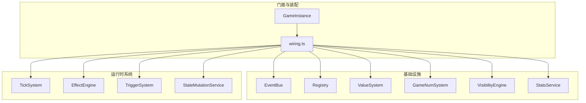
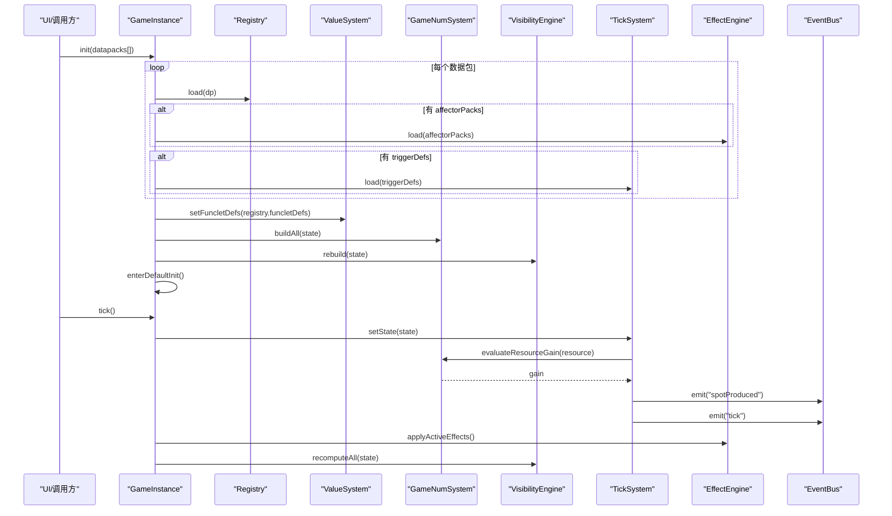
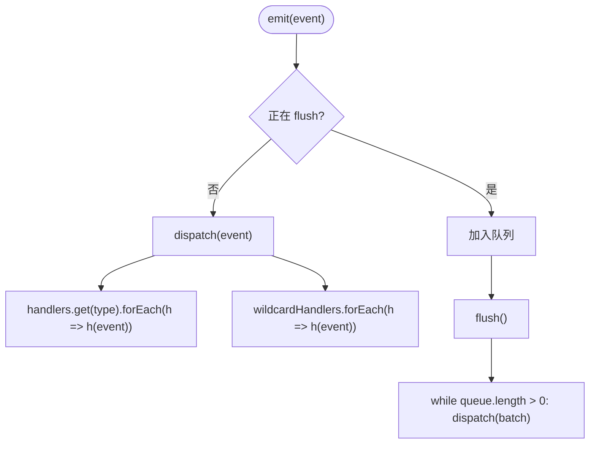
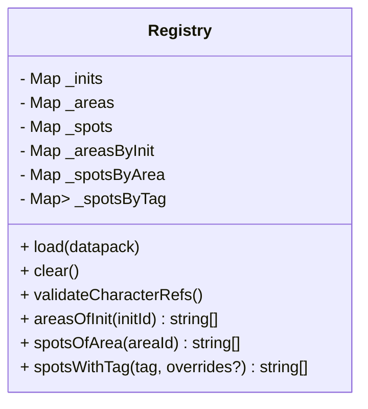
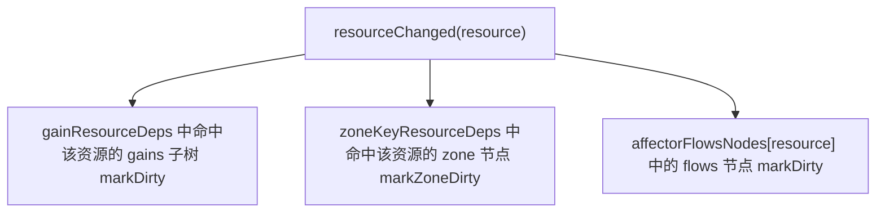
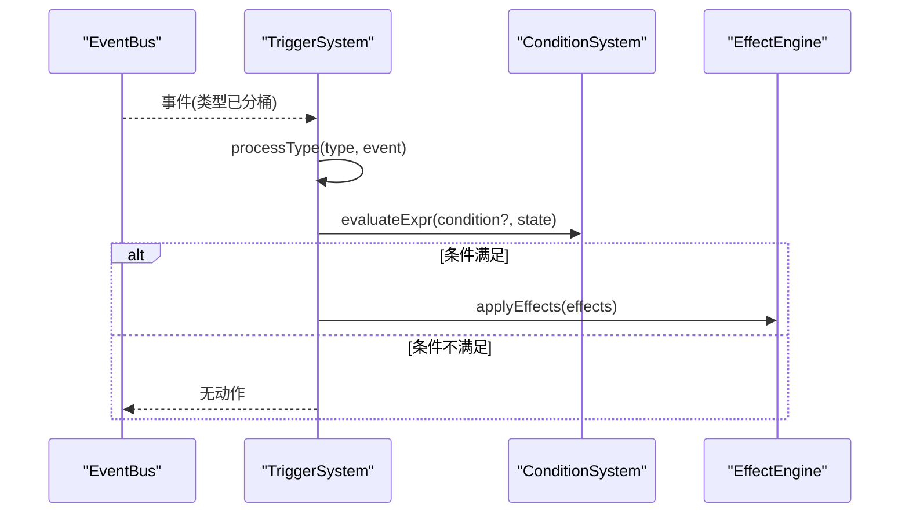
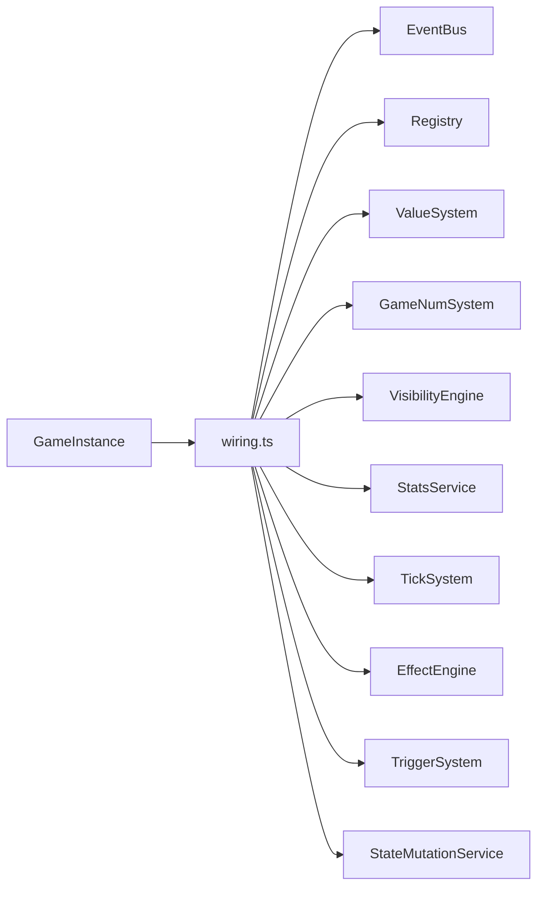

# 核心引擎架构

<cite>
**本文引用的文件**
- [src/engine/game-instance.ts](file://src/engine/game-instance.ts)
- [src/engine/game/wiring.ts](file://src/engine/game/wiring.ts)
- [src/engine/core/event-bus.ts](file://src/engine/core/event-bus.ts)
- [src/engine/types/events.ts](file://src/engine/types/events.ts)
- [src/engine/registry/registry.ts](file://src/engine/registry/registry.ts)
- [src/engine/system/tick-system.ts](file://src/engine/system/tick-system.ts)
- [src/engine/effect/effect-engine.ts](file://src/engine/effect/effect-engine.ts)
- [src/engine/expression/value-system.ts](file://src/engine/expression/value-system.ts)
- [src/engine/expression/game-num.ts](file://src/engine/expression/game-num.ts)
- [src/engine/effect/trigger-system.ts](file://src/engine/effect/trigger-system.ts)
- [src/engine/effect/event-driven-reactor.ts](file://src/engine/effect/event-driven-reactor.ts)
- [src/engine/visibility/visibility-engine.ts](file://src/engine/visibility/visibility-engine.ts)
- [src/engine/stats/stats.ts](file://src/engine/stats/stats.ts)
</cite>

## 目录
1. [简介](#简介)
2. [项目结构](#项目结构)
3. [核心组件](#核心组件)
4. [架构总览](#架构总览)
5. [详细组件分析](#详细组件分析)
6. [依赖关系分析](#依赖关系分析)
7. [性能考量](#性能考量)
8. [故障排查指南](#故障排查指南)
9. [结论](#结论)
10. [附录：扩展与自定义机制](#附录：扩展与自定义机制)

## 简介
本文件面向 ACProgram 游戏引擎的核心架构，聚焦以下目标：
- 以 GameInstance 为门面模式与组合根，解释子系统装配、生命周期管理与对外 API。
- 文档化 EventBus 事件驱动架构（发布订阅、事件类型、监听器管理）。
- 说明 Registry 注册表的数据组织、对象注册、引用校验与索引构建。
- 描述各子系统依赖关系与初始化顺序（ValueSystem、EffectEngine、TickSystem 等）。
- 提供架构图与交互流程图，帮助理解整体结构与数据流向。
- 给出扩展点与自定义机制的使用指南。

## 项目结构
引擎位于 src/engine 下，按职责分层组织：
- core：基础设施（EventBus、DevLog、Tag 工具等）
- types：类型定义与事件契约（含 EVENT_CATALOG）
- registry：数据包加载、合并、校验与索引
- expression：数值表达式求值（ValueSystem、GameNumSystem）
- effect：效果执行与触发系统（EffectEngine、TriggerSystem、EventDrivenReactor）
- system：领域系统（TickSystem、StateMutationService、角色/颜色/抽卡等）
- visibility：可见性引擎（事件驱动增量更新）
- stats：三层统计数据服务
- game：门面与服务装配（wiring、story/spot/init/item/enhancement/session 等服务）
- image/pics：图片资源存储与解析

图表来源
- [src/engine/game-instance.ts:74-113](file://src/engine/game-instance.ts#L74-L113)
- [src/engine/game/wiring.ts:61-287](file://src/engine/game/wiring.ts#L61-L287)

章节来源
- [src/engine/game-instance.ts:74-113](file://src/engine/game-instance.ts#L74-L113)
- [src/engine/game/wiring.ts:61-287](file://src/engine/game/wiring.ts#L61-L287)

## 核心组件
- GameInstance：门面与组合根，持有全部子系统实例，暴露 init/tick/save/load/reset 等统一入口，并提供 story/spot/items/enhancements 等只读门面。
- EventBus：事件总线，支持 on/off/onAny/emit/flush，内部队列防重入，保证批量派发一致性。
- Registry：注册表，负责数据包加载、合并、索引构建（areasByInit、spotsByArea、spotsByTag 等），以及跨包引用完整性校验。
- ValueSystem：表达式求值器，支持常量、资源、区域/设施计数、函数片段（funclet）、数学运算与 clamp/floor/ceil/round 等。
- GameNumSystem：数值树宿主，维护 gains/zoneIndex/parents/allNodes/flows 等索引，实现资源级产出聚合与精确失效（Phase 5/6）。
- EffectEngine：效果执行引擎，将声明式效果转为状态变更或运行时请求事件（主题/剧情/聊天流）。
- TriggerSystem：触发器系统，基于事件分桶匹配 + 条件求值 + 效果执行，支持 once 语义与分组挂载/卸载。
- VisibilityEngine：可见性引擎，事件驱动增量标脏与按需重算，提供 isXxxVisible 实时查询。
- StatsService：三层统计（global/init/session），在 mutation 路径同步记录，提供快照与 DSL 查询。
- StateMutationService：统一状态写入入口，所有写操作均通过此服务完成并 emit 事件。

章节来源
- [src/engine/game-instance.ts:74-113](file://src/engine/game-instance.ts#L74-L113)
- [src/engine/core/event-bus.ts:9-83](file://src/engine/core/event-bus.ts#L9-L83)
- [src/engine/registry/registry.ts:59-320](file://src/engine/registry/registry.ts#L59-L320)
- [src/engine/expression/value-system.ts:88-149](file://src/engine/expression/value-system.ts#L88-L149)
- [src/engine/expression/game-num.ts:52-140](file://src/engine/expression/game-num.ts#L52-L140)
- [src/engine/effect/effect-engine.ts:16-64](file://src/engine/effect/effect-engine.ts#L16-L64)
- [src/engine/effect/trigger-system.ts:49-203](file://src/engine/effect/trigger-system.ts#L49-L203)
- [src/engine/visibility/visibility-engine.ts:19-122](file://src/engine/visibility/visibility-engine.ts#L19-L122)
- [src/engine/stats/stats.ts:47-263](file://src/engine/stats/stats.ts#L47-L263)
- [src/engine/system/state-mutation-service.ts:41-101](file://src/engine/system/state-mutation-service.ts#L41-L101)

## 架构总览
GameInstance 作为门面与组合根，在 wiring.ts 中集中创建并装配所有子系统，建立回调钩子与事件订阅，随后暴露统一的 init/tick/save/load/reset 接口。事件总线贯穿全引擎，驱动可见性、数值、触发器、统计等系统的联动。

图表来源
- [src/engine/game-instance.ts:177-229](file://src/engine/game-instance.ts#L177-L229)
- [src/engine/game-instance.ts:247-262](file://src/engine/game-instance.ts#L247-L262)
- [src/engine/system/tick-system.ts:44-61](file://src/engine/system/tick-system.ts#L44-L61)
- [src/engine/expression/game-num.ts:249-253](file://src/engine/expression/game-num.ts#L249-L253)
- [src/engine/visibility/visibility-engine.ts:38-75](file://src/engine/visibility/visibility-engine.ts#L38-L75)

章节来源
- [src/engine/game-instance.ts:177-229](file://src/engine/game-instance.ts#L177-L229)
- [src/engine/system/tick-system.ts:44-61](file://src/engine/system/tick-system.ts#L44-L61)
- [src/engine/expression/game-num.ts:249-253](file://src/engine/expression/game-num.ts#L249-L253)
- [src/engine/visibility/visibility-engine.ts:38-75](file://src/engine/visibility/visibility-engine.ts#L38-L75)

## 详细组件分析

### GameInstance：门面与组合根
- 职责：
  - 组合根：在构造期委托 wiring.ts 完成全部子系统创建与接线。
  - 门面：暴露 story/spot/items/enhancements/charaProfiles/pics 等只读别名；提供 init/reload/tick/start/stop/travelToArea/save/load/reset/getView 等统一入口。
  - 生命周期：init 时加载数据包、同步子系统、构建数值树、重建可见性、进入默认 Init；reload 清空并重新 init；reset 重置运行时状态。
- 关键流程：
  - init：遍历 datapacks → registry.load → affectorEngine.load → triggerSystem.load → valueSystem.setFuncletDefs → funcletExecutor.setDefs → registry.validateCharacterRefs → effectEngine.setState → tickSystem.setState → gameNumSystem.buildAll → tagStatService.setState/rebuildDeclared → passivePoolSystem.rebuildIndex → characterSystem.load → visibilityEngine.rebuild → 进入默认 Init。
  - tick：tickSystem.tick → affectorEngine.applyActiveEffects → effectEngine.setState → recheckStudentBlocks → statsService.recordTick → devLog.recordTick。
- 扩展点：
  - Extra 三层读取/写入（全局、per-Init、数据包常量表）。
  - 通过 wiring 注入的 hooks（getState/setState/refreshVisibility）可定制状态访问与可见性刷新策略。

章节来源
- [src/engine/game-instance.ts:74-113](file://src/engine/game-instance.ts#L74-L113)
- [src/engine/game-instance.ts:177-229](file://src/engine/game-instance.ts#L177-L229)
- [src/engine/game-instance.ts:247-262](file://src/engine/game-instance.ts#L247-L262)
- [src/engine/game/wiring.ts:61-287](file://src/engine/game/wiring.ts#L61-L287)

### EventBus：事件总线
- 设计要点：
  - 类型安全：on<T>(eventType, handler) 返回取消注册函数；onAny 支持通配监听。
  - 批处理：emit 期间若正在 flush，则排队，flush 时批量派发，避免嵌套派发导致的副作用扩散。
  - 分发：dispatch 先派发给具体类型处理器，再派发给通配处理器。
- 使用场景：
  - 所有子系统间解耦通信（资源变化、标签变化、故事推进、触发器等）。
  - 调试与日志：wiring 中 onAny 记录事件到 DevLog。

图表来源
- [src/engine/core/event-bus.ts:46-75](file://src/engine/core/event-bus.ts#L46-L75)

章节来源
- [src/engine/core/event-bus.ts:9-83](file://src/engine/core/event-bus.ts#L9-L83)
- [src/engine/game/wiring.ts:280-283](file://src/engine/game/wiring.ts#L280-L283)

### Registry：注册表系统
- 数据组织：
  - 主存储：inits、areas、spots、enhancements、stories、activeStories、passiveStories、passivePools、items、dropTables、funcletDefs、characters、characterVariants、cultivateCurves、gachaPools、colorGroups、colorEquipments、themeDesigns、chatMessages、resourceDisplays、tags、pics、charaProfiles、extras。
  - 关系索引：areasByInit、spotsByArea、spotsByTag（层级前缀展开）。
- 合并与清空：
  - tableSteps 清单统一管理 merge/clear，新增表只需追加一条 step。
  - extras 深合并扁平键为树后合并。
- 引用校验：
  - validateCharacterRefs：校验 gachaPools 成员/featured 指向的差分存在，差分曲线存在，色彩装备/主题设计引用颜色组存在。
- 查询能力：
  - areasOfInit、spotsOfArea、spotsOfInit、spotsWithTag（含运行时 tag 覆盖）、effectiveSpotTags、tagName/tagDescription、picsOfKind、getExtra。

图表来源
- [src/engine/registry/registry.ts:59-320](file://src/engine/registry/registry.ts#L59-L320)
- [src/engine/registry/registry.ts:382-408](file://src/engine/registry/registry.ts#L382-L408)
- [src/engine/registry/registry.ts:462-526](file://src/engine/registry/registry.ts#L462-L526)

章节来源
- [src/engine/registry/registry.ts:59-320](file://src/engine/registry/registry.ts#L59-L320)
- [src/engine/registry/registry.ts:382-408](file://src/engine/registry/registry.ts#L382-L408)
- [src/engine/registry/registry.ts:462-526](file://src/engine/registry/registry.ts#L462-L526)

### ValueSystem：数值表达式求值
- 能力：
  - 支持 const、res（资源）、spotLevel、areaSpotCount、managerCount、data（Extra 三层视图）、funclet（函数片段）等 source。
  - 二元/一元算子：add/sub/mul/min/max/pow/div/floor/ceil/round/clamp。
- 集成：
  - setFuncletDefs 注入函数片段定义；setExtraReader 接入 GameInstance.getExtra。
  - 用于 EffectEngine 的效果值解析与 TickSystem/GameNumSystem 的产出计算。

章节来源
- [src/engine/expression/value-system.ts:88-149](file://src/engine/expression/value-system.ts#L88-L149)
- [src/engine/game/wiring.ts:173-176](file://src/engine/game/wiring.ts#L173-L176)

### GameNumSystem：数值树与区表
- 职责：
  - 维护 gains（资源→primitiveGain 根节点）、spotSubtrees、zoneIndex、parents/allNodes/zoneNodes 等索引。
  - 事件订阅：enhancementAdded/Removed、spotTagChanged、spotLevelChanged、managerChanged、extraChanged、resourceChanged、affectorMounted/Unmounted/StateChanged/EntriesChanged。
  - 精确失效：onResourceChanged 定向标记受影响的 primitiveGain 子树、zone 节点与 flows 节点。
  - 构建与求值：buildAll/buildZoneNode/rebuildZoneIndex/evaluate/evaluateWithBreakdown/evaluateResourceGain/evaluateSpotYield。
- 与 Affector 桥接：
  - syncAffectorZoneEffects 同步活跃 Affector 的区表与 flows 节点，并在实例集合变化时失效 flows 缓存。

图表来源
- [src/engine/expression/game-num.ts:131-161](file://src/engine/expression/game-num.ts#L131-L161)

章节来源
- [src/engine/expression/game-num.ts:52-140](file://src/engine/expression/game-num.ts#L52-L140)
- [src/engine/expression/game-num.ts:142-173](file://src/engine/expression/game-num.ts#L142-L173)
- [src/engine/expression/game-num.ts:249-259](file://src/engine/expression/game-num.ts#L249-L259)

### EffectEngine：效果执行引擎
- 行为：
  - applyEffects：对 effects 列表进行 value 解析（ValueExpression → number），演出类 op（setTheme/triggerStory/chatFlow*）转为运行时请求事件，其余走 StateMutationService 应用。
  - setState：绑定当前 PlayerState 与 mutations。
- 事件映射：
  - runtimeEmit 表将 op 映射到 themeEffectRequested/storyEffectRequested/chatFlowEffectRequested 等事件。

章节来源
- [src/engine/effect/effect-engine.ts:16-64](file://src/engine/effect/effect-engine.ts#L16-L64)

### TriggerSystem：触发器系统
- 机制：
  - 基于 EventDrivenReactor 的分桶订阅，仅订阅关心的事件类型（tick/resource/spotLevel/item/story/init/area/character/cultivated）。
  - mount/unmount/unmountGroup/clear：支持分组与匿名 id 派生（anon:trigger:...）。
  - matchesEvent：根据 on.kind 与参数过滤事件。
  - fire：once 语义先落账再执行 effects，避免重复触发。
- 与 EffectEngine 协作：
  - 命中后调用 effectEngine.applyEffects 执行效果。

图表来源
- [src/engine/effect/trigger-system.ts:125-201](file://src/engine/effect/trigger-system.ts#L125-L201)
- [src/engine/effect/event-driven-reactor.ts:15-33](file://src/engine/effect/event-driven-reactor.ts#L15-L33)

章节来源
- [src/engine/effect/trigger-system.ts:49-203](file://src/engine/effect/trigger-system.ts#L49-L203)
- [src/engine/effect/event-driven-reactor.ts:15-33](file://src/engine/effect/event-driven-reactor.ts#L15-L33)

### VisibilityEngine：可见性引擎
- 机制：
  - 事件驱动：订阅条件依赖相关事件，收集受影响实体 key 并标脏。
  - 增量重算：getVisibility 在 dirty/dirtyAll 时按需或全量重算，返回一致快照。
  - 实时查询：isInitVisible/isAreaVisible/isSpotVisible/isEnhancementVisible 直接求值，不走缓存。
- 与 Registry 协作：
  - VisibilityIndex 基于 registry 构建反向索引，collectAffected 快速定位受影响实体。

章节来源
- [src/engine/visibility/visibility-engine.ts:19-122](file://src/engine/visibility/visibility-engine.ts#L19-L122)

### StatsService：三层统计服务
- 层次：global（累计）、init（按世界线）、session（本次游玩）。
- 同步：在 StateMutationService 的每条 mutation 路径中记录资源增减、物品收集、设施升级、故事完成、Init/区域进入等。
- 能力：getSnapshot、getContext、restore、evaluate（DSL 查询）。

章节来源
- [src/engine/stats/stats.ts:47-263](file://src/engine/stats/stats.ts#L47-L263)
- [src/engine/system/state-mutation-service.ts:110-123](file://src/engine/system/state-mutation-service.ts#L110-L123)

## 依赖关系分析
- 装配顺序（wiring.ts）：
  1) 基础：ImageStore、EventBus、Registry、ValueSystem、ConditionSystem、FuncletExecutor、StatsService、StateMutationService。
  2) 领域系统：SpotFunctionalitySystem、EffectEngine、CharacterSystem、RosterSystem、AvailabilityService、ColorSystem、ColorEquipmentSystem、ChatFlowService、GachaService、AffectorEngine、GameNumSystem、TickSystem、TriggerSystem、LootSystem、VisibilityEngine、TagStatService、PassivePoolSystem。
  3) 门面服务：StoryService、SpotService、InitService、ItemService、EnhancementService、CharaProfileService、PicService、SessionService。
  4) 反应堆：RuntimeEffectReactor、ColorUnlockReactor。
  5) 初始状态：createDefaultPlayerState → setState → mutations.setState → statsService.setState → affectorEngine.setState → triggerSystem.setState。
  6) 事件监听：onAny 记录事件到 DevLog。
- 依赖方向：
  - GameInstance → wiring → 各子系统（单向依赖，避免循环）。
  - 子系统通过 EventBus 松耦合通信（如 resourceChanged、spotTagChanged 等）。
  - GameNumSystem 订阅多种事件以实现精确失效。
  - VisibilityEngine 订阅条件依赖事件实现增量可见性。

图表来源
- [src/engine/game/wiring.ts:61-287](file://src/engine/game/wiring.ts#L61-L287)

章节来源
- [src/engine/game/wiring.ts:61-287](file://src/engine/game/wiring.ts#L61-L287)

## 性能考量
- 事件驱动与分桶：
  - TriggerSystem 与 VisibilityEngine 继承 EventDrivenReactor，仅订阅所需事件类型，避免全量扫描。
  - EventBus 支持 flush 批量派发，减少嵌套派发开销。
- 精确失效：
  - GameNumSystem 通过 gainResourceDeps/zoneKeyResourceDeps/flowsResourceDeps 实现 resourceChanged 定向失效，未受影响子树跨帧保持缓存。
  - VisibilityEngine 使用 dirty 集合与 dirtyAll 标志，按需增量重算。
- 懒求值与聚合：
  - TickSystem 每 tick 对每个 Resource 求一次 primitiveGain（GameNum 懒求值），产出为 resource 级聚合，避免逐 spot 结算。
- 统计上下文惰性构建：
  - StateMutationService 在事件中延迟构建 StatsContext，仅在消费方访问时深拷贝，降低高频事件开销。

章节来源
- [src/engine/effect/event-driven-reactor.ts:15-33](file://src/engine/effect/event-driven-reactor.ts#L15-L33)
- [src/engine/core/event-bus.ts:46-75](file://src/engine/core/event-bus.ts#L46-L75)
- [src/engine/expression/game-num.ts:142-173](file://src/engine/expression/game-num.ts#L142-L173)
- [src/engine/visibility/visibility-engine.ts:44-75](file://src/engine/visibility/visibility-engine.ts#L44-L75)
- [src/engine/system/tick-system.ts:44-61](file://src/engine/system/tick-system.ts#L44-L61)
- [src/engine/system/state-mutation-service.ts:87-101](file://src/engine/system/state-mutation-service.ts#L87-L101)

## 故障排查指南
- 常见问题定位：
  - 事件未触发：检查 TriggerSystem 的 on.kind 与参数是否匹配；确认事件类型在 ON_KIND_TO_EVENT 映射中。
  - 数值未更新：确认 GameNumSystem 的 gainResourceDeps/zoneKeyResourceDeps 是否正确登记；检查 resourceChanged 是否被正确 emit。
  - 可见性不刷新：检查 VisibilityEngine 的 subscribeTo 是否包含相关条件依赖事件；确认 collectAffected 能定位受影响实体。
  - 状态未持久化：确认所有写操作通过 StateMutationService 完成，而非直接修改 PlayerState。
- 调试建议：
  - 利用 DevLog：wiring 中 onAny 记录所有事件；GameInstance.init/reload/tick 记录关键步骤。
  - 查看 StatsService 快照：评估 global/init/session 三层统计是否符合预期。
  - 打印 Registry 索引：areasByInit、spotsByArea、spotsByTag 是否正确构建。

章节来源
- [src/engine/effect/trigger-system.ts:34-44](file://src/engine/effect/trigger-system.ts#L34-L44)
- [src/engine/expression/game-num.ts:131-161](file://src/engine/expression/game-num.ts#L131-L161)
- [src/engine/visibility/visibility-engine.ts:27-34](file://src/engine/visibility/visibility-engine.ts#L27-L34)
- [src/engine/system/state-mutation-service.ts:110-123](file://src/engine/system/state-mutation-service.ts#L110-L123)
- [src/engine/game/wiring.ts:280-283](file://src/engine/game/wiring.ts#L280-L283)

## 结论
ACProgram 引擎以 GameInstance 为核心门面与组合根，通过 wiring.ts 集中装配子系统，采用 EventBus 事件驱动架构实现模块间解耦。Registry 提供统一的数据包加载与索引能力，ValueSystem 与 GameNumSystem 构成数值求值与精确失效体系，EffectEngine 与 TriggerSystem 协同完成效果执行与触发逻辑，VisibilityEngine 保障可见性的增量更新，StatsService 提供三层统计。整体架构清晰、可扩展性强，适合复杂游戏逻辑与多数据包生态。

## 附录：扩展与自定义机制
- 扩展事件类型：
  - 在 events.ts 中扩展 GameEvent 联合类型，并在 EVENT_CATALOG 中登记发射方与订阅方，确保编译期穷尽检查。
  - 在对应系统中 emit 新事件，并在需要处 on/subscribeTo 订阅。
- 扩展注册表：
  - 在 registry.ts 的 tableSteps 中添加新表的 merge/clear 逻辑，并补充索引与查询方法。
  - 如需引用校验，扩展 validateCharacterRefs。
- 扩展数值源：
  - 在 value-system.ts 的 SOURCE_EVALUATORS 中添加新的 source 求值器，并在 ValueSystem.evaluateValue 中路由。
  - 通过 setExtraReader 接入 GameInstance.getExtra，支持 Extra 三层视图。
- 扩展效果：
  - 在 effect-engine.ts 的 runtimeEmit 表中添加新 op 到事件的映射，由 RuntimeEffectReactor 消费。
  - 在 state-mutation-service.ts 中实现状态变更逻辑，并 emit 相应事件。
- 扩展触发器：
  - 在 trigger-system.ts 的 ON_KIND_TO_EVENT 中添加新 kind 映射，并在 matchesEvent 中实现匹配逻辑。
  - 通过 mount/unmount/unmountGroup 管理触发器生命周期。
- 扩展可见性：
  - 在 visibility-index.ts 中扩展 collectAffected，使新事件能定位受影响实体。
  - 在 visibility-eval.ts 中实现新实体的可见性求值逻辑。

章节来源
- [src/engine/types/events.ts:13-99](file://src/engine/types/events.ts#L13-L99)
- [src/engine/types/events.ts:121-166](file://src/engine/types/events.ts#L121-L166)
- [src/engine/registry/registry.ts:114-320](file://src/engine/registry/registry.ts#L114-L320)
- [src/engine/expression/value-system.ts:33-86](file://src/engine/expression/value-system.ts#L33-L86)
- [src/engine/effect/effect-engine.ts:21-35](file://src/engine/effect/effect-engine.ts#L21-L35)
- [src/engine/effect/trigger-system.ts:34-44](file://src/engine/effect/trigger-system.ts#L34-L44)
- [src/engine/visibility/visibility-engine.ts:27-34](file://src/engine/visibility/visibility-engine.ts#L27-L34)