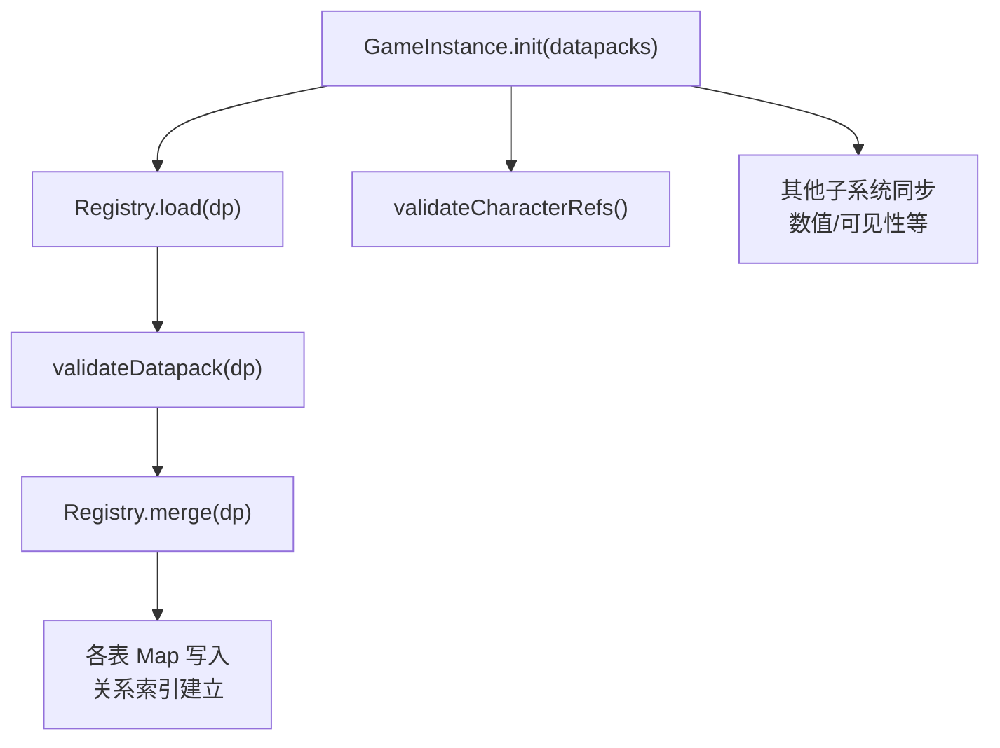
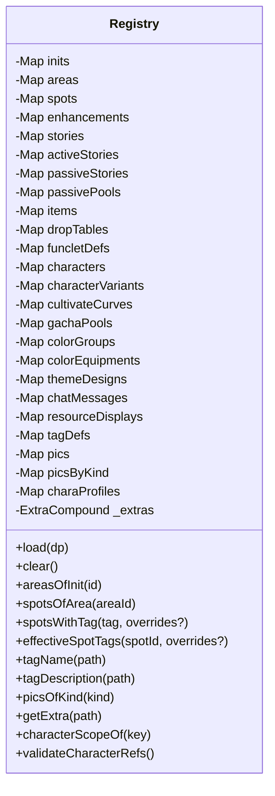
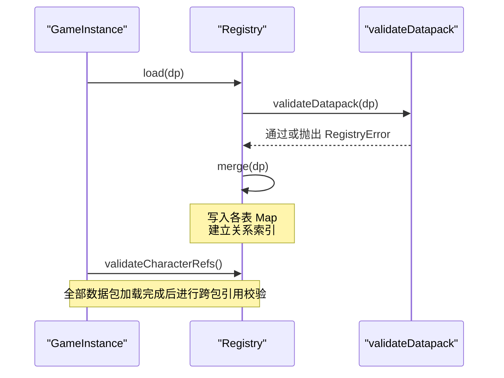
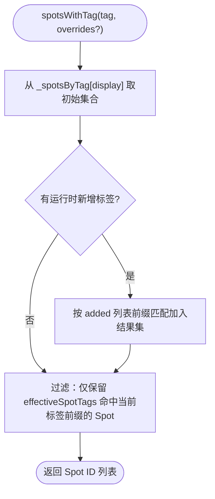
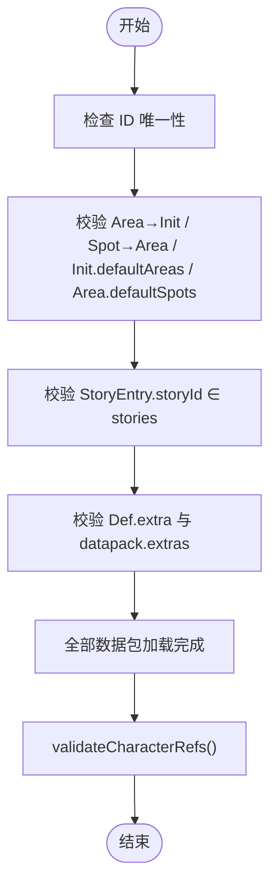
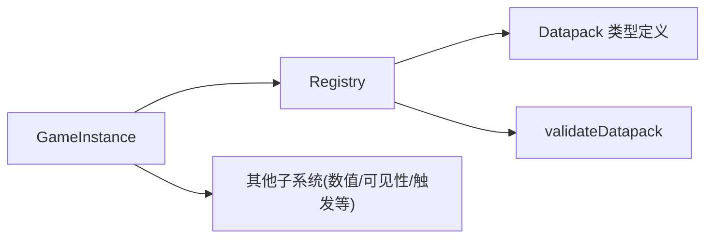

# 注册表系统

<cite>
**本文引用的文件**
- [src/engine/registry/registry.ts](file://src/engine/registry/registry.ts)
- [src/engine/registry/registry-validate.ts](file://src/engine/registry/registry-validate.ts)
- [src/engine/game-instance.ts](file://src/engine/game-instance.ts)
- [src/engine/types/datapack.ts](file://src/engine/types/datapack.ts)
- [tests/engine/registry.test.ts](file://tests/engine/registry.test.ts)
- [docs-824/03b-registry.md](file://docs-824/03b-registry.md)
</cite>

## 目录
1. [简介](#简介)
2. [项目结构](#项目结构)
3. [核心组件](#核心组件)
4. [架构总览](#架构总览)
5. [详细组件分析](#详细组件分析)
6. [依赖关系分析](#依赖关系分析)
7. [性能考量](#性能考量)
8. [故障排查指南](#故障排查指南)
9. [结论](#结论)
10. [附录](#附录)

## 简介
本文件面向 ACProgram 游戏引擎的“注册表系统”，系统性说明 Registry 类的设计理念、实现机制与生命周期管理方式。重点覆盖：
- 统一加载、校验、合并数据包（Datapack）到内存索引
- 对象注册流程：数据加载 → 索引构建 → 引用验证
- 各类实体类型的注册方式（世界线 Init、区域 Area、设施 Spot、剧情 Story/Entry、物品 Item、卡池 GachaPool、角色 Character/Variant、图片资产 Pic、标签 Tag、资源条 ResourceDisplay、Extra 常量等）
- 引用完整性检查机制，确保跨数据包引用正确性
- 查询接口与错误处理示例路径
- 性能优化策略（懒加载、缓存、内存管理）
- 与数据包的集成方式与扩展点

## 项目结构
注册表系统位于 engine/registry 下，由两部分组成：
- registry.ts：Registry 类，负责表存储、关系索引、查询与合并/清空
- registry-validate.ts：纯函数校验器，负责 ID 唯一性与引用完整性检查

GameInstance 作为运行时门面，在 init(datapacks) 中调用 Registry.load() 完成数据包加载与后续子系统同步。

**图表来源**
- [src/engine/game-instance.ts:176-229](file://src/engine/game-instance.ts#L176-L229)
- [src/engine/registry/registry.ts:528-543](file://src/engine/registry/registry.ts#L528-L543)
- [src/engine/registry/registry-validate.ts:18-184](file://src/engine/registry/registry-validate.ts#L18-L184)

**章节来源**
- [src/engine/registry/registry.ts:59-544](file://src/engine/registry/registry.ts#L59-L544)
- [src/engine/registry/registry-validate.ts:1-184](file://src/engine/registry/registry-validate.ts#L1-L184)
- [src/engine/game-instance.ts:176-229](file://src/engine/game-instance.ts#L176-L229)
- [docs-824/03b-registry.md:1-47](file://docs-824/03b-registry.md#L1-L47)

## 核心组件
- Registry：注册表主类，维护多张表与关系索引，提供只读访问器与查询方法；支持 load/merge/clear
- validateDatapack：数据包静态校验（ID 唯一性、引用完整性、Extra 合法性）
- GameInstance：组合根，编排 Registry 与其他子系统初始化顺序

关键职责划分：
- 加载期：Registry.validate + merge，构建索引
- 运行期：Registry 保持只读；运行时变化通过 PlayerState 与子系统服务处理

**章节来源**
- [src/engine/registry/registry.ts:59-544](file://src/engine/registry/registry.ts#L59-L544)
- [src/engine/registry/registry-validate.ts:1-184](file://src/engine/registry/registry-validate.ts#L1-L184)
- [src/engine/game-instance.ts:74-124](file://src/engine/game-instance.ts#L74-L124)

## 架构总览
注册表采用“声明式数据 + 编译态索引”的架构：
- 所有数据以 Datapack 形式声明，包含多类实体表
- 加载时先做静态校验，再合并入 Map 表并建立关系索引
- 提供高效查询接口（如按 Init/Area/Spot 层级、标签前缀匹配、图片按类型分组等）
- 跨包引用允许后加载补齐，最终统一校验

**图表来源**
- [src/engine/registry/registry.ts:59-544](file://src/engine/registry/registry.ts#L59-L544)

**章节来源**
- [src/engine/registry/registry.ts:59-544](file://src/engine/registry/registry.ts#L59-L544)

## 详细组件分析

### 数据加载与合并流程
- 入口：GameInstance.init(datapacks) 遍历数据包，逐个调用 Registry.load(dp)
- 加载步骤：
  - validateDatapack(dp)：校验 ID 唯一性、引用完整性、Extra 合法性
  - merge(dp)：遍历 tableSteps 清单，将每个表项写入对应 Map，并建立关系索引
- 清理：clear() 遍历同一清单执行 clear，保证一致性

**图表来源**
- [src/engine/game-instance.ts:176-229](file://src/engine/game-instance.ts#L176-L229)
- [src/engine/registry/registry.ts:528-543](file://src/engine/registry/registry.ts#L528-L543)
- [src/engine/registry/registry-validate.ts:18-184](file://src/engine/registry/registry-validate.ts#L18-L184)

**章节来源**
- [src/engine/game-instance.ts:176-229](file://src/engine/game-instance.ts#L176-L229)
- [src/engine/registry/registry.ts:528-543](file://src/engine/registry/registry.ts#L528-L543)
- [src/engine/registry/registry-validate.ts:18-184](file://src/engine/registry/registry-validate.ts#L18-L184)

### 索引构建与查询
- 关系索引：
  - areasByInit：Init → Areas
  - spotsByArea：Area → Spots
  - spotsByTag：层级标签 → Spot 集合（含前缀展开）
- 查询接口：
  - areasOfInit(initId)
  - spotsOfArea(areaId)
  - spotsOfInit(initId)
  - spotsWithTag(tag, overrides?)：支持运行时标签增撤覆盖
  - effectiveSpotTags(spotId, overrides?)：计算有效标签集合
- 标签展示：
  - tagName(path)、tagDescription(path)：优先精确匹配，否则沿路径向上继承父定义

**图表来源**
- [src/engine/registry/registry.ts:471-498](file://src/engine/registry/registry.ts#L471-L498)
- [src/engine/registry/registry.ts:500-517](file://src/engine/registry/registry.ts#L500-L517)

**章节来源**
- [src/engine/registry/registry.ts:462-526](file://src/engine/registry/registry.ts#L462-L526)

### 实体类型注册方式
- 世界线与区域：inits、areas、spots
- 剧情：stories、activeStories、passiveStories、passivePools
- 物品与掉落：items、dropTables
- 功能片段：funcletDefs
- 角色系统：characters、characterVariants、cultivateCurves、gachaPools
- 色彩与主题：colorGroups、colorEquipments、themeDesigns
- 聊天流：chatMessages
- 资源条显示：resourceDisplays
- 标签表现：tags
- 图片资产：pics（含 picsByKind 分类索引）
- 角色资料：charaProfiles
- Extra 全局常量：extras（扁平键展开为树后深合并）

每种表的合并逻辑集中在 tableSteps 中，新增表只需添加 step 即可自动参与 merge/clear。

**章节来源**
- [src/engine/registry/registry.ts:113-319](file://src/engine/registry/registry.ts#L113-L319)
- [src/engine/types/datapack.ts:46-134](file://src/engine/types/datapack.ts#L46-L134)

### 引用完整性检查机制
- 加载期校验（validateDatapack）：
  - ID 唯一性：对每类实体数组检查重复 id
  - 引用完整性：area 引用 init、spot 引用 area、init defaultAreas 引用 area、area defaultSpots 引用 spot、StoryEntry.storyId 引用 stories
  - Extra 合法性：Def.extra 与 datapack.extras 均走 assertValidExtra 校验
- 加载后校验（validateCharacterRefs）：
  - 卡池成员/featured 必须存在于 characterVariants
  - 差分 curve 必须存在于 cultivateCurves
  - 色彩装备与配色设计引用的 colorGroupId 必须存在

**图表来源**
- [src/engine/registry/registry-validate.ts:18-184](file://src/engine/registry/registry-validate.ts#L18-L184)
- [src/engine/registry/registry.ts:378-408](file://src/engine/registry/registry.ts#L378-L408)

**章节来源**
- [src/engine/registry/registry-validate.ts:18-184](file://src/engine/registry/registry-validate.ts#L18-L184)
- [src/engine/registry/registry.ts:378-408](file://src/engine/registry/registry.ts#L378-L408)

### 代码示例与使用路径
- 注册新类型（扩展表）：
  - 在 Registry 构造函数中添加新的 TableStep（merge/clear），并在类中增加私有字段与 getter
  - 参考现有表步骤模式
  - 参考路径：[src/engine/registry/registry.ts:113-319](file://src/engine/registry/registry.ts#L113-L319)
- 查询对象：
  - 通过只读访问器获取 Map，例如 registry.inits.get(id)
  - 使用关系查询：registry.areasOfInit(initId)、registry.spotsOfArea(areaId)
  - 标签查询：registry.spotsWithTag(['office'])
  - 参考路径：[src/engine/registry/registry.ts:322-469](file://src/engine/registry/registry.ts#L322-L469)
- 处理引用错误：
  - 捕获 RegistryError，定位缺失引用或重复 ID
  - 参考测试用例中的断言与异常信息
  - 参考路径：[tests/engine/registry.test.ts:50-78](file://tests/engine/registry.test.ts#L50-L78)

**章节来源**
- [src/engine/registry/registry.ts:322-469](file://src/engine/registry/registry.ts#L322-L469)
- [tests/engine/registry.test.ts:50-78](file://tests/engine/registry.test.ts#L50-L78)

## 依赖关系分析
- GameInstance 依赖 Registry 进行数据加载与校验，并在 init 后同步其他子系统（数值系统、可见性、触发系统等）
- Registry 依赖 types 定义的数据包结构与额外值类型
- 校验模块独立于状态，保证无副作用的静态检查

**图表来源**
- [src/engine/game-instance.ts:176-229](file://src/engine/game-instance.ts#L176-L229)
- [src/engine/registry/registry.ts:528-543](file://src/engine/registry/registry.ts#L528-L543)
- [src/engine/types/datapack.ts:46-134](file://src/engine/types/datapack.ts#L46-L134)

**章节来源**
- [src/engine/game-instance.ts:176-229](file://src/engine/game-instance.ts#L176-L229)
- [src/engine/registry/registry.ts:528-543](file://src/engine/registry/registry.ts#L528-L543)
- [src/engine/types/datapack.ts:46-134](file://src/engine/types/datapack.ts#L46-L134)

## 性能考量
- 懒加载与按需索引：
  - 图片按类型分类索引（picsByKind）仅在加载 pics 时构建，避免无关开销
  - 标签查询基于声明索引与运行时覆盖叠加，减少全量扫描
- 缓存机制：
  - 关系索引（areasByInit、spotsByArea、spotsByTag）在加载期一次性构建，查询 O(1)/O(k)
  - Extra 常量树深合并后提供 getAtPath 快速读取
- 内存管理：
  - clear() 通过统一 tableSteps 清单清空所有表与索引，避免遗漏
  - 废弃字段（如 characterBonuses）直接忽略并记录警告，降低内存占用
- 可扩展性：
  - 新增表仅需添加 TableStep，merge/clear 自动同步，降低维护成本

**章节来源**
- [src/engine/registry/registry.ts:113-319](file://src/engine/registry/registry.ts#L113-L319)
- [src/engine/registry/registry.ts:418-421](file://src/engine/registry/registry.ts#L418-L421)
- [src/engine/registry/registry.ts:534-543](file://src/engine/registry/registry.ts#L534-L543)

## 故障排查指南
常见错误与定位：
- 重复 ID：validateDatapack 会抛出 RegistryError，提示具体实体类型与 id
  - 参考路径：[src/engine/registry/registry-validate.ts:21-29](file://src/engine/registry/registry-validate.ts#L21-L29)
- 引用缺失：
  - Area 引用未知 Init、Spot 引用未知 Area、StoryEntry 引用未知 Story
  - 参考路径：[src/engine/registry/registry-validate.ts:107-141](file://src/engine/registry/registry-validate.ts#L107-L141)
- 卡池/差分/曲线引用不完整：
  - 在全部数据包加载后调用 validateCharacterRefs，未满足则抛错
  - 参考路径：[src/engine/registry/registry.ts:378-408](file://src/engine/registry/registry.ts#L378-L408)
- Extra 非法：
  - Def.extra 或 datapack.extras 不符合 ExtraValue 规则时报错
  - 参考路径：[src/engine/registry/registry-validate.ts:143-184](file://src/engine/registry/registry-validate.ts#L143-L184)

调试建议：
- 使用测试用例中的断言模式复现问题（如重复 ID、引用缺失）
- 关注 GameInstance.init 日志输出，确认已加载数据包数量与各表规模
- 参考路径：[tests/engine/registry.test.ts:50-78](file://tests/engine/registry.test.ts#L50-L78)

**章节来源**
- [src/engine/registry/registry-validate.ts:21-29](file://src/engine/registry/registry-validate.ts#L21-L29)
- [src/engine/registry/registry-validate.ts:107-141](file://src/engine/registry/registry-validate.ts#L107-L141)
- [src/engine/registry/registry.ts:378-408](file://src/engine/registry/registry.ts#L378-L408)
- [src/engine/registry/registry-validate.ts:143-184](file://src/engine/registry/registry-validate.ts#L143-L184)
- [tests/engine/registry.test.ts:50-78](file://tests/engine/registry.test.ts#L50-L78)

## 结论
注册表系统通过“声明式数据包 + 编译态索引”的设计，实现了：
- 统一的对象生命周期管理（加载、校验、合并、查询）
- 强一致性的引用完整性保障（加载期与加载后双重校验）
- 高效的查询能力（关系索引、标签前缀匹配、图片分类）
- 良好的可扩展性与可维护性（TableStep 清单驱动）

该体系为游戏引擎提供了稳定可靠的数据层基础，支撑上层业务与服务的高效运行。

## 附录
- 数据包结构参考：Datapack 接口定义了所有可注册的实体表与配置项
  - 参考路径：[src/engine/types/datapack.ts:46-134](file://src/engine/types/datapack.ts#L46-L134)
- 文档参考：Registry 结构与行为概述
  - 参考路径：[docs-824/03b-registry.md:1-47](file://docs-824/03b-registry.md#L1-L47)