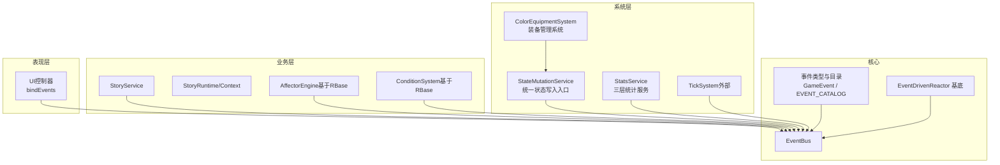
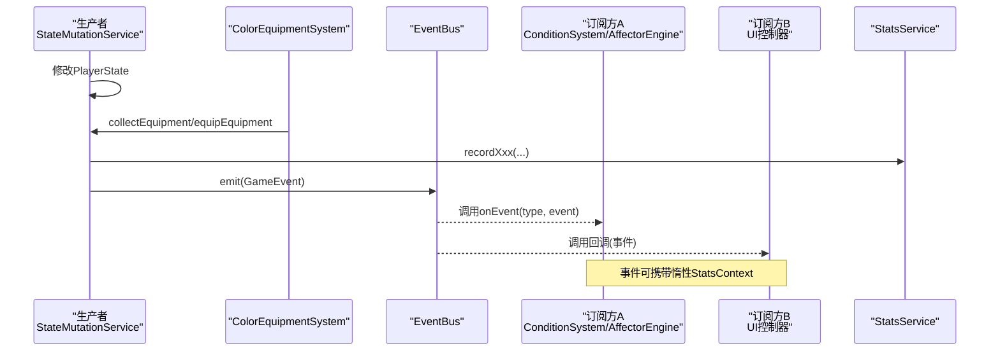
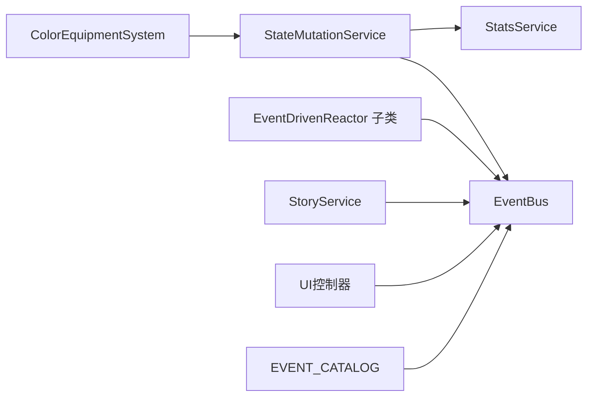

# 组件通信机制

<cite>
**本文引用的文件**
- [event-bus.ts](file://src/engine/core/event-bus.ts)
- [events.ts](file://src/engine/types/events.ts)
- [event-driven-reactor.ts](file://src/engine/effect/event-driven-reactor.ts)
- [state-mutation-service.ts](file://src/engine/system/state-mutation-service.ts)
- [stats.ts](file://src/engine/stats/stats.ts)
- [story-context.ts](file://src/engine/game/story-context.ts)
- [story-service.ts](file://src/engine/game/story-service.ts)
- [controller-events.ts](file://src/ui/controller-events.ts)
- [color-equipment-system.ts](file://src/engine/system/color-equipment-system.ts)
- [event-bus.test.ts](file://tests/engine/event-bus.test.ts)
- [event-driven-reactor.test.ts](file://tests/engine/event-driven-reactor.test.ts)
</cite>

## 更新摘要
**所做更改**
- 更新了StateMutationService的装备管理方法，移除了旧的equipColor/unequipColor方法
- 新增了collectEquipment/equipEquipment/unequipEquipment方法，支持单装备槽约束和所有权验证
- 更新了事件系统以支持装备相关事件（equipmentCollected、equipmentEquipped）
- 增强了装备系统的状态管理和事件驱动机制

## 目录
1. [简介](#简介)
2. [项目结构](#项目结构)
3. [核心组件](#核心组件)
4. [架构总览](#架构总览)
5. [详细组件分析](#详细组件分析)
6. [依赖关系分析](#依赖关系分析)
7. [性能考量](#性能考量)
8. [故障排查指南](#故障排查指南)
9. [结论](#结论)
10. [附录：事件命名规范与最佳实践](#附录事件命名规范与最佳实践)

## 简介
本文件面向ACProgram游戏引擎的组件通信机制，围绕事件驱动架构展开，重点解释以下主题：
- EventBus事件总线的实现原理：注册、发布、订阅、生命周期管理与批量刷新。
- 事件驱动反应器的设计模式：如何通过声明式依赖与分桶订阅解耦组件。
- StoryContext在剧情系统中的上下文传递：状态共享与事件协调。
- StatsService统计服务的数据收集与分发机制。
- 跨模块通信的最佳实践：事件命名、错误处理、性能优化。
- 典型场景的事件流程图与组件交互示例。
- 调试事件流与分析组件间依赖的工具与方法。

## 项目结构
引擎将"状态变更""事件总线""反应器""统计服务""剧情系统""UI控制器"等职责拆分到不同模块，通过统一的事件类型定义和目录进行契约化管理，避免散落的订阅关系导致耦合加深。

**图表来源**
- [event-bus.ts:9-83](file://src/engine/core/event-bus.ts#L9-L83)
- [events.ts:13-170](file://src/engine/types/events.ts#L13-L170)
- [event-driven-reactor.ts:15-34](file://src/engine/effect/event-driven-reactor.ts#L15-L34)
- [state-mutation-service.ts:41-101](file://src/engine/system/state-mutation-service.ts#L41-L101)
- [stats.ts:47-117](file://src/engine/stats/stats.ts#L47-L117)
- [story-service.ts:52-84](file://src/engine/game/story-service.ts#L52-L84)
- [controller-events.ts:12-88](file://src/ui/controller-events.ts#L12-L88)
- [color-equipment-system.ts:28-34](file://src/engine/system/color-equipment-system.ts#L28-L34)

## 核心组件
- EventBus：提供 on/off/onAny/emit/flush/clear 等能力，支持事件队列与批量派发，保证嵌套 emit 时的顺序一致性。
- EventDrivenReactor：抽象基底，强制按事件类型分桶订阅，子类仅对声明依赖的事件付匹配成本。
- StateMutationService：所有 PlayerState 修改的统一入口，遵循"写状态→更新统计→发事件→订阅者消费"的固定管道。
- StatsService：维护 global/init/session 三层统计，提供快照、DSL求值、持久化恢复，并在事件上下文中惰性携带统计摘要。
- StoryService/StoryRuntime：剧情运行时上下文，聚合 Registry、条件系统、效果引擎、状态变更、事件总线、被动池等只读视图，供 story-flow/jump/replay/rewards 子模块协作。
- ColorEquipmentSystem：色彩装备管理系统，负责装备收集、装备/卸下操作的条件校验和状态管理。
- UI控制器：集中订阅引擎事件，驱动揭示刷新、奖励排队、聊天流演出文本等界面行为。

**章节来源**
- [event-bus.ts:9-83](file://src/engine/core/event-bus.ts#L9-L83)
- [event-driven-reactor.ts:15-34](file://src/engine/effect/event-driven-reactor.ts#L15-L34)
- [state-mutation-service.ts:31-101](file://src/engine/system/state-mutation-service.ts#L31-L101)
- [stats.ts:47-117](file://src/engine/stats/stats.ts#L47-L117)
- [story-context.ts:24-49](file://src/engine/game/story-context.ts#L24-L49)
- [story-service.ts:52-84](file://src/engine/game/story-service.ts#L52-L84)
- [controller-events.ts:12-88](file://src/ui/controller-events.ts#L12-L88)
- [color-equipment-system.ts:28-34](file://src/engine/system/color-equipment-system.ts#L28-L34)

## 架构总览
事件驱动架构的核心在于"生产者—总线—消费者"的解耦：
- 生产者：StateMutationService、TickSystem、PassivePoolSystem、GachaService、SpotService等。
- 总线：EventBus，负责事件路由、去重、批量派发。
- 消费者：各类反应器（AffectorEngine、ConditionSystem）、UI控制器、StatsService等。

**图表来源**
- [state-mutation-service.ts:87-101](file://src/engine/system/state-mutation-service.ts#L87-L101)
- [event-bus.ts:46-75](file://src/engine/core/event-bus.ts#L46-L75)
- [stats.ts:91-117](file://src/engine/stats/stats.ts#L91-L117)
- [controller-events.ts:12-88](file://src/ui/controller-events.ts#L12-L88)
- [color-equipment-system.ts:111-125](file://src/engine/system/color-equipment-system.ts#L111-L125)

## 详细组件分析

### EventBus：事件总线
- 功能要点
  - on(eventType, handler)：返回取消订阅函数，便于生命周期管理。
  - onAny(handler)：全量监听，用于调试或通用刷新。
  - off(eventType, handler)：移除指定处理器。
  - emit(event)：若当前处于 flush 中则入队，否则立即派发。
  - flush()：批量派发队列中的事件，确保嵌套 emit 的顺序性。
  - clear()：清理所有处理器与队列。
- 复杂度
  - on/off/emit 均为 O(1) 均摊；dispatch 为 O(n)（n为该类型处理器数）。
- 使用建议
  - 高频事件（如 tick）谨慎使用 onAny；优先精确订阅。
  - 复杂流程中使用 flush 包裹批量 emit，避免重复派发。

**章节来源**
- [event-bus.ts:9-83](file://src/engine/core/event-bus.ts#L9-L83)
- [event-bus.test.ts:8-90](file://tests/engine/event-bus.test.ts#L8-L90)

### EventDrivenReactor：事件驱动反应器基底
- 设计模式
  - 声明式依赖：子类通过 subscribeTo(types) 声明感兴趣的事件类型集合。
  - 分桶订阅：内部维护 subscribed Set，避免重复订阅与全量扫描。
  - 命中动作：子类实现 onEvent(type, event)，根据事件类型执行定向逻辑。
- 适用场景
  - TriggerSystem、VisibilityEngine、AffectorEngine 条件索引等。
- 优势
  - 降低耦合：反应器不直接依赖具体业务模块，仅依赖事件类型。
  - 提升性能：每个反应器只为自身依赖的事件类型付出匹配成本。

**章节来源**
- [event-driven-reactor.ts:15-34](file://src/engine/effect/event-driven-reactor.ts#L15-L34)
- [event-driven-reactor.test.ts:38-113](file://tests/engine/event-driven-reactor.test.ts#L38-L113)

### StateMutationService：统一状态写入与事件发射
- 固定管道
  - 写 PlayerState → 同步 StatsService → emit 事件（携带惰性 StatsContext）→ 订阅者消费。
- 关键方法
  - changeResource/setResource：资源增减，触发 resourceChanged。
  - setSpotLevel/addSpotLevel：设施等级变化，触发 spotLevelChanged。
  - acquireCharacter：角色获得，触发 characterAcquired。
  - addExp/breakthroughStar：培养变更，触发 cultivated。
  - unlockGroup/collectEquipment/equipEquipment：色彩相关，触发 groupUnlocked/equipmentCollected/equipmentEquipped。
  - activateTheme/setEntityThemeSlot：主题切换，触发 themeChanged/entityThemeChanged。
  - addItem/removeItem：物品变动，触发 itemCollected。
  - unlockInit：世界线解锁，触发 initUnlocked。
  - completeStory：剧情完成，触发 storyCompleted。
  - applySpotTagChange：Spot tag 增撤，触发 spotTagChanged。
  - setExtra/addExtra/removeExtra：动态数据变更，触发 extraChanged。
- 错误处理
  - 未知差分/非法参数时抛出明确错误信息，便于定位问题。
- 惰性统计上下文
  - 事件 stats 字段为惰性属性，仅在消费方访问时构建 StatsContext，减少每帧开销。

**更新** 装备管理方法已重构，移除了旧的equipColor/unequipColor方法，新增了更完善的装备管理系统：
- `collectEquipment(equipmentId)`：幂等的装备收集，检查是否已拥有
- `equipEquipment(variantId, equipmentId)`：装备到变体单槽位，包含所有权验证和同装备检查
- `unequipEquipment(variantId)`：卸下装备，支持空槽位检查

**章节来源**
- [state-mutation-service.ts:31-101](file://src/engine/system/state-mutation-service.ts#L31-L101)
- [state-mutation-service.ts:242-270](file://src/engine/system/state-mutation-service.ts#L242-L270)

### ColorEquipmentSystem：色彩装备管理系统
- 核心职责
  - 装备收集：tryUnlock方法处理条件校验和自动收集
  - 装备管理：支持装备/卸下操作，单槽位约束
  - 状态查询：ownedEquipments/isOwned/getDef等查询接口
  - 效果解析：effectsOf按当前装备聚合效果
- 事件驱动
  - 通过StateMutationService发出equipmentCollected和equipmentEquipped事件
  - recheckUnlocks方法在characterAcquired/flagChanged时自动检查条件满足
- 集成方式
  - 依赖Registry获取装备定义
  - 通过mutations接口进行状态变更
  - 使用getState获取当前玩家状态

**新增** 装备系统提供了完整的装备管理机制，支持条件解锁、自动收集和效果聚合。

**章节来源**
- [color-equipment-system.ts:28-34](file://src/engine/system/color-equipment-system.ts#L28-L34)
- [color-equipment-system.ts:111-125](file://src/engine/system/color-equipment-system.ts#L111-L125)

### StatsService：统计信息收集与分发
- 三层统计
  - global：贯穿 Init 的累计数据。
  - init[id]：各 Init 内累计数据（含 framesInInit）。
  - session：当前一次游玩的统计数据（需存档持久化）。
- 数据流
  - mutation 请求 → 写 PlayerState → 同步三层统计 → emit 事件（携带 StatsContext）→ 订阅者判断条件并执行。
- 查询DSL
  - evaluate(dsl)：解析受限函数 DSL 并求值，支持 scope/global/currentRun/init。
- 持久化
  - getPersistable/restore：支持存档保存与恢复。
- 事件上下文
  - getContext：返回浅拷贝的 StatsContext，避免持有内部引用。

**章节来源**
- [stats.ts:4-18](file://src/engine/stats/stats.ts#L4-L18)
- [stats.ts:47-117](file://src/engine/stats/stats.ts#L47-L117)
- [stats.ts:119-151](file://src/engine/stats/stats.ts#L119-L151)
- [stats.ts:153-263](file://src/engine/stats/stats.ts#L153-L263)

### StoryContext/StoryService：剧情上下文与事件协调
- StoryRuntime 接口
  - 暴露 registry、conditionSystem、effectEngine、mutations、eventBus、passivePools 等只读视图。
  - 提供 travelToArea、getState、cursorFor、entryById、storyOf、currentPage、hasCompletedStory、getView、guardPrereqsMet 等方法。
  - flagsSetThisStory：记录本次剧情播放期间设置的 flag，完成时随 storyRewarded 通知 UI。
  - lastRewarded：包装引用，供 resolveStoryEnd 读取并清空。
- StoryService 职责
  - 游标持有与访问（全局/聊天沙盒），对外 API 委托至 story-flow/jump/replay/rewards。
  - 构造 StoryRuntime，使子模块无需直接依赖 StoryService，避免循环依赖。
- 事件协调
  - 剧情开始/推进/完成过程中，通过 EventBus 发出 storyTriggered/storyCompleted/storyRewarded 等事件，驱动 UI 与条件系统。

**章节来源**
- [story-context.ts:24-49](file://src/engine/game/story-context.ts#L24-L49)
- [story-service.ts:52-84](file://src/engine/game/story-service.ts#L52-L84)
- [story-service.ts:178-228](file://src/engine/game/story-service.ts#L178-L228)

### UI控制器：事件驱动的界面响应
- 绑定策略
  - bindEvents 在 mount 时一次性订阅引擎事件。
  - onAny 用于揭示刷新（跳过 tick/spotProduced 高频事件）。
  - 针对特定事件（storyRewarded/poolGateChanged/storyAreaTraveled/chatFlowCleared/chatTextShown 等）执行界面操作。
- 奖励排队
  - storyRewarded 不立即渲染，而是推入 pendingRewardChats，等待点击处理器完成后统一落账，保证聊天流顺序正确。

**章节来源**
- [controller-events.ts:12-88](file://src/ui/controller-events.ts#L12-L88)

## 依赖关系分析
- 低耦合设计
  - 模块间通过事件类型解耦，而非直接引用对方实现。
  - EVENT_CATALOG 强制登记事件的发射方与订阅方，编译期穷尽检查，避免漂移。
- 依赖方向
  - StateMutationService → EventBus/StatsService。
  - Reactors（AffectorEngine/ConditionSystem）→ EventBus（通过 EventDrivenReactor 基底）。
  - StoryService → EventBus/Registry/ConditionSystem/EffectEngine。
  - ColorEquipmentSystem → StateMutationService/Registry。
  - UI → EventBus（订阅事件驱动界面）。
- 潜在循环依赖规避
  - StoryRuntime 以只读视图形式注入子模块，避免 story-flow/jump/replay/rewards 直接依赖 StoryService。

**图表来源**
- [state-mutation-service.ts:41-101](file://src/engine/system/state-mutation-service.ts#L41-L101)
- [event-driven-reactor.ts:15-34](file://src/engine/effect/event-driven-reactor.ts#L15-L34)
- [story-service.ts:52-84](file://src/engine/game/story-service.ts#L52-L84)
- [controller-events.ts:12-88](file://src/ui/controller-events.ts#L12-L88)
- [events.ts:123-170](file://src/engine/types/events.ts#L123-L170)
- [color-equipment-system.ts:28-34](file://src/engine/system/color-equipment-system.ts#L28-L34)

**章节来源**
- [events.ts:123-170](file://src/engine/types/events.ts#L123-L170)
- [state-mutation-service.ts:41-101](file://src/engine/system/state-mutation-service.ts#L41-L101)
- [event-driven-reactor.ts:15-34](file://src/engine/effect/event-driven-reactor.ts#L15-L34)
- [story-service.ts:52-84](file://src/engine/game/story-service.ts#L52-L84)
- [controller-events.ts:12-88](file://src/ui/controller-events.ts#L12-L88)

## 性能考量
- 事件队列与批量刷新
  - EventBus.flush 将嵌套 emit 入队后统一派发，避免重复计算与状态不一致。
- 惰性统计上下文
  - StateMutationService 在事件中附加惰性 stats 属性，仅在消费方访问时构建 StatsContext，显著降低高频事件（如 tick）的开销。
- 分桶订阅
  - EventDrivenReactor 强制按事件类型分桶订阅，禁止 onAny 全量扫描，确保每个反应器只为自身依赖的事件类型付出匹配成本。
- 幂等与去重
  - 多处写入采用幂等语义（如 unlockGroup、collectEquipment、activateTheme），避免重复事件与无效刷新。
- 高频事件过滤
  - UI 控制器在 onAny 中跳过 tick/spotProduced，防止频繁刷新导致的性能瓶颈。
- 装备系统优化
  - 单装备槽设计减少了状态管理的复杂性
  - 所有权验证避免了不必要的状态变更
  - 条件检查在收集阶段完成，减少运行时开销

**章节来源**
- [event-bus.ts:46-66](file://src/engine/core/event-bus.ts#L46-L66)
- [state-mutation-service.ts:87-101](file://src/engine/system/state-mutation-service.ts#L87-L101)
- [event-driven-reactor.ts:20-30](file://src/engine/effect/event-driven-reactor.ts#L20-L30)
- [controller-events.ts:14-18](file://src/ui/controller-events.ts#L14-L18)
- [state-mutation-service.ts:242-270](file://src/engine/system/state-mutation-service.ts#L242-L270)

## 故障排查指南
- 事件未触发
  - 检查 EVENT_CATALOG 是否正确登记发射方与订阅方。
  - 确认 on/off 生命周期管理是否完整（返回的取消订阅函数是否被调用）。
  - 验证是否在 flush 期间嵌套 emit，必要时使用 flush 包裹批量操作。
- 性能问题
  - 避免在 onAny 中执行重逻辑；优先精确订阅。
  - 检查是否有不必要的深拷贝或频繁重建对象。
- 剧情上下文异常
  - 确认 StoryRuntime 已正确注入，flagsSetThisStory 与 lastRewarded 是否按预期更新。
  - 检查 storyTriggered/storyCompleted/storyRewarded 事件是否按序发出。
- 统计不一致
  - 确认 StatsService.setState 已注入，beginSession/reset/restore 调用时机正确。
  - 检查 evaluate DSL 的 scope 与 key 是否匹配当前状态。
- 装备系统问题
  - 检查equipEquipment方法的返回值，确认所有权验证是否通过
  - 验证装备ID是否在equipmentsOwned列表中
  - 确认变体ID对应的角色条目是否存在

**章节来源**
- [events.ts:123-170](file://src/engine/types/events.ts#L123-L170)
- [event-bus.ts:15-44](file://src/engine/core/event-bus.ts#L15-L44)
- [story-context.ts:24-49](file://src/engine/game/story-context.ts#L24-L49)
- [stats.ts:55-117](file://src/engine/stats/stats.ts#L55-L117)
- [state-mutation-service.ts:252-270](file://src/engine/system/state-mutation-service.ts#L252-L270)

## 结论
ACProgram 的组件通信机制以 EventBus 为核心，结合 EventDrivenReactor 的分桶订阅与 StateMutationService 的统一写入管道，实现了高内聚、低耦合的事件驱动架构。StatsService 提供三层统计与惰性上下文，StoryContext 通过 StoryRuntime 聚合运行时依赖，支撑剧情系统的状态共享与事件协调。ColorEquipmentSystem 的新增为游戏增添了丰富的装备系统，通过事件驱动实现装备收集、装备/卸下的完整生命周期管理。UI 控制器通过集中订阅事件，驱动界面响应与演出流程。整体设计在保证灵活性的同时，兼顾了性能与可维护性。

## 附录：事件命名规范与最佳实践
- 事件命名
  - 使用小驼峰动词+名词组合，如 resourceChanged、spotLevelChanged、characterAcquired。
  - 事件类型应在 GameEvent 联合类型中统一定义，并通过 EVENT_CATALOG 登记发射方与订阅方。
  - 装备相关事件：equipmentCollected（收集）、equipmentEquipped（装备）。
- 错误处理
  - 在 StateMutationService 中对非法输入抛出明确错误信息，便于快速定位。
  - 在 UI 控制器中对事件进行类型守卫（if (event.type !== 'xxx') return），避免误处理。
  - 装备系统方法返回详细的错误原因（no-entry、not-owned、already-equipped）。
- 性能考虑
  - 高频事件（tick、spotProduced）应谨慎订阅，必要时在 onAny 中过滤。
  - 使用 flush 批量派发事件，避免嵌套 emit 导致的重复计算。
  - 利用惰性 StatsContext，仅在需要时构建统计快照。
  - 装备系统采用单槽位设计，减少状态管理的复杂性。
- 调试工具
  - 使用 onAny 订阅所有事件，输出事件流日志，辅助定位问题。
  - 借助 EVENT_CATALOG 审计事件契约，确保新增/删除事件类型时编译期报错。
  - 装备系统测试覆盖了所有权验证、换装逻辑、卸下操作等场景。

**章节来源**
- [events.ts:13-170](file://src/engine/types/events.ts#L13-L170)
- [state-mutation-service.ts:87-101](file://src/engine/system/state-mutation-service.ts#L87-L101)
- [controller-events.ts:14-18](file://src/ui/controller-events.ts#L14-L18)
- [event-bus.ts:46-66](file://src/engine/core/event-bus.ts#L46-L66)
- [state-mutation-service.ts:252-270](file://src/engine/system/state-mutation-service.ts#L252-L270)
- [color-equipment-system.test.ts:130-152](file://tests/engine/color-equipment-system.test.ts#L130-L152)