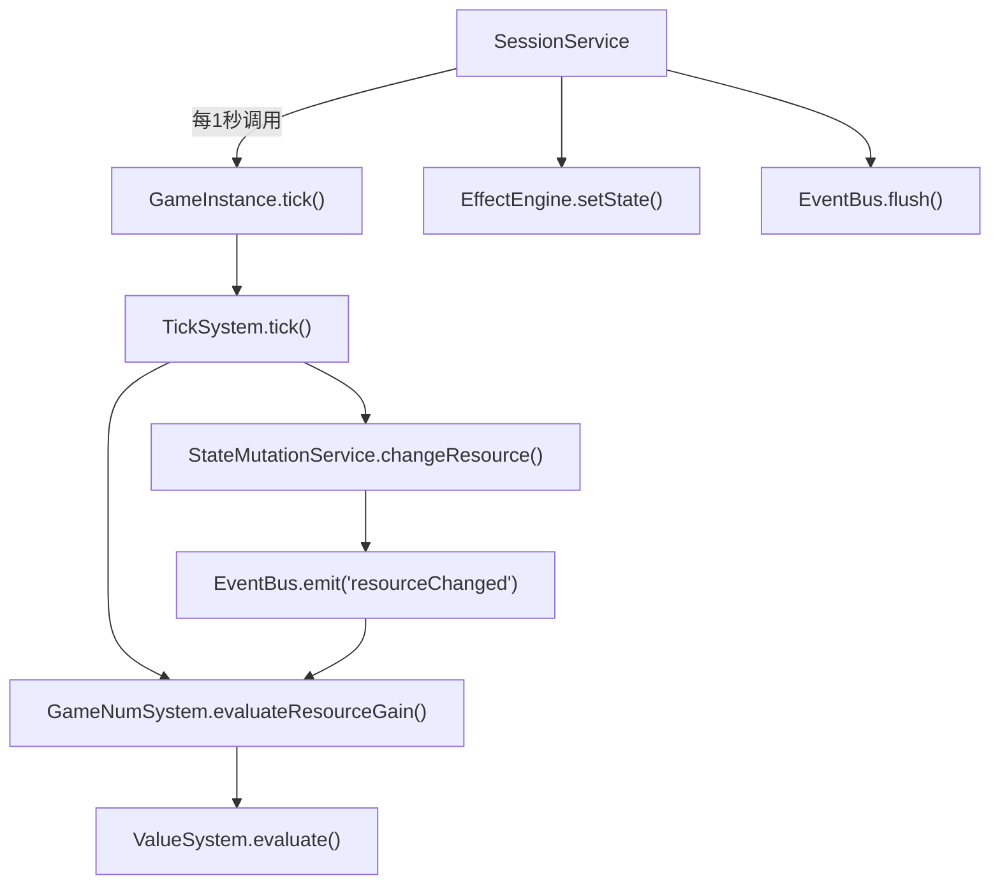
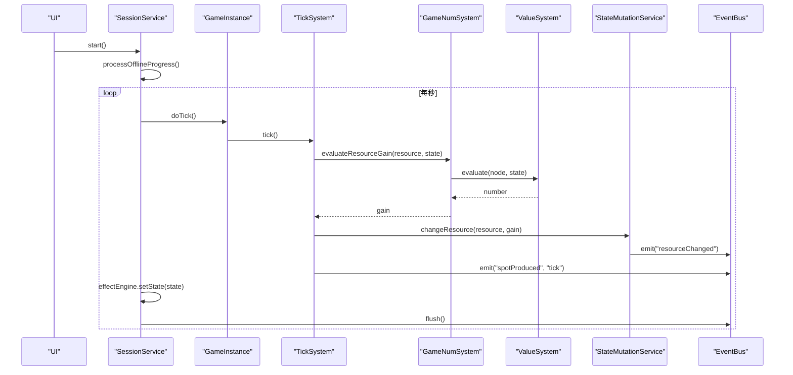
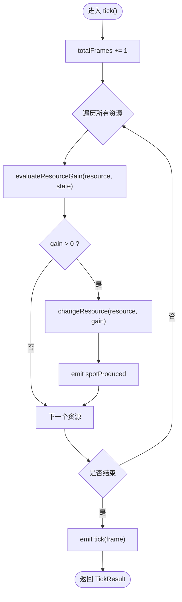
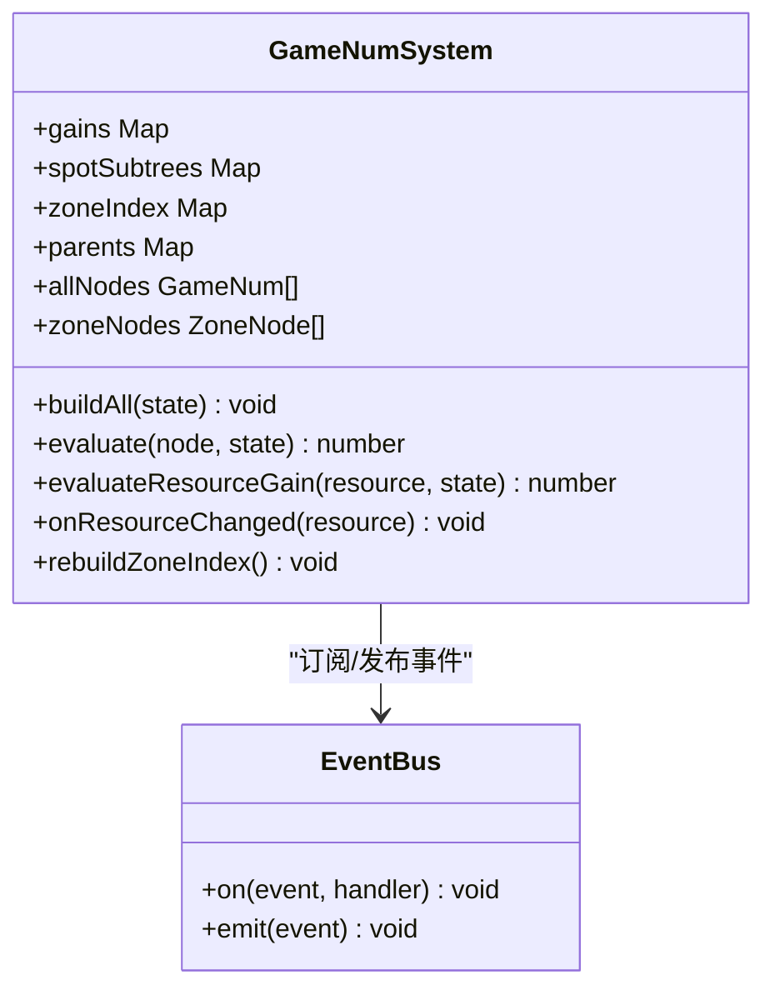
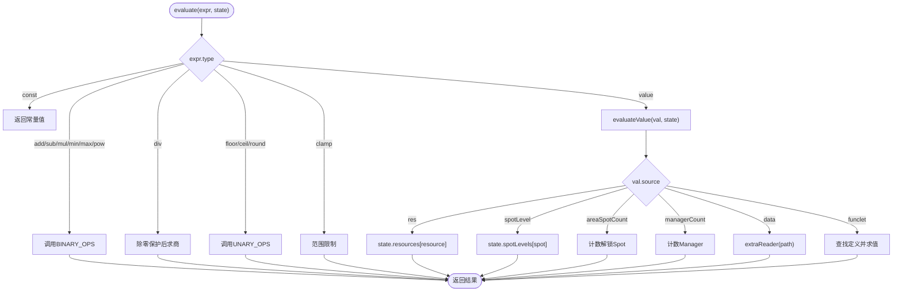
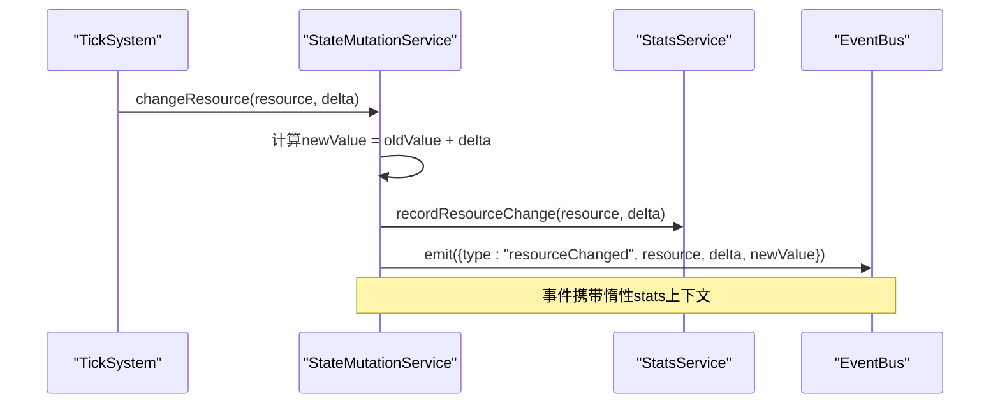
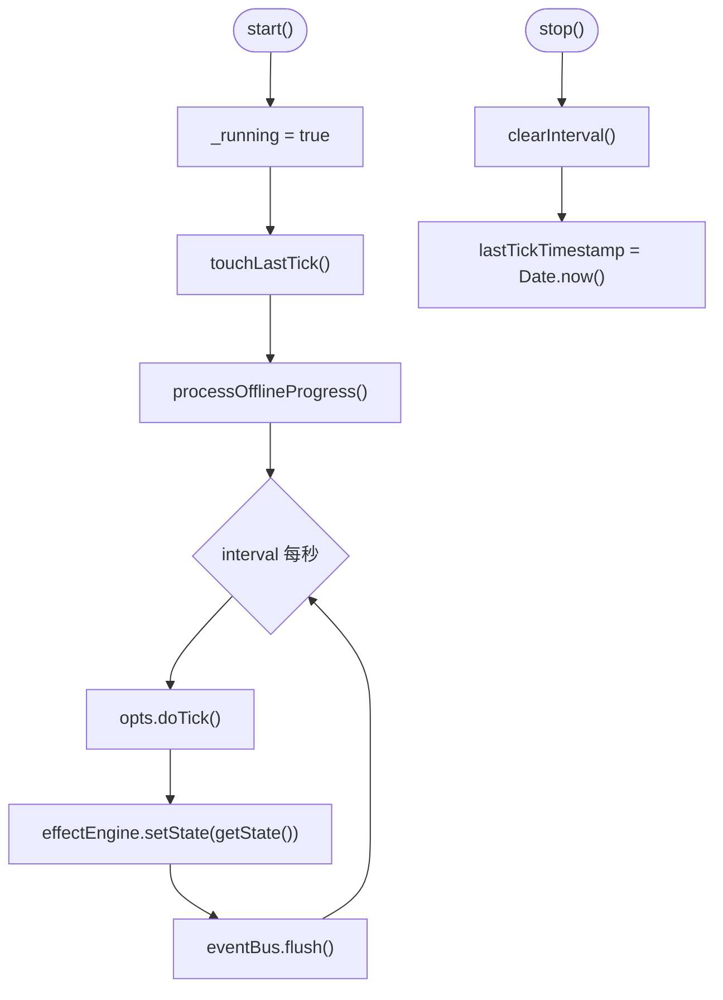
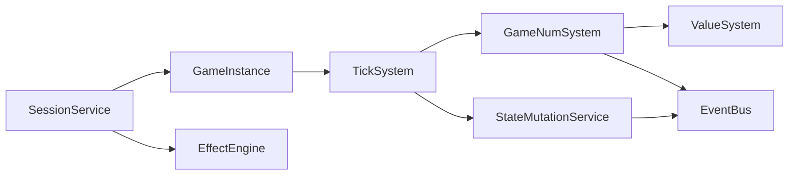

# Tick系统

<cite>
**本文引用的文件**
- [src/engine/system/tick-system.ts](file://src/engine/system/tick-system.ts)
- [src/engine/game/session-service.ts](file://src/engine/game/session-service.ts)
- [src/engine/expression/game-num.ts](file://src/engine/expression/game-num.ts)
- [src/engine/expression/value-system.ts](file://src/engine/expression/value-system.ts)
- [src/engine/system/state-mutation-service.ts](file://src/engine/system/state-mutation-service.ts)
- [src/engine/game-instance.ts](file://src/engine/game-instance.ts)
- [tests/engine/tick-system.test.ts](file://tests/engine/tick-system.test.ts)
</cite>

## 目录
1. [简介](#简介)
2. [项目结构](#项目结构)
3. [核心组件](#核心组件)
4. [架构总览](#架构总览)
5. [详细组件分析](#详细组件分析)
6. [依赖关系分析](#依赖关系分析)
7. [性能考量](#性能考量)
8. [故障排查指南](#故障排查指南)
9. [结论](#结论)
10. [附录：使用示例与扩展点](#附录使用示例与扩展点)

## 简介
本技术文档围绕ACProgram的Tick系统，系统化说明游戏循环、每秒一帧的更新机制、资源产出计算算法（数值表达式求值、依赖解析与失效传播）、SessionService会话管理（运行状态控制与时间戳管理），以及Tick系统的扩展点与使用示例。同时提供性能调优建议、调试技巧与常见问题解决方案，帮助开发者快速理解并安全扩展该子系统。

## 项目结构
Tick系统由以下关键模块协作完成：
- SessionService：负责启动/停止Tick循环、离线收益补算、时间戳管理，并在每帧回调中触发doTick与事件刷新。
- GameInstance：门面层，组合各子系统，暴露tick()入口，协调Affector应用、可见性、统计与日志。
- TickSystem：统一的生产Tick实现，遍历所有资源，按GameNumSystem计算每个资源的primitiveGain并写入状态。
- GameNumSystem：维护资源产出树（gains）与层级节点索引，提供evaluateResourceGain等求值接口，支持精确失效与缓存。
- ValueSystem：表达式求值器，支持const、算术、取整、clamp、funclet调用等。
- StateMutationService：统一的运行时状态写入入口，写状态后发出resourceChanged等事件，驱动下游精确失效。

图表来源
- [src/engine/game/session-service.ts:38-54](file://src/engine/game/session-service.ts#L38-L54)
- [src/engine/game-instance.ts:247-262](file://src/engine/game-instance.ts#L247-L262)
- [src/engine/system/tick-system.ts:44-61](file://src/engine/system/tick-system.ts#L44-L61)
- [src/engine/expression/game-num.ts:249-253](file://src/engine/expression/game-num.ts#L249-L253)
- [src/engine/expression/value-system.ts:111-142](file://src/engine/expression/value-system.ts#L111-L142)
- [src/engine/system/state-mutation-service.ts:110-123](file://src/engine/system/state-mutation-service.ts#L110-L123)

章节来源
- [src/engine/game/session-service.ts:1-100](file://src/engine/game/session-service.ts#L1-L100)
- [src/engine/game-instance.ts:1-399](file://src/engine/game-instance.ts#L1-L399)
- [src/engine/system/tick-system.ts:1-63](file://src/engine/system/tick-system.ts#L1-L63)
- [src/engine/expression/game-num.ts:1-262](file://src/engine/expression/game-num.ts#L1-L262)
- [src/engine/expression/value-system.ts:1-150](file://src/engine/expression/value-system.ts#L1-L150)
- [src/engine/system/state-mutation-service.ts:1-566](file://src/engine/system/state-mutation-service.ts#L1-L566)

## 核心组件
- SessionService：维护running标志、lastTickTimestamp；start时记录基准时间并处理离线进度，stop时清理定时器；每帧执行doTick、effectEngine.setState、eventBus.flush。
- GameInstance：组装子系统，init时构建GameNumSystem的产出树；tick()委托TickSystem，并应用活跃Affector效果、检查学生对话阻断态、记录统计与日志。
- TickSystem：每Tick将totalFrames+1，遍历所有资源，通过GameNumSystem.evaluateResourceGain计算gain，调用StateMutationService.changeResource写入，并emit spotProduced与tick事件。
- GameNumSystem：维护gains、spotSubtrees、zoneIndex、parents、allNodes、zoneNodes等索引；监听enhancement/spotTag/manager/extra/resource变更，进行定向失效；提供buildAll、evaluate、evaluateResourceGain等接口。
- ValueSystem：表达式求值引擎，支持二元/一元算子、funclet调用、data读取、除零保护与clamp范围限制。
- StateMutationService：统一状态写入，changeResource会记录统计、emit resourceChanged事件，供GameNumSystem精确失效。

章节来源
- [src/engine/game/session-service.ts:21-100](file://src/engine/game/session-service.ts#L21-L100)
- [src/engine/game-instance.ts:74-262](file://src/engine/game-instance.ts#L74-L262)
- [src/engine/system/tick-system.ts:19-61](file://src/engine/system/tick-system.ts#L19-L61)
- [src/engine/expression/game-num.ts:52-262](file://src/engine/expression/game-num.ts#L52-L262)
- [src/engine/expression/value-system.ts:88-150](file://src/engine/expression/value-system.ts#L88-L150)
- [src/engine/system/state-mutation-service.ts:41-123](file://src/engine/system/state-mutation-service.ts#L41-L123)

## 架构总览
Tick系统采用“事件驱动的精确失效 + 懒求值”的架构：
- 每Tick仅对资源级聚合求值，不再逐Spot结算，避免容量截断带来的复杂分支。
- 资源产出树（GameNum.gains）在初始化时构建，后续通过事件（如resourceChanged、spotTagChanged、enhancementAdded/Removed）进行定向失效，未受影响的子树跨帧保持缓存。
- 表达式求值（ValueSystem）以算子表驱动，支持函数片段（funclet）与外部数据（Extra）读取，保证灵活性与可配置性。
- 会话服务（SessionService）封装了自动循环与离线收益，确保UI与逻辑解耦。

图表来源
- [src/engine/game/session-service.ts:38-99](file://src/engine/game/session-service.ts#L38-L99)
- [src/engine/game-instance.ts:247-262](file://src/engine/game-instance.ts#L247-L262)
- [src/engine/system/tick-system.ts:44-61](file://src/engine/system/tick-system.ts#L44-L61)
- [src/engine/expression/game-num.ts:249-253](file://src/engine/expression/game-num.ts#L249-L253)
- [src/engine/expression/value-system.ts:111-142](file://src/engine/expression/value-system.ts#L111-L142)
- [src/engine/system/state-mutation-service.ts:110-123](file://src/engine/system/state-mutation-service.ts#L110-L123)

## 详细组件分析

### TickSystem：统一生产Tick
- 职责：每Tick递增totalFrames，遍历所有资源，计算并写入产出，发射spotProduced与tick事件。
- 关键点：
  - TICK_INTERVAL_MS = 1000ms，表示每秒一帧。
  - 产出为resource级聚合，不逐Spot结算，因此无Spot容量截断。
  - 通过GameNumSystem.evaluateResourceGain获取每个资源的primitiveGain。
  - 通过StateMutationService.changeResource写入状态并触发resourceChanged事件。

图表来源
- [src/engine/system/tick-system.ts:44-61](file://src/engine/system/tick-system.ts#L44-L61)

章节来源
- [src/engine/system/tick-system.ts:1-63](file://src/engine/system/tick-system.ts#L1-L63)

### GameNumSystem：数值树与精确失效
- 职责：维护资源产出树（gains）、Spot子树（spotSubtrees）、区表索引（zoneIndex）、父子关系（parents）、全量节点（allNodes）、Zone节点（zoneNodes）；提供构建、求值、定向失效能力。
- 关键点：
  - 构造期订阅事件：enhancementAdded/Removed、spotTagChanged、spotLevelChanged、managerChanged、extraChanged、resourceChanged、affectorMounted/Unmounted/StateChanged/EntriesChanged。
  - onResourceChanged实现Phase 5定向失效：只重算受该资源影响的子树（静态依赖、区表命中、flows节点）。
  - evaluateResourceGain直接读取gains映射中的根节点并求值。
  - buildAll构建完整产出树，rebuildZoneIndex重建反路由。

图表来源
- [src/engine/expression/game-num.ts:52-173](file://src/engine/expression/game-num.ts#L52-L173)
- [src/engine/expression/game-num.ts:184-262](file://src/engine/expression/game-num.ts#L184-L262)

章节来源
- [src/engine/expression/game-num.ts:1-262](file://src/engine/expression/game-num.ts#L1-L262)

### ValueSystem：表达式求值
- 职责：将ValueExpression求值为数字，支持const、value源、算术运算、取整、clamp、funclet调用、data读取。
- 关键点：
  - 二元算子表BINARY_OPS包含add/sub/mul/min/max/pow，div有除零保护。
  - 一元算子UNARY_OPS包含floor/ceil/round。
  - SOURCE_EVALUATORS根据source类型从PlayerState或Extra读取数值，未知source回退0。
  - funclet调用通过sys.funcletDefs查找定义，并将参数注入flags上下文。

图表来源
- [src/engine/expression/value-system.ts:13-86](file://src/engine/expression/value-system.ts#L13-L86)
- [src/engine/expression/value-system.ts:111-142](file://src/engine/expression/value-system.ts#L111-L142)

章节来源
- [src/engine/expression/value-system.ts:1-150](file://src/engine/expression/value-system.ts#L1-L150)

### StateMutationService：统一状态写入
- 职责：集中所有修改PlayerState的基础操作，写状态后同步StatsService并emit事件。
- 关键点：
  - changeResource区分全局资源与本地资源桶，记录统计并发出resourceChanged事件。
  - 其他方法包括setSpotLevel、addSpotLevel、setManager、acquireCharacter、addItem/removeItem、unlockInit、setFlag、completeStory、applyEffects等。
  - 惰性统计上下文：仅在消费方访问event.stats时才深拷贝三层统计，减少开销。

图表来源
- [src/engine/system/state-mutation-service.ts:103-123](file://src/engine/system/state-mutation-service.ts#L103-L123)
- [src/engine/system/state-mutation-service.ts:87-101](file://src/engine/system/state-mutation-service.ts#L87-L101)

章节来源
- [src/engine/system/state-mutation-service.ts:1-566](file://src/engine/system/state-mutation-service.ts#L1-L566)

### SessionService：会话管理与离线收益
- 职责：维护running状态、lastTickTimestamp；start时处理离线收益并启动定时器；stop时清理定时器；每帧执行doTick、effectEngine.setState、eventBus.flush。
- 关键点：
  - 离线收益上限8小时（28800帧），防止陈旧存档一次性补算过多导致卡顿。
  - 若产出耗尽（productions为空）则提前终止离线补算。
  - touchLastTick用于重置基准时间；setLastTick用于存档恢复。

图表来源
- [src/engine/game/session-service.ts:38-99](file://src/engine/game/session-service.ts#L38-L99)

章节来源
- [src/engine/game/session-service.ts:1-100](file://src/engine/game/session-service.ts#L1-L100)

### GameInstance：门面与编排
- 职责：组合子系统，暴露tick()/start()/stop()等API；init时构建GameNumSystem产出树；tick()委托TickSystem并应用Affector效果、检查阻断态、记录统计与日志。
- 关键点：
  - tick()中调用affectorEngine.applyActiveEffects()，确保Area/Init持续生效的效果每帧应用。
  - recheckStudentBlocks()在tick与区域进入后调用，解除满足条件的对话空间阻断。
  - save/load/reset中涉及gameNumSystem.buildAll以重建数值树。

章节来源
- [src/engine/game-instance.ts:1-399](file://src/engine/game-instance.ts#L1-L399)

## 依赖关系分析
- SessionService依赖GameInstance.doTick回调、EffectEngine、EventBus、DevLog。
- GameInstance依赖所有子系统，并通过wiring装配。
- TickSystem依赖Registry、ValueSystem、EventBus、StateMutationService、GameNumSystem。
- GameNumSystem依赖ValueSystem、Registry、CharacterSystem、AffectorEngine、EventBus。
- ValueSystem依赖Extra读取器与Funclet定义。
- StateMutationService依赖EventBus、StatsService，并间接影响GameNumSystem的失效。

图表来源
- [src/engine/game/session-service.ts:21-54](file://src/engine/game/session-service.ts#L21-L54)
- [src/engine/game-instance.ts:74-105](file://src/engine/game-instance.ts#L74-L105)
- [src/engine/system/tick-system.ts:19-37](file://src/engine/system/tick-system.ts#L19-L37)
- [src/engine/expression/game-num.ts:52-140](file://src/engine/expression/game-num.ts#L52-L140)
- [src/engine/expression/value-system.ts:88-109](file://src/engine/expression/value-system.ts#L88-L109)
- [src/engine/system/state-mutation-service.ts:41-51](file://src/engine/system/state-mutation-service.ts#L41-L51)

章节来源
- [src/engine/game/session-service.ts:1-100](file://src/engine/game/session-service.ts#L1-L100)
- [src/engine/game-instance.ts:1-399](file://src/engine/game-instance.ts#L1-L399)
- [src/engine/system/tick-system.ts:1-63](file://src/engine/system/tick-system.ts#L1-L63)
- [src/engine/expression/game-num.ts:1-262](file://src/engine/expression/game-num.ts#L1-L262)
- [src/engine/expression/value-system.ts:1-150](file://src/engine/expression/value-system.ts#L1-L150)
- [src/engine/system/state-mutation-service.ts:1-566](file://src/engine/system/state-mutation-service.ts#L1-L566)

## 性能考量
- 精确失效：GameNumSystem.onResourceChanged仅标记受影响的子树，未读资源的gain跨帧缓存，降低重复计算。
- 懒求值：evaluateResourceGain按需读取gains节点，避免不必要的表达式求值。
- 离线收益上限：SessionService限制最大离线帧数，防止长时间离线导致的卡顿。
- 惰性统计：StateMutationService仅在消费方访问event.stats时构建StatsContext快照，减少每Tick开销。
- 资源级聚合：TickSystem按资源聚合产出，避免逐Spot结算的分支与容量判断。

优化建议：
- 合理设计表达式，避免过度嵌套与频繁读取高成本数据源。
- 利用funclet封装复杂计算，便于复用与测试。
- 关注resourceChanged事件的频率，避免高频小改动导致大量失效。
- 监控devLog中的离线补算与警告信息，调整策略。

## 故障排查指南
常见问题与解决：
- 产出异常为0：检查Spot是否已升级（level>0），确认baseYield与managerBonusYield配置；验证GameNumSystem.buildAll是否成功。
- 表达式求值错误：检查ValueSource是否存在，funclet定义是否注册，Extra路径是否正确；注意div除零保护会返回0。
- 事件未触发：确认StateMutationService.changeResource被调用，EventBus订阅正确；检查session-service是否在start后flush事件。
- 离线收益未生效：确认lastTickTimestamp设置正确，离线时长超过上限会被截断；检查productions是否为空导致提前终止。
- 性能问题：观察devLog记录，定位高频resourceChanged或复杂表达式；考虑拆分funclet或优化依赖。

章节来源
- [src/engine/game/session-service.ts:68-99](file://src/engine/game/session-service.ts#L68-L99)
- [src/engine/expression/value-system.ts:127-142](file://src/engine/expression/value-system.ts#L127-L142)
- [src/engine/system/state-mutation-service.ts:110-123](file://src/engine/system/state-mutation-service.ts#L110-L123)
- [tests/engine/tick-system.test.ts:75-193](file://tests/engine/tick-system.test.ts#L75-L193)

## 结论
Tick系统通过SessionService、GameInstance、TickSystem、GameNumSystem、ValueSystem与StateMutationService的协同，实现了稳定、可扩展且高性能的资源产出机制。其核心优势在于事件驱动的精确失效与懒求值，结合资源级聚合与离线收益上限，确保了游戏循环的流畅性与可维护性。开发者可通过扩展点（如自定义表达式、funclet、事件订阅）轻松添加每帧逻辑，并借助调试工具与测试用例快速定位问题。

## 附录：使用示例与扩展点

### 使用示例：Tick结果处理与错误恢复
- 每Tick返回TickResult，包含frame与productions数组，可用于UI更新或日志记录。
- 若productions为空，可能表示资源耗尽或容量已满，可据此进行错误恢复提示。
- 通过EventBus订阅tick与spotProduced事件，实现实时反馈。

章节来源
- [src/engine/system/tick-system.ts:44-61](file://src/engine/system/tick-system.ts#L44-L61)
- [tests/engine/tick-system.test.ts:127-168](file://tests/engine/tick-system.test.ts#L127-L168)

### 扩展点：添加自定义每帧逻辑
- 在GameInstance.tick()中插入自定义逻辑，例如：
  - 应用额外效果：调用effectEngine.applyEffects()。
  - 检查条件：使用conditionSystem评估条件。
  - 更新视图：调用visibilityEngine.recomputeAll()。
- 通过EventBus订阅resourceChanged、spotLevelChanged等事件，响应状态变化。
- 自定义表达式：在ValueSystem中注册新的ValueSource或funclet，扩展计算能力。

章节来源
- [src/engine/game-instance.ts:247-262](file://src/engine/game-instance.ts#L247-L262)
- [src/engine/expression/value-system.ts:67-86](file://src/engine/expression/value-system.ts#L67-L86)

### 调试技巧
- 启用devLog记录，查看自动生产循环启动、离线补算、警告信息。
- 使用单元测试验证Tick行为，参考tests/engine/tick-system.test.ts。
- 通过EventBus监听关键事件，打印frame、resource、amount等信息。

章节来源
- [src/engine/game/session-service.ts:53-66](file://src/engine/game/session-service.ts#L53-L66)
- [tests/engine/tick-system.test.ts:75-193](file://tests/engine/tick-system.test.ts#L75-L193)