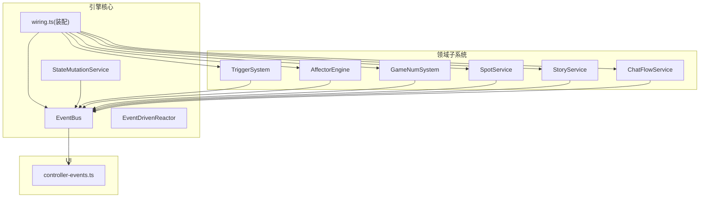
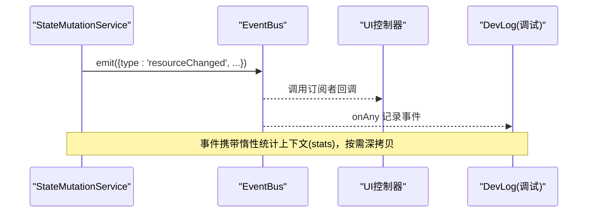
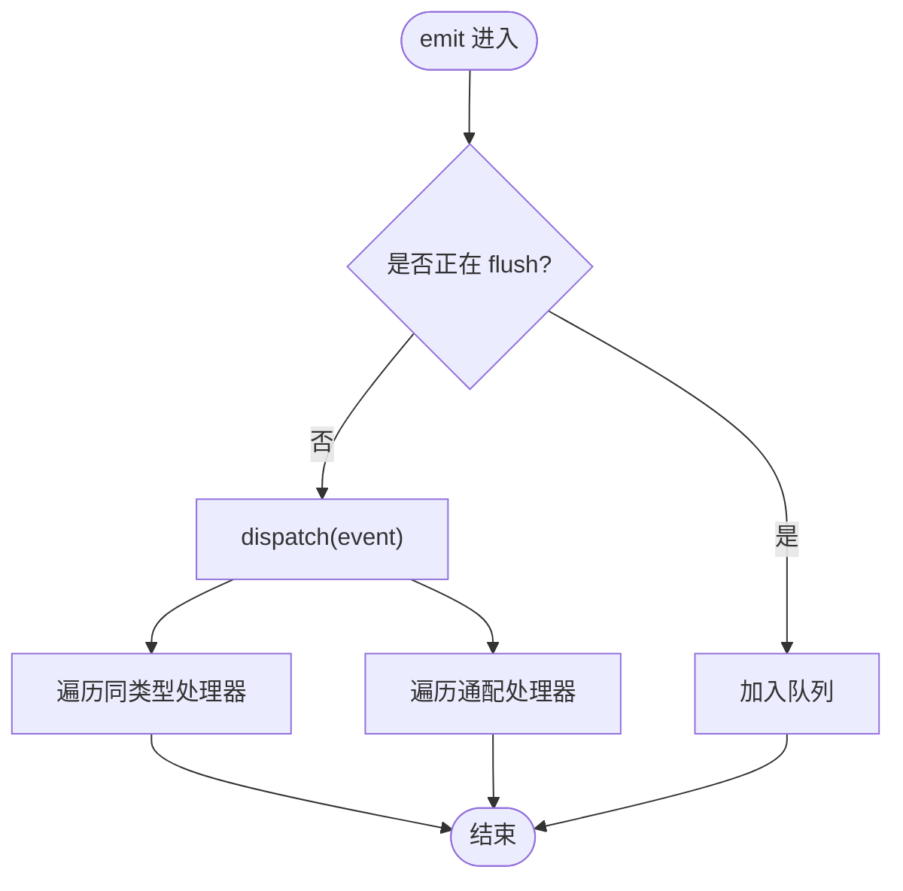
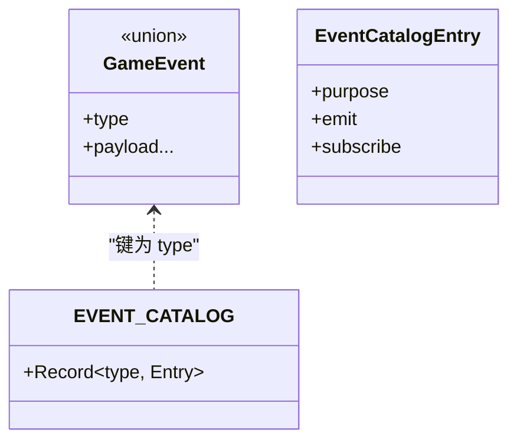
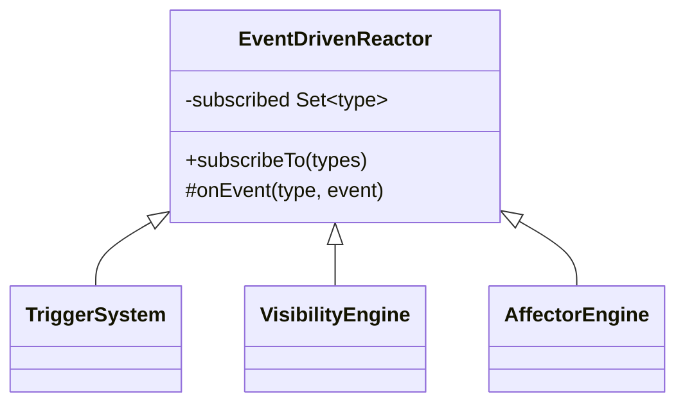
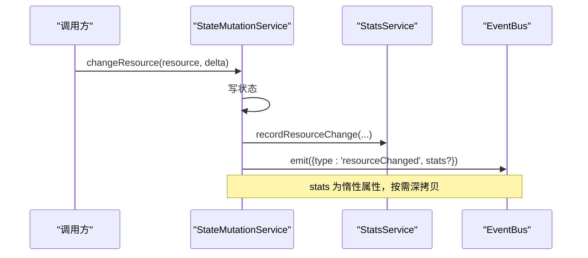
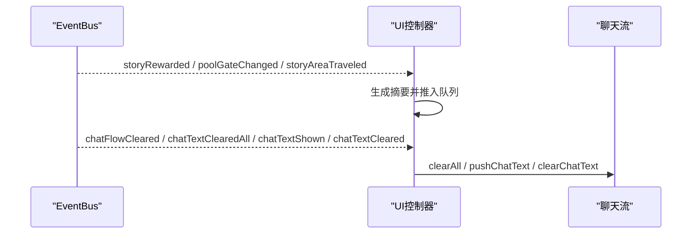
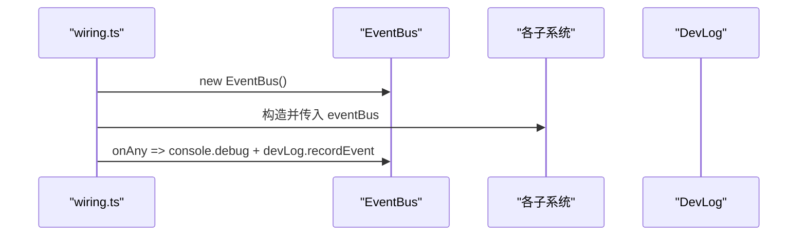
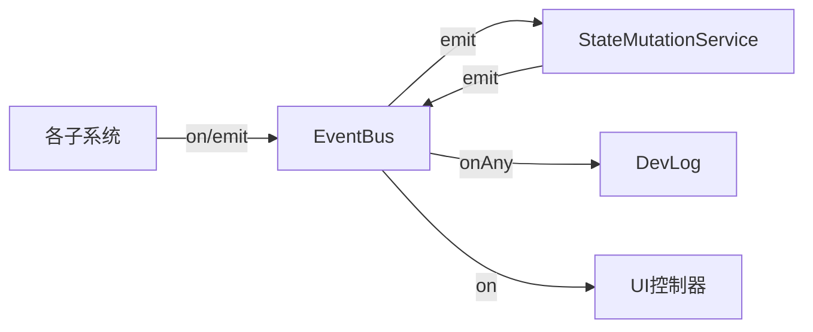

# 事件总线系统

<cite>
**本文引用的文件**
- [event-bus.ts](file://src/engine/core/event-bus.ts)
- [events.ts](file://src/engine/types/events.ts)
- [event-driven-reactor.ts](file://src/engine/effect/event-driven-reactor.ts)
- [wiring.ts](file://src/engine/game/wiring.ts)
- [controller-events.ts](file://src/ui/controller-events.ts)
- [state-mutation-service.ts](file://src/engine/system/state-mutation-service.ts)
- [stats.ts](file://src/engine/stats/stats.ts)
- [event-bus.test.ts](file://tests/engine/event-bus.test.ts)
</cite>

## 目录
1. [简介](#简介)
2. [项目结构](#项目结构)
3. [核心组件](#核心组件)
4. [架构总览](#架构总览)
5. [详细组件分析](#详细组件分析)
6. [依赖关系分析](#依赖关系分析)
7. [性能考量](#性能考量)
8. [故障排查指南](#故障排查指南)
9. [结论](#结论)
10. [附录](#附录)

## 简介
本技术文档围绕 ACProgram 的事件总线系统，系统性阐述其事件驱动架构与发布-订阅实现。内容涵盖：
- 事件类型定义与组织方式（含新增事件的规范）
- 监听器的注册、注销与生命周期管理
- 事件异步处理机制与错误传播策略
- 跨子系统通信的示例与最佳实践
- 事件调试工具、性能监控与常见问题定位

## 项目结构
事件总线位于引擎核心层，被多个子系统通过装配器集中接入，UI 层作为重要订阅方响应运行时变化。

图表来源
- [wiring.ts:61-288](file://src/engine/game/wiring.ts#L61-L288)
- [event-bus.ts:9-83](file://src/engine/core/event-bus.ts#L9-L83)
- [controller-events.ts:12-89](file://src/ui/controller-events.ts#L12-L89)

章节来源
- [wiring.ts:61-288](file://src/engine/game/wiring.ts#L61-L288)
- [event-bus.ts:9-83](file://src/engine/core/event-bus.ts#L9-L83)

## 核心组件
- EventBus：提供 on/off/onAny/emit/flush/clear 等能力，支持按类型分发与通配订阅，内置队列与批处理 flush，避免递归派发导致的栈溢出或乱序。
- GameEvent 与 EVENT_CATALOG：以联合类型枚举所有事件，并通过目录表强制约束发射方与订阅方模块，保证契约可审计与编译期穷尽检查。
- EventDrivenReactor：为需要“声明式依赖 + 分桶订阅”的子系统提供基类，禁止 onAny 全量扫描，降低匹配成本。
- StateMutationService：统一状态写入入口，在变更时发出对应事件并附带惰性统计上下文。
- wiring.ts：组合根，集中创建 EventBus 并装配各子系统，同时挂载全局 onAny 用于调试记录。
- controller-events.ts：UI 侧订阅关键事件，驱动揭示刷新、奖励排队、聊天流演出等。

章节来源
- [event-bus.ts:9-83](file://src/engine/core/event-bus.ts#L9-L83)
- [events.ts:13-166](file://src/engine/types/events.ts#L13-L166)
- [event-driven-reactor.ts:15-34](file://src/engine/effect/event-driven-reactor.ts#L15-L34)
- [state-mutation-service.ts:87-101](file://src/engine/system/state-mutation-service.ts#L87-L101)
- [wiring.ts:279-283](file://src/engine/game/wiring.ts#L279-L283)
- [controller-events.ts:12-89](file://src/ui/controller-events.ts#L12-L89)

## 架构总览
事件总线采用“强类型联合 + 目录契约 + 分桶订阅”的设计：
- 事件类型由联合类型严格限定，新增事件需同步更新目录表，否则编译失败。
- 各子系统通过 EventDrivenReactor 或显式 on(type, handler) 订阅感兴趣的事件。
- 状态变更集中在 StateMutationService 中 emit，确保事件与状态一致且带统计上下文。
- UI 通过 controller-events.ts 订阅业务事件，完成界面刷新与演出控制。

图表来源
- [state-mutation-service.ts:87-101](file://src/engine/system/state-mutation-service.ts#L87-L101)
- [wiring.ts:279-283](file://src/engine/game/wiring.ts#L279-L283)
- [controller-events.ts:12-18](file://src/ui/controller-events.ts#L12-L18)

## 详细组件分析

### EventBus：发布-订阅核心
- 功能要点
  - on(eventType, handler)：按类型注册处理器，返回取消函数。
  - onAny(handler)：通配订阅，适合调试与全局观测。
  - off(eventType, handler)：精确移除指定处理器。
  - emit(event)：若当前处于 flush 阶段则入队，否则立即派发。
  - flush()：批量派发队列中的事件，防止嵌套 emit 导致的问题。
  - dispatch(event)：先分发到具体类型处理器，再分发到通配处理器。
  - clear()：清空所有处理器与队列。
- 复杂度
  - 注册/注销：O(1)/O(n)（n 为该类型处理器数量）。
  - 派发：O(k + m)，k 为同类型处理器数，m 为通配处理器数。
- 错误处理
  - off 对未注册处理器安全无异常。
  - flush 期间 emit 仅入队，不直接派发，避免重入。

图表来源
- [event-bus.ts:47-75](file://src/engine/core/event-bus.ts#L47-L75)

章节来源
- [event-bus.ts:9-83](file://src/engine/core/event-bus.ts#L9-L83)
- [event-bus.test.ts:8-90](file://tests/engine/event-bus.test.ts#L8-L90)

### 事件类型与目录契约
- 事件类型
  - 使用联合类型定义全部事件，覆盖资源、区域、剧情、角色、色彩、聊天流等。
  - 每个事件携带必要字段，部分事件附加 stats 上下文（惰性计算）。
- 目录表
  - EVENT_CATALOG 以 type 为键，记录 purpose、emit 模块、subscribe 模块。
  - 新增/删除事件类型必须同步更新目录，否则编译期报错，保证契约可审计。

图表来源
- [events.ts:13-166](file://src/engine/types/events.ts#L13-L166)

章节来源
- [events.ts:13-166](file://src/engine/types/events.ts#L13-L166)

### 事件驱动反应器（EventDrivenReactor）
- 设计目标
  - 强制“分桶订阅”，禁止 onAny 全量扫描，降低匹配成本。
  - 子类只需实现 onEvent(type, event) 进行命中动作。
- 使用场景
  - TriggerSystem、VisibilityEngine、AffectorEngine 条件索引等。

图表来源
- [event-driven-reactor.ts:15-34](file://src/engine/effect/event-driven-reactor.ts#L15-L34)

章节来源
- [event-driven-reactor.ts:15-34](file://src/engine/effect/event-driven-reactor.ts#L15-L34)

### 状态变更与事件发射（StateMutationService）
- 职责
  - 统一 PlayerState 写入入口，确保每次变更都 emit 对应事件。
  - 事件附带惰性统计上下文 stats，仅在消费方访问时构建，减少开销。
- 典型流程
  - changeResource/setSpotLevel/acquireCharacter 等方法内部写状态 → 更新统计 → emit 事件。

图表来源
- [state-mutation-service.ts:110-123](file://src/engine/system/state-mutation-service.ts#L110-L123)
- [stats.ts:91-103](file://src/engine/stats/stats.ts#L91-L103)

章节来源
- [state-mutation-service.ts:87-101](file://src/engine/system/state-mutation-service.ts#L87-L101)
- [state-mutation-service.ts:110-123](file://src/engine/system/state-mutation-service.ts#L110-L123)
- [stats.ts:91-103](file://src/engine/stats/stats.ts#L91-L103)

### UI 订阅与演出联动（controller-events.ts）
- 订阅范围
  - onAny：触发揭示刷新（跳过 tick/spotProduced 高频事件）。
  - storyRewarded/poolGateChanged/storyAreaTraveled：奖励与解锁通知排队渲染。
  - chatFlowCleared/chatTextClearedAll/chatTextShown/chatTextCleared：聊天流演出控制。
- 行为特点
  - 将演出文本与奖励摘要推入 pendingRewardChats，等待合适时机统一渲染，保证顺序正确。

图表来源
- [controller-events.ts:12-89](file://src/ui/controller-events.ts#L12-L89)

章节来源
- [controller-events.ts:12-89](file://src/ui/controller-events.ts#L12-L89)

### 装配与全局调试（wiring.ts）
- 装配
  - 创建 EventBus，注入各子系统（EffectEngine、AffectorEngine、TickSystem、TriggerSystem、StoryService、ChatFlowService 等）。
  - 通过 RuntimeEffectReactor 将演出类 effect 请求事件转发至领域服务。
- 调试
  - 全局 onAny 记录事件到 DevLog，便于追踪事件流向与帧信息。

图表来源
- [wiring.ts:61-288](file://src/engine/game/wiring.ts#L61-L288)

章节来源
- [wiring.ts:61-288](file://src/engine/game/wiring.ts#L61-L288)

## 依赖关系分析
- 耦合与内聚
  - EventBus 低耦合，仅依赖事件类型；各子系统通过接口（事件）解耦。
  - StateMutationService 高内聚于状态变更与事件发射，屏蔽细节。
- 外部依赖
  - StatsService 提供统计上下文；DevLog 提供调试记录。
- 循环依赖
  - 通过装配器 wiring.ts 集中组装，避免循环导入。

图表来源
- [wiring.ts:279-283](file://src/engine/game/wiring.ts#L279-L283)
- [state-mutation-service.ts:87-101](file://src/engine/system/state-mutation-service.ts#L87-L101)
- [controller-events.ts:12-89](file://src/ui/controller-events.ts#L12-L89)

章节来源
- [wiring.ts:61-288](file://src/engine/game/wiring.ts#L61-L288)
- [event-bus.ts:9-83](file://src/engine/core/event-bus.ts#L9-L83)

## 性能考量
- 事件派发
  - 使用 Map 存储类型→处理器列表，查找 O(1)。
  - flush 期间 emit 入队，避免递归派发与栈溢出风险。
- 统计上下文
  - stats 为惰性属性，仅在消费方访问时深拷贝，显著降低高频事件（如 tick）的开销。
- 订阅策略
  - 推荐基于 EventDrivenReactor 的分桶订阅，避免 onAny 全量扫描带来的性能损耗。
- 批量处理
  - 对高频事件（如 tick、spotProduced），UI 侧应谨慎处理或跳过，减少渲染压力。

[本节为通用指导，不直接分析具体文件]

## 故障排查指南
- 事件未触发
  - 确认是否在 wiring.ts 中创建了 EventBus 并注入相关子系统。
  - 检查 on 的类型是否与 GameEvent 联合类型一致，避免拼写错误。
  - 查看 EVENT_CATALOG 是否正确登记 emit/subscribe 模块。
- 事件重复或丢失
  - 检查是否存在多次 on 注册或未正确 off 注销。
  - 确认是否在 flush 期间 emit，必要时使用 flush 批处理。
- 性能问题
  - 避免在 onAny 中执行昂贵逻辑；UI 已跳过 tick/spotProduced。
  - 关注 stats 惰性属性的访问点，避免不必要的深拷贝。
- 调试手段
  - 利用 wiring.ts 的全局 onAny 记录事件到 DevLog，结合帧号定位问题。
  - 使用单元测试验证事件注册、派发、off、clear 等行为。

章节来源
- [wiring.ts:279-283](file://src/engine/game/wiring.ts#L279-L283)
- [controller-events.ts:12-18](file://src/ui/controller-events.ts#L12-L18)
- [event-bus.test.ts:8-90](file://tests/engine/event-bus.test.ts#L8-L90)

## 结论
ACProgram 的事件总线以强类型联合与目录契约为核心，结合分桶订阅与惰性统计上下文，实现了高效、可审计、可扩展的事件驱动架构。通过统一的状态变更入口与装配器，子系统间松耦合协作，UI 层专注响应与演出控制。遵循本文的最佳实践与排查指南，可有效提升系统的稳定性与可维护性。

[本节为总结，不直接分析具体文件]

## 附录

### 如何定义新事件类型
- 步骤
  1. 在 GameEvent 联合类型中添加新事件分支，包含必要字段。
  2. 在 EVENT_CATALOG 中登记该事件的 purpose、emit 模块、subscribe 模块。
  3. 在发射方模块中通过 StateMutationService 或相应服务 emit 事件。
  4. 在订阅方模块中通过 on(type, handler) 或 EventDrivenReactor.subscribeTo 订阅。
  5. 编写单元测试覆盖注册、派发、off、clear 等路径。

章节来源
- [events.ts:13-166](file://src/engine/types/events.ts#L13-L166)
- [state-mutation-service.ts:87-101](file://src/engine/system/state-mutation-service.ts#L87-L101)
- [event-bus.test.ts:8-90](file://tests/engine/event-bus.test.ts#L8-L90)

### 事件监听器生命周期管理
- 注册：on(type, handler) 返回取消函数，便于组件卸载时自动注销。
- 注销：off(type, handler) 精确移除；onAny 返回的取消函数从通配列表中移除。
- 清理：clear() 清空所有处理器与队列，适用于会话切换或重置。

章节来源
- [event-bus.ts:15-44](file://src/engine/core/event-bus.ts#L15-L44)
- [event-bus.ts:77-82](file://src/engine/core/event-bus.ts#L77-L82)

### 异步处理与错误传播
- 异步：EventBus 本身同步派发，但通过 flush 实现批处理，避免重入。
- 错误传播：建议在处理器中捕获异常并上报 DevLog，避免影响后续处理器。
- 统计上下文：stats 惰性属性，仅在消费方访问时构建，减少开销。

章节来源
- [event-bus.ts:47-75](file://src/engine/core/event-bus.ts#L47-L75)
- [wiring.ts:279-283](file://src/engine/game/wiring.ts#L279-L283)
- [state-mutation-service.ts:87-101](file://src/engine/system/state-mutation-service.ts#L87-L101)

### 跨子系统通信示例
- 资源变更：StateMutationService.changeResource → EventBus.resourceChanged → 条件系统/数值系统/触发系统重算。
- 剧情奖励：StoryService → EventBus.storyRewarded → UI 排队渲染奖励摘要。
- 聊天演出：ChatFlowService → EventBus.chatTextShown → UI 显示演出文本。

章节来源
- [state-mutation-service.ts:110-123](file://src/engine/system/state-mutation-service.ts#L110-L123)
- [controller-events.ts:19-48](file://src/ui/controller-events.ts#L19-L48)
- [controller-events.ts:49-89](file://src/ui/controller-events.ts#L49-L89)