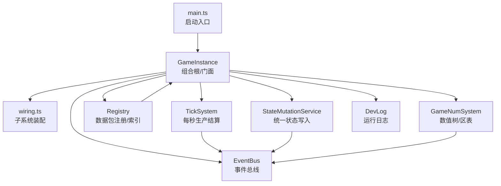
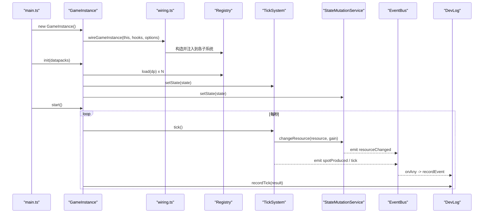
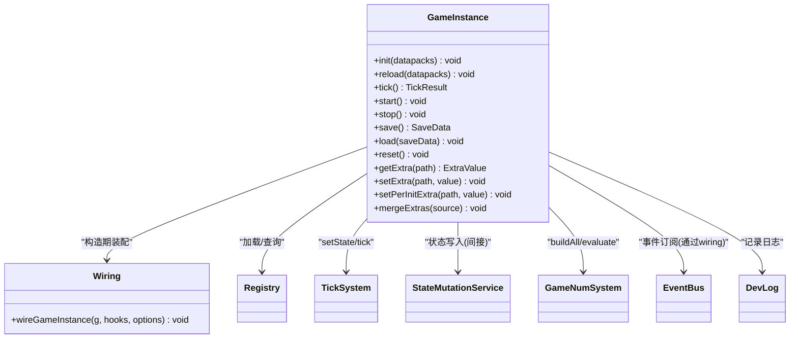
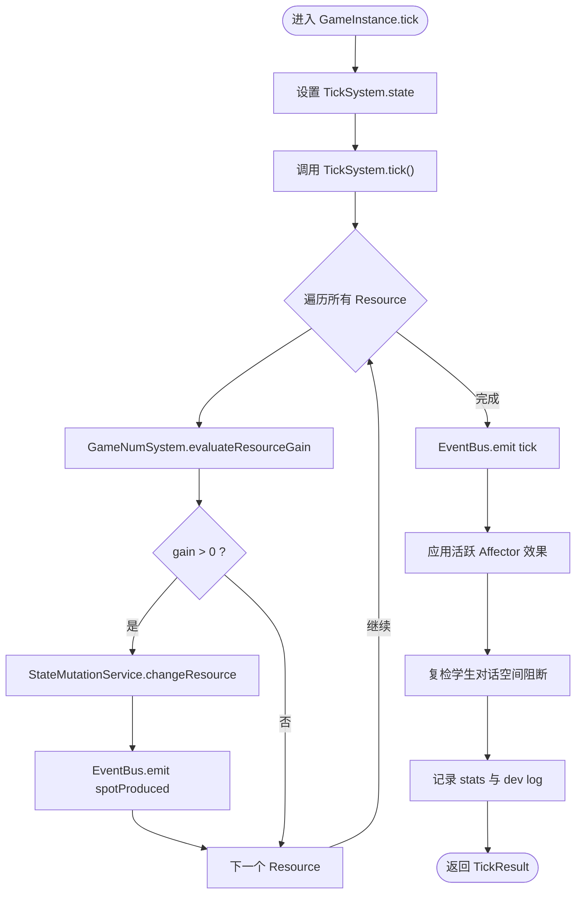
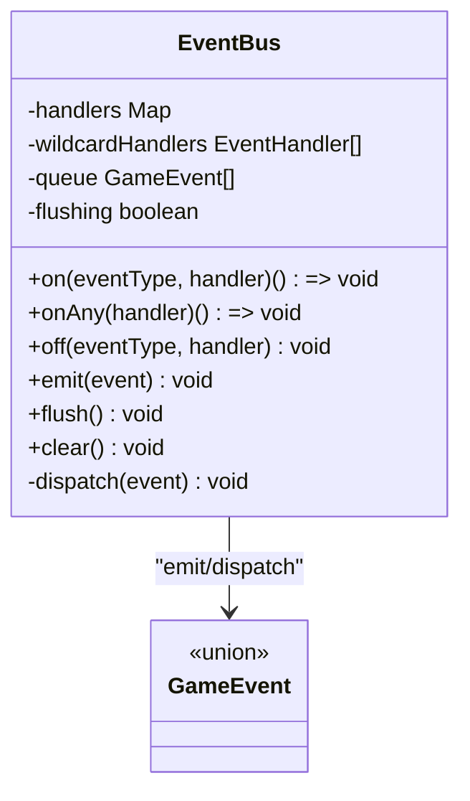
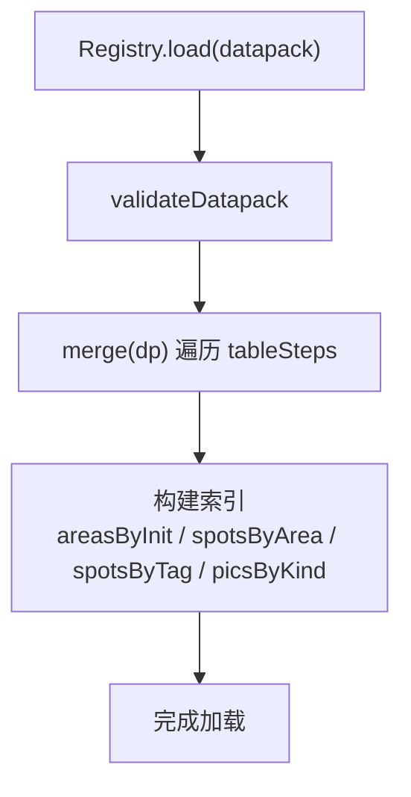
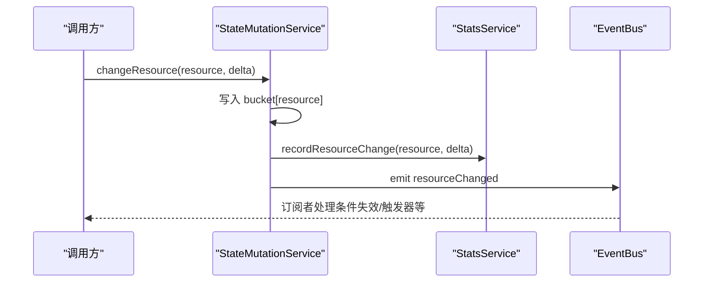
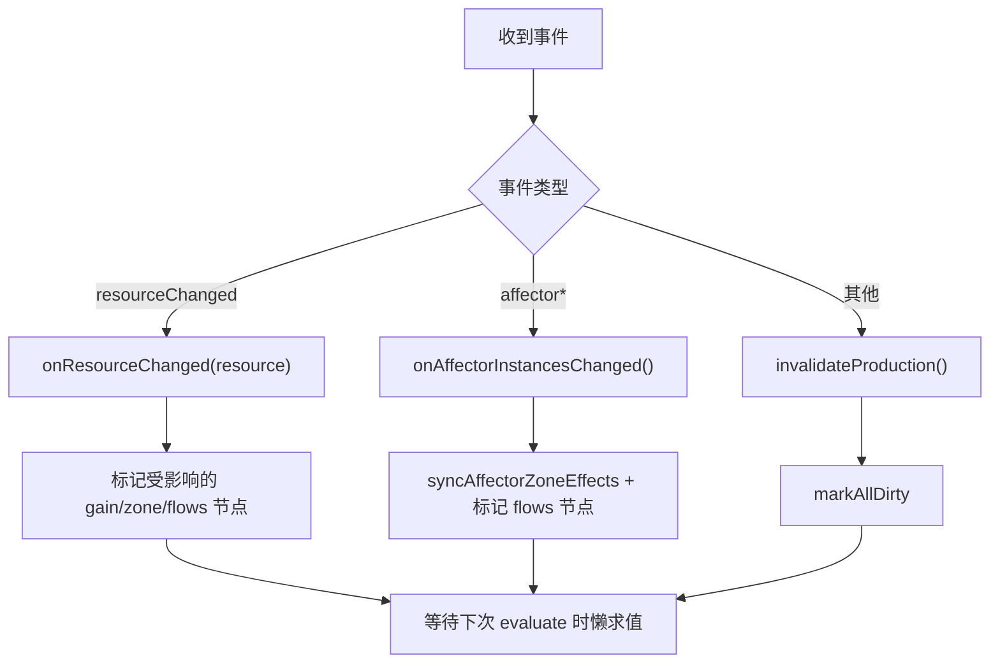
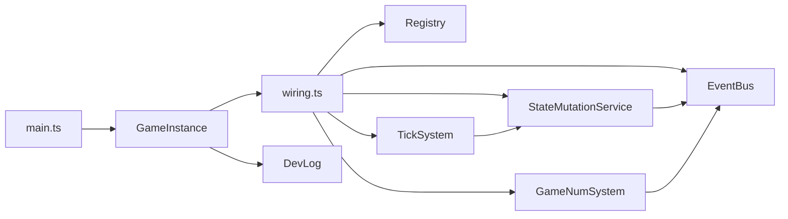

# 核心引擎

<cite>
**本文引用的文件**
- [src/engine/game-instance.ts](file://src/engine/game-instance.ts)
- [src/engine/system/tick-system.ts](file://src/engine/system/tick-system.ts)
- [src/engine/core/event-bus.ts](file://src/engine/core/event-bus.ts)
- [src/engine/registry/registry.ts](file://src/engine/registry/registry.ts)
- [src/engine/types/events.ts](file://src/engine/types/events.ts)
- [src/engine/expression/game-num.ts](file://src/engine/expression/game-num.ts)
- [src/engine/system/state-mutation-service.ts](file://src/engine/system/state-mutation-service.ts)
- [src/engine/game/wiring.ts](file://src/engine/game/wiring.ts)
- [src/engine/core/dev-log.ts](file://src/engine/core/dev-log.ts)
- [src/main.ts](file://src/main.ts)
</cite>

## 目录
1. [简介](#简介)
2. [项目结构](#项目结构)
3. [核心组件](#核心组件)
4. [架构总览](#架构总览)
5. [详细组件分析](#详细组件分析)
6. [依赖关系分析](#依赖关系分析)
7. [性能考量](#性能考量)
8. [故障排查指南](#故障排查指南)
9. [结论](#结论)
10. [附录：使用模式与示例路径](#附录使用模式与示例路径)

## 简介
本技术文档面向 ACProgram 的核心引擎，聚焦以下目标：
- GameInstance 类的设计与实现：游戏实例生命周期管理、子系统装配与初始化流程。
- Tick 系统工作机制：游戏循环、资源产出计算与性能优化策略。
- EventBus 事件系统：事件类型定义、监听器注册与分发机制。
- Registry 注册表系统：数据注册、引用管理与索引构建。
- 提供具体代码示例的使用模式（以文件路径引用代替直接粘贴代码）。
- 错误处理、调试工具与性能监控的最佳实践。

## 项目结构
ACProgram 引擎采用“组合根 + 门面”的架构：GameInstance 作为统一入口，内部通过 wiring.ts 组装各子系统；TickSystem 驱动每秒一帧的生产结算；EventBus 解耦模块通信；Registry 负责数据包加载、校验与索引；StateMutationService 统一状态变更并广播事件；DevLog 提供运行时日志与导出能力。

图表来源
- [src/main.ts:21-40](file://src/main.ts#L21-L40)
- [src/engine/game-instance.ts:118-124](file://src/engine/game-instance.ts#L118-L124)
- [src/engine/game/wiring.ts:61-287](file://src/engine/game/wiring.ts#L61-L287)
- [src/engine/system/tick-system.ts:44-61](file://src/engine/system/tick-system.ts#L44-L61)
- [src/engine/core/event-bus.ts:9-83](file://src/engine/core/event-bus.ts#L9-L83)
- [src/engine/registry/registry.ts:59-320](file://src/engine/registry/registry.ts#L59-L320)
- [src/engine/system/state-mutation-service.ts:41-101](file://src/engine/system/state-mutation-service.ts#L41-L101)
- [src/engine/expression/game-num.ts:52-140](file://src/engine/expression/game-num.ts#L52-L140)
- [src/engine/core/dev-log.ts:39-68](file://src/engine/core/dev-log.ts#L39-L68)

章节来源
- [src/main.ts:21-40](file://src/main.ts#L21-L40)
- [src/engine/game-instance.ts:118-124](file://src/engine/game-instance.ts#L118-L124)

## 核心组件
- GameInstance：组合根与门面，负责 init/reload/tick/save/load/reset/start/stop 等生命周期方法，以及 story/spot/init/items/enhancements 等业务门面。
- TickSystem：每秒推进一次 tick，遍历所有 Resource 求值 primitiveGain，写入资源并广播 spotProduced/tick 事件。
- EventBus：类型安全的事件总线，支持 on/off/onAny/emit/flush/clear，具备队列缓冲避免嵌套派发。
- Registry：数据包加载、合并、索引构建（areasByInit、spotsByArea、spotsByTag 等），并提供引用完整性校验。
- StateMutationService：统一状态写入入口，写状态 → 更新统计 → 广播事件，确保一致性。
- GameNumSystem：维护资源 primitiveGain 树、区表与 flows 节点，基于事件进行定向失效与增量重算。
- DevLog：开发期日志记录、节流汇总与导出，辅助排障。

章节来源
- [src/engine/game-instance.ts:70-164](file://src/engine/game-instance.ts#L70-L164)
- [src/engine/system/tick-system.ts:19-61](file://src/engine/system/tick-system.ts#L19-L61)
- [src/engine/core/event-bus.ts:9-83](file://src/engine/core/event-bus.ts#L9-L83)
- [src/engine/registry/registry.ts:59-320](file://src/engine/registry/registry.ts#L59-L320)
- [src/engine/system/state-mutation-service.ts:41-101](file://src/engine/system/state-mutation-service.ts#L41-L101)
- [src/engine/expression/game-num.ts:52-140](file://src/engine/expression/game-num.ts#L52-L140)
- [src/engine/core/dev-log.ts:39-68](file://src/engine/core/dev-log.ts#L39-L68)

## 架构总览
下图展示了引擎在初始化与运行时的关键交互：main 创建 GameInstance，调用 init 加载数据包并装配子系统；start 后由 SessionService 驱动每帧 tick；TickSystem 计算资源产出并通过 StateMutationService 写入状态，同时触发事件；EventBus 将事件分发给订阅者（如条件系统、触发器、可见性引擎等）；DevLog 记录关键事件与 tick 结果。

图表来源
- [src/main.ts:21-40](file://src/main.ts#L21-L40)
- [src/engine/game/wiring.ts:61-287](file://src/engine/game/wiring.ts#L61-L287)
- [src/engine/game-instance.ts:177-229](file://src/engine/game-instance.ts#L177-L229)
- [src/engine/system/tick-system.ts:44-61](file://src/engine/system/tick-system.ts#L44-L61)
- [src/engine/system/state-mutation-service.ts:110-123](file://src/engine/system/state-mutation-service.ts#L110-L123)
- [src/engine/core/event-bus.ts:47-75](file://src/engine/core/event-bus.ts#L47-L75)
- [src/engine/core/dev-log.ts:70-168](file://src/engine/core/dev-log.ts#L70-L168)

## 详细组件分析

### GameInstance 设计与实现
- 生命周期管理
  - init：加载数据包至 Registry，同步 ValueSystem/FuncletExecutor，校验 Character 引用，构建 GameNum 数值树，重建 TagStat 声明，加载角色系统，重建可见性，进入默认 Init。
  - reload：停止当前会话，清空注册表与子系统，重置运行时状态，重新 init。
  - start/stop：控制 SessionService 的 tick 循环。
  - save/load/reset：序列化/恢复 PlayerState、故事游标、聊天游标、统计数据、可见性等。
- 子系统装配
  - 通过 wiring.ts 集中创建并连接各子系统，注入回调（getState/setState/refreshVisibility）与事件订阅。
- 业务门面
  - story/spot/init/items/enhancements/charaProfiles/pics 等只读别名暴露服务方法。
- 额外数据 Extra
  - getExtra/setExtra/setPerInitExtra/mergeExtras 提供三层读取与写入（全局、per-Init、数据包常量）。

图表来源
- [src/engine/game-instance.ts:70-164](file://src/engine/game-instance.ts#L70-L164)
- [src/engine/game/wiring.ts:61-287](file://src/engine/game/wiring.ts#L61-L287)

章节来源
- [src/engine/game-instance.ts:177-229](file://src/engine/game-instance.ts#L177-L229)
- [src/engine/game-instance.ts:247-262](file://src/engine/game-instance.ts#L247-L262)
- [src/engine/game-instance.ts:280-390](file://src/engine/game-instance.ts#L280-L390)
- [src/engine/game/wiring.ts:61-287](file://src/engine/game/wiring.ts#L61-L287)

### Tick 系统工作机制
- 游戏循环
  - TICK_INTERVAL_MS = 1000ms，每秒执行一次 tick。
  - GameInstance.tick 中设置 state，调用 TickSystem.tick，应用 Affector 效果，检查学生对话空间阻断态，记录 stats 与 dev log。
- 资源产出计算
  - 遍历 GameNumSystem.getResources()，对每个 Resource 求值 primitiveGain，若 >0 则通过 StateMutationService.changeResource 写入，并广播 spotProduced。
  - 最后广播 tick 事件，返回 frame 与 productions。
- 性能优化策略
  - 资源级聚合产出，不再逐 Spot 结算，避免 capacity 截断开销。
  - 事件驱动的精确失效：resourceChanged 仅影响受该资源影响的子树，未受影响 gain 跨帧缓存。
  - 非 verbose 模式下 DevLog 节流汇总（每 30 帧或累计较大产出才记录）。

图表来源
- [src/engine/game-instance.ts:247-262](file://src/engine/game-instance.ts#L247-L262)
- [src/engine/system/tick-system.ts:44-61](file://src/engine/system/tick-system.ts#L44-L61)
- [src/engine/expression/game-num.ts:244-253](file://src/engine/expression/game-num.ts#L244-L253)
- [src/engine/system/state-mutation-service.ts:110-123](file://src/engine/system/state-mutation-service.ts#L110-L123)
- [src/engine/core/dev-log.ts:158-168](file://src/engine/core/dev-log.ts#L158-L168)

章节来源
- [src/engine/system/tick-system.ts:19-61](file://src/engine/system/tick-system.ts#L19-L61)
- [src/engine/game-instance.ts:247-262](file://src/engine/game-instance.ts#L247-L262)
- [src/engine/expression/game-num.ts:142-161](file://src/engine/expression/game-num.ts#L142-L161)
- [src/engine/core/dev-log.ts:158-168](file://src/engine/core/dev-log.ts#L158-L168)

### EventBus 事件系统
- 事件类型定义
  - GameEvent 联合类型覆盖资源变化、设施等级、经理变更、强化增删、物品收集、世界线切换、区域移动、剧情触发/完成/奖励、闲聊池 gate、tick、flag、extra、spot 产出/tag、tag 收集集合、affector 生命周期、角色差分获得/培养、色彩组/装备解锁/主题切换、聊天消息已读、抽卡结算、被动冷却、学生对话空间阻断、头像人名覆写、运行时效果请求、聊天流演出等。
  - EVENT_CATALOG 强制登记每个事件的发射方与订阅方，新增/删除事件类型需编译期穷尽匹配。
- 监听器注册与分发
  - on(eventType, handler) 返回取消注册函数；onAny(handler) 注册通配处理器；off(eventType, handler) 取消特定处理器；emit(event) 可能排队；flush() 批量派发；clear() 清除全部。
  - dispatch 先按类型查找处理器列表，再遍历通配处理器。
- 最佳实践
  - 使用 onAny 做全局记录（如 DevLog），但注意跳过高频事件（如 tick/spotProduced）以避免噪音。
  - 订阅者应幂等处理事件，避免重复副作用。

图表来源
- [src/engine/core/event-bus.ts:9-83](file://src/engine/core/event-bus.ts#L9-L83)
- [src/engine/types/events.ts:13-99](file://src/engine/types/events.ts#L13-L99)
- [src/engine/types/events.ts:121-166](file://src/engine/types/events.ts#L121-L166)

章节来源
- [src/engine/core/event-bus.ts:9-83](file://src/engine/core/event-bus.ts#L9-L83)
- [src/engine/types/events.ts:13-99](file://src/engine/types/events.ts#L13-L99)
- [src/engine/types/events.ts:121-166](file://src/engine/types/events.ts#L121-L166)

### Registry 注册表系统
- 数据注册
  - 通过 tableSteps 清单统一管理各表的 merge/clear，新增表只需添加一条 step。
  - 支持 inits、areas、spots、enhancements、stories、activeStories、passiveStories、passivePools、items、dropTables、funcletDefs、characters、characterVariants、cultivateCurves、gachaPools、colorGroups、colorEquipments、themeDesigns、chatMessages、characterPersistConfig、resourceDisplays、tags、pics、charaProfiles、extras 等。
- 引用管理与校验
  - validateCharacterRefs：校验卡池成员/featured 是否已定义差分，差分曲线是否存在，色彩装备/主题设计颜色组引用是否有效。
- 索引构建
  - areasByInit：Init → Areas 映射。
  - spotsByArea：Area → Spots 映射。
  - spotsByTag：层级标签前缀展开索引（父含子），支持运行时 tag 增撤覆盖。
  - picsByKind：图片资产按用途类别索引。
- 查询接口
  - areasOfInit、spotsOfArea、spotsOfInit、spotsWithTag、effectiveSpotTags、tagName、tagDescription、getExtra、picsOfKind、charaProfiles 等。

图表来源
- [src/engine/registry/registry.ts:528-543](file://src/engine/registry/registry.ts#L528-L543)
- [src/engine/registry/registry.ts:113-320](file://src/engine/registry/registry.ts#L113-L320)

章节来源
- [src/engine/registry/registry.ts:59-320](file://src/engine/registry/registry.ts#L59-L320)
- [src/engine/registry/registry.ts:378-408](file://src/engine/registry/registry.ts#L378-L408)
- [src/engine/registry/registry.ts:462-526](file://src/engine/registry/registry.ts#L462-L526)

### 状态变更管道（StateMutationService）
- 统一写入入口：changeResource、setSpotLevel、addEnhancement、removeEnhancement、addItem、unlockInit、setFlag、completeStory、applySpotTagChange、setCharaCustom、clearCharaCustom、recordStoryRead、setExtra/addExtra/removeExtra、applyEffects 等。
- 固定管道：写 PlayerState → 更新 StatsService → emit 事件（惰性构建 StatsContext）→ 订阅者消费。
- 幂等与安全：多处操作保证幂等（如 unlockGroup、collectEquipment、activateTheme），非法输入拒绝并返回明确结果。

图表来源
- [src/engine/system/state-mutation-service.ts:110-123](file://src/engine/system/state-mutation-service.ts#L110-L123)
- [src/engine/system/state-mutation-service.ts:87-101](file://src/engine/system/state-mutation-service.ts#L87-L101)

章节来源
- [src/engine/system/state-mutation-service.ts:110-123](file://src/engine/system/state-mutation-service.ts#L110-L123)
- [src/engine/system/state-mutation-service.ts:155-197](file://src/engine/system/state-mutation-service.ts#L155-L197)
- [src/engine/system/state-mutation-service.ts:231-319](file://src/engine/system/state-mutation-service.ts#L231-L319)
- [src/engine/system/state-mutation-service.ts:368-487](file://src/engine/system/state-mutation-service.ts#L368-L487)
- [src/engine/system/state-mutation-service.ts:526-564](file://src/engine/system/state-mutation-service.ts#L526-L564)

### 数值系统与区表（GameNumSystem）
- 职责：维护资源 primitiveGain 树、spot 子树、zone 节点、flows 节点及多种索引（parents/allNodes/zoneNodes/spotFullNodes/spotProductNodes/spotExtraNodes/areaExtraNodes/initExtraNodes/flowsNodeById）。
- 事件驱动失效：
  - enhancementAdded/Removed、spotTagChanged、spotLevelChanged、managerChanged、extraChanged、resourceChanged、affectorMounted/Unmounted/StateChanged/EntriesChanged 均触发定向失效与区表同步。
- 求值入口：evaluate、evaluateWithBreakdown、getGainNode、getResources、evaluateResourceGain、evaluateSpotYield。
- 区表路由：registerTagEffect/registerEntityEffect/removeTagEffect/removeTagEffectsBySource/syncAffectorZoneEffects。

图表来源
- [src/engine/expression/game-num.ts:112-140](file://src/engine/expression/game-num.ts#L112-L140)
- [src/engine/expression/game-num.ts:142-173](file://src/engine/expression/game-num.ts#L142-L173)
- [src/engine/expression/game-num.ts:186-259](file://src/engine/expression/game-num.ts#L186-L259)

章节来源
- [src/engine/expression/game-num.ts:52-140](file://src/engine/expression/game-num.ts#L52-L140)
- [src/engine/expression/game-num.ts:142-173](file://src/engine/expression/game-num.ts#L142-L173)
- [src/engine/expression/game-num.ts:186-259](file://src/engine/expression/game-num.ts#L186-L259)

## 依赖关系分析
- 耦合与内聚
  - GameInstance 高内聚于组合根职责，低耦合于子系统（通过 wiring 注入依赖）。
  - TickSystem 依赖 Registry/ValueSystem/GameNumSystem/EventBus/StateMutationService，职责单一。
  - EventBus 无外部状态，纯消息分发，内聚度高。
  - Registry 独立维护数据包与索引，对外提供只读视图。
- 直接/间接依赖
  - GameInstance 间接依赖 VisibilityEngine/TriggerSystem/AffectorEngine 等，通过 wiring 装配。
  - StateMutationService 依赖 StatsService 与 EventBus，所有状态变更经其发出事件。
- 外部集成点
  - main.ts 加载 baseDatapack 并启动引擎。
  - UI 层通过 window.__game 访问 GameInstance（调试与交互）。

图表来源
- [src/main.ts:21-40](file://src/main.ts#L21-L40)
- [src/engine/game/wiring.ts:61-287](file://src/engine/game/wiring.ts#L61-L287)
- [src/engine/system/tick-system.ts:44-61](file://src/engine/system/tick-system.ts#L44-L61)
- [src/engine/system/state-mutation-service.ts:110-123](file://src/engine/system/state-mutation-service.ts#L110-L123)
- [src/engine/expression/game-num.ts:112-140](file://src/engine/expression/game-num.ts#L112-L140)

章节来源
- [src/engine/game/wiring.ts:61-287](file://src/engine/game/wiring.ts#L61-L287)
- [src/engine/system/tick-system.ts:44-61](file://src/engine/system/tick-system.ts#L44-L61)
- [src/engine/system/state-mutation-service.ts:110-123](file://src/engine/system/state-mutation-service.ts#L110-L123)
- [src/engine/expression/game-num.ts:112-140](file://src/engine/expression/game-num.ts#L112-L140)

## 性能考量
- 事件驱动精确失效：resourceChanged 仅影响相关 gain/zone/flows 节点，未受影响增益跨帧缓存，降低重复计算。
- 资源级聚合产出：TickSystem 按 Resource 聚合产出，避免逐 Spot 结算的容量截断与开销。
- DevLog 节流：非 verbose 模式下每 30 帧汇总记录一次生产，减少日志 IO。
- 惰性统计上下文：StateMutationService 仅在消费方访问 event.stats 时才深拷贝 StatsContext，避免每事件急切构建开销。
- 区表与 flows 节点索引：GameNumSystem 维护多层节点索引，支持快速定位与失效传播。

[本节为通用性能讨论，不直接分析具体文件]

## 故障排查指南
- 常见问题定位
  - 资源未产出：检查 GameNumSystem 的 gains 树是否构建（init 中 buildAll），确认 resourceChanged 事件是否正确触发定向失效。
  - 剧情无法推进：检查 StoryService 的 visitedStoryInChain 条件与 passiveCooldowns 是否满足；关注 studentBlockChanged 事件。
  - 色彩/装备未解锁：确认 ColorUnlockReactor 订阅 characterAcquired/flagChanged 事件；检查 StateMutationService.unlockGroup/collectEquipment 是否被调用。
- 调试工具
  - DevLog：开启 verbose 模式记录高频细节；使用 export 导出 JSON 供离线分析。
  - 事件目录：EVENT_CATALOG 强制登记发射方/订阅方，便于审计事件契约。
- 最佳实践
  - 所有状态变更必须通过 StateMutationService，避免绕过事件导致不一致。
  - 订阅者应幂等处理事件，避免重复副作用。
  - 使用 onAny 做全局记录时，跳过 tick/spotProduced 等高噪事件。

章节来源
- [src/engine/core/dev-log.ts:39-68](file://src/engine/core/dev-log.ts#L39-L68)
- [src/engine/core/dev-log.ts:70-168](file://src/engine/core/dev-log.ts#L70-L168)
- [src/engine/types/events.ts:121-166](file://src/engine/types/events.ts#L121-L166)
- [src/engine/system/state-mutation-service.ts:87-101](file://src/engine/system/state-mutation-service.ts#L87-L101)

## 结论
ACProgram 核心引擎通过 GameInstance 组合根统一生命周期管理，TickSystem 驱动每秒生产结算，EventBus 解耦模块通信，Registry 负责数据包加载与索引，StateMutationService 保证状态一致性与事件广播，GameNumSystem 提供高性能数值求值与精确失效。整体架构清晰、职责分明，具备良好的可维护性与扩展性。配合 DevLog 与事件目录，可实现高效的调试与性能监控。

[本节为总结，不直接分析具体文件]

## 附录：使用模式与示例路径
- 启动与初始化
  - 创建 GameInstance 并传入 devLog 选项：参考 [src/main.ts:9-15](file://src/main.ts#L9-L15)
  - 加载数据包并进入默认 Init：参考 [src/main.ts:21-37](file://src/main.ts#L21-L37)
  - 启动引擎：参考 [src/main.ts:39-40](file://src/main.ts#L39-L40)
- 订阅事件
  - 使用 EventBus.on 订阅特定事件（如 resourceChanged、spotProduced）：参考 [src/engine/core/event-bus.ts:15-26](file://src/engine/core/event-bus.ts#L15-L26)
  - 使用 onAny 记录所有事件（注意节流）：参考 [src/engine/game/wiring.ts:280-283](file://src/engine/game/wiring.ts#L280-L283)
- 修改状态
  - 通过 StateMutationService.changeResource 修改资源：参考 [src/engine/system/state-mutation-service.ts:110-123](file://src/engine/system/state-mutation-service.ts#L110-L123)
  - 解锁世界线/区域/强化：参考 [src/engine/system/state-mutation-service.ts:420-427](file://src/engine/system/state-mutation-service.ts#L420-L427)、[src/engine/system/state-mutation-service.ts:368-385](file://src/engine/system/state-mutation-service.ts#L368-L385)
- 数值求值
  - 构建数值树：参考 [src/engine/game-instance.ts:194-199](file://src/engine/game-instance.ts#L194-L199)
  - 求值资源产出：参考 [src/engine/expression/game-num.ts:244-253](file://src/engine/expression/game-num.ts#L244-L253)
- 调试与导出
  - 开启 verbose 模式：参考 [src/main.ts:9-15](file://src/main.ts#L9-L15)
  - 导出日志：参考 [src/engine/core/dev-log.ts:182-191](file://src/engine/core/dev-log.ts#L182-L191)

[本节为使用模式指引，不直接分析具体文件]